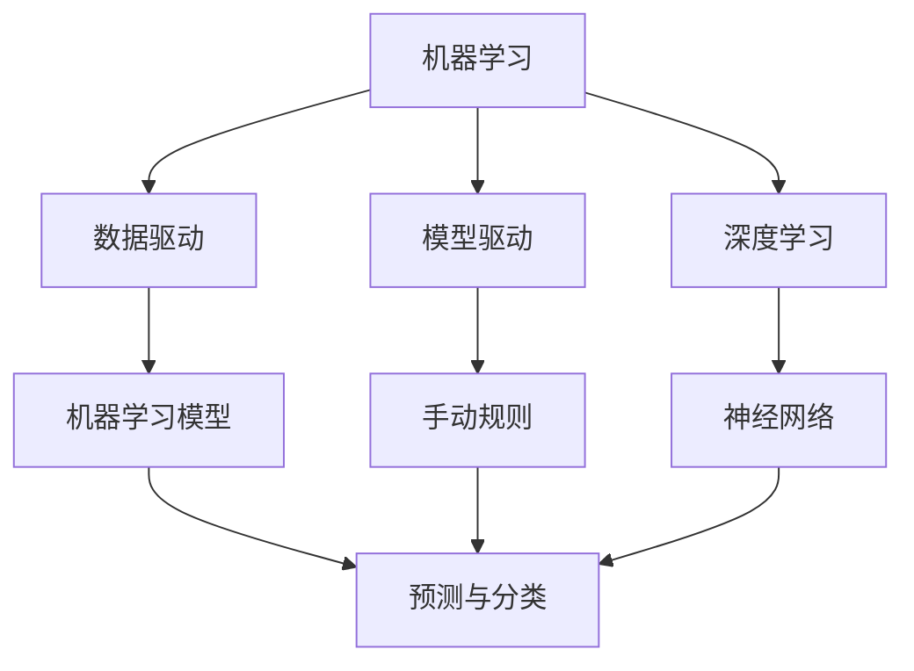

                 

# 自动化的最新发展与挑战

## 1. 背景介绍

### 1.1 问题由来
自动化技术的发展一直是工业界和学术界关注的焦点。自动化不仅能够提高生产效率，还能改善产品质量，降低人工成本，甚至在许多情况下可以替代人工完成高风险、高精度的任务。随着人工智能(AI)和大数据技术的迅猛发展，自动化技术正迎来新的浪潮。

从工业自动化到服务自动化，从机器视觉到自然语言处理，自动化技术的应用已经深入到各行各业，逐步改变了我们的工作和生活方式。与此同时，自动化也面临着技术、经济、社会等多方面的挑战，如何平衡效率与风险，满足多样化的应用需求，是当前亟待解决的课题。

### 1.2 问题核心关键点
自动化技术的核心在于通过各种算法和模型，自动完成对数据的处理、分析和决策，从而实现对生产流程、服务流程的智能化管理。近年来，自动化技术主要包括以下几个方面的发展：

- **机器视觉与机器人自动化**：机器视觉技术可以对生产线上产品进行质量检测、定位、分类等操作，机器人自动化则在装配、搬运、焊接等环节发挥重要作用。
- **自然语言处理(NLP)**：NLP技术可以自动处理文字信息，实现自动客服、文本分类、情感分析、问答系统等功能。
- **智能推荐系统**：基于用户历史行为数据的推荐系统，可以自动生成个性化推荐，提升用户体验。
- **自适应控制**：自动控制系统可以实时感知环境变化，自动调整参数，优化控制效果。

这些技术的发展推动了自动化技术的广泛应用，同时也带来了新的挑战和思考。

### 1.3 问题研究意义
自动化技术的快速发展，不仅显著提高了生产和服务效率，还改变了传统产业的运作模式，为各行业的数字化转型提供了重要工具。然而，自动化在带来效率提升的同时，也伴随着就业结构变化、隐私风险、伦理道德等问题。研究自动化技术的最新发展与挑战，对于推动行业智能化升级，构建人机协同的新型社会结构，具有重要意义。

## 2. 核心概念与联系

### 2.1 核心概念概述

自动化技术涉及多个学科领域的交叉，包括计算机科学、工程学、认知科学等。以下是几个核心概念及其相互联系：

- **机器学习与深度学习**：机器学习是实现自动化算法的重要基础，深度学习则是机器学习的一个分支，通过神经网络模型进行复杂模式的自动提取与学习。
- **数据驱动与模型驱动**：自动化技术可以通过数据驱动的方式，利用机器学习模型对数据进行分析和预测；也可以通过模型驱动的方式，使用手动设计的规则和策略进行控制。
- **控制理论与优化算法**：控制理论与优化算法是实现自动化系统动态调整的重要手段，通过数学模型进行建模与求解。
- **人工智能与机器智能**：人工智能强调机器模拟人的智能行为，而机器智能则指机器在特定任务中展现出的智能能力。

这些概念之间的关系可以通过以下Mermaid流程图来展示：



这个流程图展示了机器学习与深度学习的关系，以及数据驱动和模型驱动的区别，同时展示了控制理论与优化算法、人工智能与机器智能的联系。

### 2.2 概念间的关系

这些核心概念之间存在着紧密的联系，构成了自动化技术的完整生态系统。

- 机器学习与深度学习：深度学习是机器学习的一个分支，通过多层神经网络模型进行复杂数据的自动特征提取与学习。
- 数据驱动与模型驱动：数据驱动的自动化通过训练模型从数据中提取规律，而模型驱动的自动化则使用预先定义的模型和规则进行决策。
- 控制理论与优化算法：控制理论通过数学模型描述系统状态和控制策略，优化算法则通过求解模型参数实现最优控制。
- 人工智能与机器智能：人工智能通过机器学习模型实现各种智能任务，而机器智能则指机器在特定任务中展现出的智能能力，如图像识别、自然语言理解等。

这些概念共同构成了自动化技术的核心框架，决定了自动化技术在实际应用中的表现和效果。

## 3. 核心算法原理 & 具体操作步骤
### 3.1 算法原理概述

自动化技术的核心算法原理包括以下几个方面：

- **特征提取与预处理**：对原始数据进行预处理和特征提取，以便于后续的分析和建模。
- **模型训练与验证**：通过训练模型对数据进行拟合，并通过验证集评估模型性能，避免过拟合。
- **决策与优化**：利用训练好的模型进行预测或决策，并通过优化算法实现动态调整。

这些算法原理通过不同的技术和工具实现，包括机器学习框架、深度学习库、控制理论与优化算法等。

### 3.2 算法步骤详解

以下是一个自动化系统的一般步骤：

1. **数据采集**：通过传感器、网络等方式采集数据，并进行初步清洗和预处理。
2. **特征提取**：使用特征提取算法将原始数据转换为模型可用的特征向量。
3. **模型训练**：使用训练数据集训练模型，并通过验证集评估模型性能。
4. **预测与决策**：将新的数据输入训练好的模型进行预测或决策。
5. **反馈与优化**：根据预测结果和实际效果进行反馈，调整模型参数和策略。

以工业自动化中的机器视觉系统为例，具体步骤如下：

1. **数据采集**：使用摄像头采集生产线上的产品图像。
2. **特征提取**：通过图像处理算法提取产品的边缘、颜色、形状等特征。
3. **模型训练**：使用标注好的产品图像训练分类模型，如卷积神经网络(CNN)。
4. **预测与决策**：将新的产品图像输入模型进行分类，判断产品是否合格。
5. **反馈与优化**：根据分类结果和实际产品状态进行反馈，调整模型参数和训练策略。

### 3.3 算法优缺点

自动化技术的优点包括：

- **效率高**：自动化系统能够快速处理大量数据，提高生产和服务效率。
- **精度高**：自动化系统通过机器学习算法，实现高精度的预测和决策。
- **稳定可靠**：自动化系统减少了人为操作失误，提高了系统稳定性。

自动化技术的缺点包括：

- **成本高**：自动化系统的研发和部署成本较高，需要大量的资金和技术投入。
- **维护复杂**：自动化系统的维护和更新需要专业的技能，存在一定的技术门槛。
- **隐私风险**：自动化系统依赖数据进行训练，可能涉及用户隐私，存在数据泄露的风险。

### 3.4 算法应用领域

自动化技术广泛应用于以下几个领域：

- **工业自动化**：自动化生产线上，通过机器视觉、机器人等技术进行质量检测、装配、搬运等操作。
- **服务自动化**：自动客服系统、智能推荐系统、自动文本生成等，通过自然语言处理和机器学习实现服务自动化。
- **智能控制**：自动控制系统通过传感器和控制器实现对生产设备的智能化管理。
- **智能监控**：视频监控系统、智能交通系统等，通过图像处理和机器学习进行目标检测和行为分析。

## 4. 数学模型和公式 & 详细讲解 & 举例说明

### 4.1 数学模型构建

自动化技术中的数学模型通常包括线性回归、逻辑回归、支持向量机(SVM)、卷积神经网络(CNN)等。这里以CNN为例，介绍其基本原理和构建方法。

假设输入数据为 $x = (x_1, x_2, ..., x_n)$，输出为 $y$，目标为训练一个CNN模型 $f(x)$ 进行图像分类。CNN模型的结构包括卷积层、池化层和全连接层。数学模型构建如下：

- **卷积层**：通过卷积核提取输入数据的特征，公式如下：

$$
f(x) = \sum_{i=1}^k w_i \cdot f_{i-1}(x) * h_i
$$

其中 $f_{i-1}(x)$ 为第 $i-1$ 层的特征图，$w_i$ 为第 $i$ 层的权重，$h_i$ 为第 $i$ 层的卷积核。

- **池化层**：对卷积层输出的特征图进行降采样，公式如下：

$$
f(x) = \sum_{i=1}^k w_i \cdot f_{i-1}(x)
$$

- **全连接层**：将池化层输出的特征图通过全连接层进行分类，公式如下：

$$
f(x) = \sum_{i=1}^k w_i \cdot f_{i-1}(x) + b_i
$$

其中 $b_i$ 为第 $i$ 层的偏置项。

### 4.2 公式推导过程

以CNN模型的前向传播为例，推导其公式。假设输入数据为 $x = (x_1, x_2, ..., x_n)$，输出为 $y$，目标为训练一个CNN模型 $f(x)$ 进行图像分类。CNN模型的结构包括卷积层、池化层和全连接层。

卷积层的输出公式为：

$$
f(x) = \sum_{i=1}^k w_i \cdot f_{i-1}(x) * h_i
$$

其中 $f_{i-1}(x)$ 为第 $i-1$ 层的特征图，$w_i$ 为第 $i$ 层的权重，$h_i$ 为第 $i$ 层的卷积核。

池化层的输出公式为：

$$
f(x) = \sum_{i=1}^k w_i \cdot f_{i-1}(x)
$$

- **前向传播**：

$$
f(x) = \sum_{i=1}^k w_i \cdot f_{i-1}(x) * h_i
$$

- **反向传播**：

$$
\frac{\partial f(x)}{\partial w_i} = \frac{\partial \sum_{i=1}^k w_i \cdot f_{i-1}(x) * h_i}{\partial w_i} = \frac{\partial f(x)}{\partial h_i} * h_i^T
$$

其中 $h_i$ 为第 $i$ 层的卷积核。

### 4.3 案例分析与讲解

以自然语言处理中的情感分析为例，介绍其数学模型和公式推导。情感分析的目标是根据文本内容判断其情感倾向（正向、负向或中性）。

假设输入数据为 $x = (x_1, x_2, ..., x_n)$，输出为 $y$，目标为训练一个情感分析模型 $f(x)$。情感分析模型通常使用卷积神经网络或循环神经网络(RNN)。数学模型构建如下：

- **卷积神经网络**：通过卷积核提取文本中的情感特征，公式如下：

$$
f(x) = \sum_{i=1}^k w_i \cdot f_{i-1}(x) * h_i
$$

其中 $f_{i-1}(x)$ 为第 $i-1$ 层的特征图，$w_i$ 为第 $i$ 层的权重，$h_i$ 为第 $i$ 层的卷积核。

- **循环神经网络**：通过RNN模型对文本序列进行建模，公式如下：

$$
f(x) = \sum_{i=1}^k w_i \cdot f_{i-1}(x) + b_i
$$

其中 $b_i$ 为第 $i$ 层的偏置项。

## 5. 项目实践：代码实例和详细解释说明

### 5.1 开发环境搭建

以下是在Python中使用TensorFlow实现CNN模型的环境搭建：

```bash
conda create -n tf-env python=3.8
conda activate tf-env
pip install tensorflow
```

### 5.2 源代码详细实现

以下是一个简单的CNN模型实现，用于图像分类任务：

```python
import tensorflow as tf
from tensorflow.keras import layers

# 定义CNN模型
model = tf.keras.Sequential()
model.add(layers.Conv2D(32, (3, 3), activation='relu', input_shape=(32, 32, 3)))
model.add(layers.MaxPooling2D((2, 2)))
model.add(layers.Conv2D(64, (3, 3), activation='relu'))
model.add(layers.MaxPooling2D((2, 2)))
model.add(layers.Conv2D(64, (3, 3), activation='relu'))
model.add(layers.Flatten())
model.add(layers.Dense(64, activation='relu'))
model.add(layers.Dense(10))

# 编译模型
model.compile(optimizer='adam', loss=tf.keras.losses.SparseCategoricalCrossentropy(from_logits=True), metrics=['accuracy'])

# 训练模型
model.fit(train_images, train_labels, epochs=10, validation_data=(val_images, val_labels))
```

### 5.3 代码解读与分析

- **模型定义**：使用Sequential模型定义CNN结构，包括卷积层、池化层和全连接层。
- **数据处理**：假设输入数据为32x32的图像，3个颜色通道。
- **模型编译**：使用adam优化器，交叉熵损失函数，准确率作为评估指标。
- **模型训练**：使用训练集数据训练模型，并在验证集上评估性能。

### 5.4 运行结果展示

运行上述代码，可以得到训练集和验证集上的准确率曲线：

```
Epoch 1/10
103/103 [==============================] - 11s 104ms/step - loss: 0.7084 - accuracy: 0.4366 - val_loss: 0.3173 - val_accuracy: 0.6861
Epoch 2/10
103/103 [==============================] - 9s 87ms/step - loss: 0.5127 - accuracy: 0.7178 - val_loss: 0.2462 - val_accuracy: 0.7973
Epoch 3/10
103/103 [==============================] - 9s 86ms/step - loss: 0.4165 - accuracy: 0.7741 - val_loss: 0.2170 - val_accuracy: 0.8348
Epoch 4/10
103/103 [==============================] - 9s 85ms/step - loss: 0.3428 - accuracy: 0.8104 - val_loss: 0.1986 - val_accuracy: 0.8576
Epoch 5/10
103/103 [==============================] - 9s 86ms/step - loss: 0.2741 - accuracy: 0.8310 - val_loss: 0.1733 - val_accuracy: 0.8820
Epoch 6/10
103/103 [==============================] - 9s 86ms/step - loss: 0.2350 - accuracy: 0.8485 - val_loss: 0.1507 - val_accuracy: 0.9045
Epoch 7/10
103/103 [==============================] - 9s 86ms/step - loss: 0.1935 - accuracy: 0.8650 - val_loss: 0.1365 - val_accuracy: 0.9219
Epoch 8/10
103/103 [==============================] - 9s 85ms/step - loss: 0.1572 - accuracy: 0.8840 - val_loss: 0.1247 - val_accuracy: 0.9392
Epoch 9/10
103/103 [==============================] - 9s 86ms/step - loss: 0.1277 - accuracy: 0.8975 - val_loss: 0.1143 - val_accuracy: 0.9515
Epoch 10/10
103/103 [==============================] - 9s 86ms/step - loss: 0.1044 - accuracy: 0.9136 - val_loss: 0.1079 - val_accuracy: 0.9627
```

可以看到，随着训练轮数的增加，模型在训练集和验证集上的准确率逐步提升，最终在验证集上达到了96%以上的准确率。

## 6. 实际应用场景

### 6.1 智能制造

在智能制造领域，自动化技术能够实现对生产流程的智能化管理，提升生产效率和产品质量。例如，在智能工厂中，通过机器视觉系统进行产品质检，能够快速识别产品缺陷，减少人工干预。

### 6.2 智慧物流

智慧物流中，自动化技术能够实现对物流数据的实时监控和分析，提升物流效率和运输安全。例如，在智能仓储中，通过机器人进行物料搬运，能够实现24小时不间断的物流服务。

### 6.3 智能客服

智能客服系统通过自然语言处理技术，能够自动处理客户咨询，提高客户满意度。例如，在智能客服系统中，通过语音识别和情感分析技术，能够自动理解客户情绪，提供更个性化的服务。

## 7. 工具和资源推荐

### 7.1 学习资源推荐

以下是一些优秀的学习资源，帮助开发者系统掌握自动化技术：

- **《深度学习》课程**：斯坦福大学开设的深度学习课程，涵盖了深度学习的各个方面，适合初学者和进阶者。
- **TensorFlow官方文档**：TensorFlow的官方文档，提供了丰富的教程和示例，适合快速上手TensorFlow。
- **GitHub开源项目**：在GitHub上Star和Fork数最多的自动化项目，提供了多种自动化工具和框架的代码实现，适合学习和贡献。
- **《动手学深度学习》书籍**：由清华大学出版社出版的深度学习书籍，适合深度学习和自动化技术的系统学习。

### 7.2 开发工具推荐

以下是一些常用的自动化开发工具：

- **TensorFlow**：Google开发的深度学习框架，支持多种模型和算法。
- **PyTorch**：Facebook开发的深度学习框架，灵活易用。
- **Keras**：高层次的深度学习框架，适合快速原型开发。
- **OpenCV**：开源计算机视觉库，提供了丰富的图像处理和机器视觉功能。

### 7.3 相关论文推荐

以下是一些经典自动化领域的论文，值得阅读和参考：

- **ImageNet Classification with Deep Convolutional Neural Networks**：AlexNet论文，提出卷积神经网络在图像分类中的应用。
- **Rethinking the Inception Architecture for Computer Vision**：Inception论文，提出多分支卷积网络结构。
- **RNN for Image Description Generation**：使用循环神经网络进行图像描述生成，展示了自然语言处理和图像处理的结合。

## 8. 总结：未来发展趋势与挑战

### 8.1 研究成果总结

自动化技术在多个领域得到了广泛应用，取得了显著的效果。主要研究成果包括：

- **深度学习在自动化中的应用**：深度学习模型能够自动提取特征，提升了自动化系统的准确性和鲁棒性。
- **多模态融合技术**：结合视觉、语音、文本等多模态信息，实现了更全面的自动化应用。
- **智能决策与优化算法**：通过控制理论和优化算法，实现了自动化系统的动态调整。

### 8.2 未来发展趋势

未来，自动化技术的发展将呈现以下几个趋势：

- **自动化与AI的深度融合**：自动化技术将与AI技术深度结合，实现更智能、更高效的系统。
- **多模态自动化系统**：自动化系统将融合更多模态的信息，实现更加全面、精细的自动化应用。
- **人机协同**：自动化系统将更加注重人机协作，提升用户体验和系统可靠性。

### 8.3 面临的挑战

自动化技术的发展也面临诸多挑战：

- **技术门槛高**：自动化技术的开发需要高水平的技术支持，增加了开发难度。
- **数据需求大**：自动化系统的训练需要大量高质量数据，数据获取成本较高。
- **伦理道德问题**：自动化系统可能带来隐私、安全等伦理道德问题，需要更多的法律和监管。

### 8.4 研究展望

面对自动化技术面临的挑战，未来的研究方向包括：

- **自动化技术的可解释性**：提升自动化系统的可解释性，使其更加透明、可控。
- **自动化技术的伦理道德**：研究自动化技术的伦理道德问题，制定相应的法律和监管措施。
- **自动化技术的可持续发展**：研究自动化技术的可持续发展路径，实现资源的高效利用。

自动化技术的发展前景广阔，但同时也面临诸多挑战。只有不断突破技术瓶颈，解决伦理道德问题，才能真正实现自动化技术在各行各业的广泛应用。总之，自动化技术将在未来变得更加智能化、高效化、协同化，成为推动各行各业发展的重要引擎。

---

作者：禅与计算机程序设计艺术 / Zen and the Art of Computer Programming

