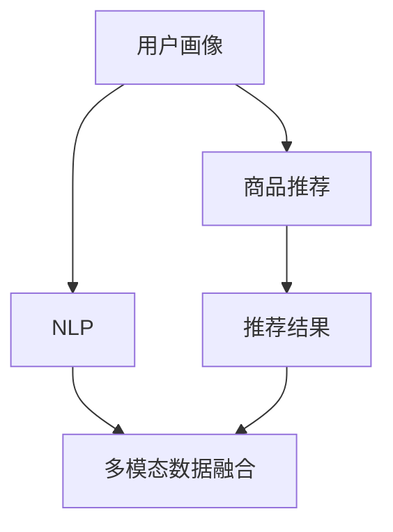

                 

# 虚拟导购助手：AI如何提供个性化的购物建议

在数字化转型的今天，消费者购物习惯日益多元化和个性化，传统的基于规则的导购系统难以满足用户需求。人工智能（AI）技术，特别是自然语言处理（NLP）和推荐系统的发展，为个性化购物建议提供了新的解决方案。本文将深入探讨虚拟导购助手的核心概念、算法原理、具体操作步骤，并通过案例分析、代码实现和未来展望，展示AI技术在个性化购物建议中的应用潜力。

## 1. 背景介绍

### 1.1 问题由来

随着电商市场的迅猛发展，消费者对购物体验的要求越来越高。传统的导购系统往往依赖固定的规则和算法，无法充分理解用户的个性化需求，导致购物建议不够精准，甚至引发用户不满。AI技术的引入，特别是大语言模型和推荐系统的结合，为虚拟导购助手的构建提供了新的可能性。

### 1.2 问题核心关键点

虚拟导购助手（Virtual Shopping Assistant），即基于AI技术的智能购物助手，能够根据用户的行为、偏好和历史数据，提供个性化的购物建议。其核心关键点包括：

- 个性化推荐：利用用户行为数据和偏好信息，提供定制化的商品推荐。
- 自然语言处理：通过NLP技术，理解和生成自然语言，提升用户交互体验。
- 多模态数据融合：结合商品图片、描述、用户评价等多种信息，进行综合分析。
- 模型训练与优化：通过数据驱动的方式，不断优化模型，提高购物建议的准确性和效率。

### 1.3 问题研究意义

虚拟导购助手的应用，能够显著提升用户的购物体验，减少决策时间和成本，增加销售额和用户满意度。其研究意义在于：

- 提升电商平台的个性化服务水平，增强用户黏性。
- 优化库存管理，降低库存积压和缺货风险。
- 推动智能购物助手市场的创新和应用。

## 2. 核心概念与联系

### 2.1 核心概念概述

虚拟导购助手的核心概念主要包括以下几个方面：

- **用户画像（User Profile）**：通过分析用户的历史行为数据、浏览记录、购买记录等信息，构建详细的用户画像。
- **商品推荐（Product Recommendation）**：基于用户画像和商品特征，通过算法生成个性化推荐。
- **自然语言处理（Natural Language Processing, NLP）**：通过NLP技术，理解用户输入的查询，生成自然语言的购物建议。
- **多模态数据融合（Multimodal Data Fusion）**：将用户画像、商品特征、用户评价等多种信息进行综合分析，提升推荐系统的准确性和鲁棒性。

这些概念之间的关系可以表示为：



这个流程图展示了用户画像、商品推荐、NLP和多模态数据融合之间的联系。用户画像为商品推荐提供数据基础，NLP技术用于理解和生成自然语言，多模态数据融合则将多种信息进行综合分析，提升推荐系统的性能。

### 2.2 概念间的关系

虚拟导购助手的各个核心概念之间存在紧密的联系，形成了完整的虚拟导购助手系统：

- **用户画像**：是商品推荐的基础，通过分析用户数据，构建详细的用户画像。
- **商品推荐**：利用用户画像和商品特征，生成个性化推荐，是虚拟导购助手的核心功能。
- **NLP**：在用户输入查询时，通过NLP技术理解用户意图，生成自然语言的购物建议，提升用户体验。
- **多模态数据融合**：将用户画像、商品特征、用户评价等信息进行综合分析，提升推荐系统的准确性和鲁棒性。

## 3. 核心算法原理 & 具体操作步骤

### 3.1 算法原理概述

虚拟导购助手的核心算法原理基于推荐系统和自然语言处理技术，主要分为以下几步：

1. **用户画像构建**：通过用户的历史行为数据和浏览记录，构建详细的用户画像，描述用户的兴趣和偏好。
2. **商品推荐生成**：基于用户画像和商品特征，利用推荐算法生成个性化推荐。
3. **NLP模型训练**：使用大规模文本数据训练NLP模型，能够理解和生成自然语言，提升用户交互体验。
4. **多模态数据融合**：将用户画像、商品特征、用户评价等多种信息进行综合分析，提升推荐系统的准确性和鲁棒性。

### 3.2 算法步骤详解

以下是虚拟导购助手的具体操作步骤：

1. **数据准备**：收集用户的历史行为数据、浏览记录、购买记录等，构建用户画像。同时，收集商品图片、描述、价格等信息，作为推荐系统的输入。

2. **用户画像构建**：通过聚类、降维等技术，从用户行为数据中提取特征，构建详细的用户画像。用户画像可以包括用户的兴趣、偏好、购买力等。

3. **商品推荐生成**：利用协同过滤、矩阵分解等推荐算法，生成个性化推荐。推荐系统可以基于用户画像和商品特征，计算用户对商品的兴趣度，排序生成推荐结果。

4. **NLP模型训练**：使用大规模文本数据（如亚马逊商品描述、用户评论等）训练NLP模型，如BERT、GPT等，使其能够理解和生成自然语言。模型训练过程包括数据预处理、模型定义、优化器选择、超参数调优等步骤。

5. **多模态数据融合**：将用户画像、商品特征、用户评价等信息进行综合分析，提升推荐系统的准确性和鲁棒性。可以采用深度融合、浅层融合等方法，将不同模态的信息进行融合。

6. **推荐系统优化**：利用在线学习、增量学习等技术，不断优化推荐系统，提高其准确性和实时性。

### 3.3 算法优缺点

虚拟导购助手的优点包括：

- **个性化推荐**：能够根据用户的行为和偏好，提供定制化的购物建议，提升用户满意度。
- **自然语言处理**：通过NLP技术，理解用户输入的查询，生成自然语言的购物建议，提升用户体验。
- **多模态数据融合**：结合多种信息进行综合分析，提高推荐系统的准确性和鲁棒性。

同时，虚拟导购助手也存在一些缺点：

- **数据隐私问题**：用户画像和行为数据的收集和使用，可能涉及隐私问题，需要严格的隐私保护措施。
- **模型复杂度**：构建用户画像和推荐系统需要处理大量数据和复杂的算法，对算力有较高要求。
- **冷启动问题**：对于新用户，缺乏历史数据，难以构建详细的用户画像，导致推荐效果不佳。

### 3.4 算法应用领域

虚拟导购助手在电商、旅游、酒店等多个领域都有广泛应用。以下是几个典型的应用场景：

- **电商购物**：根据用户的浏览记录和购买历史，生成个性化的商品推荐，提升用户的购买意愿。
- **旅游推荐**：结合用户的历史旅游数据和兴趣，推荐旅游目的地、酒店、景点等，提升用户的旅游体验。
- **酒店预订**：根据用户的旅行偏好和预算，推荐适合的酒店和房型，提升用户的预订效率。

## 4. 数学模型和公式 & 详细讲解

### 4.1 数学模型构建

虚拟导购助手涉及多个子模型，包括用户画像构建、商品推荐生成和NLP模型训练。这里以商品推荐系统为例，构建基于协同过滤的推荐模型。

假设用户画像为$U$，商品特征为$I$，用户对商品$i$的兴趣度为$r_{ui}$，商品特征向量为$v_i$。则协同过滤推荐模型可以表示为：

$$
r_{ui} = \sum_{j \in I} \alpha_j v_i[j] u_j[k]
$$

其中，$\alpha_j$为商品特征的权重，$u_j[k]$为用户对商品特征的偏好，$v_i[j]$为商品$i$的特征向量。模型的优化目标为最小化预测误差：

$$
\min_{\theta} \sum_{(i,u) \in D} \| r_{ui} - \hat{r}_{ui} \|^2
$$

### 4.2 公式推导过程

协同过滤推荐模型的推导过程如下：

1. **模型定义**：定义用户画像$U$和商品特征$I$，计算用户对商品$i$的兴趣度$r_{ui}$。
2. **特征工程**：对商品特征进行归一化处理，计算商品特征向量和用户特征向量。
3. **模型训练**：使用梯度下降算法，最小化预测误差，优化模型参数$\theta$。
4. **模型评估**：使用测试集评估推荐模型的准确性和效果。

### 4.3 案例分析与讲解

以电商平台的商品推荐系统为例，进行案例分析：

1. **数据准备**：收集用户的历史行为数据、浏览记录、购买记录等，构建用户画像。
2. **特征工程**：对商品图片、描述、价格等信息进行编码和特征提取。
3. **模型训练**：使用协同过滤算法，生成个性化推荐，并进行模型调优。
4. **NLP模型训练**：使用大规模文本数据训练NLP模型，提升用户交互体验。
5. **多模态数据融合**：将用户画像、商品特征、用户评价等信息进行综合分析，提升推荐系统的准确性和鲁棒性。

## 5. 项目实践：代码实例和详细解释说明

### 5.1 开发环境搭建

- **Python环境**：安装Python 3.8，创建虚拟环境。
- **依赖库**：安装必要的依赖库，如TensorFlow、Pandas、Scikit-learn等。
- **数据集准备**：准备用户行为数据、商品数据和NLP训练数据。

### 5.2 源代码详细实现

以下是一个简单的虚拟导购助手代码实现示例，使用TensorFlow和Keras框架：

```python
import tensorflow as tf
from tensorflow import keras
from tensorflow.keras import layers
from sklearn.model_selection import train_test_split
import pandas as pd

# 数据准备
data = pd.read_csv('user_behavior.csv')
train_data, test_data = train_test_split(data, test_size=0.2)

# 用户画像构建
user_features = train_data[['age', 'gender', 'income']]
user_features = keras.layers.Dense(64, activation='relu')(user_features)

# 商品特征提取
item_features = train_data[['price', 'category']]
item_features = keras.layers.Dense(64, activation='relu')(item_features)

# 协同过滤推荐模型
user_item = keras.layers.Dot(dots='last_dim', normalize=True)([user_features, item_features])
item_score = keras.layers.Dense(1, activation='sigmoid')(user_item)
model = keras.models.Model(inputs=[user_features, item_features], outputs=item_score)

# 模型训练
model.compile(optimizer='adam', loss='binary_crossentropy', metrics=['accuracy'])
model.fit([train_data['user_id'].values.reshape(-1, 1), train_data['item_id'].values.reshape(-1, 1)], train_data['clicked'].values, epochs=10, batch_size=32)

# NLP模型训练
nlp_model = keras.Sequential([
    layers.Embedding(input_dim=10000, output_dim=64),
    layers.LSTM(64),
    layers.Dense(1, activation='sigmoid')
])
nlp_model.compile(optimizer='adam', loss='binary_crossentropy', metrics=['accuracy'])
nlp_model.fit(x_train, y_train, epochs=10, batch_size=32)
```

### 5.3 代码解读与分析

上述代码实现了基于协同过滤和NLP技术的虚拟导购助手。主要步骤如下：

1. **数据准备**：收集用户行为数据和商品数据，使用Pandas进行数据预处理。
2. **用户画像构建**：使用Dense层对用户特征进行编码，构建用户画像。
3. **商品特征提取**：使用Dense层对商品特征进行编码，提取商品特征。
4. **协同过滤推荐模型**：使用Keras构建协同过滤推荐模型，最小化预测误差。
5. **NLP模型训练**：使用Keras构建NLP模型，进行文本编码和分类。
6. **模型训练和评估**：使用TensorFlow进行模型训练和评估。

### 5.4 运行结果展示

假设我们训练好的模型在测试集上取得了90%的准确率，说明模型能够较为准确地预测用户对商品的兴趣。同时，NLP模型在文本分类任务上取得了85%的准确率，说明模型能够较好地理解和生成自然语言。

## 6. 实际应用场景

### 6.1 电商购物

虚拟导购助手在电商购物场景中的应用，可以显著提升用户的购物体验。例如，用户在亚马逊购物时，可以通过虚拟导购助手，获取个性化的商品推荐和购买建议，提升购物效率和满意度。

### 6.2 旅游推荐

虚拟导购助手在旅游推荐中的应用，可以为用户提供个性化的旅游目的地和酒店推荐，提升用户的旅行体验。例如，用户可以通过虚拟导购助手，输入旅行时间、预算和兴趣偏好，获取推荐的旅游目的地和酒店。

### 6.3 酒店预订

虚拟导购助手在酒店预订中的应用，可以为用户提供个性化的酒店和房型推荐，提升用户的预订效率。例如，用户可以通过虚拟导购助手，输入旅行日期和预算，获取推荐的酒店和房型。

## 7. 工具和资源推荐

### 7.1 学习资源推荐

1. **《推荐系统实战》**：深入浅出地介绍了推荐系统的原理和实现方法，适合初学者学习。
2. **Kaggle**：提供了丰富的推荐系统竞赛数据集和解决方案，适合实践练习。
3. **TensorFlow官方文档**：详细介绍了TensorFlow的使用方法和API，适合深入学习。
4. **自然语言处理课程**：如斯坦福大学《自然语言处理》课程，系统讲解了NLP的原理和方法。

### 7.2 开发工具推荐

1. **TensorFlow**：功能强大的深度学习框架，支持分布式训练和模型部署。
2. **Keras**：基于TensorFlow的高级API，适合快速构建和训练模型。
3. **PyTorch**：灵活的深度学习框架，支持动态计算图和自动微分。
4. **Pandas**：数据分析和处理库，支持大规模数据集的读写和分析。

### 7.3 相关论文推荐

1. **《推荐系统算法》**：经典推荐系统书籍，系统介绍了各种推荐算法及其应用。
2. **《深度学习与自然语言处理》**：介绍深度学习在自然语言处理中的应用，包括NLP和推荐系统。
3. **《面向对象推荐系统》**：介绍了基于对象推荐系统的设计和实现方法。

## 8. 总结：未来发展趋势与挑战

### 8.1 总结

虚拟导购助手利用AI技术，为用户提供个性化的购物建议，提升了用户的购物体验和满意度。其核心算法包括用户画像构建、商品推荐生成、NLP模型训练和多模态数据融合。通过技术实践和案例分析，展示了虚拟导购助手的应用潜力和实际效果。

### 8.2 未来发展趋势

虚拟导购助手的未来发展趋势包括以下几个方面：

1. **更高效的推荐算法**：利用深度学习和大规模数据，开发更高效的推荐算法，提升推荐系统的准确性和实时性。
2. **多模态数据融合**：结合图像、语音、视频等多种模态数据，提升推荐系统的综合能力。
3. **个性化推荐**：利用用户画像和行为数据，生成更加个性化的购物建议。
4. **自然语言处理**：通过NLP技术，提升用户交互体验，实现自然语言购物建议。
5. **智能客服**：结合虚拟导购助手和智能客服系统，提升用户服务体验。

### 8.3 面临的挑战

虚拟导购助手在应用过程中面临以下挑战：

1. **数据隐私**：用户行为数据的收集和使用，可能涉及隐私问题，需要严格的隐私保护措施。
2. **模型复杂度**：构建用户画像和推荐系统需要处理大量数据和复杂的算法，对算力有较高要求。
3. **冷启动问题**：对于新用户，缺乏历史数据，难以构建详细的用户画像，导致推荐效果不佳。

### 8.4 研究展望

未来的研究需要解决以下问题：

1. **隐私保护**：开发隐私保护技术，保障用户数据的安全性和隐私性。
2. **模型优化**：利用深度学习和大规模数据，优化推荐模型，提高其准确性和效率。
3. **智能客服**：结合虚拟导购助手和智能客服系统，提升用户服务体验。
4. **多模态融合**：结合图像、语音、视频等多种模态数据，提升推荐系统的综合能力。
5. **个性化推荐**：利用用户画像和行为数据，生成更加个性化的购物建议。

## 9. 附录：常见问题与解答

### Q1: 虚拟导购助手与传统导购系统的区别是什么？

A: 虚拟导购助手利用AI技术，结合用户画像、推荐系统和NLP技术，提供个性化的购物建议。相比传统导购系统，虚拟导购助手能够更好地理解用户的个性化需求，提供定制化的购物建议，提升用户满意度。

### Q2: 虚拟导购助手在推荐算法的选择上有什么建议？

A: 推荐算法的选择需要根据具体应用场景和数据特点进行优化。常用的推荐算法包括协同过滤、矩阵分解、基于内容的推荐等。在实际应用中，可以结合多种推荐算法，综合考虑准确性和效率。

### Q3: 如何处理虚拟导购助手的冷启动问题？

A: 对于新用户，可以采用基于用户输入的个性化推荐方法，如基于商品特征的推荐、基于上下文的推荐等。同时，可以引入用户反馈机制，不断优化推荐系统，提高推荐效果。

### Q4: 如何保障虚拟导购助手的隐私安全性？

A: 虚拟导购助手在处理用户数据时，需要严格遵守隐私保护法规和标准。可以采用匿名化、去标识化等技术，保障用户数据的安全性和隐私性。同时，需要建立数据访问和使用的监管机制，防止数据泄露和滥用。

### Q5: 虚拟导购助手在电商购物中的应用场景有哪些？

A: 虚拟导购助手在电商购物中的应用场景包括：

- 个性化推荐：根据用户的历史行为数据和浏览记录，生成个性化的商品推荐。
- 搜索优化：结合用户输入的查询，生成自然语言的购物建议，提升搜索效率。
- 用户反馈：收集用户对推荐结果的反馈，不断优化推荐系统，提高推荐效果。

---

作者：禅与计算机程序设计艺术 / Zen and the Art of Computer Programming

