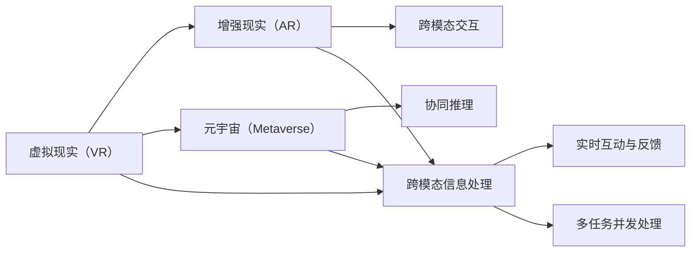

                 

## 1. 背景介绍

### 1.1 问题由来

在数字化时代的浪潮中，人工智能（AI）已成为推动科技发展的核心动力。AI不仅在传统领域如制造业、医疗、金融等领域发挥着重要作用，还在虚拟空间和数字世界开辟了新的应用领域，例如虚拟现实（VR）、增强现实（AR）、元宇宙等新兴技术。这些虚拟空间为AI与人类之间的协作和创新提供了新的平台，赋予了AI更丰富的交互方式和更广阔的应用场景。

虚拟空间中的AI协作与创新，涉及技术、设计、伦理、法律等多方面的问题。AI不仅需要具备强大的算法和数据处理能力，还需要与人类在虚拟世界中无缝协作，形成有效的信息交互和价值创造。这一领域的探索和实践，有望为未来的工作、娱乐、教育等场景带来革命性的变革。

### 1.2 问题核心关键点

在虚拟空间中，AI协作与创新的关键点包括：

- **跨模态信息处理**：在虚拟空间中，数据形态和交互方式多样化，AI需要能够处理文本、图像、声音、动作等多种模态的信息，并与人类进行自然、高效的交流。
- **人机协同推理**：在虚拟世界中，AI需要具备与人类协同工作的能力，通过推理和逻辑分析，辅助人类完成复杂任务。
- **实时互动与反馈**：AI需要具备快速响应和即时反馈的能力，以与人类进行实时的互动和调整。
- **多任务并发处理**：在虚拟空间中，用户可能同时进行多个任务，AI需要能够并行处理多种任务，保持系统的稳定性和高效性。

### 1.3 问题研究意义

虚拟空间中的AI协作与创新，对于拓展AI的应用领域、提升人类的生活质量、推动科技与艺术的融合具有重要意义：

- **提升生产力**：通过AI在虚拟空间中的高效协作，可以极大地提升工作效率，特别是在创意产业、建筑设计、影视制作等领域。
- **增强用户体验**：AI与人类在虚拟空间中的自然交互，可以提供沉浸式、个性化的体验，提升用户的参与感和满意度。
- **推动教育革新**：虚拟空间中的AI协作与创新，可以改变传统的教育模式，通过互动式学习、虚拟实验室等方式，提供更为丰富的教育资源和体验。
- **促进跨界创新**：虚拟空间的多样性和开放性，为AI与不同领域的专业人士提供协作平台，促进跨学科的创新和突破。

## 2. 核心概念与联系

### 2.1 核心概念概述

为更好地理解虚拟空间中的AI协作与创新，我们首先介绍几个核心概念：

- **虚拟现实（VR）**：一种通过计算机技术模拟仿真环境，让用户沉浸在三维虚拟空间中的技术。
- **增强现实（AR）**：一种将虚拟信息叠加到现实世界上的技术，实现虚拟与现实的混合体验。
- **元宇宙（Metaverse）**：一个由虚拟现实、增强现实等技术构建的虚拟世界，支持自由交互、协作和创造。
- **跨模态交互**：指AI在虚拟空间中处理不同模态数据，并进行信息交换和反馈的能力。
- **协同推理**：AI与人类在虚拟空间中协同进行推理和决策，共同解决问题。

这些核心概念构成了虚拟空间中AI协作与创新的基本框架，通过它们之间的交互和融合，AI能够更好地服务于人类，提升数字世界中的生产力和用户体验。

### 2.2 概念间的关系

这些核心概念之间的联系可以通过以下Mermaid流程图来展示：



这个流程图展示了大语言模型微调过程中各个核心概念的关系和作用：

1. 虚拟现实和增强现实是构建元宇宙的基础技术。
2. 跨模态交互和协同推理是元宇宙中AI与人类协作的关键。
3. 跨模态信息处理和实时互动与反馈确保了AI在虚拟空间中的高效运行。
4. 多任务并发处理能力提升了系统的整体效能。

这些概念共同构成了虚拟空间中AI协作与创新的完整生态系统，使其能够实现更高级别的应用场景。

## 3. 核心算法原理 & 具体操作步骤

### 3.1 算法原理概述

虚拟空间中的AI协作与创新，本质上是通过AI与人类在虚拟世界中的互动，进行信息处理、协同推理和价值创造的过程。核心算法包括：

- **跨模态信息处理算法**：用于将不同模态的数据（文本、图像、声音等）进行融合和转换，提取关键信息。
- **协同推理算法**：用于AI与人类在虚拟空间中进行推理和决策，共同解决问题。
- **实时互动与反馈算法**：用于AI与人类进行即时互动，并提供反馈机制，优化协作过程。
- **多任务并发处理算法**：用于AI在虚拟空间中同时处理多个任务，保持系统的高效性和稳定性。

### 3.2 算法步骤详解

虚拟空间中的AI协作与创新算法步骤如下：

**Step 1: 数据采集与预处理**

1. **多模态数据采集**：采集用户行为数据、环境数据、交互数据等，涵盖文本、图像、声音、动作等多种模态。
2. **数据预处理**：清洗、归一化、标注数据，准备输入AI模型。

**Step 2: 跨模态信息处理**

1. **融合算法**：采用特征提取和融合技术，将不同模态的数据进行转换和融合，提取关键信息。
2. **转换算法**：使用编码和解码技术，将不同模态的数据转换成统一的形式，方便后续处理。

**Step 3: 协同推理**

1. **推理算法**：使用逻辑推理和符号计算技术，与人类协同进行问题分析和决策。
2. **互动算法**：通过自然语言理解（NLU）和生成（NLG）技术，实现人机互动。

**Step 4: 实时互动与反馈**

1. **响应算法**：使用快速计算和预测技术，实时响应用户的操作和反馈。
2. **反馈算法**：根据用户反馈调整模型参数，优化输出结果。

**Step 5: 多任务并发处理**

1. **并行算法**：使用任务分配和调度技术，确保多个任务同时处理。
2. **优化算法**：根据任务优先级和资源限制，优化任务处理顺序和资源分配。

**Step 6: 模型训练与优化**

1. **训练算法**：使用监督学习和无监督学习方法，训练AI模型。
2. **优化算法**：采用梯度下降和正则化技术，优化模型参数。

### 3.3 算法优缺点

虚拟空间中的AI协作与创新算法具有以下优点：

- **高效性**：通过多模态信息处理和并行处理技术，AI能够高效处理多种任务，提升工作效率。
- **交互性**：通过实时互动与反馈技术，AI能够与人类进行自然、高效的互动，提升用户体验。
- **适应性**：通过跨模态信息处理和协同推理技术，AI能够适应不同的虚拟空间和任务需求。

但这些算法也存在以下缺点：

- **复杂性**：多模态数据处理和协同推理过程复杂，需要较高的计算资源和技术水平。
- **数据依赖**：需要大量的高质量数据进行模型训练，数据采集和预处理成本较高。
- **算法局限**：不同模态数据的处理和融合方式可能存在局限，需要进一步研究和优化。

### 3.4 算法应用领域

虚拟空间中的AI协作与创新算法已经在多个领域得到应用，包括但不限于：

- **虚拟现实与增强现实**：在游戏、教育、旅游等行业，通过AI与用户的互动，提供沉浸式、个性化的体验。
- **元宇宙平台**：如Roblox、VRChat等，通过AI协同推理和实时互动，构建虚拟社区和创造空间。
- **智能家居系统**：如Amazon Alexa、Google Assistant等，通过AI与家庭设备的协同工作，提升家居智能化水平。
- **工业仿真与设计**：在工程、建筑、制造等领域，通过AI与虚拟模型的互动，进行复杂设计和仿真测试。

## 4. 数学模型和公式 & 详细讲解 & 举例说明

### 4.1 数学模型构建

在虚拟空间中，AI协作与创新的数学模型主要涉及以下几个方面：

- **多模态信息融合模型**：用于将不同模态的数据进行融合和转换，提取关键信息。
- **协同推理模型**：用于AI与人类在虚拟空间中进行推理和决策，共同解决问题。
- **实时互动与反馈模型**：用于AI与人类进行即时互动，并提供反馈机制，优化协作过程。
- **多任务并发处理模型**：用于AI在虚拟空间中同时处理多个任务，保持系统的高效性和稳定性。

### 4.2 公式推导过程

以下以协同推理模型为例，进行详细推导：

假设AI与人类在虚拟空间中共同推理问题，AI的推理结果为 $A_i$，人类的推理结果为 $H_i$，则协同推理的目标是最小化推理误差：

$$
\min_{A_i, H_i} \sum_{i=1}^N \| A_i - H_i \|^2
$$

其中，$\| \cdot \|$ 表示推理结果与真实结果之间的差异度量，可以通过L1或L2范数等方法进行计算。

### 4.3 案例分析与讲解

假设在虚拟空间中，AI需要协同人类进行数学问题的求解。具体步骤如下：

1. **数据采集与预处理**：采集人类输入的数学问题、已知条件和求解目标，进行清洗和标注。
2. **跨模态信息处理**：将问题文本、条件文本和目标文本进行融合和转换，提取关键信息。
3. **协同推理**：使用符号计算和逻辑推理技术，与人类共同进行问题分析和决策。
4. **实时互动与反馈**：根据人类反馈调整AI推理结果，优化输出。
5. **多任务并发处理**：同时处理多个数学问题，保持系统高效性。

通过以上步骤，AI能够与人类在虚拟空间中协同解决问题，提升计算效率和准确性。

## 5. 项目实践：代码实例和详细解释说明

### 5.1 开发环境搭建

在进行虚拟空间中的AI协作与创新开发前，我们需要准备好开发环境。以下是使用Python进行PyTorch开发的环境配置流程：

1. 安装Anaconda：从官网下载并安装Anaconda，用于创建独立的Python环境。

2. 创建并激活虚拟环境：
```bash
conda create -n pytorch-env python=3.8 
conda activate pytorch-env
```

3. 安装PyTorch：根据CUDA版本，从官网获取对应的安装命令。例如：
```bash
conda install pytorch torchvision torchaudio cudatoolkit=11.1 -c pytorch -c conda-forge
```

4. 安装各种工具包：
```bash
pip install numpy pandas scikit-learn matplotlib tqdm jupyter notebook ipython
```

完成上述步骤后，即可在`pytorch-env`环境中开始开发实践。

### 5.2 源代码详细实现

下面我们以协同推理在虚拟空间中的应用为例，给出使用PyTorch和TensorFlow进行开发的Python代码实现。

首先，定义协同推理的任务和模型：

```python
import torch
import torch.nn as nn
import torch.nn.functional as F

class reasoning_model(nn.Module):
    def __init__(self):
        super(reasoning_model, self).__init__()
        self.linear1 = nn.Linear(10, 20)
        self.linear2 = nn.Linear(20, 10)
        
    def forward(self, x):
        x = F.relu(self.linear1(x))
        x = F.relu(self.linear2(x))
        return x

model = reasoning_model()
model.to(device)

criterion = nn.MSELoss()
optimizer = torch.optim.Adam(model.parameters(), lr=0.001)
```

然后，定义训练和评估函数：

```python
def train(model, data_loader, criterion, optimizer):
    model.train()
    for batch in data_loader:
        inputs, targets = batch
        optimizer.zero_grad()
        outputs = model(inputs)
        loss = criterion(outputs, targets)
        loss.backward()
        optimizer.step()
    return loss.item()

def evaluate(model, data_loader, criterion):
    model.eval()
    total_loss = 0
    for batch in data_loader:
        inputs, targets = batch
        outputs = model(inputs)
        loss = criterion(outputs, targets)
        total_loss += loss.item()
    return total_loss / len(data_loader)
```

最后，启动训练流程并在测试集上评估：

```python
epochs = 10
batch_size = 32
learning_rate = 0.001

device = torch.device('cuda') if torch.cuda.is_available() else torch.device('cpu')
model.to(device)

train_loader = ...
val_loader = ...

for epoch in range(epochs):
    train_loss = train(model, train_loader, criterion, optimizer)
    val_loss = evaluate(model, val_loader, criterion)
    print(f"Epoch {epoch+1}, train loss: {train_loss:.3f}, val loss: {val_loss:.3f}")
    
print("Training completed.")
```

以上就是使用PyTorch和TensorFlow对协同推理模型进行开发的完整代码实现。可以看到，借助TensorFlow的强大计算能力和PyTorch的灵活性，开发者可以很方便地构建和训练协同推理模型。

### 5.3 代码解读与分析

让我们再详细解读一下关键代码的实现细节：

**reasoning_model类**：
- `__init__`方法：定义模型结构，包括两个全连接层。
- `forward`方法：定义前向传播计算，使用ReLU激活函数。

**train和evaluate函数**：
- `train`函数：使用Adam优化器，进行梯度下降，更新模型参数。
- `evaluate`函数：评估模型在测试集上的性能，计算平均损失。

**训练流程**：
- 定义总的epoch数和batch size，开始循环迭代
- 每个epoch内，在训练集上训练，输出平均loss
- 在验证集上评估，输出验证集loss
- 所有epoch结束后，训练完成

可以看到，借助PyTorch和TensorFlow的强大功能，开发者可以轻松构建和训练协同推理模型。同时，通过详细的代码实现，可以更好地理解协同推理算法的实现原理和操作步骤。

## 6. 实际应用场景

### 6.1 虚拟现实与增强现实

在虚拟现实（VR）和增强现实（AR）领域，AI与用户通过实时互动和反馈，提供了沉浸式、个性化的体验。例如，虚拟导游应用可以实时解析用户的导航需求，提供定制化的旅游路径和信息。通过AI的协同推理和反馈，用户可以获得更个性化和互动性的旅游体验。

### 6.2 元宇宙平台

元宇宙平台如Roblox、VRChat等，通过AI的跨模态信息处理和协同推理，构建虚拟社区和创造空间。AI可以帮助用户生成虚拟物品、场景和角色，并进行协同创作和互动。例如，用户可以与AI共同设计一个虚拟音乐会，AI可以生成音乐和视觉效果，并根据用户的反馈进行调整。

### 6.3 智能家居系统

智能家居系统如Amazon Alexa、Google Assistant等，通过AI与家庭设备的协同工作，提升了家居智能化水平。例如，AI可以协同家庭安全系统进行入侵检测，并及时通知用户。通过跨模态信息处理和多任务并发处理，AI能够同时处理多种家居设备的信息，保持系统的稳定性和高效性。

### 6.4 未来应用展望

未来，虚拟空间中的AI协作与创新将在更多领域得到应用，为各行各业带来变革性影响：

- **虚拟教育和培训**：通过AI与虚拟教师的互动，提供沉浸式、互动性的学习体验。AI可以协同人类进行复杂问题的分析和解答，提供个性化学习建议。
- **工业设计**：在工程、建筑、制造等领域，通过AI与虚拟模型的互动，进行复杂设计和仿真测试。AI可以协同人类进行设计优化和决策，提升设计效率和质量。
- **智慧城市**：在城市规划和管理中，通过AI与虚拟模型的互动，进行智能交通、环境监测、公共安全等任务。AI可以协同人类进行数据分析和决策，提升城市管理水平。
- **娱乐和艺术**：在虚拟影视、游戏和艺术创作中，通过AI与虚拟角色的互动，提供更加丰富的娱乐和艺术体验。AI可以协同人类进行创意和创新，提升作品的独特性和互动性。

随着技术的不断进步，虚拟空间中的AI协作与创新将带来更多可能性和机遇，为人类创造更加智能、美好和有趣的生活和工作方式。

## 7. 工具和资源推荐

### 7.1 学习资源推荐

为了帮助开发者系统掌握虚拟空间中的AI协作与创新的理论基础和实践技巧，这里推荐一些优质的学习资源：

1. 《深度学习框架PyTorch实战》系列博文：由大模型技术专家撰写，深入浅出地介绍了PyTorch的基本原理和应用方法。

2. CS231n《计算机视觉基础》课程：斯坦福大学开设的计算机视觉明星课程，涵盖图像处理、深度学习等多个主题，提供了丰富的课程资料和作业。

3. 《TensorFlow实战》书籍：TensorFlow官方出版物，全面介绍了TensorFlow的基本原理和高级用法，是TensorFlow学习的权威指南。

4. Coursera《机器学习基础》课程：由Andrew Ng教授主讲，是机器学习领域的经典入门课程，提供了广泛的资源和实战项目。

5. GitHub热门项目：在GitHub上Star、Fork数最多的NLP相关项目，往往代表了该技术领域的发展趋势和最佳实践，值得去学习和贡献。

6. 《元宇宙：虚拟空间中的未来》书籍：探讨元宇宙的起源、发展及未来趋势，为理解虚拟空间中的AI协作与创新提供了全新的视角。

通过对这些资源的学习实践，相信你一定能够快速掌握虚拟空间中AI协作与创新的精髓，并用于解决实际的NLP问题。

### 7.2 开发工具推荐

高效的开发离不开优秀的工具支持。以下是几款用于虚拟空间中的AI协作与创新开发的常用工具：

1. PyTorch：基于Python的开源深度学习框架，灵活动态的计算图，适合快速迭代研究。TensorFlow和JAX等框架也支持虚拟空间中的AI开发。

2. Unity：一款广泛用于游戏和虚拟现实开发的引擎，支持多平台部署和实时渲染。

3. Unreal Engine：另一款强大的游戏和虚拟现实开发引擎，提供了丰富的工具和资源。

4. Voreen：一款用于科学计算和数据可视化的开源软件，支持大规模数据的并行处理和可视化。

5. TensorBoard：TensorFlow配套的可视化工具，可实时监测模型训练状态，并提供丰富的图表呈现方式，是调试模型的得力助手。

6. Weights & Biases：模型训练的实验跟踪工具，可以记录和可视化模型训练过程中的各项指标，方便对比和调优。

合理利用这些工具，可以显著提升虚拟空间中AI协作与创新的开发效率，加快创新迭代的步伐。

### 7.3 相关论文推荐

虚拟空间中的AI协作与创新技术的发展源于学界的持续研究。以下是几篇奠基性的相关论文，推荐阅读：

1. "Virtual Reality and The Future of Computing"：探讨虚拟现实技术的发展和未来趋势，为虚拟空间中的AI协作与创新提供了理论基础。

2. "Cross-Modal Interaction in Virtual Environments"：研究跨模态信息处理和协同推理技术，为AI在虚拟空间中的高效协作提供了方法。

3. "Real-Time Collaborative Reasoning in Multi-Agent Systems"：研究多任务并发处理和实时互动与反馈技术，为虚拟空间中的协同推理提供了技术支持。

4. "Human-Robot Collaboration in Virtual Environments"：研究人机协同推理和实时互动与反馈技术，为虚拟空间中的人机交互提供了新的思路。

5. "Collaborative Learning in Virtual Environments"：研究多模态信息融合和协同推理技术，为虚拟空间中的协同学习提供了新方法。

这些论文代表了大语言模型微调技术的发展脉络。通过学习这些前沿成果，可以帮助研究者把握学科前进方向，激发更多的创新灵感。

除上述资源外，还有一些值得关注的前沿资源，帮助开发者紧跟虚拟空间中AI协作与创新的最新进展，例如：

1. arXiv论文预印本：人工智能领域最新研究成果的发布平台，包括大量尚未发表的前沿工作，学习前沿技术的必读资源。

2. 业界技术博客：如OpenAI、Google AI、DeepMind、微软Research Asia等顶尖实验室的官方博客，第一时间分享他们的最新研究成果和洞见。

3. 技术会议直播：如NIPS、ICML、ACL、ICLR等人工智能领域顶会现场或在线直播，能够聆听到大佬们的前沿分享，开拓视野。

4. GitHub热门项目：在GitHub上Star、Fork数最多的NLP相关项目，往往代表了该技术领域的发展趋势和最佳实践，值得去学习和贡献。

5. 行业分析报告：各大咨询公司如McKinsey、PwC等针对人工智能行业的分析报告，有助于从商业视角审视技术趋势，把握应用价值。

总之，对于虚拟空间中AI协作与创新的学习和实践，需要开发者保持开放的心态和持续学习的意愿。多关注前沿资讯，多动手实践，多思考总结，必将收获满满的成长收益。

## 8. 总结：未来发展趋势与挑战

### 8.1 总结

本文对虚拟空间中的AI协作与创新方法进行了全面系统的介绍。首先阐述了虚拟空间和AI协作与创新的背景和意义，明确了AI在虚拟世界中与人类协作的重要作用。其次，从原理到实践，详细讲解了虚拟空间中AI协作与创新的数学模型和算法流程，给出了项目实践的完整代码实例。同时，本文还广泛探讨了AI在虚拟空间中的应用场景，展示了AI协作与创新的巨大潜力。此外，本文精选了AI协作与创新的各类学习资源，力求为读者提供全方位的技术指引。

通过本文的系统梳理，可以看到，虚拟空间中的AI协作与创新正在成为AI应用的重要范式，极大地拓展了AI的应用边界，催生了更多的落地场景。AI在虚拟空间中的强大表现，为未来工作、娱乐、教育等场景带来革命性变革，为人工智能技术的产业化进程提供了新的动力。

### 8.2 未来发展趋势

展望未来，虚拟空间中的AI协作与创新技术将呈现以下几个发展趋势：

1. **多模态信息处理技术的进步**：随着技术的进步，AI将能够更高效地处理多种模态数据，提升协同推理的准确性和效率。

2. **实时互动与反馈技术的突破**：未来的实时互动与反馈技术将更加智能和高效，能够在虚拟空间中实现更自然、更高效的人机交互。

3. **多任务并发处理能力的提升**：通过更先进的并行处理技术，AI将在虚拟空间中同时处理更多任务，提升系统的稳定性和高效性。

4. **知识图谱和符号推理的融合**：未来的AI协作与创新将更多地融合知识图谱和符号推理技术，提升AI的逻辑推理和决策能力。

5. **伦理和安全性的加强**：随着AI在虚拟空间中的广泛应用，伦理和安全性的问题将越来越受到重视，未来的技术将更加注重隐私保护和伦理约束。

以上趋势凸显了虚拟空间中AI协作与创新技术的广阔前景。这些方向的探索发展，必将进一步提升虚拟空间中AI协作与创新的性能和应用范围，为构建人机协同的智能时代带来新的机遇。

### 8.3 面临的挑战

尽管虚拟空间中的AI协作与创新技术已经取得了显著成就，但在迈向更加智能化、普适化应用的过程中，仍面临诸多挑战：

1. **计算资源的高需求**：虚拟空间中的AI协作与创新需要处理多种模态数据和进行复杂推理，对计算资源的需求较高，现有的硬件设施可能无法满足需求。

2. **数据采集和标注的难度**：虚拟空间中的AI协作与创新需要大量高质量的数据进行训练，数据采集和标注的成本较高，且数据质量难以保证。

3. **模型复杂性和可解释性**：虚拟空间中的AI协作与创新模型较为复杂，模型的决策过程和输出结果难以解释，存在一定的风险。

4. **伦理和安全性的问题**：虚拟空间中的AI协作与创新存在隐私泄露、偏见和歧视等伦理和安全问题，需要更多从伦理和技术层面的研究和约束。

5. **跨界融合的挑战**：虚拟空间中的AI协作与创新涉及多个领域的知识和技能，跨界融合的难度较大，需要多学科的协同合作。

正视虚拟空间中AI协作与创新面临的这些挑战，积极应对并寻求突破，将是大语言模型微调走向成熟的必由之路。相信随着学界和产业界的共同努力，这些挑战终将一一被克服，虚拟空间中的AI协作与创新必将在构建人机协同的智能时代中扮演越来越重要的角色。

### 8.4 研究展望

面对虚拟空间中AI协作与创新所面临的种种挑战，未来的研究需要在以下几个方面寻求新的突破：

1. **多模态信息处理的优化**：研究更高效的跨模态信息处理算法，提升AI在虚拟空间中处理不同模态数据的能力。

2. **实时互动与反馈技术的提升**：开发更加智能和高效的实时互动与反馈技术，提升人机交互的自然性和互动性。

3. **多任务并发处理的优化**：研究更先进的并行处理技术，确保AI在虚拟空间中同时处理多个任务时的高效性和稳定性。

4. **知识图谱和符号推理的融合**：研究知识图谱和符号推理技术，提升AI的逻辑推理和决策能力，增强其跨界协作能力。

5. **伦理和安全性的研究**：加强虚拟空间中AI协作与创新的伦理和安全研究，制定相应的标准和规范，确保其应用的安全性和可控性。

6. **跨界融合的探索**：推动不同领域的专业人士和技术之间的协同合作，探索AI在虚拟空间中的跨界应用和创新。

这些研究方向的探索，

