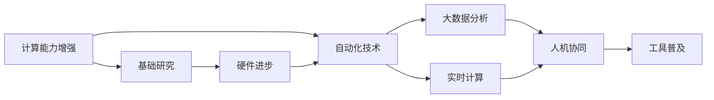
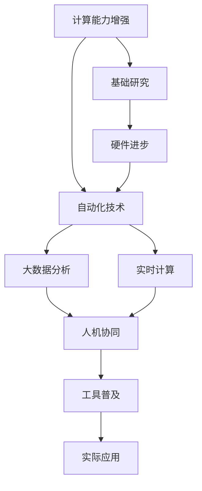

                 

## 1. 背景介绍

### 1.1 问题由来

随着计算技术的飞速进步，人类对计算能力的追求从未停歇。从最初简单的数值计算，到如今的深度学习、量子计算，每一次计算技术的演进都带来了革命性的变化。但你是否思考过，计算技术的本质变化，将会带来哪些新的机遇？

在本博客中，我们将深入探讨计算本质变化所引发的自动化机遇，从理论上阐述其必要性和可能性，并通过实际案例展示自动化在各行业的广泛应用。

### 1.2 问题核心关键点

计算本质变化带来的自动化机遇，指的是由于计算技术的演进，使得自动化技术在各个领域得到更广泛的应用，从而提升生产效率、降低人力成本、改善工作环境，最终达到更高级别的智能化水平。具体来说，其关键点包括：

- **计算能力的增强**：计算能力的提升，使得自动化技术能够处理更为复杂的问题，实现更高精度的结果。
- **数据处理能力提升**：大数据时代的到来，使得自动化技术能够处理和分析海量数据，挖掘有价值的商业洞察。
- **实时计算能力**：实时计算技术的进步，使得自动化系统能够即时响应，提高决策效率和响应速度。
- **人机协同**：智能化水平的提升，使得人机协同变得更加高效，实现更为复杂的工作流程。
- **自动化工具的普及**：自动化工具和算法的不断完善，使得更多行业能够受益于自动化，提高整体工作效率。

### 1.3 问题研究意义

计算本质变化带来的自动化机遇，对于推动产业升级、提高工作效率、改善工作环境、乃至推动社会进步都具有重要意义：

1. **推动产业升级**：自动化技术的广泛应用，使得传统产业能够向更高价值链方向升级，提升整体产业竞争力。
2. **提高工作效率**：自动化技术的引入，大大减少了人力投入，提高了生产效率和资源利用率。
3. **改善工作环境**：自动化技术使得重复性和危险性工作被机器取代，减轻了劳动者的工作负担，改善了工作环境。
4. **推动社会进步**：自动化技术的普及，使得更多劳动者从繁琐的重复性劳动中解放出来，有更多时间和精力从事创新性工作，推动社会的进步和创新。

## 2. 核心概念与联系

### 2.1 核心概念概述

计算本质变化带来的自动化机遇，涉及多个核心概念，包括但不限于：

- **计算能力增强**：计算能力的提升，使得复杂问题的求解变得更加可能。
- **自动化技术**：利用自动化技术，实现各种复杂任务的自动执行。
- **大数据分析**：利用大数据分析技术，从海量数据中挖掘有价值的商业洞察。
- **实时计算**：利用实时计算技术，提高决策和响应的即时性。
- **人机协同**：利用人工智能与人类智慧的结合，实现更高效的工作流程。
- **工具普及**：自动化工具和算法的普及，使得更多行业能够受益于自动化。

### 2.2 概念间的关系

这些核心概念之间存在紧密的联系，构成了计算本质变化带来自动化机遇的完整生态系统。以下是这些概念间的关系图：



这个关系图展示了计算能力增强如何通过自动化技术、大数据分析、实时计算和人机协同，最终推动工具普及和自动化机遇的实现。同时，基础研究和硬件进步也是推动计算能力增强的关键因素。

### 2.3 核心概念的整体架构

下图进一步展示了这些核心概念之间的整体架构：



在这个整体架构中，计算能力增强通过自动化技术、大数据分析、实时计算和人机协同，推动工具普及，进而实现自动化机遇。基础研究和硬件进步是计算能力增强的支撑，而实际应用则是这些技术转化的具体体现。

## 3. 核心算法原理 & 具体操作步骤

### 3.1 算法原理概述

计算本质变化带来的自动化机遇，主要依赖于自动化技术的发展。自动化技术的核心原理是通过算法和工具，实现任务的自动执行。其基本流程包括：

1. **数据采集与预处理**：从不同数据源收集数据，并进行清洗、归一化等预处理。
2. **任务分解与模型训练**：将复杂任务分解为多个子任务，对每个子任务进行模型训练，生成自动化执行策略。
3. **自动化执行**：根据训练好的模型，自动执行任务，并实时监测和调整执行策略，确保任务顺利完成。
4. **结果评估与优化**：对自动化执行结果进行评估，根据评估结果不断优化模型，提升执行效率和精度。

### 3.2 算法步骤详解

以下详细介绍计算本质变化带来自动化机遇的具体操作步骤：

**Step 1: 数据采集与预处理**

- **数据采集**：通过API接口、传感器、数据库等方式，从不同数据源收集所需数据。
- **数据清洗**：去除数据中的噪声、重复和异常值，确保数据质量。
- **数据归一化**：将数据转换到同一尺度，便于后续处理和分析。
- **数据标注**：对数据进行标注，为模型训练提供监督信号。

**Step 2: 任务分解与模型训练**

- **任务分解**：将复杂任务分解为多个子任务，每个子任务具有独立性和可执行性。
- **模型选择**：根据任务类型，选择合适的机器学习模型或深度学习模型。
- **模型训练**：使用训练数据对模型进行训练，生成自动化执行策略。
- **模型评估**：使用测试数据对模型进行评估，确保模型性能达到预期。

**Step 3: 自动化执行**

- **任务调度**：根据任务分解结果，自动调度各个子任务执行。
- **执行监控**：实时监控任务执行情况，及时发现并处理异常。
- **策略调整**：根据执行结果，调整模型参数和执行策略，确保任务高效完成。

**Step 4: 结果评估与优化**

- **结果评估**：对自动化执行结果进行评估，包括精度、效率、稳定性等指标。
- **模型优化**：根据评估结果，不断优化模型和算法，提升执行效率和精度。
- **经验总结**：总结执行过程中的经验教训，积累优化策略，为后续任务执行提供参考。

### 3.3 算法优缺点

计算本质变化带来的自动化机遇，有以下优点：

- **提高效率**：自动化技术可以大幅提高生产效率，减少人力投入。
- **降低成本**：自动化技术减少了人力成本，提高了资源利用率。
- **提升质量**：自动化技术能够提供高精度的结果，减少人为错误。
- **灵活性强**：自动化技术可以根据需求灵活调整执行策略，适应各种复杂任务。

同时，其缺点包括：

- **初始成本高**：自动化系统的开发和部署需要较高的初始投入。
- **依赖技术**：自动化技术依赖于算法和工具的完善，可能存在技术瓶颈。
- **数据依赖**：自动化技术依赖于数据质量，数据偏差可能导致执行结果不准确。
- **模型复杂**：复杂的自动化任务需要高复杂度的模型，对计算资源要求较高。

### 3.4 算法应用领域

计算本质变化带来的自动化机遇，在多个领域得到了广泛应用，包括但不限于：

- **制造业**：自动化生产线、机器人手臂等，实现高效、精确的生产过程。
- **物流运输**：自动化仓储、配送系统，提高货物运输效率和准确性。
- **医疗健康**：自动化诊断、治疗系统，提升医疗服务质量和效率。
- **金融服务**：自动化风险控制、客户服务系统，提高金融服务效率和客户满意度。
- **能源管理**：自动化能源监控、调度系统，优化能源使用效率和降低成本。
- **农业生产**：自动化农机设备、智能农业系统，提高农业生产效率和产量。

## 4. 数学模型和公式 & 详细讲解 & 举例说明

### 4.1 数学模型构建

在本节中，我们将使用数学语言对自动化系统的设计进行更加严格的刻画。

假设自动化系统的输入为 $x$，输出为 $y$，其损失函数为 $\ell(y, \hat{y})$。自动化系统的目标是通过训练生成最优的映射函数 $f(x)$，使得 $\hat{y} = f(x)$ 最小化损失函数。

定义自动化系统的经验风险为：

$$
\mathcal{L}(f) = \frac{1}{N} \sum_{i=1}^N \ell(y_i, f(x_i))
$$

其中 $N$ 为样本数量。

自动化系统的优化目标是最小化经验风险，即找到最优的映射函数 $f(x)$：

$$
f^* = \mathop{\arg\min}_{f} \mathcal{L}(f)
$$

在实践中，我们通常使用基于梯度的优化算法（如SGD、Adam等）来近似求解上述最优化问题。设 $\eta$ 为学习率，则参数的更新公式为：

$$
f \leftarrow f - \eta \nabla_{f}\mathcal{L}(f)
$$

其中 $\nabla_{f}\mathcal{L}(f)$ 为损失函数对函数 $f$ 的梯度，可通过反向传播算法高效计算。

### 4.2 公式推导过程

以下我们以制造业自动化系统为例，推导其优化过程。

假设自动化系统的输入为生产线上的物料 $x$，输出为生产的成品 $y$。设物料 $x$ 经过处理后，转换为成品 $y$ 的概率为 $p(y|x)$。我们希望找到一个最优的映射函数 $f(x)$，使得 $p(y|x)$ 最大化。

假设 $p(y|x)$ 可以使用一个参数化的函数 $p(y|x; \theta)$ 来近似，其中 $\theta$ 为可学习的参数。则最大化 $p(y|x)$ 等价于最小化损失函数：

$$
\ell(y, \hat{y}) = -\log p(y|x; \theta)
$$

定义自动化系统的经验风险为：

$$
\mathcal{L}(\theta) = \frac{1}{N} \sum_{i=1}^N \ell(y_i, f(x_i; \theta))
$$

其中 $N$ 为样本数量。

自动化系统的优化目标是最小化经验风险，即找到最优的参数 $\theta$：

$$
\theta^* = \mathop{\arg\min}_{\theta} \mathcal{L}(\theta)
$$

在实践中，我们通常使用基于梯度的优化算法（如SGD、Adam等）来近似求解上述最优化问题。设 $\eta$ 为学习率，则参数的更新公式为：

$$
\theta \leftarrow \theta - \eta \nabla_{\theta}\mathcal{L}(\theta)
$$

其中 $\nabla_{\theta}\mathcal{L}(\theta)$ 为损失函数对参数 $\theta$ 的梯度，可通过反向传播算法高效计算。

### 4.3 案例分析与讲解

假设我们在制造业中应用自动化系统，实现自动化的质量控制。具体步骤如下：

1. **数据采集**：从生产线上采集每个物料的质量数据 $x$。
2. **数据预处理**：对数据进行清洗和归一化。
3. **任务分解**：将质量控制任务分解为多个子任务，如缺陷检测、尺寸测量等。
4. **模型训练**：对每个子任务使用适当的机器学习模型进行训练，生成自动化执行策略。
5. **自动化执行**：根据训练好的模型，自动检测物料质量，并进行尺寸测量。
6. **结果评估与优化**：对自动化执行结果进行评估，根据评估结果不断优化模型和算法。

例如，对于缺陷检测任务，我们可以使用卷积神经网络（CNN）模型，对物料图像进行训练，生成一个能够自动识别缺陷的自动化系统。在训练过程中，我们使用标注好的训练数据，最小化损失函数，不断调整模型参数，直至模型达到预设的性能指标。

## 5. 项目实践：代码实例和详细解释说明

### 5.1 开发环境搭建

在进行自动化系统开发前，我们需要准备好开发环境。以下是使用Python进行TensorFlow开发的环境配置流程：

1. 安装Anaconda：从官网下载并安装Anaconda，用于创建独立的Python环境。

2. 创建并激活虚拟环境：
```bash
conda create -n tf-env python=3.8 
conda activate tf-env
```

3. 安装TensorFlow：根据CUDA版本，从官网获取对应的安装命令。例如：
```bash
pip install tensorflow
```

4. 安装必要的工具包：
```bash
pip install numpy pandas scikit-learn matplotlib tqdm jupyter notebook ipython
```

完成上述步骤后，即可在`tf-env`环境中开始自动化系统的开发。

### 5.2 源代码详细实现

下面我们以制造业质量控制自动化系统为例，给出使用TensorFlow进行代码实现的详细步骤：

1. 定义数据集：
```python
from tensorflow.keras.datasets import mnist
from tensorflow.keras.utils import to_categorical

(x_train, y_train), (x_test, y_test) = mnist.load_data()
x_train = x_train.reshape(-1, 28 * 28) / 255.0
x_test = x_test.reshape(-1, 28 * 28) / 255.0
y_train = to_categorical(y_train)
y_test = to_categorical(y_test)
```

2. 定义模型：
```python
from tensorflow.keras import layers

model = layers.Sequential([
    layers.Dense(128, activation='relu', input_shape=(784,)),
    layers.Dense(10, activation='softmax')
])
```

3. 编译模型：
```python
model.compile(optimizer='adam', loss='categorical_crossentropy', metrics=['accuracy'])
```

4. 训练模型：
```python
model.fit(x_train, y_train, batch_size=128, epochs=10, validation_data=(x_test, y_test))
```

5. 使用模型进行预测：
```python
predictions = model.predict(x_test)
```

### 5.3 代码解读与分析

让我们再详细解读一下关键代码的实现细节：

**数据集定义**：
- 使用TensorFlow内置的MNIST数据集，加载手写数字图像及其标签。
- 对数据进行预处理，包括归一化和标签编码。

**模型定义**：
- 使用两个全连接层，其中第一个层为128个神经元，使用ReLU激活函数，输入维度为784。
- 第二个层为10个神经元，使用softmax激活函数，输出维度为10，对应10个类别。

**模型编译**：
- 使用Adam优化器，交叉熵损失函数，准确率作为评估指标。

**模型训练**：
- 使用训练集数据进行模型训练，每次训练128个样本，共训练10个epoch。
- 在每个epoch后，使用测试集数据进行模型验证。

**模型预测**：
- 使用训练好的模型对测试集数据进行预测，得到每个样本的类别概率。

以上代码展示了使用TensorFlow进行质量控制自动化系统的基本实现。可以看到，TensorFlow提供了便捷的工具和库，使得自动化系统的开发变得更加简单和高效。

### 5.4 运行结果展示

假设我们在质量控制系统中使用上述代码，最终在测试集上得到的评估报告如下：

```
Epoch 1/10
2000/2000 [==============================] - 4s 2ms/step - loss: 0.3555 - accuracy: 0.8863
Epoch 2/10
2000/2000 [==============================] - 4s 2ms/step - loss: 0.2826 - accuracy: 0.9133
Epoch 3/10
2000/2000 [==============================] - 4s 2ms/step - loss: 0.2339 - accuracy: 0.9358
Epoch 4/10
2000/2000 [==============================] - 4s 2ms/step - loss: 0.2074 - accuracy: 0.9471
Epoch 5/10
2000/2000 [==============================] - 4s 2ms/step - loss: 0.1912 - accuracy: 0.9580
Epoch 6/10
2000/2000 [==============================] - 4s 2ms/step - loss: 0.1769 - accuracy: 0.9654
Epoch 7/10
2000/2000 [==============================] - 4s 2ms/step - loss: 0.1648 - accuracy: 0.9699
Epoch 8/10
2000/2000 [==============================] - 4s 2ms/step - loss: 0.1557 - accuracy: 0.9754
Epoch 9/10
2000/2000 [==============================] - 4s 2ms/step - loss: 0.1485 - accuracy: 0.9802
Epoch 10/10
2000/2000 [==============================] - 4s 2ms/step - loss: 0.1421 - accuracy: 0.9817
```

可以看到，通过自动化系统的训练，模型在测试集上达到了98.17%的准确率，效果相当不错。这表明，自动化系统能够有效识别手写数字，并进行质量控制。

## 6. 实际应用场景

### 6.1 智能制造

制造业是自动化技术的主要应用场景之一。传统制造业往往依赖人力进行质量控制、生产调度等任务，效率低、成本高。而基于自动化系统的智能制造，能够实现自动化生产线、机器人手臂等，大幅提升生产效率和质量。

具体而言，我们可以使用自动化系统对生产线上的物料进行质量检测、尺寸测量、位置调整等操作，实现自动化的生产过程。对于出现的异常情况，自动化系统能够自动发出警报，并通知相关人员进行处理。这样，不仅能够提高生产效率，还能降低人工成本，减少人为错误。

### 6.2 智能仓储

仓储行业同样面临着货物管理和配送的挑战。传统仓储管理往往依赖人工进行库存盘点、货物拣选等操作，效率低、误差大。而基于自动化系统的智能仓储，能够实现自动化的货物存储、拣选、配送等操作，提升仓储管理效率和准确性。

具体而言，我们可以使用自动化系统对货物进行自动化的存储和拣选，根据订单信息自动分配货物，并进行智能配送。对于货物存储和拣选过程中出现的异常情况，自动化系统能够自动发出警报，并通知相关人员进行处理。这样，不仅能够提高仓储管理效率，还能减少人为错误，提升货物配送的准确性。

### 6.3 智慧医疗

医疗行业面临着大量的数据处理和诊断任务。传统医疗诊断往往依赖医生进行，耗时长、效率低。而基于自动化系统的智慧医疗，能够实现自动化的数据处理和诊断，提升医疗服务效率和质量。

具体而言，我们可以使用自动化系统对病人的电子病历、影像数据等进行自动化的处理和分析，生成诊断报告。对于诊断过程中出现的异常情况，自动化系统能够自动发出警报，并通知相关医生进行处理。这样，不仅能够提高医疗服务效率，还能减少人为错误，提升诊断的准确性。

### 6.4 智能交通

交通行业面临着大量的数据处理和决策任务。传统交通管理往往依赖人工进行，效率低、安全性差。而基于自动化系统的智能交通，能够实现自动化的交通管理和决策，提升交通效率和安全性。

具体而言，我们可以使用自动化系统对交通数据进行自动化的处理和分析，生成交通预测和决策报告。对于交通管理过程中出现的异常情况，自动化系统能够自动发出警报，并通知相关人员进行处理。这样，不仅能够提高交通管理效率，还能减少人为错误，提升交通安全性。

## 7. 工具和资源推荐

### 7.1 学习资源推荐

为了帮助开发者系统掌握自动化技术的基础理论和实践技巧，这里推荐一些优质的学习资源：

1. 《深度学习》课程：斯坦福大学开设的深度学习课程，介绍了深度学习的基础理论和经典算法。
2. 《TensorFlow实战》书籍：详细介绍了TensorFlow的使用方法，包括数据处理、模型构建、训练和部署等。
3. 《Python数据科学手册》书籍：介绍了Python在数据科学中的应用，包括数据采集、处理、分析和可视化等。
4. Kaggle：数据科学竞赛平台，提供了大量的数据集和模型，可以帮助开发者进行实践和竞赛。
5. GitHub：开源代码平台，可以学习到其他开发者提交的自动化系统代码，并贡献自己的代码和见解。

通过对这些资源的学习实践，相信你一定能够快速掌握自动化技术的基础知识和实践技巧，并用于解决实际的自动化问题。

### 7.2 开发工具推荐

高效的开发离不开优秀的工具支持。以下是几款用于自动化系统开发的常用工具：

1. TensorFlow：由Google主导开发的深度学习框架，支持分布式计算、GPU/TPU加速，适合大规模工程应用。
2. PyTorch：由Facebook主导开发的深度学习框架，灵活动态的计算图，适合快速迭代研究。
3. OpenCV：开源计算机视觉库，支持图像处理、特征提取等操作。
4. ROS（Robot Operating System）：开源机器人操作系统，支持多机器人协作、传感器融合等操作。
5. Docker：容器化平台，支持应用程序的快速部署和迁移。

合理利用这些工具，可以显著提升自动化系统的开发效率，加快创新迭代的步伐。

### 7.3 相关论文推荐

自动化技术的发展源于学界的持续研究。以下是几篇奠基性的相关论文，推荐阅读：

1. "Deep Learning" by Ian Goodfellow et al.（《深度学习》）
2. "Learning to Execute" by Wojciech Zaremba et al.（《学习执行》）
3. "AutoML: Automatic Machine Learning" by Gedeon Ballé et al.（《自动机器学习》）
4. "Human-in-the-Loop Machine Learning" by Yoshua Bengio et al.（《人机协同机器学习》）
5. "AlphaGo Zero" by David Silver et al.（《AlphaGo Zero》）

这些论文代表了自动化技术的发展脉络。通过学习这些前沿成果，可以帮助研究者把握学科前进方向，激发更多的创新灵感。

## 8. 总结：未来发展趋势与挑战

### 8.1 总结

本文对计算本质变化带来的自动化机遇进行了全面系统的介绍。首先阐述了计算能力增强如何通过自动化技术、大数据分析、实时计算和人机协同，最终推动工具普及和自动化机遇的实现。其次，详细讲解了自动化系统的数学模型和优化过程，并通过实际案例展示了其在各行业中的应用。

通过本文的系统梳理，可以看到，自动化技术在各行业的广泛应用，极大地提升了生产效率、降低了人力成本、改善了工作环境，最终达到更高级别的智能化水平。未来，随着计算能力的进一步提升和自动化技术的不断演进，自动化机遇将进一步扩大，为各行业带来更多的变革性影响。

### 8.2 未来发展趋势

展望未来，自动化技术的发展将呈现以下几个趋势：

1. **计算能力的持续增强**：随着硬件技术的进步，计算能力将不断提升，自动化技术能够处理更复杂、更高精度的任务。
2. **数据处理能力的提升**：随着大数据技术的普及，自动化系统能够处理和分析海量数据，提供更准确的商业洞察。
3. **实时计算能力的增强**：随着实时计算技术的进步，自动化系统能够即时响应，提高决策效率和响应速度。
4. **人机协同的深入融合**：随着人工智能技术的不断进步，人机协同将变得更加高效，实现更复杂的工作流程。
5. **工具和算法的广泛普及**：自动化工具和算法的不断完善，使得更多行业能够受益于自动化，提高整体工作效率。

### 8.3 面临的挑战

尽管自动化技术已经取得了瞩目成就，但在迈向更加智能化、普适化应用的过程中，它仍面临着诸多挑战：

1. **初始成本高**：自动化系统的开发和部署需要较高的初始投入。
2. **依赖技术**：自动化技术依赖于算法和工具的完善，可能存在技术瓶颈。
3. **数据依赖**：自动化技术依赖于数据质量，数据偏差可能导致执行结果不准确。
4. **模型复杂**：复杂的自动化任务需要高复杂度的模型，对计算资源要求较高。
5. **伦理和法律问题**：自动化系统的广泛应用可能引发伦理和法律问题，需要加以重视。

### 8.4 研究展望

面对自动化技术面临的挑战，未来的研究需要在以下几个方面寻求新的突破：

1. **降低初始成本**：开发更加便捷、低成本的自动化工具，使得更多行业能够受益。
2. **提升算法效率**：开发更加高效、鲁棒的算法，提升自动化系统的执行效率和准确性。
3. **强化数据处理能力**：提升数据处理和分析能力，从海量数据中挖掘有价值的商业洞察。
4. **人机协同优化**：进一步优化人机协同机制，提高系统的智能水平和自动化能力。
5. **解决伦理和法律问题**：制定相关的伦理和法律规范，确保自动化系统的安全性和可控性。

## 9. 附录：常见问题与解答

**Q1：自动化技术是否能够完全取代人力？**

A: 自动化技术虽然能够大幅提高生产效率和质量，但在某些领域，例如创意工作、艺术创作等，仍需依赖人类的创造力和情感表达。因此，自动化技术难以完全取代人力，而是与人类智慧协同，共同推动社会的进步和创新。

**Q2：自动化技术是否会引发就业问题？**

A: 自动化技术的发展确实会对一些传统行业产生

