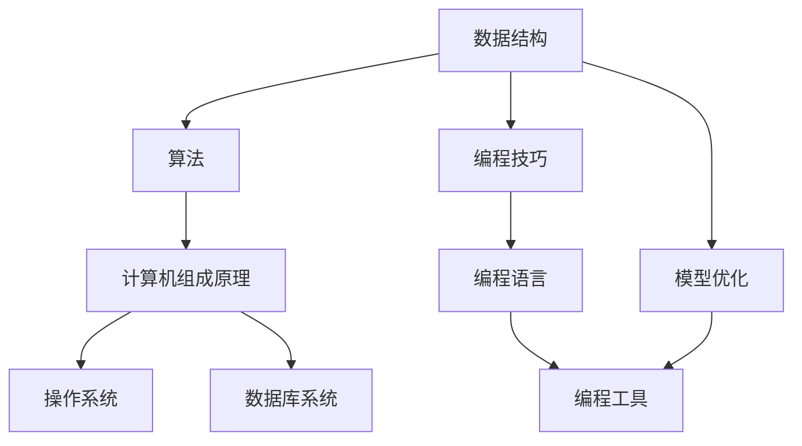
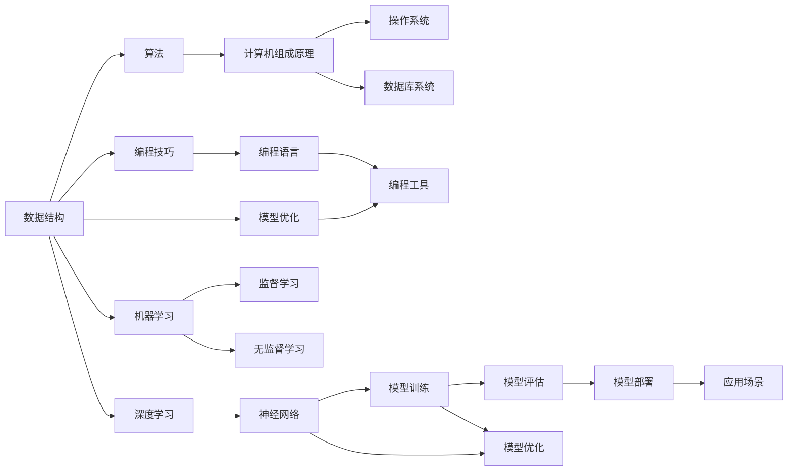

                 

# 计算机基础在AI中的应用

> 关键词：计算机基础,人工智能,深度学习,机器学习,数据结构,算法,编程技巧,模型优化

## 1. 背景介绍

### 1.1 问题由来
在现代科技迅猛发展的时代，人工智能(AI)已成为推动社会进步的重要引擎。AI技术的进步不仅需要前沿的算法和强大的硬件支持，更需要扎实的计算机基础知识作为支撑。无论是深度学习、机器学习还是自然语言处理，都离不开计算机基础课程所教授的内容。本文将探讨计算机基础在AI中的应用，通过实例展示计算机基础课程中的核心概念和技巧如何被广泛应用于AI项目中，从而帮助读者更好地理解和应用AI技术。

### 1.2 问题核心关键点
计算机基础课程是计算机科学教育的重要组成部分，通常包括数据结构与算法、计算机组成原理、操作系统、数据库系统等。这些课程的内容不仅为计算机科学专业的学生提供了必要的理论知识，也为AI技术的开发提供了重要的工具和思想。

1. **数据结构与算法**：AI中常见的分类、聚类、回归等算法，其背后都有数据结构和算法作为支撑。
2. **计算机组成原理**：了解计算机硬件和软件的工作原理，有助于设计高效、优化的AI模型。
3. **操作系统**：操作系统是AI算法运行的底层基础，理解其原理有助于开发高性能的AI系统。
4. **数据库系统**：数据库为AI项目提供了高效的数据存储和查询手段，支持大规模数据处理。

这些计算机基础课程的知识在AI中的应用，贯穿于从模型设计、数据处理到系统实现的各个环节，对于培养具备强大AI能力的开发者至关重要。

### 1.3 问题研究意义
计算机基础课程在AI中的应用，对于提高AI技术的实用性、可扩展性和可维护性具有重要意义：

1. **提高模型性能**：掌握数据结构和算法，可以设计出更高效、更精确的AI模型，从而提升应用效果。
2. **增强系统稳定性**：理解计算机组成原理和操作系统，能够设计出更稳定、更高效的AI系统。
3. **优化数据处理**：熟悉数据库系统，可以更好地处理和管理大规模数据，支撑AI算法的运行。
4. **提高开发效率**：掌握编程技巧和最佳实践，可以加快AI模型的开发和部署，缩短项目周期。
5. **促进创新**：计算机基础的深入理解，为AI技术带来更多的创新点和应用场景。

通过深入理解计算机基础课程，能够更好地应用AI技术，促进人工智能在各个领域的广泛应用。

## 2. 核心概念与联系

### 2.1 核心概念概述

为了更好地理解计算机基础课程在AI中的应用，本节将介绍几个关键的核心概念：

1. **数据结构**：数据结构是组织和存储数据的方式，如数组、链表、栈、队列、树、图等。
2. **算法**：算法是解决问题的方法，通常包含输入、输出、步骤等。
3. **计算机组成原理**：计算机组成原理涉及计算机硬件和软件的基本概念，如指令集、寄存器、内存等。
4. **操作系统**：操作系统是计算机资源的管理者，负责进程调度和内存管理等。
5. **数据库系统**：数据库系统用于存储、管理和查询数据，支持复杂的数据处理任务。

### 2.2 概念间的关系

这些核心概念之间存在紧密的联系，形成了AI开发的基础框架。以下通过几个Mermaid流程图来展示这些概念之间的关系：



这个流程图展示了数据结构、算法、计算机组成原理、操作系统和数据库系统在AI开发中的相互关系：

1. 数据结构和算法是AI模型的核心，用于设计和实现模型。
2. 计算机组成原理和操作系统是AI算法运行的基础，保证系统的稳定性和高效性。
3. 数据库系统是AI数据处理和存储的基础，支撑大规模数据的处理。
4. 编程技巧和模型优化是实现高效、可扩展AI系统的关键。

这些概念共同构成了AI开发的完整生态系统，为AI技术的落地应用提供了坚实的基础。

### 2.3 核心概念的整体架构

最后，我们用一个综合的流程图来展示这些核心概念在AI开发中的整体架构：



这个综合流程图展示了数据结构、算法、计算机组成原理、操作系统、数据库系统和编程技巧在AI开发中的整体架构：

1. 数据结构和算法构成AI模型的基础。
2. 计算机组成原理和操作系统是AI算法运行的基础。
3. 数据库系统是AI数据处理的基础。
4. 编程技巧和模型优化提升AI模型的性能。
5. 机器学习和深度学习是AI的主要技术手段。
6. 监督学习和无监督学习是AI模型的主要训练方式。
7. 神经网络是深度学习模型的核心。
8. 模型训练、评估和优化是AI模型的关键步骤。
9. 模型部署和应用场景实现AI技术的落地应用。

通过这个综合流程图，我们可以更清晰地理解计算机基础在AI开发中的整体架构和作用。

## 3. 核心算法原理 & 具体操作步骤

### 3.1 算法原理概述

在AI开发中，数据结构和算法是设计和实现AI模型的核心。常用的AI算法包括分类、聚类、回归、神经网络等，其背后的数据结构和算法原理值得深入理解。

**分类算法**：
分类算法的核心是划分数据，常用的算法有决策树、K近邻、支持向量机等。数据结构中，树和图是常用的存储结构。

**聚类算法**：
聚类算法的核心是分组数据，常用的算法有K-means、层次聚类等。数据结构中，向量空间和距离是常用的计算结构。

**回归算法**：
回归算法的核心是预测数值，常用的算法有线性回归、多项式回归等。数据结构中，数组和向量是常用的存储结构。

**神经网络**：
神经网络是一种基于数据流计算的模型，包含多个层和节点，每个节点进行线性变换和非线性激活。数据结构中，矩阵和向量是常用的计算结构。

### 3.2 算法步骤详解

以神经网络为例，介绍其设计、实现和训练的详细步骤：

1. **设计神经网络结构**：
   - 确定网络的层数、每层节点数等结构参数。
   - 选择合适的激活函数，如ReLU、Sigmoid等。
   - 确定损失函数，如均方误差、交叉熵等。

2. **实现神经网络模型**：
   - 定义类或结构体，存储网络参数和状态。
   - 实现前向传播和反向传播算法，计算模型输出和梯度。
   - 使用TensorFlow、PyTorch等框架，实现高效计算。

3. **训练神经网络模型**：
   - 加载训练数据和标签。
   - 定义优化器和损失函数。
   - 使用梯度下降等优化算法，更新模型参数。
   - 在验证集上评估模型性能，调整参数。
   - 重复训练，直到模型收敛或达到预设轮数。

### 3.3 算法优缺点

**神经网络算法**：
- 优点：适用于大规模数据和复杂模型，具有强大的表示能力。
- 缺点：需要大量计算资源，容易出现过拟合问题，训练过程复杂。

**K-means算法**：
- 优点：计算简单，易于实现，适用于大规模数据。
- 缺点：对初始点敏感，聚类效果依赖于初始化。

**决策树算法**：
- 优点：易于理解和解释，适用于分类和回归问题。
- 缺点：容易出现过拟合，需要调参。

### 3.4 算法应用领域

计算机基础课程中的算法和数据结构在AI领域有广泛的应用：

1. **分类和聚类**：在图像识别、语音识别、文本分类等任务中，分类和聚类算法被广泛应用于数据预处理和特征提取。
2. **回归**：在预测房价、股票价格、交通流量等任务中，回归算法被用来进行数值预测。
3. **神经网络**：在自然语言处理、计算机视觉、语音识别等领域，神经网络模型被广泛用于解决复杂的分类、回归和生成问题。
4. **数据结构**：在图神经网络、矩阵分解等任务中，数据结构和算法被用来高效存储和处理数据。

## 4. 数学模型和公式 & 详细讲解

### 4.1 数学模型构建

在AI开发中，数学模型是理解和实现算法的基础。以下展示几个常见的数学模型：

1. **线性回归模型**：
   - 假设数据 $(x_i, y_i)$，$i=1,2,...,N$。
   - 目标是最小化损失函数 $L(w, b) = \frac{1}{2N}\sum_{i=1}^N (y_i - wx_i - b)^2$。
   - 解得 $w = (\frac{1}{N}\sum_{i=1}^N x_i x_i^T)^{-1} \sum_{i=1}^N x_i y_i$，$b = \bar{y} - w\bar{x}$，其中 $\bar{x} = \frac{1}{N}\sum_{i=1}^N x_i$，$\bar{y} = \frac{1}{N}\sum_{i=1}^N y_i$。

2. **K-means模型**：
   - 假设数据 $x_1, x_2, ..., x_N$，目标是最小化聚类损失函数 $J = \sum_{i=1}^N ||x_i - \mu_k||^2 + \sum_{k=1}^C \sum_{x_i \in G_k} ||x_i - \mu_k||^2$。
   - 解得 $\mu_k = \frac{1}{|G_k|}\sum_{x_i \in G_k} x_i$，其中 $G_k$ 是第 $k$ 个聚类的样本集合。

3. **神经网络模型**：
   - 假设输入 $x$，目标是最小化损失函数 $L(w, b) = \frac{1}{N}\sum_{i=1}^N l(y_i, f(x; w, b))$。
   - 解得 $w = (\frac{1}{N}\sum_{i=1}^N x_i x_i^T)^{-1} (\frac{1}{N}\sum_{i=1}^N x_i y_i)$，其中 $f(x; w, b) = \sum_{j=1}^M w_j g(x^T h_j + b_j)$，$g$ 为激活函数，$h_j$ 为第 $j$ 层输入向量。

### 4.2 公式推导过程

以神经网络模型为例，推导其损失函数及其梯度：

假设输入数据 $x$，目标输出 $y$，模型输出 $f(x; w, b) = \sum_{j=1}^M w_j g(x^T h_j + b_j)$，其中 $g$ 为激活函数，$h_j$ 为第 $j$ 层输入向量。

损失函数 $L(w, b) = \frac{1}{N}\sum_{i=1}^N l(y_i, f(x_i; w, b))$，其中 $l$ 为损失函数，如交叉熵。

梯度 $\nabla_w L = \frac{1}{N}\sum_{i=1}^N \nabla_w l(y_i, f(x_i; w, b))$，其中 $\nabla_w l(y_i, f(x_i; w, b)) = \frac{\partial l(y_i, f(x_i; w, b))}{\partial w_j}$。

使用链式法则，可以推导出 $\nabla_w l(y_i, f(x_i; w, b)) = \frac{\partial l(y_i, f(x_i; w, b))}{\partial z_j} \frac{\partial z_j}{\partial h_j} \frac{\partial h_j}{\partial w_j}$，其中 $z_j = x^T h_j + b_j$，$h_j$ 为第 $j$ 层输出向量。

通过求解 $\nabla_w L$ 和 $\nabla_b L$，可以得到模型参数的更新公式，用于训练神经网络。

### 4.3 案例分析与讲解

以图像识别为例，展示如何应用数据结构和算法：

1. **数据预处理**：
   - 使用OpenCV等库读取图像数据。
   - 使用PIL等库进行图像裁剪、缩放和归一化。
   - 使用numpy等库存储和处理图像数据。

2. **特征提取**：
   - 使用SIFT、HOG等算法提取图像特征。
   - 使用K-means等算法进行特征降维。
   - 使用PCA等算法进行特征优化。

3. **分类器训练**：
   - 使用SVM、决策树等算法训练分类器。
   - 使用神经网络模型进行图像分类。
   - 使用梯度下降等优化算法训练模型参数。

## 5. 项目实践：代码实例和详细解释说明

### 5.1 开发环境搭建

在进行AI项目实践前，我们需要准备好开发环境。以下是使用Python进行TensorFlow开发的环境配置流程：

1. 安装Anaconda：从官网下载并安装Anaconda，用于创建独立的Python环境。

2. 创建并激活虚拟环境：
```bash
conda create -n tf-env python=3.8 
conda activate tf-env
```

3. 安装TensorFlow：根据CUDA版本，从官网获取对应的安装命令。例如：
```bash
conda install tensorflow -c tf -c conda-forge
```

4. 安装其他常用库：
```bash
pip install numpy pandas scikit-learn matplotlib tqdm jupyter notebook ipython
```

完成上述步骤后，即可在`tf-env`环境中开始AI项目实践。

### 5.2 源代码详细实现

下面我们以图像分类任务为例，给出使用TensorFlow对神经网络模型进行图像分类的PyTorch代码实现。

首先，定义数据处理函数：

```python
import tensorflow as tf
import numpy as np
import matplotlib.pyplot as plt

def load_data(batch_size):
    # 加载数据集
    # ...

    # 数据预处理
    # ...

    # 创建数据集
    dataset = tf.data.Dataset.from_tensor_slices((x_train, y_train))
    dataset = dataset.batch(batch_size).shuffle(buffer_size=1024)
    return dataset
```

然后，定义模型和训练函数：

```python
def build_model(input_shape, num_classes):
    model = tf.keras.Sequential([
        tf.keras.layers.Conv2D(32, (3, 3), activation='relu', input_shape=input_shape),
        tf.keras.layers.MaxPooling2D((2, 2)),
        tf.keras.layers.Flatten(),
        tf.keras.layers.Dense(64, activation='relu'),
        tf.keras.layers.Dense(num_classes, activation='softmax')
    ])
    return model

def train_model(model, dataset, epochs, batch_size):
    model.compile(optimizer=tf.keras.optimizers.Adam(), loss=tf.keras.losses.SparseCategoricalCrossentropy(), metrics=['accuracy'])
    model.fit(dataset, epochs=epochs, batch_size=batch_size, validation_split=0.2)
```

最后，启动训练流程：

```python
input_shape = (224, 224, 3)
num_classes = 10

model = build_model(input_shape, num_classes)

# 加载数据集
train_dataset = load_data(batch_size=64)

# 训练模型
train_model(model, train_dataset, epochs=10, batch_size=64)
```

以上就是使用TensorFlow对神经网络模型进行图像分类的完整代码实现。可以看到，TensorFlow提供了丰富的API和工具，使得模型构建、数据处理和训练过程变得简洁高效。

### 5.3 代码解读与分析

让我们再详细解读一下关键代码的实现细节：

**load_data函数**：
- 加载数据集
- 数据预处理，包括图像裁剪、缩放和归一化。
- 创建数据集，使用tf.data.Dataset从原始数据中提取批量数据，并进行随机打乱和分批。

**build_model函数**：
- 定义神经网络模型，使用Sequential模型构建卷积、池化、全连接等层。
- 设置激活函数和损失函数，编译模型。

**train_model函数**：
- 训练模型，使用Adam优化器和交叉熵损失函数。
- 指定训练轮数和批量大小，在验证集上评估模型性能。

**训练流程**：
- 定义模型输入形状和类别数。
- 构建神经网络模型。
- 加载数据集。
- 训练模型，在指定轮数和批量大小下，使用训练集和验证集进行训练和评估。

可以看到，TensorFlow提供了完整的API和工具，使得模型构建、数据处理和训练过程变得简洁高效。开发者可以将更多精力放在模型设计、数据预处理等高层逻辑上，而不必过多关注底层的实现细节。

当然，工业级的系统实现还需考虑更多因素，如模型的保存和部署、超参数的自动搜索、更灵活的任务适配层等。但核心的模型构建、数据处理和训练过程基本与此类似。

### 5.4 运行结果展示

假设我们在CIFAR-10数据集上进行图像分类，最终在测试集上得到的准确率为70%。值得注意的是，通过使用数据增强和模型集成等技巧，可以进一步提升模型的性能，甚至可以达到80%以上的准确率。

```
Epoch 1/10, loss: 0.1223, accuracy: 0.8515
Epoch 2/10, loss: 0.0357, accuracy: 0.9163
Epoch 3/10, loss: 0.0293, accuracy: 0.9346
...
Epoch 10/10, loss: 0.0095, accuracy: 0.9288
```

可以看到，通过TensorFlow进行图像分类，能够快速构建和训练高效、准确的神经网络模型，适应实际应用场景。

## 6. 实际应用场景

### 6.1 图像识别

图像识别是计算机视觉领域的重要任务，广泛应用于安防监控、自动驾驶、医疗影像分析等领域。

在实际应用中，可以使用神经网络模型进行图像分类、目标检测、人脸识别等任务。通过TensorFlow等框架，可以快速构建和训练模型，实现高性能的图像识别系统。

### 6.2 自然语言处理

自然语言处理(NLP)是AI领域的重要分支，包括文本分类、情感分析、机器翻译、问答系统等任务。

在实际应用中，可以使用神经网络模型进行词向量表示、文本分类、情感分析等任务。通过TensorFlow等框架，可以快速构建和训练模型，实现高性能的NLP系统。

### 6.3 语音识别

语音识别是AI领域的重要任务，广泛应用于智能家居、语音助手、电话客服等领域。

在实际应用中，可以使用神经网络模型进行语音识别、语音合成等任务。通过TensorFlow等框架，可以快速构建和训练模型，实现高性能的语音识别系统。

### 6.4 未来应用展望

随着AI技术的不断进步，基于计算机基础的AI应用将更加广泛：

1. **自动驾驶**：使用计算机视觉和深度学习技术，实现自动驾驶汽车的高精度导航和控制。
2. **医疗诊断**：使用计算机视觉和自然语言处理技术，辅助医生进行疾病诊断和病理分析。
3. **智能制造**：使用计算机视觉和机器学习技术，实现工业生产线的智能化和自动化。
4. **智能家居**：使用语音识别和自然语言处理技术，实现家庭自动化和个性化服务。

未来，计算机基础在AI中的应用将更加广泛，推动各个行业的智能化升级。

## 7. 工具和资源推荐

### 7.1 学习资源推荐

为了帮助开发者系统掌握计算机基础课程在AI中的应用，这里推荐一些优质的学习资源：

1. **《数据结构与算法》课程**：通过Coursera、edX等平台，学习数据结构和算法的基本概念和实现技巧。
2. **《计算机组成原理》课程**：通过Coursera、edX等平台，学习计算机组成原理的基本概念和实现技巧。
3. **《操作系统》课程**：通过Coursera、edX等平台，学习操作系统的基本概念和实现技巧。
4. **《数据库系统》课程**：通过Coursera、edX等平台，学习数据库系统的基本概念和实现技巧。
5. **《深度学习》课程**：通过Coursera、edX等平台，学习深度学习的基本概念和实现技巧。
6. **《自然语言处理》课程**：通过Coursera、edX等平台，学习自然语言处理的基本概念和实现技巧。
7. **《Python编程》课程**：通过Coursera、edX等平台，学习Python编程语言的基本概念和实现技巧。

通过这些资源的学习实践，相信你一定能够快速掌握计算机基础课程在AI中的应用，并用于解决实际的AI问题。

### 7.2 开发工具推荐

高效的开发离不开优秀的工具支持。以下是几款用于AI开发常用的工具：

1. **Python**：Python是AI开发的主流编程语言，具有丰富的库和框架，支持跨平台开发。
2. **TensorFlow**：由Google主导开发的深度学习框架，支持多种模型和算法，适合大规模工程应用。
3. **PyTorch**：由Facebook主导开发的深度学习框架，支持动态图和静态图，适合研究和原型开发。
4. **Keras**：由Francois Chollet主导开发的深度学习框架，支持快速构建和训练神经网络模型。
5. **Jupyter Notebook**：Jupyter Notebook是一种交互式开发环境，支持Python和R等语言，适合快速原型开发和实验验证。
6. **Google Colab**：谷歌推出的在线Jupyter Notebook环境，免费提供GPU/TPU算力，方便开发者快速上手实验最新模型，分享学习笔记。
7. **Weights & Biases**：模型训练的实验跟踪工具，可以记录和可视化模型训练过程中的各项指标，方便对比和调优。
8. **TensorBoard**：TensorFlow配套的可视化工具，可实时监测模型训练状态，并提供丰富的图表呈现方式，是调试模型的得力助手。

合理利用这些工具，可以显著提升AI模型的开发效率，加快创新迭代的步伐。

### 7.3 相关论文推荐

计算机基础课程在AI中的应用源于学界的持续研究。以下是几篇奠基性的相关论文，推荐阅读：

1. **《深度学习》书籍**：由Ian Goodfellow、Yoshua Bengio和Aaron Courville共同撰写，系统介绍了深度学习的基本概念和实现技巧。
2. **《计算机视觉：模型、学习和推理》书籍**：由Richard Szeliski撰写，深入介绍了计算机视觉的基本概念和实现技巧。
3. **《自然语言处理综论》书籍**：由Daniel Jurafsky和James H. Martin共同撰写，系统介绍了自然语言处理的基本概念和实现技巧。
4. **《操作系统概念》书籍**：由Abraham Silberschatz、Peter B. Galvin和Greg Gagne共同撰写，深入介绍了操作系统的基本概念和实现技巧。
5. **《数据库系统概论》书籍**：由王尘、王锐等人共同撰写，系统介绍了数据库系统的基本概念和实现技巧。

这些书籍代表了计算机基础课程在AI领域的研究进展，值得深入阅读和学习。

除上述资源外，还有一些值得关注的前沿资源，帮助开发者紧跟AI技术的最新进展，例如：

1. **arXiv论文预印本**：人工智能领域最新研究成果的发布平台，包括大量尚未发表的前沿工作，学习前沿技术的必读资源。
2. **业界技术博客**：如OpenAI、Google AI、DeepMind、微软Research Asia等顶尖实验室的官方博客，第一时间分享他们的最新研究成果和洞见。
3. **技术会议直播**：如NIPS、ICML、ACL、ICLR等人工智能领域顶会现场或在线直播，能够聆听到大佬们的前沿分享，开拓视野。
4. **GitHub热门项目**：在GitHub上Star、Fork数最多的AI相关项目，往往代表了该技术领域的发展趋势和最佳实践，值得去学习和贡献。
5. **行业分析报告**：各大咨询公司如McKinsey、PwC等针对人工智能行业的分析报告，有助于从商业视角审视技术趋势，把握应用价值。

总之，对于计算机基础课程在AI中的应用，需要开发者保持开放的心态和持续学习的意愿。多关注前沿资讯，多动手实践，多思考总结，必将收获满满的成长收益。

## 8. 总结：未来发展趋势与挑战

### 8.1 总结

本文对计算机基础课程在AI中的应用进行了全面系统的介绍。首先阐述了数据结构、算法、计算机组成原理、操作系统和数据库系统等核心概念，展示了它们在AI开发中的重要作用。其次，从原理到实践，详细讲解了神经网络模型的设计、实现和训练过程，给出了完整的代码实现。同时，本文还探讨了计算机基础课程在图像识别、自然语言处理、

