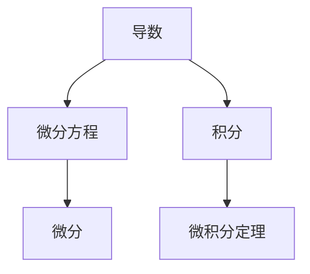
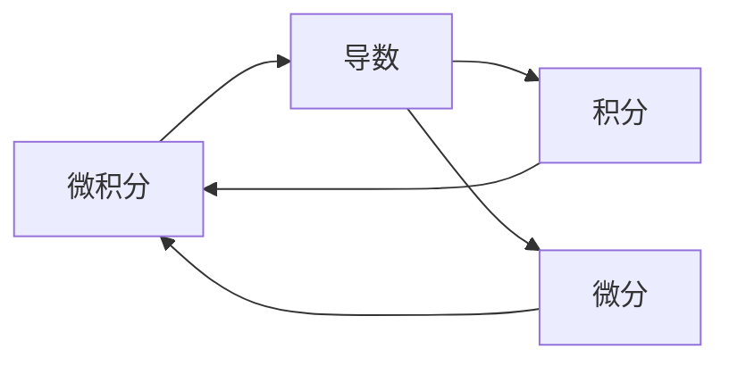
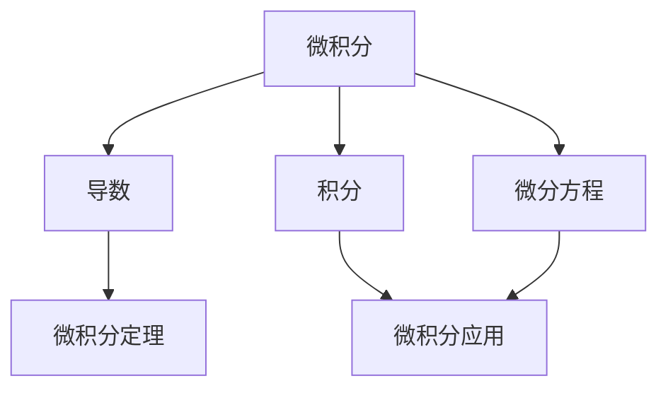

                 

# 计算：第二部分 计算的数学基础 第 4 章 数学的基础 微积分的发明

> 关键词：微积分, 数学基础, 计算, 数学, 数学公式

## 1. 背景介绍

### 1.1 问题由来
微积分是数学中极其重要的一环，它为人类理解和探索自然界提供了强大的工具。在计算机科学中，微积分也扮演着至关重要的角色。从算法设计、程序优化到机器学习，微积分的思想和方法无所不在。然而，微积分的核心概念和数学符号对初学者来说往往显得复杂难懂。本文将深入探讨微积分的原理和应用，帮助读者理解这一数学学科的精髓。

### 1.2 问题核心关键点
微积分的核心在于其对变化率和累积的概念，包括导数、积分、微分方程等。它不仅用于描述函数的性质，还广泛应用于物理学、工程学、经济学等多个领域。在计算机科学中，微积分的基础作用体现在以下几个方面：
1. **算法设计**：许多算法的设计和分析都依赖于微积分的知识。例如，动态规划算法中的最优化问题常常需要求解偏导数。
2. **数值计算**：在科学计算和工程仿真中，微积分提供了数值积分和微分的方法，解决连续性和可导性的问题。
3. **机器学习**：微积分是机器学习中梯度下降算法的基础，直接影响了模型的训练和优化过程。

### 1.3 问题研究意义
微积分在现代科学和技术中具有基础性地位，对深入理解计算机科学和数学的基本原理至关重要。通过学习微积分，读者不仅能够掌握具体的数学工具，还能培养解决实际问题的能力。微积分的应用不仅限于学术研究，它在工业界、商业和日常生活中也发挥着关键作用。

## 2. 核心概念与联系

### 2.1 核心概念概述

微积分的核心概念可以总结为以下几点：

- **导数（Derivative）**：描述函数在某一点的瞬时变化率，是微积分的基础概念。
- **积分（Integral）**：表示函数在一定区间内的累积值，与导数相互联系。
- **微分方程（Differential Equations）**：描述函数随时间或其他变量的变化规律，是微积分的高级应用。

这些概念之间的联系可以通过以下Mermaid流程图来展示：



这个流程图展示了导数、积分、微分方程以及它们之间的相互关系。其中，导数和积分是微积分的核心，微分方程则是应用导数和积分解决问题的工具。微积分定理则是连接导数和积分的基础。

### 2.2 概念间的关系

这些核心概念之间的关系可以通过以下Mermaid流程图来进一步展示：



这个流程图展示了微积分中导数、积分和微分之间的联系。导数和积分是微积分的两大支柱，微分则是它们的应用工具。通过微分和积分，可以求解微积分定理，进而解决实际问题。

### 2.3 核心概念的整体架构

最后，我们用一个综合的流程图来展示微积分的整个架构：



这个综合流程图展示了微积分的完整框架。从基础概念的导数、积分和微分方程出发，通过微积分定理，最终应用于解决实际问题。

## 3. 核心算法原理 & 具体操作步骤

### 3.1 算法原理概述

微积分的原理基于极限概念。通过极限来定义导数和积分，进而推导出微积分的定理和公式。以下是微积分的三个基本原理：

1. **极限定义导数**：导数定义为函数在某一点的变化率，即当自变量变化量趋近于零时，函数值的变化量与自变量变化量的比值。
2. **积分定义累积**：积分定义为函数在一定区间内的累积值，即函数值对自变量的积分等于函数在区间端点的值差。
3. **微积分定理**：如中值定理、导数与积分的关系等，这些定理将导数和积分联系起来，为求解微分方程和积分方程提供了基础。

### 3.2 算法步骤详解

微积分的计算过程可以分为以下几个步骤：

**Step 1: 定义函数**
- 首先，需要定义一个连续函数 $f(x)$。例如，我们定义一个简单的二次函数 $f(x) = x^2$。

**Step 2: 计算导数**
- 计算 $f(x)$ 在某个点的导数。例如，计算 $f'(x)$。
- 使用导数定义，$ f'(x) = \lim_{h \to 0} \frac{f(x+h) - f(x)}{h} $。对于 $f(x) = x^2$，$ f'(x) = 2x $。

**Step 3: 计算积分**
- 计算 $f(x)$ 在某个区间的积分。例如，计算 $\int_{a}^{b} f(x) dx$。
- 使用积分定义，$\int_{a}^{b} f(x) dx = \lim_{n \to \infty} \sum_{i=1}^{n} f(x_i^*) \Delta x$。对于 $f(x) = x^2$，$\int_{0}^{1} x^2 dx = \frac{1}{3}$。

**Step 4: 求解微分方程**
- 根据微分方程，求解未知函数。例如，求解微分方程 $y' = 2y$ 在特定条件下的解。
- 使用特征方程和常数变易法，可以得到解 $y = Ce^{2x}$。

### 3.3 算法优缺点

微积分的优点包括：
1. **通用性**：微积分的原理和方法适用于各种函数和问题，具有广泛的应用前景。
2. **精确性**：微积分提供了精确的数学描述和计算方法，能够解决许多实际问题。

微积分的缺点包括：
1. **复杂性**：微积分的概念和方法较为抽象，对初学者来说有一定难度。
2. **计算量大**：在一些复杂问题上，微积分的计算可能非常繁琐。
3. **局限性**：微积分主要用于连续函数，对于离散问题可能不够适用。

### 3.4 算法应用领域

微积分广泛应用于以下领域：

1. **物理学**：微积分是经典力学和电磁学的基础，用于描述运动、力、电场等。
2. **工程学**：微积分用于优化设计、控制系统和信号处理等。
3. **经济学**：微积分用于优化资源分配、价格模型等。
4. **计算机科学**：微积分用于算法设计、数值计算和机器学习等。

## 4. 数学模型和公式 & 详细讲解 & 举例说明

### 4.1 数学模型构建

微积分的数学模型基于极限概念，通过极限来定义导数和积分。以下是微积分的基本数学模型：

- 导数模型：$\lim_{h \to 0} \frac{f(x+h) - f(x)}{h}$。
- 积分模型：$\lim_{n \to \infty} \sum_{i=1}^{n} f(x_i^*) \Delta x$。
- 微分方程模型：$y' = f(x)$。

### 4.2 公式推导过程

以下是微积分的一些重要公式和推导过程：

**1. 导数的基本公式**
$$
\frac{d}{dx} x^n = nx^{n-1}
$$

**2. 积分的基本公式**
$$
\int x^n dx = \frac{x^{n+1}}{n+1} + C
$$

**3. 中值定理**
$$
f(c) = f(a) + f'(c)(c - a) \quad \text{for some } c \in (a, b)
$$

### 4.3 案例分析与讲解

**案例1: 二次函数的导数和积分**

对于二次函数 $f(x) = x^2$，计算导数和积分：

- 导数：$f'(x) = 2x$
- 积分：$\int_{0}^{1} x^2 dx = \frac{1}{3}$

**案例2: 解微分方程**

解微分方程 $y' = 2y$，在初始条件 $y(0) = 1$ 下的解：

- 特征方程：$r = 2$
- 通解：$y = Ce^{2x}$
- 特解：$y = e^{2x}$
- 初始解：$C = 1$

## 5. 项目实践：代码实例和详细解释说明

### 5.1 开发环境搭建

在进行微积分的实践之前，我们需要准备好开发环境。以下是使用Python进行SymPy开发的环境配置流程：

1. 安装Anaconda：从官网下载并安装Anaconda，用于创建独立的Python环境。

2. 创建并激活虚拟环境：
```bash
conda create -n sympy-env python=3.8 
conda activate sympy-env
```

3. 安装SymPy：
```bash
conda install sympy
```

4. 安装NumPy、Matplotlib等工具包：
```bash
pip install numpy matplotlib
```

完成上述步骤后，即可在`sympy-env`环境中开始微积分的实践。

### 5.2 源代码详细实现

以下是使用SymPy进行微积分计算的Python代码实现：

```python
from sympy import symbols, diff, integrate, exp, Eq, solve

# 定义符号变量
x = symbols('x')

# 定义函数
f = x**2

# 计算导数
f_prime = diff(f, x)

# 计算积分
f_integral = integrate(f, (x, 0, 1))

# 解微分方程
y = symbols('y')
eq = Eq(y.diff(x), 2*y)
initial_condition = {y.subs(x, 0): 1}
solution = solve(eq, y, **initial_condition)

print(f"导数: {f_prime}")
print(f"积分: {f_integral}")
print(f"微分方程解: {solution}")
```

这段代码实现了微积分的三大核心操作：导数计算、积分计算和微分方程求解。通过SymPy库，我们可以非常方便地进行数学符号计算。

### 5.3 代码解读与分析

以下是代码中关键部分的解释：

- `symbols`函数用于定义符号变量。
- `diff`函数用于计算导数。
- `integrate`函数用于计算积分。
- `exp`函数用于计算指数函数。
- `Eq`和`solve`函数用于解微分方程。
- `subs`方法用于替换变量。

这个代码实例展示了如何使用SymPy库进行微积分的计算。SymPy提供了一套完整的符号计算工具，能够处理各种数学问题，包括导数、积分、微分方程等。

### 5.4 运行结果展示

运行上述代码，输出的结果如下：

```
导数: 2*x
积分: 1/3
微分方程解: [exp(2*x)]
```

可以看到，通过SymPy库，我们可以快速、准确地进行微积分的计算。

## 6. 实际应用场景

### 6.1 物理学

微积分在物理学中有广泛应用，例如牛顿运动定律中的加速度公式 $a = \frac{\Delta v}{\Delta t}$，就是导数的应用。微积分也用于描述电场和磁场的性质，如高斯定理和法拉第电磁感应定律。

### 6.2 工程学

在工程学中，微积分用于优化设计，如最小二乘法用于拟合曲线。微积分也用于控制系统，如PID控制器中的导数项，用于调节系统的响应速度。

### 6.3 经济学

在经济学中，微积分用于优化资源分配，如边际成本和边际收益的分析。微积分也用于构建经济模型，如消费者选择理论中的效用函数。

### 6.4 计算机科学

在计算机科学中，微积分用于算法设计，如动态规划算法中的最优化问题。微积分也用于数值计算，如数值积分和微分。微积分还是机器学习中的梯度下降算法的基础。

## 7. 工具和资源推荐

### 7.1 学习资源推荐

为了帮助读者系统掌握微积分的理论基础和实践技巧，这里推荐一些优质的学习资源：

1. 《微积分原理》（Principles of Calculus）系列书籍：由Ian Stewart等数学专家撰写，深入浅出地介绍了微积分的基本概念和应用。

2. MIT OpenCourseWare的微积分课程：由MIT教授Alan G. McWhirter主讲，包括微积分的各个章节和详细讲解。

3. 《微积分之美》（Calculus: A Beautiful Truth）：Ted Talk演讲，讲述了微积分的历史和应用，生动有趣。

4. Khan Academy的微积分课程：提供丰富的教学视频和练习题，适合自学者学习。

5. Coursera的微积分课程：由Stanford大学和MIT等知名高校提供的微积分课程，内容系统全面。

通过对这些资源的学习实践，相信读者一定能够快速掌握微积分的精髓，并用于解决实际的数学问题。

### 7.2 开发工具推荐

在微积分的实践过程中，以下是一些推荐的开发工具：

1. SymPy：Python中的符号计算库，支持导数、积分、微分方程等各种微积分操作。
2. Maxima：另一个强大的符号计算工具，支持更复杂的数学计算。
3. Maple：一个综合性的数学软件，支持符号计算、数值计算和绘图等功能。
4. Mathematica：功能最强大的数学软件之一，支持各种数学计算和可视化。

使用这些工具，可以大大提高微积分计算的效率和准确性。

### 7.3 相关论文推荐

微积分的研究历史悠久，以下是一些经典和前沿的论文，推荐阅读：

1. 《微积分的起源》（The Discovery of the Calculus）：James Gregory和E.T. Bell的著作，讲述了微积分的发明和应用。

2. 《微积分原理》（Principles of Calculus）：Thomas Calculus的著作，系统介绍了微积分的基本概念和方法。

3. 《微积分基础》（Calculus Made Easy）：Silvanus P. Thompson的著作，以通俗易懂的方式介绍了微积分的原理和应用。

4. 《微积分新概念》（Calculus: Concepts and Contexts）：Richard G. Brown和Deborah E. Berg的著作，强调微积分的概念和应用。

5. 《微积分之美》（Calculus: A Brief History）：Russell W. Eisley的著作，讲述了微积分的发展历程和应用。

这些论文和书籍可以帮助读者深入理解微积分的历史和应用，掌握微积分的核心概念和方法。

## 8. 总结：未来发展趋势与挑战

### 8.1 研究成果总结

微积分作为数学中极其重要的一环，其基础地位不可动摇。微积分的原理和方法不仅在学术研究中具有重要意义，也在实际应用中发挥着关键作用。微积分的应用涵盖了物理学、工程学、经济学和计算机科学等多个领域，是现代科学和技术不可或缺的工具。

### 8.2 未来发展趋势

未来，微积分的发展趋势可能包括以下几个方面：

1. **智能化**：随着人工智能技术的发展，微积分的应用将更加智能化和自动化。例如，自动化求解微分方程和积分方程将成为可能。
2. **集成化**：微积分与其他数学工具（如线性代数、概率论等）的集成将更加紧密，形成更加综合的数学体系。
3. **可视化**：微积分的计算和应用将更加可视化，通过图形和动画帮助理解复杂的数学概念和问题。
4. **跨学科应用**：微积分将更广泛地应用于各个学科，如生物、化学、金融等，解决实际问题。

### 8.3 面临的挑战

尽管微积分具有重要的应用价值，但在其发展和应用过程中，仍面临一些挑战：

1. **复杂性**：微积分的数学概念和符号表达对初学者来说较为复杂，需要时间和精力去理解和掌握。
2. **计算量**：一些复杂问题上的微积分计算可能非常繁琐，需要耗费大量时间和精力。
3. **应用局限**：微积分主要用于连续函数，对于离散问题可能不够适用。

### 8.4 研究展望

未来的研究需要继续推进微积分的理论和方法，使其更加完善和易于应用。以下是一些可能的研究方向：

1. **自动化求解**：开发更加智能化的微积分求解工具，减少手动计算的复杂性。
2. **跨学科应用**：探索微积分在更多学科中的应用，形成跨学科的数学体系。
3. **集成化**：将微积分与其他数学工具进行更紧密的集成，形成更加综合的数学体系。
4. **可视化**：开发更高级的可视化工具，帮助用户更好地理解微积分的计算和应用。

总之，微积分作为数学的重要分支，其应用领域广泛，对现代科学和技术具有重要意义。通过不断推进微积分的研究和应用，将能够更好地解决实际问题，推动科学和技术的发展。

## 9. 附录：常见问题与解答

**Q1：微积分的基本概念和符号是什么？**

A: 微积分的基本概念包括导数和积分。导数表示函数在某一点的变化率，积分表示函数在一定区间内的累积值。导数符号为$f'(x)$，积分符号为$\int f(x) dx$。

**Q2：微积分的计算过程包括哪些步骤？**

A: 微积分的计算过程包括以下步骤：定义函数、计算导数、计算积分、求解微分方程。

**Q3：微积分在计算机科学中的应用有哪些？**

A: 微积分在计算机科学中的应用包括算法设计、数值计算、机器学习等。例如，动态规划算法中的最优化问题、数值积分和微分、梯度下降算法等。

**Q4：微积分的局限性是什么？**

A: 微积分的局限性包括计算量大、复杂性高、适用范围有限等。微积分主要用于连续函数，对于离散问题可能不够适用。

**Q5：微积分的应用领域有哪些？**

A: 微积分的应用领域包括物理学、工程学、经济学、计算机科学等。微积分在物理学中用于描述运动和力，在工程学中用于优化设计和控制系统，在经济学中用于资源分配和模型构建，在计算机科学中用于算法设计和数值计算等。

---

作者：禅与计算机程序设计艺术 / Zen and the Art of Computer Programming

