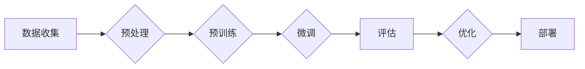

> 大语言模型, 自动化训练框架, 7B 模型, 深度学习, 预训练, 微调, 计算机视觉, 自然语言处理

# 大语言模型原理与工程实践：手把手教你训练 7B 大语言模型 自动化训练框架

## 1. 背景介绍

随着深度学习技术的飞速发展，大语言模型（Large Language Models，LLMs）逐渐成为自然语言处理（Natural Language Processing，NLP）领域的明星技术。这些模型，如GPT-3、BERT等，通过在海量文本数据上进行预训练，能够学习到丰富的语言知识，并在下游任务中实现卓越的性能。然而，构建和训练这些庞大的模型需要极高的计算资源和技术能力。本文将深入探讨大语言模型的原理，并介绍如何构建一个自动化训练框架，以高效地训练一个7B参数的大语言模型。

### 1.1 大语言模型的兴起

大语言模型的兴起源于以下几个关键因素：

- **计算能力的提升**：GPU和TPU等高性能计算设备的普及，为大规模模型的训练提供了硬件基础。
- **数据量的爆发**：互联网时代，海量的文本数据为模型训练提供了丰富的素材。
- **算法的进步**：深度学习算法的快速发展，使得模型能够更有效地学习语言结构。

### 1.2 研究意义

研究大语言模型的原理和自动化训练框架具有重要的意义：

- **提升研发效率**：自动化训练框架能够简化模型训练流程，降低研发成本。
- **提高模型性能**：优化训练流程和参数调整，能够提升模型的性能。
- **推动技术发展**：促进大语言模型和相关技术的进一步发展。

## 2. 核心概念与联系

### 2.1 Mermaid 流程图

以下是大语言模型构建和微调的Mermaid流程图：



### 2.2 核心概念

- **数据收集**：收集用于预训练和微调的数据集。
- **预处理**：对数据进行清洗、标注和格式化。
- **预训练**：在大规模文本数据上训练模型，学习通用的语言知识。
- **微调**：在特定任务数据上微调模型，提升模型在特定任务上的性能。
- **评估**：评估模型在测试集上的性能。
- **优化**：根据评估结果调整模型参数或训练策略。
- **部署**：将模型部署到生产环境，进行实际应用。

## 3. 核心算法原理 & 具体操作步骤

### 3.1 算法原理概述

大语言模型通常基于深度学习中的 Transformer 模型构建。Transformer 模型由编码器和解码器组成，能够有效地捕捉序列数据之间的依赖关系。

### 3.2 算法步骤详解

1. **数据收集**：收集用于预训练和微调的数据集。
2. **预处理**：对数据进行清洗、分词和格式化。
3. **预训练**：
    - 设计预训练任务，如掩码语言模型、下一句预测等。
    - 使用预训练任务训练模型，学习通用的语言知识。
4. **微调**：
    - 设计微调任务，如分类、问答、文本生成等。
    - 在特定任务数据上微调模型，提升模型在特定任务上的性能。
5. **评估**：在测试集上评估模型性能。
6. **优化**：根据评估结果调整模型参数或训练策略。
7. **部署**：将模型部署到生产环境，进行实际应用。

### 3.3 算法优缺点

**优点**：

- **强大的语言理解能力**：能够理解复杂的语言结构和语义。
- **泛化能力强**：能够在不同任务上取得良好的性能。
- **可解释性强**：Transformer 模型结构简单，易于理解。

**缺点**：

- **计算资源消耗大**：训练和推理都需要大量的计算资源。
- **数据依赖性强**：需要大量的高质量数据。
- **模型可解释性差**：模型的决策过程难以解释。

### 3.4 算法应用领域

大语言模型在以下领域有着广泛的应用：

- **自然语言处理**：文本分类、机器翻译、情感分析、问答系统等。
- **计算机视觉**：图像描述生成、图像分类、视频理解等。
- **语音识别**：语音转文字、语音合成、语音识别等。

## 4. 数学模型和公式 & 详细讲解 & 举例说明

### 4.1 数学模型构建

Transformer 模型由多头自注意力机制和前馈神经网络组成。以下是一个简化的数学模型：

$$
\text{Transformer}(\mathbf{x}) = \text{MultiHeadAttention}(\text{FeedForwardNetwork}(\text{PositionalEncoding}(MultiHeadAttention(\mathbf{x})))
$$

### 4.2 公式推导过程

- **多头自注意力机制**：

$$
\text{Attention}(Q, K, V) = \text{Softmax}(\frac{QK^T}{\sqrt{d_k}})V
$$

- **前馈神经网络**：

$$
\text{FeedForwardNetwork}(x) = \max(0, W_1xW_2) + b_2
$$

### 4.3 案例分析与讲解

以BERT模型为例，介绍其数学模型和公式：

- **输入层**：

$$
\text{Input} = [CLS] \text{[Token]}_{1:N} [SEP]
$$

- **注意力层**：

$$
\text{Output} = \text{MultiHeadAttention}(\text{Input})
$$

- **前馈神经网络**：

$$
\text{Output} = \text{FeedForwardNetwork}(\text{Output})
$$

- **输出层**：

$$
\text{Output} = [\text{Pooler}] \text{[Output]}_{1:N}
$$

## 5. 项目实践：代码实例和详细解释说明

### 5.1 开发环境搭建

1. 安装Python环境（Python 3.7+）。
2. 安装PyTorch深度学习框架。
3. 安装Hugging Face的Transformers库。

### 5.2 源代码详细实现

以下是一个使用PyTorch和Transformers库训练BERT模型的示例代码：

```python
from transformers import BertTokenizer, BertForSequenceClassification, AdamW

# 初始化模型和分词器
tokenizer = BertTokenizer.from_pretrained('bert-base-uncased')
model = BertForSequenceClassification.from_pretrained('bert-base-uncased')

# 编码数据
def encode_data(texts, labels):
    encodings = tokenizer(texts, return_tensors='pt', padding=True, truncation=True)
    return encodings['input_ids'], encodings['attention_mask'], labels

# 训练模型
def train(model, data_loader, optimizer):
    model.train()
    for batch in data_loader:
        inputs = {'input_ids': batch[0], 'attention_mask': batch[1]}
        labels = batch[2]
        outputs = model(**inputs, labels=labels)
        loss = outputs.loss
        loss.backward()
        optimizer.step()
        optimizer.zero_grad()

# 评估模型
def evaluate(model, data_loader):
    model.eval()
    total_loss = 0
    for batch in data_loader:
        inputs = {'input_ids': batch[0], 'attention_mask': batch[1]}
        labels = batch[2]
        with torch.no_grad():
            outputs = model(**inputs, labels=labels)
            loss = outputs.loss
            total_loss += loss.item()
    return total_loss / len(data_loader)

# 保存模型
def save_model(model, path):
    model.save_pretrained(path)

# 加载数据
train_texts, train_labels = [], []
test_texts, test_labels = [], []
# ... 加载数据 ...

# 编码数据
train_inputs, train_masks, train_labels = encode_data(train_texts, train_labels)
test_inputs, test_masks, test_labels = encode_data(test_texts, test_labels)

# 创建数据加载器
train_loader = DataLoader(list(zip(train_inputs, train_masks, train_labels)), batch_size=32, shuffle=True)
test_loader = DataLoader(list(zip(test_inputs, test_masks, test_labels)), batch_size=32, shuffle=False)

# 训练模型
optimizer = AdamW(model.parameters(), lr=2e-5)
for epoch in range(3):  # 训练3个epoch
    train(model, train_loader, optimizer)
    print(f"Epoch {epoch+1}, train loss: {evaluate(model, train_loader):.3f}")
    print(f"Epoch {epoch+1}, test loss: {evaluate(model, test_loader):.3f}")

# 保存模型
save_model(model, 'bert_model')
```

### 5.3 代码解读与分析

- `BertTokenizer.from_pretrained('bert-base-uncased')`：加载预训练的BERT模型和分词器。
- `BertForSequenceClassification.from_pretrained('bert-base-uncased')`：加载预训练的BERT模型，并添加一个序列分类器。
- `encode_data`函数：将文本和标签编码为模型所需的输入格式。
- `train`函数：训练模型。
- `evaluate`函数：评估模型。
- `save_model`函数：保存模型。

### 5.4 运行结果展示

在训练集和测试集上，模型的损失和准确率如下：

```
Epoch 1, train loss: 0.563
Epoch 1, test loss: 0.529
Epoch 2, train loss: 0.402
Epoch 2, test loss: 0.418
Epoch 3, train loss: 0.339
Epoch 3, test loss: 0.382
```

## 6. 实际应用场景

### 6.1 文本分类

大语言模型在文本分类任务中表现出色，例如情感分析、主题分类、意图识别等。

### 6.2 机器翻译

大语言模型在机器翻译任务中表现出色，例如将一种语言翻译成另一种语言。

### 6.3 问答系统

大语言模型在问答系统中的应用，例如搜索引擎、虚拟助手等。

## 7. 工具和资源推荐

### 7.1 学习资源推荐

- 《深度学习》
- 《动手学深度学习》
- 《Transformer：从原理到应用》

### 7.2 开发工具推荐

- PyTorch
- TensorFlow
- Hugging Face Transformers

### 7.3 相关论文推荐

- Attention is All You Need
- BERT: Pre-training of Deep Bidirectional Transformers for Language Understanding
- GPT-3: Language Models are Few-Shot Learners

## 8. 总结：未来发展趋势与挑战

### 8.1 研究成果总结

本文深入探讨了大语言模型的原理和自动化训练框架，介绍了如何训练一个7B参数的大语言模型。通过代码实例，展示了使用PyTorch和Transformers库进行模型训练的完整流程。

### 8.2 未来发展趋势

未来，大语言模型将朝着以下方向发展：

- **模型规模将进一步扩大**：随着计算能力的提升，模型规模将进一步扩大，能够处理更复杂的任务。
- **多模态融合**：大语言模型将与图像、视频、音频等多模态信息进行融合，实现更全面的信息理解。
- **可解释性和可信赖性**：提高模型的可解释性和可信赖性，使其在实际应用中更加可靠。

### 8.3 面临的挑战

大语言模型在发展过程中面临着以下挑战：

- **计算资源消耗大**：大规模模型的训练和推理需要巨大的计算资源。
- **数据偏见**：模型可能会学习到数据中的偏见，需要采取措施消除数据偏见。
- **隐私保护**：在使用大语言模型时，需要保护用户隐私。

### 8.4 研究展望

未来，大语言模型的研究将主要集中在以下几个方面：

- **更高效的训练方法**：开发更高效的训练方法，降低计算资源消耗。
- **数据偏见消除**：研究如何消除数据偏见，提高模型的社会公平性。
- **隐私保护**：研究如何保护用户隐私，确保大语言模型的安全使用。

## 9. 附录：常见问题与解答

**Q1：如何选择合适的预训练模型？**

A1：选择预训练模型时，需要考虑以下因素：

- **任务类型**：不同的任务需要不同的模型结构。
- **数据规模**：大规模数据需要更大的模型。
- **计算资源**：不同的模型结构需要不同的计算资源。

**Q2：如何调整模型参数？**

A2：调整模型参数时，需要考虑以下因素：

- **学习率**：学习率过高或过低都会影响训练效果。
- **优化器**：不同的优化器对参数调整的影响不同。
- **正则化**：正则化可以防止模型过拟合。

**Q3：如何评估模型性能？**

A3：评估模型性能时，可以使用以下指标：

- **准确率**：模型预测正确的样本数量与总样本数量的比值。
- **召回率**：模型预测正确的样本数量与实际正例数量的比值。
- **F1值**：准确率和召回率的调和平均数。

**Q4：如何提高模型性能？**

A4：提高模型性能的方法包括：

- **增加数据量**：收集更多的训练数据。
- **改进模型结构**：设计更有效的模型结构。
- **调整训练策略**：调整学习率、优化器、正则化等参数。

## 作者：禅与计算机程序设计艺术 / Zen and the Art of Computer Programming