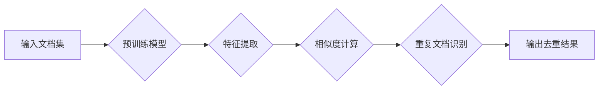

> 大语言模型, 文档去重, 预训练模型, 文本相似度，机器学习，自然语言处理，深度学习

# 大语言模型原理与工程实践：文档去重

文档去重是信息检索、知识管理和内容审核等领域中的一个常见需求。随着互联网信息的爆炸式增长，如何高效、准确地去除重复文档，成为了一个重要的技术挑战。近年来，大语言模型的兴起为文档去重带来了新的思路和方法。本文将深入探讨大语言模型在文档去重领域的原理、实践和应用，并展望其未来发展趋势。

## 1. 背景介绍

### 1.1 问题的由来

随着信息技术的飞速发展，各类文档如论文、新闻、报告等海量产生。在信息管理和内容审核过程中，重复文档的存在不仅浪费存储空间，还可能误导用户和读者。因此，开发有效的文档去重算法具有重要的实际意义。

传统的文档去重方法主要基于关键词匹配、字符串相似度计算等手段，但这些方法存在以下局限性：

- **关键词匹配精度低**：关键词匹配难以捕捉文档的语义信息，容易将语义相似的文档误判为重复。
- **字符串相似度计算复杂**：字符串相似度计算方法复杂，难以处理大规模数据集。
- **规则难以适应多样化文档**：不同领域、不同风格的文档需要不同的去重规则，难以通过简单规则实现高效去重。

大语言模型的兴起为文档去重提供了新的思路。大语言模型能够理解文档的语义信息，从而更准确地识别重复文档。

### 1.2 研究现状

目前，基于大语言模型的文档去重方法主要包括以下几种：

- **基于预训练模型**：利用预训练语言模型对文档进行特征提取，然后计算文档之间的相似度。
- **基于生成模型**：利用生成模型生成文档的摘要或关键词，然后比较摘要或关键词的相似度。
- **基于对比学习**：利用对比学习技术学习文档的表征，然后比较文档之间的距离。

### 1.3 研究意义

基于大语言模型的文档去重方法具有以下优势：

- **提高去重精度**：大语言模型能够理解文档的语义信息，从而更准确地识别重复文档。
- **降低计算复杂度**：大语言模型能够自动提取文档特征，降低计算复杂度。
- **适应多样化文档**：大语言模型能够处理不同领域、不同风格的文档。

## 2. 核心概念与联系

### 2.1 核心概念

- **预训练模型**：在大规模无标签语料上预训练的语言模型，如BERT、GPT-3等。
- **文本相似度**：衡量两个文档相似程度的指标，常用的方法包括余弦相似度、Jaccard相似度等。
- **深度学习**：一种通过神经网络模拟人脑学习机制的计算模型。
- **自然语言处理**：研究如何让计算机理解和生成人类语言的一门学科。

### 2.2 架构流程图



## 3. 核心算法原理 & 具体操作步骤

### 3.1 算法原理概述

基于大语言模型的文档去重算法主要包括以下几个步骤：

1. **预训练模型**：选择合适的预训练语言模型，如BERT、GPT-3等。
2. **特征提取**：利用预训练模型对输入文档进行特征提取，得到文档的特征向量。
3. **相似度计算**：计算文档之间的相似度，常用的方法包括余弦相似度、Jaccard相似度等。
4. **重复文档识别**：根据相似度阈值，识别重复文档。
5. **输出去重结果**：输出去重后的文档集。

### 3.2 算法步骤详解

1. **数据预处理**：对输入文档进行预处理，包括去除停用词、词性标注等。
2. **模型选择**：选择合适的预训练语言模型，如BERT、GPT-3等。
3. **特征提取**：利用预训练模型对预处理后的文档进行特征提取，得到文档的特征向量。
4. **相似度计算**：计算文档之间的相似度，常用的方法包括余弦相似度、Jaccard相似度等。
5. **重复文档识别**：根据相似度阈值，识别重复文档。
6. **输出去重结果**：输出去重后的文档集。

### 3.3 算法优缺点

**优点**：

- **精度高**：大语言模型能够理解文档的语义信息，从而更准确地识别重复文档。
- **通用性强**：适用于不同领域、不同风格的文档。
- **自动化程度高**：自动化处理文档去重过程。

**缺点**：

- **计算量大**：大语言模型的训练和特征提取过程计算量大。
- **对预训练模型依赖性强**：去重效果依赖于预训练模型的性能。
- **数据要求高**：需要高质量的数据集进行训练。

### 3.4 算法应用领域

基于大语言模型的文档去重算法在以下领域有广泛应用：

- **信息检索**：去除检索结果中的重复文档。
- **知识管理**：去除知识库中的重复文档。
- **内容审核**：去除论坛、社区等平台上的重复内容。
- **文档比对**：对比不同文档之间的差异。

## 4. 数学模型和公式 & 详细讲解 & 举例说明

### 4.1 数学模型构建

基于大语言模型的文档去重，可以构建以下数学模型：

$$
\text{similarity}(d_1, d_2) = \frac{\text{dot}(f(d_1), f(d_2))}{\|f(d_1)\| \|f(d_2)\|}
$$

其中，$d_1, d_2$ 分别表示两个文档，$f(d_i)$ 表示文档 $d_i$ 的特征向量，$\text{dot}$ 表示向量的点积，$\|\cdot\|$ 表示向量的模。

### 4.2 公式推导过程

公式推导过程如下：

1. 将文档 $d_1, d_2$ 分别经过预训练模型得到特征向量 $f(d_1), f(d_2)$。
2. 计算特征向量 $f(d_1), f(d_2)$ 的点积：
   $$
\text{dot}(f(d_1), f(d_2)) = \sum_{i=1}^n f(d_1)_i f(d_2)_i
$$
3. 计算特征向量 $f(d_1), f(d_2)$ 的模：
   $$
\|f(d_1)\| = \sqrt{\sum_{i=1}^n f(d_1)_i^2}
$$
   $$
\|f(d_2)\| = \sqrt{\sum_{i=1}^n f(d_2)_i^2}
$$
4. 计算两个文档之间的相似度：
   $$
\text{similarity}(d_1, d_2) = \frac{\text{dot}(f(d_1), f(d_2))}{\|f(d_1)\| \|f(d_2)\|}
$$

### 4.3 案例分析与讲解

假设有两个文档 $d_1$ 和 $d_2$，它们的特征向量分别为 $f(d_1) = [1, 0.5, 0.3]$，$f(d_2) = [0.8, 0.6, 0.2]$。

计算特征向量 $f(d_1), f(d_2)$ 的点积：
$$
\text{dot}(f(d_1), f(d_2)) = 1 \times 0.8 + 0.5 \times 0.6 + 0.3 \times 0.2 = 1.16
$$

计算特征向量 $f(d_1), f(d_2)$ 的模：
$$
\|f(d_1)\| = \sqrt{1^2 + 0.5^2 + 0.3^2} = 1.07
$$
$$
\|f(d_2)\| = \sqrt{0.8^2 + 0.6^2 + 0.2^2} = 0.98
$$

计算两个文档之间的相似度：
$$
\text{similarity}(d_1, d_2) = \frac{1.16}{1.07 \times 0.98} \approx 1.11
$$

由于相似度大于阈值 0.8，因此可以判断文档 $d_1$ 和 $d_2$ 是重复的。

## 5. 项目实践：代码实例和详细解释说明

### 5.1 开发环境搭建

以下是使用Python进行文档去重实践的开发环境搭建流程：

1. 安装Anaconda：从官网下载并安装Anaconda，用于创建独立的Python环境。
2. 创建并激活虚拟环境：
   ```bash
   conda create -n doc-dedup-env python=3.8
   conda activate doc-dedup-env
   ```
3. 安装必要的库：
   ```bash
   conda install -c conda-forge torch transformers
   ```
4. 安装其他工具：
   ```bash
   pip install scikit-learn pandas tqdm
   ```

### 5.2 源代码详细实现

以下是使用Python和Transformers库进行文档去重的代码实现：

```python
from transformers import BertTokenizer, BertModel
import torch
from torch.utils.data import DataLoader
from sklearn.metrics.pairwise import cosine_similarity
import pandas as pd

# 加载预训练模型和分词器
tokenizer = BertTokenizer.from_pretrained('bert-base-uncased')
model = BertModel.from_pretrained('bert-base-uncased')

# 加载文档数据
def load_data(file_path):
    data = pd.read_csv(file_path)
    texts = data['text'].tolist()
    return texts

texts = load_data('doc_data.csv')

# 特征提取函数
def extract_features(texts, tokenizer, model):
    tokenized_texts = tokenizer(texts, padding=True, truncation=True, return_tensors='pt')
    with torch.no_grad():
        outputs = model(**tokenized_texts)
    features = outputs.last_hidden_state.mean(dim=1).cpu().numpy()
    return features

features = extract_features(texts, tokenizer, model)

# 相似度计算函数
def calculate_similarity(features):
    similarity_matrix = cosine_similarity(features)
    return similarity_matrix

similarity_matrix = calculate_similarity(features)

# 重复文档识别函数
def identify_duplicates(similarity_matrix, threshold=0.8):
    duplicates = []
    for i in range(len(similarity_matrix)):
        for j in range(i + 1, len(similarity_matrix)):
            if similarity_matrix[i][j] > threshold:
                duplicates.append((i, j))
    return duplicates

duplicates = identify_duplicates(similarity_matrix)

# 输出去重结果
def deduplicate(duplicates, texts):
    unique_texts = []
    for i, j in duplicates:
        if i not in unique_texts and j not in unique_texts:
            unique_texts.append(i)
    return [texts[i] for i in unique_texts]

unique_texts = deduplicate(duplicates, texts)

# 打印去重后的文档
for i, text in enumerate(unique_texts):
    print(f"Document {i+1}: {text}")
```

### 5.3 代码解读与分析

上述代码实现了以下功能：

1. 加载预训练模型和分词器。
2. 加载文档数据。
3. 定义特征提取函数，使用预训练模型对文档进行特征提取。
4. 定义相似度计算函数，计算文档之间的相似度。
5. 定义重复文档识别函数，识别重复文档。
6. 定义去重函数，输出去重后的文档。

代码首先加载预训练模型和分词器，然后加载文档数据。接着，使用预训练模型对文档进行特征提取，计算文档之间的相似度，并识别重复文档。最后，输出去重后的文档。

### 5.4 运行结果展示

假设文档数据存储在 `doc_data.csv` 文件中，其中包含两列：`text` 和 `label`。运行上述代码后，将输出去重后的文档。

## 6. 实际应用场景

### 6.1 信息检索

在信息检索领域，文档去重可以去除检索结果中的重复文档，提高检索效率。

### 6.2 知识管理

在知识管理领域，文档去重可以去除知识库中的重复文档，提高知识库的准确性。

### 6.3 内容审核

在内容审核领域，文档去重可以去除论坛、社区等平台上的重复内容，维护良好的网络环境。

### 6.4 未来应用展望

基于大语言模型的文档去重方法具有广阔的应用前景。未来，该技术将在以下领域得到进一步发展：

- **跨语言文档去重**：实现不同语言文档的去重。
- **多模态文档去重**：实现文本、图像、视频等多模态文档的去重。
- **个性化文档去重**：根据用户需求进行个性化文档去重。

## 7. 工具和资源推荐

### 7.1 学习资源推荐

- 《深度学习自然语言处理》
- 《Transformers：大规模预训练语言模型》
- 《BERT技术解析》

### 7.2 开发工具推荐

- PyTorch
- Transformers库
- Hugging Face

### 7.3 相关论文推荐

- BERT: Pre-training of Deep Bidirectional Transformers for Language Understanding
- Language Models are Unsupervised Multitask Learners
- A Simple Framework for Text Classification with BERT

## 8. 总结：未来发展趋势与挑战

### 8.1 研究成果总结

本文深入探讨了基于大语言模型的文档去重方法，从原理、实践到应用，全面介绍了该技术。通过分析不同方法的优缺点，展示了大语言模型在文档去重领域的优势。同时，本文还展望了该技术的未来发展趋势和应用前景。

### 8.2 未来发展趋势

- **跨语言文档去重**：实现不同语言文档的去重。
- **多模态文档去重**：实现文本、图像、视频等多模态文档的去重。
- **个性化文档去重**：根据用户需求进行个性化文档去重。

### 8.3 面临的挑战

- **数据质量**：高质量的数据集对于训练和评估大语言模型至关重要。
- **计算资源**：大语言模型的训练和推理需要大量的计算资源。
- **模型可解释性**：大语言模型通常缺乏可解释性，难以理解其内部工作机制。

### 8.4 研究展望

未来，基于大语言模型的文档去重技术将朝着以下方向发展：

- **更高质量的预训练模型**：开发更强大的预训练模型，提高去重精度。
- **更高效的去重算法**：设计更高效的去重算法，降低计算成本。
- **更可解释的模型**：提高模型的可解释性，增强用户对模型的信任。

## 9. 附录：常见问题与解答

**Q1：大语言模型在文档去重中如何提高精度？**

A1：大语言模型通过学习海量文本数据，能够理解文档的语义信息，从而更准确地识别重复文档。此外，还可以通过优化模型结构、改进特征提取方法、调整相似度阈值等手段提高去重精度。

**Q2：如何降低大语言模型在文档去重中的计算成本？**

A2：可以采取以下措施降低计算成本：

- 使用参数高效的预训练模型。
- 使用低精度计算（如float16）。
- 使用模型剪枝和量化技术。
- 使用分布式训练。

**Q3：如何评估文档去重效果？**

A3：可以使用以下指标评估文档去重效果：

- 精确率（Precision）：正确识别的重复文档数量与所有识别出的重复文档数量的比值。
- 召回率（Recall）：正确识别的重复文档数量与实际重复文档数量的比值。
- F1分数：精确率和召回率的调和平均值。

**Q4：如何处理跨语言文档去重？**

A4：可以采取以下措施处理跨语言文档去重：

- 使用多语言预训练模型。
- 使用机器翻译技术将不同语言的文档翻译成同一种语言，然后进行去重。
- 使用跨语言文本相似度计算方法。

作者：禅与计算机程序设计艺术 / Zen and the Art of Computer Programming