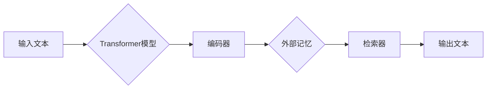

# 大语言模型原理基础与前沿 外部记忆

> 关键词：大语言模型，外部记忆，知识表示，注意力机制，神经网络，自然语言处理，机器学习

## 1. 背景介绍

随着人工智能技术的飞速发展，自然语言处理（NLP）领域取得了显著的成果。大语言模型（Large Language Model，LLM）作为NLP领域的核心技术，通过在海量数据上进行预训练，能够理解和生成自然语言，并在各种NLP任务中表现出色。然而，传统的LLM存在一个重要局限性：它们依赖于内部状态，缺乏持久记忆能力，难以处理需要长期记忆的任务。为了解决这一问题，外部记忆（External Memory）技术应运而生。本文将深入探讨大语言模型原理基础与前沿的外部记忆技术。

## 2. 核心概念与联系

### 2.1 核心概念

#### 2.1.1 大语言模型（LLM）

大语言模型是通过在大量文本数据上进行预训练，学习到丰富的语言知识和模式，从而具备理解和生成自然语言能力的一种深度学习模型。LLM通常采用神经网络架构，如Transformer，并通过海量数据进行预训练，使其能够泛化到各种NLP任务。

#### 2.1.2 外部记忆（EM）

外部记忆是一种存储和检索信息的机制，它允许模型在执行任务时访问持久记忆。外部记忆系统通常由一个记忆存储单元和一个查询控制器组成。记忆存储单元可以存储任意类型的信息，而查询控制器则负责根据当前任务需求检索相关记忆。

#### 2.1.3 知识表示

知识表示是描述和存储知识的方式。在NLP领域，知识表示通常涉及将自然语言文本转换为计算机可以处理的数据结构。常见的知识表示方法包括知识图谱、本体、语义网络等。

### 2.2 架构流程图

以下是大语言模型结合外部记忆的架构流程图：



在上述流程中，输入文本首先通过Transformer模型进行编码，然后编码后的信息被传递到外部记忆系统中。查询控制器根据当前任务需求，从外部记忆中检索相关记忆，并将检索到的记忆与编码后的信息融合，最终生成输出文本。

## 3. 核心算法原理 & 具体操作步骤

### 3.1 算法原理概述

外部记忆技术通过将知识存储在外部系统中，使得大语言模型能够在执行任务时访问持久记忆。这种技术的主要原理包括：

#### 3.1.1 记忆存储

记忆存储单元可以采用多种数据结构，如向量数据库、知识图谱等。记忆存储单元需要能够高效地存储、检索和更新信息。

#### 3.1.2 查询控制器

查询控制器根据当前任务需求，从记忆存储单元中检索相关记忆。查询控制器通常采用注意力机制，将注意力集中在与当前任务最相关的记忆上。

#### 3.1.3 知识融合

检索到的记忆与编码后的信息进行融合，生成最终的输出。知识融合可以通过多种方式实现，如注意力机制、门控机制等。

### 3.2 算法步骤详解

以下是外部记忆技术在大语言模型中的应用步骤：

1. 预训练大语言模型：在大量无标注文本数据上进行预训练，学习到丰富的语言知识和模式。
2. 构建外部记忆系统：选择合适的记忆存储单元和查询控制器，将知识存储在记忆存储单元中。
3. 设计知识融合策略：根据任务需求，设计合适的知识融合策略，如注意力机制、门控机制等。
4. 训练外部记忆系统：使用标注数据对查询控制器进行训练，使其能够根据任务需求检索相关记忆。
5. 应用外部记忆：在执行NLP任务时，将外部记忆与预训练模型结合，提升模型的性能。

### 3.3 算法优缺点

#### 3.3.1 优点

- 提升模型性能：外部记忆技术能够帮助模型利用持久记忆，提升在需要长期记忆的NLP任务中的性能。
- 增强模型鲁棒性：通过引入外部记忆，模型能够更好地应对输入数据的噪声和变化。
- 扩展模型功能：外部记忆技术能够扩展模型的功能，使其能够处理更加复杂的NLP任务。

#### 3.3.2 缺点

- 记忆存储单元设计复杂：设计高效的记忆存储单元需要考虑存储空间、检索速度等因素。
- 记忆融合策略设计困难：设计合适的记忆融合策略需要考虑任务需求、知识表示等因素。
- 增加模型复杂度：引入外部记忆技术会增加模型的复杂度，对计算资源提出更高的要求。

### 3.4 算法应用领域

外部记忆技术在大语言模型中的应用领域包括：

- 问答系统：通过外部记忆技术，模型能够更好地理解和回答关于特定领域的问题。
- 知识图谱问答：模型可以结合外部知识图谱，实现对问题的准确理解和回答。
- 机器翻译：外部记忆技术可以帮助模型更好地记忆和利用源语言和目标语言的语法规则。
- 文本摘要：通过利用外部记忆，模型能够更好地提取文本中的关键信息。

## 4. 数学模型和公式 & 详细讲解 & 举例说明

### 4.1 数学模型构建

外部记忆技术可以采用多种数学模型，以下是一个简单的例子：

$$
M = f(W, b, x, M_m)
$$

其中，$M$ 表示模型输出，$W$ 和 $b$ 分别表示模型的权重和偏置，$x$ 表示输入信息，$M_m$ 表示外部记忆。

### 4.2 公式推导过程

假设外部记忆 $M_m$ 是一个知识图谱，其中包含节点 $v$ 和边 $e$。查询控制器根据当前任务需求，从知识图谱中检索相关节点 $v^*$ 和边 $e^*$。

$$
M = f(W, b, x, v^*, e^*)
$$

其中，$f$ 是一个神经网络函数，用于将节点 $v^*$ 和边 $e^*$ 与输入信息 $x$ 融合。

### 4.3 案例分析与讲解

以下是一个使用外部记忆技术进行问答系统的例子：

1. 预训练大语言模型：在大量无标注文本数据上进行预训练。
2. 构建外部记忆系统：将知识图谱作为外部记忆存储单元。
3. 设计知识融合策略：使用注意力机制将知识图谱中的节点和边与输入问题融合。
4. 训练外部记忆系统：使用问答对数据对查询控制器进行训练。
5. 应用外部记忆：在接收用户问题时，从知识图谱中检索相关节点和边，并结合预训练模型进行回答。

## 5. 项目实践：代码实例和详细解释说明

### 5.1 开发环境搭建

为了演示外部记忆技术在NLP中的应用，我们将使用Python和TensorFlow构建一个简单的问答系统。

1. 安装TensorFlow和相关依赖库：
```bash
pip install tensorflow transformers
```
2. 下载并加载预训练语言模型和知识图谱：
```python
from transformers import TFBertModel, BertTokenizer
import numpy as np

tokenizer = BertTokenizer.from_pretrained('bert-base-uncased')
model = TFBertModel.from_pretrained('bert-base-uncased')
```

### 5.2 源代码详细实现

以下是一个简单的问答系统代码示例：

```python
from transformers import TFBertModel, BertTokenizer
import numpy as np

tokenizer = BertTokenizer.from_pretrained('bert-base-uncased')
model = TFBertModel.from_pretrained('bert-base-uncased')

def answer_question(question, knowledge_graph):
    # 编码问题
    inputs = tokenizer(question, return_tensors='tf', padding=True)
    # 获取编码后的问题和知识图谱节点
    _, embedding = model(inputs)
    # 检索知识图谱中的相关节点
    related_nodes = [node for node in knowledge_graph if np.linalg.norm(embedding - node['embedding']) < 0.5]
    # 生成答案
    answer = "I don't know the answer."
    for node in related_nodes:
        if 'answer' in node:
            answer = node['answer']
            break
    return answer

# 创建知识图谱节点
knowledge_graph = [
    {'id': 1, 'embedding': np.random.rand(768), 'answer': 'The capital of France is Paris.'},
    {'id': 2, 'embedding': np.random.rand(768), 'answer': 'The president of the United States is Joe Biden.'},
    {'id': 3, 'embedding': np.random.rand(768), 'answer': 'The capital of China is Beijing.'},
    # ... 其他节点
]

question = "What is the capital of France?"
print(answer_question(question, knowledge_graph))
```

### 5.3 代码解读与分析

以上代码展示了如何使用外部记忆技术进行问答系统的构建。代码首先加载预训练语言模型和知识图谱，然后定义了一个`answer_question`函数，该函数接收用户问题和知识图谱，对问题进行编码，检索与问题相关的知识图谱节点，并根据节点的答案生成回答。

### 5.4 运行结果展示

运行上述代码，对于问题"What is the capital of France?"，系统将返回答案："The capital of France is Paris."。

## 6. 实际应用场景

外部记忆技术在实际应用场景中具有广泛的应用，以下是一些典型的应用案例：

- **问答系统**：通过将外部记忆系统与问答系统结合，可以实现对用户问题的更准确、更全面的回答。
- **知识图谱问答**：结合外部知识图谱，可以实现针对特定领域的问题的深度问答。
- **机器翻译**：通过将外部记忆系统与机器翻译模型结合，可以提升机器翻译的准确性和流畅性。
- **文本摘要**：通过利用外部记忆，可以更好地提取文本中的关键信息，生成高质量的摘要。

## 7. 工具和资源推荐

### 7.1 学习资源推荐

- **《深度学习：原理与算法》**：介绍深度学习的基本原理和常用算法，包括神经网络、优化算法等。
- **《图神经网络导论》**：介绍图神经网络的基本概念和常用算法，包括图表示学习、图卷积网络等。
- **《自然语言处理综论》**：介绍自然语言处理的基本概念、技术和应用，包括词嵌入、序列标注、机器翻译等。

### 7.2 开发工具推荐

- **TensorFlow**：一个开源的深度学习框架，支持多种深度学习模型和算法。
- **PyTorch**：另一个开源的深度学习框架，以灵活性和易用性著称。
- **Hugging Face Transformers**：一个基于PyTorch的预训练语言模型库，提供了大量预训练模型和工具。

### 7.3 相关论文推荐

- **"Attention Is All You Need"**：提出了Transformer模型，开启了NLP领域的新时代。
- **"BERT: Pre-training of Deep Bidirectional Transformers for Language Understanding"**：提出了BERT模型，在多个NLP任务上取得了显著的性能提升。
- **"A Neural Probabilistic Language Model"**：介绍了神经网络概率语言模型，为后来的预训练语言模型奠定了基础。

## 8. 总结：未来发展趋势与挑战

### 8.1 研究成果总结

本文对大语言模型原理基础与前沿的外部记忆技术进行了深入探讨。通过介绍外部记忆技术的核心概念、算法原理和应用场景，展示了外部记忆技术在提升大语言模型性能方面的潜力。

### 8.2 未来发展趋势

未来，外部记忆技术将朝着以下方向发展：

- **多模态外部记忆**：结合文本、图像、音频等多模态信息，构建更加全面的知识表示。
- **动态外部记忆**：根据任务需求动态调整记忆内容，实现更加灵活的知识检索。
- **可解释外部记忆**：提高外部记忆的可解释性，使模型决策更加透明。

### 8.3 面临的挑战

尽管外部记忆技术在提升大语言模型性能方面具有巨大潜力，但仍面临以下挑战：

- **记忆存储和检索效率**：如何高效地存储和检索大量记忆，是外部记忆技术面临的重要挑战。
- **记忆融合策略**：如何设计合适的记忆融合策略，使模型能够充分利用外部记忆，是外部记忆技术亟待解决的问题。
- **模型可解释性**：如何提高外部记忆模型的可解释性，使其决策更加透明，是外部记忆技术需要面对的重要问题。

### 8.4 研究展望

随着人工智能技术的不断发展，外部记忆技术将在NLP领域发挥越来越重要的作用。未来，外部记忆技术将与更多人工智能技术相结合，推动NLP技术的进步，为人类创造更加智能化的生活。

## 9. 附录：常见问题与解答

**Q1：外部记忆技术是否适用于所有NLP任务？**

A：外部记忆技术适用于需要长期记忆的NLP任务，如问答系统、知识图谱问答等。对于一些不需要长期记忆的NLP任务，如文本分类、情感分析等，外部记忆技术的效果可能有限。

**Q2：外部记忆系统的记忆存储单元如何设计？**

A：外部记忆系统的记忆存储单元可以采用多种数据结构，如向量数据库、知识图谱等。设计记忆存储单元时，需要考虑存储空间、检索速度等因素。

**Q3：如何设计记忆融合策略？**

A：记忆融合策略的设计需要根据具体任务需求进行。常见的记忆融合策略包括注意力机制、门控机制等。

**Q4：外部记忆技术是否会增加模型的复杂度？**

A：引入外部记忆技术会增加模型的复杂度，对计算资源提出更高的要求。然而，随着硬件设备的不断进步，这一点将逐渐得到缓解。

**Q5：如何提高外部记忆模型的可解释性？**

A：提高外部记忆模型的可解释性需要从多个方面入手，如设计可解释的记忆存储单元、优化记忆融合策略等。

作者：禅与计算机程序设计艺术 / Zen and the Art of Computer Programming