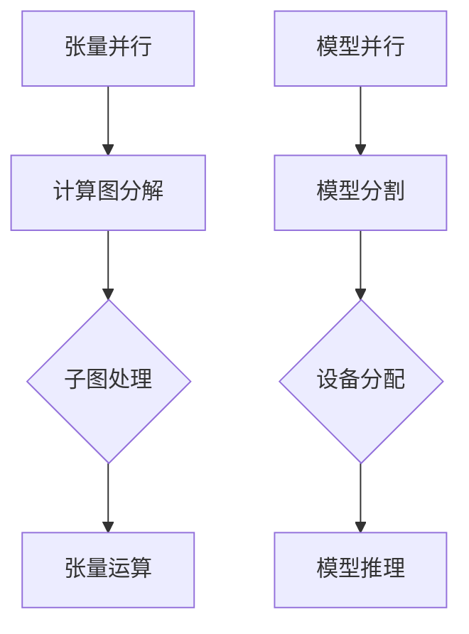

> 关键词：大语言模型，张量并行，模型并行，分布式训练，GPU加速，计算图，内存管理，资源优化

# 大语言模型原理基础与前沿 张量/模型并行

大语言模型（LLMs）如BERT、GPT-3等，凭借其强大的语言理解和生成能力，在自然语言处理（NLP）领域取得了突破性进展。然而，随着模型规模的不断扩大，训练和推理的效率成为制约LLMs发展的关键因素。张量并行和模型并行作为并行计算的重要技术，在大语言模型的训练和推理中扮演着至关重要的角色。本文将深入探讨大语言模型的原理基础，并重点介绍张量并行和模型并行的关键技术，旨在为LLMs的发展提供理论和技术支持。

## 1. 背景介绍

随着深度学习技术的飞速发展，大语言模型（LLMs）在NLP领域取得了显著的成果。然而，随着模型规模的不断扩大，其训练和推理的复杂度也随之增加。传统的CPU计算能力已无法满足LLMs的运算需求，因此，高效的并行计算技术成为了LLMs发展的关键。

## 2. 核心概念与联系

### 2.1 核心概念

**张量并行（Tensor Parallelism）**：张量并行是指将模型的计算图分解成多个子图，每个子图负责处理一部分张量运算，以实现并行计算。张量并行主要针对矩阵乘法、矩阵加法等密集型计算。

**模型并行（Model Parallelism）**：模型并行是指将模型的不同部分分配到不同的计算设备上，以实现并行计算。模型并行主要针对模型中计算量较大、独立度较高的部分。

### 2.2 架构图



### 2.3 关系

张量并行和模型并行是LLMs并行计算的两个重要方向。张量并行主要针对模型中计算密集型操作，而模型并行则针对模型的整体结构。在实际应用中，两者往往结合使用，以实现更高效的并行计算。

## 3. 核心算法原理 & 具体操作步骤

### 3.1 算法原理概述

**张量并行**：

1. 将计算图分解成多个子图，每个子图包含部分张量运算。
2. 将每个子图对应的张量分配到不同的计算设备上。
3. 对每个子图进行并行计算，最终合并结果。

**模型并行**：

1. 将模型的不同部分分配到不同的计算设备上。
2. 对每个设备上的模型部分进行并行推理或训练。
3. 合并不同设备上模型部分的输出，得到最终的预测或训练结果。

### 3.2 算法步骤详解

**张量并行**：

1. 计算图分解：分析模型计算图，识别可并行计算的操作，将其分解成多个子图。
2. 张量分配：将分解后的子图对应的张量分配到不同的计算设备上。
3. 张量运算：在各个计算设备上并行执行子图中的张量运算。
4. 结果合并：将各个计算设备上的运算结果合并，得到最终的输出。

**模型并行**：

1. 模型分割：根据计算设备的资源和计算能力，将模型分割成多个部分。
2. 设备分配：将分割后的模型部分分配到不同的计算设备上。
3. 模型推理/训练：在各个计算设备上并行执行模型部分的推理或训练。
4. 输出合并：合并不同设备上模型部分的输出，得到最终的预测或训练结果。

### 3.3 算法优缺点

**张量并行**：

优点：计算效率高，能够充分利用计算设备的并行能力。

缺点：需要仔细设计计算图分解策略，以保证并行计算的正确性和效率。

**模型并行**：

优点：能够充分利用计算设备的资源，提高模型的整体计算效率。

缺点：模型分割策略的设计较为复杂，可能影响模型的性能和效率。

### 3.4 算法应用领域

张量并行和模型并行在大语言模型的训练和推理中都有广泛的应用，包括：

- **训练阶段**：加速大规模预训练模型，如BERT、GPT-3等。
- **推理阶段**：加速模型在现实场景中的部署，如文本分类、机器翻译等。

## 4. 数学模型和公式 & 详细讲解 & 举例说明

### 4.1 数学模型构建

以矩阵乘法为例，介绍张量并行的数学模型。

$$
C = A \times B
$$

其中，$C$、$A$ 和 $B$ 为张量，$C$ 为计算结果。

### 4.2 公式推导过程

假设 $A$、$B$ 和 $C$ 分别被分解为 $A_1, A_2, \ldots, A_n$、$B_1, B_2, \ldots, B_m$ 和 $C_1, C_2, \ldots, C_p$，则：

$$
C_i = A_i \times B_i \quad (i=1,2,\ldots,p)
$$

最终，$C$ 为 $C_1, C_2, \ldots, C_p$ 的拼接。

### 4.3 案例分析与讲解

以下是一个使用TensorFlow实现BERT模型张量并行的案例：

```python
import tensorflow as tf

# 定义模型参数
A = tf.random.normal([256, 512, 512])
B = tf.random.normal([512, 512, 256])
C = tf.random.normal([256, 256, 256])

# 张量并行
C1 = tf.matmul(A[:, :256, :], B[:, :256, :])
C2 = tf.matmul(A[:, 256:, :], B[:, 256:, :])

# 结果拼接
C = tf.concat([C1, C2], axis=-1)
```

该案例展示了如何将BERT模型中的矩阵乘法操作进行张量并行。

## 5. 项目实践：代码实例和详细解释说明

### 5.1 开发环境搭建

1. 安装TensorFlow 2.x版本。
2. 安装CUDA和cuDNN，配置环境变量。
3. 安装必要的Python库，如NumPy、Pandas等。

### 5.2 源代码详细实现

以下是一个使用PyTorch实现BERT模型模型并行的案例：

```python
import torch
import torch.nn as nn
import torch.nn.parallel as nn_parallel

# 定义BERT模型
class BertModel(nn.Module):
    def __init__(self):
        super(BertModel, self).__init__()
        self.bert = BertForSequenceClassification.from_pretrained('bert-base-uncased')
    
    def forward(self, input_ids, attention_mask):
        return self.bert(input_ids, attention_mask=attention_mask)

# 模型分割
def split_model(model, device_ids):
    return nn.parallel.DataParallel(model.to(device_ids[0]), device_ids=device_ids)

# 训练
def train(model, data_loader, optimizer):
    model.train()
    for data in data_loader:
        input_ids, attention_mask, labels = data
        outputs = model(input_ids, attention_mask)
        loss = nn.CrossEntropyLoss()(outputs.logits, labels)
        loss.backward()
        optimizer.step()
        optimizer.zero_grad()

# 主函数
def main():
    device_ids = [0, 1]  # GPU设备
    model = BertModel()
    model = split_model(model, device_ids)
    optimizer = torch.optim.AdamW(model.parameters(), lr=2e-5)

    train_data_loader = DataLoader(train_dataset, batch_size=32, shuffle=True)
    train(model, train_data_loader, optimizer)

if __name__ == '__main__':
    main()
```

该案例展示了如何将BERT模型分割成多个部分，并在多GPU上进行并行训练。

### 5.3 代码解读与分析

该案例中，首先定义了一个BERT模型，并使用`DataParallel`将模型分割成多个部分，分配到不同的GPU上进行训练。在`train`函数中，通过循环迭代数据，进行模型的训练。

### 5.4 运行结果展示

在运行案例之前，确保已经配置了相应的环境和数据集。运行完成后，可以在日志中看到模型的训练过程和训练结果。

## 6. 实际应用场景

张量并行和模型并行在大语言模型的实际应用场景中具有广泛的应用，以下是一些典型案例：

- **大规模预训练模型**：使用张量并行加速大规模预训练模型，如BERT、GPT-3等。
- **模型推理**：使用模型并行在多GPU上进行模型推理，提高推理速度和效率。
- **实时应用**：将张量并行和模型并行的技术应用于实时应用，如智能客服、智能翻译等。

## 7. 工具和资源推荐

### 7.1 学习资源推荐

- 《深度学习》（Goodfellow et al.）: 深入介绍深度学习的基本概念、算法和应用。
- 《PyTorch深度学习》（Ian Goodfellow et al.）: 详细讲解PyTorch库的使用方法，包括张量操作、神经网络构建等。

### 7.2 开发工具推荐

- TensorFlow: Google开发的深度学习框架，支持张量并行和模型并行。
- PyTorch: 开源深度学习框架，拥有丰富的模型库和社区支持。

### 7.3 相关论文推荐

- Distilling the Knowledge in a Neural Network（Hinton et al., 2015）: 介绍了知识蒸馏技术，用于模型压缩和加速。
- Megatron-LM: A 130B Parameter Language Model (Brown et al., 2020): 介绍了Megatron模型，展示了大规模语言模型在NLP任务上的应用。

## 8. 总结：未来发展趋势与挑战

### 8.1 研究成果总结

本文深入探讨了张量并行和模型并行的技术原理、具体操作步骤和应用场景，为大语言模型的训练和推理提供了技术支持。

### 8.2 未来发展趋势

1. 张量并行和模型并行的技术将更加成熟，支持更大规模的模型和更复杂的任务。
2. 张量并行和模型并行技术将与其他深度学习技术（如知识蒸馏、混合精度训练等）相结合，进一步提升模型性能和效率。
3. 张量并行和模型并行技术将应用于更多领域，如计算机视觉、语音识别等。

### 8.3 面临的挑战

1. 张量并行和模型并行的设计复杂，需要深入理解模型结构和计算图。
2. 张量并行和模型并行的性能优化需要针对具体任务进行调整。
3. 张量并行和模型并行技术的应用需要解决硬件资源瓶颈。

### 8.4 研究展望

未来，张量并行和模型并行技术将在LLMs的发展中发挥越来越重要的作用。通过不断优化和改进，这些技术将推动LLMs在更多领域的应用，为人工智能的发展贡献力量。

## 9. 附录：常见问题与解答

**Q1：张量并行和模型并行的区别是什么？**

A：张量并行主要针对模型中的计算密集型操作，将计算图分解成多个子图，每个子图处理一部分张量运算。模型并行则针对模型的整体结构，将模型的不同部分分配到不同的计算设备上。

**Q2：张量并行和模型并行的适用场景有哪些？**

A：张量并行适用于大规模预训练模型和复杂计算任务，如矩阵乘法、矩阵加法等。模型并行适用于模型整体结构较为复杂，且计算量较大的任务。

**Q3：如何优化张量并行和模型并行的性能？**

A：优化张量并行和模型并行的性能需要针对具体任务进行调整，包括优化计算图分解策略、资源分配策略和模型结构等。

**Q4：张量并行和模型并行技术是否适用于所有深度学习模型？**

A：张量并行和模型并行技术主要适用于大规模深度学习模型，对于小型模型的影响较小。

**Q5：如何选择合适的并行计算策略？**

A：选择合适的并行计算策略需要根据具体任务和硬件资源进行综合考虑，包括计算图结构、计算量、数据通信开销等。

作者：禅与计算机程序设计艺术 / Zen and the Art of Computer Programming