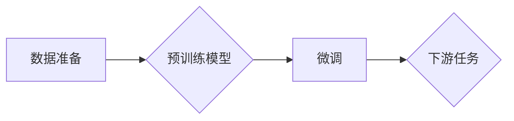

# 大语言模型应用指南：数据准备和参数微调

> 关键词：大语言模型，数据准备，参数微调，预训练，下游任务，自然语言处理，NLP

## 1. 背景介绍

近年来，随着深度学习技术的迅猛发展，大语言模型（Large Language Models，LLMs）在自然语言处理（Natural Language Processing，NLP）领域取得了显著的突破。这些模型通过在海量无标签数据上进行预训练，能够学习到丰富的语言知识和结构，从而在多种NLP任务上表现出色。然而，大语言模型的应用并非一蹴而就，其中数据准备和参数微调是至关重要的环节。本文将深入探讨大语言模型在应用中的数据准备和参数微调策略，为开发者提供实用的指南。

## 2. 核心概念与联系

### 2.1 核心概念

#### 预训练

预训练是指在大规模无标签数据集上训练语言模型，使其学习到通用的语言表示和知识。预训练模型通常采用自回归（如GPT系列）或自编码（如BERT）的结构，通过预测下一个词（自回归）或重构输入文本（自编码）来学习语言模式。

#### 微调

微调（Fine-tuning）是在预训练模型的基础上，使用少量标注数据对其进行进一步训练，以适应特定任务的需求。微调可以调整预训练模型的参数，使其在特定任务上表现出更好的性能。

#### 数据准备

数据准备是指收集、清洗、标注和格式化数据的过程，这是保证模型性能的关键步骤。

#### 下游任务

下游任务是指具体的NLP应用场景，如文本分类、命名实体识别、机器翻译等。

### 2.2 Mermaid 流程图



### 2.3 核心概念联系

数据准备是预训练和微调的基础，预训练模型通过学习无标签数据获得通用语言知识，微调则利用标注数据使模型适应特定任务。最终，微调后的模型在下游任务上执行，实现实际应用。

## 3. 核心算法原理 & 具体操作步骤

### 3.1 算法原理概述

大语言模型应用的核心步骤包括：

1. 数据准备：收集和清洗数据，进行标注和格式化。
2. 预训练：在大规模无标签数据集上训练语言模型。
3. 微调：在标注数据集上对预训练模型进行微调。
4. 评估：在测试集上评估模型性能。

### 3.2 算法步骤详解

#### 3.2.1 数据准备

数据准备步骤如下：

1. **数据收集**：从互联网、数据库或其他数据源收集数据。
2. **数据清洗**：去除噪声、重复数据，并修复格式错误。
3. **数据标注**：对数据进行人工或半自动标注。
4. **数据格式化**：将数据格式化为模型可接受的格式。

#### 3.2.2 预训练

预训练步骤如下：

1. **模型选择**：选择合适的预训练模型，如BERT、GPT等。
2. **数据预处理**：对数据集进行预处理，包括分词、去停用词等。
3. **模型训练**：在无标签数据集上训练模型，调整模型参数。

#### 3.2.3 微调

微调步骤如下：

1. **模型初始化**：使用预训练模型的参数初始化微调模型。
2. **优化目标设计**：设计适合下游任务的优化目标，如交叉熵损失。
3. **模型训练**：在标注数据集上训练微调模型，调整模型参数。

#### 3.2.4 评估

评估步骤如下：

1. **模型测试**：在测试集上评估微调模型的性能。
2. **性能分析**：分析模型的性能，找出不足之处。
3. **模型优化**：根据评估结果调整模型参数或结构。

### 3.3 算法优缺点

#### 3.3.1 优点

1. **提高模型性能**：通过微调，模型在特定任务上的性能可以得到显著提升。
2. **降低开发成本**：使用预训练模型可以减少开发时间和资源投入。
3. **拓展应用范围**：大语言模型可以应用于各种NLP任务。

#### 3.3.2 缺点

1. **数据依赖性**：模型性能很大程度上依赖于数据质量。
2. **计算成本高**：预训练和微调过程需要大量的计算资源。
3. **模型解释性差**：大语言模型通常难以解释其决策过程。

### 3.4 算法应用领域

大语言模型微调可以应用于以下领域：

1. **文本分类**：如新闻分类、情感分析、主题分类等。
2. **命名实体识别**：如人名识别、地名识别、机构名识别等。
3. **机器翻译**：如英译中、中译英等。
4. **问答系统**：如自动问答、信息检索等。
5. **文本生成**：如摘要生成、故事生成等。

## 4. 数学模型和公式 & 详细讲解 & 举例说明

### 4.1 数学模型构建

大语言模型通常采用深度神经网络结构，以下以BERT模型为例进行说明。

#### BERT模型

BERT模型由多个Transformer编码器堆叠而成，每个编码器包含多个自注意力层和前馈神经网络层。

#### 数学公式

$$
\text{BERT} = \text{Transformer}^L 
$$

其中，$L$ 为编码器的数量。

### 4.2 公式推导过程

BERT模型的前向传播过程如下：

1. **词嵌入**：将文本输入转换为词向量表示。
2. **位置编码**：为每个词向量添加位置信息。
3. **自注意力层**：计算词向量之间的注意力权重。
4. **前馈神经网络层**：对词向量进行非线性变换。

### 4.3 案例分析与讲解

以情感分析任务为例，说明如何使用BERT模型进行微调。

1. **数据准备**：收集情感分析数据集，进行数据清洗、标注和格式化。
2. **预训练模型初始化**：使用预训练的BERT模型初始化微调模型。
3. **微调**：在标注数据集上训练微调模型，调整模型参数。
4. **评估**：在测试集上评估微调模型的性能。

## 5. 项目实践：代码实例和详细解释说明

### 5.1 开发环境搭建

1. 安装Python和pip。
2. 安装深度学习框架，如TensorFlow或PyTorch。
3. 安装NLP库，如transformers或spaCy。

### 5.2 源代码详细实现

以下使用PyTorch和transformers库实现BERT情感分析微调：

```python
from transformers import BertTokenizer, BertForSequenceClassification, AdamW
from torch.utils.data import DataLoader, TensorDataset

# 加载预训练模型和分词器
tokenizer = BertTokenizer.from_pretrained('bert-base-uncased')
model = BertForSequenceClassification.from_pretrained('bert-base-uncased')

# 数据准备
def prepare_data(texts, labels, max_len=128):
    encodings = tokenizer(texts, truncation=True, padding=True, max_length=max_len)
    input_ids = encodings['input_ids']
    attention_mask = encodings['attention_mask']
    labels = torch.tensor(labels)
    return TensorDataset(input_ids, attention_mask, labels)

train_dataset = prepare_data(train_texts, train_labels)
dev_dataset = prepare_data(dev_texts, dev_labels)

# 训练模型
def train(model, train_dataset, dev_dataset, epochs=3, batch_size=16, learning_rate=2e-5):
    optimizer = AdamW(model.parameters(), lr=learning_rate)

    for epoch in range(epochs):
        train_dataloader = DataLoader(train_dataset, batch_size=batch_size, shuffle=True)
        model.train()
        for batch in train_dataloader:
            optimizer.zero_grad()
            outputs = model(**batch)
            loss = outputs.loss
            loss.backward()
            optimizer.step()
        
        # 评估模型
        model.eval()
        with torch.no_grad():
            dev_loss = 0
            for batch in DataLoader(dev_dataset, batch_size=batch_size, shuffle=False):
                outputs = model(**batch)
                dev_loss += outputs.loss.item()
            print(f"Epoch {epoch+1}, Dev Loss: {dev_loss / len(dev_dataset)}")

# 运行训练
train(model, train_dataset, dev_dataset, epochs=3)
```

### 5.3 代码解读与分析

以上代码实现了使用BERT模型进行情感分析微调的过程：

1. 加载预训练的BERT模型和分词器。
2. 使用准备数据函数将文本和标签转换为TensorDataset。
3. 定义训练函数，使用DataLoader加载训练和验证数据，训练模型，并在验证集上评估模型性能。
4. 运行训练函数进行模型训练。

## 6. 实际应用场景

大语言模型微调在实际应用中具有广泛的应用场景，以下列举几个示例：

1. **智能客服**：使用微调后的情感分析模型识别客户情绪，提供个性化的客服服务。
2. **机器翻译**：使用微调后的翻译模型提高翻译质量，满足跨语言交流的需求。
3. **文本摘要**：使用微调后的摘要模型自动生成文章摘要，提高信息获取效率。
4. **问答系统**：使用微调后的问答模型解答用户问题，提供便捷的查询服务。

## 7. 工具和资源推荐

### 7.1 学习资源推荐

1. 《Deep Learning for Natural Language Processing》
2. 《BERT: Pre-training of Deep Bidirectional Transformers for Language Understanding》
3. 《Natural Language Processing with Transformers》

### 7.2 开发工具推荐

1. PyTorch
2. TensorFlow
3. transformers库

### 7.3 相关论文推荐

1. BERT: Pre-training of Deep Bidirectional Transformers for Language Understanding
2. Generative Pretrained Transformers
3. Natural Language Inference

## 8. 总结：未来发展趋势与挑战

### 8.1 研究成果总结

本文深入探讨了大数据模型在应用中的数据准备和参数微调策略，为开发者提供了实用的指南。通过数据准备、预训练、微调和评估等步骤，开发者可以有效地将大语言模型应用于各种NLP任务。

### 8.2 未来发展趋势

1. **模型轻量化**：开发更加轻量级的模型，提高模型部署的效率和可用性。
2. **多模态融合**：将大语言模型与其他模态（如图像、视频）进行融合，实现跨模态理解。
3. **知识增强**：将外部知识库和先验知识融入模型，提高模型的解释性和鲁棒性。

### 8.3 面临的挑战

1. **数据质量**：数据质量对模型性能至关重要，如何保证数据质量是当前的一大挑战。
2. **计算资源**：预训练和微调过程需要大量的计算资源，如何高效利用资源是另一个挑战。
3. **模型可解释性**：提高模型的可解释性，使其决策过程更加透明。

### 8.4 研究展望

未来，大语言模型微调技术将在以下几个方面取得突破：

1. **数据增强**：开发更加有效的数据增强方法，提高模型对数据的鲁棒性。
2. **迁移学习**：研究更加有效的迁移学习方法，提高模型在不同任务上的泛化能力。
3. **知识融合**：将外部知识库和先验知识融入模型，提高模型的解释性和实用性。

## 9. 附录：常见问题与解答

**Q1：如何提高大语言模型微调的性能？**

A：提高数据质量、选择合适的预训练模型、调整微调参数、采用数据增强方法等都可以提高模型性能。

**Q2：如何解决模型过拟合问题？**

A：可以使用正则化技术（如L2正则化）、Dropout、数据增强等方法解决模型过拟合问题。

**Q3：如何评估大语言模型微调的性能？**

A：可以使用交叉熵损失、准确率、召回率、F1分数等指标评估模型性能。

**Q4：大语言模型微调是否适用于所有NLP任务？**

A：大语言模型微调适用于大多数NLP任务，但对于特定领域的任务，可能需要针对领域知识进行进一步训练。

**Q5：如何降低大语言模型微调的计算成本？**

A：可以采用模型剪枝、量化、知识蒸馏等方法降低计算成本。

作者：禅与计算机程序设计艺术 / Zen and the Art of Computer Programming