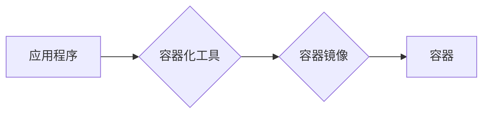
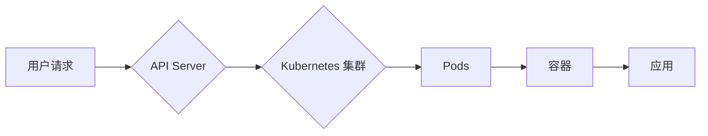

# 容器化部署与弹性伸缩原理与代码实战案例讲解

> 关键词：Docker, Kubernetes, 容器化, 弹性伸缩, 容器编排, 微服务架构, DevOps, 云原生

## 1. 背景介绍

随着云计算和微服务架构的兴起，应用程序的开发和部署模式发生了根本性的变化。容器化技术作为一种轻量级的虚拟化技术，提供了高效、灵活的解决方案，使得应用能够在任何环境中快速部署和扩展。Kubernetes 作为容器编排工具，能够自动化容器的部署、扩展和管理，是容器化应用部署的基石。本文将深入探讨容器化部署与弹性伸缩的原理，并通过代码实战案例进行详细讲解。

### 1.1 容器化技术的兴起

容器化技术起源于 Docker，它允许开发者将应用程序及其运行环境打包成一个独立的容器，确保应用在不同环境中的运行一致性。与传统的虚拟机相比，容器具有启动速度快、资源消耗低、部署灵活等优点。

### 1.2 微服务架构的兴起

微服务架构将大型应用拆分成多个独立、松耦合的服务，每个服务负责特定的业务功能。这种架构使得应用更加模块化、可扩展，便于开发和维护。

### 1.3 容器编排与自动化

Kubernetes 作为容器编排工具，能够自动化容器的部署、扩展和管理。它提供了丰富的功能，如服务发现、负载均衡、自我修复等，极大地简化了容器化应用的管理。

### 1.4 本文结构

本文将按照以下结构进行讲解：

- 介绍容器化部署与弹性伸缩的核心概念和原理。
- 讲解 Kubernetes 的核心概念和架构。
- 通过代码实战案例，演示如何使用 Kubernetes 进行容器化部署和弹性伸缩。
- 探讨容器化部署与弹性伸缩的实际应用场景和未来发展趋势。

## 2. 核心概念与联系

### 2.1 容器化原理与架构

容器的核心思想是将应用程序及其运行环境打包成一个独立的容器镜像，容器镜像包含了应用程序运行所需的所有文件，如代码、库、环境变量等。

**Mermaid 流程图**：



### 2.2 Kubernetes 架构

Kubernetes 架构图如下：

**Mermaid 流程图**：



### 2.3 容器化与微服务架构的联系

容器化技术使得微服务架构的应用能够更加灵活地部署和扩展。每个微服务可以作为独立的容器运行，通过 Kubernetes 进行编排和管理。

## 3. 核心算法原理 & 具体操作步骤

### 3.1 算法原理概述

容器化部署与弹性伸缩的核心算法原理如下：

1. 将应用程序及其运行环境打包成容器镜像。
2. 将容器镜像部署到 Kubernetes 集群中。
3. Kubernetes 根据资源需求和配置自动调度和扩展容器。
4. 容器运行应用程序，对外提供服务。

### 3.2 算法步骤详解

1. **打包容器镜像**：
   - 使用 Dockerfile 定义应用程序的容器镜像。
   - 使用 Docker build 命令构建容器镜像。

2. **部署容器到 Kubernetes 集群**：
   - 使用 Kubernetes YAML 配置文件定义 Deployment 对象。
   - 使用 kubectl 命令行工具部署 Deployment。

3. **弹性伸缩**：
   - 使用 Horizontal Pod Autoscaler 自动扩展或缩减 Pod 数量。
   - 使用 Kubernetes StatefulSet 保证有状态服务的稳定性。

### 3.3 算法优缺点

**优点**：

- **高效**：容器化部署和弹性伸缩能够快速响应资源需求，提高应用程序的可用性和性能。
- **灵活**：容器化和 Kubernetes 支持跨平台部署，便于在不同环境中迁移和扩展。
- **自动化**：Kubernetes 自动化了容器的部署、扩展和管理，降低了运维成本。

**缺点**：

- **学习曲线**：容器化和 Kubernetes 需要一定的学习成本。
- **复杂性**：容器化部署和弹性伸缩涉及到多个组件和配置，管理起来相对复杂。
- **性能开销**：容器化会带来一定的性能开销，尤其是在资源密集型应用中。

### 3.4 算法应用领域

容器化部署与弹性伸缩适用于以下领域：

- **Web 应用**：快速部署和扩展 Web 应用，提高可用性和性能。
- **微服务架构**：将微服务打包成容器，实现高效的部署和扩展。
- **持续集成/持续部署 (CI/CD)**：自动化应用程序的构建、测试和部署。
- **容器化数据库**：部署和管理容器化数据库，提高数据库的可用性和性能。

## 4. 数学模型和公式 & 详细讲解 & 举例说明

### 4.1 数学模型构建

容器化部署与弹性伸缩的数学模型主要包括：

- **负载均衡**：根据请求流量分配到不同的容器。
- **资源调度**：根据资源需求分配到不同的节点。

**公式**：

$$
\text{负载均衡} = \frac{\text{请求流量}}{\text{容器数量}}
$$

$$
\text{资源调度} = \frac{\text{资源需求}}{\text{节点资源}}
$$

### 4.2 公式推导过程

负载均衡公式推导过程如下：

1. 假设请求流量为 $T$。
2. 假设容器数量为 $N$。
3. 则每个容器的平均请求流量为 $\frac{T}{N}$。

资源调度公式推导过程如下：

1. 假设资源需求为 $R$。
2. 假设节点资源为 $S$。
3. 则需要 $N$ 个节点的数量为 $\frac{R}{S}$。

### 4.3 案例分析与讲解

假设一个 Web 应用需要处理 1000 个并发请求，每个容器可以处理 10 个并发请求，则需要的容器数量为：

$$
\text{容器数量} = \frac{1000}{10} = 100
$$

如果每个节点有 4 核 CPU 和 8GB 内存，则需要的节点数量为：

$$
\text{节点数量} = \frac{100 \times (4 \text{核} + 8\text{GB 内存})}{4 \text{核} + 8\text{GB 内存}} = 100
$$

## 5. 项目实践：代码实例和详细解释说明

### 5.1 开发环境搭建

1. 安装 Docker：[Docker 安装指南](https://docs.docker.com/get-docker/)
2. 安装 Kubernetes：[Kubernetes 安装指南](https://kubernetes.io/docs/tasks/tools/)

### 5.2 源代码详细实现

以下是一个简单的 Web 应用示例：

**Dockerfile**：

```Dockerfile
FROM python:3.8

WORKDIR /app

COPY . .

RUN pip install flask

CMD ["flask", "run", "--host=0.0.0.0"]
```

**webapp.py**：

```python
from flask import Flask
import time

app = Flask(__name__)

@app.route('/')
def hello_world():
    time.sleep(2)
    return 'Hello, World!'

if __name__ == '__main__':
    app.run()
```

**部署到 Kubernetes**：

1. 创建 Deployment 配置文件 `webapp-deployment.yaml`：

```yaml
apiVersion: apps/v1
kind: Deployment
metadata:
  name: webapp
spec:
  replicas: 3
  selector:
    matchLabels:
      app: webapp
  template:
    metadata:
      labels:
        app: webapp
    spec:
      containers:
      - name: webapp
        image: webapp:latest
        ports:
        - containerPort: 80
```

2. 使用 kubectl 部署 Deployment：

```bash
kubectl apply -f webapp-deployment.yaml
```

### 5.3 代码解读与分析

- **Dockerfile**：定义了 Web 应用的 Docker 镜像，包括基础镜像、工作目录、复制文件、安装依赖和启动命令。
- **webapp.py**：定义了简单的 Flask Web 应用。
- **webapp-deployment.yaml**：定义了 Deployment 对象，包括副本数量、标签选择器、容器配置等。

### 5.4 运行结果展示

在浏览器中访问任意一个部署的容器 IP 地址，即可看到 "Hello, World!" 消息。

## 6. 实际应用场景

### 6.1 微服务架构

容器化部署与弹性伸缩非常适合微服务架构，可以快速部署和扩展每个微服务。

### 6.2 CI/CD

容器化和 Kubernetes 可以实现自动化应用程序的构建、测试和部署，提高软件开发效率。

### 6.3 容器化数据库

容器化数据库可以简化数据库的部署和管理，提高数据库的可用性和性能。

## 7. 工具和资源推荐

### 7.1 学习资源推荐

- [Docker 官方文档](https://docs.docker.com/)
- [Kubernetes 官方文档](https://kubernetes.io/docs/)
- [Kubernetes 指南](https://kubernetes.io/docs/tutorials/)

### 7.2 开发工具推荐

- [Docker Desktop](https://www.docker.com/products/docker-desktop)
- [kubectl](https://kubernetes.io/docs/tasks/tools/)
- [Helm](https://helm.sh/)

### 7.3 相关论文推荐

- [Docker: Lightweight containers for software shipping and distribution](https://www.usenix.org/conference/lisa14/technical-sessions/presentation/yan)
- [Kubernetes: System Overview](https://kubernetes.io/docs/concepts/overview/what-is-kubernetes/)

## 8. 总结：未来发展趋势与挑战

### 8.1 研究成果总结

本文深入探讨了容器化部署与弹性伸缩的原理和代码实战案例。通过对 Docker、Kubernetes 等技术的介绍，展示了容器化部署与弹性伸缩在微服务架构、CI/CD、容器化数据库等领域的应用。

### 8.2 未来发展趋势

1. **容器化技术将更加成熟**：随着技术的不断发展，容器化技术将更加成熟，提供更加高效、可靠的解决方案。
2. **Kubernetes 将成为行业标准**：Kubernetes 作为容器编排工具，将成为容器化应用部署的行业标准。
3. **混合云和多云将成为主流**：混合云和多云将成为企业应用部署的主流模式，容器化技术将发挥重要作用。
4. **AIOps 将与容器化技术融合**：AIOps 将与容器化技术融合，实现智能化的容器管理。

### 8.3 面临的挑战

1. **安全性**：容器化技术和 Kubernetes 存在一定的安全风险，需要加强安全防护。
2. **管理复杂性**：容器化应用的管理相对复杂，需要更多的管理工具和技能。
3. **资源利用率**：如何提高容器化应用的资源利用率，是一个需要解决的问题。

### 8.4 研究展望

未来，容器化部署与弹性伸缩技术将面临以下研究方向：

1. **安全性研究**：研究更安全的容器化技术和 Kubernetes 安全机制。
2. **管理自动化**：研究更加自动化的容器化应用管理工具和平台。
3. **资源优化**：研究提高容器化应用资源利用率的算法和策略。

## 9. 附录：常见问题与解答

**Q1：容器化技术有哪些优势？**

A：容器化技术具有以下优势：

- **轻量级**：容器体积小，启动速度快，资源消耗低。
- **可移植性**：容器可以在任何环境中运行，提高应用的可移植性。
- **可扩展性**：容器可以方便地扩展和缩放，提高应用的可用性和性能。

**Q2：Kubernetes 有哪些核心概念？**

A：Kubernetes 的核心概念包括：

- **Pod**：Kubernetes 中的最小部署单元，包含一个或多个容器。
- **Node**：Kubernetes 集群中的计算节点，负责运行 Pod。
- **Deployment**：Kubernetes 中的部署对象，用于管理 Pod 的创建、更新和回滚。
- **Service**：Kubernetes 中的服务对象，用于定义 Pod 的访问方式。
- **Ingress**：Kubernetes 中的入口控制器，用于外部访问集群中的应用。

**Q3：如何解决容器化应用的资源争用问题？**

A：解决容器化应用的资源争用问题，可以采取以下措施：

- **资源限制**：为容器设置 CPU 和内存限制，避免资源耗尽。
- **资源优先级**：为不同容器设置不同的资源优先级，确保关键任务的资源需求得到满足。
- **资源隔离**：使用隔离技术，如 namespaces，将资源隔离在不同的容器之间。

**Q4：如何实现容器化应用的自动化部署？**

A：实现容器化应用的自动化部署，可以使用以下工具：

- **Docker Compose**：用于定义和运行多容器 Docker 应用。
- **Kubernetes**：用于自动化容器化应用的部署、扩展和管理。
- **Jenkins**：用于自动化构建和部署应用程序。

作者：禅与计算机程序设计艺术 / Zen and the Art of Computer Programming