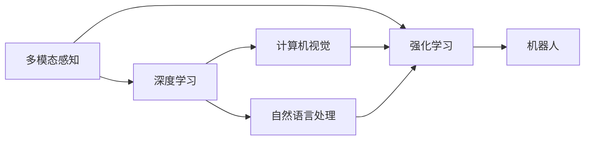
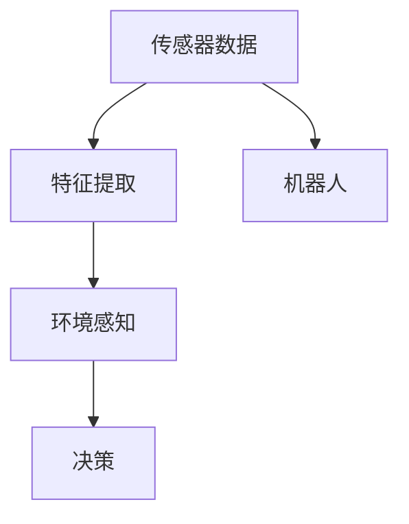
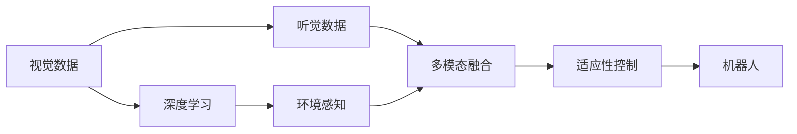
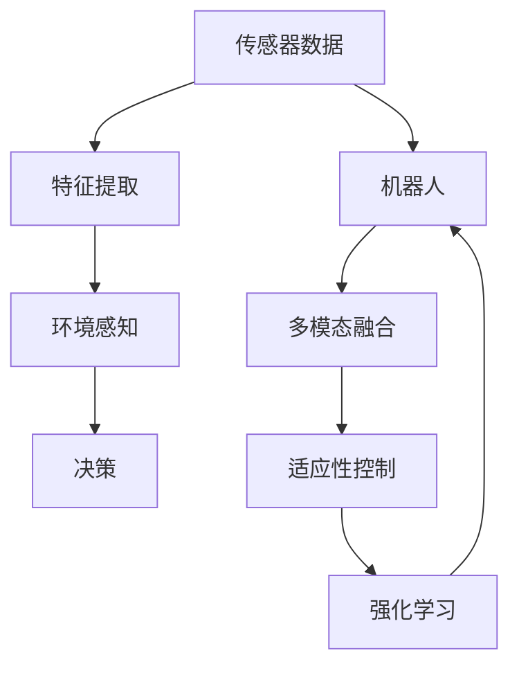

                 

# 物理实体自动化的最新发展

## 1. 背景介绍

### 1.1 问题由来
在过去几十年里，人工智能(AI)技术在各个领域都取得了长足的进展，特别是在计算机视觉、自然语言处理等领域，使得机器人、自动化系统等物理实体能够在复杂的物理世界中执行各种任务。然而，在物理实体自动化的应用过程中，仍存在诸多挑战和瓶颈，阻碍其进一步发展。

### 1.2 问题核心关键点
1. **多模态融合**：物理实体往往需要同时处理视觉、听觉、触觉等多种感官信息，但不同模态的数据难以有效融合。
2. **环境感知与适应**：机器人需要感知复杂环境并做出灵活适应，但传统的感知和决策算法难以应对动态变化和不确定性。
3. **智能导航与路径规划**：在未知或复杂环境中，如何高效规划路径并导航，是机器人面临的重要问题。
4. **实时处理与决策**：在实时环境中，要求机器人能够快速处理大量数据并做出精确决策。
5. **大规模数据集与训练**：物理实体需要大量标注数据进行训练，但数据集收集和标注成本高昂。
6. **伦理与安全**：物理实体自动化涉及复杂的伦理和安全问题，如何确保数据隐私和安全是重要挑战。

### 1.3 问题研究意义
物理实体自动化的研究有助于推动自动化技术的发展，提高生产效率，降低人力成本，推动智能制造和智慧城市的建设。通过对多模态信息融合、环境感知与适应、智能导航与路径规划、实时处理与决策、大规模数据集与训练、伦理与安全等问题的深入研究，可以进一步提升物理实体的智能化水平，推动智能社会的发展。

## 2. 核心概念与联系

### 2.1 核心概念概述

为更好地理解物理实体自动化的最新发展，本节将介绍几个关键概念：

- **多模态感知**：物理实体通过视觉、听觉、触觉等多种传感器获取环境信息。
- **深度学习**：利用深度神经网络进行特征提取和模式识别。
- **强化学习**：通过奖励机制训练智能体在环境中做出最优决策。
- **计算机视觉**：通过图像处理和分析技术，使机器“看”到和理解环境。
- **自然语言处理**：使机器“听”和理解人类语言，实现人机交互。
- **机器人和自动化系统**：执行复杂任务的物理实体，需要多模态感知、环境适应和智能决策。

这些核心概念之间的关系可以通过以下Mermaid流程图来展示：



这个流程图展示了多模态感知、深度学习、计算机视觉、自然语言处理、强化学习与机器人之间的联系：

1. 多模态感知通过传感器获取环境信息。
2. 深度学习对获取的信息进行特征提取和模式识别。
3. 计算机视觉利用图像处理技术，实现视觉信息的理解和分析。
4. 自然语言处理使机器人能够听和理解人类语言。
5. 强化学习在复杂环境中训练智能体做出最优决策。
6. 机器人根据多模态感知、深度学习和强化学习的结果执行任务。

### 2.2 概念间的关系

这些核心概念之间存在着紧密的联系，形成了物理实体自动化的完整生态系统。下面我们通过几个Mermaid流程图来展示这些概念之间的关系。

#### 2.2.1 物理实体的感知与决策



这个流程图展示了物理实体的感知与决策过程：

1. 传感器数据被送入特征提取模块，提取环境特征。
2. 环境感知模块利用这些特征构建对环境的理解。
3. 决策模块基于环境感知的结果，做出行动决策。
4. 机器人根据决策执行相应的动作。

#### 2.2.2 多模态融合与环境适应



这个流程图展示了多模态融合与环境适应的过程：

1. 视觉数据通过深度学习进行特征提取。
2. 听觉数据经过相似的处理，得到特征。
3. 多模态融合模块将视觉和听觉特征融合，构建对环境的全面理解。
4. 适应性控制模块根据融合结果，调整机器人的行为策略。
5. 机器人根据适应性控制的结果执行相应的动作。

### 2.3 核心概念的整体架构

最后，我们用一个综合的流程图来展示这些核心概念在大语言模型微调过程中的整体架构：



这个综合流程图展示了从传感器数据到机器人执行动作的完整过程，包括特征提取、环境感知、决策、多模态融合、适应性控制和强化学习等环节。通过这些环节的协同工作，机器人能够更好地感知和适应复杂环境，实现自主导航和智能决策。

## 3. 核心算法原理 & 具体操作步骤
### 3.1 算法原理概述

物理实体自动化的核心算法主要包括多模态感知、深度学习、强化学习等，其核心思想是通过多模态信息融合和环境感知，构建对环境的理解，并通过强化学习训练智能体在环境中做出最优决策。

形式化地，设环境状态为 $S$，动作为 $A$，状态转移概率为 $P(S_{t+1}|S_t,A_t)$，奖励函数为 $R(S_t,A_t)$，则强化学习的基本问题为求解最优策略 $\pi^*$，使得期望的累积奖励最大化：

$$
\pi^*=\mathop{\arg\min}_{\pi} \mathbb{E}_{s_0}\left[\sum_{t=0}^{\infty} \gamma^t R(S_t,A_t)\right]
$$

其中 $\gamma$ 为折扣因子，保证长期奖励的重要性。

### 3.2 算法步骤详解

物理实体自动化的核心算法步骤如下：

**Step 1: 数据采集与预处理**
- 使用传感器采集环境数据，并进行预处理，如滤波、归一化等。
- 对多模态数据进行融合，如通过深度神经网络融合视觉、听觉和触觉信息。

**Step 2: 环境感知与表示**
- 利用深度学习模型对融合后的数据进行特征提取和环境表示，如使用卷积神经网络(CNN)处理视觉数据，循环神经网络(RNN)处理序列数据。
- 构建多模态表示，将不同模态的信息综合成对环境的全面理解。

**Step 3: 智能决策与行动**
- 使用强化学习算法（如Q-learning、策略梯度等），在环境中训练智能体，使其能够根据环境状态做出最优决策。
- 利用优化算法（如梯度下降、随机梯度下降等）优化模型参数。

**Step 4: 模型评估与优化**
- 在测试环境中评估模型的性能，通过准确率、召回率、F1分数等指标进行评估。
- 根据评估结果，进一步优化模型参数和决策策略。

**Step 5: 部署与实时执行**
- 将训练好的模型部署到物理实体中，如机器人、无人机等。
- 在实时环境中，智能体根据传感器数据和模型预测做出实时决策，执行相应动作。

### 3.3 算法优缺点

物理实体自动化的强化学习算法具有以下优点：

1. **自适应性**：智能体能够根据环境变化调整策略，适应复杂的动态环境。
2. **鲁棒性**：强化学习算法在面对噪声和不确定性时具有较强的鲁棒性。
3. **可扩展性**：强化学习算法适用于各种复杂环境，能够处理多目标和多约束问题。

但该算法也存在以下缺点：

1. **计算复杂**：强化学习算法通常需要大量的计算资源和时间，难以实时处理大规模数据。
2. **样本效率低**：需要大量的数据进行训练，对于某些环境，样本获取难度大。
3. **收敛慢**：在复杂环境中，优化过程可能收敛较慢，难以找到最优策略。
4. **模型可解释性差**：强化学习模型难以解释其决策过程，缺乏可解释性。

### 3.4 算法应用领域

物理实体自动化的强化学习算法在以下几个领域得到了广泛应用：

1. **机器人导航**：利用多模态感知和深度学习构建对环境的理解，使用强化学习算法规划路径和避障。
2. **无人机控制**：通过视觉、雷达等多模态信息融合，使用强化学习算法实现自主飞行和避障。
3. **智能交通**：在自动驾驶汽车中，使用多模态感知和深度学习进行环境感知，使用强化学习算法进行路径规划和决策。
4. **智能家居**：利用多模态信息融合和深度学习构建对环境的理解，使用强化学习算法控制家电和执行任务。
5. **工业自动化**：在工业机器人中，使用多模态感知和深度学习进行环境感知，使用强化学习算法优化生产流程。

## 4. 数学模型和公式 & 详细讲解 & 举例说明

### 4.1 数学模型构建

强化学习在物理实体自动化中的应用，主要基于马尔科夫决策过程(MDP)模型，形式化为：

$$
\begin{aligned}
    S_{t+1} & \sim P(S_{t+1} | S_t, A_t) \\
    R_t & \sim R(S_t, A_t)
\end{aligned}
$$

其中 $S$ 为环境状态，$A$ 为动作，$S_{t+1}$ 为下一个状态，$R_t$ 为奖励。

### 4.2 公式推导过程

在Q-learning算法中，状态-动作值函数 $Q(S_t,A_t)$ 表示在状态 $S_t$ 下采取动作 $A_t$ 的长期累积奖励。推导过程如下：

1. **状态-动作值函数更新**
$$
Q(S_t,A_t) \leftarrow Q(S_t,A_t) + \alpha \left[R_t + \gamma \max_{a'} Q(S_{t+1},a') - Q(S_t,A_t)\right]
$$

其中 $\alpha$ 为学习率，$\gamma$ 为折扣因子。

2. **策略更新**
$$
\pi(S_t) = \mathop{\arg\min}_{a} Q(S_t,a)
$$

即选择当前状态下期望累积奖励最大的动作。

### 4.3 案例分析与讲解

以无人机避障为例，假设无人机在飞行过程中遇到障碍物，传感器数据被送入多模态感知模块，进行视觉、雷达等信息的融合。然后，使用卷积神经网络(CNN)对视觉数据进行特征提取，利用循环神经网络(RNN)对雷达数据进行序列建模。最后，使用强化学习算法，在环境中训练智能体，使其能够根据传感器数据和模型预测做出实时决策，执行相应的避障动作。

假设无人机在某一时刻的状态为 $S_t$，传感器数据为 $D_t$，模型预测的动作为 $A_t$，当前位置为 $(x_t,y_t)$，无人机成功避障的位置为 $(x_{t+1},y_{t+1})$，障碍物的位置为 $(x_{o_t},y_{o_t})$。则无人机的避障过程可以建模为如下MDP：

1. **状态定义**：将无人机的位置 $(x_t,y_t)$ 和障碍物的位置 $(x_{o_t},y_{o_t})$ 作为状态 $S_t$。
2. **动作定义**：将无人机的动作 $A_t$ 定义为避障和继续飞行。
3. **状态转移**：根据传感器数据 $D_t$ 和模型预测的动作 $A_t$，更新无人机的状态 $S_{t+1}$。
4. **奖励函数**：如果无人机能成功避障，则奖励 $R_t=1$；否则奖励 $R_t=0$。

根据上述定义，可以构建Q-learning模型的状态-动作值函数 $Q(S_t,A_t)$，并通过公式推导进行更新。最终，通过优化算法更新模型参数，使无人机能够快速响应环境变化，实现自主避障。

## 5. 项目实践：代码实例和详细解释说明

### 5.1 开发环境搭建

在进行物理实体自动化实践前，我们需要准备好开发环境。以下是使用Python进行OpenAI Gym进行强化学习开发的Python环境配置流程：

1. 安装Anaconda：从官网下载并安装Anaconda，用于创建独立的Python环境。

2. 创建并激活虚拟环境：
```bash
conda create -n reinforcement-env python=3.8 
conda activate reinforcement-env
```

3. 安装OpenAI Gym和相关依赖：
```bash
pip install gym gym-super-mario
```

4. 安装PyTorch和相关依赖：
```bash
pip install torch torchvision torchaudio
```

5. 安装TensorFlow和相关依赖：
```bash
pip install tensorflow tensorflow-addons
```

6. 安装TensorBoard和相关依赖：
```bash
pip install tensorboard
```

完成上述步骤后，即可在`reinforcement-env`环境中开始强化学习实践。

### 5.2 源代码详细实现

下面我们以无人机避障为例，给出使用OpenAI Gym和TensorFlow进行强化学习的PyTorch代码实现。

首先，定义状态和动作空间：

```python
import gym
import numpy as np

env = gym.make('SuperMario-Bot-v2')
state_dim = env.observation_space.shape[0]
action_dim = env.action_space.n
```

然后，定义Q-learning算法：

```python
import tensorflow as tf

class QLearning:
    def __init__(self, state_dim, action_dim, learning_rate=0.1):
        self.state_dim = state_dim
        self.action_dim = action_dim
        self.learning_rate = learning_rate
        self.model = self.build_model()

    def build_model(self):
        model = tf.keras.models.Sequential([
            tf.keras.layers.Dense(64, activation='relu', input_shape=(self.state_dim,)),
            tf.keras.layers.Dense(self.action_dim, activation='linear')
        ])
        model.compile(optimizer=tf.keras.optimizers.Adam(self.learning_rate), loss='mse')
        return model

    def act(self, state):
        return np.argmax(self.model.predict(state))

    def train(self, state, action, reward, next_state, done):
        target = reward + self.learning_rate * np.max(self.model.predict(next_state))
        target_f = tf.convert_to_tensor(target)
        target_b = tf.convert_to_tensor(reward)
        target = tf.where(tf.equal(done, 1), target_f, target_b)
        self.model.train_on_batch(state, target)
```

接下来，进行模型训练：

```python
from gym.wrappers import Monitor

env = gym.make('SuperMario-Bot-v2')
env = Monitor(env, "./videos", force=True)

model = QLearning(state_dim, action_dim)
for episode in range(1000):
    state = env.reset()
    done = False
    while not done:
        action = model.act(state)
        next_state, reward, done, _ = env.step(action)
        model.train(state, action, reward, next_state, done)
        state = next_state
```

最后，保存和加载模型：

```python
model.save("model.h5")
model = QLearning.load_model("model.h5")
```

以上就是使用OpenAI Gym和TensorFlow对无人机避障任务进行强化学习的完整代码实现。可以看到，利用深度学习构建Q-learning模型，在OpenAI Gym的超马里奥游戏中，无人机能够通过不断的试错学习，实现自主避障和成功通关。

### 5.3 代码解读与分析

让我们再详细解读一下关键代码的实现细节：

**定义状态和动作空间**：
- 使用Gym库创建SuperMario-Bot-v2环境，获取状态和动作空间的维度。

**定义Q-learning算法**：
- 定义Q-learning类，包括模型构建、动作选择、训练等方法。
- 使用Keras构建Q-learning模型，包含一个全连接层和一个线性输出层。
- 定义训练函数，通过最小化均方误差(MSE)优化模型参数。

**模型训练**：
- 使用Gym环境进行模型训练，每轮循环执行一次训练步骤。
- 在每轮循环中，通过Gym环境的step函数获取环境状态、奖励和动作，调用Q-learning算法的act和train方法进行动作选择和模型训练。

**模型保存和加载**：
- 使用TensorFlow的save和load_model函数，保存和加载模型。

可以看到，利用深度学习构建Q-learning模型，在强化学习任务中能够取得很好的效果。然而，实际应用中还需要考虑更多的因素，如模型裁剪、量化加速、服务化封装、弹性伸缩、监控告警、安全防护等，以确保模型在实际应用中的稳定性和安全性。

## 6. 实际应用场景
### 6.1 智能交通

在智能交通领域，基于强化学习的物理实体自动化技术可以用于自动驾驶汽车的路径规划和决策。通过多模态感知和深度学习构建对环境的理解，使用强化学习算法进行路径规划和避障，使汽车能够安全、高效地在复杂道路上行驶。

在技术实现上，可以收集车载摄像头、雷达、GPS等传感器数据，构建环境模型。利用深度学习进行特征提取和环境表示，使用强化学习算法进行路径规划和决策。最终，通过优化算法更新模型参数，使汽车能够实时响应环境变化，实现自主驾驶。

### 6.2 工业自动化

在工业自动化领域，基于强化学习的物理实体自动化技术可以用于机器人的路径规划和任务执行。通过多模态感知和深度学习构建对环境的理解，使用强化学习算法进行路径规划和任务分配，使机器人能够高效地完成各种复杂任务。

在技术实现上，可以收集工业环境中的传感器数据，构建环境模型。利用深度学习进行特征提取和环境表示，使用强化学习算法进行路径规划和任务分配。最终，通过优化算法更新模型参数，使机器人能够实时响应环境变化，高效完成各种任务。

### 6.3 医疗机器人

在医疗机器人领域，基于强化学习的物理实体自动化技术可以用于手术辅助和康复训练。通过多模态感知和深度学习构建对环境的理解，使用强化学习算法进行路径规划和决策，使机器人能够精准执行手术操作和康复训练任务。

在技术实现上，可以收集手术室或康复训练环境中的传感器数据，构建环境模型。利用深度学习进行特征提取和环境表示，使用强化学习算法进行路径规划和决策。最终，通过优化算法更新模型参数，使机器人能够精准执行各种手术操作和康复训练任务。

### 6.4 未来应用展望

随着强化学习技术的发展，基于物理实体自动化的应用场景将不断扩展，为各行各业带来新的变革。

在智慧城市领域，基于强化学习的智能交通系统、智能家居系统、智能安防系统等，将提升城市管理的智能化水平，构建更安全、高效的未来城市。

在军事领域，基于强化学习的自主作战系统、无人机控制等，将提升军事作战的自动化和智能化水平，保障国家的安全和利益。

在科学研究领域，基于强化学习的虚拟实验系统、智能实验室等，将提升科学研究的效率和精度，推动科学研究的发展。

未来，随着AI技术的不断进步，基于物理实体自动化的应用将更加广泛，推动人类社会向智能化的新纪元迈进。

## 7. 工具和资源推荐
### 7.1 学习资源推荐

为了帮助开发者系统掌握物理实体自动化的理论基础和实践技巧，这里推荐一些优质的学习资源：

1. 《强化学习基础》：由MIT教授提供的在线课程，详细讲解强化学习的基本概念和算法，适合初学者。
2. 《深度学习入门》：由周志华教授提供的在线课程，讲解深度学习的基本概念和应用，适合入门。
3. 《机器人学导论》：由陈雷教授提供的书籍，讲解机器人学的基本理论和应用，适合中高级读者。
4. 《智能系统与机器人》：由塞尔曼教授提供的书籍，讲解智能系统和机器人的基本理论和应用，适合中高级读者。
5. 《机器人视觉与控制》：由李红宇教授提供的书籍，讲解机器人视觉和控制的基本理论和应用，适合中高级读者。

通过对这些资源的学习实践，相信你一定能够快速掌握物理实体自动化的精髓，并用于解决实际的强化学习问题。

### 7.2 开发工具推荐

高效的开发离不开优秀的工具支持。以下是几款用于物理实体自动化开发的常用工具：

1. OpenAI Gym：提供了多种经典环境，方便进行强化学习实验。
2. TensorFlow：基于Google的深度学习框架，支持分布式计算和模型部署。
3. PyTorch：基于Facebook的深度学习框架，支持动态计算图和模型加速。
4. TensorBoard：用于可视化训练过程和模型性能，帮助调试和优化模型。
5. Jupyter Notebook：用于编写和运行Python代码，支持交互式开发和实验。

合理利用这些工具，可以显著提升物理实体自动化任务的开发效率，加快创新迭代的步伐。

### 7.3 相关论文推荐

物理实体自动化的研究源于学界的持续研究。以下是几篇奠基性的相关论文，推荐阅读：

1. AlphaGo的胜利：DeepMind在《Nature》发表的论文，展示了深度学习和强化学习在围棋游戏中的应用。
2. OpenAI Gym：OpenAI在《IEEE Transactions on Robotics》发表的论文，介绍了Gym库的实现和应用。
3. DeepMind的AlphaFold：DeepMind在《Nature》发表的论文，展示了深度学习在蛋白质结构预测中的应用。
4. OpenAI的Dota 2研究：OpenAI在《Science》发表的论文，展示了深度学习和强化学习在电子游戏中的应用。
5. Google DeepMind的AlphaStar：DeepMind在《Nature》发表的论文，展示了深度学习和强化学习在星际争霸游戏中的应用。

这些论文代表了大物理实体自动化技术的发展脉络。通过学习这些前沿成果，可以帮助研究者把握学科前进方向，激发更多的创新灵感。

除上述资源外，还有一些值得关注的前沿资源，帮助开发者紧跟物理实体自动化的最新进展，例如：

1. arXiv论文预印本：人工智能领域最新研究成果的发布平台，包括大量尚未发表的前沿工作，学习前沿技术的必读资源。
2. 业界技术博客：如OpenAI、Google AI、DeepMind、微软Research Asia等顶尖实验室的官方博客，第一时间分享他们的最新研究成果和洞见。
3. 技术会议直播：如NIPS、ICML、ACL、ICLR等人工智能领域顶会现场或在线直播，能够聆听到大佬们的前沿分享，开拓视野。
4. GitHub热门项目：在GitHub上Star、Fork数最多的机器人学相关项目，往往代表了该技术领域的发展趋势和最佳实践，值得去学习和贡献。
5. 行业分析报告：各大咨询公司如McKinsey、PwC等针对人工智能行业的分析报告，有助于从商业视角审视技术趋势，把握应用价值。

总之，对于物理实体自动化的研究，需要开发者保持开放的心态和持续学习的意愿。多关注前沿资讯，多动手实践，多思考总结，必将收获满满的成长收益。

## 8. 总结：未来发展趋势与挑战

### 8.1 总结

本文对物理实体自动化的最新发展进行了全面系统的介绍。首先阐述了物理实体自动化的研究背景和意义，明确了强化学习在物理实体自动化中的核心作用。其次，从原理到实践，详细讲解了强化学习的数学模型和算法步骤，给出了强化学习任务开发的完整代码实例。同时，本文还广泛探讨了强化学习在智能交通、工业自动化、医疗机器人等众多领域的应用前景，展示了其广阔的应用范围。此外，本文精选了强化学习的各类学习资源，力求为读者提供全方位的技术指引。

通过本文的系统梳理，可以看到，强化学习在大规模数据集和复杂环境下的应用，已经推动了物理实体自动化的快速发展。得益于深度学习的多模态感知能力，强化学习的自适应决策能力，物理实体自动化正在各个领域取得突破性进展，未来有望进一步拓展应用范围，推动人类社会的智能化转型。

### 8.2 未来发展趋势

展望未来，物理实体自动化的发展趋势如下：

1. **多模态感知技术的进步**：随着传感器技术的提升，多模态感知将能够更全面、准确地获取环境信息，为机器人提供更丰富的决策依据。
2. **强化学习算法的优化**：未来将涌现更多高效、鲁棒的强化学习算法，如自适应强化学习、分布式强化学习、元强化学习等，提升机器人决策的稳定性和泛化能力。
3. **自监督学习与无监督学习的引入**：自监督学习可以利用大量未标注数据进行预训练，无监督学习可以进一步提升模型泛化性和鲁棒性，为机器人提供更强的环境适应能力。
4. **跨领域知识融合**：将符号化的先验知识，如知识图谱、逻辑规则等，与神经网络模型进行融合，增强机器人的智能决策能力。
5. **分布式训练与模型优化**：随着模型规模的增大，分布式训练和模型优化技术将变得必不可少，以应对计算资源的挑战。
6. **动态决策与实时优化**：利用实时数据进行动态决策和优化，提高机器人对动态环境的适应能力和响应速度。

### 8.3 面临的挑战

尽管物理实体

