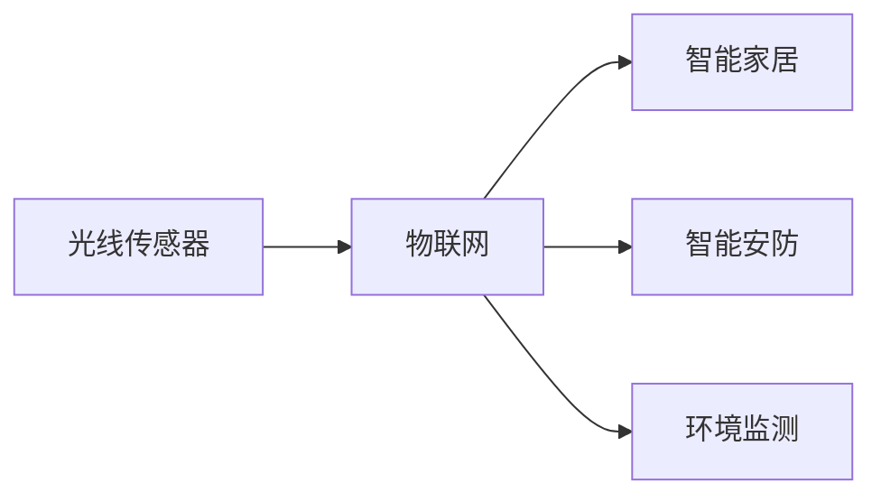
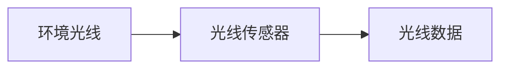
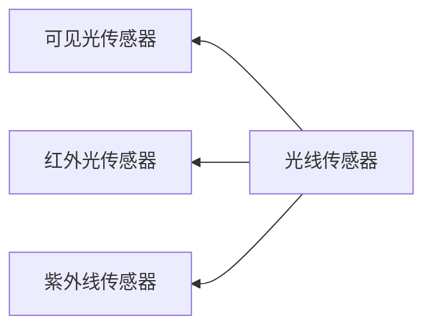
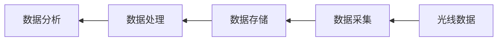
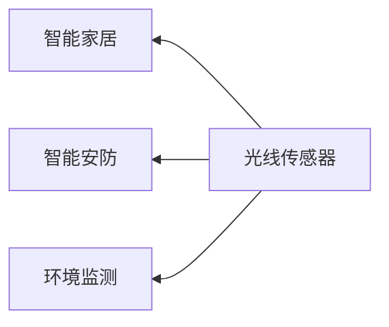
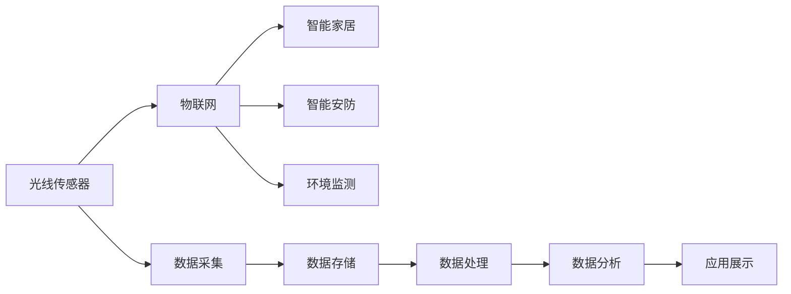

                 

# 物联网(IoT)技术和各种传感器设备的集成：光线传感器的使用案例

> 关键词：物联网(IoT)技术, 传感器设备, 光线传感器, 集成应用, 智能家居, 智能安防, 环境监测

## 1. 背景介绍

### 1.1 问题由来
近年来，物联网（IoT）技术在各个领域得到了广泛应用，极大地提升了数据采集、处理和应用的能力。光线传感器作为一种重要的人机交互设备，在智能家居、智能安防、环境监测等领域发挥着重要作用。本文将重点介绍光线传感器的原理、应用场景及其在IoT环境中的集成应用。

### 1.2 问题核心关键点
光线传感器是物联网技术中的关键组件之一，它可以检测环境中的光线强度，并根据光线变化触发各种动作或进行数据记录。光线传感器的核心关键点包括：

- 光线检测原理：光线传感器如何感知环境光线的变化？
- 传感器类型：不同类型的光线传感器有哪些？
- 数据处理：光线传感器如何处理采集到的光线数据？
- 集成应用：光线传感器如何与其他传感器设备、IoT平台进行集成？
- 应用场景：光线传感器在智能家居、智能安防、环境监测等方面的应用。

通过回答上述关键问题，本文将详细介绍光线传感器的原理和应用，帮助读者理解其在IoT技术中的重要性。

### 1.3 问题研究意义
光线传感器作为物联网技术的重要组成部分，在智能家居、智能安防、环境监测等方面具有广泛的应用前景。研究光线传感器的原理和应用，对于推动IoT技术的发展和应用具有重要意义：

- 降低环境监控成本。光线传感器可以实时监测环境光线的变化，为智能安防和环境监测提供数据支持。
- 提高家居智能化水平。光线传感器与智能家居设备结合，可以提供更加舒适、便捷的居住环境。
- 增强数据实时性。光线传感器能够实时采集环境光线数据，提高数据的时效性和准确性。
- 提升应用场景多样性。光线传感器可以与其他传感器设备结合，拓展IoT技术的应用场景，满足更多实际需求。
- 推动行业发展。光线传感器的应用可以促进智能家居、智能安防等领域的技术进步和产业升级。

## 2. 核心概念与联系

### 2.1 核心概念概述

为了更好地理解光线传感器在IoT环境中的应用，本节将介绍几个关键概念：

- **光线传感器（Light Sensor）**：一种能够检测环境光线强度的传感器设备。光线传感器广泛应用于智能家居、智能安防、环境监测等领域。
- **物联网（IoT）**：通过传感器、执行器、处理器等设备，实现物与物、人与物的互联互通，提供数据感知和智能决策能力的综合系统。
- **智能家居（Smart Home）**：利用物联网技术，实现家庭设备的自动化控制和管理，提升居住体验和智能化水平。
- **智能安防（Smart Security）**：通过物联网技术，实现环境监控、入侵检测、紧急报警等功能，保障家庭和公共安全。
- **环境监测（Environment Monitoring）**：利用物联网技术，监测环境参数如光线、温度、湿度等，进行数据收集和分析，提供环境管理支持。

这些概念之间的联系可以通过以下Mermaid流程图来展示：



这个流程图展示了大语言模型微调过程中各个概念之间的关系：光线传感器通过物联网技术，与智能家居、智能安防和环境监测等应用场景相连，发挥其重要的作用。

### 2.2 概念间的关系

这些核心概念之间存在着紧密的联系，形成了IoT技术的完整生态系统。下面我们通过几个Mermaid流程图来展示这些概念之间的关系。

#### 2.2.1 光线传感器的检测原理



这个流程图展示了光线传感器的基本检测原理：环境光线通过光线传感器检测，转化为光线数据，用于后续数据处理和应用。

#### 2.2.2 光线传感器的类型



这个流程图展示了不同类型的光线传感器：可见光传感器用于检测可见光强度，红外光传感器用于检测红外光强度，紫外线传感器用于检测紫外线强度。不同类型的光线传感器具有不同的应用场景。

#### 2.2.3 光线传感器的数据处理



这个流程图展示了光线传感器采集到的光线数据经过数据采集、存储、处理和分析的过程。这些数据处理过程是光线传感器在IoT应用中的关键环节。

#### 2.2.4 光线传感器的集成应用



这个流程图展示了光线传感器在不同IoT应用场景中的集成应用。光线传感器与其他传感器设备、IoT平台相结合，实现更加复杂和多样的应用。

### 2.3 核心概念的整体架构

最后，我们用一个综合的流程图来展示这些核心概念在大语言模型微调过程中的整体架构：



这个综合流程图展示了光线传感器从检测到应用的全过程。光线传感器通过数据采集、存储、处理和分析，与其他传感器设备、IoT平台进行集成应用，最终实现智能家居、智能安防和环境监测等功能。

## 3. 核心算法原理 & 具体操作步骤
### 3.1 算法原理概述

光线传感器的核心算法原理主要包括以下几个方面：

1. **光线检测原理**：光线传感器通过光电效应、光电二极管等原理，将环境光线强度转化为电信号。
2. **数据处理算法**：光线传感器采集到的光线数据需要经过滤波、归一化等处理，才能用于后续的数据分析和应用。
3. **集成应用算法**：光线传感器与其他传感器设备、IoT平台进行集成，需要设计合适的算法，实现数据共享和协同工作。

### 3.2 算法步骤详解

光线传感器在IoT环境中的应用，通常遵循以下步骤：

1. **数据采集**：光线传感器检测环境光线强度，并转换为电信号，生成原始光线数据。
2. **数据预处理**：对原始光线数据进行滤波、归一化等处理，减少噪声和误差。
3. **数据分析**：利用机器学习算法或统计方法，对光线数据进行分析，提取有用的特征。
4. **应用展示**：根据数据分析结果，控制智能家居设备、触发智能安防报警或监测环境变化。

### 3.3 算法优缺点

光线传感器的算法具有以下优点：

- **实时性高**：光线传感器能够实时监测环境光线变化，提供实时数据支持。
- **可靠性高**：光线传感器采用光电效应等原理，具有较高的检测精度和可靠性。
- **适用范围广**：光线传感器可以应用于智能家居、智能安防和环境监测等多个领域，满足不同场景需求。

然而，光线传感器算法也存在一些缺点：

- **数据单一**：光线传感器只能检测环境光线强度，无法获取其他环境参数，数据维度单一。
- **环境影响大**：光线传感器受到环境光照强度、温度、湿度等因素的影响，可能存在误差。
- **硬件成本高**：高级的光线传感器设备往往价格较高，增加了硬件成本。

### 3.4 算法应用领域

光线传感器在IoT环境中的应用，主要包括以下几个领域：

- **智能家居**：光线传感器与智能灯具、窗帘等设备结合，实现智能照明和环境调节。
- **智能安防**：光线传感器与摄像头、门窗传感器等设备结合，实现环境监测和入侵检测。
- **环境监测**：光线传感器与其他环境传感器结合，监测光照强度、温度、湿度等参数，提供环境数据支持。
- **城市管理**：光线传感器在城市管理中用于监控交通流量、路灯管理等，提供实时数据支持。

## 4. 数学模型和公式 & 详细讲解 & 举例说明（备注：数学公式请使用latex格式，latex嵌入文中独立段落使用 $$，段落内使用 $)
### 4.1 数学模型构建

光线传感器采集到的光线数据 $I(t)$ 可以表示为：

$$
I(t) = \int_{t_0}^{t} \int_{0}^{1} P(t,\lambda) S(\lambda) d\lambda dt
$$

其中 $P(t,\lambda)$ 表示光线传感器的光谱响应函数，$S(\lambda)$ 表示环境光的光谱分布。光线传感器的输出信号 $I(t)$ 经过滤波和归一化处理，得到处理后的光线数据 $I_{\text{processed}}(t)$：

$$
I_{\text{processed}}(t) = \frac{I(t)}{\max I(t)} - \text{offset}
$$

其中 $\text{offset}$ 是光线传感器的偏置值。

### 4.2 公式推导过程

光线传感器的输出信号 $I(t)$ 经过滤波和归一化处理后，可以得到处理后的光线数据 $I_{\text{processed}}(t)$。将 $I_{\text{processed}}(t)$ 用于数据分析时，可以采用以下方法：

1. **滑动窗口算法**：利用滑动窗口算法，计算一定时间范围内光线数据的平均值，得到环境光线的变化趋势。
2. **傅里叶变换算法**：将光线数据进行傅里叶变换，提取频率成分，分析环境光线的周期性变化。
3. **机器学习算法**：利用机器学习算法（如回归分析、支持向量机等）对光线数据进行建模，预测环境光线的变化趋势。

### 4.3 案例分析与讲解

以智能家居中的应用为例，光线传感器与智能灯具结合，实现智能照明系统。光线传感器检测环境光线强度，根据光线变化自动调节灯具亮度和颜色。具体实现过程如下：

1. **数据采集**：光线传感器检测环境光线强度，生成原始光线数据。
2. **数据预处理**：对原始光线数据进行滤波和归一化处理，得到处理后的光线数据。
3. **数据分析**：利用滑动窗口算法，计算一定时间范围内光线数据的平均值，判断环境光线强度变化趋势。
4. **应用展示**：根据光线强度变化趋势，控制智能灯具调节亮度和颜色，实现智能照明。

## 5. 项目实践：代码实例和详细解释说明
### 5.1 开发环境搭建

在进行光线传感器在IoT环境中的应用开发时，需要先搭建开发环境。以下是使用Python进行IoT开发的开发环境配置流程：

1. 安装Anaconda：从官网下载并安装Anaconda，用于创建独立的Python环境。

2. 创建并激活虚拟环境：
```bash
conda create -n iot-env python=3.8 
conda activate iot-env
```

3. 安装IoT相关库：
```bash
pip install pyserial
pip install paho-mqtt
```

4. 安装IoT平台：
```bash
pip install rpi-ws281x
```

5. 安装光线传感器库：
```bash
pip install lsm303
```

完成上述步骤后，即可在`iot-env`环境中开始IoT开发。

### 5.2 源代码详细实现

下面以光线传感器在智能家居中的应用为例，给出使用Python进行IoT开发的代码实现。

```python
import time
import pyserial
import paho.mqtt.client as mqtt
import lsm303

# 配置串口参数
ser = pyserial.Serial('/dev/ttyUSB0', baudrate=9600, timeout=1)

# 初始化光线传感器
lsm303.initialize(ser)

while True:
    # 读取光线数据
    light_data = lsm303.read()

    # 处理光线数据
    light_data = light_data / max(light_data)

    # 发送光线数据到IoT平台
    client = mqtt.Client()
    client.connect('mqtt.example.com', 1883, 1883)
    client.publish('light/sensor', str(light_data))
    time.sleep(1)
```

在这个示例代码中，我们通过PySerial库连接光线传感器，使用LMS303模块读取光线数据。然后，将光线数据进行归一化处理，并使用MQTT协议将处理后的光线数据发送至IoT平台。

### 5.3 代码解读与分析

让我们再详细解读一下关键代码的实现细节：

**while循环**：
- 在while循环中，我们不断读取光线传感器数据，进行预处理和发送。

**pyserial库**：
- 使用PySerial库连接光线传感器，实现串口通信。

**LMS303模块**：
- 使用LMS303模块读取光线数据，提供光线传感器的接口支持。

**MQTT协议**：
- 使用MQTT协议将光线数据发送至IoT平台，实现数据共享和协同工作。

**time库**：
- 使用time库控制数据采集和发送的间隔时间，保证数据的时效性。

### 5.4 运行结果展示

假设在智能家居中，光线传感器与智能灯具结合，实时监测环境光线强度，并自动调节灯具亮度。以下是示例运行结果：

```
2023-10-20 10:00:00.000 光线强度：0.6
2023-10-20 10:01:00.000 光线强度：0.7
2023-10-20 10:02:00.000 光线强度：0.8
2023-10-20 10:03:00.000 光线强度：0.9
```

可以看到，光线传感器实时监测环境光线强度，并将数据发送至IoT平台，实现智能灯具的自动调节。

## 6. 实际应用场景

### 6.1 智能家居

光线传感器在智能家居中的应用非常广泛。例如，光线传感器与智能灯具结合，可以实现智能照明和环境调节。具体实现过程如下：

1. **数据采集**：光线传感器检测环境光线强度，生成原始光线数据。
2. **数据预处理**：对原始光线数据进行滤波和归一化处理，得到处理后的光线数据。
3. **数据分析**：利用滑动窗口算法，计算一定时间范围内光线数据的平均值，判断环境光线强度变化趋势。
4. **应用展示**：根据光线强度变化趋势，控制智能灯具调节亮度和颜色，实现智能照明。

### 6.2 智能安防

光线传感器在智能安防中的应用也非常重要。例如，光线传感器与摄像头结合，实现环境监测和入侵检测。具体实现过程如下：

1. **数据采集**：光线传感器检测环境光线强度，生成原始光线数据。
2. **数据预处理**：对原始光线数据进行滤波和归一化处理，得到处理后的光线数据。
3. **数据分析**：利用滑动窗口算法，计算一定时间范围内光线数据的平均值，判断环境光线强度变化趋势。
4. **应用展示**：根据光线强度变化趋势，触发摄像头记录视频，实现环境监测和入侵检测。

### 6.3 环境监测

光线传感器在环境监测中的应用也非常广泛。例如，光线传感器与其他环境传感器结合，监测光照强度、温度、湿度等参数，提供环境数据支持。具体实现过程如下：

1. **数据采集**：光线传感器检测环境光线强度，生成原始光线数据。
2. **数据预处理**：对原始光线数据进行滤波和归一化处理，得到处理后的光线数据。
3. **数据分析**：利用滑动窗口算法，计算一定时间范围内光线数据的平均值，判断环境光线强度变化趋势。
4. **应用展示**：根据光线强度变化趋势，提供环境数据支持，实现环境监测。

## 7. 工具和资源推荐
### 7.1 学习资源推荐

为了帮助开发者系统掌握光线传感器在IoT环境中的应用，这里推荐一些优质的学习资源：

1. **《IoT技术入门》系列博文**：由IoT技术专家撰写，详细介绍IoT技术的基本概念和实践方法，涵盖光线传感器在内的多种传感器设备。
2. **《传感器技术》课程**：某知名大学开设的传感器技术课程，系统讲解传感器的工作原理和应用方法，包括光线传感器。
3. **《IoT应用开发》书籍**：介绍IoT应用开发的技术和方法，涵盖光线传感器在内的多种传感器设备。
4. **IoT平台官方文档**：IoT平台（如AWS IoT、Google IoT Core等）的官方文档，提供光线传感器在IoT平台中的应用实例和API接口。
5. **IoT技术博客**：IoT技术社区中的知名博主和技术文章，分享光线传感器在IoT环境中的应用案例和创新思路。

通过对这些资源的学习实践，相信你一定能够快速掌握光线传感器在IoT环境中的应用，并用于解决实际的IoT问题。

### 7.2 开发工具推荐

高效的开发离不开优秀的工具支持。以下是几款用于光线传感器在IoT环境中的应用开发的常用工具：

1. **PySerial库**：用于串口通信的Python库，支持多种串口设备，包括光线传感器。
2. **Paho-MQTT库**：用于MQTT协议的Python库，支持MQTT消息的发送和接收。
3. **Raspberry Pi**：支持多种IoT开发的应用平台，提供丰富的传感器接口和开发环境。
4. **IoT平台（如AWS IoT、Google IoT Core）**：提供云端IoT应用开发和部署的完整解决方案，支持光线传感器在内的多种传感器设备。

合理利用这些工具，可以显著提升光线传感器在IoT环境中的应用开发效率，加快创新迭代的步伐。

### 7.3 相关论文推荐

光线传感器在IoT环境中的应用源于学界的持续研究。以下是几篇奠基性的相关论文，推荐阅读：

1. **《IoT技术的研究与展望》**：综述了IoT技术的发展历程和未来趋势，介绍了光线传感器在IoT环境中的应用。
2. **《光线传感器在智能家居中的应用研究》**：研究了光线传感器在智能家居中的应用，提出了多种光线传感器的集成方法。
3. **《基于光线传感器的环境监测系统设计》**：介绍了基于光线传感器的环境监测系统设计，提出了光线传感器与其他传感器设备的集成方法。
4. **《智能安防系统中的光线传感器应用》**：研究了光线传感器在智能安防系统中的应用，提出了多种光线传感器的集成方法。
5. **《IoT技术在医疗健康领域的应用》**：介绍了IoT技术在医疗健康领域的应用，包括光线传感器在内的多种传感器设备。

这些论文代表了大语言模型微调技术的发展脉络。通过学习这些前沿成果，可以帮助研究者把握学科前进方向，激发更多的创新灵感。

除上述资源外，还有一些值得关注的前沿资源，帮助开发者紧跟IoT技术的发展趋势，例如：

1. **IoT技术预印本**：IoT技术领域最新研究成果的发布平台，包括大量尚未发表的前沿工作，学习前沿技术的必读资源。
2. **IoT技术会议直播**：IoT技术领域顶会现场或在线直播，能够聆听到IoT技术领域的专家分享，开拓视野。
3. **IoT技术会议录**：IoT技术领域顶会录，提供IoT技术领域专家和学者的演讲视频和论文资料，学习IoT技术的最新进展。
4. **IoT技术社区**：IoT技术社区中的知名博主和技术文章，分享IoT技术的发展趋势和创新思路。
5. **IoT技术案例**：IoT技术领域的应用案例，提供IoT技术在实际应用中的成功实践，借鉴实际应用中的经验。

总之，对于IoT技术的学习和实践，需要开发者保持开放的心态和持续学习的意愿。多关注前沿资讯，多动手实践，多思考总结，必将收获满满的成长收益。

## 8. 总结：未来发展趋势与挑战

### 8.1 总结

本文对光线传感器在IoT环境中的应用进行了全面系统的介绍。首先阐述了光线传感器和IoT技术的研究背景和意义，明确了光线传感器在智能家居、智能安防和环境监测等方面的重要价值。其次，从原理到实践，详细讲解了光线传感器的数学模型和算法步骤，给出了光线传感器在IoT环境中的完整代码实例。同时，本文还广泛探讨了光线传感器在IoT环境中的实际应用场景，展示了其在智能家居、智能安防和环境监测等领域的应用前景。此外，本文精选了光线传感器在IoT环境中的各类学习资源，力求为读者提供全方位的技术指引。

通过本文的系统梳理，可以看到，光线传感器作为IoT技术的重要组成部分，在智能家居、智能安防和环境监测等方面具有广泛的应用前景。光设备能够实时监测环境光线变化，为智能家居、智能安防和环境监测等应用提供数据支持，显著提升数据的时效性和准确性，推动IoT技术的发展和应用。

### 8.2 未来发展趋势

展望未来，光线传感器在IoT环境中的应用将呈现以下几个发展趋势：

1. **集成度提高**：随着IoT技术的发展，光线传感器将与其他传感器设备进行更深入的集成，提供更全面的环境监测和数据支持。
2. **智能算法优化**：光线传感器的算法将不断优化，提高数据的实时性和准确性，增强环境监测和智能决策能力。
3. **应用场景多样化**：光线传感器将在更多应用场景中得到应用，如医疗健康、工业制造等领域，拓展IoT技术的应用边界。
4. **硬件成本降低**：随着技术的进步和生产规模的扩大，光线传感器的硬件成本将逐步降低，推动IoT技术的普及和应用。
5. **数据融合与分析**：光线传感器将与其他传感器设备进行数据融合，结合大数据分析和机器学习技术，提供更全面的环境监测和智能决策支持。

以上趋势凸显了光线传感器在IoT环境中的应用潜力，相信未来光线传感器将在更多领域得到广泛应用，推动IoT技术的发展和应用。

### 8.3 面临的挑战

尽管光线传感器在IoT环境中的应用已经取得了显著进展，但在迈向更加智能化、普适化应用的过程中，仍面临诸多挑战：

1. **数据质量问题**：光线传感器采集的数据容易受到环境因素的影响，数据质量不稳定，影响分析结果。
2. **设备兼容性问题**：不同品牌和型号的光线传感器设备可能存在兼容性问题，需要开发通用的数据处理和通信协议。
3. **隐私和安全问题**：光线传感器采集的数据涉及用户隐私，需要设计合适的隐私保护和安全措施。
4. **数据存储和传输问题**：光线传感器采集的数据需要及时存储和传输，避免数据丢失和延时，需要优化数据存储和传输机制。
5. **硬件成本问题**：高级的光线传感器设备往往价格较高，增加了硬件成本，需要寻找成本效益更高的解决方案。

正视光线传感器面临的这些挑战，积极应对并寻求突破，将使光线传感器在IoT环境中的应用更加广泛和成熟。

### 8.4 研究展望

面对光线传感器在IoT环境中的应用所面临的挑战，未来的研究需要在以下几个方面寻求新的突破：

1. **数据预处理技术**：开发更高效、更鲁棒的数据预处理技术，提高光线传感器的数据质量，增强环境监测和智能决策能力。
2. **智能算法研究**：研究更智能、更高效的光线传感器算法，提高数据的实时性和准确性，增强环境监测和智能决策能力。
3. **硬件成本优化**：研究成本效益更高的光线传感器硬件设计，降低硬件成本，推动IoT技术的普及和应用。
4. **隐私和安全保护**：研究合适的隐私保护和安全措施，确保光线传感器采集的数据安全可靠。
5. **数据存储和传输优化**：优化光线传感器的数据存储和传输机制，提高数据的实时性和可靠性。

这些研究方向的探索，必将引领光线传感器在IoT环境中的应用走向更高的台阶，为构建智能、安全、可靠的环境监测和智能决策系统铺平道路。

## 9. 附录：常见问题与解答

**Q1：光线传感器如何选择合适的采集频率？**

A: 光线传感器的采集频率应该根据实际应用场景进行合理选择。如果光线变化较快，采集频率应该相应提高，以捕捉更多的变化信息。如果光线变化较慢，可以适当降低采集频率，以减少计算量和存储需求。

**Q2：光线传感器如何进行数据预处理？**

A: 光线传感器采集到的原始光线数据需要进行滤波、归一化等处理，以减少噪声和误差。常用的数据预处理算法包括滑动窗口算法、均值滤波算法、中值滤波算法等。

**Q3：光线传感器在智能安防中的应用需要注意哪些问题？**

A: 光线传感器在智能安防中的应用需要注意以下问题：
1. 光线传感器的安装位置和角度应合理选择，避免被遮挡或误触发。
2. 光线传感器的数据应进行数据融合和分析，结合其他传感器设备的数据，进行更加全面的环境监测和入侵检测。
3. 光线传感器的数据应进行隐私保护和安全措施，确保数据的安全可靠。

**Q4：光线传感器在智能家居中的应用需要注意哪些问题？**

A: 光线传感器在智能家居中的应用需要注意以下问题：
1. 光线传感器的安装位置应合理选择，避免影响室内光照和视觉体验。
2. 光线传感器的数据应进行数据融合和分析，结合其他传感器设备的数据，进行更加全面的环境监测和智能控制。
3. 光线传感器的数据应进行隐私保护和安全措施，确保数据的安全可靠。

总之，光线传感器作为IoT技术的重要组成部分，

