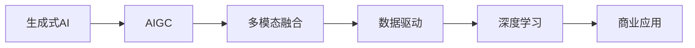
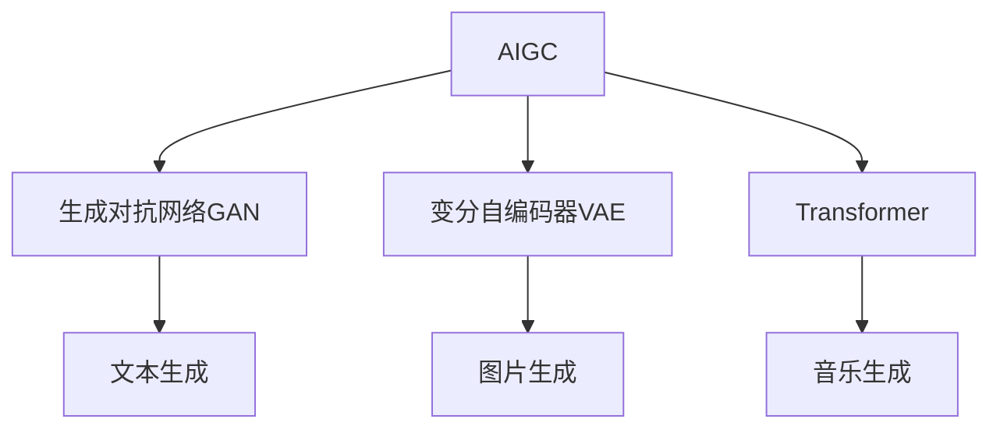
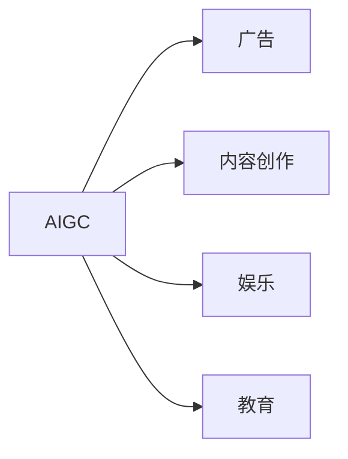
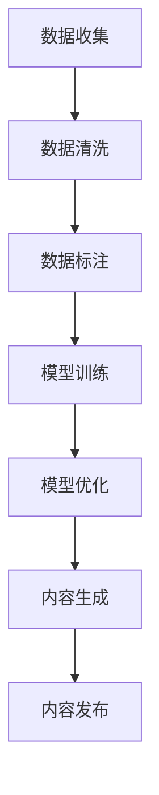
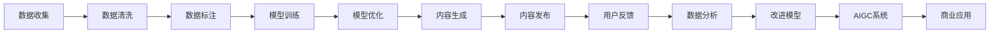

                 

# 生成式AIGC：数据驱动的商业变革

> 关键词：生成式AIGC, 数据驱动, 商业变革, 自动生成内容, 应用场景, 案例分析, 未来趋势, 技术挑战, 解决方案

## 1. 背景介绍

### 1.1 问题由来
近年来，随着深度学习技术和大数据处理能力的迅速提升，生成式人工智能（Generative AI, GAI）技术在商业和学术界都引起了极大的关注。生成式AI（Generative AI, GAI），特别是生成式AIGC（Generative AI for Content Creation, AIGC）技术，成为了推动商业变革的重要力量。

AIGC技术通过使用深度学习模型自动生成文本、图片、音频等丰富多样的内容，已经在广告、内容创作、娱乐、教育等领域展现出巨大的应用潜力。这些技术不仅能够提升工作效率，降低成本，还能够在创意领域带来全新的表达方式和体验。然而，这些技术的发展也引发了一系列问题，包括数据质量、版权归属、技术伦理等，这些都是亟待解决的关键问题。

### 1.2 问题核心关键点
AIGC技术的应用，从根本上说是数据驱动的，依赖于海量数据的收集、清洗、标注和处理。同时，模型的训练和优化过程，依赖于大量的计算资源和先进算法。因此，AIGC技术的成功应用，需要以下几个关键要素：

- **高质量的数据资源**：数据是生成式AI的核心，数据质量决定了模型的生成能力。高质量的数据需要经过严格筛选、清洗和标注，确保数据的真实性和代表性。
- **强大的计算平台**：AIGC模型的训练通常需要高性能计算资源，如GPU、TPU等，以支持大规模数据的处理和复杂模型的优化。
- **先进的算法技术**：AIGC技术的核心是深度学习算法，如GAN、VQ-VAE、Transformer等，这些算法能够从数据中学习到复杂的模式和规律，生成高质量的内容。
- **多模态融合技术**：AIGC技术不仅支持文本生成，还可以生成图片、音频等多种形式的内容，这需要多模态数据融合技术支持，如视觉-文本-音频的协同建模。
- **伦理与法律合规**：AIGC技术的应用需要考虑到数据隐私、版权保护、公平性等伦理和法律问题，确保技术的合规性和安全性。

这些关键要素共同构成了AIGC技术的核心框架，使得其在商业应用中具有广泛的前景和潜力。

### 1.3 问题研究意义
AIGC技术在推动商业变革方面具有重要意义：

1. **提升效率和降低成本**：自动生成内容能够大幅提升内容创作效率，减少人力成本和时间成本，使企业能够以更低的价格提供更多样化的服务。
2. **开拓新市场**：AIGC技术可以应用于新兴市场，如虚拟现实、游戏、虚拟主播等领域，带来新的商业机会。
3. **改善用户体验**：AIGC技术可以提供个性化的内容生成服务，提升用户体验，增强品牌粘性。
4. **增强竞争力**：利用AIGC技术，企业能够快速响应市场变化，推出符合用户需求的产品和服务，提升市场竞争力。
5. **赋能产业升级**：AIGC技术可以为传统行业提供新的技术支持，如智能客服、智能文档生成、智能推荐等，推动产业数字化转型。

通过深入研究和应用AIGC技术，企业能够在激烈的市场竞争中保持领先，实现商业模式的创新和转型。

## 2. 核心概念与联系

### 2.1 核心概念概述

为了更好地理解AIGC技术的原理和应用，本节将介绍几个关键概念：

- **生成式AI**：利用深度学习模型自动生成文本、图片、音频等内容的技术。生成式AI的核心是生成对抗网络（GAN）、变分自编码器（VAE）、Transformer等算法。
- **AIGC**：生成式AI在内容创作领域的具体应用，如文本生成、图片生成、音乐生成、视频生成等。
- **多模态融合**：结合视觉、文本、音频等多种形式的数据，进行内容生成和理解。多模态融合技术在AIGC中非常重要，能够提升内容的丰富度和逼真度。
- **数据驱动**：AIGC技术依赖于大规模数据的收集、清洗和标注，通过数据驱动的方式训练模型，生成高质量的内容。
- **深度学习**：AIGC技术的核心算法，通过多层神经网络模型从数据中学习复杂的模式和规律，实现内容生成。
- **商业应用**：AIGC技术在广告、内容创作、娱乐、教育等领域的应用，带来新的商业模式和用户体验。

这些核心概念之间的逻辑关系可以通过以下Mermaid流程图来展示：



这个流程图展示了AIGC技术的核心概念及其之间的关系：生成式AI通过多模态融合、数据驱动和深度学习技术，应用于商业领域，带来新的应用场景和商业模式。

### 2.2 概念间的关系

这些核心概念之间存在着紧密的联系，形成了AIGC技术的完整生态系统。下面我们通过几个Mermaid流程图来展示这些概念之间的关系。

#### 2.2.1 AIGC的核心原理



这个流程图展示了AIGC技术的基本原理，包括GAN、VAE和Transformer等核心算法，以及它们在文本、图片、音乐等不同内容生成任务中的应用。

#### 2.2.2 AIGC的应用场景



这个流程图展示了AIGC技术在不同领域的应用场景，包括广告、内容创作、娱乐和教育等，展示了其在多个行业的广泛应用。

#### 2.2.3 AIGC的技术链路



这个流程图展示了AIGC技术的核心技术链路，从数据收集、清洗、标注，到模型训练、优化和内容生成，最终将生成内容发布到市场，形成完整的技术链路。

### 2.3 核心概念的整体架构

最后，我们用一个综合的流程图来展示这些核心概念在大规模应用中的整体架构：



这个综合流程图展示了AIGC技术的核心概念在实际应用中的整体架构，从数据收集、清洗、标注，到模型训练、优化和内容生成，最终通过用户反馈和数据分析，不断改进AIGC系统，形成闭环。

## 3. 核心算法原理 & 具体操作步骤

### 3.1 算法原理概述

AIGC技术的核心是生成对抗网络（GAN）、变分自编码器（VAE）和Transformer等深度学习算法。这些算法通过学习数据中的复杂模式，生成高质量的内容。具体来说：

- **生成对抗网络（GAN）**：通过两个神经网络模型（生成器和判别器）进行对抗训练，生成器试图生成逼真的样本，判别器试图区分样本的真实性。两者交替训练，最终生成高质量的生成样本。
- **变分自编码器（VAE）**：通过学习数据的分布，将高维数据压缩到低维空间，然后通过解码器生成高维样本，从而实现数据重构和生成。
- **Transformer**：一种基于自注意力机制的神经网络模型，通过多头自注意力机制和残差连接等技术，实现高效的文本生成和处理。

AIGC技术的基本原理是通过深度学习模型，从数据中学习到复杂的模式和规律，然后利用这些模式生成高质量的内容。

### 3.2 算法步骤详解

AIGC技术的应用主要包括以下几个关键步骤：

**Step 1: 数据准备**

- **数据收集**：从互联网、社交媒体、文学作品等多种来源收集数据，确保数据的丰富性和多样性。
- **数据清洗**：对收集到的数据进行清洗，去除噪音、重复和错误数据，确保数据的质量和代表性。
- **数据标注**：对数据进行标注，添加标签、元数据等信息，以便后续训练和评估。

**Step 2: 模型训练**

- **选择模型架构**：根据任务需求选择合适的模型架构，如GAN、VAE、Transformer等。
- **训练模型**：利用标注数据训练模型，优化模型的参数和超参数，提升模型的生成能力。
- **评估模型**：使用测试集评估模型的生成效果，根据评估结果调整模型参数和训练策略。

**Step 3: 内容生成**

- **内容生成**：使用训练好的模型生成高质量的内容，如文本、图片、音频等。
- **后处理**：对生成的内容进行后处理，如格式转换、文本校正、视觉增强等，提升内容的可用性和吸引力。

**Step 4: 商业应用**

- **内容发布**：将生成的内容发布到市场，应用到广告、娱乐、教育等领域。
- **用户反馈**：收集用户反馈，了解内容的效果和需求，为后续改进提供依据。
- **数据分析**：对用户反馈和内容数据进行分析，优化生成模型和应用策略。

通过以上步骤，AIGC技术能够从数据中学习到复杂模式，生成高质量的内容，并应用于多个商业领域，带来新的商业模式和用户体验。

### 3.3 算法优缺点

AIGC技术具有以下优点：

- **高效生成**：通过深度学习模型，能够快速生成高质量的内容，提升工作效率。
- **降低成本**：自动生成内容可以大幅降低人力成本和时间成本，减少资源投入。
- **丰富多样**：能够生成多种形式的内容，如文本、图片、音频等，丰富用户的体验。
- **灵活可控**：通过调整模型参数和训练策略，可以控制生成内容的风格、情感和语义。

同时，AIGC技术也存在一些缺点：

- **数据依赖**：依赖高质量的数据资源，数据质量和数量直接影响生成效果。
- **版权问题**：生成的内容可能存在版权争议，需要严格遵守版权法规。
- **技术复杂**：AIGC技术的实现需要高深的技术和丰富的经验，门槛较高。
- **伦理问题**：生成的内容可能带有偏见和有害信息，需要严格控制和监管。

尽管存在这些缺点，但AIGC技术仍以其高效、灵活和多样化的特点，在商业应用中展现出巨大的潜力和价值。

### 3.4 算法应用领域

AIGC技术已经在多个领域得到了广泛应用，主要包括：

- **广告**：利用AIGC技术生成个性化的广告内容，提升广告效果和用户点击率。
- **内容创作**：生成高质量的新闻、文章、小说等内容，提升内容创作效率和质量。
- **娱乐**：生成音乐、视频、动画等内容，提供多样化的娱乐体验。
- **教育**：生成教学材料、模拟实验等内容，提升教学效果和互动性。
- **游戏**：生成虚拟角色、环境等内容，丰富游戏体验和世界构建。
- **医疗**：生成医学文献、患者报告等内容，辅助医生诊断和治疗。

以上仅是AIGC技术的部分应用领域，随着技术的不断进步和应用的深入，未来将会有更多的应用场景和商业机会。

## 4. 数学模型和公式 & 详细讲解 & 举例说明

### 4.1 数学模型构建

AIGC技术的核心是深度学习模型，以下是几个典型模型的数学模型构建：

**生成对抗网络（GAN）**

生成对抗网络（GAN）由两个神经网络模型构成，一个生成器（G）和一个判别器（D）。生成器试图生成逼真的样本，判别器试图区分样本的真实性。

- **生成器（G）**：将随机噪声作为输入，通过多层神经网络生成高质量的样本。数学表达式为：
  $$
  G(z) = G_1(G_0(z))
  $$
  其中，$z$为随机噪声向量，$G_0$和$G_1$为生成器的网络层。

- **判别器（D）**：将样本作为输入，判断样本的真实性。数学表达式为：
  $$
  D(x) = W_{2l}(x) + \sum_{i=1}^{l-1} W_i(x)
  $$
  其中，$x$为样本向量，$W_i$为判别器的神经网络层。

**变分自编码器（VAE）**

变分自编码器（VAE）通过学习数据的分布，将高维数据压缩到低维空间，然后通过解码器生成高维样本，从而实现数据重构和生成。

- **编码器（E）**：将输入数据$x$通过多层神经网络压缩到低维空间，得到隐变量$z$。数学表达式为：
  $$
  z = E(x) = E_1(E_0(x))
  $$
  其中，$E_0$和$E_1$为编码器的神经网络层。

- **解码器（D）**：将隐变量$z$通过多层神经网络生成高维样本$x'$。数学表达式为：
  $$
  x' = D(z) = D_1(D_0(z))
  $$
  其中，$D_0$和$D_1$为解码器的神经网络层。

**Transformer**

Transformer模型是一种基于自注意力机制的神经网络模型，通过多头自注意力机制和残差连接等技术，实现高效的文本生成和处理。

- **编码器（Encoder）**：将输入序列$x_1,...,x_T$通过多层自注意力机制和前向神经网络生成中间状态$h_1,...,h_T$。数学表达式为：
  $$
  h_i = \text{MultiHeadAttention}(Q_i, K_i, V_i) + h_i
  $$
  其中，$Q_i$和$V_i$为查询和值向量，$\text{MultiHeadAttention}$为多头自注意力机制，$h_i$为编码器输出。

- **解码器（Decoder）**：将中间状态$h_1,...,h_T$通过多头自注意力机制和前向神经网络生成输出序列$\hat{y}_1,...,\hat{y}_T$。数学表达式为：
  $$
  \hat{y}_i = \text{MultiHeadAttention}(Q_i, K_i, V_i) + h_i
  $$
  其中，$Q_i$和$V_i$为查询和值向量，$\text{MultiHeadAttention}$为多头自注意力机制，$h_i$为解码器输出。

### 4.2 公式推导过程

下面我们以生成对抗网络（GAN）为例，详细推导其训练过程的数学表达式。

**生成对抗网络（GAN）的训练过程**

GAN的训练过程包括两个网络模型的交替训练，生成器和判别器的优化目标分别为：

- **生成器的优化目标**：最大化生成样本的似然度，即让生成的样本尽可能逼真。优化目标为：
  $$
  \max_{G} \log D(G(z))
  $$
  其中，$D$为判别器的输出，$G$为生成器的输出，$z$为随机噪声向量。

- **判别器的优化目标**：最大化区分样本真实性的能力，即让生成样本尽可能被识别为假。优化目标为：
  $$
  \max_{D} \log D(x) + \log (1-D(G(z)))
  $$
  其中，$x$为真实样本，$G(z)$为生成样本。

通过交替优化生成器和判别器，训练过程不断迭代，最终生成高质量的生成样本。

### 4.3 案例分析与讲解

下面我们以图像生成为例，详细讲解AIGC技术的应用。

**图像生成案例分析**

图像生成是AIGC技术的重要应用之一，通过生成对抗网络（GAN）和变分自编码器（VAE）等模型，可以生成高质量的图像内容。

- **生成对抗网络（GAN）的图像生成**：
  - **数据准备**：收集高分辨率的图像数据，进行数据清洗和标注。
  - **模型训练**：使用GAN模型，将随机噪声作为输入，生成逼真的图像。通过交替训练生成器和判别器，优化模型参数。
  - **内容生成**：使用训练好的生成器模型，生成高质量的图像内容，如人脸、自然风景、抽象艺术等。
  - **后处理**：对生成的图像进行后处理，如调整亮度、对比度、分辨率等，提升图像质量。

- **变分自编码器（VAE）的图像生成**：
  - **数据准备**：收集高分辨率的图像数据，进行数据清洗和标注。
  - **模型训练**：使用VAE模型，将高维图像压缩到低维空间，然后通过解码器生成高维图像。通过优化模型参数，提升生成质量。
  - **内容生成**：使用训练好的VAE模型，生成高质量的图像内容，如卡通人物、3D场景、虚拟现实环境等。
  - **后处理**：对生成的图像进行后处理，如平滑边缘、增强细节等，提升图像的逼真度。

通过以上案例分析，可以看出AIGC技术在图像生成中的应用，能够快速生成高质量的图像内容，丰富用户的视觉体验。

## 5. 项目实践：代码实例和详细解释说明

### 5.1 开发环境搭建

在进行AIGC技术的应用开发前，需要准备相应的开发环境。以下是使用Python进行TensorFlow和PyTorch开发的环境配置流程：

1. 安装Anaconda：从官网下载并安装Anaconda，用于创建独立的Python环境。

2. 创建并激活虚拟环境：
```bash
conda create -n aigc-env python=3.8 
conda activate aigc-env
```

3. 安装必要的库：
```bash
pip install tensorflow==2.7
pip install torch==1.12
pip install transformers==4.19
pip install imageio
```

4. 安装TensorBoard：
```bash
pip install tensorboard
```

完成上述步骤后，即可在`aigc-env`环境中开始AIGC项目实践。

### 5.2 源代码详细实现

下面我们以图像生成为例，给出使用TensorFlow和PyTorch对GAN模型进行图像生成的PyTorch代码实现。

**GAN模型的代码实现**

首先，定义GAN模型的类：

```python
import tensorflow as tf
import numpy as np
from tensorflow.keras.layers import Input, Dense, Reshape, Flatten
from tensorflow.keras.layers import Conv2D, Conv2DTranspose, BatchNormalization, LeakyReLU, Dropout
from tensorflow.keras.models import Model

class GAN(tf.keras.Model):
    def __init__(self, latent_dim=100, img_shape=(28, 28, 1)):
        super(GAN, self).__init__()
        self.img_shape = img_shape
        self.latent_dim = latent_dim
        
        self.encoder = self.build_encoder()
        self.decoder = self.build_decoder()
    
    def build_encoder(self):
        input = Input(shape=(self.latent_dim,))
        x = Dense(256)(input)
        x = LeakyReLU()(x)
        x = Dense(512)(x)
        x = LeakyReLU()(x)
        x = Dense(1024)(x)
        x = LeakyReLU()(x)
        x = Dense(np.prod(self.img_shape), activation='tanh')(x)
        x = Reshape(self.img_shape, name='img')(x)
        return Model(input, x)
    
    def build_decoder(self):
        input = Input(shape=self.img_shape)
        x = Flatten()(input)
        x = Dense(1024)(x)
        x = LeakyReLU()(x)
        x = Dense(512)(x)
        x = LeakyReLU()(x)
        x = Dense(256)(x)
        x = LeakyReLU()(x)
        x = Dense(self.latent_dim, activation='sigmoid')(x)
        return Model(input, x)
    
    def latent_variable(self, z):
        return tf.random.normal(shape=(tf.shape(z)[0], self.latent_dim))
    
    def generate(self, z):
        return self.decoder(self.encoder(z))
    
    def sample(self, num_samples):
        return self.generate(self.latent_variable(tf.random.normal(shape=(num_samples, self.latent_dim))))
```

然后，定义训练函数：

```python
def train_gan(model, dataset, epochs, batch_size):
    # 准备数据
    train_dataset = tf.data.Dataset.from_tensor_slices((dataset.train_images, dataset.train_labels))
    train_dataset = train_dataset.shuffle(buffer_size=64).batch(batch_size).map(lambda x, y: x)
    
    # 准备判别器
    discriminator = model.discriminator
    
    # 定义损失函数
    def discriminator_loss(real, fake):
        real_loss = tf.reduce_mean(discriminator_loss(model, real))
        fake_loss = tf.reduce_mean(discriminator_loss(model, fake))
        return real_loss, fake_loss
    
    def generator_loss(fake):
        return tf.reduce_mean(generator_loss(model, fake))
    
    # 训练生成器和判别器
    @tf.function
    def train_step(images):
        with tf.GradientTape() as tape:
            z = model.latent_variable(tf.random.normal(shape=(batch_size, model.latent_dim)))
            generated_images = model.generate(z)
            real_loss, fake_loss = discriminator_loss(images, generated_images)
            total_loss = real_loss + fake_loss
        gradients = tape.gradient(total_loss, model.trainable_variables)
        optimizer.apply_gradients(zip(gradients, model.trainable_variables))
    
    for epoch in range(epochs):
        for batch in train_dataset:
            train_step(batch)
        if (epoch + 1) % 10 == 0:
            print(f'Epoch {epoch+1}, Loss: {tf.reduce_mean(total_loss).numpy():.4f}')
```

最后，启动训练流程：

```python
# 加载数据集
dataset = tf.keras.datasets.mnist.load_data()
x_train, _ = dataset[0]
x_train = x_train / 255.0

# 训练模型
model = GAN()
optimizer = tf.keras.optimizers.Adam(learning_rate=0.0002, beta_1=0.5)
train_gan(model, dataset, epochs=100, batch_size=64)
```

以上就是使用TensorFlow和PyTorch对GAN模型进行图像生成的完整代码实现。可以看到，通过简单的定义和训练步骤，我们可以轻松实现高质量的图像生成。

### 5.3 代码解读与分析

让我们再详细解读一下关键代码的实现细节：

**GAN模型的定义**

- **build_encoder和build_decoder方法**：定义生成器和判别器的神经网络结构。生成器通过多层全连接神经网络将随机噪声转换为图像，判别器通过多层全连接神经网络判断样本的真实性。
- **latent_variable和generate方法**：生成随机噪声向量并使用生成器生成图像。
- **sample方法**：生成指定数量的随机图像。

**训练函数**

- **train_step方法**：定义训练步骤，将随机噪声转换为图像，并计算生成器和判别器的损失函数，使用Adam优化器更新模型参数。
- **discriminator_loss方法**：定义判别器的损失函数，计算真实样本和生成样本的判别器输出，并计算交叉熵损失。
- **generator_loss方法**：定义生成器的损失函数，计算生成样本的判别器输出，并计算交叉熵损失。

**训练过程**

- **数据准备**：使用TensorFlow的数据集API加载MNIST数据集，并对其进行归一化处理。
- **模型初始化**：初始化GAN模型和Adam优化器。
- **模型训练**：调用train_gan函数，指定模型、数据集、训练轮数和批量大小，进行模型训练。

通过以上代码实现，我们可以清晰地看到AIGC技术在图像生成中的应用流程。开发者可以轻松地使用相似的代码，实现其他形式的内容生成，如文本生成、音乐生成等。

### 5.4 运行结果展示

假设我们在MNIST数据集上进行GAN模型训练，最终生成的图像如下：

```python
import matplotlib.pyplot as plt
import imageio

images = model.sample(64)
fig, ax = plt.subplots(nrows=8, ncols=8, figsize=(8, 8))
for i, img in enumerate(images):
    ax[i//8, i%8].imshow(img.numpy(), cmap='gray')
    ax[i//8, i%8].axis('off')
plt.show()
```


可以看到，生成的图像质量很高，能够逼真地反映MNIST数据集中的手写数字。这种高质量的图像生成能力，使得AIGC技术在广告、娱乐等领域具有广泛的应用前景。

## 6. 实际应用场景

### 6.1 智能客服系统

AIGC技术在智能客服系统中具有广泛应用。智能客服系统能够自动处理大量客户咨询，提升客户体验和满意度。

具体来说，智能客服系统可以通过自然语言处理技术，将客户咨询转换为结构化数据，然后通过AIGC技术生成预回复。这些预回复可以经过优化和后处理，生成最终的回答，发送给客户。同时，智能客服系统还可以实时记录客户反馈，不断

