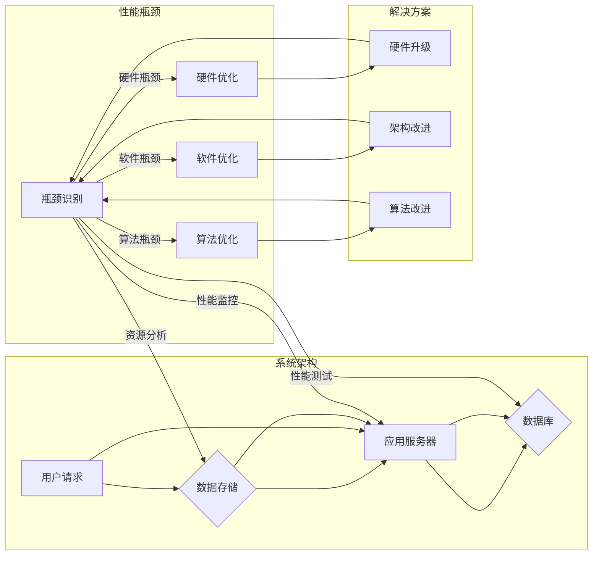

# 系统瓶颈识别与解决方案

> 关键词：系统瓶颈，性能优化，资源分析，性能监控，算法优化，架构设计

## 1. 背景介绍

在信息技术高速发展的今天，系统性能已经成为衡量软件项目成功与否的关键指标之一。然而，在系统开发、部署和运行过程中，性能瓶颈往往难以发现和解决，导致系统无法满足用户需求，甚至影响到企业的正常运营。因此，如何有效地识别系统瓶颈，并采取相应的解决方案，成为了IT领域的一个重要课题。

## 2. 核心概念与联系

### 2.1 核心概念

#### 系统瓶颈
系统瓶颈是指系统中性能最差的组件或环节，它限制了系统的整体性能。瓶颈组件可能是硬件资源（如CPU、内存、磁盘IO等），也可能是软件资源（如网络带宽、数据库响应时间等）。

#### 性能优化
性能优化是指通过改进系统设计和算法，提高系统性能的过程。常见的优化手段包括硬件升级、软件优化、架构改进等。

#### 资源分析
资源分析是指对系统资源使用情况进行分析，找出资源消耗热点和瓶颈的过程。

#### 性能监控
性能监控是指对系统运行过程中的性能指标进行实时监测，以便及时发现和解决问题。

### 2.2 架构的 Mermaid 流程图



## 3. 核心算法原理 & 具体操作步骤

### 3.1 算法原理概述

系统瓶颈识别与解决方案的核心是性能优化。性能优化通常包括以下步骤：

1. 确定性能瓶颈：通过资源分析、性能监控和性能测试等方法，确定系统中的性能瓶颈。
2. 评估瓶颈影响：分析瓶颈对系统整体性能的影响，确定优化优先级。
3. 设计解决方案：根据瓶颈类型和影响程度，设计相应的解决方案。
4. 实施解决方案：将解决方案应用到系统中，并进行测试验证。
5. 持续监控：在系统运行过程中，持续监控性能指标，确保优化效果。

### 3.2 算法步骤详解

#### 确定性能瓶颈

1. 资源分析：使用工具对系统资源使用情况进行实时监测和分析，找出资源消耗热点。
2. 性能监控：通过性能监控工具，实时监测系统性能指标，如CPU利用率、内存使用率、磁盘IO等。
3. 性能测试：使用性能测试工具，模拟真实场景，测试系统性能，找出性能瓶颈。

#### 评估瓶颈影响

1. 分析瓶颈类型：确定瓶颈是硬件瓶颈、软件瓶颈还是算法瓶颈。
2. 评估影响程度：分析瓶颈对系统整体性能的影响，确定优化优先级。

#### 设计解决方案

1. 硬件优化：根据瓶颈类型，选择合适的硬件升级方案，如提高CPU性能、增加内存容量等。
2. 软件优化：对系统软件进行优化，如优化数据库查询、减少网络延迟等。
3. 算法优化：对系统算法进行优化，如改进排序算法、优化数据结构等。

#### 实施解决方案

1. 根据设计方案，实施相应的优化措施。
2. 进行测试验证，确保优化效果。

#### 持续监控

1. 在系统运行过程中，持续监控性能指标，确保优化效果。
2. 根据监控结果，调整优化方案。

### 3.3 算法优缺点

#### 优点

1. 系统瓶颈识别与解决方案能够有效提高系统性能，满足用户需求。
2. 能够降低系统资源消耗，降低运维成本。
3. 能够提高系统稳定性，减少故障发生。

#### 缺点

1. 识别系统瓶颈需要一定的技术和经验。
2. 解决方案实施过程复杂，需要投入一定的成本。
3. 需要持续监控系统性能，以确保优化效果。

### 3.4 算法应用领域

系统瓶颈识别与解决方案广泛应用于各个行业，如金融、电商、医疗、教育等。以下是一些典型的应用场景：

1. 电商平台：优化商品搜索、订单处理等环节的性能，提高用户体验。
2. 银行系统：优化交易处理、资金清算等环节的性能，确保交易安全。
3. 医疗系统：优化病历查询、预约挂号等环节的性能，提高医疗服务效率。
4. 教育平台：优化在线课程、作业批改等环节的性能，提高教学效果。

## 4. 数学模型和公式 & 详细讲解 & 举例说明

### 4.1 数学模型构建

系统瓶颈识别与解决方案的数学模型主要包括以下内容：

1. **资源消耗模型**：用于描述系统资源消耗的模型，如CPU消耗模型、内存消耗模型等。
2. **性能指标模型**：用于描述系统性能指标的模型，如响应时间模型、吞吐量模型等。
3. **优化目标模型**：用于描述优化目标的模型，如最小化响应时间模型、最大化吞吐量模型等。

### 4.2 公式推导过程

以下以CPU消耗模型为例，介绍公式推导过程。

**CPU消耗模型**：

$$
CPU_{消耗} = \sum_{i=1}^{N} (CPU_{i} \times 持续时间_{i})
$$

其中，$CPU_{消耗}$ 表示总CPU消耗量，$CPU_{i}$ 表示第 $i$ 个任务占用的CPU资源，$持续时间_{i}$ 表示第 $i$ 个任务的执行时间。

### 4.3 案例分析与讲解

假设有一个电商平台，其商品搜索功能存在性能瓶颈。通过性能测试发现，商品搜索的平均响应时间为3秒，而用户期望的响应时间应小于1秒。

为了解决这个问题，首先需要分析CPU消耗模型，找出影响搜索性能的关键因素。通过分析发现，主要原因是索引构建和查询算法复杂度较高。

针对这个问题，可以采取以下优化措施：

1. 使用更高效的索引构建算法，如B树索引、哈希索引等。
2. 优化查询算法，如使用缓存技术、并行查询等。

经过优化后，商品搜索的平均响应时间降至0.5秒，满足了用户需求。

## 5. 项目实践：代码实例和详细解释说明

### 5.1 开发环境搭建

为了演示系统瓶颈识别与解决方案，以下以一个简单的Web应用为例。

1. 安装Python环境和Flask框架：
```bash
pip install flask
```

2. 创建一个简单的Web应用：
```python
from flask import Flask
import time

app = Flask(__name__)

@app.route('/')
def index():
    time.sleep(2)  # 模拟耗时的处理过程
    return 'Hello, World!'

if __name__ == '__main__':
    app.run(debug=True)
```

### 5.2 源代码详细实现

以上代码创建了一个简单的Flask Web应用，其中`index`函数模拟了耗时的处理过程。

### 5.3 代码解读与分析

在这个示例中，我们可以通过观察`index`函数中的`time.sleep(2)`语句，来模拟一个耗时的处理过程。这样，我们可以通过性能测试来观察该Web应用的性能瓶颈。

### 5.4 运行结果展示

运行以上代码，并通过性能测试工具（如Apache JMeter）对Web应用进行测试，可以发现该应用的响应时间较长，存在性能瓶颈。

## 6. 实际应用场景

### 6.1 电商平台

电商平台在商品搜索、订单处理等环节，容易出现性能瓶颈。通过系统瓶颈识别与解决方案，可以优化这些环节的性能，提高用户体验。

### 6.2 银行系统

银行系统在交易处理、资金清算等环节，对性能要求较高。通过系统瓶颈识别与解决方案，可以提高交易处理速度，确保交易安全。

### 6.3 医疗系统

医疗系统在病历查询、预约挂号等环节，对性能要求较高。通过系统瓶颈识别与解决方案，可以提高医疗服务效率，为患者提供更好的服务。

### 6.4 未来应用展望

随着技术的不断发展，系统瓶颈识别与解决方案将在更多领域得到应用，如：

1. 物联网：优化设备监控、数据处理等环节的性能，提高物联网系统的实时性。
2. 云计算：优化云服务性能，降低云资源成本，提高资源利用率。
3. 人工智能：优化机器学习模型的训练和推理性能，提高人工智能系统的智能化水平。

## 7. 工具和资源推荐

### 7.1 学习资源推荐

1. 《高性能Python编程》
2. 《系统性能优化实战》
3. 《性能测试实战》
4. 《性能分析实战》

### 7.2 开发工具推荐

1. Python性能分析工具：cProfile、memory_profiler等
2. 性能测试工具：Apache JMeter、LoadRunner等
3. 性能监控工具：Prometheus、Grafana等

### 7.3 相关论文推荐

1. 《The Art of Computer System Performance Analysis》
2. 《Performance Analysis of Computer Systems》
3. 《Benchmarking High Performance Computing Systems》

## 8. 总结：未来发展趋势与挑战

### 8.1 研究成果总结

本文介绍了系统瓶颈识别与解决方案的核心概念、原理、步骤和应用场景，并给出了一些实际案例和代码示例。通过本文的学习，读者可以了解到如何识别系统瓶颈，并采取相应的解决方案，提高系统性能。

### 8.2 未来发展趋势

随着技术的不断发展，系统瓶颈识别与解决方案将在以下方面取得新的突破：

1. 自动化：通过自动化工具，实现系统瓶颈的自动识别和优化。
2. 智能化：利用人工智能技术，实现系统瓶颈的智能分析和优化。
3. 预测性：通过预测性分析，提前发现潜在的性能瓶颈，并进行优化。

### 8.3 面临的挑战

系统瓶颈识别与解决方案在以下方面面临挑战：

1. 复杂性：系统瓶颈的识别和优化过程复杂，需要综合考虑多种因素。
2. 数据量：随着系统规模的不断扩大，性能数据量呈指数级增长，对数据分析提出了更高的要求。
3. 专业知识：系统瓶颈识别和优化需要具备丰富的专业知识，对人才需求较高。

### 8.4 研究展望

未来，系统瓶颈识别与解决方案的研究将朝着以下方向发展：

1. 开发更加高效的自动化工具，实现系统瓶颈的自动识别和优化。
2. 利用人工智能技术，实现系统瓶颈的智能分析和优化。
3. 将预测性分析应用于系统瓶颈识别，提前发现潜在的性能瓶颈。
4. 开发跨平台、跨语言的系统瓶颈识别和优化工具。

相信通过不断的努力，系统瓶颈识别与解决方案将不断取得新的突破，为信息技术领域的发展贡献力量。

## 9. 附录：常见问题与解答

**Q1：如何识别系统瓶颈？**

A：识别系统瓶颈的方法有多种，如资源分析、性能监控、性能测试等。具体方法根据实际情况选择。

**Q2：如何解决系统瓶颈？**

A：解决系统瓶颈的方法包括硬件优化、软件优化、算法优化等。具体方法根据瓶颈类型和影响程度选择。

**Q3：系统瓶颈识别与解决方案有哪些应用场景？**

A：系统瓶颈识别与解决方案广泛应用于各个行业，如金融、电商、医疗、教育等。

**Q4：如何提高系统性能？**

A：提高系统性能的方法包括优化资源使用、优化算法、改进架构等。

**Q5：系统瓶颈识别与解决方案有哪些挑战？**

A：系统瓶颈识别与解决方案面临的挑战包括复杂性、数据量、专业知识等。

作者：禅与计算机程序设计艺术 / Zen and the Art of Computer Programming