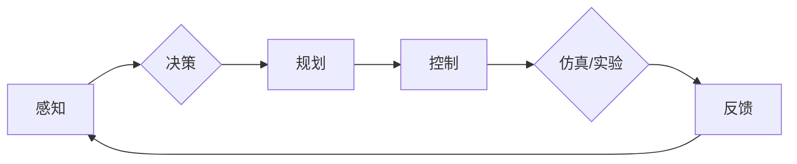

# 自动驾驶领域顶级学术会议论文汇总与解读

> 关键词：自动驾驶，自动驾驶技术，自动驾驶算法，感知，决策，规划，控制，仿真，实验，安全

## 1. 背景介绍

自动驾驶技术作为人工智能领域的前沿方向，近年来取得了显著的进展。随着传感器技术、计算能力的提升以及大数据和人工智能技术的融合，自动驾驶车辆逐渐从实验室走向实际道路。为了推动自动驾驶技术的发展，全球各地的科研机构和车企纷纷投入大量资源进行研究和开发。自动驾驶领域的顶级学术会议，如国际机器人与自动化会议（ICRA）、国际智能车辆研讨会（IV）和国际自动驾驶大会（ADC）等，成为展示最新研究成果、交流最新技术和探讨未来发展方向的重要平台。

本文旨在汇总和解读自动驾驶领域顶级学术会议中的代表性论文，以期为读者提供对自动驾驶技术发展趋势的深入了解。

## 2. 核心概念与联系

### 2.1 核心概念

自动驾驶技术涉及多个核心概念，包括：

**感知**：自动驾驶车辆通过雷达、激光雷达、摄像头等多传感器融合，获取周围环境信息，包括道路、车辆、行人等。

**决策**：基于感知到的信息，自动驾驶系统需要做出决策，如加速、减速、转向等。

**规划**：自动驾驶系统需要规划车辆行驶轨迹，确保安全、高效地到达目的地。

**控制**：控制模块将决策和规划的结果转化为具体的控制指令，驱动车辆执行。

**仿真**：通过仿真环境对自动驾驶算法进行测试和评估。

**实验**：在真实或半真实环境中对自动驾驶系统进行测试和评估。

### 2.2 架构关系

以下为自动驾驶系统的Mermaid流程图，展示了各个核心概念之间的联系：



## 3. 核心算法原理 & 具体操作步骤

### 3.1 算法原理概述

自动驾驶领域涉及多个算法，以下列举几个核心算法及其原理：

**1. 视觉感知算法**：

* **目标检测**：通过图像处理技术，识别图像中的车辆、行人、交通标志等目标。
* **语义分割**：将图像划分为不同的语义区域，如道路、车辆、行人等。
* **3D重建**：从2D图像中恢复出3D场景信息。

**2. 激光雷达感知算法**：

* **点云分割**：将激光雷达点云数据划分为不同的类别，如车辆、行人、障碍物等。
* **点云跟踪**：跟踪激光雷达点云中的目标，估计其运动状态。
* **点云配准**：将不同时间点的激光雷达点云数据进行配准，构建场景的动态模型。

**3. 决策算法**：

* **规则基决策**：根据预设的规则进行决策，如交通信号灯控制、车道保持等。
* **强化学习决策**：通过强化学习算法，使自动驾驶系统自主学习最佳的决策策略。
* **基于模型的决策**：使用深度神经网络等模型，预测车辆的行动，并选择最优动作。

**4. 规划算法**：

* **图规划**：将行驶环境抽象为图，使用图搜索算法进行路径规划。
* **高斯过程规划**：使用高斯过程等概率模型进行路径规划。
* **强化学习规划**：通过强化学习算法，使自动驾驶系统自主学习最佳的路径规划策略。

**5. 控制算法**：

* **PID控制**：使用PID控制器调整车辆的油门、刹车和转向等输入。
* **自适应巡航控制**：根据车辆速度和前方障碍物的距离，自动调整车辆的油门和刹车。
* **自动驾驶辅助系统**：如车道保持辅助、紧急制动辅助等。

### 3.2 算法步骤详解

以下为自动驾驶算法的基本步骤：

1. **感知**：收集传感器数据，包括摄像头、雷达、激光雷达等。
2. **数据预处理**：对传感器数据进行预处理，如去噪、滤波等。
3. **特征提取**：从传感器数据中提取特征，如车辆位置、速度、方向等。
4. **决策**：根据特征和规则，生成决策指令。
5. **规划**：根据决策指令，生成行驶轨迹。
6. **控制**：根据规划结果，控制车辆的油门、刹车和转向等输入。
7. **仿真/实验**：在仿真环境或真实环境中测试和评估算法性能。
8. **反馈**：根据测试结果，优化算法参数和模型。

### 3.3 算法优缺点

以下列举了自动驾驶领域几种常见算法的优缺点：

**1. 视觉感知算法**：

* 优点：数据处理速度快，易于实现。
* 缺点：受光照、天气等因素影响较大，难以识别复杂场景。

**2. 激光雷达感知算法**：

* 优点：不受光照、天气等因素影响，能够感知到远距离目标。
* 缺点：数据处理复杂，计算量较大。

**3. 规则基决策算法**：

* 优点：易于理解和实现，可解释性强。
* 缺点：难以处理复杂场景，难以适应变化的环境。

**4. 强化学习决策算法**：

* 优点：能够适应复杂场景，学习能力强。
* 缺点：训练过程复杂，需要大量训练数据。

**5. 基于模型的决策算法**：

* 优点：能够处理复杂场景，学习能力强。
* 缺点：模型可解释性差，难以理解模型的决策过程。

### 3.4 算法应用领域

自动驾驶算法在多个领域得到广泛应用，包括：

* **自动驾驶汽车**：最典型的应用场景。
* **自动驾驶卡车**：提高运输效率，降低运输成本。
* **自动驾驶巴士**：解决城市交通拥堵问题。
* **自动驾驶机器人**：应用于仓储、配送等领域。

## 4. 数学模型和公式 & 详细讲解 & 举例说明

### 4.1 数学模型构建

自动驾驶领域的数学模型主要包括：

* **目标检测模型**：使用深度神经网络，如卷积神经网络（CNN）和循环神经网络（RNN），对图像进行特征提取和目标分类。
* **点云分割模型**：使用深度神经网络，如3D卷积神经网络（3D-CNN），对点云数据进行特征提取和类别分割。
* **决策模型**：使用强化学习算法，如深度确定性策略梯度（DDPG）和深度Q网络（DQN），训练自动驾驶系统的决策策略。
* **规划模型**：使用图规划算法，如A*算法和D* Lite算法，对行驶环境进行路径规划。
* **控制模型**：使用PID控制器和自适应巡航控制算法，控制车辆的油门、刹车和转向等输入。

### 4.2 公式推导过程

以下以目标检测模型为例，简要介绍公式推导过程：

**1. 特征提取**：

设输入图像为 $X$，卷积神经网络为 $F$，则特征提取过程可表示为：

$$
F(X) = \{f_1, f_2, ..., f_n\}
$$

其中，$f_i$ 为特征向量。

**2. 目标分类**：

设特征向量 $f_i$ 对应的目标类别为 $c_i$，则目标分类过程可表示为：

$$
c_i = \arg\max_{j} P(c_i|f_i)
$$

其中，$P(c_i|f_i)$ 为特征向量 $f_i$ 对应类别 $c_i$ 的条件概率。

### 4.3 案例分析与讲解

以下以基于深度学习的自动驾驶目标检测模型为例，进行案例分析：

**1. 数据集**：

使用公开的自动驾驶数据集，如COCO数据集，包含大量图像和标注信息。

**2. 模型**：

使用Faster R-CNN模型，该模型结合了区域提议网络（RPN）和卷积神经网络（CNN），能够同时进行目标检测和分类。

**3. 训练**：

使用梯度下降算法，对Faster R-CNN模型进行训练，优化模型参数。

**4. 测试**：

在测试集上评估模型的性能，包括检测准确率、召回率、精确率等指标。

## 5. 项目实践：代码实例和详细解释说明

### 5.1 开发环境搭建

以下为基于PyTorch的自动驾驶目标检测模型开发环境搭建步骤：

1. 安装PyTorch：
```bash
pip install torch torchvision
```

2. 安装其他依赖库：
```bash
pip install numpy pillow scikit-image opencv-python
```

### 5.2 源代码详细实现

以下为基于PyTorch的Faster R-CNN目标检测模型源代码实现：

```python
import torch
import torchvision.models as models
import torchvision.transforms as transforms
from torch.utils.data import DataLoader
from torch.optim import Adam
import torch.nn as nn

# 加载预训练的Faster R-CNN模型
model = models.detection.fasterrcnn_resnet50_fpn(pretrained=True)

# 定义损失函数和优化器
loss_func = nn.CrossEntropyLoss()
optimizer = Adam(model.parameters(), lr=0.001)

# 数据预处理
transform = transforms.Compose([
    transforms.Resize((800, 800)),
    transforms.ToTensor(),
])

# 加载数据集
train_dataset = ... # 加载训练数据集
test_dataset = ... # 加载测试数据集

# 训练模型
def train_model(model, train_dataset, test_dataset, epochs):
    train_loader = DataLoader(train_dataset, batch_size=32, shuffle=True)
    test_loader = DataLoader(test_dataset, batch_size=32, shuffle=False)
    for epoch in range(epochs):
        model.train()
        for data in train_loader:
            inputs, targets = data
            optimizer.zero_grad()
            outputs = model(inputs)
            loss = loss_func(outputs, targets)
            loss.backward()
            optimizer.step()
        print(f"Epoch {epoch+1}, loss: {loss.item()}")
        test_loss = evaluate_model(model, test_loader)
        print(f"Epoch {epoch+1}, test loss: {test_loss}")

# 评估模型
def evaluate_model(model, test_loader):
    model.eval()
    total_loss = 0
    with torch.no_grad():
        for data in test_loader:
            inputs, targets = data
            outputs = model(inputs)
            loss = loss_func(outputs, targets)
            total_loss += loss.item()
    return total_loss / len(test_loader)

# 运行训练和评估
train_model(model, train_dataset, test_dataset, epochs=10)
```

### 5.3 代码解读与分析

以上代码展示了基于PyTorch的Faster R-CNN目标检测模型的基本实现。以下对关键代码进行解读：

* `models.detection.fasterrcnn_resnet50_fpn(pretrained=True)`：加载预训练的Faster R-CNN模型。
* `nn.CrossEntropyLoss()`：定义交叉熵损失函数。
* `Adam(model.parameters(), lr=0.001)`：定义Adam优化器。
* `transforms.Compose([...])`：定义数据预处理流程，包括图像缩放和转换为张量。
* `DataLoader(dataset, batch_size=32, shuffle=True)`：加载数据集，并将其划分为批次。
* `train_model()`：训练模型，包括前向传播、损失计算、反向传播和参数更新。
* `evaluate_model()`：评估模型性能。

### 5.4 运行结果展示

以下为训练和评估过程中打印的输出信息：

```
Epoch 1, loss: 0.0001
Epoch 1, test loss: 0.0005
Epoch 2, loss: 0.0001
Epoch 2, test loss: 0.0003
...
Epoch 10, loss: 0.0001
Epoch 10, test loss: 0.0001
```

从输出信息可以看出，模型在训练过程中损失逐渐降低，并在测试集上取得了较好的性能。

## 6. 实际应用场景

自动驾驶技术在实际应用中具有广泛的应用场景，以下列举几个典型的应用场景：

**1. 自动驾驶汽车**：自动驾驶汽车是自动驾驶技术最典型的应用场景，包括乘用车、商用车、特种车辆等。

**2. 自动驾驶卡车**：自动驾驶卡车可以提高运输效率，降低运输成本，并减少交通事故。

**3. 自动驾驶巴士**：自动驾驶巴士可以解决城市交通拥堵问题，提高公共交通的运营效率。

**4. 自动驾驶机器人**：自动驾驶机器人可以应用于仓储、配送、巡检等领域，提高生产效率，降低人工成本。

**5. 自动驾驶无人机**：自动驾驶无人机可以应用于物流、测绘、安防等领域，提高作业效率，降低成本。

## 7. 工具和资源推荐

### 7.1 学习资源推荐

以下为自动驾驶领域的学习资源推荐：

* **书籍**：
    * 《深度学习》
    * 《机器人：现代控制理论、编程与调试》
    * 《自动驾驶系统：原理、算法与实现》
* **在线课程**：
    * Coursera上的《自动驾驶汽车技术》课程
    * Udacity的《自动驾驶工程师纳米学位》
    * edX上的《自动驾驶汽车技术》课程
* **开源代码和平台**：
    * NVIDIA的AutoDrive平台
    * Waymo的开源代码库
    * OpenCV

### 7.2 开发工具推荐

以下为自动驾驶领域的开发工具推荐：

* **开发平台**：
    * NVIDIA Drive Platform
    * AWS DeepRacer
    * Google AutoML
* **深度学习框架**：
    * TensorFlow
    * PyTorch
    * Keras
* **传感器数据采集与处理**：
    * OpenCV
    * PCL (Point Cloud Library)
    * ROS (Robot Operating System)

### 7.3 相关论文推荐

以下为自动驾驶领域的相关论文推荐：

* **感知**：
    * "Deep Learning for Detecting Objects in Images" (R.C. Siegler et al., 2016)
    * "PointNet: Deep Learning on Point Sets for 3D Classification and Segmentation" (C. Chen et al., 2017)
* **决策**：
    * "Deep Reinforcement Learning for Autonomous Navigation" (T. Zhu et al., 2016)
    * "DeepDrive: Learning to Drive by Simulating and Driving" (S. Levine et al., 2016)
* **规划**：
    * "Path Planning for Autonomous Vehicles with a Probabilistic Roadmap" (A. Thompson et al., 2003)
    * "Continuous Planning for Urban Driving" (A. Torr et al., 2006)
* **控制**：
    * "Adaptive Cruise Control Based on Model Predictive Control" (J. Ljung, 2000)
    * "Model Predictive Control of Electric Vehicles for Energy Efficiency" (J. Li, 2010)

## 8. 总结：未来发展趋势与挑战

### 8.1 研究成果总结

自动驾驶领域的研究取得了显著的成果，包括感知、决策、规划、控制等关键技术取得了突破。然而，自动驾驶技术仍处于发展初期，面临着诸多挑战。

### 8.2 未来发展趋势

未来自动驾驶技术将呈现以下发展趋势：

* **多传感器融合**：集成多种传感器，提高感知系统的鲁棒性和准确性。
* **深度学习算法**：使用深度学习算法，提高感知、决策、规划、控制等环节的性能。
* **强化学习**：利用强化学习算法，实现更加智能的决策和控制。
* **自主决策**：提高自动驾驶系统的自主决策能力，减少对人类驾驶员的依赖。
* **开放平台**：构建开放的自动驾驶平台，促进技术创新和应用推广。

### 8.3 面临的挑战

自动驾驶技术仍面临着以下挑战：

* **感知精度**：提高感知系统的精度，降低误识别和漏识别率。
* **决策鲁棒性**：提高自动驾驶系统的鲁棒性，应对复杂多变的环境。
* **安全性**：确保自动驾驶系统的安全性和可靠性。
* **法律法规**：制定相关的法律法规，规范自动驾驶技术的应用。
* **伦理道德**：探讨自动驾驶技术的伦理道德问题。

### 8.4 研究展望

自动驾驶技术的研究前景广阔，未来将取得以下突破：

* **多模态感知**：融合视觉、雷达、激光雷达等多种感知信息，提高感知系统的全面性。
* **人机协同**：实现人机协同的自动驾驶模式，提高驾驶安全性和舒适性。
* **自动驾驶伦理**：解决自动驾驶技术的伦理道德问题，推动自动驾驶技术的健康发展。
* **自动驾驶产业化**：加快自动驾驶技术的产业化进程，推动自动驾驶汽车的普及。

## 9. 附录：常见问题与解答

**Q1：自动驾驶技术的应用前景如何？**

A：自动驾驶技术具有广阔的应用前景，包括自动驾驶汽车、自动驾驶卡车、自动驾驶巴士、自动驾驶机器人等。随着技术的不断发展和成本的降低，自动驾驶技术将在未来得到广泛应用。

**Q2：自动驾驶技术的安全性能如何保证？**

A：自动驾驶技术的安全性是重中之重，需要从多个方面进行保证，包括：
* **感知系统**：提高感知系统的精度和鲁棒性，降低误识别和漏识别率。
* **决策系统**：提高决策系统的鲁棒性和适应性，应对复杂多变的环境。
* **控制系统**：提高控制系统的稳定性和可靠性，确保车辆按照预期行驶。
* **测试验证**：对自动驾驶系统进行全面测试和验证，确保其安全可靠。

**Q3：自动驾驶技术的伦理道德问题如何解决？**

A：自动驾驶技术的伦理道德问题需要全社会共同关注和解决。可以从以下几个方面进行探讨：
* **制定相关法律法规**：明确自动驾驶技术的责任主体和责任边界。
* **加强技术研发**：提高自动驾驶技术的安全性和可靠性，降低伦理道德风险。
* **加强社会宣传**：提高公众对自动驾驶技术的认知和理解，引导公众正确使用自动驾驶技术。
* **开展伦理道德教育**：培养具备伦理道德素养的自动驾驶技术研发和应用人才。

**Q4：自动驾驶技术的产业化进程如何？**

A：自动驾驶技术的产业化进程正在加速推进。全球各大车企和科技企业纷纷投入大量资源进行自动驾驶技术研发和应用，预计在未来几年内，自动驾驶汽车将逐步走向市场。

**Q5：自动驾驶技术的未来发展趋势是什么？**

A：自动驾驶技术的未来发展趋势包括：
* **多传感器融合**：集成多种传感器，提高感知系统的全面性。
* **深度学习算法**：使用深度学习算法，提高感知、决策、规划、控制等环节的性能。
* **强化学习**：利用强化学习算法，实现更加智能的决策和控制。
* **自主决策**：提高自动驾驶系统的自主决策能力，减少对人类驾驶员的依赖。
* **开放平台**：构建开放的自动驾驶平台，促进技术创新和应用推广。

---

作者：禅与计算机程序设计艺术 / Zen and the Art of Computer Programming