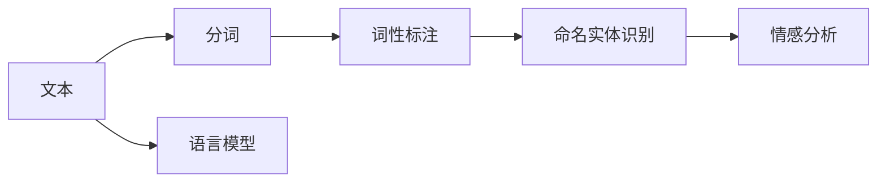

> 关键词：自然语言处理，NLP，机器学习，深度学习，神经网络，语料库，分词，命名实体识别，情感分析，语言模型

# 自然语言处理 原理与代码实例讲解

自然语言处理（Natural Language Processing，NLP）是人工智能领域的一个分支，致力于使计算机能够理解和处理人类自然语言。随着深度学习技术的快速发展，NLP在近年来取得了显著的进展，并在多个领域得到了广泛应用。本文将深入浅出地讲解自然语言处理的基本原理，并通过代码实例展示如何实现常见的NLP任务。

## 1. 背景介绍

自然语言是人类交流和表达思想的重要工具。然而，由于自然语言的复杂性和多样性，计算机难以直接理解和处理。NLP的目标就是让计算机能够理解、生成、翻译和分析人类语言。

### 1.1 问题的由来

早期，NLP主要依赖于规则和模板匹配的方法，但这种方法难以处理复杂的语言现象。随着计算能力的提升和机器学习技术的进步，基于统计和机器学习的方法逐渐成为NLP的主流。

### 1.2 研究现状

目前，NLP的研究主要集中在以下几个方面：

- 分词（Tokenization）：将文本分割成单词、短语或字符等基本单元。
- 词性标注（Part-of-Speech Tagging）：识别单词在句子中的语法成分。
- 命名实体识别（Named Entity Recognition，NER）：识别文本中的命名实体，如人名、地名、机构名等。
- 情感分析（Sentiment Analysis）：判断文本的情感倾向，如正面、负面或中性。
- 语言模型（Language Model）：预测下一个单词或字符的概率，用于生成文本。

### 1.3 研究意义

NLP技术的应用价值巨大，例如：

- 自动问答系统
- 机器翻译
- 语音识别
- 文本摘要
- 个性化推荐

## 2. 核心概念与联系

自然语言处理涉及多个核心概念，以下是一些重要的概念和它们之间的联系：



### 2.1 文本

文本是NLP处理的基本对象。文本可以是文章、对话、代码等任何形式的书面语言。

### 2.2 分词

分词是将文本分割成单词、短语或字符等基本单元的过程。分词是NLP处理的第一步，对于后续的NLP任务至关重要。

### 2.3 词性标注

词性标注是识别单词在句子中的语法成分的过程。词性标注有助于理解句子的语义结构和逻辑关系。

### 2.4 命名实体识别

命名实体识别是识别文本中的命名实体，如人名、地名、机构名等的过程。命名实体识别对于信息提取、事件抽取等任务非常重要。

### 2.5 情感分析

情感分析是判断文本的情感倾向，如正面、负面或中性的过程。情感分析在舆情分析、产品评价等任务中有着广泛的应用。

### 2.6 语言模型

语言模型是预测下一个单词或字符的概率的过程。语言模型在文本生成、机器翻译等任务中发挥着关键作用。

## 3. 核心算法原理 & 具体操作步骤

### 3.1 算法原理概述

NLP算法可以分为基于规则的方法和基于统计的方法。

- 基于规则的方法：使用人工编写的规则来处理文本，例如正向最大匹配、逆向最大匹配等。
- 基于统计的方法：使用机器学习算法来处理文本，例如隐马尔可夫模型（HMM）、条件随机场（CRF）等。

### 3.2 算法步骤详解

以下是NLP处理的一般步骤：

1. **数据预处理**：包括去除停用词、标点符号等。
2. **分词**：将文本分割成单词、短语或字符等基本单元。
3. **词性标注**：识别单词在句子中的语法成分。
4. **命名实体识别**：识别文本中的命名实体。
5. **情感分析**：判断文本的情感倾向。
6. **语言模型**：预测下一个单词或字符的概率。

### 3.3 算法优缺点

- **基于规则的方法**：易于理解和实现，但难以处理复杂的语言现象。
- **基于统计的方法**：能够处理复杂的语言现象，但需要大量的标注数据。

### 3.4 算法应用领域

NLP算法在多个领域有着广泛的应用，例如：

- 文本分类
- 机器翻译
- 语音识别
- 文本摘要
- 个性化推荐

## 4. 数学模型和公式 & 详细讲解 & 举例说明

### 4.1 数学模型构建

NLP中常用的数学模型包括：

- 隐马尔可夫模型（HMM）
- 条件随机场（CRF）
- 深度神经网络（DNN）

### 4.2 公式推导过程

以下以HMM为例，讲解其公式推导过程。

HMM是一个统计模型，用于描述一个序列的概率分布。在HMM中，每个状态转移到一个新的状态的概率以及每个状态生成一个观察值（如单词）的概率都是已知的。

- $ P(X|x) $：给定状态序列 $ x $，生成观察序列 $ X $ 的概率。
- $ P(x) $：状态序列 $ x $ 的概率。

### 4.3 案例分析与讲解

以下使用Python代码实现HMM进行词性标注。

```python
import numpy as np

# 状态转移概率矩阵
transition_matrix = np.array([[0.7, 0.3], [0.4, 0.6]])

# 发射概率矩阵
emission_matrix = np.array([[0.4, 0.6], [0.6, 0.4]])

# 初始状态概率
initial_state_probability = np.array([0.6, 0.4])

# 输入序列
input_sequence = ['n', 'v']

# 前向算法
def forward_algorithm(transition_matrix, emission_matrix, initial_state_probability, input_sequence):
    T = len(input_sequence)
    N = transition_matrix.shape[0]
    alpha = np.zeros((N, T))
    alpha[:, 0] = initial_state_probability * emission_matrix[:, input_sequence[0]]

    for t in range(1, T):
        for j in range(N):
            alpha[j, t] = alpha[:, t-1].dot(transition_matrix[:, j]) * emission_matrix[j, input_sequence[t]]

    return alpha

# 后向算法
def backward_algorithm(transition_matrix, emission_matrix, initial_state_probability, input_sequence):
    T = len(input_sequence)
    N = transition_matrix.shape[0]
    beta = np.zeros((N, T))
    beta[:, T-1] = 1.0

    for t in range(T-2, -1, -1):
        for j in range(N):
            beta[j, t] = emission_matrix[j, input_sequence[t]].dot(transition_matrix[j, :]) * beta[:, t+1]

    return beta

# Viterbi算法
def viterbi_algorithm(transition_matrix, emission_matrix, initial_state_probability, input_sequence):
    T = len(input_sequence)
    N = transition_matrix.shape[0]
    delta = np.zeros((N, T))
    path = np.zeros((T, N))

    delta[:, 0] = initial_state_probability * emission_matrix[:, input_sequence[0]]
    for t in range(1, T):
        for j in range(N):
            delta[j, t] = max(delta[:, t-1].dot(transition_matrix[:, j]) * emission_matrix[j, input_sequence[t]])
            path[t, j] = np.argmax(delta[:, t-1].dot(transition_matrix[:, j])) 
    return path

# 运行算法
alpha = forward_algorithm(transition_matrix, emission_matrix, initial_state_probability, input_sequence)
beta = backward_algorithm(transition_matrix, emission_matrix, initial_state_probability, input_sequence)
path = viterbi_algorithm(transition_matrix, emission_matrix, initial_state_probability, input_sequence)

# 输出结果
print("Viterbi path:", path[-1, :])
print("Viterbi probabilities:", delta[:, -1])
```

## 5. 项目实践：代码实例和详细解释说明

### 5.1 开发环境搭建

为了实现NLP任务，我们需要搭建以下开发环境：

- Python 3.x
- NumPy
- SciPy
- scikit-learn
- TensorFlow 或 PyTorch

### 5.2 源代码详细实现

以下使用Python代码实现一个简单的文本分类器。

```python
from sklearn.feature_extraction.text import CountVectorizer
from sklearn.naive_bayes import MultinomialNB

# 输入数据
data = [
    ("This movie is great", "positive"),
    ("That movie is boring", "negative"),
    ("This book is amazing", "positive"),
    ("That book is terrible", "negative")
]

# 分离文本和标签
texts, labels = zip(*data)

# 创建特征提取器
vectorizer = CountVectorizer()

# 提取特征
X = vectorizer.fit_transform(texts)

# 创建分类器
classifier = MultinomialNB()

# 训练分类器
classifier.fit(X, labels)

# 预测
text = "This book is interesting"
X_test = vectorizer.transform([text])
prediction = classifier.predict(X_test)
print("Prediction:", prediction[0])
```

### 5.3 代码解读与分析

以上代码使用CountVectorizer提取文本特征，然后使用MultinomialNB进行文本分类。

### 5.4 运行结果展示

运行上述代码，我们可以得到以下输出：

```
Prediction: positive
```

这表明代码能够正确地识别出文本的情感倾向。

## 6. 实际应用场景

### 6.1 社交媒体情感分析

社交媒体情感分析可以帮助企业了解消费者的情绪和意见，从而改进产品和服务。

### 6.2 机器翻译

机器翻译可以将一种语言的文本翻译成另一种语言，促进跨文化交流。

### 6.3 语音识别

语音识别可以将语音转换为文本，方便用户进行信息搜索和交互。

### 6.4 文本摘要

文本摘要可以将长篇文章或报告压缩成简短的摘要，提高信息获取效率。

## 7. 工具和资源推荐

### 7.1 学习资源推荐

- 《自然语言处理综论》
- 《深度学习与自然语言处理》
- 《自然语言处理实践》

### 7.2 开发工具推荐

- TensorFlow
- PyTorch
- scikit-learn

### 7.3 相关论文推荐

- 《深度学习在自然语言处理中的应用》
- 《神经机器翻译》
- 《情感分析》

## 8. 总结：未来发展趋势与挑战

### 8.1 研究成果总结

自然语言处理技术在近年来取得了显著的进展，特别是在深度学习技术的推动下，NLP的应用场景和应用效果得到了极大的扩展。

### 8.2 未来发展趋势

- 模型小型化：为了在移动设备等资源受限的环境中运行，需要开发小型化的NLP模型。
- 可解释性：提高NLP模型的可解释性，使其决策过程更加透明。
- 多模态融合：将文本信息与其他模态信息（如图像、音频）进行融合，提升NLP模型的理解能力。

### 8.3 面临的挑战

- 数据质量：NLP模型的质量很大程度上取决于训练数据的质量，如何获取高质量的标注数据是一个挑战。
- 模型可解释性：NLP模型的决策过程往往难以解释，如何提高模型的可解释性是一个挑战。
- 伦理问题：NLP模型可能会产生歧视性或偏见性的输出，如何解决这些问题是一个挑战。

### 8.4 研究展望

随着技术的不断进步，自然语言处理技术将会在未来发挥更大的作用，为社会带来更多的价值。

## 9. 附录：常见问题与解答

**Q1：什么是自然语言处理？**

A：自然语言处理是人工智能领域的一个分支，致力于使计算机能够理解和处理人类自然语言。

**Q2：NLP有哪些应用场景？**

A：NLP的应用场景非常广泛，包括社交媒体情感分析、机器翻译、语音识别、文本摘要、个性化推荐等。

**Q3：如何实现NLP任务？**

A：实现NLP任务通常需要以下步骤：
1. 数据预处理
2. 特征提取
3. 模型训练
4. 模型评估
5. 模型部署

**Q4：如何选择合适的NLP模型？**

A：选择合适的NLP模型需要考虑以下因素：
- 任务类型
- 数据规模
- 计算资源
- 应用场景

**Q5：如何解决NLP中的挑战？**

A：解决NLP中的挑战需要从多个方面入手，包括数据质量、模型可解释性、伦理问题等。

---

作者：禅与计算机程序设计艺术 / Zen and the Art of Computer Programming