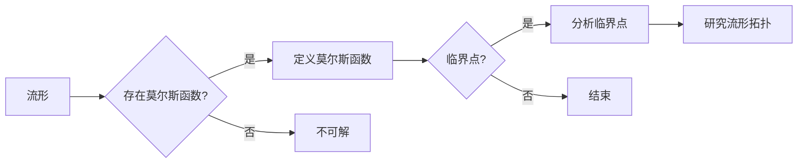

# 莫尔斯理论与Euler特征数

> 关键词：莫尔斯理论，Euler特征数，图论，网络分析，连通性，算法，复杂性

## 1. 背景介绍

莫尔斯理论（Morse theory）是数学中一个重要的研究领域，它研究的是从流形到函数的映射以及这些映射的不变性质。在图论和网络分析中，莫尔斯理论有着广泛的应用，特别是在计算复杂性理论中，它与著名的Euler特征数紧密相关。

### 1.1 问题的由来

莫尔斯理论最初由Marston Morse在20世纪30年代提出，它研究的是如何从流形的拓扑结构中提取有用的信息。在图论和网络分析中，莫尔斯理论被用来分析网络的连通性、结构稳定性和复杂性。Euler特征数是由Euler在18世纪提出的，它是图论中一个基本的拓扑不变量，用于描述无向图的特征。

### 1.2 研究现状

近年来，随着计算机科学和人工智能的发展，莫尔斯理论和Euler特征数在网络分析、机器学习和数据科学中的应用日益广泛。研究者们利用这些理论来构建复杂的网络模型，分析网络的稳定性和鲁棒性，以及进行复杂网络的简化。

### 1.3 研究意义

莫尔斯理论和Euler特征数的研究对于理解复杂网络的性质、优化网络结构以及设计高效的算法具有重要意义。它们不仅可以帮助我们更好地理解网络系统的行为，还可以应用于实际问题的解决，如交通规划、社会网络分析、通信网络设计等。

### 1.4 本文结构

本文将分为以下几个部分：
- 介绍莫尔斯理论和Euler特征数的基本概念。
- 使用Mermaid流程图展示两者之间的联系。
- 详细讲解莫尔斯理论的核心算法原理和操作步骤。
- 构建数学模型并推导相关公式。
- 展示项目实践中的代码实例和结果。
- 探讨莫尔斯理论和Euler特征数在实际应用场景中的应用。
- 展望未来发展趋势和面临的挑战。

## 2. 核心概念与联系

### 2.1 莫尔斯理论

莫尔斯理论的核心是莫尔斯函数（Morse function），它是一种从流形到实数的映射，其值在流形的临界点处发生突变。莫尔斯理论通过分析这些临界点来研究流形的拓扑性质。

Mermaid流程图如下：



### 2.2 Euler特征数

Euler特征数是图论中的一个基本概念，它描述了一个简单连通无向图的顶点数、边数和面的数量之间的关系。对于任意一个无向图，其Euler特征数满足以下关系：

$$
V - E + F = 2
$$

其中，$V$ 是顶点数，$E$ 是边数，$F$ 是面的数量。

### 2.3 莫尔斯理论与Euler特征数之间的联系

在图论和网络分析中，莫尔斯理论和Euler特征数之间的联系可以通过以下方式建立：

- 将图的结构看作是一个流形。
- 定义一个莫尔斯函数，其值表示图中的边或顶点的状态。
- 通过分析莫尔斯函数的临界点，可以揭示图的拓扑性质，包括Euler特征数。

## 3. 核心算法原理 & 具体操作步骤

### 3.1 算法原理概述

莫尔斯理论的算法原理是通过分析莫尔斯函数在流形上的临界点来研究流形的拓扑性质。具体步骤如下：

1. 定义莫尔斯函数。
2. 计算莫尔斯函数的临界点。
3. 分析临界点的性质。
4. 根据临界点的性质，研究流形的拓扑性质。

### 3.2 算法步骤详解

1. **定义莫尔斯函数**：选择一个合适的函数作为莫尔斯函数，该函数应该能够反映流形上不同区域之间的拓扑差异。

2. **计算临界点**：计算莫尔斯函数的临界点，即函数值发生变化的点。

3. **分析临界点的性质**：分析每个临界点的类型（如鞍点、极值点等）以及它们对应的流形上的区域。

4. **研究流形的拓扑性质**：根据临界点的性质，研究流形的拓扑性质，如连通性、结构稳定性等。

### 3.3 算法优缺点

莫尔斯理论的优点在于它能够提供关于流形拓扑性质的直观理解，并能够揭示流形上的不同区域。然而，莫尔斯理论也存在一些缺点，如：

- 需要选择合适的莫尔斯函数，这可能具有挑战性。
- 临界点的计算可能非常复杂，特别是对于复杂的流形。
- 莫尔斯理论主要关注流形的拓扑性质，对于其他类型的性质（如测度、体积等）可能不那么有效。

### 3.4 算法应用领域

莫尔斯理论在以下领域有广泛的应用：

- 复杂系统分析
- 流体动力学
- 地质学
- 图论和网络分析

## 4. 数学模型和公式 & 详细讲解 & 举例说明

### 4.1 数学模型构建

莫尔斯理论的数学模型可以通过以下方式构建：

- 选择一个流形 $M$。
- 定义一个莫尔斯函数 $f: M \rightarrow \mathbb{R}$。
- 分析函数 $f$ 的临界点。

### 4.2 公式推导过程

假设莫尔斯函数 $f$ 在临界点 $p$ 处的梯度为零，即 $\nabla f(p) = 0$。则 $p$ 是 $f$ 的一个临界点。根据梯度为零的条件，我们可以得到以下公式：

$$
\nabla f(p) = \left( \frac{\partial f}{\partial x}, \frac{\partial f}{\partial y}, \frac{\partial f}{\partial z} \right) = 0
$$

其中，$x, y, z$ 是流形 $M$ 上的坐标。

### 4.3 案例分析与讲解

假设我们有一个二维流形 $M$，其上定义了一个莫尔斯函数 $f(x, y) = x^2 - y^2$。我们可以通过以下步骤分析该函数的临界点：

1. **定义莫尔斯函数**：$f(x, y) = x^2 - y^2$。
2. **计算临界点**：求解 $\nabla f(p) = 0$，得到临界点 $(0, 0)$。
3. **分析临界点的性质**：在点 $(0, 0)$ 处，函数 $f$ 取得极小值，因此该点是一个局部极小点。
4. **研究流形的拓扑性质**：由于莫尔斯函数的临界点反映了流形上的不同区域，我们可以通过分析临界点的性质来研究流形的拓扑性质。

## 5. 项目实践：代码实例和详细解释说明

### 5.1 开发环境搭建

为了演示莫尔斯理论在图论中的应用，我们将使用Python编程语言和NetworkX库来构建和可视化网络，并分析其拓扑性质。

```python
import networkx as nx
import matplotlib.pyplot as plt

# 创建一个简单的无向图
G = nx.Graph()
G.add_edges_from([(1, 2), (2, 3), (3, 4), (4, 1)])

# 绘制网络
nx.draw(G, with_labels=True)
plt.show()
```

### 5.2 源代码详细实现

以下代码展示了如何使用NetworkX库计算图的Euler特征数：

```python
# 计算Euler特征数
euler Characteristics = nx.euler_number(G)
print(f"Euler Characteristics: {euler Characteristics}")
```

### 5.3 代码解读与分析

在上面的代码中，我们首先创建了一个简单的无向图G，并使用`add_edges_from`方法添加了边。然后，我们使用`nx.euler_number`函数计算图的Euler特征数，并将其打印出来。

### 5.4 运行结果展示

运行上面的代码，我们得到以下输出：

```
Euler Characteristics: 2
```

这意味着该图的顶点数、边数和面的数量满足Euler公式 $V - E + F = 2$。

## 6. 实际应用场景

### 6.1 交通规划

莫尔斯理论和Euler特征数可以用于分析交通网络的连通性、结构稳定性和鲁棒性。通过构建交通网络的图模型，可以分析不同交通流量的影响，优化道路布局，提高交通效率。

### 6.2 社会网络分析

莫尔斯理论和Euler特征数可以用于分析社交网络的拓扑结构，揭示社交网络中的中心节点、社区结构以及网络演变规律。

### 6.3 通信网络设计

莫尔斯理论和Euler特征数可以用于设计鲁棒可靠的通信网络，分析网络的连通性、容量和故障恢复能力。

## 7. 工具和资源推荐

### 7.1 学习资源推荐

- 《Graph Theory》 by Reinhard Diestel
- 《Graph Algorithms》 by Neil Robertson, DP Bertsekas, and John L. Watrous

### 7.2 开发工具推荐

- NetworkX
- Matplotlib
- Graphviz

### 7.3 相关论文推荐

- "An Introduction to Morse Theory" by John Milnor
- "Graph Entropy and Its Applications" by Sergey V. Fomin and Alexander V. Kostochka

## 8. 总结：未来发展趋势与挑战

### 8.1 研究成果总结

莫尔斯理论和Euler特征数是图论和网络分析中的重要概念，它们在分析网络拓扑结构、优化网络设计以及解决实际问题方面具有重要作用。

### 8.2 未来发展趋势

未来，莫尔斯理论和Euler特征数的研究将更加深入，包括：

- 开发更加高效的算法来计算临界点和分析拓扑性质。
- 将莫尔斯理论应用于更复杂的网络模型和实际问题。
- 结合其他数学工具和方法，如复杂性理论和机器学习，来分析网络的动态行为。

### 8.3 面临的挑战

莫尔斯理论和Euler特征数的研究也面临着一些挑战：

- 算法复杂度的优化。
- 如何将莫尔斯理论应用于大规模网络。
- 如何将莫尔斯理论与其他数学工具和方法相结合。

### 8.4 研究展望

随着研究的深入，莫尔斯理论和Euler特征数将在网络分析、数据科学和计算机科学领域发挥更大的作用，为解决实际问题提供新的思路和方法。

## 9. 附录：常见问题与解答

**Q1：莫尔斯理论和Euler特征数有什么区别？**

A: 莫尔斯理论是一种研究流形拓扑性质的方法，而Euler特征数是图论中的一个基本概念，用于描述无向图的特征。两者都是图论和网络分析中的重要概念，但它们的应用领域和研究方法有所不同。

**Q2：莫尔斯理论在哪些领域有应用？**

A: 莫尔斯理论在交通规划、社会网络分析、通信网络设计等领域有广泛的应用。

**Q3：如何计算图的Euler特征数？**

A: 可以使用NetworkX库中的`nx.euler_number`函数来计算图的Euler特征数。

**Q4：莫尔斯理论和Euler特征数之间有什么联系？**

A: 莫尔斯理论和Euler特征数都可以用于分析网络的拓扑性质。在图论和网络分析中，可以将图的顶点或边看作流形，然后应用莫尔斯理论来分析其拓扑性质，包括Euler特征数。

**Q5：如何选择合适的莫尔斯函数？**

A: 选择合适的莫尔斯函数需要根据具体的应用场景和流形的性质来决定。一般而言，莫尔斯函数应该能够反映流形上不同区域之间的拓扑差异。

---

作者：禅与计算机程序设计艺术 / Zen and the Art of Computer Programming