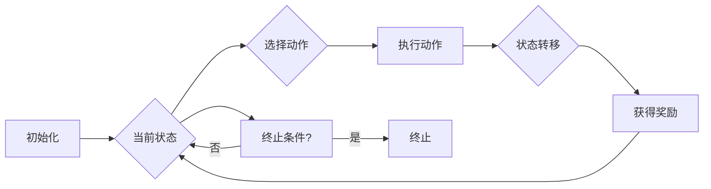

> 关键词：Agent 学习，规划机制，强化学习，马尔可夫决策过程，Q-learning，策略梯度，规划算法

## 1. 背景介绍

随着人工智能技术的不断发展，Agent 学习作为一种智能体在动态环境中学习如何实现目标的方法，已经成为了人工智能研究的热点。Agent 学习的核心目标是通过与环境的交互，使智能体能够自主地学习和适应环境，最终实现其任务目标。在 Agent 学习中，规划机制作为一种重要的决策策略，被广泛应用于路径规划、资源分配、游戏策略等领域。

## 2. 核心概念与联系

### 2.1 核心概念

#### 2.1.1 Agent 学习

Agent 学习是指智能体通过与环境的交互，通过学习来自适应环境，并最终实现其目标的过程。在 Agent 学习中，智能体被视为一个决策者，它通过选择动作来与环境交互，并根据环境的反馈来调整其策略。

#### 2.1.2 规划机制

规划机制是指智能体在执行任务时，根据当前状态和目标状态，制定一系列动作的序列，以实现从当前状态到目标状态的转变。

#### 2.1.3 马尔可夫决策过程

马尔可夫决策过程（MDP）是一种描述Agent学习环境的数学模型。在 MDP 中，智能体在每一个时间步面对一系列可选的动作，每个动作都会导致一个状态转移和一个奖励。

#### 2.1.4 强化学习

强化学习是一种 Agent 学习方法，它通过最大化累积奖励来指导智能体的决策。

### 2.2 架构流程图

以下是一个简单的 Mermaid 流程图，展示了 Agent 学习中的规划机制：



## 3. 核心算法原理 & 具体操作步骤

### 3.1 算法原理概述

#### 3.1.1 Q-learning

Q-learning 是一种基于值函数的强化学习方法，它通过学习 Q 函数来指导智能体的动作选择。Q 函数表示在给定状态下，执行某个动作所能获得的期望奖励。

#### 3.1.2 策略梯度

策略梯度是一种直接优化策略的方法，它通过学习策略参数来直接最大化累积奖励。

### 3.2 算法步骤详解

#### 3.2.1 Q-learning

1. 初始化 Q 函数。
2. 选择动作。
3. 执行动作。
4. 获得奖励。
5. 更新 Q 函数。
6. 重复步骤 2-5，直到达到终止条件。

#### 3.2.2 策略梯度

1. 初始化策略参数。
2. 使用策略选择动作。
3. 执行动作。
4. 获得奖励。
5. 计算梯度。
6. 更新策略参数。
7. 重复步骤 2-6，直到达到终止条件。

### 3.3 算法优缺点

#### 3.3.1 Q-learning

**优点**：

- 理论基础扎实，易于理解。
- 能够处理连续动作空间。
- 可以通过探索-利用策略来避免陷入局部最优。

**缺点**：

- 训练时间较长，尤其是对于高维状态空间。
- 需要大量的样本数据。

#### 3.3.2 策略梯度

**优点**：

- 训练速度较快。
- 能够直接优化策略参数。

**缺点**：

- 对初始策略参数敏感。
- 需要处理策略参数空间的高维性。

### 3.4 算法应用领域

Q-learning 和策略梯度在以下领域有广泛的应用：

- 路径规划
- 资源分配
- 游戏策略
- 推荐系统
- 机器人控制

## 4. 数学模型和公式 & 详细讲解 & 举例说明

### 4.1 数学模型构建

#### 4.1.1 Q-learning

Q-learning 中的 Q 函数定义为：

$$
Q(s, a) = \sum_{s' \in S} P(s' | s, a) \times [R(s, a, s') + \gamma \max_{a' \in A} Q(s', a')
$$

其中，$S$ 是状态空间，$A$ 是动作空间，$R(s, a, s')$ 是在状态 $s$ 下执行动作 $a$ 后转移到状态 $s'$ 所获得的奖励，$\gamma$ 是折扣因子。

#### 4.1.2 策略梯度

策略梯度中的策略参数 $\theta$ 定义为：

$$
\theta^* = \mathop{\arg\max}_{\theta} J(\theta) = \mathop{\arg\max}_{\theta} \sum_{i=1}^N [R(s_i, a_i) - \log \pi(a_i; \theta)]
$$

其中，$J(\theta)$ 是策略的损失函数，$\pi(a_i; \theta)$ 是策略参数 $\theta$ 下执行动作 $a_i$ 的概率。

### 4.2 公式推导过程

#### 4.2.1 Q-learning

Q-learning 的目标是最小化如下损失函数：

$$
L(\theta) = \sum_{i=1}^N [R(s_i, a_i) - Q(s_i, a_i)]
$$

对 $L(\theta)$ 求梯度，得到：

$$
\nabla_{\theta} L(\theta) = \sum_{i=1}^N \nabla_{\theta} [R(s_i, a_i) - Q(s_i, a_i)]
$$

由于 $R(s_i, a_i)$ 与 $\theta$ 无关，所以：

$$
\nabla_{\theta} L(\theta) = -\sum_{i=1}^N \nabla_{\theta} Q(s_i, a_i)
$$

根据 Q 函数的定义，对 $Q(s_i, a_i)$ 求梯度，得到：

$$
\nabla_{\theta} Q(s_i, a_i) = \sum_{s' \in S} P(s' | s_i, a_i) \times \nabla_{\theta} [R(s_i, a_i) + \gamma \max_{a' \in A} Q(s', a')]
$$

最终，Q-learning 的更新公式为：

$$
\theta \leftarrow \theta - \alpha \nabla_{\theta} L(\theta)
$$

其中，$\alpha$ 是学习率。

#### 4.2.2 策略梯度

策略梯度中的损失函数 $J(\theta)$ 可以表示为：

$$
J(\theta) = \sum_{i=1}^N R(s_i, a_i) - \log \pi(a_i; \theta)
$$

对 $J(\theta)$ 求梯度，得到：

$$
\nabla_{\theta} J(\theta) = \sum_{i=1}^N \nabla_{\theta} [R(s_i, a_i) - \log \pi(a_i; \theta)]
$$

最终，策略梯度的更新公式为：

$$
\theta \leftarrow \theta - \alpha \nabla_{\theta} J(\theta)
$$

其中，$\alpha$ 是学习率。

### 4.3 案例分析与讲解

#### 4.3.1 Q-learning 应用案例

假设一个机器人需要在二维平面上从起点 $s_0$ 移动到终点 $s_t$。机器人的状态由其当前位置 $s=(x,y)$ 表示，动作空间包含上、下、左、右四个方向。机器人的每一步移动会获得一个奖励，奖励值取决于移动的距离和方向。

我们可以使用 Q-learning 来训练机器人选择最佳的移动策略。

#### 4.3.2 策略梯度应用案例

假设一个在线广告系统需要根据用户的历史行为选择最佳的广告投放策略。用户的每次点击或跳过广告都会获得一个奖励，奖励值取决于广告的质量和用户的行为。

我们可以使用策略梯度来训练广告系统的投放策略。

## 5. 项目实践：代码实例和详细解释说明

### 5.1 开发环境搭建

为了进行 Agent 学习的实践，我们需要以下开发环境：

- Python 3.6+
- PyTorch 或 TensorFlow
- Numpy

### 5.2 源代码详细实现

以下是一个使用 PyTorch 实现的 Q-learning 代码示例：

```python
import torch
import numpy as np

# 定义 Q-learning 算法
class QLearning:
    def __init__(self, state_space_size, action_space_size, learning_rate, discount_factor):
        self.q_table = np.zeros((state_space_size, action_space_size))
        self.learning_rate = learning_rate
        self.discount_factor = discount_factor

    def choose_action(self, state):
        # 选择动作
        return np.argmax(self.q_table[state])

    def update_q_table(self, state, action, reward, next_state):
        # 更新 Q 表
        next_max = np.max(self.q_table[next_state])
        old_value = self.q_table[state, action]
        new_value = (1 - self.learning_rate) * old_value + self.learning_rate * (reward + self.discount_factor * next_max)
        self.q_table[state, action] = new_value

# 定义环境
class Environment:
    def __init__(self):
        self.state_space_size = 4
        self.action_space_size = 4

    def step(self, action):
        # 执行动作并返回奖励和下一个状态
        if action == 0:  # 上
            new_state = (max(0, self.state[0] - 1), self.state[1])
        elif action == 1:  # 下
            new_state = (min(3, self.state[0] + 1), self.state[1])
        elif action == 2:  # 左
            new_state = (self.state[0], max(0, self.state[1] - 1))
        else:  # 右
            new_state = (self.state[0], min(3, self.state[1] + 1))

        reward = -1
        if new_state == (3, 3):  # 到达终点
            reward = 100

        self.state = new_state
        return reward, new_state

# 创建 Q-learning 对象和环境
environment = Environment()
q_learning = QLearning(4, 4, 0.1, 0.9)

# 训练 Q-learning
for episode in range(1000):
    state = environment.state
    while True:
        action = q_learning.choose_action(state)
        reward, next_state = environment.step(action)
        q_learning.update_q_table(state, action, reward, next_state)
        if next_state == (3, 3):  # 到达终点
            break
        state = next_state

# 打印 Q 表
print(q_learning.q_table)
```

### 5.3 代码解读与分析

上述代码定义了一个 Q-learning 算法和一个简单的环境。在训练过程中，智能体会通过与环境交互来学习 Q 表，最终找到到达终点的最佳策略。

### 5.4 运行结果展示

运行上述代码后，可以得到一个 Q 表，展示了在各个状态下选择各个动作所能获得的期望奖励。

## 6. 实际应用场景

### 6.1 路径规划

规划机制在路径规划中的应用非常广泛，如机器人导航、自动驾驶等。

### 6.2 资源分配

规划机制在资源分配中的应用，如网络资源分配、云计算资源管理等。

### 6.3 游戏策略

规划机制在游戏策略中的应用，如棋类游戏、体育比赛等。

## 7. 工具和资源推荐

### 7.1 学习资源推荐

- 《Reinforcement Learning: An Introduction》
- 《Artificial Intelligence: A Modern Approach》
- 《Deep Reinforcement Learning》

### 7.2 开发工具推荐

- PyTorch
- TensorFlow
- OpenAI Gym

### 7.3 相关论文推荐

- Q-learning: http://incompleteideas.net/sutton/book/the-algorithm/intro.html
- Policy Gradient Methods: http://www.jmlr.org/papers/volume9/sutton09a/sutton09a.pdf

## 8. 总结：未来发展趋势与挑战

### 8.1 研究成果总结

本文对规划机制在 Agent 学习中的应用进行了详细的介绍，包括核心概念、算法原理、具体操作步骤、数学模型和公式、项目实践等。通过学习本文，读者可以全面了解规划机制在 Agent 学习中的应用，并能够将其应用于实际项目中。

### 8.2 未来发展趋势

随着人工智能技术的不断发展，规划机制在 Agent 学习中的应用将呈现以下发展趋势：

- 与其他 Agent 学习方法的结合，如深度学习、迁移学习等。
- 在复杂环境中的应用，如多智能体系统、动态环境等。
- 与其他领域的结合，如机器人学、经济学等。

### 8.3 面临的挑战

规划机制在 Agent 学习中的应用也面临着以下挑战：

- 复杂环境下的状态空间和动作空间通常非常大，导致计算量巨大。
- 如何设计有效的规划算法，以解决复杂环境下的决策问题。
- 如何保证规划算法的鲁棒性和适应性。

### 8.4 研究展望

未来，规划机制在 Agent 学习中的应用将朝着以下方向发展：

- 开发更加高效、鲁棒的规划算法，以解决复杂环境下的决策问题。
- 将规划机制与其他人工智能技术相结合，以实现更高级的智能行为。
- 将规划机制应用于更多领域，推动人工智能技术的广泛应用。

## 9. 附录：常见问题与解答

**Q1：规划机制与强化学习有何区别？**

A1：规划机制和强化学习都是 Agent 学习的方法，但它们在本质上有所不同。规划机制是一种基于值函数的方法，通过学习值函数来指导智能体的动作选择；而强化学习是一种基于策略的方法，通过学习策略来指导智能体的动作选择。

**Q2：如何选择合适的折扣因子？**

A2：折扣因子的选择对 Q-learning 的性能有很大影响。一般来说，折扣因子越接近 1，越能够考虑未来奖励，但同时也容易导致发散。在实际应用中，通常需要根据具体问题进行实验调整，找到一个合适的折扣因子。

**Q3：如何解决高维状态空间的问题？**

A3：对于高维状态空间，可以使用特征提取技术将高维状态转换为低维状态，从而降低计算复杂度。

**Q4：如何保证规划算法的鲁棒性？**

A4：为了保证规划算法的鲁棒性，可以采取以下措施：

- 使用经验丰富的规划算法，如 A* 算法、迭代动态规划等。
- 对环境进行建模，并考虑环境的不确定性和动态变化。
- 使用多种规划算法进行组合，以增加鲁棒性。

**Q5：如何将规划机制应用于实际项目中？**

A5：将规划机制应用于实际项目需要以下步骤：

- 分析问题，确定状态空间、动作空间和奖励函数。
- 选择合适的规划算法。
- 实现规划算法，并进行测试和调优。
- 将规划算法集成到实际项目中。

---

作者：禅与计算机程序设计艺术 / Zen and the Art of Computer Programming