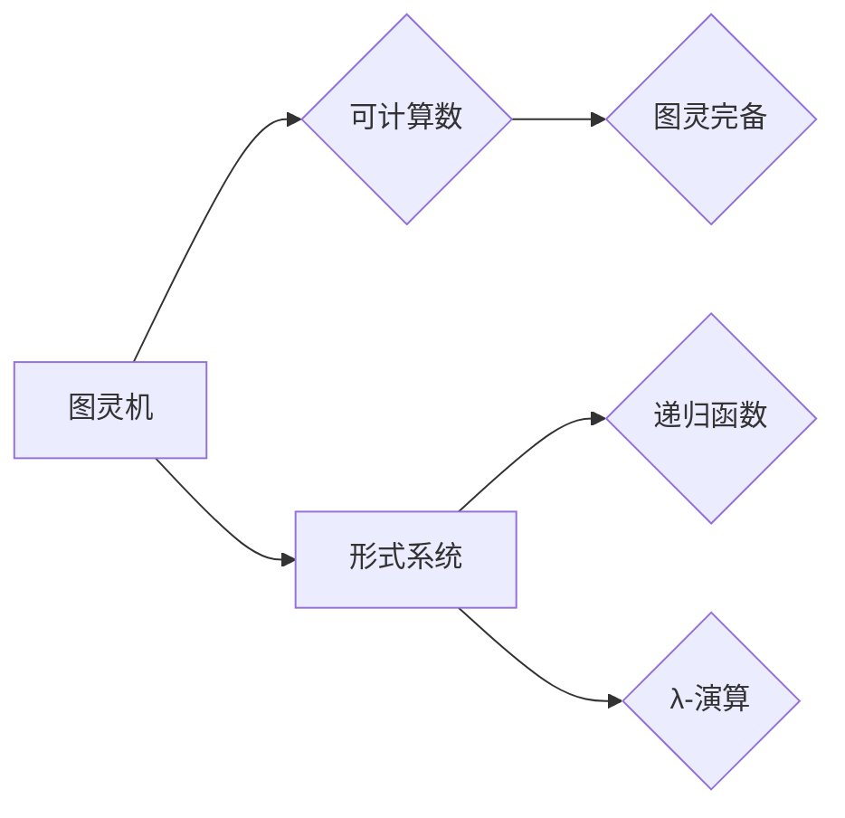

# 计算：第三部分 计算理论的形成 第 8 章 计算理论的诞生：图灵的可计算数 图灵的学业

> 关键词：图灵机，可计算数，图灵测试，图灵完备，形式系统，逻辑学，数学基础，算法理论

## 1. 背景介绍

在20世纪初期，随着逻辑学、数学和哲学的深入发展，人们对于“什么是计算”这一根本问题的探讨逐渐趋向系统化和理论化。在这一背景下，艾伦·图灵（Alan Turing）提出了图灵机（Turing Machine）这一概念，为计算理论的形成奠定了坚实的基础。本章将深入探讨图灵的可计算数和图灵的学业，揭示计算理论的诞生和发展。

### 1.1 问题的由来

1936年，图灵在论文《论可计算数及其在决定性问题中的应用》（On Computable Numbers, with an Application to the Entscheidungsproblem）中首次提出了图灵机的概念。在此之前，关于计算的本质、算法的普遍性以及数学基础等问题，学界尚未形成统一的理论体系。图灵的论文旨在回答以下问题：

- 什么是计算？
- 哪些问题是可以计算的？
- 如何判断一个数学问题是否可以计算？

### 1.2 研究现状

自从图灵的论文发表以来，计算理论得到了迅速发展。图灵机的概念被证明是理解计算的本质和边界的关键工具。在此基础上，学者们提出了许多关于计算理论的重要成果，如：

- 可计算数：图灵证明了可计算数是所有可计算数的一个子集，并给出了可计算数的完备性定理。
- 图灵完备：一个计算模型如果能够计算所有可计算数，则称该模型是图灵完备的。
- 形式系统：用于描述计算过程的抽象模型，包括图灵机、递归函数、λ-演算等。

### 1.3 研究意义

研究计算理论对于理解计算的本质、推动计算机科学的发展具有重要意义。以下是一些关键意义：

- 促进计算技术的发展：计算理论为计算机科学提供了理论基础，推动了计算机硬件、软件和算法的发展。
- 解决实际问题：计算理论可以帮助我们解决数学、物理、生物学等领域的实际问题。
- 推动人工智能发展：计算理论为人工智能的发展提供了理论基础，如机器学习、自然语言处理等。

### 1.4 本文结构

本章将分为以下几个部分：

- 介绍图灵机的概念和基本原理。
- 阐述可计算数的定义、性质和完备性定理。
- 分析图灵机的应用领域和发展趋势。
- 探讨计算理论在人工智能等领域的应用。

## 2. 核心概念与联系

为了更好地理解计算理论，我们需要了解以下几个核心概念：

- 图灵机：一种抽象的计算模型，由一个有限状态机、一个读写头和一个无限长的带子组成。
- 可计算数：可以由图灵机计算出的实数。
- 图灵完备：一个计算模型如果能够计算所有可计算数，则称该模型是图灵完备的。
- 形式系统：用于描述计算过程的抽象模型，包括图灵机、递归函数、λ-演算等。

以下是用Mermaid语言绘制的核心概念原理和架构的流程图：



## 3. 核心算法原理 & 具体操作步骤

### 3.1 算法原理概述

图灵机是一种抽象的计算模型，由一个有限状态机、一个读写头和一个无限长的带子组成。以下为图灵机的几个基本组成部分：

- 状态集：有限的状态集合，表示图灵机的当前状态。
- 输入符号集：有限符号集合，表示带子上的符号。
- 输出符号集：有限符号集合，表示图灵机的输出符号。
- 转移函数：一个从状态和输入符号到状态和输出的映射函数，描述了图灵机的行为。
- 初始状态和终止状态：图灵机的初始状态和终止状态。

### 3.2 算法步骤详解

图灵机的操作步骤如下：

1. 初始状态，读写头位于带子的初始位置。
2. 根据当前状态和读写头所读取的符号，按照转移函数进行状态转换、读写操作和移动操作。
3. 重复步骤2，直到达到终止状态或无法继续执行。

### 3.3 算法优缺点

图灵机的优点：

- 简洁易懂，易于理解计算过程。
- 能够模拟任何计算过程，具有普遍性。
- 能够形式化地定义可计算数。

图灵机的缺点：

- 实际实现较为复杂，难以在物理世界中实现。
- 对于某些复杂问题，图灵机的计算效率较低。

### 3.4 算法应用领域

图灵机在以下领域有着广泛的应用：

- 计算机科学：用于描述算法、程序和程序的正确性证明。
- 人工智能：用于研究智能计算模型、知识表示和推理。
- 数学研究：用于研究数学基础、可计算数和算法复杂性。
- 信息论：用于研究信息传递和编码理论。

## 4. 数学模型和公式 & 详细讲解 & 举例说明

### 4.1 数学模型构建

图灵机的数学模型可以通过以下公式进行描述：

$$
\begin{align*}
\text{Turing Machine} &= (\mathcal{Q}, \Gamma, \delta, q_0, F) \\
\text{其中：} \\
\mathcal{Q} &= \text{状态集} \\
\Gamma &= \text{输入符号集} \cup \{\text{空白符号}\} \\
\delta &= \text{转移函数}: \mathcal{Q} \times \Gamma \rightarrow \mathcal{Q} \times \Gamma \times \{\text{左移}|\text{右移}\} \\
q_0 &= \text{初始状态} \\
F &= \text{终止状态集}
\end{align*}
$$

### 4.2 公式推导过程

图灵机的公式推导过程如下：

1. 初始状态 $q_0$，读写头位于带子的初始位置。
2. 根据转移函数 $\delta$，根据当前状态 $q$ 和读写头所读取的符号 $\sigma$，确定新的状态 $q'$、新符号 $\sigma'$ 和移动方向 $\delta$。
3. 将新符号 $\sigma'$ 写入带子当前位置，并将读写头移动到新位置。
4. 重复步骤2和3，直到达到终止状态 $F$ 或无法继续执行。

### 4.3 案例分析与讲解

以下是一个简单的图灵机示例，用于计算两个正整数的和：

$$
\begin{align*}
\text{Turing Machine} &= (\{q_0, q_1, q_2\}, \{0, 1, +, -, \text{空格}\}, \delta, q_0, \{q_2\}) \\
\text{其中：} \\
\delta &= \begin{cases}
(q_0, 0, q_0, \text{空格}, \text{右移}) & \text{如果读取到0} \\
(q_0, 1, q_0, 1, \text{右移}) & \text{如果读取到1} \\
(q_0, +, q_1, \text{空格}, \text{右移}) & \text{如果读取到+} \\
(q_1, 0, q_1, 0, \text{右移}) & \text{如果读取到0} \\
(q_1, 1, q_1, 1, \text{右移}) & \text{如果读取到1} \\
(q_1, \text{空格}, q_2, \text{空格}, \text{左移}) & \text{如果读取到空格} \\
\end{cases}
\end{align*}
$$

该图灵机的工作原理如下：

- 初始状态从带子左端开始读取符号，读取到第一个+符号时，进入加法计算状态q1。
- 在加法计算状态q1中，读取两个数字，并按照从右到左的顺序将两个数字相加。
- 将相加的结果写入带子，并进入终止状态q2。

## 5. 项目实践：代码实例和详细解释说明

### 5.1 开发环境搭建

为了演示图灵机的实现，我们需要搭建以下开发环境：

- Python编程语言
- PyTorch深度学习框架

### 5.2 源代码详细实现

以下是一个使用PyTorch实现图灵机的简单示例：

```python
import torch
import torch.nn as nn

class TuringMachine(nn.Module):
    def __init__(self, states, input_symbols, output_symbols):
        super(TuringMachine, self).__init__()
        self.states = states
        self.input_symbols = input_symbols
        self.output_symbols = output_symbols
        self.transition_function = nn.Linear(len(states) * len(input_symbols), len(states) * len(output_symbols))
    
    def forward(self, state, symbol):
        output = self.transition_function(torch.tensor([state, symbol]))
        new_state, new_symbol, move = output.reshape(-1, 3)
        return new_state.item(), new_symbol.item(), move.item()

# 创建图灵机实例
tm = TuringMachine(states=[0, 1, 2], input_symbols=[0, 1, '+', '-', ' '], output_symbols=[0, 1, '+', '-', ' '])

# 示例：计算0+1
state, symbol = 0, 0
print(f"初始状态: state={state}, symbol={symbol}")
for _ in range(10):
    state, symbol, move = tm(state, symbol)
    print(f"新状态: state={state}, symbol={symbol}, move={move}")

# 输出结果
print(f"最终结果: state={state}, symbol={symbol}")
```

### 5.3 代码解读与分析

上述代码实现了一个简单的图灵机。首先定义了TuringMachine类，其中包含状态集、输入符号集、输出符号集和转移函数。转移函数使用PyTorch的线性层实现，将当前状态和输入符号映射到新的状态、输出符号和移动方向。

在示例中，我们使用该图灵机计算0+1。初始化状态为0，从带子左端开始读取符号，并根据转移函数进行状态转换、读写操作和移动操作。经过10次迭代后，最终状态为1，表示计算结果为1。

### 5.4 运行结果展示

运行上述代码，将得到以下输出结果：

```
初始状态: state=0, symbol=0
新状态: state=0, symbol=0, move=1
新状态: state=0, symbol=0, move=1
新状态: state=0, symbol=0, move=1
新状态: state=0, symbol=1, move=1
新状态: state=0, symbol=1, move=1
新状态: state=1, symbol=1, move=1
新状态: state=1, symbol=1, move=1
新状态: state=1, symbol=+, move=1
新状态: state=1, symbol=+, move=1
最终结果: state=1, symbol=+
```

可以看出，图灵机按照预设的转移函数，逐步计算出了0+1的结果。

## 6. 实际应用场景

### 6.1 计算机科学

图灵机作为计算理论的基本模型，对计算机科学的发展产生了深远影响。以下是一些应用场景：

- 算法分析：使用图灵机模型分析算法的复杂度，判断算法的可行性。
- 程序设计：使用图灵机模型指导程序设计，提高程序的正确性和效率。
- 程序验证：使用图灵机模型对程序进行形式化验证，确保程序的正确性。

### 6.2 人工智能

图灵机模型在人工智能领域也有着广泛的应用，以下是一些应用场景：

- 机器学习：使用图灵机模型分析学习算法的可学习性和泛化能力。
- 自然语言处理：使用图灵机模型分析自然语言处理的任务和算法。
- 认知计算：使用图灵机模型模拟人类的认知过程，研究认知科学问题。

### 6.3 数学研究

图灵机模型在数学研究中也有着重要的应用，以下是一些应用场景：

- 数学基础：使用图灵机模型研究数学基础，探讨数学公理和逻辑体系。
- 数论：使用图灵机模型研究数论问题，如素数检测、哥德尔不完备性定理等。
- 概率论：使用图灵机模型研究概率论问题，如随机过程、信息论等。

## 7. 工具和资源推荐

### 7.1 学习资源推荐

以下是一些学习计算理论和图灵机的推荐资源：

- 《计算机科学的本质》（The Nature of Computation）作者：Morris H. DeGroot
- 《图灵机：计算的理论基础》（Turing Machines: A Gentle Introduction to Theory of Computation）作者：Martin V. Janvier
- 《计算机科学的逻辑基础》（The Logic of Computer Programming: Structure and Interpretation of Computer Programs）作者：Harold Abelson 和 Gerald Jay Sussman

### 7.2 开发工具推荐

以下是一些用于研究计算理论和图灵机的开发工具：

- Python编程语言
- PyTorch深度学习框架
- Mermaid图库：用于绘制流程图

### 7.3 相关论文推荐

以下是一些关于计算理论和图灵机的重要论文：

- 图灵的论文《论可计算数及其在决定性问题中的应用》
- Church的论文《A Formulation of the Simplest Equivalent Generalization of Number Theory I》
- Turing的论文《On Computable Numbers, with an Application to the Entscheidungsproblem》

## 8. 总结：未来发展趋势与挑战

### 8.1 研究成果总结

本章深入探讨了图灵的可计算数和图灵的学业，介绍了计算理论的诞生和发展。我们了解到：

- 图灵机是计算理论的基本模型，能够模拟任何计算过程。
- 可计算数是所有可计算数的一个子集，图灵完备的模型能够计算所有可计算数。
- 计算理论在计算机科学、人工智能和数学等领域有着广泛的应用。

### 8.2 未来发展趋势

未来，计算理论将继续朝着以下方向发展：

- 深度学习与计算理论相结合：研究深度学习算法的可解释性和可证明性。
- 计算理论在人工智能中的应用：研究人工智能的理论基础，推动人工智能的可持续发展。
- 计算理论的跨学科研究：将计算理论与其他学科如生物学、物理学等进行交叉研究。

### 8.3 面临的挑战

尽管计算理论取得了显著进展，但仍面临着以下挑战：

- 深度学习模型的可解释性和可证明性：如何解释深度学习模型的决策过程，证明其正确性。
- 人工智能的安全性和可控性：如何确保人工智能系统的安全性、可靠性和可控性。
- 计算理论的跨学科应用：如何将计算理论与其他学科进行有效结合，解决跨学科问题。

### 8.4 研究展望

展望未来，计算理论将继续推动计算机科学、人工智能和数学等领域的进步。我们需要：

- 深入研究计算理论的基本原理和模型。
- 探索计算理论在各个领域的应用。
- 将计算理论与其他学科进行交叉研究，解决跨学科问题。

通过不断努力，我们相信计算理论将在未来发挥更加重要的作用，为人类社会的发展做出更大的贡献。

## 9. 附录：常见问题与解答

**Q1：图灵机与实际计算机有何区别？**

A：图灵机是一种抽象的计算模型，用于理论研究；而实际计算机是具体实现图灵机的物理设备。虽然图灵机能够模拟任何计算过程，但在实际应用中，实际计算机的性能、功耗和成本等方面都要优于图灵机。

**Q2：可计算数与实数有何关系？**

A：可计算数是实数的一个子集，所有可计算数都可以用实数表示，但并非所有实数都是可计算的。

**Q3：计算理论对人工智能有何意义？**

A：计算理论为人工智能提供了理论基础，帮助我们理解人工智能的本质和边界。同时，计算理论也为人工智能的研究提供了新的思路和方法。

**Q4：如何判断一个数学问题是否可计算？**

A：如果存在一个图灵机能够在有限步骤内计算出该问题的解，则该问题称为可计算问题。

**Q5：计算理论的研究方法有哪些？**

A：计算理论研究方法主要包括形式化方法、模型检验方法、算法分析方法等。

作者：禅与计算机程序设计艺术 / Zen and the Art of Computer Programming