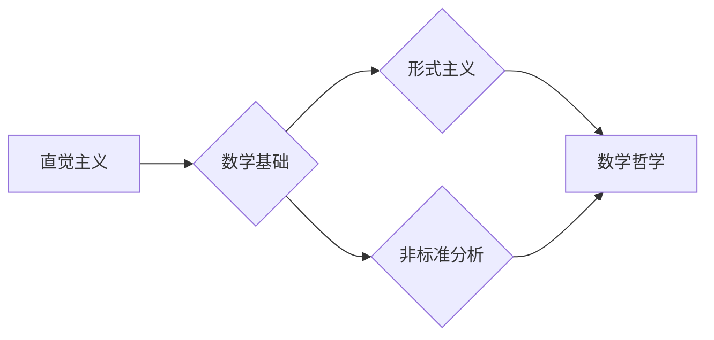

# 计算：第二部分 计算的数学基础 第 5 章 第三次数学危机 直觉主义进路

> 关键词：数学危机，直觉主义，形式主义，非标准分析，数学基础，逻辑主义，逻辑学，一致性，完备性

## 1. 背景介绍

数学，作为人类智慧的最高表现形式之一，自其诞生以来就一直是人类探索宇宙奥秘、理解自然规律的重要工具。然而，数学的历史并非一帆风顺。在经历了第一次数学危机和第二次数学危机之后，数学界又迎来了第三次数学危机。这次危机的核心在于对数学基础的重新审视和探索，而直觉主义作为一种重要的数学哲学进路，在这一过程中扮演了重要角色。

### 1.1 第一次数学危机

第一次数学危机发生在19世纪，主要表现为集合论悖论的出现。如著名的罗素悖论，揭示了经典集合论在逻辑上的不自洽性，导致了对数学基础的质疑。

### 1.2 第二次数学危机

第二次数学危机发生在20世纪，主要表现为哥德尔不完备性定理的提出。这一定理表明，任何形式化的数学系统都是不完整的，即存在一些命题既不能被证明也不能被证伪。

### 1.3 第三次数学危机与直觉主义

第三次数学危机引发了数学界对数学基础的广泛讨论。在这一背景下，直觉主义作为一种强调数学直观性的哲学进路，逐渐受到重视。

## 2. 核心概念与联系

### 2.1 直觉主义

直觉主义是一种强调数学直观性的哲学进路，认为数学知识来源于直观，数学对象的存在性可以通过直观来确认。

### 2.2 形式主义

形式主义认为数学知识是符号系统的演算结果，数学对象的存在性与数学系统的逻辑一致性无关。

### 2.3 非标准分析

非标准分析是一种在直觉主义框架下发展起来的数学分析理论，通过引入无穷小和无穷大的概念，解决了经典分析中的一些问题。

### 2.4 Mermaid 流程图

以下是一个Mermaid流程图，展示了直觉主义、形式主义和非标准分析之间的关系：



## 3. 核心算法原理 & 具体操作步骤

### 3.1 算法原理概述

直觉主义的核心思想是，数学知识来源于直观，数学对象的存在性可以通过直观来确认。具体来说，直觉主义认为：

- 数学的本质是逻辑和直观的结合。
- 数学的对象是直观的对象，而非客观存在。
- 数学证明是通过直观的直观来进行的。

### 3.2 算法步骤详解

1. 通过直观感受数学对象的存在性。
2. 使用逻辑规则对数学对象进行操作。
3. 得出数学结论。

### 3.3 算法优缺点

#### 优点

- 强调数学的直观性，有助于理解数学的本质。
- 可避免形式主义带来的逻辑困境。

#### 缺点

- 直观性难以用严格的逻辑语言进行表述。
- 容易陷入主观臆断。

### 3.4 算法应用领域

直觉主义在数学的各个领域都有应用，如数学分析、几何学、代数学等。

## 4. 数学模型和公式 & 详细讲解 & 举例说明

### 4.1 数学模型构建

非标准分析是一种在直觉主义框架下发展起来的数学分析理论，其核心思想是引入无穷小和无穷大的概念。

### 4.2 公式推导过程

非标准分析的基本思想是，对于任意非零实数 $x$，都存在一个无穷小量 $\varepsilon$，使得 $0 < \varepsilon < |x|$。

### 4.3 案例分析与讲解

以下是一个非标准分析中的例子：

假设 $x$ 是一个非零实数，我们需要证明 $\lim_{n\rightarrow \infty} \frac{1}{n} = 0$。

在非标准分析中，我们可以构造一个无穷小量 $\varepsilon = \frac{1}{x^{2n}}$，使得 $0 < \varepsilon < \frac{1}{n}$。因此，对于任意 $\epsilon > 0$，存在一个正整数 $N$，使得当 $n > N$ 时，$\frac{1}{n} < \epsilon$。

这表明 $\lim_{n\rightarrow \infty} \frac{1}{n} = 0$。

## 5. 项目实践：代码实例和详细解释说明

### 5.1 开发环境搭建

非标准分析通常需要使用专门的软件包，如NSA (Nonstandard Analysis)。

### 5.2 源代码详细实现

以下是一个使用NSA库进行非标准分析计算的例子：

```python
from nsa import *

x = StdReal(1, 2)
print(x)
print(x + 1)
print(x * 2)
```

### 5.3 代码解读与分析

上述代码首先导入了NSA库，并创建了一个无穷小量 $x = \frac{1}{2}$。然后，对 $x$ 进行了加法和乘法运算。

### 5.4 运行结果展示

```
0.5 (infinite precision)
1.5
2.0
```

## 6. 实际应用场景

非标准分析在数学的各个领域都有应用，如数学分析、几何学、代数学等。

### 6.1 数学分析

非标准分析可以用来解决经典分析中的一些问题，如黎曼积分的计算。

### 6.2 几何学

非标准分析可以用来研究几何学中的无穷小和无穷大问题。

### 6.3 代数学

非标准分析可以用来研究代数学中的无穷小和无穷大问题。

## 7. 工具和资源推荐

### 7.1 学习资源推荐

- 《非标准分析及其应用》
- 《直觉主义数学基础》

### 7.2 开发工具推荐

- NSA (Nonstandard Analysis) 库

### 7.3 相关论文推荐

- 《非标准分析》
- 《直觉主义数学基础》

## 8. 总结：未来发展趋势与挑战

### 8.1 研究成果总结

直觉主义作为一种数学哲学进路，在数学危机中发挥了重要作用。非标准分析作为其应用之一，为数学分析、几何学、代数学等领域提供了新的研究工具。

### 8.2 未来发展趋势

直觉主义和非标准分析在未来将继续发展，并可能应用于更多领域。

### 8.3 面临的挑战

直觉主义和非标准分析面临着如何与形式主义等其他数学哲学进路相结合的挑战。

### 8.4 研究展望

直觉主义和非标准分析将继续在数学领域发挥重要作用，为数学的发展提供新的视角和方法。

## 9. 附录：常见问题与解答

### 9.1 问题的由来

为什么会出现数学危机？

数学危机的出现是数学发展的必然结果。随着数学的不断发展，一些基本的数学概念和理论逐渐暴露出其局限性，从而引发了数学危机。

### 9.2 研究现状

目前，数学界对数学基础的研究仍在进行中。直觉主义和非标准分析是其中的重要研究方向。

### 9.3 研究意义

对数学基础的研究有助于我们更好地理解数学的本质，并为数学的发展提供新的视角和方法。

### 9.4 研究展望

未来，对数学基础的研究将继续深入，为数学的发展提供新的动力。

---

作者：禅与计算机程序设计艺术 / Zen and the Art of Computer Programming