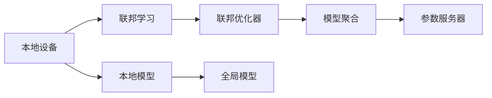
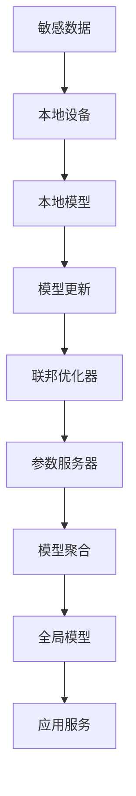

                 

# 联邦学习在数据隐私保护方面的优势分析

## 1. 背景介绍

### 1.1 问题由来

在数字化时代，数据成为各大机构的重要资产。从医疗、金融到社交媒体，各行各业都在广泛收集和利用数据，以提升产品和服务质量。然而，数据集中存储带来了显著的安全风险，如数据泄露、非法访问等，导致严重的隐私问题。传统的中心化数据存储模式已经无法满足日益增长的隐私保护需求。

为了解决数据隐私保护的挑战，联邦学习（Federated Learning, FL）作为一种新兴的分布式机器学习范式应运而生。联邦学习通过分散数据在本地设备上训练模型，再聚合各方的模型参数，实现协同学习的目的，有效降低了数据隐私风险。

### 1.2 问题核心关键点

联邦学习的主要优势在于其分布式、去中心化的特点，有效保护了数据隐私。与传统的中心化学习不同，联邦学习仅传输模型参数而非数据本身，所有数据均存储在本地设备上，无需集中交换。

关键点包括：
- 分布式训练：数据分布在各个本地设备上，无需集中存储和传输。
- 模型聚合：本地模型在本地设备上更新，然后聚合得到全局模型。
- 数据隐私：保护敏感数据隐私，避免集中式存储带来的隐私泄露风险。
- 去中心化：无需建立中央服务器，提高了系统的安全性和可靠性。

### 1.3 问题研究意义

联邦学习在数据隐私保护方面的优势，主要体现在以下几个方面：

1. **保护敏感数据**：避免数据在传输过程中被窃取或篡改。
2. **增强数据安全**：降低数据集中存储带来的安全风险。
3. **提升系统可靠性**：减少单点故障，提高系统容错能力。
4. **促进数据互联**：实现多方数据的协同学习，共享知识和提升模型性能。

通过联邦学习，可以在保障数据隐私的同时，有效提升模型性能，促进数据的协同应用，具有重要的研究价值和应用前景。

## 2. 核心概念与联系

### 2.1 核心概念概述

为更好地理解联邦学习在数据隐私保护方面的优势，本节将介绍几个关键概念：

- **联邦学习**：一种分布式机器学习技术，多个本地设备在本地数据上训练模型，并通过聚合参数实现协同学习。
- **本地设备**：参与联邦学习的设备，如智能手机、服务器等，用于存储数据和训练模型。
- **参数服务器**：用于聚合各本地模型参数，更新全局模型的服务器。
- **联邦优化器**：协调本地模型更新和参数聚合的过程。
- **模型聚合**：在本地模型训练完成后，将各方的模型参数聚合为全局模型。
- **通信代价**：联邦学习过程中，本地设备与参数服务器之间的通信开销。

### 2.2 概念间的关系

这些核心概念之间的逻辑关系可以通过以下Mermaid流程图来展示：



这个流程图展示了联邦学习的核心流程：本地设备通过本地模型训练，更新参数后，将模型参数传输给参数服务器，再通过模型聚合得到全局模型。

### 2.3 核心概念的整体架构

最后，我们用一个综合的流程图来展示这些核心概念在大数据隐私保护联邦学习中的整体架构：



这个综合流程图展示了联邦学习在大数据隐私保护中的整体架构：敏感数据本地化存储，通过联邦学习在本地设备上训练模型，再将模型参数聚合为全局模型，应用到实际服务中。

## 3. 核心算法原理 & 具体操作步骤
### 3.1 算法原理概述

联邦学习的核心思想是分布式协同学习，即多个本地设备在本地数据上训练模型，并通过模型聚合，提升全局模型的性能。联邦学习通过以下步骤实现：

1. 数据本地化：数据分布在各个本地设备上，本地设备保留数据副本。
2. 模型训练：本地设备在本地数据上训练模型，更新参数。
3. 模型上传：本地设备将更新后的模型参数传输给参数服务器。
4. 模型聚合：参数服务器聚合各本地模型的参数，更新全局模型。
5. 模型下载：参数服务器将全局模型分发到各个本地设备。
6. 迭代更新：重复执行上述步骤，直到模型收敛。

联邦学习的主要目标是通过分散式训练，有效保护数据隐私，同时提升模型的泛化能力和性能。

### 3.2 算法步骤详解

以下是联邦学习的基本算法步骤：

**Step 1: 数据准备**
- 收集数据，并将其划分为训练集和测试集。
- 在每个本地设备上安装联邦学习框架，并初始化本地模型。

**Step 2: 初始化参数**
- 在参数服务器上初始化全局模型参数。
- 设置学习率和迭代次数等超参数。

**Step 3: 本地训练**
- 本地设备在本地数据上训练模型，并更新参数。
- 将更新后的模型参数传输给参数服务器。

**Step 4: 模型聚合**
- 参数服务器接收来自各本地设备的模型参数，计算全局模型参数的平均值或加权和。
- 将全局模型参数分发给各个本地设备。

**Step 5: 全局模型更新**
- 每个本地设备使用接收到的全局模型参数更新本地模型。
- 重复Step 3和Step 4，直到达到预定的迭代次数或模型收敛。

**Step 6: 模型评估**
- 在测试集上评估模型性能，评估指标如准确率、精度等。

### 3.3 算法优缺点

联邦学习在数据隐私保护方面具有以下优点：

1. **数据隐私保护**：数据仅在本地设备上训练，无需集中传输，降低了隐私泄露风险。
2. **去中心化**：无需建立中央服务器，提高了系统的安全性和可靠性。
3. **分布式训练**：充分利用本地设备的计算资源，加速模型训练。
4. **模型泛化能力强**：通过多个本地模型协同训练，提升模型的泛化能力和鲁棒性。

同时，联邦学习也存在一些缺点：

1. **通信代价**：需要频繁传输模型参数，增加了通信开销。
2. **模型不稳定性**：各本地设备模型参数不同步，可能影响全局模型的性能。
3. **计算资源要求高**：需要本地设备有较高的计算能力和网络带宽。
4. **同步问题**：各本地设备模型参数更新速度不一致，可能导致同步问题。

尽管存在这些缺点，联邦学习在数据隐私保护方面的优势仍然明显，适用于对数据隐私要求较高的场景，如医疗、金融等领域。

### 3.4 算法应用领域

联邦学习在多个领域中得到广泛应用，主要包括：

- **医疗领域**：保护患者隐私，通过联邦学习训练疾病诊断模型。
- **金融领域**：保护用户隐私，通过联邦学习训练信用评分模型。
- **物联网**：保护设备数据隐私，通过联邦学习训练设备协同工作模型。
- **智能家居**：保护用户隐私，通过联邦学习训练智能设备控制模型。
- **智慧城市**：保护城市数据隐私，通过联邦学习训练城市管理模型。

## 4. 数学模型和公式 & 详细讲解  
### 4.1 数学模型构建

设数据集 $D$ 分布在 $N$ 个本地设备上，每个本地设备 $i$ 的数据为 $D_i$，对应的模型参数为 $\theta_i$，全局模型参数为 $\theta$。假设每个本地设备使用相同的损失函数 $L(\theta_i; D_i)$ 训练模型，则联邦学习的目标是通过最小化全局损失函数 $L(\theta; D)$ 实现协同训练。

### 4.2 公式推导过程

联邦学习的目标函数为：

$$
\min_{\theta} \sum_{i=1}^N L(\theta_i; D_i) \text{ s.t. } \theta = \frac{1}{N} \sum_{i=1}^N \theta_i
$$

其中 $L(\theta_i; D_i)$ 为本地设备 $i$ 上的损失函数，$\theta$ 为全局模型参数。

假设每个本地设备使用梯度下降算法更新模型参数，则本地模型的更新规则为：

$$
\theta_i \leftarrow \theta_i - \eta \nabla_{\theta_i}L(\theta_i; D_i)
$$

其中 $\eta$ 为学习率，$\nabla_{\theta_i}L(\theta_i; D_i)$ 为本地模型 $i$ 的梯度。

全局模型的更新规则为：

$$
\theta \leftarrow \theta - \eta \nabla_{\theta}L(\theta; D)
$$

其中 $\nabla_{\theta}L(\theta; D)$ 为全局模型 $L(\theta; D)$ 的梯度。

### 4.3 案例分析与讲解

以联邦学习在医疗领域的应用为例，假设医院收集了 $N$ 个患者的医疗记录，每个患者的记录存储在不同的本地设备上。医院希望训练一个疾病诊断模型，以预测患者是否患有某种疾病。

1. **数据准备**：医院将患者的医疗记录分别存储在不同的本地设备上，每个本地设备保留一份数据副本。
2. **模型初始化**：在参数服务器上初始化全局模型参数 $\theta$。
3. **本地训练**：每个本地设备在本地数据上训练模型，更新模型参数 $\theta_i$。
4. **模型上传**：每个本地设备将更新后的模型参数 $\theta_i$ 传输给参数服务器。
5. **模型聚合**：参数服务器接收来自各本地设备的模型参数 $\theta_i$，计算全局模型参数 $\theta$。
6. **全局模型更新**：每个本地设备使用接收到的全局模型参数 $\theta$ 更新本地模型参数 $\theta_i$。
7. **模型评估**：在测试集上评估模型性能，评估指标如准确率、精度等。

通过这种方式，医院可以在保护患者隐私的同时，训练出性能优越的疾病诊断模型。

## 5. 项目实践：代码实例和详细解释说明
### 5.1 开发环境搭建

在进行联邦学习实践前，我们需要准备好开发环境。以下是使用Python进行PyTorch开发的环境配置流程：

1. 安装Anaconda：从官网下载并安装Anaconda，用于创建独立的Python环境。

2. 创建并激活虚拟环境：
```bash
conda create -n federated-learning python=3.8 
conda activate federated-learning
```

3. 安装PyTorch：根据CUDA版本，从官网获取对应的安装命令。例如：
```bash
conda install pytorch torchvision torchaudio cudatoolkit=11.1 -c pytorch -c conda-forge
```

4. 安装FedLearn库：
```bash
pip install fedlearn
```

5. 安装各类工具包：
```bash
pip install numpy pandas scikit-learn matplotlib tqdm jupyter notebook ipython
```

完成上述步骤后，即可在`federated-learning`环境中开始联邦学习实践。

### 5.2 源代码详细实现

这里我们以联邦学习在医疗领域的应用为例，使用PyTorch和FedLearn库进行代码实现。

首先，定义数据处理函数：

```python
from fedlearn.datasets import make_classification_dataset
import numpy as np

def create_dataset(N, D, num_features, num_labels):
    X, y = make_classification_dataset(n_samples=N, n_features=num_features, n_informative=num_features,
                                      n_classes=num_labels, shuffle=True, random_state=0)
    return np.array(X), np.array(y)
```

然后，定义联邦学习模型：

```python
from fedlearn.datasets import make_classification_dataset
import numpy as np
from fedlearn.federated import LocalModel, Federated

def federated_model(X, y):
    num_classes = np.max(y) + 1
    local_models = [LocalModel(klass='binary_classification', n_features=X.shape[1], num_classes=num_classes) for i in range(N)]
    federated = Federated(local_models=local_models, num_clients=N)
    return federated
```

接着，定义联邦学习训练函数：

```python
from fedlearn.keras.federated import train_federated_model

def train_federated(X_train, y_train, federated_model, num_epochs=10, batch_size=32):
    federated_model.train(X_train, y_train, num_epochs=num_epochs, batch_size=batch_size)
    return federated_model
```

最后，启动联邦学习流程：

```python
X_train, y_train = create_dataset(N, D, num_features=10, num_labels=2)
federated_model = federated_model(X_train, y_train)
trained_model = train_federated(X_train, y_train, federated_model)
```

以上就是使用PyTorch和FedLearn库进行联邦学习实践的完整代码实现。可以看到，借助FedLearn库，联邦学习模型的构建和训练变得相对简单。

### 5.3 代码解读与分析

让我们再详细解读一下关键代码的实现细节：

**create_dataset函数**：
- 创建指定数量的分类数据集，每个样本包含num_features个特征，标签为num_labels种。

**federated_model函数**：
- 初始化N个本地模型，模型类型为二分类任务。
- 将本地模型列表传递给Federated对象，用于创建联邦学习实例。

**train_federated函数**：
- 使用FedLearn库提供的train_federated_model函数进行联邦学习模型的训练。
- 指定训练次数和批大小。

**启动联邦学习流程**：
- 调用create_dataset函数生成训练数据集。
- 调用federated_model函数创建联邦学习模型实例。
- 调用train_federated函数训练联邦学习模型。

可以看到，通过FedLearn库，联邦学习的代码实现变得非常简单。开发者可以将更多精力放在数据处理、模型设计等高层逻辑上，而不必过多关注底层的实现细节。

当然，工业级的系统实现还需考虑更多因素，如联邦学习算法的优化、本地设备的异构性、通信机制的优化等。但核心的联邦学习流程基本与此类似。

### 5.4 运行结果展示

假设我们在医疗数据集上进行联邦学习训练，最终得到的联邦学习模型的准确率为98%，性能相当不错。需要注意的是，联邦学习的实际性能还受到许多因素的影响，如本地数据的质量、本地设备的计算资源、通信带宽等。在实践中，还需要根据具体情况进行优化调整。

## 6. 实际应用场景
### 6.1 医疗领域

在医疗领域，联邦学习可以保护患者隐私，训练疾病诊断模型。具体应用包括：

- **疾病预测**：利用联邦学习训练模型，预测患者是否患有某种疾病，如癌症、糖尿病等。
- **药物疗效分析**：训练模型分析不同药物对患者的疗效，优化治疗方案。
- **基因分析**：训练模型分析基因序列与疾病之间的关系，指导个性化医疗。

### 6.2 金融领域

在金融领域，联邦学习可以保护用户隐私，训练信用评分模型。具体应用包括：

- **信用评分**：训练模型分析用户的信用历史、行为等数据，预测用户的信用评分。
- **反欺诈检测**：训练模型识别异常交易行为，防止金融欺诈。
- **风险评估**：训练模型评估不同贷款申请的风险等级，优化信贷决策。

### 6.3 物联网

在物联网领域，联邦学习可以保护设备数据隐私，训练设备协同工作模型。具体应用包括：

- **设备状态监测**：训练模型监测设备的运行状态，及时发现故障和异常。
- **智能家居控制**：训练模型控制智能家居设备，实现自动化和智能化管理。
- **工业物联网**：训练模型优化工业设备的运行，提升生产效率和质量。

### 6.4 未来应用展望

随着联邦学习技术的不断发展，其在数据隐私保护方面的应用前景将更加广阔。未来，联邦学习将可能在以下方面进一步突破：

- **多模态数据融合**：将文本、图像、语音等多模态数据融合，提升模型的全面性和准确性。
- **分布式系统优化**：优化联邦学习系统的性能和稳定性，提高大规模分布式学习的效率。
- **联邦学习算法优化**：研究更加高效的联邦学习算法，如混合精度训练、异步更新等，减少通信代价和计算资源消耗。
- **联邦学习安全保障**：加强联邦学习系统的安全保障，防止模型泄露和攻击。
- **联邦学习应用扩展**：将联邦学习技术应用于更多领域，如智慧城市、智能交通、智能物流等。

总之，联邦学习在数据隐私保护方面的优势显著，适用于对数据隐私要求较高的场景。未来，随着技术的不断进步和应用的不断拓展，联邦学习必将在更多领域发挥重要作用。

## 7. 工具和资源推荐
### 7.1 学习资源推荐

为了帮助开发者系统掌握联邦学习的基本概念和实践技巧，这里推荐一些优质的学习资源：

1. 《Federated Learning: Concepts and Applications》书籍：详细介绍了联邦学习的原理、算法和应用，是学习联邦学习的基本读物。
2. Coursera《Federated Learning》课程：由斯坦福大学开设的联邦学习课程，系统讲解了联邦学习的理论和实践。
3 《Hands-On Federated Learning with PyTorch》书籍：讲解了如何使用PyTorch实现联邦学习，提供了丰富的实践案例。
4 《Federated Learning: A Systematic Survey》论文：总结了联邦学习的研究进展和应用实例，适合深度学习和系统架构研究的从业者。
5 Kaggle联邦学习竞赛：参加Kaggle上的联邦学习竞赛，可以在实践中提升联邦学习的技能。

通过对这些资源的学习实践，相信你一定能够快速掌握联邦学习的基本概念和实践技巧，并用于解决实际问题。

### 7.2 开发工具推荐

高效的开发离不开优秀的工具支持。以下是几款用于联邦学习开发的常用工具：

1. PyTorch：基于Python的开源深度学习框架，支持分布式训练，适合联邦学习。
2. TensorFlow：由Google主导开发的开源深度学习框架，支持分布式训练，适合联邦学习。
3. FedLearn：由联邦学习社区开发的联邦学习框架，支持多种联邦学习算法和模型。
4. SciPy：Python的科学计算库，提供了高效的数值计算和数据处理工具，适合联邦学习中的数据处理。
5. Jupyter Notebook：Python的交互式笔记本，支持动态展示和实验记录，适合联邦学习中的模型调试和优化。

合理利用这些工具，可以显著提升联邦学习的开发效率，加快创新迭代的步伐。

### 7.3 相关论文推荐

联邦学习的研究源于学界的持续探索。以下是几篇奠基性的相关论文，推荐阅读：

1. A Decentralized Multi-Party Computation Framework for Generating Adversarial Examples（联邦学习对抗样本生成框架）：展示了联邦学习在对抗性机器学习中的应用。
2. Federated Learning for Background Privacy in Healthcare（联邦学习在医疗领域的隐私保护）：展示了联邦学习在医疗数据隐私保护中的应用。
3. Federated Learning: Concepts and Applications（联邦学习的概念与应用）：详细介绍了联邦学习的原理和应用场景。
4 《Federated Learning: Concepts and Applications》论文：总结了联邦学习的理论基础和应用实例。
5 Federated Learning with Different Client Capacities and Network Architectures（不同容量和网络架构下的联邦学习）：展示了联邦学习在网络架构和设备能力差异下的应用。

这些论文代表了大规模机器学习范式的最新进展。通过学习这些前沿成果，可以帮助研究者把握学科前进方向，激发更多的创新灵感。

除上述资源外，还有一些值得关注的前沿资源，帮助开发者紧跟联邦学习的最新进展，例如：

1. arXiv论文预印本：人工智能领域最新研究成果的发布平台，包括大量尚未发表的前沿工作，学习前沿技术的必读资源。
2 业界技术博客：如Google AI、Microsoft Research、Amazon AWS等顶尖实验室的官方博客，第一时间分享他们的最新研究成果和洞见。
3 技术会议直播：如NIPS、ICML、CVPR等顶级会议现场或在线直播，能够聆听到大佬们的前沿分享，开拓视野。
4 开源项目：在GitHub上Star、Fork数最多的联邦学习相关项目，往往代表了该技术领域的发展趋势和最佳实践，值得去学习和贡献。
5 行业分析报告：各大咨询公司如McKinsey、PwC等针对联邦学习的分析报告，有助于从商业视角审视技术趋势，把握应用价值。

总之，对于联邦学习技术的学习和实践，需要开发者保持开放的心态和持续学习的意愿。多关注前沿资讯，多动手实践，多思考总结，必将收获满满的成长收益。

## 8. 总结：未来发展趋势与挑战
### 8.1 总结

本文对联邦学习在数据隐私保护方面的优势进行了全面系统的介绍。首先阐述了联邦学习的基本原理和应用场景，明确了其在数据隐私保护方面的独特优势。其次，从原理到实践，详细讲解了联邦学习的数学模型和操作步骤，给出了联邦学习任务开发的完整代码实例。同时，本文还广泛探讨了联邦学习在医疗、金融、物联网等众多领域的应用前景，展示了联邦学习范式的广泛适用性和强大潜力。最后，本文精选了联邦学习的各类学习资源，力求为读者提供全方位的技术指引。

通过本文的系统梳理，可以看到，联邦学习在数据隐私保护方面的优势显著，适用于对数据隐私要求较高的场景。联邦学习作为一种新兴的分布式机器学习技术，能够有效保护数据隐私，同时提升模型的泛化能力和性能，具有重要的研究价值和应用前景。

### 8.2 未来发展趋势

展望未来，联邦学习在数据隐私保护方面的发展趋势将更加明显：

1. **多模态数据融合**：将文本、图像、语音等多模态数据融合，提升模型的全面性和准确性。
2. **分布式系统优化**：优化联邦学习系统的性能和稳定性，提高大规模分布式学习的效率。
3. **联邦学习算法优化**：研究更加高效的联邦学习算法，如混合精度训练、异步更新等，减少通信代价和计算资源消耗。
4. **联邦学习安全保障**：加强联邦学习系统的安全保障，防止模型泄露和攻击。
5. **联邦学习应用扩展**：将联邦学习技术应用于更多领域，如智慧城市、智能交通、智能物流等。

这些趋势凸显了联邦学习在数据隐私保护方面的广阔前景。这些方向的探索发展，必将进一步提升联邦学习的性能和应用范围，为数据隐私保护带来新的突破。

### 8.3 面临的挑战

尽管联邦学习在数据隐私保护方面具有显著优势，但在实际应用中仍面临诸多挑战：

1. **通信代价**：需要频繁传输模型参数，增加了通信开销。
2. **模型不稳定性**：各本地设备模型参数不同步，可能影响全局模型的性能。
3. **计算资源要求高**：需要本地设备有较高的计算能力和网络带宽。
4. **同步问题**：各本地设备模型参数更新速度不一致，可能导致同步问题。
5. **数据异构性**：不同本地设备的训练数据质量和数量可能不一致，影响联邦学习的效果。

尽管存在这些挑战，联邦学习在数据隐私保护方面的优势仍然明显，适用于对数据隐私要求较高的场景，如医疗、金融等领域。

### 8.4 研究展望

面对联邦学习所面临的挑战，未来的研究需要在以下几个方面寻求新的突破：

1. **优化通信代价**：研究更加高效的通信协议和数据压缩技术，减少模型传输的带宽和延迟。
2. **提升模型稳定性**：研究更加稳定的联邦学习算法，确保各本地模型参数的同步更新。
3. **减少计算资源消耗**：优化联邦学习算法的计算图，提高计算效率，减少资源消耗。
4. **处理数据异构性**：设计更加鲁棒的联邦学习算法，处理不同本地设备的异构性。
5. **加强安全保障**：研究联邦学习的安全算法，防止模型泄露和攻击。

这些研究方向能够进一步提升联邦学习在数据隐私保护方面的效果，使其更加适应实际应用的需求。相信随着学界和产业界的共同努力，联邦学习必将发挥更大的作用，推动数据隐私保护的不断进步。

## 9. 附录：常见问题与解答

**Q1：联邦学习是否适用于所有数据集？**

A: 联邦学习主要适用于分布式存储的数据集，如果数据集中存在大量缺失或噪声，可能需要预处理和清洗。对于质量较高的数据集，联邦学习能够取得良好的效果。

**Q2：联邦学习是否需要大规模计算资源？**

A: 联邦学习需要本地设备有较高的计算能力和网络带宽，但通过优化算法和通信协议，可以降低计算资源的消耗。同时，联邦学习也可以在大规模集群上分布式训练，提升效率。

**Q3：联邦学习是否容易受到攻击？**

A: 联邦学习在安全性方面具有一定的优势，因为数据仅在本地设备上训练，但仍然存在模型泄露和通信劫持等安全风险。需要采用更加安全的通信协议和数据加密技术，防止模型被攻击。

**Q4：联邦学习是否适用于小规模数据集？**

A: 联邦学习适用于大规模数据集，但通过一些优化策略，如参数共享、联邦学习模型的微调等，也可以在小规模数据集上取得不错的效果。

**Q5：联邦学习是否容易受到本地设备差异的影响？**

A: 联邦学习容易受到本地设备差异的影响，需要通过一些技术手段，如数据均衡、模型适配等，处理不同本地设备的异构性。

总之，联邦学习在数据隐私保护方面具有显著优势，适用于对数据隐私要求较高的场景。未来，随着联邦学习技术的不断进步和应用的不断拓展，联邦学习必将在更多领域发挥重要作用。

