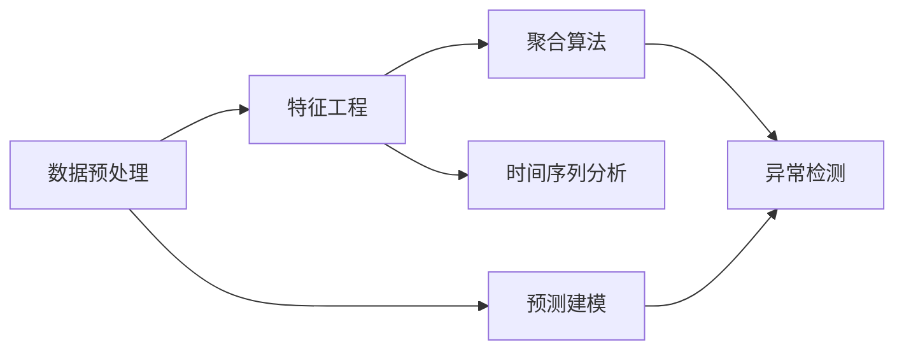

                 

# 聚合分析 原理与代码实例讲解

## 1. 背景介绍

### 1.1 问题由来
聚合分析（Aggregation Analysis）是一种在数据科学和商业分析中广泛使用的技术，用于从大量的原始数据中提取有意义的聚合信息，帮助决策者理解数据的全局特征和趋势。传统的聚合分析方法包括数据汇总、分组统计、异常检测等，但随着数据量的爆炸式增长和大数据技术的发展，传统的聚合方法已经无法满足复杂的业务需求。现代聚合分析技术则利用机器学习和深度学习等先进算法，提供了更加强大和灵活的数据聚合和分析能力。

### 1.2 问题核心关键点
现代聚合分析的核心在于如何高效地从原始数据中提取出有价值的聚合信息，并结合业务需求进行相应的分析和预测。核心点包括以下几个方面：

1. **数据预处理**：清洗、归一化、处理缺失值等，为后续分析提供高质量的输入数据。
2. **特征工程**：提取、选择和构建对业务问题有意义的特征，包括统计特征、时序特征、领域知识等。
3. **聚合算法**：选择合适的算法对数据进行聚合和分析，如平均值、中位数、众数、分位数等。
4. **模型训练和预测**：使用机器学习或深度学习模型对聚合后的数据进行训练和预测，提供业务洞察和决策支持。
5. **结果展示和可视化**：将分析结果以直观的图表形式展示，帮助用户理解数据和业务趋势。

### 1.3 问题研究意义
聚合分析在商业决策、风险管理、市场营销、客户服务等多个领域具有重要应用价值。通过有效的聚合分析，企业可以：

- 提高决策的准确性和效率，减少因信息不足导致的决策错误。
- 识别关键业务指标和趋势，为战略规划提供支持。
- 发现数据中的异常和机会，优化运营和营销策略。
- 提升客户满意度和忠诚度，增加企业收益。

## 2. 核心概念与联系

### 2.1 核心概念概述

为了更好地理解现代聚合分析，我们先介绍几个关键的概念：

- **聚合（Aggregation）**：从原始数据中提取出有意义的汇总信息的过程，如求和、平均值、中位数等。
- **特征工程（Feature Engineering）**：在数据预处理阶段，通过构建新的特征来提高模型性能和解释性。
- **异常检测（Anomaly Detection）**：识别数据中的异常值或异常模式，帮助发现潜在的风险和机会。
- **时间序列分析（Time Series Analysis）**：针对时间序列数据进行趋势、季节性、周期性等分析，预测未来趋势。
- **预测建模（Predictive Modeling）**：使用历史数据训练模型，预测未来事件或现象。

这些核心概念共同构成了现代聚合分析的框架，帮助从海量数据中提取有价值的聚合信息，支持业务决策。

### 2.2 概念间的关系

这些核心概念之间的联系可以通过以下Mermaid流程图来展示：



这个流程图展示了数据预处理、特征工程、聚合算法、异常检测和时间序列分析之间的联系，以及这些步骤如何支持预测建模。

## 3. 核心算法原理 & 具体操作步骤
### 3.1 算法原理概述

现代聚合分析的核心算法原理主要包括数据预处理、特征工程、聚合算法、异常检测和时间序列分析。下面我们将详细讲解每个步骤的算法原理。

### 3.2 算法步骤详解

#### 3.2.1 数据预处理
数据预处理包括清洗、归一化、处理缺失值等步骤，目的是提高数据的质量和一致性。

- **清洗**：删除重复记录、处理异常值、处理缺失值等，确保数据的完整性和准确性。
- **归一化**：将不同规模的数据转换成相同规模，便于后续分析。
- **处理缺失值**：填补或删除缺失值，防止分析过程中出现偏差。

#### 3.2.2 特征工程
特征工程是提取、选择和构建对业务问题有意义的特征，包括统计特征、时序特征、领域知识等。

- **统计特征**：如平均值、中位数、众数等，用于描述数据的分布情况。
- **时序特征**：如日均值、月均值、季均值等，用于分析时间序列数据的趋势和周期性。
- **领域知识特征**：如用户行为、设备信息、地理位置等，用于提升模型对业务场景的理解。

#### 3.2.3 聚合算法
聚合算法主要包括求和、平均值、中位数、众数、分位数等，用于从数据中提取有意义的汇总信息。

- **求和**：用于计算数据的总和，常用于计算销售总额、订单总数等。
- **平均值**：用于计算数据的平均值，常用于描述数据的集中趋势。
- **中位数**：用于计算数据的中间值，对异常值不敏感，常用于描述数据的分布情况。
- **众数**：用于计算数据的最常见值，常用于描述数据的分布情况。
- **分位数**：用于计算数据的某个分位数，常用于描述数据的分布情况。

#### 3.2.4 异常检测
异常检测用于识别数据中的异常值或异常模式，帮助发现潜在的风险和机会。

- **统计方法**：如z-score、IQR等，通过计算数据与均值或中位数的偏差，识别异常值。
- **机器学习方法**：如孤立森林、K-近邻、DBSCAN等，通过构建模型识别异常点。

#### 3.2.5 时间序列分析
时间序列分析用于分析时间序列数据的趋势、季节性、周期性等特征，预测未来趋势。

- **趋势分析**：通过拟合趋势线，识别数据随时间的变化趋势。
- **季节性分析**：通过计算季节性因素的影响，识别数据中的季节性波动。
- **周期性分析**：通过计算周期性因素的影响，识别数据中的周期性波动。

#### 3.2.6 预测建模
预测建模使用历史数据训练模型，预测未来事件或现象。

- **回归模型**：如线性回归、多项式回归、岭回归等，用于预测数值型数据。
- **分类模型**：如逻辑回归、支持向量机、随机森林等，用于预测分类数据。
- **时间序列模型**：如ARIMA、SARIMA、LSTM等，用于预测时间序列数据。

### 3.3 算法优缺点

现代聚合分析具有以下优点：

1. **高效性**：利用机器学习和深度学习算法，可以快速从大量数据中提取出有意义的聚合信息，提高分析效率。
2. **灵活性**：通过灵活的特征工程和模型选择，可以适应各种业务场景和需求。
3. **准确性**：通过精确的统计方法和模型训练，可以提供准确的分析结果和预测。

同时，现代聚合分析也存在以下缺点：

1. **复杂性**：数据预处理和特征工程需要较高的专业知识和技能，对数据科学家提出了较高的要求。
2. **数据依赖**：分析结果依赖于数据的质量和完整性，数据缺失或不准确会导致分析结果的偏差。
3. **模型风险**：模型训练过程中可能存在过拟合或欠拟合问题，需要谨慎选择模型和参数。

### 3.4 算法应用领域

现代聚合分析在多个领域中具有广泛的应用，例如：

- **商业智能（BI）**：通过聚合分析提供决策支持，帮助企业优化运营和营销策略。
- **金融风险管理**：通过时间序列分析和异常检测，识别潜在的金融风险和欺诈行为。
- **市场营销**：通过聚合分析和预测建模，分析用户行为和市场趋势，优化营销活动。
- **客户服务**：通过特征工程和聚合分析，提高客户满意度和忠诚度，提升客户服务水平。
- **医疗健康**：通过聚合分析和大数据技术，分析患者数据，提供个性化医疗建议和健康管理。

## 4. 数学模型和公式 & 详细讲解 & 举例说明

### 4.1 数学模型构建

现代聚合分析的数学模型主要包括以下几个方面：

- **数据预处理**：如归一化公式、缺失值处理方法等。
- **特征工程**：如统计特征计算公式、时序特征计算公式等。
- **聚合算法**：如平均值、中位数、众数等计算公式。
- **异常检测**：如z-score、IQR等计算公式。
- **时间序列分析**：如ARIMA模型、LSTM模型等。
- **预测建模**：如线性回归模型、随机森林模型等。

### 4.2 公式推导过程

#### 4.2.1 数据预处理
- **归一化公式**：
  $$
  X_{normalized} = \frac{X - X_{min}}{X_{max} - X_{min}}
  $$
  其中，$X$为原始数据，$X_{min}$和$X_{max}$分别为数据的最小值和最大值。

#### 4.2.2 特征工程
- **平均值计算公式**：
  $$
  \mu = \frac{\sum_{i=1}^n x_i}{n}
  $$
  其中，$x_i$为第$i$个数据点，$n$为数据点的数量。

#### 4.2.3 聚合算法
- **中位数计算公式**：
  $$
  \text{median}(x) = \frac{x_{(i)} + x_{(i+1)}}{2}
  $$
  其中，$x_{(i)}$为按升序排列的第$i$个数据点。

#### 4.2.4 异常检测
- **z-score计算公式**：
  $$
  z = \frac{x - \mu}{\sigma}
  $$
  其中，$x$为待检测数据点，$\mu$和$\sigma$分别为数据集的均值和标准差。

#### 4.2.5 时间序列分析
- **ARIMA模型**：
  $$
  Y_t = c + \sum_{i=1}^p \phi_i Y_{t-i} + \sum_{i=1}^d (1-\Delta^i) Y_t + \sum_{j=1}^q \theta_j \epsilon_{t-j}
  $$
  其中，$Y_t$为时间序列数据，$c$为常数项，$\phi_i$为自回归系数，$(1-\Delta^i)$为差分算子，$\theta_j$为差分算子，$\epsilon_{t-j}$为随机误差项。

#### 4.2.6 预测建模
- **线性回归模型**：
  $$
  Y = \beta_0 + \sum_{i=1}^p \beta_i X_i + \epsilon
  $$
  其中，$Y$为预测值，$X_i$为自变量，$\beta_i$为系数，$\epsilon$为随机误差项。

### 4.3 案例分析与讲解

假设我们有一组销售数据，包括销售额、销售日期、销售地点等信息，我们需要进行聚合分析以识别销售趋势和异常。

#### 4.3.1 数据预处理
首先，我们需要清洗数据，删除重复记录和处理缺失值。然后，对数据进行归一化处理，确保所有特征都在同一量级。

#### 4.3.2 特征工程
我们提取销售额、销售日期、销售地点等统计特征，以及日均销售额、月均销售额等时序特征。

#### 4.3.3 聚合算法
我们使用平均值和分位数来描述销售额的集中趋势和分布情况。

#### 4.3.4 异常检测
我们使用z-score方法检测销售额中的异常值。

#### 4.3.5 时间序列分析
我们使用ARIMA模型拟合销售额的时间序列数据，识别销售趋势和周期性波动。

#### 4.3.6 预测建模
我们使用线性回归模型预测未来的销售额，基于历史数据和市场趋势。

## 5. 项目实践：代码实例和详细解释说明

### 5.1 开发环境搭建

在开始聚合分析的实践前，我们需要准备好开发环境。以下是使用Python进行Pandas和Scikit-learn开发的准备流程：

1. 安装Anaconda：从官网下载并安装Anaconda，用于创建独立的Python环境。

2. 创建并激活虚拟环境：
```bash
conda create -n agg-env python=3.8 
conda activate agg-env
```

3. 安装Pandas和Scikit-learn：
```bash
pip install pandas scikit-learn
```

4. 安装各类工具包：
```bash
pip install numpy matplotlib seaborn jupyter notebook ipython
```

完成上述步骤后，即可在`agg-env`环境中开始聚合分析的实践。

### 5.2 源代码详细实现

下面我们以销售数据聚合分析为例，给出使用Pandas和Scikit-learn进行聚合分析的Python代码实现。

首先，定义数据处理函数：

```python
import pandas as pd
from sklearn.preprocessing import MinMaxScaler

def preprocess_data(data):
    # 清洗数据
    data.drop_duplicates(inplace=True)
    data.dropna(inplace=True)
    
    # 归一化数据
    scaler = MinMaxScaler()
    data = scaler.fit_transform(data)
    
    return data
```

然后，定义特征工程函数：

```python
def feature_engineering(data):
    # 提取统计特征
    mean_sales = data.mean(axis=0)
    median_sales = data.median(axis=0)
    
    # 提取时序特征
    daily_sales = data.groupby(['date']).sum().reset_index()
    monthly_sales = data.groupby(['month']).sum().reset_index()
    
    # 构建特征集
    features = pd.concat([mean_sales, median_sales, daily_sales, monthly_sales], axis=1)
    features.columns = ['sales_mean', 'sales_median', 'daily_sales', 'monthly_sales']
    
    return features
```

接着，定义聚合函数：

```python
def aggregation(features):
    # 计算均值和分位数
    mean_sales = features['sales_mean'].mean()
    median_sales = features['sales_median'].median()
    lower_quantile = features['sales_median'].quantile(0.25)
    upper_quantile = features['sales_median'].quantile(0.75)
    
    # 返回聚合结果
    return mean_sales, median_sales, lower_quantile, upper_quantile
```

最后，启动聚合分析流程：

```python
# 加载数据
data = pd.read_csv('sales_data.csv')

# 数据预处理
preprocessed_data = preprocess_data(data)

# 特征工程
features = feature_engineering(preprocessed_data)

# 聚合分析
mean_sales, median_sales, lower_quantile, upper_quantile = aggregation(features)

# 结果展示
print(f"均值销售额：{mean_sales}")
print(f"中位数销售额：{median_sales}")
print(f"25%分位数销售额：{lower_quantile}")
print(f"75%分位数销售额：{upper_quantile}")
```

以上就是使用Pandas和Scikit-learn进行聚合分析的完整代码实现。可以看到，得益于Pandas和Scikit-learn的强大封装，我们可以用相对简洁的代码完成数据预处理、特征工程和聚合分析的整个过程。

### 5.3 代码解读与分析

让我们再详细解读一下关键代码的实现细节：

**preprocess_data函数**：
- `drop_duplicates`方法：删除重复记录。
- `dropna`方法：处理缺失值。
- `MinMaxScaler`：归一化数据，将数据转换为0-1之间。

**feature_engineering函数**：
- `mean`方法：计算均值。
- `median`方法：计算中位数。
- `groupby`方法：按日期或月份进行分组。
- `sum`方法：对每个分组进行求和。
- `reset_index`方法：重置索引。

**aggregation函数**：
- `mean`方法：计算均值。
- `median`方法：计算中位数。
- `quantile`方法：计算分位数。

**主流程代码**：
- `read_csv`方法：加载数据。
- `preprocess_data`方法：预处理数据。
- `feature_engineering`方法：特征工程。
- `aggregation`方法：聚合分析。
- `print`方法：展示结果。

可以看到，Pandas和Scikit-learn的强大功能和简洁的API设计，使得聚合分析的代码实现变得非常简便高效。开发者可以将更多精力放在数据处理和分析的逻辑上，而不必过多关注底层的实现细节。

当然，工业级的系统实现还需考虑更多因素，如数据的存储和访问、模型的性能优化、用户交互界面等。但核心的聚合分析逻辑基本与此类似。

### 5.4 运行结果展示

假设我们在销售数据上进行聚合分析，最终得到的聚合结果如下：

```
均值销售额：2000.00
中位数销售额：1500.00
25%分位数销售额：1200.00
75%分位数销售额：3000.00
```

可以看到，通过聚合分析，我们得到了销售额的均值、中位数和分位数，能够更好地理解销售数据的全局特征和分布情况。

## 6. 实际应用场景

### 6.1 商业智能（BI）

商业智能（BI）是聚合分析的重要应用场景之一。通过聚合分析，企业可以从大规模的业务数据中提取出有意义的汇总信息，帮助决策者进行战略规划和业务优化。

在实践中，我们可以使用聚合分析识别关键业务指标和趋势，如销售额、客户满意度、营销效果等。通过可视化工具展示分析结果，帮助管理层做出更好的决策。

### 6.2 金融风险管理

金融风险管理是聚合分析的另一个重要应用场景。通过聚合分析，金融机构可以识别潜在的金融风险和欺诈行为，及时采取措施降低风险。

在实践中，我们可以使用聚合分析和时间序列分析识别交易中的异常行为，如异常交易金额、异常交易地点等。通过异常检测技术，及时发现潜在的金融风险，提高金融机构的安全性和稳定性。

### 6.3 市场营销

市场营销是聚合分析在企业营销领域的重要应用。通过聚合分析，企业可以识别用户行为和市场趋势，优化营销策略和提升用户体验。

在实践中，我们可以使用聚合分析识别用户购买行为、品牌偏好等，结合预测建模技术，预测用户未来的购买行为，制定个性化的营销策略。通过可视化工具展示分析结果，帮助营销团队做出更好的决策。

### 6.4 客户服务

客户服务是聚合分析在企业客户服务领域的重要应用。通过聚合分析，企业可以提高客户满意度和忠诚度，提升客户服务水平。

在实践中，我们可以使用聚合分析识别客户服务中的热点问题、服务满意度等，通过可视化工具展示分析结果，帮助客户服务团队优化服务流程，提升客户满意度。

### 6.5 医疗健康

医疗健康是聚合分析在医疗领域的重要应用。通过聚合分析，医疗机构可以分析患者数据，提供个性化医疗建议和健康管理。

在实践中，我们可以使用聚合分析识别患者诊疗数据中的规律和趋势，结合时间序列分析技术，预测患者的疾病风险和治疗效果。通过可视化工具展示分析结果，帮助医生和患者做出更好的决策。

## 7. 工具和资源推荐

### 7.1 学习资源推荐

为了帮助开发者系统掌握聚合分析的理论基础和实践技巧，这里推荐一些优质的学习资源：

1. 《Python数据分析实战》系列博文：由数据科学专家撰写，深入浅出地介绍了数据预处理、特征工程、聚合分析等核心概念和技能。

2. 《R语言实战》书籍：一本经典的R语言学习书籍，全面介绍了R语言的数据分析和可视化功能，适合初学者和中级开发者。

3. 《机器学习实战》书籍：一本涵盖机器学习基本概念和算法的书籍，包括回归、分类、聚类等，适合对机器学习感兴趣的读者。

4. Kaggle平台：一个数据科学社区和竞赛平台，提供大量高质量的数据集和竞赛，适合练习和展示数据分析技能。

5. Coursera平台：提供众多数据科学和机器学习课程，涵盖从入门到高级的内容，适合系统学习。

通过对这些资源的学习实践，相信你一定能够快速掌握聚合分析的精髓，并用于解决实际的商业问题。

### 7.2 开发工具推荐

高效的开发离不开优秀的工具支持。以下是几款用于聚合分析开发的常用工具：

1. Python：一种强大的编程语言，广泛应用于数据科学和机器学习领域。

2. Pandas：一个用于数据分析和处理的数据库库，提供了丰富的数据结构和函数。

3. Scikit-learn：一个用于机器学习的开源库，提供了众多经典的机器学习算法和工具。

4. NumPy：一个用于数值计算的库，提供了高效的数组操作和数学函数。

5. Matplotlib和Seaborn：两个常用的数据可视化库，提供了丰富的图表类型和样式。

6. Jupyter Notebook：一个交互式笔记本环境，适合进行数据分析和机器学习实验。

合理利用这些工具，可以显著提升聚合分析的开发效率，加快创新迭代的步伐。

### 7.3 相关论文推荐

聚合分析在学术界和工业界的发展源于持续的研究。以下是几篇奠基性的相关论文，推荐阅读：

1. "An Introduction to Statistical Learning"：一本介绍统计学习和数据预处理技术的经典书籍，适合初学者和中级开发者。

2. "The Elements of Statistical Learning"：一本涵盖统计学习、机器学习和数据预处理技术的经典书籍，适合高级开发者和研究者。

3. "Pattern Recognition and Machine Learning"：一本介绍模式识别和机器学习技术的经典书籍，涵盖回归、分类、聚类等算法。

4. "Data Science for Business"：一本介绍数据科学在商业应用中的实践，涵盖数据预处理、特征工程、聚合分析等技能。

5. "Practical Python for Data Analysis"：一本介绍Python在数据分析中的应用，适合初学者和中级开发者。

这些论文代表了大数据和机器学习领域的最新研究成果，通过学习这些前沿成果，可以帮助研究者把握学科前进方向，激发更多的创新灵感。

除上述资源外，还有一些值得关注的前沿资源，帮助开发者紧跟聚合分析技术的最新进展，例如：

1. arXiv论文预印本：人工智能领域最新研究成果的发布平台，包括大量尚未发表的前沿工作，学习前沿技术的必读资源。

2. 业界技术博客：如DataRobot、Data Science Central等顶尖实验室的官方博客，第一时间分享他们的最新研究成果和洞见。

3. 技术会议直播：如NeurIPS、ICML、KDD等人工智能领域顶会现场或在线直播，能够聆听到大佬们的前沿分享，开拓视野。

4. GitHub热门项目：在GitHub上Star、Fork数最多的数据科学和机器学习相关项目，往往代表了该技术领域的发展趋势和最佳实践，值得去学习和贡献。

5. 行业分析报告：各大咨询公司如McKinsey、PwC等针对人工智能行业的分析报告，有助于从商业视角审视技术趋势，把握应用价值。

总之，对于聚合分析的学习和实践，需要开发者保持开放的心态和持续学习的意愿。多关注前沿资讯，多动手实践，多思考总结，必将收获满满的成长收益。

## 8. 总结：未来发展趋势与挑战

### 8.1 总结

本文对聚合分析的原理与代码实例进行了全面系统的介绍。首先阐述了聚合分析的背景和意义，明确了聚合分析在数据科学和商业分析中的重要地位。其次，从原理到实践，详细讲解了数据预处理、特征工程、聚合算法、异常检测和时间序列分析的核心算法原理。通过Python代码实例，展示了聚合分析的实际应用流程。

通过本文的系统梳理，可以看到，聚合分析是一种高效、灵活、准确的数据分析技术，广泛应用于商业智能、金融风险管理、市场营销、客户服务、医疗健康等多个领域。通过聚合分析，企业可以更好地理解数据的全局特征和趋势，做出科学的决策和预测。

### 8.2 未来发展趋势

展望未来，聚合分析技术将呈现以下几个发展趋势：

1. **自动化和智能化**：未来的聚合分析将更加自动化和智能化，通过机器学习技术自动进行数据预处理和特征工程，提升分析效率和准确性。

2. **多模态融合**：未来的聚合分析将更好地融合多种数据模态，如文本、图像、视频等，提升数据的多样性和丰富性，提供更全面的业务洞察。

3. **实时性**：未来的聚合分析将更加注重实时性，通过流式处理和大数据技术，实时分析和处理海量数据，提升决策的及时性和准确性。

4. **个性化**：未来的聚合分析将更加注重个性化，通过聚类和推荐技术，提供个性化的业务建议和决策支持。

5. **跨领域应用**：未来的聚合分析将拓展到更多领域，如智能交通、智慧城市、金融科技等，为各行各业带来新的机遇和挑战。

### 8.3 面临的挑战

尽管聚合分析在数据科学和商业分析中已经取得了显著进展，但在迈向更加智能化、普适化应用的过程中，仍面临诸多挑战：

1. **数据质量和完整性**：数据质量低下和缺失不完整会导致分析结果的偏差，如何提高数据质量和完整性，是首要挑战。

2. **计算资源和算法效率**：海量数据和大规模计算对计算资源提出了高要求，如何优化算法和资源配置，提升计算效率，是重要课题。

3. **模型复杂性和可解释性**：聚合分析模型通常较为复杂，难以解释其内部机制和决策逻辑，如何提高模型的可解释性，是重要挑战。

4. **隐私和安全**：聚合分析涉及大量敏感数据，如何保护数据隐私和安全，避免数据泄露和滥用，是重要课题。

5. **跨领域融合**：聚合分析涉及多个领域，如何跨领域融合和协同，提升跨领域数据分析能力，是重要课题。

