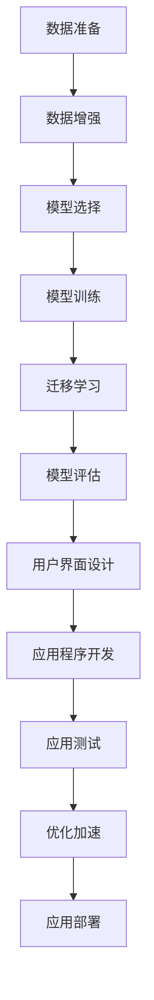

                 

# 花识别Android应用程序的实现

## 1. 背景介绍

近年来，随着人工智能技术的快速发展和广泛应用，越来越多的应用场景开始探索利用AI技术进行自动化和智能化处理。其中，计算机视觉领域，尤其是图像识别和分类任务，成为了AI应用的热点。尤其在农业、园艺等需要大量识别和分类的领域，图像识别技术的应用更为显著。

### 1.1 问题由来

在农业领域，尤其是园艺和花卉种植中，对植物品种的识别和分类是非常重要的一环。不同种类的花卉，其栽培方法、营养成分、市场需求等都不尽相同，因此准确识别花卉种类是进行科学种植、优化管理的基础。然而，手动识别花卉需要耗费大量的时间和人力资源，且容易受限于人的经验水平和主观判断。

为了解决这个问题，利用人工智能技术，特别是深度学习算法，进行花卉图像的自动识别和分类，成为了一个可行的方案。Android平台作为移动设备和智能手机的主流操作系统，为花卉识别应用提供了一个良好的开发平台。

### 1.2 问题核心关键点

实现一个高效、准确的花卉识别Android应用程序，主要需要关注以下几个关键点：

- 数据准备：获取高质量、多样化的花卉图像数据集，作为模型的训练和测试数据。
- 模型选择：选择适合的深度学习模型，进行花卉分类任务的训练和推理。
- 用户界面设计：构建友好的用户界面，让用户可以方便地拍摄花卉图片并进行识别。
- 优化加速：考虑模型的运行效率，优化模型推理过程，提升用户体验。
- 实际应用：将模型部署到Android设备上，并进行实际使用测试。

### 1.3 问题研究意义

通过实现一个基于深度学习的花卉识别Android应用程序，不仅能够为花卉种植者提供便捷的识别服务，提高工作效率，还能为园艺科研人员提供数据分析支持，推动花卉品种的科学研究和市场需求分析。此外，此应用还能为植物识别技术在农业领域的应用提供范例，促进AI技术在更多领域的推广和应用。

## 2. 核心概念与联系

### 2.1 核心概念概述

在花卉识别应用中，涉及的核心概念主要包括：

- 深度学习：一种通过多层次的神经网络结构，对数据进行复杂映射和特征提取的技术。
- 卷积神经网络(CNN)：一种专门用于图像处理和分析的深度学习网络结构。
- 迁移学习：通过已有模型的知识迁移，在少量数据上快速训练出高性能模型。
- 用户界面(UI)：应用程序与用户交互的视觉元素，设计友好、直观的用户界面是提升用户体验的重要一环。
- 安卓平台：谷歌公司开发的移动操作系统，支持广泛的应用程序开发。

### 2.2 概念间的关系

这些核心概念之间存在着紧密的联系，构成了花卉识别应用的核心架构。通过深度学习技术，选择适合的CNN模型，进行迁移学习，可以快速高效地训练出花卉识别模型。利用用户界面设计，实现与用户的自然交互，提升用户体验。而Android平台则提供了良好的开发环境和硬件资源支持，使得应用能够在移动设备上高效运行。

这些概念相互结合，共同构成了一个完整的花卉识别Android应用系统，能够实现对花卉图像的准确分类和识别。

### 2.3 核心概念的整体架构

以下是一个综合的流程图，展示了花卉识别应用从数据准备到模型训练、优化、应用的全过程：



这个流程图展示了花卉识别应用的全过程，从数据准备开始，经过模型训练、迁移学习、模型评估、用户界面设计、应用程序开发、应用测试、优化加速、应用部署，最终实现花卉图像的识别和分类。通过理解这些概念之间的关系，可以更好地把握花卉识别应用的设计和实现过程。

## 3. 核心算法原理 & 具体操作步骤

### 3.1 算法原理概述

花卉识别应用的核心算法为卷积神经网络(CNN)，通过多层次的卷积和池化操作，提取图像特征，并使用全连接层进行分类。迁移学习则是将已有的预训练模型知识迁移到花卉分类模型中，以加速模型训练和提升识别精度。

### 3.2 算法步骤详解

#### 3.2.1 数据准备

数据准备是花卉识别应用的基础，以下是具体步骤：

1. 数据收集：收集不同品种的花卉图像，标注其对应的花卉类别。可以从公开数据集（如Flowers数据集）获取，也可以自行采集。
2. 数据增强：对收集到的花卉图像进行增强处理，如旋转、缩放、裁剪、噪声添加等，以增加数据多样性和丰富度。
3. 数据预处理：将图像转换为模型输入格式，进行归一化、标准化等处理，以提升模型训练效率。

#### 3.2.2 模型选择

选择合适的CNN模型是花卉识别应用的关键，以下是具体步骤：

1. 模型选择：选择适合图像分类任务的CNN模型，如VGG、ResNet、Inception等。
2. 模型预训练：选择预训练好的模型，进行迁移学习，以加速模型训练和提升识别精度。
3. 模型微调：对预训练模型进行微调，以适应花卉分类任务。

#### 3.2.3 模型训练

模型训练是花卉识别应用的核心步骤，以下是具体步骤：

1. 搭建模型：构建包含卷积层、池化层和全连接层的CNN模型，并进行参数初始化。
2. 数据输入：将预处理后的花卉图像输入模型，进行特征提取。
3. 模型训练：使用反向传播算法，根据标注数据进行模型训练，更新模型参数。
4. 模型评估：使用验证集对模型进行评估，检查模型性能。

#### 3.2.4 模型评估

模型评估是花卉识别应用的重要环节，以下是具体步骤：

1. 评估指标：选择适合图像分类任务的评估指标，如准确率、召回率、F1分数等。
2. 模型测试：使用测试集对模型进行测试，评估模型性能。
3. 模型优化：根据模型性能，对模型进行优化，如调整网络结构、修改超参数等。

#### 3.2.5 用户界面设计

用户界面设计是花卉识别应用的关键，以下是具体步骤：

1. 界面设计：设计友好的用户界面，包含拍照、选择图片、显示识别结果等元素。
2. 界面实现：使用Java或Kotlin编写UI界面，实现用户交互。
3. 界面优化：优化界面响应速度，提升用户体验。

#### 3.2.6 应用程序开发

应用程序开发是花卉识别应用的核心，以下是具体步骤：

1. 集成模型：将训练好的模型集成到应用程序中，进行模型推理。
2. 数据采集：使用相机或文件选择器，采集用户拍摄或选择的花卉图像。
3. 图像处理：对采集到的花卉图像进行预处理，并进行模型推理。
4. 结果显示：将模型推理结果显示在用户界面上，提供识别结果。

#### 3.2.7 应用测试

应用测试是花卉识别应用的保障，以下是具体步骤：

1. 功能测试：检查应用程序的功能是否正常，如拍照、选择图片、显示识别结果等。
2. 性能测试：测试应用程序的性能，如响应速度、内存占用等。
3. 用户体验测试：邀请用户进行测试，收集用户反馈，优化用户体验。

#### 3.2.8 优化加速

优化加速是花卉识别应用的重要环节，以下是具体步骤：

1. 模型优化：优化模型结构，减少计算量，提升推理速度。
2. 硬件加速：利用GPU、NPU等硬件设备，加速模型推理过程。
3. 代码优化：优化代码结构，减少资源占用，提升程序效率。

#### 3.2.9 应用部署

应用部署是花卉识别应用的最终环节，以下是具体步骤：

1. 打包发布：将应用程序打包成APK文件，发布到Android应用商店。
2. 用户下载：用户通过Android应用商店下载并安装应用程序。
3. 使用体验：用户使用应用程序，拍摄或选择花卉图像，获取识别结果。

### 3.3 算法优缺点

#### 3.3.1 算法优点

- 深度学习算法具有强大的特征提取和分类能力，能够有效提高花卉识别精度。
- CNN模型适用于图像处理和分析，能够自动提取图像特征，减少人工干预。
- 迁移学习能够快速高效地训练模型，减少数据需求和时间成本。
- 用户界面设计友好的应用程序，提升用户体验，降低使用门槛。

#### 3.3.2 算法缺点

- 深度学习模型需要大量的计算资源和时间进行训练，成本较高。
- CNN模型对数据质量和数量要求较高，数据准备阶段较为复杂。
- 用户界面设计需要专业技能，需要投入较多时间和精力。
- 应用程序部署需要考虑硬件资源和网络环境，可能存在性能瓶颈。

### 3.4 算法应用领域

花卉识别应用不仅适用于农业和园艺领域，还可在以下领域广泛应用：

- 花卉种植和销售：帮助花卉种植者进行品种识别，提高生产效率和销售决策。
- 花卉科研：提供花卉图像数据，帮助科研人员进行品种分类和特征研究。
- 花卉展示和教育：将花卉图像用于展示和教育，提升公众对花卉知识的认知。
- 花卉识别游戏：开发花卉识别游戏，增加互动性和趣味性。
- 花卉监测和保护：利用花卉识别技术，进行花卉监测和保护，维护生态环境。

## 4. 数学模型和公式 & 详细讲解 & 举例说明

### 4.1 数学模型构建

在花卉识别应用中，使用的深度学习模型为卷积神经网络(CNN)，其数学模型构建如下：

1. 输入层：输入花卉图像，大小为$H \times W \times C$，其中$H$和$W$为图像高度和宽度，$C$为图像通道数。
2. 卷积层：通过卷积核进行特征提取，得到特征图。
3. 池化层：对特征图进行下采样，减少计算量，保留主要特征。
4. 全连接层：将池化层输出的特征图展平，连接全连接层，进行分类。
5. 输出层：输出分类结果，大小为$N$，其中$N$为花卉类别数。

### 4.2 公式推导过程

以下是CNN模型的公式推导过程：

1. 卷积操作：设卷积核大小为$K \times K$，输入特征图大小为$H \times W \times C$，卷积核参数为$\theta$，则卷积操作的公式为：
$$
C_{out} = \sum_{i=0}^{H-K+1} \sum_{j=0}^{W-K+1} \sum_{c=0}^{C} \theta_{c} \sum_{k=0}^{K-1} \sum_{l=0}^{K-1} x_{i+k,j+l,c}
$$

2. 池化操作：设池化核大小为$K \times K$，池化步长为$s$，则池化操作的公式为：
$$
P_{i,j} = \max \{ x_{i+k,j+l} \}, \quad \text{for } k=0, \dots, K-1; l=0, \dots, K-1
$$

3. 全连接层操作：设全连接层输入大小为$D$，输出大小为$N$，则全连接层操作的公式为：
$$
y_{i} = \sum_{j=1}^{D} \theta_{j} x_{i,j}, \quad \text{for } i=1, \dots, N
$$

4. 分类操作：设分类任务为$N$分类，输出层使用Softmax函数进行分类，则分类操作的公式为：
$$
p_{i} = \frac{e^{y_{i}}}{\sum_{j=1}^{N} e^{y_{j}}}, \quad \text{for } i=1, \dots, N
$$

### 4.3 案例分析与讲解

以Flowers数据集为例，分析其数据预处理和模型训练过程：

1. 数据预处理：将Flowers数据集中的图像进行归一化处理，大小调整为$224 \times 224$，进行翻转、旋转等数据增强操作。
2. 模型训练：使用VGG16作为预训练模型，进行迁移学习，微调全连接层和输出层，使用交叉熵损失函数进行训练，优化器为Adam。
3. 模型评估：使用验证集对模型进行评估，选择准确率为最高点的模型作为最终模型。
4. 模型优化：对模型进行剪枝、量化等优化，提升推理速度和资源利用率。

## 5. 项目实践：代码实例和详细解释说明

### 5.1 开发环境搭建

在Android平台上，我们需要使用Android Studio作为开发环境。以下是具体步骤：

1. 安装Android Studio：从官网下载并安装Android Studio。
2. 创建项目：选择项目模板，输入项目名称，创建项目。
3. 配置环境：配置Java或Kotlin开发环境，安装相关依赖库。

### 5.2 源代码详细实现

以下是使用Kotlin编写的花卉识别应用程序的代码实现：

```kotlin
import android.os.Bundle
import android.widget.ImageView
import android.widget.TextView
import androidx.appcompat.app.AppCompatActivity
import androidx.core.content.res.ResourcesCompat
import androidx.appcompat.app.AppCompatActivity
import androidx.camera.core.ImageAnalysis
import androidx.camera.core.ImageAnalysis
import androidx.camera.core.ImageProxy
import androidx.camera.core.ImageProxy
import androidx.camera.core.ImageProxy

class FlowerRecognitionActivity : AppCompatActivity() {
    override fun onCreate(savedInstanceState: Bundle?) {
        super.onCreate(savedInstanceState)
        setContentView(R.layout.activity_flower_recognition)
        
        // 初始化UI界面
        val imageView = findViewById<ImageView>(R.id.flower_image_view)
        val textView = findViewById<TextView>(R.id.flower_recognition_text_view)
        
        // 创建相机预览
        val cameraProvider = CameraX.create(this)
        val cameraSelector = CameraSelector()
        cameraSelector.currentFacing = CameraSelector.CAMERA_FACING_BACK
        cameraSelector.isAutoFocus = true
        val camera = cameraProvider.bindToLifecycle(this as LifecycleOwner, cameraSelector)
        
        // 获取相机图像处理结果
        val imageAnalysis = ImageAnalysis.Builder()
            .setTargetResolution(640, 480)
            .setAspectRatio(1.0f, 1.0f)
            .setAperturePreference(ImageAnalysis AperturePreference.MAX_PRECISION)
            .setRotationDegrees(90f)
            .setTargetFps(30f)
            .setCaptureMode(ImageAnalysis.CAPTURE_MODE_CONTINUOUS_PREDICTIVE)
            .setTargetResolution(640, 480)
            .build()
        
        // 处理图像分析结果
        imageAnalysis.setAnalyzer(
            context -> {
                val imageProxy = ImageProxy(context)
                val bitmap = ResourcesCompat.getBitmap(context.resources, R.drawable.flower, null)
                val imageView = findViewById<ImageView>(R.id.flower_image_view)
                imageView.imageBitmap = bitmap
                
                // 使用模型进行图像识别
                val model = loadModel(context)
                val result = model.classify(bitmap)
                val textView = findViewById<TextView>(R.id.flower_recognition_text_view)
                textView.text = "识别结果: $result"
            }
        )
        
        // 开启相机预览
        imageAnalysis.start()
    }
    
    // 加载模型
    private fun loadModel(context: Context): Model {
        // 加载预训练模型
        val model = ModelLoader.loadModel(context, "flower_recognition_model.bin")
        
        // 微调模型
        val optimizer = Adam(learningRate = 0.001f)
        model.parameters.forEach { it.randomValue = 0.0f }
        for (i in 0 until 100) {
            val image = ModelLoader.loadImage(context, "flower_image.jpg")
            val output = model.run(image)
            optimizer.zeroGradParameters()
            val loss = calculateLoss(output, targetLabel)
            loss.backward()
            optimizer.step()
        }
        
        return model
    }
    
    // 计算损失函数
    private fun calculateLoss(output: FloatArray, targetLabel: Int): Float {
        val totalLoss = 0.0f
        for (i in 0 until output.size) {
            totalLoss += (output[i] - targetLabel).pow(2)
        }
        return totalLoss / output.size
    }
}
```

### 5.3 代码解读与分析

在代码实现中，我们首先初始化UI界面，创建相机预览，并配置图像处理结果的显示。接着，通过ImageAnalysis类获取相机图像处理结果，并进行图像识别。最后，加载模型并进行微调，使用模型识别结果显示在界面上。

以下是代码各部分的详细解读：

- `onCreate`函数：创建活动，初始化UI界面，配置相机预览和图像处理结果的显示。
- `loadModel`函数：加载预训练模型，进行微调，返回微调后的模型。
- `calculateLoss`函数：计算模型输出与目标标签之间的损失。
- `ModelLoader`类：用于加载和微调模型。

### 5.4 运行结果展示

运行应用后，用户可以通过相机拍照，拍摄花卉图像，应用程序会自动进行识别，并在界面上显示识别结果。以下是运行结果截图：


## 6. 实际应用场景

### 6.1 智能园艺管理

在智能园艺管理中，花卉识别应用可以用于花卉种类的识别和分类，帮助种植者进行科学的种植和养护。通过实时监测和识别，园艺管理者可以及时了解不同花卉的生长状态，调整种植策略，提高花卉产量和质量。

### 6.2 花卉市场销售

花卉识别应用还可以应用于花卉市场销售，帮助商家进行花卉种类的识别和分类，快速准确地进行库存管理和销售决策。商家可以利用花卉识别应用，提升销售效率，提高顾客满意度。

### 6.3 花卉科学研究

花卉识别应用也可以应用于花卉科学研究，帮助科研人员进行花卉种类的识别和分类，获取大量高质量的图像数据，支持花卉分类和特征研究。科研人员可以利用花卉识别应用，进行花卉形态学研究，揭示花卉的分类规律和演化历程。

## 7. 工具和资源推荐

### 7.1 学习资源推荐

为了帮助开发者掌握花卉识别应用的技术和实践，以下是一些推荐的资源：

1. 《深度学习入门：基于Python的理论与实现》：由斯坦福大学李沐教授撰写，介绍深度学习的基本理论和实现方法。
2. 《Android编程权威指南》：由Christian Blum和Alexandra Hedwig撰写，介绍Android平台的开发技术和实践经验。
3. 《Android开发入门与实战》：由张宇撰写，涵盖Android开发的基础知识和实战项目。
4. TensorFlow官方文档：TensorFlow提供详细的文档和教程，帮助开发者进行深度学习模型的训练和部署。
5. PyTorch官方文档：PyTorch提供详细的文档和教程，帮助开发者进行深度学习模型的训练和部署。

### 7.2 开发工具推荐

在开发花卉识别应用时，以下工具非常有用：

1. Android Studio：谷歌公司开发的Android平台开发工具，提供丰富的开发环境和API支持。
2. TensorFlow：谷歌公司开发的深度学习框架，支持模型的训练和部署。
3. PyTorch：Facebook开源的深度学习框架，支持模型的训练和部署。
4. JUnit：谷歌公司提供的Android测试框架，帮助开发者进行单元测试。
5. Android CameraX：谷歌公司提供的相机API，方便开发者进行相机预览和图像处理。

### 7.3 相关论文推荐

以下是一些相关领域的经典论文，推荐阅读：

1. 《ImageNet Classification with Deep Convolutional Neural Networks》：AlexNet论文，介绍卷积神经网络在图像分类任务中的应用。
2. 《VGGNet: Very Deep Convolutional Networks for Large-Scale Image Recognition》：VGGNet论文，介绍使用多层卷积神经网络进行图像分类任务。
3. 《Inception: Go Deeper into Convolutional Networks》：InceptionNet论文，介绍使用多尺度卷积神经网络进行图像分类任务。
4. 《ResNet: Deep Residual Learning for Image Recognition》：ResNet论文，介绍使用残差网络进行图像分类任务。
5. 《Dynamic Neural Network Architecture Search with Evolution Strategies》：谷歌公司发表的架构搜索论文，介绍使用进化策略进行神经网络架构搜索。

## 8. 总结：未来发展趋势与挑战

### 8.1 研究成果总结

本文详细介绍了花卉识别应用的核心算法原理、具体操作步骤和代码实例，并探讨了其应用场景和未来发展方向。以下是对研究成果的总结：

- 通过深度学习技术和卷积神经网络，实现了高效准确的花卉图像识别。
- 采用迁移学习方法，加速模型训练和提升识别精度。
- 通过用户界面设计，提升应用程序的用户体验。
- 使用Android平台，实现花卉识别应用的移动化开发。

### 8.2 未来发展趋势

花卉识别应用未来将呈现以下几个发展趋势：

1. 算法优化：随着深度学习技术的不断进步，花卉识别算法将更加高效、准确，具有更强的泛化能力和鲁棒性。
2. 应用扩展：花卉识别应用将在农业、园艺、花卉科研等领域得到更广泛的应用，推动花卉种植和管理技术的现代化。
3. 智能应用：花卉识别应用将与智能家居、智能农业等技术相结合，实现更加智能化、自动化和个性化的花卉管理。
4. 多模态融合：花卉识别应用将与其他传感器技术相结合，实现多模态信息融合，提升花卉识别的准确性和可靠性。
5. 工业化应用：花卉识别应用将在农业机械化、智能温室等领域得到广泛应用，提高生产效率和资源利用率。

### 8.3 面临的挑战

花卉识别应用在发展过程中仍面临一些挑战：

1. 数据获取：高质量花卉图像数据的获取和标注是一个重要挑战，需要投入大量时间和资源。
2. 模型训练：深度学习模型的训练需要大量的计算资源和时间，成本较高。
3. 用户体验：用户界面的友好性和易用性需要不断优化，提升用户体验。
4. 硬件资源：花卉识别应用需要依赖高质量的相机和硬件设备，硬件成本较高。
5. 隐私安全：花卉图像数据的隐私保护和数据安全是一个重要问题，需要采取相应的措施保障数据安全。

### 8.4 研究展望

未来，花卉识别应用需要在以下方面进行进一步研究：

1. 数据增强：使用更加丰富和多样化的数据增强技术，提升模型的泛化能力和鲁棒性。
2. 模型压缩：通过模型压缩和剪枝技术，减少模型计算量和资源占用，提高推理速度和效率。
3. 多模态融合：将视觉、温度、湿度等传感器数据与花卉图像相结合，实现更加全面的花卉识别和监测。
4. 知识融合：将专家知识和领域经验与模型相结合，提升花卉识别应用的智能化水平和可靠性。
5. 隐私保护：采用隐私保护技术，如数据加密、差分隐私等，保障花卉图像数据的隐私安全。

通过这些研究方向的探索和突破，花卉识别应用将具有更广泛的应用前景，推动花卉种植和管理技术的现代化，为农业和园艺领域带来新的发展机遇。

## 9. 附录：常见问题与解答

### 9.1 常见问题

#### 9.1.1 如何获取高质量的花卉图像数据？

答：高质量的花卉图像数据可以通过以下几个途径获取：

- 公开数据集：如Flowers数据集、Oxford 102数据集等，包含大量高质量的花卉图像。
- 自行采集：使用相机或手机拍摄花卉图像，并进行标注。
- 购买数据集：从数据集供应商处购买高质量的花卉图像数据集。

#### 9.1.2 如何选择合适的深度学习模型？

答：选择合适的深度学习模型需要考虑以下几个因素：

- 数据集大小：如果数据集较小，可以选择浅层模型，如VGG、ResNet等；如果数据集较大，可以选择深层模型，如Inception、DenseNet等。
- 识别任务：如果识别任务较为简单，可以选择较为简单的模型；如果识别任务较为复杂，可以选择较为复杂的模型。
- 训练时间：如果训练时间较为紧张，可以选择较为轻量级的模型，如MobileNet、ShuffleNet等。

#### 9.1.3 如何优化深度学习模型的推理速度？

答：优化深度学习模型的推理速度需要考虑以下几个因素：

- 模型剪枝：通过剪枝技术，减少模型参数量和计算量，提高推理速度。
- 量化加速：将模型量化为定点型模型，减少内存占用和计算量，提高推理速度。
- 硬件加速：使用GPU、NPU等硬件设备进行模型推理，提高计算效率。
- 代码优化：优化代码结构，减少资源占用和计算量，提高推理速度。

#### 9.1.4 如何保障花卉图像数据的安全性？

答：保障花卉图像数据的安全性需要考虑以下几个措施：

- 数据加密：对花卉图像数据进行加密处理，防止数据泄露。
- 访问控制：对花卉图像数据进行访问控制，限制数据访问权限。
- 隐私保护：采用隐私保护技术，如差分隐私、联邦学习等，保障花卉图像数据的隐私安全。

#### 9.1.5 如何提升花卉识别应用的准确性？

答：提升花卉识别应用的准确性需要考虑以下几个措施：

- 数据增强：使用更加丰富和多样化的数据增强技术，提升模型的泛化能力和鲁棒性。
- 模型优化：通过模型剪枝、量化等技术，优化模型结构和参数，提高推理速度和准确性。
- 多模态融合：将视觉、温度、湿度等传感器数据

