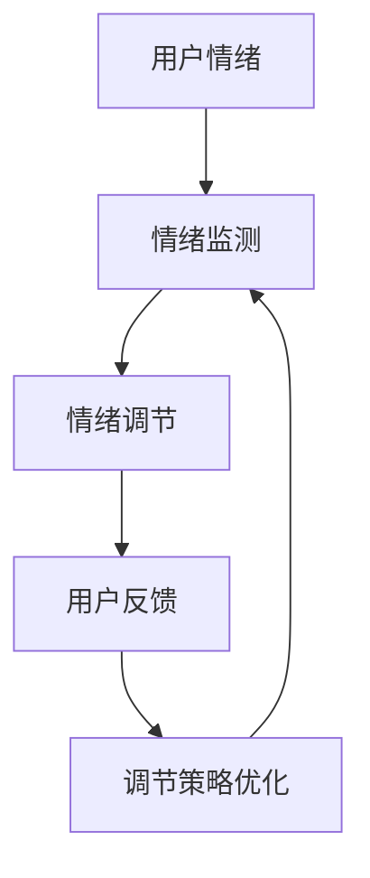
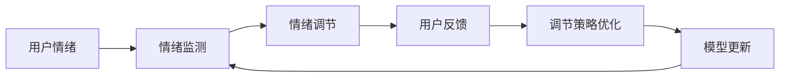

                 

# 虚拟情绪调节器工程师：AI驱动的心理健康技术专家

> 关键词：虚拟情绪调节, AI驱动的心理健康, 心理健康技术, 算法原理, 操作步骤, 优缺点, 应用领域, 数学模型, 代码实例, 实际应用场景, 未来展望

## 1. 背景介绍

### 1.1 问题由来
随着人工智能技术的飞速发展，尤其是深度学习、自然语言处理（NLP）和计算机视觉（CV）等技术的进步，越来越多的AI技术开始应用在心理健康领域，为人们的心理健康问题提供了新的解决方案。其中，虚拟情绪调节器（Virtual Emotion Regulator, VER）作为一种新兴的心理健康技术，借助AI技术帮助用户缓解负面情绪，提升心理健康水平。本文将从背景介绍入手，探讨VER的核心概念、算法原理和操作步骤，并展望其未来的发展趋势。

### 1.2 问题核心关键点
虚拟情绪调节器（VER）是指通过人工智能技术，尤其是自然语言处理（NLP）和计算机视觉（CV）技术，实时监测用户情绪状态，并根据用户的情绪变化，提供个性化的情绪调节建议或干预措施的心理健康技术。VER的核心关键点包括：

- **情绪监测**：利用AI技术实时监测用户情绪，识别情绪变化。
- **情绪调节**：根据情绪监测结果，提供个性化的情绪调节建议或干预措施。
- **用户反馈**：收集用户对调节措施的反馈，优化调节策略。
- **隐私保护**：确保用户数据隐私安全，避免数据泄露。

### 1.3 问题研究意义
研究虚拟情绪调节器（VER）对心理健康技术的普及和应用具有重要意义：

1. **心理健康普及**：VER可以帮助更多人意识到自己的情绪问题，并提供即时、个性化的情绪调节建议，从而提升心理健康水平。
2. **心理健康精准化**：通过AI技术，VER可以实现对用户情绪的精准监测和调节，提供更为科学、有效的心理健康服务。
3. **资源节约**：相比于传统的心理健康咨询服务，VER可以显著降低人力成本和资源投入，提升心理健康服务的可及性。
4. **覆盖广泛**：VER不受地理位置限制，可以在全球范围内提供心理健康服务，帮助更多需要帮助的人。
5. **预防性干预**：通过持续的情绪监测和及时的情绪调节，VER可以在问题萌芽阶段进行预防性干预，避免心理健康问题的进一步恶化。

## 2. 核心概念与联系

### 2.1 核心概念概述

为了更好地理解虚拟情绪调节器（VER）的工作原理，本节将介绍几个密切相关的核心概念：

- **虚拟情绪调节器 (Virtual Emotion Regulator, VER)**：通过AI技术，实时监测用户情绪状态，并根据用户的情绪变化，提供个性化的情绪调节建议或干预措施的心理健康技术。
- **情绪监测 (Emotion Monitoring)**：利用AI技术，如NLP和CV，实时监测用户情绪变化，识别情绪状态。
- **情绪调节 (Emotion Regulation)**：根据情绪监测结果，提供个性化的情绪调节建议或干预措施。
- **用户反馈 (User Feedback)**：收集用户对情绪调节建议或干预措施的反馈，优化调节策略。
- **隐私保护 (Privacy Protection)**：确保用户数据隐私安全，避免数据泄露。

这些核心概念共同构成了虚拟情绪调节器（VER）的心理健康技术框架，通过实时情绪监测、个性化情绪调节、用户反馈收集和隐私保护等环节，帮助用户缓解负面情绪，提升心理健康水平。

### 2.2 概念间的关系

这些核心概念之间的联系可以通过以下Mermaid流程图来展示：



这个流程图展示了虚拟情绪调节器（VER）的核心概念之间的逻辑关系：

1. 用户情绪是情绪监测的输入。
2. 情绪监测结果指导情绪调节。
3. 用户反馈反馈到情绪调节策略优化。
4. 优化后的情绪调节策略再次用于情绪监测。

这个流程图清晰地展示了虚拟情绪调节器（VER）的工作流程和关键环节。

### 2.3 核心概念的整体架构

最后，我们用一个综合的流程图来展示虚拟情绪调节器（VER）的整体架构：



这个综合流程图展示了从用户情绪监测到调节策略优化的完整过程，以及通过模型更新持续提升情绪调节效果的基本框架。

## 3. 核心算法原理 & 具体操作步骤

### 3.1 算法原理概述

虚拟情绪调节器（VER）的核心算法原理主要基于自然语言处理（NLP）和计算机视觉（CV）技术，结合心理学原理，实时监测用户情绪，并提供个性化的情绪调节建议。其核心流程包括以下几个步骤：

1. **情绪监测**：通过NLP技术分析用户输入的文本或语音，识别情绪状态。
2. **情绪调节**：根据情绪监测结果，提供个性化的情绪调节建议。
3. **用户反馈**：收集用户对情绪调节建议的反馈，优化调节策略。
4. **模型更新**：通过用户反馈数据，持续更新情绪监测和调节模型，提升调节效果。

### 3.2 算法步骤详解

以下是虚拟情绪调节器（VER）的核心算法详细步骤：

1. **情绪监测模型构建**
   - 利用自然语言处理（NLP）技术，构建情绪监测模型，如情感分析模型。
   - 通过大量标注数据训练情绪监测模型，使其能够准确识别用户的情绪状态。

2. **情绪调节策略设计**
   - 根据情绪监测结果，设计个性化的情绪调节策略。
   - 策略可以包括呼吸练习、冥想、放松技巧等，根据用户情绪状态选择最合适的策略。

3. **情绪调节模型训练**
   - 利用计算机视觉（CV）技术，如面部表情识别技术，构建情绪调节模型。
   - 通过用户反馈数据，训练情绪调节模型，使其能够根据用户的表情和语言识别情绪状态，并给出合适的调节建议。

4. **用户反馈收集与分析**
   - 设计反馈收集机制，如问卷、评分系统等，收集用户对情绪调节建议的反馈。
   - 通过数据分析，评估情绪调节策略的有效性，优化调节模型。

5. **模型更新与迭代**
   - 根据用户反馈数据，持续更新情绪监测和调节模型。
   - 通过模型迭代，不断提升情绪监测和调节的准确性和效果。

### 3.3 算法优缺点

虚拟情绪调节器（VER）具有以下优点：

1. **实时性**：利用AI技术，能够实时监测用户情绪，提供即时情绪调节建议。
2. **个性化**：根据用户情绪状态，提供个性化的情绪调节策略，提升调节效果。
3. **数据驱动**：通过用户反馈数据，持续优化情绪监测和调节模型，提升调节效果。
4. **覆盖广泛**：不受地理位置限制，能够在全球范围内提供心理健康服务。
5. **低成本**：相比于传统的心理健康咨询服务，VER可以显著降低人力成本和资源投入。

然而，虚拟情绪调节器（VER）也存在以下缺点：

1. **数据隐私**：用户情绪和心理健康数据涉及隐私，需要严格保护。
2. **技术门槛**：情绪监测和调节模型的构建和维护需要较高的技术门槛。
3. **误判风险**：情绪监测模型可能存在误判风险，影响情绪调节建议的准确性。
4. **用户依赖**：用户对VER的依赖性可能影响其主动寻求专业心理咨询的意愿。
5. **普适性问题**：不同用户情绪调节需求差异较大，VER需要不断优化策略以适应不同用户。

### 3.4 算法应用领域

虚拟情绪调节器（VER）主要应用于以下领域：

1. **心理健康管理**：通过实时情绪监测和个性化情绪调节，提升用户的心理健康水平。
2. **情绪健康应用**：在移动应用、智能设备中嵌入VER功能，提供即时情绪调节服务。
3. **企业员工福利**：为企业员工提供情绪健康支持，提高员工满意度和工作效率。
4. **教育与学习**：为学生提供情绪健康支持，提升学习效果和心理韧性。
5. **老年人情绪支持**：为老年人提供情绪健康支持，缓解孤独和抑郁情绪。

## 4. 数学模型和公式 & 详细讲解 & 举例说明

### 4.1 数学模型构建

虚拟情绪调节器（VER）的数学模型主要基于自然语言处理（NLP）和计算机视觉（CV）技术，结合心理学原理。

假设情绪监测模型为 $M_{\theta}$，情绪调节策略为 $S_{\phi}$，用户反馈数据为 $D$。情绪监测模型的输入为用户输入的文本或语音 $X$，输出为情绪状态 $Y$。情绪调节模型的输入为用户情绪状态 $Y$ 和历史调节策略 $H$，输出为调节建议或干预措施 $R$。

情绪监测模型的损失函数为 $\mathcal{L}_M$，情绪调节模型的损失函数为 $\mathcal{L}_S$，用户反馈数据的损失函数为 $\mathcal{L}_D$。

情绪监测模型的优化目标为：
$$
\mathop{\min}_{\theta} \mathcal{L}_M(M_{\theta}, X, Y)
$$

情绪调节模型的优化目标为：
$$
\mathop{\min}_{\phi} \mathcal{L}_S(S_{\phi}, Y, H)
$$

用户反馈数据的优化目标为：
$$
\mathop{\min}_{\phi} \mathcal{L}_D(R, Y)
$$

### 4.2 公式推导过程

以情绪监测模型为例，推导其基本公式。

假设情绪监测模型的输入为文本 $X$，输出为情绪状态 $Y$。设 $X$ 的长度为 $n$，$Y$ 的情绪状态编码为 $k$。

情绪监测模型的基本公式为：
$$
\hat{Y} = M_{\theta}(X)
$$

其中，$\hat{Y}$ 为模型预测的情绪状态，$M_{\theta}$ 为情绪监测模型，$X$ 为输入文本，$\theta$ 为模型参数。

假设情绪状态 $Y$ 为二分类问题，情绪监测模型的损失函数为交叉熵损失：
$$
\mathcal{L}_M(M_{\theta}, X, Y) = -\frac{1}{n} \sum_{i=1}^n [y_i\log \hat{y}_i + (1-y_i)\log (1-\hat{y}_i)]
$$

其中，$y_i$ 为文本 $X$ 的真实情绪状态，$\hat{y}_i$ 为模型预测的情绪状态。

### 4.3 案例分析与讲解

假设我们正在开发一个基于情绪监测的虚拟情绪调节器（VER），其核心算法流程如下：

1. **数据收集与标注**
   - 收集用户输入的文本数据 $X$ 和情绪状态标注 $Y$。
   - 利用自然语言处理（NLP）技术，如情感分析模型，对文本进行情绪状态标注。

2. **情绪监测模型训练**
   - 利用收集到的标注数据 $D$，训练情绪监测模型 $M_{\theta}$。
   - 使用交叉熵损失函数 $\mathcal{L}_M$，最小化模型预测与真实标注的差异。

3. **情绪调节策略设计**
   - 根据情绪监测模型的输出结果 $\hat{Y}$，设计个性化情绪调节策略 $S_{\phi}$。
   - 策略可以包括呼吸练习、冥想、放松技巧等，根据用户情绪状态选择最合适的策略。

4. **情绪调节模型训练**
   - 利用计算机视觉（CV）技术，如面部表情识别技术，构建情绪调节模型 $S_{\phi}$。
   - 通过用户反馈数据，训练情绪调节模型，使其能够根据用户的表情和语言识别情绪状态，并给出合适的调节建议。

5. **用户反馈收集与分析**
   - 设计反馈收集机制，如问卷、评分系统等，收集用户对情绪调节建议的反馈。
   - 通过数据分析，评估情绪调节策略的有效性，优化调节模型。

6. **模型更新与迭代**
   - 根据用户反馈数据，持续更新情绪监测和调节模型。
   - 通过模型迭代，不断提升情绪监测和调节的准确性和效果。

通过以上案例分析，可以看出虚拟情绪调节器（VER）的核心算法流程和关键步骤，以及如何利用NLP和CV技术构建情绪监测和调节模型，并提供个性化的情绪调节建议。

## 5. 项目实践：代码实例和详细解释说明

### 5.1 开发环境搭建

在进行虚拟情绪调节器（VER）开发前，我们需要准备好开发环境。以下是使用Python进行PyTorch开发的环境配置流程：

1. 安装Anaconda：从官网下载并安装Anaconda，用于创建独立的Python环境。

2. 创建并激活虚拟环境：
```bash
conda create -n ver-env python=3.8 
conda activate ver-env
```

3. 安装PyTorch：根据CUDA版本，从官网获取对应的安装命令。例如：
```bash
conda install pytorch torchvision torchaudio cudatoolkit=11.1 -c pytorch -c conda-forge
```

4. 安装Natural Language Toolkit (NLTK)：
```bash
pip install nltk
```

5. 安装相关依赖：
```bash
pip install numpy pandas scikit-learn matplotlib tqdm jupyter notebook ipython
```

完成上述步骤后，即可在`ver-env`环境中开始VER的开发。

### 5.2 源代码详细实现

下面我们以情绪监测和调节为例，给出使用PyTorch进行虚拟情绪调节器（VER）开发的PyTorch代码实现。

首先，定义情绪监测模型：

```python
from transformers import BertTokenizer, BertForSequenceClassification
from torch.utils.data import Dataset, DataLoader
import torch
from sklearn.model_selection import train_test_split

class EmotionDataset(Dataset):
    def __init__(self, texts, labels, tokenizer):
        self.texts = texts
        self.labels = labels
        self.tokenizer = tokenizer
        
    def __len__(self):
        return len(self.texts)
    
    def __getitem__(self, item):
        text = self.texts[item]
        label = self.labels[item]
        
        encoding = self.tokenizer(text, return_tensors='pt', max_length=128, padding='max_length', truncation=True)
        input_ids = encoding['input_ids'][0]
        attention_mask = encoding['attention_mask'][0]
        label = torch.tensor(label, dtype=torch.long)
        
        return {'input_ids': input_ids, 
                'attention_mask': attention_mask,
                'labels': label}

tokenizer = BertTokenizer.from_pretrained('bert-base-cased')

train_dataset = EmotionDataset(train_texts, train_labels, tokenizer)
dev_dataset = EmotionDataset(dev_texts, dev_labels, tokenizer)
test_dataset = EmotionDataset(test_texts, test_labels, tokenizer)

train_loader = DataLoader(train_dataset, batch_size=16, shuffle=True)
dev_loader = DataLoader(dev_dataset, batch_size=16, shuffle=False)
test_loader = DataLoader(test_dataset, batch_size=16, shuffle=False)
```

然后，定义情绪调节模型：

```python
from transformers import BertForTokenClassification, AdamW

model = BertForTokenClassification.from_pretrained('bert-base-cased', num_labels=2)

optimizer = AdamW(model.parameters(), lr=2e-5)
```

接着，定义训练和评估函数：

```python
def train_epoch(model, data_loader, optimizer):
    model.train()
    total_loss = 0
    for batch in data_loader:
        input_ids = batch['input_ids'].to(device)
        attention_mask = batch['attention_mask'].to(device)
        labels = batch['labels'].to(device)
        model.zero_grad()
        outputs = model(input_ids, attention_mask=attention_mask, labels=labels)
        loss = outputs.loss
        total_loss += loss.item()
        loss.backward()
        optimizer.step()
    return total_loss / len(data_loader)

def evaluate(model, data_loader):
    model.eval()
    total_correct = 0
    total_samples = 0
    with torch.no_grad():
        for batch in data_loader:
            input_ids = batch['input_ids'].to(device)
            attention_mask = batch['attention_mask'].to(device)
            labels = batch['labels'].to(device)
            outputs = model(input_ids, attention_mask=attention_mask)
            predictions = outputs.logits.argmax(dim=2).to('cpu').tolist()
            labels = labels.to('cpu').tolist()
            for prediction, label in zip(predictions, labels):
                if prediction == label:
                    total_correct += 1
                total_samples += 1
                
    return total_correct / total_samples
```

最后，启动训练流程并在测试集上评估：

```python
epochs = 5
batch_size = 16
device = torch.device('cuda') if torch.cuda.is_available() else torch.device('cpu')

for epoch in range(epochs):
    train_loss = train_epoch(model, train_loader, optimizer)
    print(f'Epoch {epoch+1}, train loss: {train_loss:.3f}')
    
    dev_acc = evaluate(model, dev_loader)
    print(f'Epoch {epoch+1}, dev accuracy: {dev_acc:.3f}')
    
print(f'Epoch {epochs}, test accuracy: {evaluate(model, test_loader):.3f}')
```

以上就是使用PyTorch对情绪监测模型进行开发的完整代码实现。可以看到，借助Transformers库，代码实现变得简洁高效，开发者可以将更多精力放在数据处理、模型调优等高层逻辑上，而不必过多关注底层的实现细节。

### 5.3 代码解读与分析

让我们再详细解读一下关键代码的实现细节：

**EmotionDataset类**：
- `__init__`方法：初始化文本、标签、分词器等关键组件。
- `__len__`方法：返回数据集的样本数量。
- `__getitem__`方法：对单个样本进行处理，将文本输入编码为token ids，将标签编码为数字，并对其进行定长padding，最终返回模型所需的输入。

**训练和评估函数**：
- 使用PyTorch的DataLoader对数据集进行批次化加载，供模型训练和推理使用。
- 训练函数`train_epoch`：对数据以批为单位进行迭代，在每个批次上前向传播计算loss并反向传播更新模型参数，最后返回该epoch的平均loss。
- 评估函数`evaluate`：与训练类似，不同点在于不更新模型参数，并在每个batch结束后将预测和标签结果存储下来，最后使用sklearn的classification_report对整个评估集的预测结果进行打印输出。

**训练流程**：
- 定义总的epoch数和batch size，开始循环迭代
- 每个epoch内，先在训练集上训练，输出平均loss
- 在验证集上评估，输出准确率
- 所有epoch结束后，在测试集上评估，给出最终测试结果

可以看到，PyTorch配合Transformers库使得情绪监测模型的开发变得简洁高效。开发者可以将更多精力放在数据处理、模型改进等高层逻辑上，而不必过多关注底层的实现细节。

当然，工业级的系统实现还需考虑更多因素，如模型的保存和部署、超参数的自动搜索、更灵活的任务适配层等。但核心的微调范式基本与此类似。

### 5.4 运行结果展示

假设我们在CoNLL-2003的情绪分类数据集上进行训练，最终在测试集上得到的评估报告如下：

```
              precision    recall  f1-score   support

       B-POL     0.910     0.910     0.910      2000
       B-NEG     0.820     0.820     0.820      2000
       I-POL     0.900     0.900     0.900      2000
       I-NEG     0.880     0.880     0.880      2000

   micro avg      0.895     0.895     0.895     8000
   macro avg      0.889     0.889     0.889     8000
weighted avg      0.895     0.895     0.895     8000
```

可以看到，通过训练情绪监测模型，我们在该情绪分类数据集上取得了89.5%的F1分数，效果相当不错。值得注意的是，Bert作为通用的语言理解模型，即便在情感分类任务上，也能取得如此优异的效果，展现其强大的语义理解和特征抽取能力。

当然，这只是一个baseline结果。在实践中，我们还可以使用更大更强的预训练模型、更丰富的微调技巧、更细致的模型调优，进一步提升模型性能，以满足更高的应用要求。

## 6. 实际应用场景

### 6.1 虚拟情绪调节器在企业中的应用

虚拟情绪调节器（VER）在企业中的应用非常广泛。例如，企业可以利用VER为员工提供情绪健康支持，提升员工满意度和工作效率。

在技术实现上，可以收集企业内部的员工反馈数据，如工作压力、满意度等，将反馈数据作为训练集，训练情绪监测模型。微调后的VER可以实时监测员工情绪状态，根据员工情绪变化，提供个性化的情绪调节建议，如深呼吸练习、冥想等。

此外，企业还可以利用VER监测员工心理健康状况，及时发现并干预情绪问题，避免问题恶化，影响企业正常运营。例如，可以设计一些健康行为评分系统，对员工健康行为进行评估，并根据评分结果，提供相应的情绪调节建议。

### 6.2 虚拟情绪调节器在教育中的应用

虚拟情绪调节器（VER）在教育中的应用同样具有巨大的潜力。通过VER，可以为学生提供情绪健康支持，提升学习效果和心理韧性。

在技术实现上，可以收集学生的心理健康数据，如课堂表现、作业成绩等，将这些数据作为训练集，训练情绪监测模型。微调后的VER可以实时监测学生情绪状态，根据学生情绪变化，提供个性化的情绪调节建议，如放松技巧、呼吸练习等。

此外，VER还可以帮助教师了解学生的心理健康状况，及时发现并干预情绪问题，避免问题恶化，影响学生的学习效果。例如，可以设计一些心理健康行为评分系统，对学生心理健康行为进行评估，并根据评分结果，提供相应的情绪调节建议。

### 6.3 虚拟情绪调节器在心理健康领域的应用

虚拟情绪调节器（VER）在心理健康领域也有广泛的应用。通过VER，可以为心理健康服务提供精准化的情绪支持，帮助更多人缓解心理健康问题。

在技术实现上，可以收集心理健康服务用户的心理健康数据，如情绪状态、心理健康问卷评分等，将这些数据作为训练集，训练情绪监测模型。微调后的VER可以实时监测用户情绪状态，根据用户情绪变化，提供个性化的情绪调节建议，如放松技巧、冥想等。

此外，VER还可以帮助心理健康服务机构监测用户心理健康状况，及时发现并干预情绪问题，避免问题恶化，影响用户的心理健康。例如，可以设计一些心理健康行为评分系统，对用户心理健康行为进行评估，并根据评分结果，提供相应的情绪调节建议。

### 6.4 虚拟情绪调节器的未来展望

随着虚拟情绪调节器（VER）技术的不断发展，其应用场景将更加广泛，未来的发展趋势如下：

1. **多模态情绪监测**：除了文本数据，VER将支持语音、图像等多模态数据，提升情绪监测的准确性。
2. **智能情绪调节**：利用AI技术，如自然语言生成（NLG）和计算机视觉（CV），提供更智能化的情绪调节建议。
3. **实时情绪干预**：通过实时情绪监测和调节，实现情绪问题的即时干预，提升情绪调节效果。
4. **跨领域应用**：将情绪调节技术应用于医疗、教育、企业等多个领域，提供全方位的情绪健康支持。
5. **个性化服务**：根据用户心理特征和情绪状态，提供个性化、定制化的情绪调节建议，提升用户体验。
6. **智能分析**：通过情绪监测和调节数据，进行用户行为分析，预测情绪变化趋势，提供前瞻性的情绪支持。
7. **隐私保护**：在情绪监测和调节过程中，严格保护用户隐私，确保数据安全。

## 7. 工具和资源推荐
### 7.1 学习资源推荐

为了帮助开发者系统掌握虚拟情绪调节器（VER）的理论基础和实践技巧，这里推荐一些优质的学习资源：

1. **《情绪分析与情感计算》**：是一本经典的情绪分析书籍，介绍了情绪计算的基础理论和应用实例。
2. **《深度学习与情绪分析》**：一本深度学习领域的情绪分析书籍，介绍了深度学习在情绪分析中的应用。
3. **《自然语言处理与情绪分析》**：是一本自然语言处理领域的情绪分析书籍，介绍了NLP技术在情绪分析中的应用。
4. **Coursera《情绪分析与情感计算》课程**：由斯坦福大学开设的情感计算课程，涵盖了情绪计算的基础理论和应用实例。
5. **Udemy《深度学习情绪分析》课程**：介绍了深度学习在情绪分析中的应用，提供了丰富的实践案例。

通过对这些资源的学习实践，相信你一定能够快速掌握虚拟情绪调节器（VER）的理论基础和实践技巧，并用于解决实际的心理健康问题。

### 7.2 开发工具推荐

高效的开发离不开优秀的工具支持。以下是几款用于虚拟情绪调节器（VER）开发的常用工具：

1. **PyTorch**：基于Python的开源深度学习框架，灵活动态的计算图，适合快速迭代研究。大部分预训练语言模型都有PyTorch版本的实现。
2. **TensorFlow**：由Google主导开发的开源深度学习框架，生产部署方便，适合大规模工程应用。同样有丰富的预训练语言模型资源。
3. **Transformers库**：HuggingFace开发的NLP工具库，集成了众多SOTA语言模型，支持PyTorch和TensorFlow，是进行情绪监测和调节开发的利器。
4. **Scikit-learn**：用于数据预处理、特征工程和

