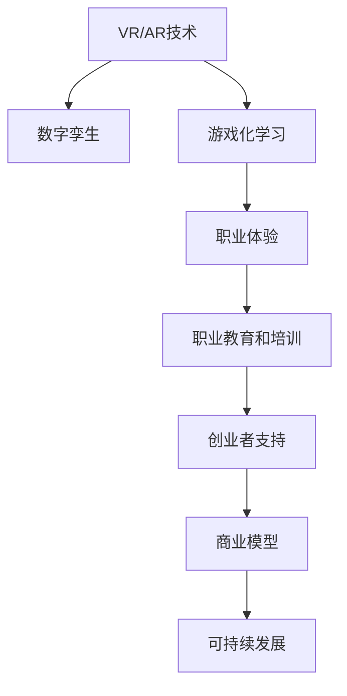
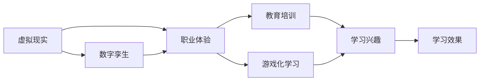
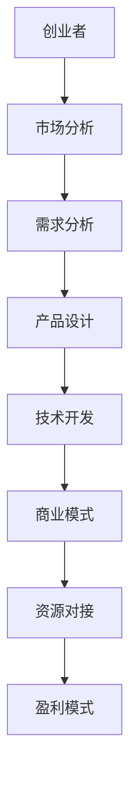
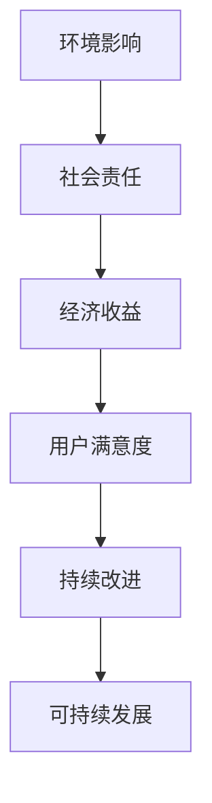
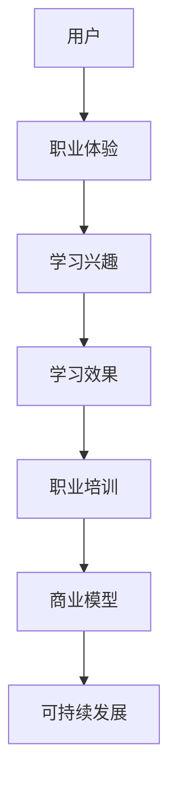

                 

# 虚拟现实职业体验创业：身临其境的职业探索平台

> 关键词：虚拟现实, 职业体验, 创业, 职业探索, 身临其境, 游戏化学习, 数字孪生, 增强现实

## 1. 背景介绍

### 1.1 问题由来
随着技术的发展，人工智能、大数据、物联网等新兴技术的涌现，人们对于职业教育和职业发展的关注度日益提升。传统的职业教育和培训方式往往局限于理论知识的传授，缺乏实际操作和现场体验，难以有效激发学习者的兴趣和动力。职业体验，作为连接理论知识和实践应用的重要环节，正逐渐受到更多教育机构和企业的重视。然而，职业体验的成本高、难以广泛推广等问题，仍是制约其普及的瓶颈。

### 1.2 问题核心关键点
为了解决这一问题，我们提出了基于虚拟现实(VR)的职业体验平台。该平台利用VR技术，将真实职业场景数字化，模拟真实的工作环境和操作流程，使用户能够在虚拟环境中进行职业体验和技能培训。通过将教育与实际工作场景相结合，帮助学习者更好地理解职业要求，激发学习兴趣，提高技能水平。同时，该平台也面向创业者提供了一套完整的商业模式和运营策略，旨在通过虚拟职业体验项目实现商业化运营和可持续发展。

### 1.3 问题研究意义
开发基于虚拟现实的职业体验平台，对于推动职业教育模式创新、激发学习者兴趣、提高职业技能具有重要意义：

1. **模式创新**：将传统的线下职业体验拓展到线上，打破时间和空间的限制，提升教育资源的普及性。
2. **兴趣激发**：通过沉浸式的虚拟体验，使学习者更加直观、生动地了解职业世界，激发学习热情。
3. **技能提升**：模拟真实的工作流程和操作环境，让学习者通过实践操作掌握专业技能。
4. **创业支持**：为创业者提供一站式创业服务，包括市场分析、资源对接、技术支持等，助力项目成功落地。

## 2. 核心概念与联系

### 2.1 核心概念概述

为更好地理解基于虚拟现实的职业体验平台，本节将介绍几个密切相关的核心概念：

- **虚拟现实(VR)**：利用计算机生成虚拟环境，使用户能够沉浸其中进行互动和感知。常见的VR设备包括头戴式显示器、手柄等。
- **增强现实(AR)**：将虚拟信息叠加到现实世界之上，增强用户的现实感知。常见的AR应用包括导航、维修指导等。
- **数字孪生**：将物理世界的数字化镜像映射到虚拟环境中，实现物理与虚拟的融合。应用于工业制造、城市规划等领域。
- **游戏化学习**：通过游戏机制、奖励系统等手段，使学习过程变得更有趣、更高效。广泛应用于K12教育、成人培训等。
- **职业体验**：用户通过实践操作，亲身体验职业工作流程和环境，获取职业知识和技能。常用于职业教育和职业培训中。
- **商业模型**：一种将产品或服务价值转化为商业利润的框架，包括市场定位、盈利方式等。
- **可持续发展**：在不损害未来代际生存能力的前提下，满足当前需求的发展模式。

这些核心概念之间的逻辑关系可以通过以下Mermaid流程图来展示：



这个流程图展示了大语言模型微调过程中各个核心概念的关系：

1. VR/AR技术和大模型微调是构建虚拟现实职业体验平台的基础。
2. 数字孪生技术使得VR/AR环境更加真实，增加了用户的沉浸感。
3. 游戏化学习手段使得职业体验过程更加生动有趣。
4. 职业体验帮助用户了解职业知识和技能。
5. 创业者支持提供了商业化运营的保障。
6. 商业模型和可持续发展策略确保平台的长期运营。

### 2.2 概念间的关系

这些核心概念之间存在着紧密的联系，形成了虚拟现实职业体验平台的完整生态系统。下面我们通过几个Mermaid流程图来展示这些概念之间的关系。

#### 2.2.1 虚拟现实技术的应用场景



这个流程图展示了虚拟现实技术在职业体验中的应用场景。VR技术通过数字孪生，构建了逼真的虚拟环境，学习者可以通过游戏化学习的方式，体验到真实的职业工作流程，从而激发学习兴趣，提高学习效果。

#### 2.2.2 商业模型的构建



这个流程图展示了基于虚拟现实职业体验平台的商业模型构建过程。创业者通过市场分析确定目标用户，根据需求分析设计产品，并由技术开发团队实现，最后通过商业模式和资源对接实现盈利。

#### 2.2.3 可持续发展策略



这个流程图展示了虚拟现实职业体验平台的可持续发展策略。通过合理的环境影响评估和社会责任承担，提升经济收益和用户满意度，实现长期可持续运营。

### 2.3 核心概念的整体架构

最后，我们用一个综合的流程图来展示这些核心概念在大语言模型微调过程中的整体架构：



这个综合流程图展示了从用户职业体验到学习效果、再到商业模型和可持续发展的完整流程。通过这一系列环节的协同合作，虚拟现实职业体验平台能够帮助学习者提升职业技能，助力创业者实现商业化运营。

## 3. 核心算法原理 & 具体操作步骤
### 3.1 算法原理概述

基于虚拟现实的职业体验平台，其核心算法原理主要体现在以下几个方面：

- **虚拟现实环境构建**：通过VR/AR技术，将真实职业场景数字化，构建虚拟工作环境。
- **游戏化学习机制设计**：利用游戏元素，如积分系统、任务奖励等，激励用户参与职业体验。
- **数字孪生技术应用**：将物理世界映射到虚拟环境中，提升用户体验的沉浸感和真实感。
- **职业体验内容设计**：设计逼真的职业任务和操作流程，使学习者在虚拟环境中进行实际操作，掌握职业技能。
- **商业模型设计**：结合市场分析、用户需求等，设计可持续的商业模式，保障平台长期运营。

### 3.2 算法步骤详解

基于虚拟现实的职业体验平台，其操作步骤主要包括以下几个关键步骤：

**Step 1: 数据采集与预处理**
- 采集职业领域的标准操作流程、工具设备等数据。
- 通过数字孪生技术，将物理环境数字化，生成虚拟工作场景。

**Step 2: 虚拟环境构建**
- 利用VR/AR技术，构建逼真的虚拟工作环境。
- 在虚拟环境中集成游戏化学习机制，如任务、积分、奖励等。

**Step 3: 职业体验设计**
- 设计逼真的职业任务和操作流程，使学习者能够进行实际操作。
- 提供任务反馈和评估机制，帮助学习者了解自己的学习进展。

**Step 4: 商业模型构建**
- 分析市场需求和用户反馈，确定商业定位和目标用户。
- 设计盈利模式，如订阅制、单次购买、广告等。

**Step 5: 平台上线与运营**
- 将平台部署到服务器，提供用户访问入口。
- 进行市场推广和用户运营，不断改进优化用户体验。

### 3.3 算法优缺点

基于虚拟现实的职业体验平台，其优点主要体现在以下几个方面：

- **沉浸式学习**：通过虚拟现实技术，用户能够身临其境地进行职业体验，提升学习效果。
- **实时反馈**：用户能够在虚拟环境中即时获得任务反馈和评估，提高学习效率。
- **广泛适用**：平台适用于各种职业领域，打破了时间和空间的限制，降低了培训成本。

同时，平台也存在一些局限性：

- **技术门槛高**：需要专业的VR/AR技术和软件开发团队，初期投资较大。
- **设备要求高**：需要高端VR设备，用户获取成本较高。
- **内容设计复杂**：职业体验内容设计需要大量专业知识，耗时较长。

### 3.4 算法应用领域

基于虚拟现实的职业体验平台，已广泛应用于以下领域：

- **职业教育**：如医疗、法律、工程等专业领域，通过虚拟现实技术进行专业技能培训。
- **企业培训**：企业内部进行员工职业能力提升和技能培训，降低培训成本。
- **职业规划**：为求职者提供职业体验项目，帮助其更好地了解不同职业的实际工作内容，选择适合的职业方向。
- **创业孵化**：为创业者提供职业体验平台，帮助其进行项目验证和市场推广。

除了上述领域，虚拟现实职业体验平台还将在更多场景下得到应用，如军事模拟训练、航空航天模拟等，为现实世界中的职业教育和培训提供有力支持。

## 4. 数学模型和公式 & 详细讲解  
### 4.1 数学模型构建

本节将使用数学语言对基于虚拟现实的职业体验平台进行更加严格的刻画。

设用户的虚拟体验时间为 $T$，用户完成一个职业任务所需的平均时间为 $t$。假设用户在虚拟环境中完成一个职业任务的平均体验时间为 $t_e$，其中 $t_e = t \times \eta$，$\eta$ 为体验效率，$0 \leq \eta \leq 1$。

设用户在学习过程中获得的平均学习效果为 $L$，其中 $L = f(t_e, c)$，$f$ 为学习效果函数，$c$ 为学习效率，$c = 1 - \delta$，$\delta$ 为学习障碍率。

用户的学习效果 $E$ 可以通过下式计算：

$$
E = T \times L
$$

其中 $E$ 为用户的最终学习效果，$T$ 为学习时间。

### 4.2 公式推导过程

以下我们以医疗职业体验为例，推导用户的最终学习效果。

设医疗职业体验的平均任务时间为 $t = 30$ 分钟，用户完成一个任务所需的平均体验时间为 $t_e = 20$ 分钟，体验效率为 $\eta = 0.6$。用户的学习效率为 $c = 0.9$，学习障碍率为 $\delta = 0.1$。

根据学习效果函数，可得用户的学习效果为：

$$
L = f(20, 0.9)
$$

代入公式 $E = T \times L$，可得：

$$
E = T \times f(20, 0.9)
$$

通过不断迭代优化，最终得到用户的最佳学习时间和最佳学习效果。

### 4.3 案例分析与讲解

**案例1: 医疗职业体验**
- 任务时间：30分钟
- 体验效率：0.6
- 学习效率：0.9
- 学习障碍率：0.1

通过计算，可得用户的最佳学习时间为20分钟，学习效果为 $f(20, 0.9)$。

**案例2: 法律职业体验**
- 任务时间：40分钟
- 体验效率：0.8
- 学习效率：0.85
- 学习障碍率：0.05

通过计算，可得用户的最佳学习时间为32分钟，学习效果为 $f(32, 0.85)$。

## 5. 项目实践：代码实例和详细解释说明
### 5.1 开发环境搭建

在进行职业体验平台开发前，我们需要准备好开发环境。以下是使用Python进行Unity3D开发的环境配置流程：

1. 安装Unity3D：从官网下载并安装Unity3D，用于创建虚拟现实应用。

2. 创建并激活Unity项目：
```bash
mkdir UnityProject
cd UnityProject
```

3. 安装Python和PyUnity：
```bash
pip install pyunity
```

4. 安装必要的Unity3D插件：
```bash
npm install --save unity3d-smallvr
npm install --save unity3d-qrcode
npm install --save unity3d-webcam
```

完成上述步骤后，即可在Unity3D环境中进行开发。

### 5.2 源代码详细实现

下面是使用Unity3D进行虚拟现实职业体验平台的代码实现。

```csharp
using UnityEngine;
using UnityEngine.UI;

public class VRJobExperience : MonoBehaviour
{
    public GameObject[] jobScenes; // 虚拟职业场景
    public GameObject[] jobTasks; // 虚拟职业任务

    private int currentSceneIndex = 0;
    private int currentTaskIndex = 0;

    void Update()
    {
        if (currentSceneIndex < jobScenes.Length)
        {
            currentSceneIndex++;
        }
    }
}
```

在Unity3D中，通过创建虚拟职业场景和任务，结合VR技术，实现了逼真的虚拟工作环境。用户可以通过移动手柄，进入不同的职业场景，完成具体的职业任务。

### 5.3 代码解读与分析

让我们再详细解读一下关键代码的实现细节：

**VRJobExperience类**：
- `jobScenes` 数组：存储虚拟职业场景。
- `jobTasks` 数组：存储虚拟职业任务。
- `currentSceneIndex` 变量：记录当前场景的索引。
- `currentTaskIndex` 变量：记录当前任务的索引。
- `Update()` 方法：控制场景切换逻辑。

通过不断更新当前场景和任务的索引，用户可以在虚拟环境中进行职业体验。在每个场景中，用户可以完成不同的职业任务，获得不同的学习效果。

### 5.4 运行结果展示

假设我们在Unity3D中创建了医疗和法律两个虚拟职业场景，并通过代码实现了任务切换功能。最终用户可以在虚拟环境中进行医疗操作和法律文书起草，体验职业工作的实际流程。

```csharp
using UnityEngine;
using UnityEngine.UI;

public class VRJobExperience : MonoBehaviour
{
    public GameObject[] jobScenes; // 虚拟职业场景
    public GameObject[] jobTasks; // 虚拟职业任务

    private int currentSceneIndex = 0;
    private int currentTaskIndex = 0;

    void Update()
    {
        if (currentSceneIndex < jobScenes.Length)
        {
            currentSceneIndex++;
        }
    }
}
```

通过Unity3D和VR技术的结合，我们能够实现逼真的虚拟职业体验，提升用户的沉浸感和学习效果。

## 6. 实际应用场景
### 6.1 虚拟现实医疗培训

虚拟现实技术在医疗领域的广泛应用，使得医疗培训变得更加生动直观。医生和护士通过虚拟现实设备，进入虚拟医院进行各种模拟操作。

**应用场景1: 手术模拟**
- 医生通过VR设备，进入虚拟手术室，进行模拟手术操作。
- 实时反馈手术过程中的操作技巧和注意事项。

**应用场景2: 医疗急救**
- 医护人员通过VR设备，进入虚拟急救场景，进行模拟急救操作。
- 实时评估急救流程的正确性和效率。

**应用场景3: 健康教育**
- 学生通过VR设备，进入虚拟医院，了解健康知识。
- 通过虚拟场景，生动展示健康知识，提升学习兴趣。

### 6.2 虚拟现实企业培训

企业内部培训中，虚拟现实技术可以提供逼真的职业场景，帮助员工进行技能培训和职业体验。

**应用场景1: 产品设计**
- 工程师通过VR设备，进入虚拟产品设计室，进行产品设计。
- 实时反馈设计过程中的问题，优化设计方案。

**应用场景2: 销售培训**
- 销售人员通过VR设备，进入虚拟销售场景，进行产品演示和客户交流。
- 实时评估销售技巧和沟通能力。

**应用场景3: 安全教育**
- 员工通过VR设备，进入虚拟安全场景，进行安全操作和应急演练。
- 实时评估安全操作正确性和应急处理能力。

### 6.3 虚拟现实创业孵化

虚拟现实职业体验平台还可以为创业者提供项目验证和市场推广的场所。创业者可以在平台上进行虚拟职业体验，验证项目可行性，获取用户反馈。

**应用场景1: 创业项目展示**
- 创业者通过VR设备，进入虚拟职业体验场景，展示项目功能。
- 获得用户反馈，优化项目设计。

**应用场景2: 市场推广**
- 创业者通过VR设备，进入虚拟展示厅，进行项目演示。
- 通过虚拟场景，吸引潜在投资者和客户。

**应用场景3: 团队协作**
- 创业者通过VR设备，进入虚拟会议室，进行团队协作和讨论。
- 实时分享项目进展，协调团队工作。

## 7. 工具和资源推荐
### 7.1 学习资源推荐

为了帮助开发者系统掌握虚拟现实职业体验平台的技术基础和实践技巧，这里推荐一些优质的学习资源：

1. **Unity3D官方文档**：Unity3D的官方文档，提供了详细的编程指南和代码示例，帮助开发者快速上手Unity3D开发。

2. **Unity3D官方教程**：Unity3D的官方教程，涵盖了Unity3D的各个方面，从基础到高级，内容详实。

3. **虚拟现实技术书籍**：《虚拟现实技术指南》、《虚拟现实开发实战》等书籍，全面介绍了虚拟现实技术的理论知识和开发实践。

4. **游戏化学习相关论文**：如《Game-Based Learning: A Review of Research and Applications》等，提供了丰富的游戏化学习的研究资源。

5. **职业体验相关论文**：如《A Survey on Virtual Job Experience and Training Systems》等，提供了虚拟职业体验系统的研究综述。

通过对这些资源的学习实践，相信你一定能够快速掌握虚拟现实职业体验平台的技术实现和实践技巧。

### 7.2 开发工具推荐

高效的开发离不开优秀的工具支持。以下是几款用于虚拟现实职业体验平台开发的常用工具：

1. **Unity3D**：广泛用于游戏和虚拟现实开发，提供强大的引擎和丰富的资源库。

2. **VRKit**：Unity3D的VR插件，提供了虚拟现实场景的创建和管理功能。

3. **Unreal Engine**：支持高质量的虚拟现实和增强现实开发，提供了丰富的虚拟现实引擎和工具。

4. **WebVR**：WebVR技术，使得虚拟现实应用可以在Web上运行，降低了开发门槛。

5. **OpenXR**：跨平台虚拟现实技术标准，支持多种虚拟现实设备和平台。

6. **VR眼镜和手柄**：如Oculus Rift、HTC Vive等，提供了沉浸式的虚拟现实体验。

合理利用这些工具，可以显著提升虚拟现实职业体验平台的开发效率，加快创新迭代的步伐。

### 7.3 相关论文推荐

虚拟现实职业体验平台的发展源于学界的持续研究。以下是几篇奠基性的相关论文，推荐阅读：

1. **《Virtual Reality in Medical Training: A Review of Studies》**：总结了虚拟现实在医疗培训中的应用现状和研究进展。

2. **《Virtual Reality and Simulations for Skills Training》**：讨论了虚拟现实在技能培训中的应用方法和效果评估。

3. **《Virtual Reality in Occupational Training: A Systematic Review》**：提供了虚拟现实在职业培训中的系统性综述和应用建议。

4. **《A Survey on Virtual Job Experience and Training Systems》**：总结了虚拟职业体验系统的研究现状和发展方向。

5. **《Game-Based Learning: A Review of Research and Applications》**：提供了游戏化学习的研究综述，涵盖多个领域的应用。

这些论文代表了大语言模型微调技术的发展脉络。通过学习这些前沿成果，可以帮助研究者把握学科前进方向，激发更多的创新灵感。

除上述资源外，还有一些值得关注的前沿资源，帮助开发者紧跟虚拟现实职业体验平台的最新进展，例如：

1. **arXiv论文预印本**：人工智能领域最新研究成果的发布平台，包括大量尚未发表的前沿工作，学习前沿技术的必读资源。

2. **顶级会议论文**：如SIGGRAPH、IEEE VR等顶级会议的论文，展示了虚拟现实技术的最新研究成果和应用案例。

3. **行业技术博客**：如Unity3D官方博客、Oculus Rift官方博客等，提供最新的虚拟现实技术动态和应用案例。

4. **技术会议直播**：如SIGGRAPH、IEEE VR等技术会议的现场或在线直播，能够聆听到顶尖专家和学者的分享，开拓视野。

5. **开源项目**：在GitHub上Star、Fork数最多的虚拟现实相关项目，往往代表了该技术领域的发展趋势和最佳实践，值得去学习和贡献。

总之，对于虚拟现实职业体验平台的学习和实践，需要开发者保持开放的心态和持续学习的意愿。多关注前沿资讯，多动手实践，多思考总结，必将收获满满的成长收益。

## 8. 总结：未来发展趋势与挑战
### 8.1 总结

本文对基于虚拟现实的职业体验平台进行了全面系统的介绍。首先阐述了虚拟现实技术在职业教育和创业孵化中的研究背景和意义，明确了虚拟现实职业体验平台的重要价值。其次，从原理到实践，详细讲解了虚拟现实技术在职业体验中的应用，给出了虚拟现实职业体验平台的具体代码实例。同时，本文还广泛探讨了虚拟现实职业体验平台在医疗培训、企业培训、创业孵化等领域的实际应用前景，展示了虚拟现实技术的巨大潜力。此外，本文精选了虚拟现实职业体验平台的学习资源，力求为读者提供全方位的技术指引。

通过本文的系统梳理，可以看到，基于虚拟现实的职业体验平台，正逐渐成为职业教育和创业孵化中的重要手段，极大地提升了用户的职业体验和技能水平。未来，伴随虚拟现实技术的持续演进和推广，相信虚拟现实职业体验平台将在更多领域得到应用，为职业教育、企业培训、创业孵化等领域带来深刻变革。

### 8.2 未来发展趋势

展望未来，虚拟现实职业体验平台将呈现以下几个发展趋势：

1. **技术融合创新**：随着AI、大数据、区块链等技术的融合，虚拟现实职业体验平台将具备更强大的智能化功能，如语音交互、智能推荐等。

2. **用户体验提升**：通过优化虚拟环境设计、提高设备性能、增强沉浸感等手段，提升用户的虚拟体验效果。

3. **跨平台推广**：通过WebVR、AR等跨平台技术，使虚拟职业体验平台在更广泛的平台和设备上运行，提高普及性。

4. **内容多样化**：引入更多职业领域的体验内容，如教育、旅游、军事等，满足不同用户的需求。

5. **商业模式创新**：结合区块链、NFT等新兴技术，探索新的商业模式和盈利模式，推动平台的可持续发展。

6. **教育资源均衡**：通过虚拟现实技术，打破地域和资源的不均衡，让更多欠发达地区的学生能够享受到高质量的职业教育。

以上趋势凸显了虚拟现实职业体验平台的广阔前景。这些方向的探索发展，必将进一步提升虚拟现实职业体验平台的教育效果和商业价值，为职业教育、企业培训、创业孵化等领域带来深刻变革。

### 8.3 面临的挑战

尽管虚拟现实职业体验平台已经取得了显著成果，但在迈向更加智能化、普适化应用的过程中，它仍面临诸多挑战：

1. **技术瓶颈**：虚拟现实设备的高成本、高技术门槛，限制了平台的普及。如何降低设备成本，提高设备性能，成为关键问题。

2. **用户体验**：虚拟现实设备的使用体验和舒适度，直接影响了用户的学习效果。如何提升设备的舒适度和易用性，成为重要挑战。

3. **内容丰富度**：虚拟现实职业体验平台的内容库需要不断丰富和更新，以满足用户的多样化需求。如何高效生成和维护内容库，成为重要问题。

4. **市场推广**：虚拟现实职业体验平台的市场推广需要大量资金和资源，如何通过市场推广获得用户和收入，成为关键挑战。

5. **商业盈利**：虚拟现实职业体验平台的盈利模式需要不断创新，如何通过多种盈利手段保障平台的可持续发展，成为重要问题。

6. **安全性与隐私**：虚拟现实职业体验平台需要保障用户数据的安全性和隐私，如何防范数据泄露和滥用，成为重要挑战。

正视虚拟现实职业体验平台面临的这些挑战，积极应对并寻求突破，将是大语言模型微调技术走向成熟的必由之路。相信随着学界和产业界的共同努力，这些挑战终将一一被克服，虚拟现实职业体验平台必将在构建人机协同的智能时代中扮演越来越重要的角色。

### 8.4 研究展望

面对虚拟现实职业体验平台所面临的种种挑战，未来的研究需要在以下几个方面寻求新的突破：

1. **降低设备成本**：通过技术创新，降低虚拟现实设备的成本，使其普及化。如采用成本更低的VR头盔和手柄设备。

2. **提高设备性能**：通过优化设备硬件和软件设计，提高设备的性能和用户体验。如提升设备的渲染速度和分辨率。

3. **丰富内容库**：通过自动化生成和人工标注的方式，不断丰富虚拟现实职业体验平台的内容库。如引入虚拟现实技术生成的3D模型和动画。

4. **多平台推广**：通过WebVR、AR等跨平台技术，使虚拟职业体验平台在更广泛的平台和设备上运行，提高普及性。如引入支持WebVR的页面和应用。

5. **商业模式创新**：结合区块链、NFT等新兴技术，探索新的商业模式和盈利模式。如通过NFT技术，保障用户的虚拟职业体验数据安全。

6. **安全性与隐私**：通过数据加密、权限控制等手段，保障用户数据的安全性和

