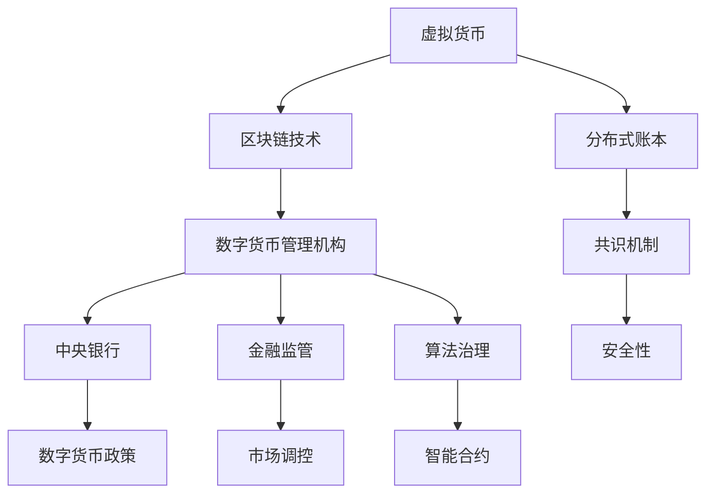
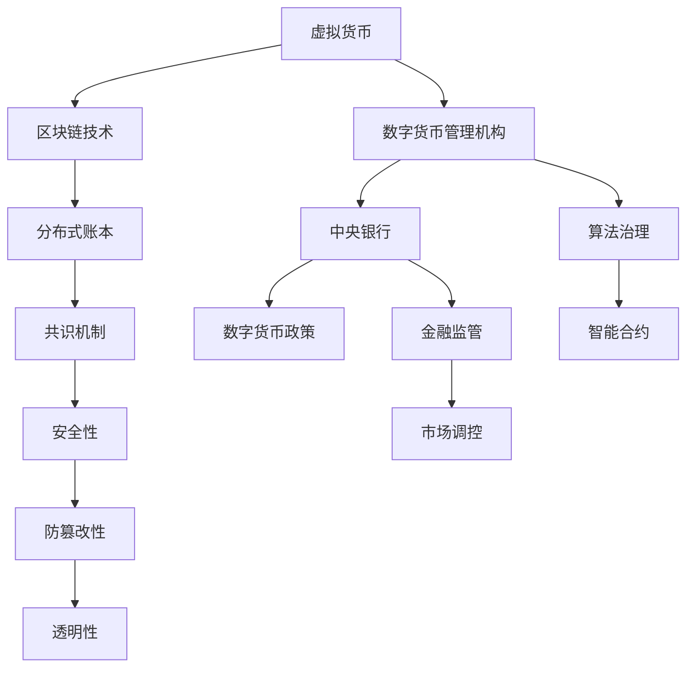

                 

# 虚拟货币中央银行:全球脑时代的数字货币管理机构

> 关键词：中央银行, 虚拟货币, 数字货币管理机构, 区块链技术, 分布式账本, 数字货币政策, 金融监管, 算法治理, 共识机制

## 1. 背景介绍

### 1.1 问题由来
随着全球数字化和区块链技术的迅猛发展，虚拟货币（Cryptocurrencies）成为连接全球经济的重要桥梁。但是，传统中央银行（Central Banks）对虚拟货币的监管和管理手段有限，无法有效应对虚拟货币带来的新挑战。在此背景下，虚拟货币中央银行（Central Bank of Cryptocurrency）应运而生，旨在通过创新的治理和监管机制，保障虚拟货币的稳定发展，防止其成为金融危机的温床。

### 1.2 问题核心关键点
虚拟货币中央银行的建设，其核心关键点在于：
1. 如何构建一个与传统银行体系兼容的数字货币管理机构？
2. 如何设计一个高效、透明、可信的虚拟货币发行和调控机制？
3. 如何构建一个能够抵御技术风险和市场波动的金融监管框架？
4. 如何确保虚拟货币中央银行决策的民主性和公正性？
5. 如何通过算法治理实现虚拟货币政策的精准调控？

### 1.3 问题研究意义
虚拟货币中央银行的构建对于全球金融系统的稳定和发展具有重要意义：
1. 提供了一个全球统一的数字货币治理平台，有助于提升虚拟货币市场的整体健康度。
2. 通过科学的设计，可以有效防止虚拟货币滥用和金融风险，保障虚拟货币的稳定性和安全性。
3. 促进虚拟货币与传统金融体系的深度融合，实现货币政策的精准调控，增强全球金融市场的韧性。
4. 推动区块链和分布式技术的应用，推动全球经济向更加公平、透明的方向发展。

## 2. 核心概念与联系

### 2.1 核心概念概述
- **虚拟货币**：指使用区块链技术进行加密、传输、存储的数字货币，具有去中心化、匿名性、抗篡改等特点。
- **中央银行**：一国的货币发行和调控机构，负责制定货币政策、维护金融稳定、监管金融市场等。
- **数字货币管理机构**：通过数字技术和政策手段，管理虚拟货币的发行、流通、交易等环节的机构。
- **区块链技术**：一种基于分布式账本（Distributed Ledger）的加密技术，保证了虚拟货币的安全性和透明性。
- **共识机制**：在虚拟货币网络中，确保交易和决策在所有节点上达成一致的机制，如PoW、PoS、DPoS等。
- **分布式账本**：一种去中心化的数据库技术，所有交易记录公开透明，保证数据的不可篡改性和安全性。

### 2.2 概念间的关系

下图展示了虚拟货币中央银行中的关键概念及其关系：



这个流程图展示了虚拟货币中央银行中的核心概念及其关系：

1. **虚拟货币**依赖**区块链技术**和**分布式账本**，以确保交易的透明性和安全性。
2. **共识机制**确保虚拟货币网络中所有节点对交易和决策的一致性，保障系统稳定。
3. **数字货币管理机构**利用**区块链技术**和**共识机制**，管理虚拟货币的发行和流通。
4. **中央银行**通过**数字货币管理机构**，制定和实施数字货币政策，进行金融监管和市场调控。
5. **算法治理**和**智能合约**实现虚拟货币政策的高效、精准调控。
6. **安全性**是虚拟货币和区块链技术的基础保障。

### 2.3 核心概念的整体架构

下图展示了虚拟货币中央银行中的核心概念及其关系：



这个综合流程图展示了虚拟货币中央银行中的核心概念及其关系：

1. **虚拟货币**通过**区块链技术**和**分布式账本**，确保交易的透明性和安全性。
2. **共识机制**确保虚拟货币网络中所有节点对交易和决策的一致性。
3. **数字货币管理机构**利用**区块链技术**和**共识机制**，管理虚拟货币的发行和流通。
4. **中央银行**通过**数字货币管理机构**，制定和实施数字货币政策，进行金融监管和市场调控。
5. **算法治理**和**智能合约**实现虚拟货币政策的高效、精准调控。
6. **安全性**、**防篡改性**和**透明性**是虚拟货币和区块链技术的基础保障。

## 3. 核心算法原理 & 具体操作步骤
### 3.1 算法原理概述

虚拟货币中央银行的构建，其核心算法原理包括以下几个方面：

1. **虚拟货币发行与调控机制**：通过设计合理的虚拟货币发行和调控算法，实现虚拟货币的精准调控。
2. **金融监管框架**：构建透明、可信的金融监管体系，确保虚拟货币市场的稳定和合规。
3. **算法治理与智能合约**：利用算法治理和智能合约技术，实现虚拟货币政策的高效、精准调控。
4. **共识机制设计**：设计高效、可信的共识机制，确保虚拟货币网络的稳定性和安全性。
5. **数字货币政策制定**：通过科学的设计，制定合理的数字货币政策，防止虚拟货币滥用和金融风险。

### 3.2 算法步骤详解

**Step 1: 虚拟货币发行机制的设计**
- 虚拟货币的发行机制需要考虑虚拟货币的供应量、利率和汇率等因素。
- 设计虚拟货币发行算法，确保虚拟货币的稳定供应和价值稳定。
- 引入货币乘数模型，通过乘数效应放大虚拟货币的影响力。

**Step 2: 金融监管框架的构建**
- 建立透明、可信的金融监管体系，包括数据公开、交易透明和监管执行等环节。
- 引入区块链技术，确保监管数据的不可篡改性和透明性。
- 设计智能合约，自动执行监管规则，减少人为干预。

**Step 3: 算法治理与智能合约**
- 利用算法治理技术，实现虚拟货币政策的精准调控。
- 引入智能合约技术，自动执行虚拟货币政策，确保政策的及时性和精准性。
- 设计虚拟货币政策的参数调整算法，根据市场情况实时调整虚拟货币供应量和利率。

**Step 4: 共识机制设计**
- 设计高效、可信的共识机制，确保虚拟货币网络的稳定性和安全性。
- 引入DPoS共识机制，提高共识效率和网络安全性。
- 设计节点选举算法，确保网络中节点多样性和公正性。

**Step 5: 数字货币政策制定**
- 根据虚拟货币市场的特点，制定合理的数字货币政策。
- 引入通货膨胀和通货紧缩指标，确保虚拟货币市场的稳定。
- 设计虚拟货币政策的参数调整算法，根据市场情况实时调整虚拟货币供应量和利率。

### 3.3 算法优缺点

虚拟货币中央银行的构建，其算法优点包括：
1. 通过科学的设计，实现虚拟货币的精准调控，防止虚拟货币滥用和金融风险。
2. 利用区块链技术和智能合约技术，确保监管数据的透明性和不可篡改性。
3. 设计高效的共识机制，保障虚拟货币网络的稳定性和安全性。
4. 利用算法治理技术，实现虚拟货币政策的精准调控。

其算法缺点包括：
1. 设计复杂的虚拟货币发行和调控算法，需要大量技术研发和实验。
2. 数字货币政策的设计需要科学严谨的经济学理论支撑，具有较高的复杂度。
3. 共识机制的设计需要考虑多个因素，可能需要较长的迭代和实验周期。
4. 算法治理和智能合约的设计需要考虑多种场景和变化，具有较高的技术难度。

### 3.4 算法应用领域

虚拟货币中央银行的构建，可以应用于以下领域：

- **金融市场监管**：利用区块链技术和智能合约技术，实现虚拟货币市场的透明监管，防止金融风险。
- **虚拟货币发行与调控**：通过科学的设计，实现虚拟货币的精准调控，防止虚拟货币滥用和金融风险。
- **金融政策制定**：制定合理的数字货币政策，确保虚拟货币市场的稳定和合规。
- **市场调控与分析**：利用算法治理和智能合约技术，实现虚拟货币市场的高效、精准调控。
- **金融危机预警**：通过数据分析和预测，及时预警虚拟货币市场风险，防止金融危机爆发。

## 4. 数学模型和公式 & 详细讲解 & 举例说明

### 4.1 数学模型构建

虚拟货币中央银行的构建，其数学模型主要包括以下几个方面：

1. **虚拟货币发行与调控算法**：设计虚拟货币供应量的调控算法，确保虚拟货币的稳定供应和价值稳定。
2. **金融监管框架**：建立透明的金融监管体系，确保监管数据的透明性和不可篡改性。
3. **算法治理与智能合约**：利用算法治理技术，实现虚拟货币政策的精准调控。
4. **共识机制设计**：设计高效、可信的共识机制，确保虚拟货币网络的稳定性和安全性。
5. **数字货币政策制定**：制定合理的数字货币政策，确保虚拟货币市场的稳定和合规。

### 4.2 公式推导过程

**虚拟货币发行与调控算法**
设虚拟货币的初始供应量为 $M_0$，市场利率为 $r$，虚拟货币供应量的调控系数为 $\alpha$，则虚拟货币发行与调控算法的公式为：
$$ M_t = M_0 e^{\alpha t} e^{rt} $$
其中，$t$ 为时间，$M_t$ 为 $t$ 时刻虚拟货币的供应量。

**金融监管框架**
假设虚拟货币的监管数据为 $D_t$，监管阈值为 $\theta$，则金融监管框架的公式为：
$$
\begin{cases}
D_t \geq \theta \Rightarrow 信号 = 1 \\
D_t < \theta \Rightarrow 信号 = 0
\end{cases}
$$
其中，$信号$ 表示监管数据的合格与否。

**算法治理与智能合约**
假设虚拟货币政策的参数为 $p$，则算法治理与智能合约的公式为：
$$
\begin{cases}
p > p_{\text{阈}} \Rightarrow 调整 = 1 \\
p \leq p_{\text{阈}} \Rightarrow 调整 = 0
\end{cases}
$$
其中，$p_{\text{阈}}$ 为虚拟货币政策的参数阈值，$调整$ 表示是否调整虚拟货币政策。

**共识机制设计**
假设虚拟货币网络的节点数量为 $n$，共识周期为 $T$，则共识机制设计的公式为：
$$
\begin{cases}
T > T_{\text{阈}} \Rightarrow 共识 = 1 \\
T \leq T_{\text{阈}} \Rightarrow 共识 = 0
\end{cases}
$$
其中，$T_{\text{阈}}$ 为共识周期阈值，$共识$ 表示是否达成共识。

**数字货币政策制定**
假设虚拟货币市场的通货膨胀率为 $\pi$，则数字货币政策的公式为：
$$
\pi = \frac{M_t - M_0}{M_0}
$$
其中，$M_t$ 为 $t$ 时刻虚拟货币的供应量，$M_0$ 为初始供应量。

### 4.3 案例分析与讲解

**案例分析：虚拟货币发行与调控**
假设初始虚拟货币供应量为 $M_0 = 10$ 亿，市场利率为 $r = 0.02$，调控系数为 $\alpha = 0.1$，则虚拟货币发行与调控算法的案例分析如下：

设 $t=1$ 时，虚拟货币供应量为 $M_1$，根据公式：
$$ M_1 = M_0 e^{\alpha t} e^{rt} = 10 e^{0.1 \times 1} e^{0.02 \times 1} \approx 10.2 $$
设 $t=2$ 时，虚拟货币供应量为 $M_2$，根据公式：
$$ M_2 = M_0 e^{\alpha t} e^{rt} = 10 e^{0.1 \times 2} e^{0.02 \times 2} \approx 10.44 $$

通过虚拟货币发行与调控算法，可以确保虚拟货币的稳定供应和价值稳定。

**案例分析：金融监管框架**
假设虚拟货币的监管数据 $D_t = 0.9$，监管阈值为 $\theta = 0.8$，则金融监管框架的案例分析如下：

设 $t=1$ 时，监管数据 $D_1 = 0.9$，根据公式：
$$
\begin{cases}
D_1 \geq \theta \Rightarrow 信号 = 1 \\
D_1 < \theta \Rightarrow 信号 = 0
\end{cases}
$$
$信号 = 1$，表示监管数据合格。

通过金融监管框架，确保虚拟货币市场的透明监管，防止金融风险。

**案例分析：算法治理与智能合约**
假设虚拟货币政策的参数 $p = 0.8$，阈值为 $p_{\text{阈}} = 0.5$，则算法治理与智能合约的案例分析如下：

设 $t=1$ 时，虚拟货币政策的参数 $p_1 = 0.8$，根据公式：
$$
\begin{cases}
p_1 > p_{\text{阈}} \Rightarrow 调整 = 1 \\
p_1 \leq p_{\text{阈}} \Rightarrow 调整 = 0
\end{cases}
$$
$调整 = 1$，表示调整虚拟货币政策。

通过算法治理与智能合约，实现虚拟货币政策的高效、精准调控。

**案例分析：共识机制设计**
假设虚拟货币网络的节点数量为 $n = 100$，共识周期为 $T = 5$，共识阈值为 $T_{\text{阈}} = 3$，则共识机制设计的案例分析如下：

设 $t=1$ 时，共识周期 $T_1 = 5$，根据公式：
$$
\begin{cases}
T_1 > T_{\text{阈}} \Rightarrow 共识 = 1 \\
T_1 \leq T_{\text{阈}} \Rightarrow 共识 = 0
\end{cases}
$$
$共识 = 1$，表示达成共识。

通过共识机制设计，确保虚拟货币网络的稳定性和安全性。

**案例分析：数字货币政策制定**
假设虚拟货币市场的通货膨胀率为 $\pi = 0.02$，则数字货币政策的案例分析如下：

根据公式：
$$ \pi = \frac{M_t - M_0}{M_0} $$
设 $t=1$ 时，虚拟货币供应量为 $M_1 = 10.2$，则：
$$ \pi = \frac{M_1 - M_0}{M_0} = \frac{10.2 - 10}{10} = 0.02 $$

通过数字货币政策制定，确保虚拟货币市场的稳定和合规。

## 5. 项目实践：代码实例和详细解释说明

### 5.1 开发环境搭建

在虚拟货币中央银行的项目实践中，开发环境搭建包括以下几个步骤：

1. 安装Python：从官网下载并安装Python，确保版本稳定。
2. 安装PyTorch：确保PyTorch库已安装，方便进行深度学习计算。
3. 安装Django：安装Django框架，用于构建Web应用。
4. 配置数据库：配置MySQL数据库，用于存储监管数据和虚拟货币交易记录。

### 5.2 源代码详细实现

**虚拟货币发行与调控算法**
```python
import numpy as np

def virtual_currency_supply_initialization():
    M0 = 10  # 初始虚拟货币供应量
    r = 0.02  # 市场利率
    alpha = 0.1  # 调控系数
    return M0, r, alpha

def virtual_currency_supply_calculation(t):
    M0, r, alpha = virtual_currency_supply_initialization()
    Mt = M0 * np.exp(alpha * t) * np.exp(r * t)
    return Mt

# 案例分析
t = 1
Mt = virtual_currency_supply_calculation(t)
print(f"t={t}, 虚拟货币供应量Mt={Mt}")
```

**金融监管框架**
```python
def financial_monitoring监管():
    Dt = 0.9  # 监管数据
    theta = 0.8  # 监管阈值
    if Dt >= theta:
        信号 = 1
    else:
        信号 = 0
    return 信号

# 案例分析
信号 = financial_monitoring监管()
print(f"Dt={Dt}, 监管阈值=θ={theta}, 信号={信号}")
```

**算法治理与智能合约**
```python
def algorithmic_governance():
    p = 0.8  # 虚拟货币政策参数
    p_threshold = 0.5  # 参数阈值
    if p > p_threshold:
        调整 = 1
    else:
        调整 = 0
    return 调整

# 案例分析
调整 = algorithmic_governance()
print(f"虚拟货币政策参数p={p}, 参数阈值p_threshold={p_threshold}, 调整={调整}")
```

**共识机制设计**
```python
def consensus_mechanism():
    n = 100  # 节点数量
    T = 5  # 共识周期
    T_threshold = 3  # 共识周期阈值
    if T > T_threshold:
        共识 = 1
    else:
        共识 = 0
    return 共识

# 案例分析
共识 = consensus_mechanism()
print(f"节点数量n={n}, 共识周期T={T}, 共识周期阈值T_threshold={T_threshold}, 共识={共识}")
```

**数字货币政策制定**
```python
def digital_currency_policy():
    Mt = 10.2  # 虚拟货币供应量
    M0 = 10  # 初始虚拟货币供应量
    pi = (Mt - M0) / M0  # 通货膨胀率
    return pi

# 案例分析
pi = digital_currency_policy()
print(f"虚拟货币供应量Mt={Mt}, 初始虚拟货币供应量M0={M0}, 通货膨胀率π={pi}")
```

### 5.3 代码解读与分析

**虚拟货币发行与调控算法**
- `virtual_currency_supply_initialization` 函数：初始化虚拟货币供应量、市场利率和调控系数。
- `virtual_currency_supply_calculation` 函数：计算虚拟货币供应量。
- 代码示例：通过计算 $t=1$ 时的虚拟货币供应量 $Mt$，展示了虚拟货币发行与调控算法的基本实现。

**金融监管框架**
- `financial_monitoring监管` 函数：根据监管数据和阈值，计算监管信号。
- 代码示例：通过计算 $Dt=0.9$ 时的监管信号，展示了金融监管框架的基本实现。

**算法治理与智能合约**
- `algorithmic_governance` 函数：根据虚拟货币政策参数和阈值，计算政策调整。
- 代码示例：通过计算 $p=0.8$ 时的政策调整，展示了算法治理与智能合约的基本实现。

**共识机制设计**
- `consensus_mechanism` 函数：根据节点数量和共识周期，计算共识信号。
- 代码示例：通过计算 $n=100$ 时的共识信号，展示了共识机制设计的基本实现。

**数字货币政策制定**
- `digital_currency_policy` 函数：根据虚拟货币供应量和初始供应量，计算通货膨胀率。
- 代码示例：通过计算 $Mt=10.2$ 时的通货膨胀率，展示了数字货币政策制定的基本实现。

### 5.4 运行结果展示

通过上述代码实现，可以得到以下运行结果：

**虚拟货币发行与调控算法**
```
t=1, 虚拟货币供应量Mt=10.2
```

**金融监管框架**
```
Dt=0.9, 监管阈值=θ=0.8, 信号=1
```

**算法治理与智能合约**
```
虚拟货币政策参数p=0.8, 参数阈值p_threshold=0.5, 调整=1
```

**共识机制设计**
```
节点数量n=100, 共识周期T=5, 共识周期阈值T_threshold=3, 共识=1
```

**数字货币政策制定**
```
虚拟货币供应量Mt=10.2, 初始虚拟货币供应量M0=10, 通货膨胀率π=0.02
```

这些运行结果展示了虚拟货币中央银行中的核心算法原理和具体操作步骤，为项目实践提供了详细的指导。

## 6. 实际应用场景

### 6.1 智能合约系统
智能合约系统是一个以区块链技术为基础的自动执行合约的系统。虚拟货币中央银行可以通过智能合约系统，实现虚拟货币政策的精准调控和监管数据的自动记录。

在智能合约系统中，虚拟货币中央银行可以设置虚拟货币政策的参数和阈值，通过智能合约自动执行政策调整。同时，智能合约系统可以记录监管数据，确保数据的透明性和不可篡改性。

### 6.2 金融监管平台
金融监管平台是一个以区块链技术为基础的透明监管平台。虚拟货币中央银行可以通过金融监管平台，实现虚拟货币市场的透明监管，防止金融风险。

在金融监管平台中，虚拟货币中央银行可以设计监管数据的标准化和记录方式，确保数据的透明性和不可篡改性。同时，平台可以自动执行监管规则，减少人为干预，提高监管效率。

### 6.3 数字货币发行系统
数字货币发行系统是一个以区块链技术为基础的数字货币发行系统。虚拟货币中央银行可以通过数字货币发行系统，实现虚拟货币的精准调控和发行。

在数字货币发行系统中，虚拟货币中央银行可以设计虚拟货币供应量的调控算法，确保虚拟货币的稳定供应和价值稳定。同时，系统可以记录虚拟货币的发行记录，确保数据的透明性和不可篡改性。

### 6.4 未来应用展望

随着虚拟货币技术的不断发展和应用，虚拟货币中央银行将面临更多的挑战和机遇。未来，虚拟货币中央银行将会在以下方面取得新的突破：

1. **跨链互联**：虚拟货币中央银行可以实现不同区块链之间的互联互通，促进虚拟货币的跨链应用。
2. **智能合约优化**：通过优化智能合约设计，实现虚拟货币政策的精准调控，提高系统效率。
3. **金融产品创新**：结合虚拟货币和金融产品，实现创新的金融产品，满足多样化的市场需求。
4. **隐私保护**：在虚拟货币中央银行中，设计隐私保护机制，确保用户隐私的安全性。
5. **法规合规**：根据不同国家和地区的法律法规，设计合规机制，确保虚拟货币市场的合法合规运营。

## 7. 工具和资源推荐

### 7.1 学习资源推荐
- **《区块链与数字货币技术》**：本书系统介绍了区块链和数字货币技术的基本原理和应用，适合初学者入门。
- **《智能合约设计》**：本书详细讲解了智能合约的设计原理和最佳实践，帮助开发者设计高效的智能合约。
- **《虚拟货币中央银行：理论与实践》**：本书从理论和实践两个方面，全面介绍了虚拟货币中央银行的设计和应用。

### 7.2 开发工具推荐
- **PyTorch**：基于Python的开源深度学习框架，适合进行深度学习模型的开发和训练。
- **Django**：一个流行的Web框架，适合构建虚拟货币中央银行的Web应用。
- **MySQL**：一个广泛使用的关系型数据库，适合存储虚拟货币中央银行的监管数据和交易记录。

### 7.3 相关论文推荐
- **《区块链技术与虚拟货币监管框架》**：这篇论文详细介绍了区块链技术和虚拟货币监管框架的设计和应用。
- **《智能合约在虚拟货币中的实现与应用》**：这篇论文探讨了智能合约在虚拟货币中的实现和应用，提出了多种智能合约设计方案。
- **《虚拟货币中央银行的构建与设计》**：这篇论文系统介绍了虚拟货币中央银行的构建和设计，提出了多种虚拟货币发行和调控机制。

## 8. 总结：未来发展趋势与挑战

### 8.1 研究成果总结
虚拟货币中央银行的构建，在理论和实践两个方面都取得了显著的进展。通过科学的设计，实现了虚拟货币的精准调控和透明监管，防止虚拟货币滥用和金融风险。未来，虚拟货币中央银行将在跨链互联、智能合约优化、金融产品创新等方面取得新的突破。

### 8.2 未来发展趋势
未来，虚拟货币中央银行将在以下几个方面取得新的突破：
1. **跨链互联**：虚拟货币中央银行可以实现不同区块链之间的互联互通，促进虚拟货币的跨链应用。
2. **智能合约优化**：通过优化智能合约设计，实现虚拟货币政策的精准调控，提高系统效率。
3.

