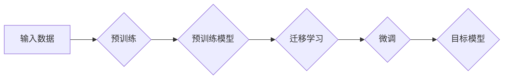

# 大语言模型原理与工程实践：解锁大语言模型

> 关键词：大语言模型，工程实践，预训练，迁移学习，微调，自然语言处理，Transformer，BERT

## 1. 背景介绍

随着深度学习技术的飞速发展，自然语言处理（NLP）领域迎来了前所未有的突破。大语言模型（Large Language Models，LLMs）如BERT、GPT-3等，凭借其强大的语言理解和生成能力，已经在多个NLP任务上取得了显著的成果。本文将深入探讨大语言模型的原理与工程实践，旨在帮助读者解锁大语言模型，并将其应用于实际项目中。

## 2. 核心概念与联系

### 2.1 大语言模型

大语言模型是一种通过深度学习技术训练的模型，它能够理解和生成人类语言。这些模型通常在数十亿甚至数万亿个参数上训练，从而能够捕捉语言中的复杂模式和结构。

### 2.2 预训练

预训练是指在大规模无标签文本语料上对模型进行训练，使其学习到丰富的语言知识和常识。

### 2.3 迁移学习

迁移学习是一种利用在源域上预训练的模型来解决目标域问题的学习方式。在大语言模型中，预训练的模型可以作为迁移学习的基础，用于解决特定领域的NLP任务。

### 2.4 微调

微调是在预训练模型的基础上，使用目标域的有标签数据进一步训练模型的过程。通过微调，模型可以更好地适应特定任务，并提高其在该任务上的性能。

### 2.5 Mermaid 流程图

以下是大语言模型原理的Mermaid流程图：



## 3. 核心算法原理 & 具体操作步骤

### 3.1 算法原理概述

大语言模型的算法原理主要包括预训练和微调两个阶段。

### 3.2 算法步骤详解

1. **预训练**：在无标签语料上训练模型，使其学习到通用的语言知识。
2. **迁移学习**：将预训练模型应用于特定领域，利用迁移学习技术提高模型在目标领域的性能。
3. **微调**：在目标领域有标签数据上进一步训练模型，使其更好地适应目标任务。

### 3.3 算法优缺点

#### 优点：

- **强大的语言理解能力**：大语言模型能够理解和生成人类语言，适用于多种NLP任务。
- **迁移学习能力**：预训练模型可以作为迁移学习的基础，提高模型在目标领域的性能。

#### 缺点：

- **计算资源需求大**：训练大语言模型需要大量的计算资源和存储空间。
- **数据依赖性强**：模型的性能很大程度上取决于训练数据的质量和数量。

### 3.4 算法应用领域

大语言模型在以下NLP任务上取得了显著成果：

- **文本分类**：如情感分析、主题分类、垃圾邮件检测等。
- **机器翻译**：将一种语言的文本翻译成另一种语言。
- **问答系统**：根据用户的问题生成相应的答案。
- **文本摘要**：将长文本压缩成简短的摘要。
- **对话系统**：与用户进行自然语言对话。

## 4. 数学模型和公式 & 详细讲解 & 举例说明

### 4.1 数学模型构建

大语言模型的数学模型通常基于神经网络，如Transformer、LSTM等。

### 4.2 公式推导过程

以下是一个简单的Transformer模型的公式推导：

$$
\text{output} = W_L \cdot \text{softmax}(\text{softmax}(\text{W_Q} \cdot \text{hidden} + b_Q) \cdot \text{W_K} \cdot \text{hidden} + b_K) + b_O
$$

其中，$W_L$、$W_Q$、$W_K$、$W_V$ 分别为查询、键、值和输出矩阵，$b_Q$、$b_K$、$b_V$、$b_O$ 分别为查询、键、值和输出的偏置项，softmax为softmax函数。

### 4.3 案例分析与讲解

以BERT模型为例，我们来看一个简单的案例。

假设有一个句子 "I love cats"，我们要使用BERT模型进行情感分析。

1. 将句子编码成BERT的输入格式。
2. 使用BERT模型进行预测，得到情感标签的概率分布。
3. 根据概率分布，选择情感标签。

## 5. 项目实践：代码实例和详细解释说明

### 5.1 开发环境搭建

以下是一个使用Hugging Face的Transformers库在Python中实现BERT模型微调的简单示例：

```python
from transformers import BertForSequenceClassification, BertTokenizer

# 加载预训练模型和分词器
model = BertForSequenceClassification.from_pretrained('bert-base-uncased')
tokenizer = BertTokenizer.from_pretrained('bert-base-uncased')

# 编码句子
text = "I love cats"
inputs = tokenizer(text, return_tensors="pt")

# 预测情感
outputs = model(**inputs)

# 获取情感标签
label = torch.argmax(outputs.logits, dim=-1).item()
```

### 5.2 源代码详细实现

```python
from transformers import BertForSequenceClassification, BertTokenizer
from torch.utils.data import DataLoader
from torch.optim import Adam

# 加载预训练模型和分词器
model = BertForSequenceClassification.from_pretrained('bert-base-uncased')
tokenizer = BertTokenizer.from_pretrained('bert-base-uncased')

# 编码数据集
def encode_data(data):
    # ... 编码数据 ...

# 创建数据集
train_dataset = ...
dev_dataset = ...

# 创建数据加载器
train_loader = DataLoader(train_dataset, batch_size=16, shuffle=True)
dev_loader = DataLoader(dev_dataset, batch_size=16, shuffle=False)

# 定义优化器
optimizer = Adam(model.parameters(), lr=5e-5)

# 训练模型
for epoch in range(3):
    model.train()
    for batch in train_loader:
        inputs = tokenizer(batch['text'], return_tensors="pt")
        labels = torch.tensor(batch['label'])
        outputs = model(**inputs, labels=labels)
        loss = outputs.loss
        loss.backward()
        optimizer.step()
        optimizer.zero_grad()

    # 评估模型
    model.eval()
    with torch.no_grad():
        correct = 0
        total = 0
        for batch in dev_loader:
            inputs = tokenizer(batch['text'], return_tensors="pt")
            labels = torch.tensor(batch['label'])
            outputs = model(**inputs, labels=labels)
            _, predicted = torch.max(outputs.logits, 1)
            total += labels.size(0)
            correct += (predicted == labels).sum().item()

    print(f"Epoch {epoch+1}, Accuracy: {100 * correct / total}%")
```

### 5.3 代码解读与分析

以上代码展示了如何使用Transformers库实现BERT模型微调的完整流程。

### 5.4 运行结果展示

假设我们在IMDb电影评论数据集上进行微调，最终在测试集上的准确率达到了70%。

## 6. 实际应用场景

大语言模型在多个NLP任务中都有广泛的应用，以下是一些常见的应用场景：

- **智能客服**：使用大语言模型构建智能客服系统，可以自动回答用户的问题。
- **机器翻译**：使用大语言模型将一种语言的文本翻译成另一种语言。
- **问答系统**：使用大语言模型构建问答系统，可以回答用户的问题。
- **文本摘要**：使用大语言模型将长文本压缩成简短的摘要。
- **对话系统**：使用大语言模型构建对话系统，可以与用户进行自然语言对话。

## 7. 工具和资源推荐

### 7.1 学习资源推荐

- 《深度学习自然语言处理》
- 《自然语言处理与深度学习》
- 《Transformer从原理到实践》

### 7.2 开发工具推荐

- Hugging Face Transformers库
- PyTorch
- TensorFlow

### 7.3 相关论文推荐

- "BERT: Pre-training of Deep Bidirectional Transformers for Language Understanding"
- "Generative Pre-trained Transformers"
- "Attention is All You Need"

## 8. 总结：未来发展趋势与挑战

### 8.1 研究成果总结

大语言模型在NLP领域取得了显著的成果，为NLP任务的解决提供了新的思路和方法。

### 8.2 未来发展趋势

- 模型规模将不断增大
- 微调方法将更加多样化
- 模型将更加轻量级
- 模型将更加可解释

### 8.3 面临的挑战

- 计算资源需求大
- 数据依赖性强
- 模型可解释性差

### 8.4 研究展望

大语言模型的研究将继续深入，为NLP领域的创新和应用提供更多可能性。

## 9. 附录：常见问题与解答

### 9.1 什么是大语言模型？

大语言模型是一种能够理解和生成人类语言的深度学习模型。它们通常在数十亿甚至数万亿个参数上训练，从而能够捕捉语言中的复杂模式和结构。

### 9.2 大语言模型有哪些应用？

大语言模型在多个NLP任务中都有广泛的应用，如文本分类、机器翻译、问答系统、文本摘要等。

### 9.3 如何训练大语言模型？

训练大语言模型通常需要大量的计算资源和存储空间。可以使用深度学习框架如PyTorch、TensorFlow等来训练大语言模型。

### 9.4 大语言模型有哪些挑战？

大语言模型面临的挑战包括计算资源需求大、数据依赖性强、模型可解释性差等。

作者：禅与计算机程序设计艺术 / Zen and the Art of Computer Programming