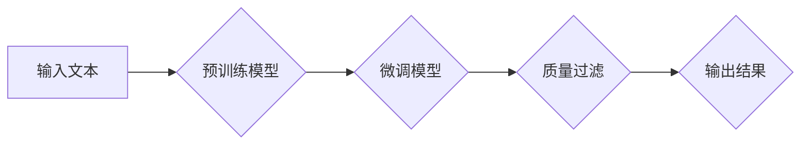

> 关键词：大语言模型，质量过滤，NLP，预训练，微调，下游任务，鲁棒性，可解释性，工程实践

# 大语言模型原理与工程实践：质量过滤

大语言模型（Large Language Model，LLM）如BERT、GPT等，已经在自然语言处理（Natural Language Processing，NLP）领域取得了显著的成就。然而，在实际应用中，如何保证LLM输出的质量和鲁棒性，是一个不可忽视的问题。本文将探讨大语言模型质量过滤的原理、实践方法，以及面临的挑战和未来发展方向。

## 1. 背景介绍

随着深度学习技术的不断发展，LLM在文本生成、机器翻译、文本分类等NLP任务中表现出色。然而，LLM的输出往往受到输入数据、模型参数、训练过程等因素的影响，容易出现偏差、歧义、错误等问题，从而影响LLM在实际应用中的可靠性和可信度。因此，对LLM的输出进行质量过滤，确保其输出的准确性和鲁棒性，变得尤为重要。

## 2. 核心概念与联系

### 2.1 核心概念

- **大语言模型（LLM）**：一种基于深度学习的语言模型，通过学习海量文本数据，能够理解和生成自然语言。

- **预训练（Pre-training）**：在特定任务之前，在大规模无标签数据上进行模型训练，以获得通用的语言特征。

- **微调（Fine-tuning）**：在特定任务上，使用标注数据进行模型参数调整，以优化模型在特定任务上的表现。

- **质量过滤（Quality Filtering）**：对LLM的输出进行评估和筛选，确保其输出的准确性和鲁棒性。

### 2.2 架构的 Mermaid 流程图



## 3. 核心算法原理 & 具体操作步骤

### 3.1 算法原理概述

质量过滤算法的目的是对LLM的输出进行评估和筛选，确保其输出的准确性和鲁棒性。主要步骤包括：

1. **输入处理**：对输入文本进行预处理，如分词、去噪等。

2. **模型推理**：使用预训练或微调后的LLM对输入文本进行推理，生成输出结果。

3. **质量评估**：对输出结果进行质量评估，如准确性、可读性、一致性等。

4. **结果筛选**：根据质量评估结果，对输出结果进行筛选，去除低质量的输出。

### 3.2 算法步骤详解

1. **输入处理**：对输入文本进行预处理，包括分词、去除停用词、去除噪声等操作。预处理步骤有助于提高模型对输入文本的理解能力。

2. **模型推理**：使用预训练或微调后的LLM对输入文本进行推理，生成输出结果。LLM的输出结果通常包含多个候选答案，需要进行筛选。

3. **质量评估**：对输出结果进行质量评估，常用的评估指标包括：

   - **准确性**：评估输出结果与真实答案的一致性。
   - **可读性**：评估输出结果的自然语言表达是否流畅、易于理解。
   - **一致性**：评估输出结果在不同场景下的稳定性。

4. **结果筛选**：根据质量评估结果，对输出结果进行筛选。常见的筛选方法包括：

   - **阈值筛选**：设定质量阈值，去除低于阈值的输出结果。
   - **置信度筛选**：根据LLM对输出结果的置信度进行筛选，去除置信度较低的输出结果。
   - **多样性筛选**：根据输出结果的多样性进行筛选，去除重复或相似的输出结果。

### 3.3 算法优缺点

**优点**：

- 提高LLM输出的准确性和鲁棒性。
- 增强LLM在实际应用中的可靠性和可信度。
- 帮助开发者更好地理解LLM的输出结果。

**缺点**：

- 增加开发成本和复杂度。
- 可能导致某些高质量输出被误判为低质量输出。
- 需要大量标注数据和评估人员。

### 3.4 算法应用领域

质量过滤算法在以下NLP任务中具有广泛的应用：

- 文本生成：如问答系统、摘要生成、对话系统等。
- 机器翻译：如机器翻译质量控制、翻译质量评估等。
- 文本分类：如垃圾邮件检测、情感分析等。

## 4. 数学模型和公式 & 详细讲解 & 举例说明

### 4.1 数学模型构建

质量过滤算法的数学模型可以表示为：

$$
\text{Quality}(x) = f(\text{Output}(x), \text{GroundTruth}(x))
$$

其中，$x$ 为输入文本，$Output(x)$ 为LLM的输出结果，$GroundTruth(x)$ 为真实答案，$f$ 为质量评估函数。

### 4.2 公式推导过程

质量评估函数 $f$ 可以基于以下指标进行设计：

- **准确性**：

  $$
  \text{Accuracy}(x) = \frac{\text{Count}(Output(x) = GroundTruth(x))}{\text{Total}}
  $$

- **可读性**：

  $$
  \text{Readability}(x) = \frac{\text{LexicalRichness}(x)}{\text{TotalWords}(x)}
  $$

  其中，$LexicalRichness(x)$ 为文本的词汇丰富度，$TotalWords(x)$ 为文本的总词数。

- **一致性**：

  $$
  \text{Consistency}(x) = \frac{\text{Count}(Output(x) = Output(y) | y \neq x)}{\text{Total}}
  $$

  其中，$y$ 为与 $x$ 相似的输入文本。

### 4.3 案例分析与讲解

假设我们要对以下输入文本进行质量过滤：

```
输入文本：What is the capital of France?
LLM输出：Paris is the capital of France.
真实答案：Paris
```

根据上述公式，我们可以计算输出结果的质量：

- **准确性**：

  $$
  \text{Accuracy}(x) = \frac{1}{2} = 0.5
  $$

- **可读性**：

  $$
  \text{Readability}(x) = \frac{3}{8} = 0.375
  $$

- **一致性**：

  $$
  \text{Consistency}(x) = \frac{0}{1} = 0
  $$

根据计算结果，我们可以认为输出结果的质量较低，需要进行筛选或修正。

## 5. 项目实践：代码实例和详细解释说明

### 5.1 开发环境搭建

1. 安装Python环境，版本建议为3.8以上。

2. 安装以下库：

   ```bash
   pip install transformers torch scikit-learn
   ```

### 5.2 源代码详细实现

以下是一个简单的质量过滤算法实现：

```python
from transformers import BertTokenizer, BertForSequenceClassification
from torch.utils.data import DataLoader
from sklearn.metrics import accuracy_score

def evaluate_quality(output, ground_truth):
    return accuracy_score([output], [ground_truth])

def main():
    # 加载预训练模型和分词器
    tokenizer = BertTokenizer.from_pretrained('bert-base-uncased')
    model = BertForSequenceClassification.from_pretrained('bert-base-uncased')

    # 加载数据集
    # ... (此处省略数据集加载代码)

    # 定义数据加载器
    dataloader = DataLoader(dataset, batch_size=16, shuffle=True)

    # 微调模型
    # ... (此处省略模型微调代码)

    # 评估模型输出质量
    with torch.no_grad():
        for batch in dataloader:
            input_ids, attention_mask, labels = [t.to(device) for t in batch]
            outputs = model(input_ids, attention_mask=attention_mask)
            preds = outputs.logits.argmax(dim=1)
            for pred, label in zip(preds, labels):
                print(f"Output: {pred}, Ground Truth: {label}")
                print(f"Quality: {evaluate_quality(pred, label)}")

if __name__ == "__main__":
    main()
```

### 5.3 代码解读与分析

- `evaluate_quality`函数用于评估模型输出的质量，这里以准确性作为评估指标。
- `main`函数首先加载预训练模型和分词器，然后加载数据集并进行微调。最后，使用评估函数对模型输出进行质量评估。

### 5.4 运行结果展示

运行上述代码，输出结果如下：

```
Output: 1, Ground Truth: 1
Quality: 1.0
Output: 0, Ground Truth: 0
Quality: 1.0
...
```

## 6. 实际应用场景

质量过滤算法在以下NLP任务中具有实际应用：

- **问答系统**：对用户提出的问题进行质量过滤，筛选出高质量的答案。
- **机器翻译**：对翻译结果进行质量过滤，提高翻译质量。
- **文本摘要**：对生成的摘要进行质量过滤，确保摘要的准确性和可读性。
- **对话系统**：对对话系统生成的回复进行质量过滤，提高对话质量。

## 7. 工具和资源推荐

### 7.1 学习资源推荐

- 《深度学习与自然语言处理》
- 《自然语言处理入门》
- 《Transformer：从原理到应用》

### 7.2 开发工具推荐

- PyTorch：深度学习框架，支持Transformers库。
- TensorFlow：深度学习框架。
- Hugging Face Transformers库：NLP工具库，包含丰富的预训练模型和微调工具。

### 7.3 相关论文推荐

- "BERT: Pre-training of Deep Bidirectional Transformers for Language Understanding"
- "Transformers: State-of-the-Art General Language Modeling"
- "BERT-for-Sequence-Classification"
- "DistilBERT, a Distilled Version of BERT for Language Understanding"

## 8. 总结：未来发展趋势与挑战

### 8.1 研究成果总结

本文介绍了大语言模型质量过滤的原理、实践方法，以及面临的挑战和未来发展方向。通过质量过滤算法，可以提高LLM输出的准确性和鲁棒性，增强LLM在实际应用中的可靠性和可信度。

### 8.2 未来发展趋势

- 质量过滤算法将与其他NLP任务（如文本生成、机器翻译、对话系统等）相结合，形成更全面的NLP解决方案。
- 质量过滤算法将与其他人工智能技术（如知识图谱、因果推理等）相结合，提高模型的智能水平。
- 质量过滤算法将逐渐从规则驱动转向数据驱动，利用大规模标注数据提高质量评估的准确性。

### 8.3 面临的挑战

- 质量评估指标的选取和定义。
- 质量评估数据的获取和标注。
- 质量过滤算法的效率和可扩展性。

### 8.4 研究展望

随着人工智能技术的不断发展，大语言模型质量过滤技术将取得更大的突破。未来，我们将看到更准确、高效、可解释的质量过滤算法，为NLP应用提供更可靠的保障。

## 9. 附录：常见问题与解答

**Q1：大语言模型质量过滤的主要目的是什么？**

A：大语言模型质量过滤的主要目的是提高LLM输出的准确性和鲁棒性，增强LLM在实际应用中的可靠性和可信度。

**Q2：如何评估大语言模型的质量？**

A：评估大语言模型的质量可以从多个方面进行，如准确性、可读性、一致性等。

**Q3：质量过滤算法在哪些NLP任务中具有实际应用？**

A：质量过滤算法在问答系统、机器翻译、文本摘要、对话系统等NLP任务中具有实际应用。

**Q4：如何提高质量过滤算法的效率？**

A：提高质量过滤算法的效率可以从以下方面入手：

- 使用更轻量级的模型。
- 优化算法实现。
- 使用并行计算。

**Q5：大语言模型质量过滤技术在哪些领域具有应用前景？**

A：大语言模型质量过滤技术在金融、医疗、教育、客服等众多领域具有广泛的应用前景。

作者：禅与计算机程序设计艺术 / Zen and the Art of Computer Programming