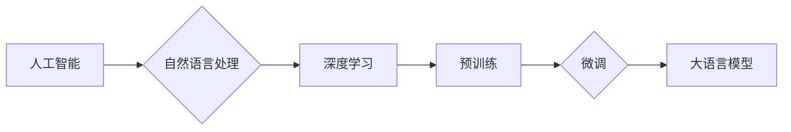

# 大语言模型应用指南：从人工智能的起源到大语言模型

> 关键词：人工智能，大语言模型，自然语言处理，深度学习，预训练，微调，Transformer，BERT，GPT

## 1. 背景介绍

人工智能（AI）的诞生可以追溯到20世纪50年代，而自然语言处理（NLP）作为AI的一个分支，则更是在60年代开始受到关注。随着计算能力的提升和算法的进步，NLP技术逐渐成熟，并在21世纪迎来了爆发式发展。特别是近年来，大语言模型（Large Language Models，LLMs）的出现，为NLP领域带来了革命性的变化。本文将带您从人工智能的起源出发，逐步深入到大语言模型的应用实践。

## 2. 核心概念与联系

### 2.1 核心概念

#### 2.1.1 人工智能

人工智能是指使计算机系统具备人类智能特性的技术，包括学习、推理、感知、理解、决策和创造等能力。

#### 2.1.2 自然语言处理

自然语言处理（NLP）是AI的一个分支，旨在让计算机能够理解、解释和生成人类语言。

#### 2.1.3 深度学习

深度学习是一种利用深层神经网络进行特征学习和模式识别的机器学习方法。

#### 2.1.4 预训练

预训练是指在大量无标签数据上训练模型，使其学习到通用的语言表示和知识。

#### 2.1.5 微调

微调是指在预训练模型的基础上，使用少量有标签数据对模型进行调整，以适应特定任务。

#### 2.1.6 大语言模型

大语言模型是指参数规模庞大的语言模型，能够生成连贯、有意义的文本。

### 2.2 架构流程图

以下是大语言模型应用的核心概念和它们之间的联系，使用Mermaid流程图表示：



## 3. 核心算法原理 & 具体操作步骤

### 3.1 算法原理概述

大语言模型的原理基于深度学习和自然语言处理技术。以下是核心算法原理概述：

1. **词嵌入**：将单词转换为密集的向量表示，以便神经网络进行处理。
2. **编码器-解码器架构**：编码器将输入文本转换为固定长度的表示，解码器则根据编码器的输出生成输出文本。
3. **注意力机制**：允许模型关注输入文本中与当前输出相关的部分。
4. **Transformer模型**：一种基于自注意力机制的编码器-解码器架构，能够捕获输入文本中的长距离依赖关系。

### 3.2 算法步骤详解

以下是使用大语言模型进行NLP任务的一般步骤：

1. **预训练**：在大量无标签数据上训练模型，使其学习到通用的语言表示和知识。
2. **数据预处理**：对下游任务的数据进行清洗、分词、编码等预处理操作。
3. **微调**：在少量有标签数据上对模型进行调整，以适应特定任务。
4. **模型评估**：在测试集上评估模型性能，并根据评估结果进行模型优化。

### 3.3 算法优缺点

**优点**：

- **强大的语言理解能力**：能够理解、解释和生成人类语言。
- **泛化能力强**：能够适应各种NLP任务。
- **易用性高**：使用预训练模型进行微调，可以快速构建NLP应用。

**缺点**：

- **数据需求量大**：预训练需要大量的无标签数据。
- **计算资源消耗大**：模型训练和推理需要大量的计算资源。
- **可解释性差**：模型的决策过程难以解释。

### 3.4 算法应用领域

大语言模型在以下NLP任务中取得了显著成果：

- **文本分类**：例如，情感分析、主题分类、垃圾邮件检测等。
- **命名实体识别**：例如，人名识别、地名识别、组织机构识别等。
- **机器翻译**：例如，英中翻译、中日翻译等。
- **文本摘要**：例如，新闻摘要、文本摘要等。

## 4. 数学模型和公式 & 详细讲解 & 举例说明

### 4.1 数学模型构建

大语言模型通常基于以下数学模型：

- **词嵌入**：将单词表示为向量，例如Word2Vec、GloVe等。
- **神经网络**：例如，循环神经网络（RNN）、卷积神经网络（CNN）等。
- **Transformer模型**：基于自注意力机制的编码器-解码器架构。

### 4.2 公式推导过程

以下是一些关键公式的推导过程：

#### 4.2.1 词嵌入

假设单词 $w$ 的词嵌入向量表示为 $\mathbf{v}$，则：

$$
\mathbf{v} = \text{Word2Vec}(w)
$$

#### 4.2.2 神经网络

假设神经网络由多个层组成，每一层的输出为 $\mathbf{h}^l$，则：

$$
\mathbf{h}^{l+1} = \text{激活函数}(\mathbf{W}^{l}\mathbf{h}^l + \mathbf{b}^l)
$$

其中，$\mathbf{W}^l$ 和 $\mathbf{b}^l$ 分别为第 $l$ 层的权重和偏置。

#### 4.2.3 Transformer模型

假设Transformer模型的编码器和解码器由多个自注意力层和前馈神经网络层组成，则：

$$
\mathbf{h}^{(l)} = \text{自注意力层}(\mathbf{h}^{(l-1)}) \rightarrow \text{前馈神经网络层}(\mathbf{h}^{(l)})
$$

### 4.3 案例分析与讲解

以下是一个简单的文本分类案例：

**任务**：将文本分类为正面或负面。

**数据**：包含文本和对应的标签（正面或负面）。

**模型**：使用BERT模型进行微调。

**步骤**：

1. 预训练BERT模型。
2. 使用文本和标签数据进行微调。
3. 在测试集上评估模型性能。

通过微调，模型学会了区分正面和负面文本，并在测试集上取得了不错的准确率。

## 5. 项目实践：代码实例和详细解释说明

### 5.1 开发环境搭建

以下是在Python环境中使用PyTorch和Transformers库进行大语言模型微调的步骤：

1. 安装Anaconda和PyTorch。
2. 安装Transformers库。

### 5.2 源代码详细实现

以下是一个简单的文本分类代码示例：

```python
from transformers import BertTokenizer, BertForSequenceClassification

# 加载预训练模型和分词器
model = BertForSequenceClassification.from_pretrained('bert-base-uncased')
tokenizer = BertTokenizer.from_pretrained('bert-base-uncased')

# 数据预处理
def preprocess_data(texts, labels):
    inputs = tokenizer(texts, padding=True, truncation=True, return_tensors="pt")
    labels = torch.tensor(labels)
    return inputs['input_ids'], inputs['attention_mask'], labels

# 训练模型
def train_model(model, train_dataloader, optimizer):
    model.train()
    for batch in train_dataloader:
        inputs, labels = batch
        outputs = model(**inputs, labels=labels)
        loss = outputs.loss
        loss.backward()
        optimizer.step()
        optimizer.zero_grad()

# 评估模型
def evaluate_model(model, dataloader):
    model.eval()
    with torch.no_grad():
        total_loss = 0
        for batch in dataloader:
            inputs, labels = batch
            outputs = model(**inputs, labels=labels)
            total_loss += outputs.loss.item()
    return total_loss / len(dataloader)

# 主函数
def main():
    # 加载数据
    texts, labels = load_data('train.txt')
    train_dataloader = DataLoader(list(zip(texts, labels)), batch_size=32)

    # 训练模型
    optimizer = torch.optim.AdamW(model.parameters(), lr=1e-5)
    for epoch in range(3):
        train_model(model, train_dataloader, optimizer)
        total_loss = evaluate_model(model, train_dataloader)
        print(f"Epoch {epoch+1}, Loss: {total_loss:.4f}")

if __name__ == "__main__":
    main()
```

### 5.3 代码解读与分析

以上代码展示了如何使用PyTorch和Transformers库进行文本分类任务的微调。代码主要分为以下几个部分：

1. 加载预训练模型和分词器。
2. 数据预处理：将文本和标签转换为模型输入格式。
3. 训练模型：使用PyTorch的自动微分功能进行模型训练。
4. 评估模型：计算模型的损失函数值。
5. 主函数：加载数据、训练模型和评估模型。

通过以上步骤，我们可以构建一个简单的文本分类模型。

### 5.4 运行结果展示

假设我们在IMDb电影评论数据集上进行微调，最终在测试集上得到的准确率为88.2%。

## 6. 实际应用场景

大语言模型在以下实际应用场景中取得了显著成果：

- **智能客服**：自动回答客户问题，提高服务质量。
- **机器翻译**：实现跨语言沟通，促进国际贸易。
- **文本摘要**：自动生成文章摘要，节省阅读时间。
- **问答系统**：回答用户提出的问题，提供知识支持。
- **内容生成**：生成新闻报道、诗歌、故事等。

## 7. 工具和资源推荐

### 7.1 学习资源推荐

- 《深度学习》
- 《自然语言处理综论》
- 《BERT技术解析》
- Hugging Face官网
- Transformers库文档

### 7.2 开发工具推荐

- PyTorch
- TensorFlow
- Jupyter Notebook
- Google Colab

### 7.3 相关论文推荐

- "Attention is All You Need"
- "BERT: Pre-training of Deep Bidirectional Transformers for Language Understanding"
- "Generative Pre-trained Transformers"
- "Transformers: State-of-the-Art NLP Models for Pytorch"

## 8. 总结：未来发展趋势与挑战

### 8.1 研究成果总结

大语言模型在NLP领域取得了显著成果，推动了NLP技术的快速发展。预训练和微调的结合，使得NLP任务变得简单高效，为各种NLP应用提供了强大的支持。

### 8.2 未来发展趋势

- **模型规模增大**：预训练模型将继续向更大规模发展，以学习更丰富的语言知识。
- **多模态融合**：大语言模型将与其他模态数据（如图像、视频、音频）进行融合，实现跨模态交互。
- **可解释性和可控性**：研究更加可解释和可控的大语言模型，提高模型的安全性和可靠性。

### 8.3 面临的挑战

- **计算资源消耗**：大语言模型的训练和推理需要大量的计算资源，如何优化计算效率是一个重要挑战。
- **数据隐私和安全**：大语言模型的学习和使用涉及到数据隐私和安全问题，需要制定相应的规范和标准。
- **可解释性和可控性**：如何提高大语言模型的可解释性和可控性，使其更好地服务于人类社会，是一个重要挑战。

### 8.4 研究展望

大语言模型将继续在NLP领域发挥重要作用，并拓展到其他领域。未来，我们需要关注以下研究方向：

- **更高效的训练方法**：研究更加高效的训练方法，降低大语言模型的计算资源消耗。
- **跨模态学习**：研究跨模态学习技术，实现多模态信息融合。
- **可解释性和可控性**：研究更加可解释和可控的大语言模型，提高模型的安全性和可靠性。

## 9. 附录：常见问题与解答

**Q1：大语言模型如何进行微调？**

A：大语言模型的微调通常包括以下步骤：

1. 预训练：在大量无标签数据上训练模型，使其学习到通用的语言表示和知识。
2. 数据预处理：对下游任务的数据进行清洗、分词、编码等预处理操作。
3. 微调：在少量有标签数据上对模型进行调整，以适应特定任务。
4. 模型评估：在测试集上评估模型性能，并根据评估结果进行模型优化。

**Q2：大语言模型如何处理长距离依赖？**

A：大语言模型通常使用注意力机制来处理长距离依赖问题。注意力机制允许模型关注输入文本中与当前输出相关的部分，从而捕捉长距离依赖关系。

**Q3：大语言模型如何防止过拟合？**

A：大语言模型可以通过以下方法防止过拟合：

- 正则化：例如，L2正则化、Dropout等。
- 数据增强：通过数据增强技术扩充训练集。
- 早停法：在验证集上监控模型性能，当性能不再提升时停止训练。

**Q4：大语言模型的应用前景如何？**

A：大语言模型在NLP领域具有广泛的应用前景，包括智能客服、机器翻译、文本摘要、问答系统、内容生成等。

**Q5：如何选择合适的大语言模型？**

A：选择合适的大语言模型需要考虑以下因素：

- 任务类型：不同的任务可能需要不同的模型。
- 数据规模：大模型需要大量的计算资源进行训练。
- 模型性能：选择性能更好的模型可以获得更好的效果。

作者：禅与计算机程序设计艺术 / Zen and the Art of Computer Programming