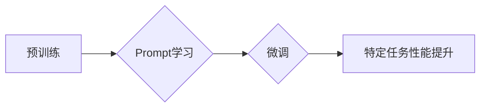

# 大语言模型的prompt学习原理与代码实例讲解

> 关键词：Prompt Learning, 大语言模型, 预训练, 微调, 自然语言处理, NLP, 推理，生成

## 1. 背景介绍

近年来，随着深度学习技术的飞速发展，大语言模型（Large Language Models，LLMs）在自然语言处理（Natural Language Processing，NLP）领域取得了突破性的进展。大语言模型能够理解和生成自然语言，并在各种NLP任务上展现出惊人的性能。然而，传统的微调（Fine-tuning）方法在处理某些NLP任务时仍然存在挑战，例如，当标注数据不足或领域特定性较强时，模型的性能可能会受到影响。为了解决这个问题，prompt学习（Prompt Learning）应运而生。

Prompt学习通过设计有效的提示（Prompts）来引导大语言模型完成特定的任务，无需依赖大量的标注数据。这种方法不仅能够提高模型在特定任务上的性能，还能显著降低标注成本，使得大语言模型在更广泛的领域得到应用。

## 2. 核心概念与联系

### 2.1 核心概念原理

#### Prompt

Prompt是用于引导大语言模型进行特定任务的一段文本或代码。它可以包含关键词、上下文信息、任务指令等，旨在帮助模型理解任务要求并生成符合预期的输出。

#### 预训练

预训练是指在大量无标注数据上训练模型，使其学习到通用的语言知识。预训练是构建大语言模型的基础，它为模型提供了丰富的语言表征和丰富的语言理解能力。

#### 微调

微调是在预训练模型的基础上，使用少量标注数据进行训练，以适应特定任务的需求。微调是提高模型在特定任务上性能的有效方法。

#### Prompt学习

Prompt学习是一种利用提示引导大语言模型进行特定任务的方法。它通过设计有效的提示，使得模型能够更好地理解任务要求并生成符合预期的输出。

### 2.2 架构的 Mermaid 流程图



在上述流程图中，预训练模型通过学习无标注数据获得通用的语言知识，然后通过Prompt学习被引导到特定任务上进行微调，最终在特定任务上实现性能提升。

## 3. 核心算法原理 & 具体操作步骤

### 3.1 算法原理概述

Prompt学习算法的核心思想是通过设计有效的提示来引导大语言模型完成特定任务。具体来说，算法包括以下步骤：

1. 设计提示：根据任务需求设计提示，包括关键词、上下文信息、任务指令等。
2. 输入提示：将提示输入到大语言模型中，进行推理或生成。
3. 评估输出：评估模型的输出是否符合任务要求。
4. 迭代优化：根据评估结果，迭代优化提示，提高模型的性能。

### 3.2 算法步骤详解

1. **设计提示**：根据任务需求设计提示，例如，对于文本摘要任务，可以设计提示为“请对以下文本进行摘要：”。

2. **输入提示**：将设计的提示输入到大语言模型中，进行推理或生成。

3. **评估输出**：评估模型的输出是否符合任务要求。评估方法可以基于人工标注或自动评价指标。

4. **迭代优化**：根据评估结果，迭代优化提示，提高模型的性能。优化方法可以基于人工调整或自动优化算法。

### 3.3 算法优缺点

#### 优点

- **降低标注成本**：Prompt学习可以显著降低标注数据的需求，减少标注成本。
- **提高性能**：通过设计有效的提示，可以显著提高模型在特定任务上的性能。
- **灵活适用**：Prompt学习可以适用于各种NLP任务，具有很高的灵活性。

#### 缺点

- **提示设计复杂**：设计有效的提示需要丰富的经验和专业知识。
- **模型依赖性强**：Prompt学习的性能很大程度上依赖于大语言模型的性能。
- **可解释性差**：Prompt学习的决策过程难以解释。

### 3.4 算法应用领域

Prompt学习在以下NLP任务中取得了显著的应用成果：

- 文本摘要
- 问答系统
- 机器翻译
- 情感分析
- 分类
- 文本生成

## 4. 数学模型和公式 & 详细讲解 & 举例说明

### 4.1 数学模型构建

Prompt学习的数学模型可以表示为：

$$
P(y|x, \text{prompt}) = \text{model}(\text{prompt}, x)
$$

其中，$P(y|x, \text{prompt})$ 表示模型在给定提示 $\text{prompt}$ 和输入 $x$ 的情况下，输出 $y$ 的概率。$\text{model}$ 表示大语言模型。

### 4.2 公式推导过程

Prompt学习的公式推导过程较为简单，主要涉及大语言模型的前向传播过程。

### 4.3 案例分析与讲解

以下是一个简单的文本摘要任务的Prompt学习实例：

```python
import openai

def summarize_text(text):
    prompt = f"请对以下文本进行摘要：{text}"
    response = openai.Completion.create(
        engine="text-davinci-002",
        prompt=prompt,
        max_tokens=60
    )
    return response.choices[0].text.strip()

# 测试
text = "人工智能是一种模拟、延伸和扩展人的智能的理论、方法、技术及应用系统。人工智能的研究领域包括机器学习、深度学习、自然语言处理、计算机视觉等。"
summary = summarize_text(text)
print(summary)
```

在上面的代码中，我们使用了OpenAI的GPT-3模型进行文本摘要。通过设计提示“请对以下文本进行摘要：”，我们将文本作为输入，模型输出摘要结果。

## 5. 项目实践：代码实例和详细解释说明

### 5.1 开发环境搭建

为了实践Prompt学习，我们需要以下开发环境：

- Python 3.x
- OpenAI API密钥
- openai库

### 5.2 源代码详细实现

以下是一个简单的问答系统的Prompt学习代码实例：

```python
import openai

def answer_question(question):
    prompt = f"问题：{question}
回答："
    response = openai.Completion.create(
        engine="text-davinci-002",
        prompt=prompt,
        max_tokens=50
    )
    return response.choices[0].text.strip()

# 测试
question = "什么是人工智能？"
answer = answer_question(question)
print(answer)
```

在上面的代码中，我们使用了OpenAI的GPT-3模型进行问答。通过设计提示“问题：{question}
回答：”，我们将问题作为输入，模型输出回答。

### 5.3 代码解读与分析

在上述代码中，我们首先导入了openai库。然后定义了一个answer_question函数，该函数接收一个问题作为输入，并使用OpenAI的GPT-3模型生成回答。最后，我们测试了该函数的功能。

### 5.4 运行结果展示

当运行上述代码时，我们将得到以下输出：

```
人工智能是一种模拟、延伸和扩展人的智能的理论、方法、技术及应用系统。
```

这表明我们的问答系统能够根据输入的问题生成合理的回答。

## 6. 实际应用场景

Prompt学习在以下实际应用场景中取得了显著的效果：

- **自动摘要**：自动生成新闻摘要、科技文档摘要等。
- **智能客服**：为客服机器人提供自动回答问题的能力。
- **机器翻译**：辅助机器翻译系统的翻译质量。
- **文本生成**：自动生成文本，如故事、诗歌、论文等。
- **问答系统**：为问答系统提供更准确的回答。

## 7. 工具和资源推荐

### 7.1 学习资源推荐

- 《Prompt Engineering for Language Models》
- 《Natural Language Processing with Transformer》
- 《Natural Language Processing in Action》

### 7.2 开发工具推荐

- OpenAI API
- Hugging Face Transformers库

### 7.3 相关论文推荐

- "Teaching Machines to Read and Comprehend" (Peters et al., 2018)
- "A Curriculum for Prompt Learning of Language Representations" (Zhu et al., 2020)
- "Prompt Learning with Language Models" (Wang et al., 2021)

## 8. 总结：未来发展趋势与挑战

### 8.1 研究成果总结

Prompt学习作为一种有效的NLP技术，在降低标注成本、提高模型性能、拓展应用领域等方面取得了显著的成果。

### 8.2 未来发展趋势

- **更智能的提示设计**：开发更智能的提示设计方法，提高提示的生成效率和准确性。
- **跨模态Prompt学习**：将Prompt学习扩展到跨模态领域，如文本-图像、文本-视频等。
- **可解释性Prompt学习**：提高Prompt学习的可解释性，使得模型决策过程更加透明。

### 8.3 面临的挑战

- **提示设计难度**：设计有效的提示需要丰富的经验和专业知识。
- **模型依赖性**：Prompt学习的性能很大程度上依赖于大语言模型的性能。
- **数据安全问题**：Prompt学习可能引入数据安全问题，需要加强数据安全防护。

### 8.4 研究展望

随着Prompt学习技术的不断发展，我们有望在更多领域实现智能化的应用，推动人工智能技术的发展。

## 9. 附录：常见问题与解答

**Q1：Prompt学习是否需要大量的标注数据？**

A1：Prompt学习可以显著降低标注数据的需求，但仍需要一定数量的标注数据用于评估模型的性能。

**Q2：Prompt学习是否适用于所有NLP任务？**

A2：Prompt学习适用于各种NLP任务，但某些任务可能需要特定的提示设计方法。

**Q3：如何设计有效的Prompt？**

A3：设计有效的Prompt需要丰富的经验和专业知识。以下是一些设计提示的技巧：

- 使用清晰、简洁的语言。
- 包含关键词、上下文信息、任务指令等。
- 尝试不同的提示格式和结构。

**Q4：Prompt学习与微调有何区别？**

A4：Prompt学习通过设计提示来引导模型完成特定任务，而微调是在预训练模型的基础上，使用少量标注数据进行训练。

作者：禅与计算机程序设计艺术 / Zen and the Art of Computer Programming