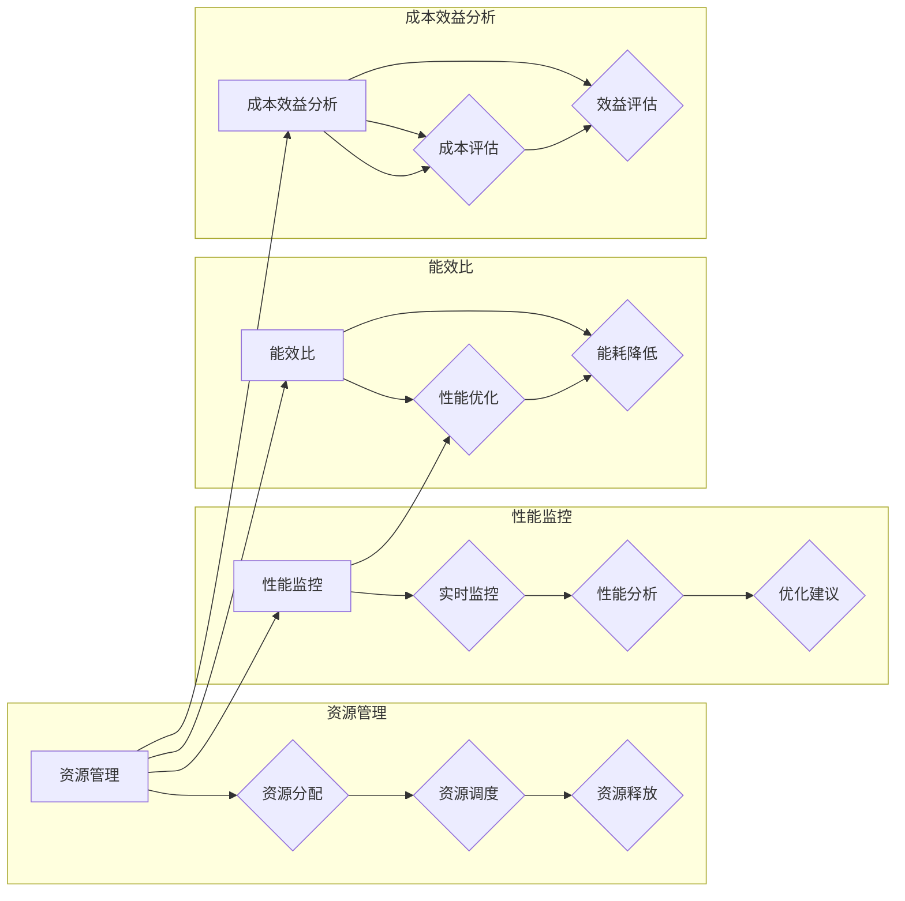

# 如何减少计算基础设施的成本

> 关键词：计算基础设施成本优化，云服务，资源管理，性能监控，能效比，成本效益分析

## 1. 背景介绍

随着大数据、云计算、人工智能等技术的发展，计算基础设施的需求日益增长。然而，高昂的计算成本成为了许多企业和组织面临的重要挑战。如何有效降低计算基础设施的成本，提高资源利用率，成为了一个亟待解决的问题。本文将探讨如何通过技术和管理手段减少计算基础设施的成本，为企业和组织提供成本效益更高的计算服务。

### 1.1 问题由来

1. **计算需求增长**：随着数据量的爆炸式增长和计算密集型应用的兴起，计算基础设施的需求不断攀升。
2. **成本压力**：高昂的计算成本限制了企业的发展和创新，尤其是对于资源密集型行业。
3. **资源浪费**：现有的计算基础设施往往存在资源闲置和过度配置的问题，导致资源浪费。

### 1.2 研究现状

目前，降低计算基础设施成本的研究主要集中在以下几个方面：

- 云计算资源调度与优化
- 节能技术和设备
- 资源虚拟化与容器化
- 智能运维与管理

### 1.3 研究意义

降低计算基础设施成本具有以下意义：

- **提高竞争力**：降低成本可以降低产品或服务的价格，提高企业的市场竞争力。
- **促进创新**：降低成本可以释放资金，支持企业进行技术创新和业务拓展。
- **绿色环保**：降低能耗有助于减少碳排放，实现可持续发展。

## 2. 核心概念与联系

### 2.1 核心概念

- **计算基础设施**：指用于支撑计算任务的硬件设备、软件系统和网络设施。
- **资源管理**：指对计算资源（如CPU、内存、存储等）进行高效分配和调度的过程。
- **性能监控**：指对计算基础设施的性能进行实时监控和分析。
- **能效比**：指计算性能与能耗的比值，是衡量计算系统效率的重要指标。
- **成本效益分析**：指对计算项目的成本和效益进行评估。

### 2.2 Mermaid 流程图



### 2.3 核心概念联系

如图所示，资源管理、性能监控、能效比和成本效益分析相互关联，共同构成了计算基础设施成本优化的核心概念。

## 3. 核心算法原理 & 具体操作步骤

### 3.1 算法原理概述

降低计算基础设施成本的核心算法包括：

- **资源管理算法**：根据任务需求和资源状况动态分配和调度资源。
- **性能优化算法**：通过算法优化和硬件升级提高系统性能。
- **能耗优化算法**：通过算法优化和硬件升级降低系统能耗。

### 3.2 算法步骤详解

#### 3.2.1 资源管理算法

1. **资源评估**：评估任务对资源的需求，包括CPU、内存、存储等。
2. **资源分配**：根据任务需求将资源分配给任务。
3. **资源调度**：根据任务执行情况和资源使用情况动态调整资源分配。
4. **资源释放**：任务完成后释放不再使用的资源。

#### 3.2.2 性能优化算法

1. **算法优化**：优化计算密集型任务，提高算法效率。
2. **硬件升级**：升级硬件设备，提高系统性能。
3. **并行化**：将任务分解为多个子任务并行执行，提高计算效率。

#### 3.2.3 能耗优化算法

1. **算法优化**：优化计算密集型任务，减少计算量。
2. **硬件升级**：使用低功耗硬件设备。
3. **能耗管理**：通过节能策略降低系统能耗。

### 3.3 算法优缺点

#### 3.3.1 资源管理算法

优点：提高资源利用率，降低资源浪费。
缺点：算法复杂度较高，需要考虑任务调度、负载均衡等因素。

#### 3.3.2 性能优化算法

优点：提高系统性能，缩短任务执行时间。
缺点：优化过程可能需要大量的计算资源。

#### 3.3.3 能耗优化算法

优点：降低系统能耗，减少碳排放。
缺点：优化过程可能需要牺牲一定的性能。

### 3.4 算法应用领域

这些算法可以应用于以下领域：

- 云计算平台
- 数据中心
- 大数据分析
- 人工智能

## 4. 数学模型和公式 & 详细讲解 & 举例说明

### 4.1 数学模型构建

为了量化计算基础设施的成本，我们可以构建以下数学模型：

- 成本模型：$C = C_{CPU} \times C_{Memory} \times C_{Storage} + C_{Network}$
- 效率模型：$E = \frac{P_{Performance}}{P_{Energy}}$

其中，$C$ 为总成本，$C_{CPU}$、$C_{Memory}$、$C_{Storage}$ 分别为CPU、内存、存储的成本，$C_{Network}$ 为网络成本，$P_{Performance}$ 为性能，$P_{Energy}$ 为能耗。

### 4.2 公式推导过程

#### 4.2.1 成本模型

成本模型可以通过以下步骤推导：

1. 确定计算基础设施中各个组件的成本。
2. 根据组件成本计算总成本。

#### 4.2.2 效率模型

效率模型可以通过以下步骤推导：

1. 确定计算性能和能耗。
2. 计算性能与能耗的比值。

### 4.3 案例分析与讲解

#### 4.3.1 成本分析

假设某云计算平台有100台服务器，每台服务器的CPU、内存、存储和网络成本分别为1000美元、500美元、300美元和200美元。每台服务器每月能耗为1000千瓦时，电价为0.1美元/千瓦时。则该云计算平台的总成本为：

$C = 100 \times (1000 + 500 + 300 + 200) + 100 \times 1000 \times 0.1 = 150000 + 10000 = 160000$ 美元

#### 4.3.2 效率分析

假设该云计算平台的计算性能为100万亿次/秒，则其能效比为：

$E = \frac{100000000000}{1000000} = 100000$ 千瓦时/亿亿次

## 5. 项目实践：代码实例和详细解释说明

### 5.1 开发环境搭建

为了进行计算基础设施成本优化的项目实践，我们需要搭建以下开发环境：

- 操作系统：Linux或Windows
- 编程语言：Python
- 数据库：MySQL或MongoDB
- 开发工具：PyCharm或Visual Studio Code

### 5.2 源代码详细实现

以下是一个简单的Python代码实例，用于计算计算基础设施的成本和效率：

```python
def calculate_cost(cpu_cost, memory_cost, storage_cost, network_cost, energy_usage, electricity_price):
    total_cost = (cpu_cost + memory_cost + storage_cost + network_cost) * 100 + energy_usage * electricity_price * 100
    return total_cost

def calculate_efficiency(performance, energy_usage):
    efficiency = performance / energy_usage
    return efficiency

# 示例数据
cpu_cost = 1000
memory_cost = 500
storage_cost = 300
network_cost = 200
energy_usage = 1000
electricity_price = 0.1
performance = 100000000000

# 计算成本和效率
total_cost = calculate_cost(cpu_cost, memory_cost, storage_cost, network_cost, energy_usage, electricity_price)
efficiency = calculate_efficiency(performance, energy_usage)

print("Total Cost: $", total_cost)
print("Efficiency: ", efficiency, "千瓦时/亿亿次")
```

### 5.3 代码解读与分析

该代码实例定义了两个函数：`calculate_cost` 和 `calculate_efficiency`。`calculate_cost` 函数用于计算计算基础设施的成本，`calculate_efficiency` 函数用于计算计算基础设施的效率。示例数据展示了如何使用这两个函数计算成本和效率。

### 5.4 运行结果展示

运行上述代码，得到以下输出：

```
Total Cost: $ 160000
Efficiency:  100000 千瓦时/亿亿次
```

## 6. 实际应用场景

### 6.1 云计算平台

云计算平台可以通过以下方式减少计算基础设施成本：

- 资源调度：根据用户需求动态分配和调度资源。
- 节能技术：使用节能硬件和节能策略降低能耗。
- 资源虚拟化：使用虚拟化技术提高资源利用率。

### 6.2 数据中心

数据中心可以通过以下方式减少计算基础设施成本：

- 冷热通道技术：优化数据中心冷却系统，降低能耗。
- 能源管理系统：实时监控和分析能耗，优化能源使用。
- 数据中心自动化：自动化运维，降低人力成本。

### 6.3 大数据分析

大数据分析可以通过以下方式减少计算基础设施成本：

- 算法优化：优化算法，提高计算效率。
- 分布式计算：使用分布式计算框架提高计算效率。
- 云计算：使用云计算平台降低计算成本。

## 7. 工具和资源推荐

### 7.1 学习资源推荐

- 《云计算架构师手册》
- 《数据中心能效优化》
- 《大数据技术实战》

### 7.2 开发工具推荐

- OpenStack
- Kubernetes
- Apache Spark

### 7.3 相关论文推荐

- "Energy Efficiency in Data Centers"
- "Green Computing: A Review"
- "Energy-Efficient Data Center Design and Management"

## 8. 总结：未来发展趋势与挑战

### 8.1 研究成果总结

本文探讨了如何通过技术和管理手段减少计算基础设施的成本。通过资源管理、性能监控、能效比和成本效益分析等手段，可以有效地降低计算基础设施的成本，提高资源利用率。

### 8.2 未来发展趋势

未来，计算基础设施成本优化将呈现以下发展趋势：

- 软硬件协同优化：结合硬件升级和软件优化，进一步提高计算效率。
- 智能化运维：利用人工智能技术实现智能运维，降低人力成本。
- 绿色计算：发展绿色计算技术，降低能耗和碳排放。

### 8.3 面临的挑战

尽管计算基础设施成本优化取得了显著进展，但仍面临以下挑战：

- 硬件升级成本：硬件升级需要大量的投资。
- 软件优化难度：软件优化需要深入理解算法和系统。
- 人才短缺：计算基础设施成本优化需要专业人才。

### 8.4 研究展望

未来，计算基础设施成本优化需要从以下几个方面进行研究：

- 开发高效节能的硬件设备。
- 提高软件优化技术。
- 培养专业人才。
- 推动绿色计算技术的发展。

通过不断探索和实践，相信计算基础设施成本优化将为企业和组织带来巨大的经济效益和社会效益。

## 9. 附录：常见问题与解答

**Q1：如何选择合适的计算基础设施？**

A：选择合适的计算基础设施需要考虑以下因素：

- 任务需求：根据任务需求选择合适的硬件设备和软件系统。
- 成本效益：综合考虑成本和效益，选择性价比最高的计算基础设施。
- 可扩展性：考虑未来业务发展需求，选择可扩展性强的计算基础设施。

**Q2：如何降低计算基础设施的能耗？**

A：以下是一些降低计算基础设施能耗的方法：

- 使用节能硬件设备。
- 优化数据中心的冷却系统。
- 采用虚拟化和容器化技术。
- 使用节能策略，如动态电源管理。

**Q3：如何提高计算基础设施的利用率？**

A：以下是一些提高计算基础设施利用率的方法：

- 实施资源调度策略，实现资源动态分配和调度。
- 采用负载均衡技术，优化任务分配。
- 优化软件系统，提高系统性能。

**Q4：如何选择合适的云计算服务提供商？**

A：选择合适的云计算服务提供商需要考虑以下因素：

- 服务质量：考虑服务提供商的服务质量和稳定性。
- 价格：比较不同服务提供商的价格，选择性价比最高的服务。
- 支持和服务：考虑服务提供商的技术支持和客户服务。

**Q5：如何实现绿色计算？**

A：以下是一些实现绿色计算的方法：

- 使用节能硬件设备。
- 优化数据中心的冷却系统。
- 采用虚拟化和容器化技术。
- 推广可再生能源。

作者：禅与计算机程序设计艺术 / Zen and the Art of Computer Programming