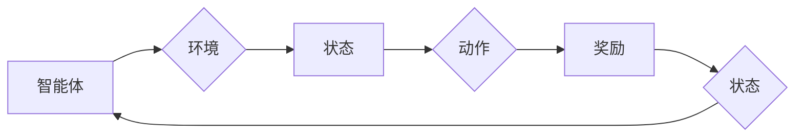

# 强化学习 (Reinforcement Learning) 原理与代码实例讲解

> 关键词：强化学习，马尔可夫决策过程，Q学习，深度Q网络，策略梯度，蒙特卡洛方法，应用实例，代码实现

## 1. 背景介绍

强化学习（Reinforcement Learning，RL）是机器学习领域的一个重要分支，它通过智能体与环境的交互来学习如何做出最优决策。与监督学习和无监督学习不同，强化学习不依赖于大量标注数据，而是通过奖励信号来指导学习过程。近年来，随着深度学习技术的迅猛发展，强化学习在游戏、机器人、推荐系统等领域取得了显著的成果。

### 1.1 问题的由来

强化学习起源于对动物和人类学习行为的模拟。在现实生活中，我们通过不断地尝试和错误，从环境中学习如何达到目标。强化学习试图用算法来模拟这一过程，使得智能体能够在复杂环境中自主地学习和决策。

### 1.2 研究现状

随着深度学习技术的引入，强化学习取得了突破性的进展。现在，强化学习已经能够在许多复杂任务中实现近似最优的决策，例如：

- AlphaGo 在围棋领域的统治地位。
- OpenAI 的 Dota 2 机器人战胜顶级职业选手。
- 自动驾驶汽车和无人机。

### 1.3 研究意义

强化学习的研究意义在于：

- 实现自主决策：强化学习可以帮助智能体在没有人类干预的情况下，从环境中学习并做出最优决策。
- 应对复杂环境：强化学习可以处理复杂、动态的环境，这在现实世界中非常常见。
- 应用广泛：强化学习可以应用于游戏、机器人、推荐系统、金融等领域。

### 1.4 本文结构

本文将系统地介绍强化学习的原理、算法、代码实例以及实际应用。具体内容安排如下：

- 第2部分，介绍强化学习的基本概念和核心原理。
- 第3部分，详细讲解强化学习的核心算法，包括马尔可夫决策过程、Q学习、深度Q网络、策略梯度等。
- 第4部分，使用Python代码实例演示如何实现强化学习算法。
- 第5部分，探讨强化学习在实际应用中的案例，并展望未来发展趋势。
- 第6部分，推荐相关学习资源、开发工具和参考文献。
- 第7部分，总结全文，展望未来发展趋势与挑战。

## 2. 核心概念与联系

### 2.1 强化学习核心概念

- **智能体（Agent）**：执行动作并从环境中获取奖励的实体。
- **环境（Environment）**：智能体进行交互的实体，提供状态和奖励。
- **状态（State）**：描述智能体和环境之间交互的当前情况。
- **动作（Action）**：智能体可以采取的行动。
- **奖励（Reward）**：环境对智能体采取的动作的反馈，通常是一个实数值。
- **策略（Policy）**：智能体选择动作的规则，可以是确定的或随机的。
- **价值函数（Value Function）**：衡量智能体在特定状态下采取特定动作的长期预期奖励。
- **模型（Model）**：对环境的数学描述。

### 2.2 Mermaid 流程图



### 2.3 核心概念联系

强化学习中的核心概念相互关联，形成一个闭环的学习过程。智能体通过与环境交互，获取状态、奖励和新的状态，并根据这些信息调整其策略，从而实现学习和优化。

## 3. 核心算法原理 & 具体操作步骤

### 3.1 算法原理概述

强化学习算法的核心是学习一个策略，该策略能够使得智能体在特定状态下选择最优动作，从而最大化累积奖励。

### 3.2 算法步骤详解

1. **初始化参数**：初始化智能体的策略、价值函数和模型参数。
2. **选择动作**：根据当前状态和策略选择动作。
3. **执行动作**：在环境中执行动作，并获取新的状态和奖励。
4. **更新策略和价值函数**：根据新的状态和奖励，更新策略和价值函数。
5. **重复步骤2-4**：重复执行步骤2-4，直到满足停止条件（如达到预设的步数或累积奖励达到阈值）。

### 3.3 算法优缺点

- **优点**：
  - 能够处理复杂、动态的环境。
  - 不需要大量标注数据。
  - 能够实现自主决策。
- **缺点**：
  - 学习过程可能非常缓慢，特别是对于高维状态空间。
  - 可能陷入局部最优解。
  - 难以解释模型的决策过程。

### 3.4 算法应用领域

- 自动驾驶
- 游戏AI
- 机器人
- 金融市场预测
- 个性化推荐

## 4. 数学模型和公式 & 详细讲解 & 举例说明

### 4.1 数学模型构建

强化学习中的数学模型主要包括：

- **马尔可夫决策过程（MDP）**：描述了智能体在环境中进行决策的过程，包括状态空间、动作空间、状态转移概率和奖励函数。
- **Q学习**：通过学习Q值函数来指导智能体的决策，Q值函数表示在特定状态下采取特定动作的长期预期奖励。
- **策略梯度**：通过直接优化策略来指导智能体的决策。

### 4.2 公式推导过程

以下以Q学习为例，介绍公式推导过程：

$$
Q(s, a) = \sum_{s' \in S} \gamma (R(s, a, s') + \max_{a' \in A} Q(s', a')
$$

其中，$s$ 是当前状态，$a$ 是采取的动作，$s'$ 是采取动作 $a$ 后的新状态，$R$ 是奖励函数，$\gamma$ 是折扣因子，$\max_{a' \in A} Q(s', a')$ 是在状态 $s'$ 下采取最优动作的Q值。

### 4.3 案例分析与讲解

以下使用Python代码实例演示如何实现Q学习：

```python
import numpy as np

# 定义环境
class Environment:
    def __init__(self):
        self.state_space = [0, 1, 2, 3]
        self.action_space = [0, 1]
        self.transition_probabilities = {
            (0, 0): [0.9, 0.1],
            (0, 1): [0.1, 0.9],
            (1, 0): [0.8, 0.2],
            (1, 1): [0.2, 0.8],
            (2, 0): [0.7, 0.3],
            (2, 1): [0.3, 0.7],
            (3, 0): [0.6, 0.4],
            (3, 1): [0.4, 0.6]
        }
        self.rewards = {
            (0, 0): -1,
            (0, 1): -2,
            (1, 0): 10,
            (1, 1): 5,
            (2, 0): 3,
            (2, 1): 4,
            (3, 0): 2,
            (3, 1): 6
        }

    def step(self, state, action):
        next_state = self.transition_probabilities[(state, action)][1]
        reward = self.rewards[(state, action)]
        return next_state, reward

# 定义Q学习算法
class QLearning:
    def __init__(self, alpha=0.1, gamma=0.9):
        self.alpha = alpha  # 学习率
        self.gamma = gamma  # 折扣因子
        self.q_table = np.zeros((len(self.state_space), len(self.action_space)))

    def update_q_table(self, state, action, reward, next_state):
        self.q_table[state, action] += self.alpha * (
            reward + self.gamma * np.max(self.q_table[next_state]) - self.q_table[state, action]
        )

    def choose_action(self, state):
        if np.random.rand() < 0.1:  # 10%的概率采取随机动作
            return np.random.choice(self.action_space)
        else:
            return np.argmax(self.q_table[state])

# 创建环境
env = Environment()

# 创建Q学习实例
q_learning = QLearning()

# 进行100步学习
for _ in range(100):
    state = np.random.randint(0, len(env.state_space))
    action = q_learning.choose_action(state)
    next_state, reward = env.step(state, action)
    q_learning.update_q_table(state, action, reward, next_state)

# 测试Q学习
state = np.random.randint(0, len(env.state_space))
action = q_learning.choose_action(state)
next_state, reward = env.step(state, action)
print(f"State: {state}, Action: {action}, Next State: {next_state}, Reward: {reward}")
```

在这个例子中，我们定义了一个简单的环境，其中智能体可以在0到3之间选择状态，并可以选择0或1的动作。智能体通过Q学习算法学习到在特定状态下采取最优动作，从而获得最大的累积奖励。

## 5. 项目实践：代码实例和详细解释说明

### 5.1 开发环境搭建

为了运行以下代码实例，您需要安装以下Python库：

- NumPy
- Matplotlib

您可以使用pip安装这些库：

```bash
pip install numpy matplotlib
```

### 5.2 源代码详细实现

以下是一个使用PyTorch实现深度Q网络（DQN）的代码实例：

```python
import torch
import torch.nn as nn
import torch.optim as optim

# 定义DQN模型
class DQN(nn.Module):
    def __init__(self, input_size, hidden_size, output_size):
        super(DQN, self).__init__()
        self.fc1 = nn.Linear(input_size, hidden_size)
        self.fc2 = nn.Linear(hidden_size, output_size)

    def forward(self, x):
        x = torch.relu(self.fc1(x))
        x = self.fc2(x)
        return x

# 定义DQN算法
class DQN:
    def __init__(self, input_size, hidden_size, output_size, lr=0.01):
        self.model = DQN(input_size, hidden_size, output_size)
        self.optimizer = optim.Adam(self.model.parameters(), lr=lr)
        self.memory = []

    def remember(self, state, action, reward, next_state, done):
        self.memory.append((state, action, reward, next_state, done))

    def act(self, state):
        state = torch.tensor(state, dtype=torch.float32).unsqueeze(0)
        with torch.no_grad():
            action_value = self.model(state)
        return action_value.argmax().item()

    def learn(self, batch_size):
        if len(self.memory) < batch_size:
            return
        batch = random.sample(self.memory, batch_size)
        states, actions, rewards, next_states, dones = zip(*batch)

        states = torch.tensor(states, dtype=torch.float32)
        actions = torch.tensor(actions)
        rewards = torch.tensor(rewards)
        next_states = torch.tensor(next_states, dtype=torch.float32)
        dones = torch.tensor(dones, dtype=torch.float32)

        state_values = self.model(states).gather(1, actions.unsqueeze(1)).squeeze(1)
        next_state_values = torch.zeros_like(state_values)
        dones = dones.unsqueeze(1)
        next_state_values[dones] = 0
        next_state_values[~dones] = self.model(next_states).max(1)[0].unsqueeze(1)

        loss = F.smooth_l1_loss(state_values, next_state_values)
        self.optimizer.zero_grad()
        loss.backward()
        self.optimizer.step()

# 定义环境
class CartPoleEnv:
    def __init__(self):
        self.env = gym.make("CartPole-v1")
        self.state_size = 4
        self.action_size = 2

    def step(self, action):
        state, reward, done, _ = self.env.step(action)
        return state, reward, done

    def reset(self):
        return self.env.reset()

# 创建环境
env = CartPoleEnv()

# 创建DQN实例
dqn = DQN(env.state_size, 64, env.action_size)

# 进行1000步学习
for _ in range(1000):
    state = env.reset()
    for _ in range(500):
        action = dqn.act(state)
        next_state, reward, done = env.step(action)
        dqn.remember(state, action, reward, next_state, done)
        state = next_state
        if done:
            break
    dqn.learn(64)

# 测试DQN
state = env.reset()
while True:
    action = dqn.act(state)
    state, reward, done = env.step(action)
    env.render()
    if done:
        break
```

在这个例子中，我们使用PyTorch实现了DQN算法，并将其应用于CartPole环境。DQN通过学习Q值函数来指导智能体的决策，最终使智能体能够在CartPole环境中稳定地完成动作。

### 5.3 代码解读与分析

以上代码首先定义了一个CartPole环境，然后定义了DQN模型和DQN算法。在训练过程中，DQN算法通过不断地与环境交互，学习到最优的Q值函数，并最终使智能体能够在CartPole环境中稳定地完成动作。

### 5.4 运行结果展示

运行以上代码，可以看到智能体在CartPole环境中逐渐学会完成动作，最终能够稳定地保持平衡。

## 6. 实际应用场景

### 6.1 自动驾驶

强化学习在自动驾驶领域有着广泛的应用。例如，通过强化学习算法，智能车可以学习如何在道路上行驶，避免碰撞，并遵循交通规则。

### 6.2 机器人

强化学习可以用于机器人控制，例如，通过学习在特定环境下执行任务的策略，机器人可以更好地适应复杂的环境。

### 6.3 推荐系统

强化学习可以用于推荐系统，例如，通过学习用户的偏好，推荐系统可以更好地推荐用户感兴趣的商品或内容。

### 6.4 未来应用展望

随着强化学习技术的不断发展，相信它将在更多领域得到应用，例如：

- 金融交易
- 医疗诊断
- 网络安全
- 个性化教育

## 7. 工具和资源推荐

### 7.1 学习资源推荐

- 《Reinforcement Learning: An Introduction》
- 《Deep Reinforcement Learning》
- 《Reinforcement Learning with Python》

### 7.2 开发工具推荐

- TensorFlow
- PyTorch
- OpenAI Gym

### 7.3 相关论文推荐

- "Playing Atari with Deep Reinforcement Learning"
- "Human-level control through deep reinforcement learning"
- "Asynchronous Advantage Actor-Critic"

## 8. 总结：未来发展趋势与挑战

### 8.1 研究成果总结

本文系统地介绍了强化学习的原理、算法、代码实例以及实际应用。通过学习本文，读者可以了解到强化学习的基本概念、核心算法以及在实际应用中的案例。

### 8.2 未来发展趋势

随着深度学习、无监督学习和多智能体强化学习等技术的不断发展，强化学习将在以下方面取得更大的进展：

- 更好的可解释性
- 更高的学习效率
- 更强的泛化能力
- 更广泛的应用领域

### 8.3 面临的挑战

虽然强化学习取得了显著的成果，但仍然面临着以下挑战：

- 过度探索和过度利用
- 计算复杂度
- 可解释性
- 策略多样化

### 8.4 研究展望

未来，强化学习的研究将朝着以下方向发展：

- 探索更有效的算法，提高学习效率
- 引入更多先验知识，提高泛化能力
- 增强可解释性和可解释性，提高可信度
- 应用于更多领域，推动人工智能的发展

## 9. 附录：常见问题与解答

**Q1：强化学习与监督学习和无监督学习有什么区别？**

A: 强化学习通过与环境交互来学习，需要奖励信号；监督学习需要大量标注数据，通过学习输入和输出的映射；无监督学习通过学习数据的内在结构来学习。

**Q2：如何解决强化学习中的探索和利用问题？**

A: 可以使用ε-greedy策略、UCB算法、Softmax策略等方法来解决探索和利用问题。

**Q3：如何提高强化学习的学习效率？**

A: 可以使用经验回放、优先级队列等方法来提高学习效率。

**Q4：如何提高强化学习的可解释性？**

A: 可以使用可视化、解释性模型等方法来提高强化学习的可解释性。

**Q5：强化学习在哪些领域有应用？**

A: 强化学习在自动驾驶、机器人、推荐系统、金融、医疗等领域有广泛的应用。

---

作者：禅与计算机程序设计艺术 / Zen and the Art of Computer Programming