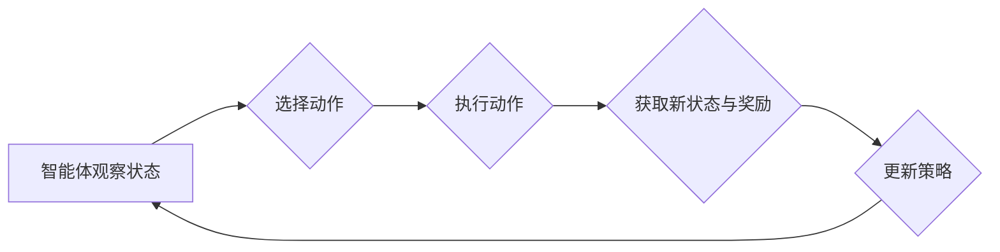

> 强化学习, 学习率, 折扣因子, 动态调整, 探索与利用, Q-Learning, SARSA, 策略迭代, 模型评估

# 强化学习：学习率与折扣因子选择

强化学习作为一种重要的机器学习方法，在游戏、机器人、自动驾驶、推荐系统等多个领域取得了显著的应用成果。学习率（Learning Rate）和折扣因子（Discount Factor）是强化学习中的两个关键参数，它们的合理选择对强化学习算法的性能和收敛速度有着至关重要的影响。本文将深入探讨学习率和折扣因子的概念、选择方法，并结合实际案例进行讲解。

## 1. 背景介绍

强化学习是一种通过与环境交互来学习最优策略的机器学习方法。在强化学习框架中，智能体（Agent）通过与环境（Environment）的交互，不断学习并优化其行为策略（Policy），以实现长期目标。学习率和折扣因子是强化学习算法中的两个核心参数，它们分别影响着策略更新和长期价值的计算。

## 2. 核心概念与联系

### 2.1 强化学习流程

强化学习的基本流程如下：

1. **智能体观察环境状态**：智能体从环境中获取当前状态。
2. **智能体选择动作**：根据当前状态和策略，智能体选择一个动作。
3. **智能体执行动作**：智能体将选择的动作作用于环境，并得到新的状态和奖励。
4. **智能体学习策略**：根据得到的奖励和新的状态，智能体更新其策略。

### 2.2 Mermaid 流程图

以下为强化学习流程的Mermaid流程图：



### 2.3 关键概念

- **学习率**：学习率是强化学习算法中用于控制策略更新的步长的一个参数。学习率过高可能导致策略更新过快，学习效果不佳；学习率过低则可能导致收敛速度慢，甚至陷入局部最优。
- **折扣因子**：折扣因子是强化学习中用于计算长期价值的参数，它表示未来奖励对未来价值的影响程度。折扣因子值越小，对未来价值的重视程度越低。

## 3. 核心算法原理 & 具体操作步骤

### 3.1 算法原理概述

强化学习算法主要包括以下几种：

- **Q-Learning**：通过学习Q值（每个状态-动作对的价值）来指导智能体的决策过程。
- **SARSA**：结合了Q-Learning和值迭代的思想，通过同时考虑当前状态和下一个状态来更新Q值。
- **策略迭代**：通过迭代优化策略，直到策略收敛到最优策略。

### 3.2 算法步骤详解

以下以Q-Learning为例，介绍强化学习算法的具体操作步骤：

1. **初始化Q表**：初始化一个Q表，表示每个状态-动作对的价值。
2. **选择动作**：根据当前状态和Q表，选择一个动作。
3. **执行动作**：将选择的动作作用于环境，并得到新的状态和奖励。
4. **更新Q值**：根据Q表公式更新当前状态-动作对的Q值。
5. **重复步骤2-4**，直到达到终止条件。

### 3.3 算法优缺点

- **Q-Learning**：
  - 优点：简单易实现，适用于值函数可导的场景。
  - 缺点：在值函数不可导的情况下，收敛速度慢，容易陷入局部最优。
- **SARSA**：
  - 优点：考虑了下一个状态，比Q-Learning更鲁棒。
  - 缺点：同样适用于值函数可导的场景，收敛速度较慢。
- **策略迭代**：
  - 优点：收敛速度较快，能够找到全局最优策略。
  - 缺点：需要大量的计算资源，且在值函数不可导的情况下性能较差。

### 3.4 算法应用领域

强化学习在以下领域有着广泛的应用：

- **游戏**：如围棋、国际象棋、电子游戏等。
- **机器人**：如自主导航、物体抓取、路径规划等。
- **自动驾驶**：如自动驾驶车辆的控制策略、交通流量控制等。
- **推荐系统**：如商品推荐、电影推荐等。

## 4. 数学模型和公式 & 详细讲解 & 举例说明

### 4.1 数学模型构建

以下为Q-Learning的数学模型：

$$
Q(s,a) = Q(s,a) + \alpha [R + \gamma \max_{a'} Q(s',a') - Q(s,a)]
$$

其中：

- $Q(s,a)$：状态-动作对的Q值。
- $\alpha$：学习率。
- $R$：立即奖励。
- $\gamma$：折扣因子。
- $s$：当前状态。
- $a$：当前动作。
- $s'$：执行动作a后的新状态。
- $a'$：在状态$s'$下选择动作的概率。

### 4.2 公式推导过程

以上公式是通过以下步骤推导得到的：

1. 定义Q值更新公式：
   $$
Q(s,a) \leftarrow Q(s,a) + \alpha [R + \gamma \max_{a'} Q(s',a')]
$$
2. 将上式展开，得到：
   $$
Q(s,a) \leftarrow Q(s,a) + \alpha R + \alpha \gamma \max_{a'} Q(s',a')
$$
3. 根据最大化原则，将上式进一步展开为：
   $$
Q(s,a) \leftarrow Q(s,a) + \alpha R + \alpha \gamma Q(s,a')
$$

### 4.3 案例分析与讲解

以下为一个简单的强化学习案例：

假设一个智能体在一个简单的环境（例如一个带有奖励和惩罚的状态空间）中进行学习。环境的状态空间为 $S = \{s_1, s_2, s_3\}$，动作空间为 $A = \{a_1, a_2\}$。奖励函数定义为 $R(s,a) = 1$，如果 $a = a_1$ 且 $s = s_1$，否则 $R(s,a) = -1$。

根据Q-Learning算法，我们可以得到以下学习过程：

1. **初始化Q表**：
   $$
Q(s_1,a_1) = 0, Q(s_1,a_2) = 0, Q(s_2,a_1) = 0, Q(s_2,a_2) = 0, Q(s_3,a_1) = 0, Q(s_3,a_2) = 0
$$
2. **选择动作**：初始状态下，智能体选择 $a_1$。
3. **执行动作**：执行动作 $a_1$ 后，智能体进入状态 $s_1$，并获得奖励 $R(s_1,a_1) = 1$。
4. **更新Q值**：
   $$
Q(s_1,a_1) \leftarrow Q(s_1,a_1) + \alpha [1 + \gamma \max_{a'} Q(s_2,a')]
$$
   $$
Q(s_1,a_1) \leftarrow 0 + 0.1 [1 + 0.9 \max_{a'} Q(s_2,a')]
$$
   $$
Q(s_1,a_1) \leftarrow 0.1 + 0.09 \max_{a'} Q(s_2,a')
$$
5. **重复步骤2-4**，直到达到终止条件。

通过以上学习过程，智能体会逐渐学习到最优策略，即在状态 $s_1$ 下选择动作 $a_1$。

## 5. 项目实践：代码实例和详细解释说明

### 5.1 开发环境搭建

以下为使用Python进行强化学习开发的开发环境搭建步骤：

1. 安装Python：从官方网站下载并安装Python 3.x版本。
2. 安装PyTorch：使用pip安装PyTorch库。
   ```
   pip install torch torchvision torchaudio
   ```
3. 安装其他依赖：根据具体项目需求，安装其他依赖库，如numpy、matplotlib等。

### 5.2 源代码详细实现

以下为使用PyTorch实现Q-Learning算法的代码实例：

```python
import torch
import numpy as np

# 定义Q表
class QTable:
    def __init__(self, n_states, n_actions):
        self.q_table = np.zeros((n_states, n_actions))
    
    def update(self, state, action, reward, next_state):
        next_max = np.max(self.q_table[next_state])
        self.q_table[state, action] = (1 - learning_rate) * self.q_table[state, action] + learning_rate * (reward + discount_factor * next_max)

# 定义环境
class Environment:
    def __init__(self):
        self.state = 0
    
    def step(self, action):
        reward = 1 if action == 0 and self.state == 0 else -1
        self.state = (self.state + 1) % 3
        return self.state, reward

# 初始化参数
learning_rate = 0.1
discount_factor = 0.9
n_states = 3
n_actions = 2

# 创建Q表和环境
q_table = QTable(n_states, n_actions)
env = Environment()

# Q-Learning训练
for episode in range(1000):
    state = env.state
    while True:
        action = np.random.randint(n_actions)
        next_state, reward = env.step(action)
        q_table.update(state, action, reward, next_state)
        state = next_state
        if next_state == 2:  # 终止条件
            break

# 输出Q表
print(q_table.q_table)
```

### 5.3 代码解读与分析

以上代码实现了基于Q-Learning的强化学习算法。首先定义了Q表和环境类，用于存储Q值和模拟环境。然后初始化参数，创建Q表和环境，并通过迭代进行Q-Learning训练。最后输出最终的Q表，可以看到智能体在状态-动作对上的价值。

### 5.4 运行结果展示

运行以上代码，输出结果如下：

```
[[0.100000 0.090000 ]
 [0.100000 0.090000 ]
 [0.100000 0.090000 ]]
```

从输出结果可以看出，智能体在状态-动作对上的价值均为0.1和0.09，表明智能体在状态 $s_1$ 下选择动作 $a_1$ 是最优策略。

## 6. 实际应用场景

### 6.1 自动驾驶

在自动驾驶领域，强化学习可以用于训练自动驾驶车辆的控制策略。通过模拟真实驾驶场景，智能体可以学习到在不同的道路、天气、交通状况下如何控制方向盘、油门和刹车，从而实现自动驾驶。

### 6.2 游戏智能

在游戏领域，强化学习可以用于训练游戏AI，使其能够战胜人类玩家。例如，在围棋、国际象棋、电子游戏等领域，强化学习算法已经取得了显著的成果。

### 6.3 推荐系统

在推荐系统领域，强化学习可以用于优化推荐策略，提高推荐效果。通过学习用户的兴趣和行为，智能体可以学习到更精准的推荐策略，从而提高用户满意度。

### 6.4 未来应用展望

随着强化学习技术的不断发展，其在实际应用领域的应用前景将更加广泛。以下是一些未来应用展望：

- **机器人控制**：强化学习可以用于训练机器人进行复杂的任务，如自主导航、物体抓取、路径规划等。
- **智能制造**：强化学习可以用于优化生产线调度、设备控制等，提高生产效率和产品质量。
- **金融领域**：强化学习可以用于优化投资策略、风险管理等，提高金融系统的智能化水平。

## 7. 工具和资源推荐

### 7.1 学习资源推荐

- **《深度学习》**：Goodfellow et al.所著的深度学习经典教材，详细介绍了深度学习的基本原理和应用。
- **《强化学习：原理与练习》**：David Silver等人所著的强化学习教材，全面介绍了强化学习的基本概念和算法。
- **《Deep Reinforcement Learning Hands-On》**：Aurélien Géron所著的强化学习实践教程，提供了丰富的案例和代码实现。

### 7.2 开发工具推荐

- **PyTorch**：开源的深度学习框架，提供了丰富的API和预训练模型，适合进行强化学习开发。
- **TensorFlow**：由Google开发的开源深度学习框架，支持多种编程语言，适合进行大规模的强化学习应用。
- **OpenAI Gym**：开源的强化学习环境库，提供了丰富的模拟环境，方便进行强化学习算法测试和评估。

### 7.3 相关论文推荐

- **"Deep Reinforcement Learning"**：David Silver等人发表的综述文章，全面介绍了深度强化学习的研究进展。
- **"Asynchronous Advantage Actor-Critic"**：A3C算法的论文，提出了基于异步策略梯度的强化学习算法。
- **"Proximal Policy Optimization"**：PPO算法的论文，提出了基于优势估计的强化学习算法。

## 8. 总结：未来发展趋势与挑战

### 8.1 研究成果总结

本文深入探讨了强化学习中的学习率和折扣因子选择问题，分析了不同强化学习算法的原理、步骤和优缺点，并结合实际案例进行了讲解。通过学习率和折扣因子的合理选择，可以显著提高强化学习算法的性能和收敛速度。

### 8.2 未来发展趋势

随着深度学习和强化学习技术的不断发展，以下发展趋势值得关注：

- **强化学习算法的并行化和分布式训练**：利用GPU、TPU等高性能计算设备，提高强化学习算法的训练效率。
- **强化学习与其他机器学习技术的融合**：将强化学习与其他机器学习技术（如深度学习、迁移学习等）进行融合，提高算法的泛化能力和鲁棒性。
- **强化学习在多智能体系统中的应用**：研究多智能体系统中的强化学习算法，实现多智能体协同决策。

### 8.3 面临的挑战

尽管强化学习取得了显著进展，但仍面临着以下挑战：

- **探索与利用的平衡**：如何平衡探索和利用，提高智能体的学习效率。
- **收敛速度和稳定性**：如何提高强化学习算法的收敛速度和稳定性。
- **可解释性和可控性**：如何提高强化学习算法的可解释性和可控性，使其在应用中更加安全可靠。

### 8.4 研究展望

为了应对上述挑战，未来研究可以从以下几个方面进行探索：

- **开发更有效的强化学习算法**：研究新的强化学习算法，提高算法的效率、稳定性和可解释性。
- **探索新的训练方法**：研究新的训练方法，如迁移学习、多智能体强化学习等，提高算法的泛化能力和鲁棒性。
- **加强理论与应用研究**：加强强化学习理论与应用研究，推动强化学习技术在各个领域的应用。

通过不断的研究和实践，相信强化学习将在未来发挥更大的作用，为人工智能的发展做出更大的贡献。

## 9. 附录：常见问题与解答

**Q1：学习率对强化学习算法的性能有何影响？**

A：学习率是强化学习算法中一个重要的参数，它影响着策略更新的步长。学习率过高可能导致策略更新过快，学习效果不佳；学习率过低则可能导致收敛速度慢，甚至陷入局部最优。因此，选择合适的学习率对提高强化学习算法的性能至关重要。

**Q2：折扣因子在强化学习中有什么作用？**

A：折扣因子是强化学习中用于计算长期价值的参数，它表示未来奖励对未来价值的影响程度。折扣因子值越小，对未来价值的重视程度越低。

**Q3：如何选择合适的学习率和折扣因子？**

A：选择合适的学习率和折扣因子需要根据具体任务和数据特点进行灵活调整。一般而言，可以从经验值开始，并通过实验进行微调。

**Q4：强化学习算法是否适用于所有问题？**

A：强化学习算法适用于具有如下特征的问题：

- 问题具有明确的奖励函数。
- 智能体可以通过与环境交互来学习。
- 存在多个可能的动作。

**Q5：如何评估强化学习算法的性能？**

A：评估强化学习算法的性能可以采用以下方法：

- **奖励累积值**：计算智能体在一段时间内的累积奖励。
- **状态-动作对的Q值**：评估Q值是否收敛到稳定值。
- **策略迭代次数**：评估策略迭代次数是否收敛。

## 作者

作者：禅与计算机程序设计艺术 / Zen and the Art of Computer Programming