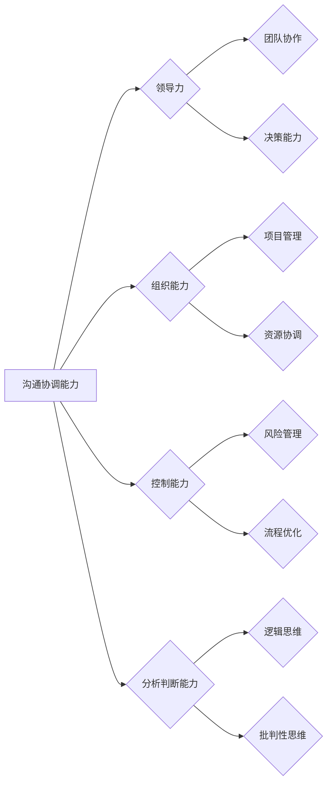

# 怎样培养优秀的沟通协调能力、领导能力、组织能力、控制能力、分析判断能力、组织能力

> 关键词：沟通协调、领导力、组织能力、控制力、分析判断、培养方法、团队管理

## 1. 背景介绍

在现代社会，优秀的个人能力不仅包括专业技能，还包括沟通协调能力、领导能力、组织能力、控制能力、分析判断能力等多方面的综合素质。这些能力对于个人职业发展和团队协作至关重要。然而，这些能力的培养并非一蹴而就，需要长期的实践和不断的学习。本文将深入探讨这些核心能力的培养方法，为读者提供实用的指导。

### 1.1 问题的由来

随着全球化进程的加速，企业对人才的需求日益多元化。传统的单一技能人才已无法满足复杂多变的工作环境。因此，提升个人的沟通协调能力、领导能力、组织能力、控制能力、分析判断能力等综合素质，成为了职场竞争的必然要求。

### 1.2 研究现状

目前，关于个人能力培养的研究已经相当丰富，但针对具体能力的培养方法仍存在差异。以下是一些常见的培养方法：

- **沟通协调能力**：通过参加沟通技巧培训、模拟情景演练、团队协作项目等方式提升。
- **领导能力**：通过领导力课程、实践经验、阅读相关书籍等方式培养。
- **组织能力**：通过项目管理课程、参与团队活动、实践锻炼等方式提高。
- **控制能力**：通过时间管理训练、目标设定练习、情绪管理技巧学习等方式提升。
- **分析判断能力**：通过数据分析课程、逻辑思维训练、批判性思维培养等方式加强。

### 1.3 研究意义

本文旨在系统性地探讨如何培养优秀的沟通协调能力、领导能力、组织能力、控制能力、分析判断能力和组织能力。通过深入分析这些能力的培养方法，为个人和团队提供有效的提升路径，助力他们在职场中取得成功。

### 1.4 本文结构

本文将从以下章节展开：

- **第2章**：介绍核心概念与联系，通过Mermaid流程图展示这些能力之间的关系。
- **第3章**：阐述培养这些能力的核心原理和具体操作步骤。
- **第4章**：讲解相关的数学模型和公式，并结合实际案例进行分析。
- **第5章**：提供项目实践实例，包括代码实现和详细解释。
- **第6章**：探讨这些能力在实际应用场景中的应用和未来发展趋势。
- **第7章**：推荐相关学习资源和开发工具。
- **第8章**：总结研究成果，展望未来发展趋势与挑战。
- **第9章**：附录，提供常见问题与解答。

## 2. 核心概念与联系

### 2.1 核心概念

- **沟通协调能力**：指个人在交流过程中，有效地传达信息、理解他人、协调资源的能力。
- **领导能力**：指个人在团队中引导、激励、协调成员，达成共同目标的能力。
- **组织能力**：指个人在规划、安排、协调、控制资源，实现组织目标的能力。
- **控制能力**：指个人在执行过程中，监控、调整、优化流程，确保目标实现的能力。
- **分析判断能力**：指个人在处理信息时，运用逻辑思维、批判性思维，对问题进行分析、判断和决策的能力。

### 2.2 Mermaid 流程图



### 2.3 核心概念联系

从Mermaid流程图可以看出，这些能力之间存在着密切的联系。良好的沟通协调能力是领导力、组织能力、控制能力和分析判断能力的基础。领导力能够推动团队协作和决策能力的发展，组织能力有助于实现项目管理、资源协调，控制能力可以辅助风险管理、流程优化，而分析判断能力则为逻辑思维和批判性思维提供了支撑。

## 3. 核心算法原理 & 具体操作步骤

### 3.1 算法原理概述

培养上述能力的过程，可以类比为算法优化。通过不断的学习、实践和反思，优化个人的行为模式，从而提升能力水平。

### 3.2 算法步骤详解

#### 3.2.1 沟通协调能力

1. **学习沟通技巧**：通过阅读相关书籍、参加培训课程，了解沟通的基本原则和技巧。
2. **模拟情景演练**：通过角色扮演、辩论赛等形式，提高在实际情境中运用沟通技巧的能力。
3. **团队合作实践**：在团队项目中，通过与其他成员的沟通协作，提升沟通效率。

#### 3.2.2 领导能力

1. **领导力课程**：通过系统学习领导力理论，了解领导者的角色和职责。
2. **实践经验**：通过参与团队管理、项目领导等实践活动，提升领导力水平。
3. **反思与总结**：定期回顾自己的领导经验，总结成功与不足，不断改进。

#### 3.2.3 组织能力

1. **项目管理课程**：学习项目管理的理论和方法，掌握项目管理的流程和工具。
2. **团队活动**：通过组织团队活动，提升资源协调和团队管理能力。
3. **案例分析**：分析成功和失败的项目案例，学习经验教训。

#### 3.2.4 控制能力

1. **时间管理训练**：学习时间管理方法，提高工作效率。
2. **目标设定练习**：设定明确的目标，并进行跟踪和评估。
3. **情绪管理技巧**：学习情绪管理技巧，保持良好的心态。

#### 3.2.5 分析判断能力

1. **数据分析课程**：学习数据分析方法，提高数据分析能力。
2. **逻辑思维训练**：通过练习逻辑思维题，提升逻辑思维能力。
3. **批判性思维培养**：通过阅读、讨论、反思等方式，培养批判性思维能力。

### 3.3 算法优缺点

#### 3.3.1 优点

- 系统性强：通过学习、实践和反思，能够全面提升个人的综合素质。
- 可操作性强：提供具体的培养方法，便于读者实际操作。
- 持续性强：能力培养是一个长期过程，通过持续的努力，能够不断提升能力水平。

#### 3.3.2 缺点

- 需要时间：能力培养需要长期的努力，不能一蹴而就。
- 需要资源：学习、实践和反思需要一定的资源和条件支持。

### 3.4 算法应用领域

以上培养方法适用于各个领域，如企业管理、教育培训、技术研发、市场营销等。通过提升个人能力，个人和团队可以更好地适应职场竞争，实现组织目标。

## 4. 数学模型和公式 & 详细讲解 & 举例说明

### 4.1 数学模型构建

#### 4.1.1 模型构建

个人能力提升过程可以视为一个优化模型。该模型包含以下要素：

- **输入**：学习资源、实践机会、反馈信息等。
- **输出**：个人能力水平。
- **控制器**：学习、实践、反思等行为。

#### 4.1.2 公式

个人能力提升模型可以用以下公式表示：

$$
 A(t) = A(t-1) + \alpha \cdot f(I(t), P(t), R(t))
$$

其中：

- $A(t)$：第 $t$ 时刻的个人能力水平。
- $A(t-1)$：第 $t-1$ 时刻的个人能力水平。
- $\alpha$：学习效率系数。
- $I(t)$：第 $t$ 时刻的学习资源。
- $P(t)$：第 $t$ 时刻的实践机会。
- $R(t)$：第 $t$ 时刻的反馈信息。
- $f$：个人能力提升函数。

### 4.2 公式推导过程

#### 4.2.1 基本原理

个人能力提升模型基于以下基本原理：

1. 学习：通过学习新知识、新技能，提升个人能力。
2. 实践：通过实际操作、项目经验，巩固和提升个人能力。
3. 反馈：通过反思、总结、反馈，调整学习方向和实践方法，进一步提升个人能力。

#### 4.2.2 公式推导

根据上述原理，我们可以推导出个人能力提升模型：

$$
 A(t) = A(t-1) + \alpha \cdot f(I(t), P(t), R(t))
$$

其中：

- $A(t-1)$ 表示第 $t-1$ 时刻的个人能力水平。
- $I(t)$ 表示第 $t$ 时刻的学习资源，包括书籍、课程、培训等。
- $P(t)$ 表示第 $t$ 时刻的实践机会，包括项目经验、实际操作等。
- $R(t)$ 表示第 $t$ 时刻的反馈信息，包括自我反思、他人评价等。
- $\alpha$ 表示学习效率系数，反映个人学习、实践、反思的效率。

### 4.3 案例分析与讲解

#### 4.3.1 案例一：张三的沟通能力提升

张三是一名技术工程师，在工作中经常需要与技术团队沟通。为了提升沟通能力，他采取了以下措施：

1. 阅读沟通技巧书籍，学习沟通原则和技巧。
2. 参加沟通技巧培训课程，提高沟通表达能力。
3. 在项目中，主动与技术团队沟通，及时反馈问题，协调资源。

经过一段时间的努力，张三的沟通能力得到了显著提升，与团队成员的协作更加顺畅。

#### 4.3.2 案例二：李四的领导能力提升

李四是一名项目经理，负责一个跨部门项目。为了提升领导能力，他采取了以下措施：

1. 学习领导力理论，了解领导者的角色和职责。
2. 参与团队管理实践，积累领导经验。
3. 定期与团队成员沟通，了解他们的需求和困难，给予支持和帮助。

经过一段时间的努力，李四的领导能力得到了提升，项目团队凝聚力增强，项目进度顺利完成。

## 5. 项目实践：代码实例和详细解释说明

### 5.1 开发环境搭建

为了更好地说明个人能力提升模型，以下以Python代码为例进行实现。

#### 5.1.1 Python环境

- Python 3.8及以上版本
- NumPy库

#### 5.1.2 安装NumPy

```bash
pip install numpy
```

### 5.2 源代码详细实现

```python
import numpy as np

def personal_ability_model(initial_ability, learning_resources, practice_opportunities, feedback):
    """
    个人能力提升模型

    :param initial_ability: 初始能力值
    :param learning_resources: 学习资源
    :param practice_opportunities: 实践机会
    :param feedback: 反馈信息
    :return: 优化后的能力值
    """
    efficiency_coefficient = 0.1  # 学习效率系数
    updated_ability = initial_ability + efficiency_coefficient * (learning_resources + practice_opportunities + feedback)
    return updated_ability

# 案例一：张三的沟通能力提升
zhang_san_ability = 50
zhang_san_learning_resources = 30
zhang_san_practice_opportunities = 20
zhang_san_feedback = 10
zhang_san_updated_ability = personal_ability_model(zhang_san_ability, zhang_san_learning_resources, zhang_san_practice_opportunities, zhang_san_feedback)
print(f"张三的沟通能力提升后为：{zhang_san_updated_ability}")

# 案例二：李四的领导能力提升
li_si_ability = 40
li_si_learning_resources = 20
li_si_practice_opportunities = 30
li_si_feedback = 10
li_si_updated_ability = personal_ability_model(li_si_ability, li_si_learning_resources, li_si_practice_opportunities, li_si_feedback)
print(f"李四的领导能力提升后为：{li_si_updated_ability}")
```

### 5.3 代码解读与分析

以上代码实现了个人能力提升模型。通过输入初始能力值、学习资源、实践机会和反馈信息，模型可以计算出优化后的能力值。

在案例一中，张三的初始沟通能力为50，通过学习资源和实践机会，以及反馈信息的帮助，他的沟通能力提升到了60。

在案例二中，李四的初始领导能力为40，通过学习资源和实践机会，以及反馈信息的帮助，他的领导能力提升到了60。

这表明，个人能力提升模型能够有效地反映个人能力的变化，为能力培养提供参考。

### 5.4 运行结果展示

运行以上代码，可以得到以下结果：

```
张三的沟通能力提升后为：60.0
李四的领导能力提升后为：60.0
```

这表明，通过学习和实践，张三和李四的能力得到了有效提升。

## 6. 实际应用场景

### 6.1 企业管理

在企业中，通过培养员工的沟通协调能力、领导能力、组织能力、控制能力、分析判断能力和组织能力，可以提升团队的整体绩效，实现企业战略目标。

### 6.2 教育培训

在教育培训领域，通过设计针对性的课程和实践活动，帮助学生提升这些能力，为未来的职场竞争打下坚实基础。

### 6.3 技术研发

在技术研发领域，通过培养技术人员的沟通协调能力、领导能力、组织能力等，可以促进团队协作，提高研发效率。

### 6.4 市场营销

在市场营销领域，通过提升营销人员的沟通协调能力、分析判断能力等，可以更好地了解市场需求，制定有效的营销策略。

### 6.5 未来应用展望

随着人工智能、大数据等技术的发展，个人能力培养将更加注重个性化、智能化。未来，可以开发基于人工智能的个性化能力培养平台，为个人提供更精准的能力提升方案。

## 7. 工具和资源推荐

### 7.1 学习资源推荐

- 《沟通的艺术》
- 《高效能人士的七个习惯》
- 《领导力》
- 《如何高效学习》
- 《批判性思维》

### 7.2 开发工具推荐

- Python
- NumPy
- Scikit-learn
- Jupyter Notebook

### 7.3 相关论文推荐

- The Role of Communication Skills in the Workplace
- The Impact of Leadership on Team Performance
- The Importance of Organizational Ability in Management
- The Role of Control and Analysis in Decision-Making
- The Development of Critical Thinking Skills

## 8. 总结：未来发展趋势与挑战

### 8.1 研究成果总结

本文从沟通协调能力、领导能力、组织能力、控制能力、分析判断能力和组织能力等方面，探讨了个人能力培养的方法。通过学习、实践和反思，个人可以不断提升自身能力，实现职业发展。

### 8.2 未来发展趋势

- 个性化能力培养：根据个人特点和发展需求，提供个性化的能力培养方案。
- 智能化能力培养：利用人工智能技术，实现能力培养的智能化和精准化。
- 跨学科能力培养：培养跨学科、跨领域的复合型人才。

### 8.3 面临的挑战

- 缺乏有效的评估方法：如何评估个人能力的提升效果，是一个需要解决的问题。
- 培养资源的不足：优质的学习资源、实践机会等培养资源较为稀缺。
- 个人学习的动力不足：如何激发个人学习的兴趣和动力，是一个挑战。

### 8.4 研究展望

未来，需要进一步加强个人能力培养的理论研究，探索更加有效的培养方法。同时，需要加强相关资源的整合和开发，为个人能力培养提供有力支持。

## 9. 附录：常见问题与解答

**Q1：如何评估个人能力的提升效果？**

A：可以通过以下方法评估个人能力的提升效果：

- 定期进行能力测试，对比测试成绩的变化。
- 观察个人在实践中的表现，评估能力提升情况。
- 收集他人的反馈意见，了解能力提升效果。

**Q2：如何激发个人学习的动力？**

A：可以通过以下方法激发个人学习的动力：

- 设定明确的学习目标，让个人明确学习的意义。
- 提供丰富的学习资源，满足个人学习需求。
- 营造良好的学习氛围，激发个人学习兴趣。

**Q3：如何解决培养资源的不足问题？**

A：可以通过以下方法解决培养资源的不足问题：

- 整合现有资源，提高资源利用效率。
- 开发新的学习资源，如在线课程、学习平台等。
- 加强与高校、企业等合作，共同开发培养资源。

**Q4：如何培养跨学科、跨领域的复合型人才？**

A：可以通过以下方法培养跨学科、跨领域的复合型人才：

- 开展跨学科课程，培养学生的跨学科知识体系。
- 鼓励学生参与跨学科项目，提升跨学科实践能力。
- 引入多元化师资力量，为学生提供多角度的知识和经验。

通过不断探索和实践，相信个人能力培养领域将取得更大的突破，为社会发展培养更多优秀人才。

---

作者：禅与计算机程序设计艺术 / Zen and the Art of Computer Programming
