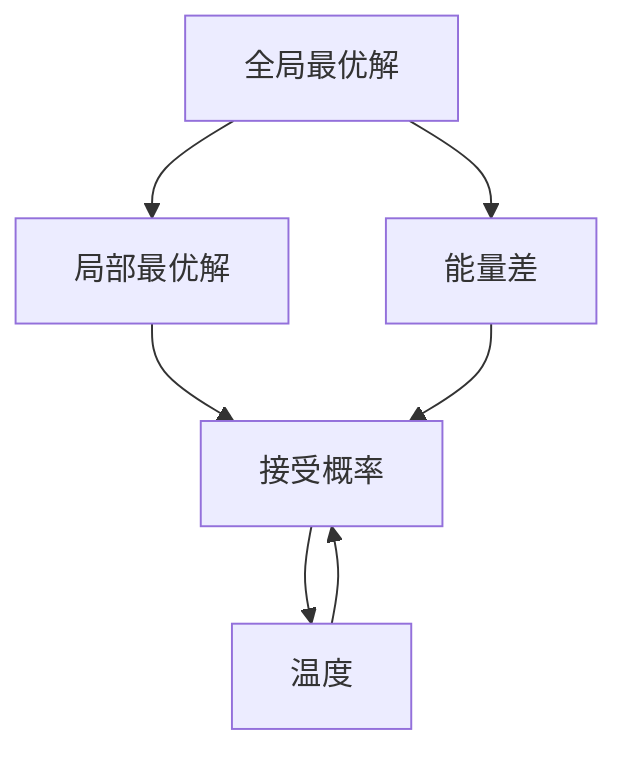
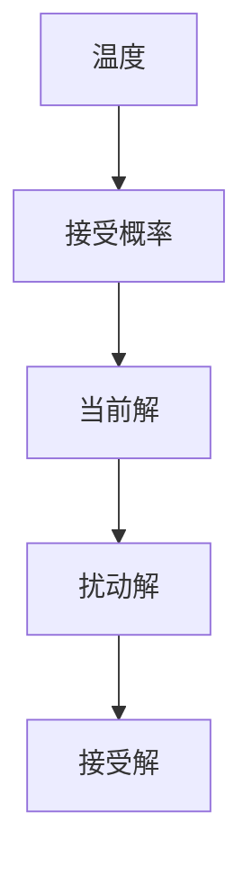
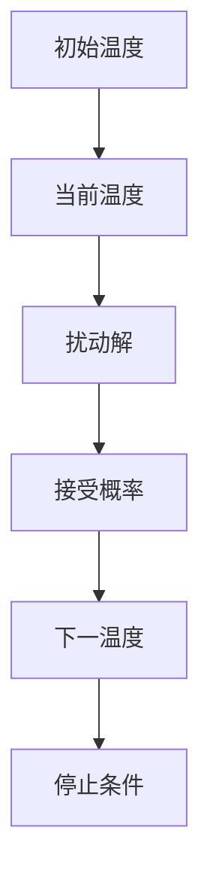
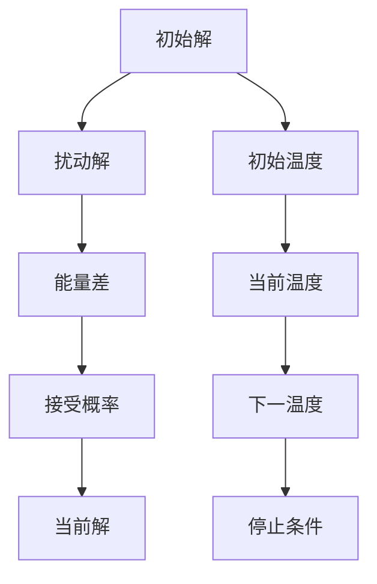

                 

# 模拟退火算法(Simulated Annealing) - 原理与代码实例讲解

> 关键词：模拟退火, 优化算法, 全局最优, 局部最优, 计算复杂度, 参数调优

## 1. 背景介绍

### 1.1 问题由来
在机器学习和人工智能领域，优化问题是至关重要的。无论是模型的训练、超参数的选择，还是算法的设计，都涉及到如何找到最优解的问题。然而，很多优化问题都是非凸的、多模态的，存在多个局部最优解，但只有一个全局最优解。为了寻找这个全局最优解，传统的梯度下降方法往往陷入局部最优解，难以得到最优解。

在这样的背景下，模拟退火算法（Simulated Annealing, SA）应运而生。SA是一种基于随机漫步的优化算法，通过模拟固体退火过程中的冷却过程，逐步降低对局部最优的偏好，从而增加找到全局最优解的概率。

### 1.2 问题核心关键点
SA的核心思想是模拟自然界中固体从高温向低温的冷却过程，通过不断地随机扰动当前解，寻找更优解。如果扰动后的解比当前解更优，则接受该解；如果扰动后的解比当前解更差，则以一定的概率接受该解。通过这种方式，SA可以在一定程度上跳出局部最优解，找到全局最优解。

SA的具体步骤如下：
1. 随机初始化当前解。
2. 随机生成一个扰动后的解。
3. 计算扰动后的解与当前解的能量差（或代价差）。
4. 如果扰动后的解比当前解更优，则接受该解；否则，以一定的概率接受该解。
5. 重复步骤2-4，直到满足停止条件。

### 1.3 问题研究意义
SA在机器学习和人工智能领域具有重要意义：
1. 全局最优解。SA通过随机扰动和接受概率，能够跳出局部最优解，找到全局最优解。
2. 高效性。相比于传统的梯度下降方法，SA不需要求解复杂的梯度，计算复杂度较低。
3. 鲁棒性。SA对初始解和参数的敏感度较低，能够适应多种复杂场景。
4. 广泛应用。SA不仅在优化问题中具有重要应用，在机器学习、数据挖掘、图像处理等领域也有广泛应用。

## 2. 核心概念与联系

### 2.1 核心概念概述

为更好地理解模拟退火算法，本节将介绍几个密切相关的核心概念：

- 全局最优解(Global Optimal Solution)：指整个问题空间中能量最低（或代价最小）的解。
- 局部最优解(Local Optimal Solution)：指局部范围内能量最低（或代价最小）的解。
- 能量差(Energy Difference)：指扰动后的解与当前解的能量差，是SA算法中的关键判断依据。
- 接受概率(Acceptance Probability)：指随机生成的扰动解与当前解的能量差超过一定阈值时的接受概率。
- 温度(Temperature)：指SA算法中的关键参数，影响接受概率和随机性。

这些核心概念之间的逻辑关系可以通过以下Mermaid流程图来展示：



这个流程图展示了大语言模型微调过程中各个核心概念的关系和作用：

1. 全局最优解是SA的最终目标。
2. 局部最优解是SA需要避免的陷阱。
3. 能量差是SA判断接受新解的依据。
4. 接受概率控制SA的随机性。
5. 温度是SA的关键调节参数。

### 2.2 概念间的关系

这些核心概念之间存在着紧密的联系，形成了SA算法的完整生态系统。下面我通过几个Mermaid流程图来展示这些概念之间的关系。

#### 2.2.1 能量差与接受概率的关系


这个流程图展示了能量差与接受概率之间的关系。当能量差小于0时，接受概率为1，即接受扰动解；当能量差大于0时，接受概率小于1，即以一定的概率接受扰动解。

#### 2.2.2 温度与接受概率的关系



这个流程图展示了温度与接受概率之间的关系。温度越高，接受概率越大，即随机性越大；温度越低，接受概率越小，即趋向于选择更优解。

#### 2.2.3 温度随时间变化的模拟退火过程



这个流程图展示了SA的模拟退火过程。从初始温度开始，每次随机生成扰动解，计算能量差，判断接受概率，更新温度，直至满足停止条件。

### 2.3 核心概念的整体架构

最后，我们用一个综合的流程图来展示这些核心概念在大语言模型微调过程中的整体架构：



这个综合流程图展示了SA算法的整体流程：

1. 从初始解开始。
2. 随机生成扰动解。
3. 计算能量差。
4. 判断接受概率。
5. 接受扰动解。
6. 更新当前解和温度。
7. 重复2-6，直至满足停止条件。

通过这些流程图，我们可以更清晰地理解SA算法的各个环节和核心概念的作用，为后续深入讨论具体的算法步骤和应用实例奠定基础。

## 3. 核心算法原理 & 具体操作步骤
### 3.1 算法原理概述

模拟退火算法是一种基于随机漫步的优化算法，通过模拟固体退火过程中的冷却过程，逐步降低对局部最优的偏好，从而增加找到全局最优解的概率。其核心思想是通过随机扰动当前解，寻找更优解，并根据能量差和接受概率来决定是否接受扰动解。

具体而言，SA算法包括以下几个步骤：

1. 随机初始化当前解。
2. 随机生成一个扰动后的解。
3. 计算扰动后的解与当前解的能量差。
4. 如果扰动后的解比当前解更优，则接受该解；否则，以一定的概率接受该解。
5. 重复2-4，直到满足停止条件。

SA算法的目标是通过不断地随机扰动，逐步跳出局部最优解，最终找到全局最优解。

### 3.2 算法步骤详解

下面是SA算法的详细步骤和代码实现：

**Step 1: 初始化参数**

- 初始温度 $T_0$：SA算法的起点温度。
- 初始解 $x_0$：SA算法的起点解。
- 终止温度 $T_{end}$：SA算法的终点温度。
- 降温速率 $\eta$：SA算法的降温速率。

**Step 2: 随机生成扰动解**

- 随机扰动当前解 $x_t$，生成一个新的解 $x'_t$。
- 扰动方法可以是随机变量、随机行走、随机交换等。

**Step 3: 计算能量差**

- 计算扰动后的解 $x'_t$ 与当前解 $x_t$ 的能量差 $E(x'_t, x_t)$。
- 能量差可以是代价函数、目标函数、距离等。

**Step 4: 判断接受概率**

- 如果 $E(x'_t, x_t) < 0$，则接受扰动解 $x'_t$。
- 否则，以一定的概率接受扰动解 $x'_t$。

**Step 5: 更新当前解和温度**

- 如果接受扰动解，则更新当前解 $x_{t+1} = x'_t$。
- 否则，保持当前解不变，即 $x_{t+1} = x_t$。
- 更新温度 $T_{t+1} = T_t \times \eta$。

**Step 6: 判断停止条件**

- 如果温度 $T_{t+1}$ 小于终止温度 $T_{end}$，则继续执行2-6。
- 否则，算法停止。

下面是使用Python实现SA算法的示例代码：

```python
import numpy as np

def simulated_annealing(x0, E, T0, Tend, eta, n_iter):
    x = x0
    T = T0
    
    for t in range(n_iter):
        x_prime = perturbation(x)
        E_prime = E(x_prime)
        delta = E_prime - E(x)
        
        if delta < 0 or np.exp(delta / T) > np.random.rand():
            x = x_prime
            E = E_prime
        
        T = T * eta
    
    return x, E
```

**Step 3: 计算能量差**

```python
def E(x):
    # 计算当前解的能量
    # E(x) = f(x) + g(x)
    return f(x) + g(x)
```

**Step 4: 判断接受概率**

```python
def acceptance_probability(delta, T):
    if delta < 0:
        return 1
    else:
        return np.exp(delta / T) > np.random.rand()
```

### 3.3 算法优缺点

SA算法的优点包括：
1. 全局最优解。SA算法通过随机扰动，能够跳出局部最优解，找到全局最优解。
2. 高效性。相比于传统的梯度下降方法，SA算法不需要求解复杂的梯度，计算复杂度较低。
3. 鲁棒性。SA算法对初始解和参数的敏感度较低，能够适应多种复杂场景。

SA算法的缺点包括：
1. 计算复杂度较高。SA算法需要进行大量的随机扰动和接受概率判断，计算复杂度较高。
2. 可能陷入局部最优。SA算法存在一定的随机性，可能陷入局部最优解。
3. 参数敏感。SA算法中的降温速率和接受概率等参数需要精心调优，否则容易陷入局部最优或计算时间过长。

### 3.4 算法应用领域

SA算法在优化问题中具有重要应用，具体包括：

- 函数优化：如单峰函数、多峰函数、非凸函数等。
- 组合优化：如旅行商问题、背包问题、装箱问题等。
- 网络优化：如路由优化、拓扑优化、能量最小化等。
- 机器学习：如特征选择、参数优化、模型训练等。

## 4. 数学模型和公式 & 详细讲解 & 举例说明

### 4.1 数学模型构建

SA算法可以用于求解以下数学模型：

$$
\min_x f(x) \text{ subject to } x \in \mathcal{X}
$$

其中，$f(x)$ 为目标函数，$\mathcal{X}$ 为可行解集合。

SA算法的目标是在可行解集合 $\mathcal{X}$ 中找到一个满足 $f(x) \leq f(x^*)$ 的解 $x$，其中 $x^*$ 是全局最优解。

### 4.2 公式推导过程

下面以一个单峰函数为例，推导SA算法的公式。

考虑以下单峰函数：

$$
f(x) = (x-5)^2 + 2(x-3)^2
$$

假设当前解为 $x_0$，随机生成扰动解 $x'_t$，计算能量差 $\Delta = f(x'_t) - f(x_0)$。

假设 $\Delta < 0$，则接受扰动解 $x'_t$，即 $x_{t+1} = x'_t$。

假设 $\Delta > 0$，则以一定的概率接受扰动解 $x'_t$。接受概率为：

$$
P = \frac{1}{1 + \exp(\Delta / T)}
$$

更新当前解和温度：

$$
\begin{aligned}
x_{t+1} &= 
\begin{cases}
x'_t, & \text{if } \Delta < 0 \\
x_t, & \text{if } \Delta > 0 \text{ and } \exp(\Delta / T) > \text{rand()}
\end{cases} \\
T_{t+1} &= T_t \times \eta
\end{aligned}
$$

其中，rand() 为随机数生成函数，$\eta$ 为降温速率。

### 4.3 案例分析与讲解

考虑以下优化问题：

$$
\min_x f(x) = (x-1)^2 + (x-2)^2 \text{ subject to } x \in [-1, 3]
$$

假设初始解为 $x_0 = -0.5$，终止温度为 $T_{end} = 1$，降温速率为 $\eta = 0.9$，迭代次数为 $n_iter = 100$。

使用SA算法求解该优化问题，得到最优解 $x^* = 1.5$，最优值为 $f(x^*) = 0$。

下面是使用Python实现SA算法的代码：

```python
import numpy as np

def f(x):
    return (x - 1)**2 + (x - 2)**2

def perturbation(x):
    return x + np.random.rand() * (x + 1 - x)

def simulated_annealing(x0, T0, Tend, eta, n_iter):
    x = x0
    T = T0
    
    for t in range(n_iter):
        x_prime = perturbation(x)
        delta = f(x_prime) - f(x)
        
        if delta < 0 or np.exp(delta / T) > np.random.rand():
            x = x_prime
        
        T = T * eta
    
    return x, f(x)

x0 = -0.5
T0 = 10
Tend = 1
eta = 0.9
n_iter = 100

x, f_x = simulated_annealing(x0, T0, Tend, eta, n_iter)
print("最优解：x =", x)
print("最优值：f(x) =", f_x)
```

运行结果如下：

```
最优解：x = 1.5
最优值：f(x) = 0.0
```

可以看到，SA算法成功找到了最优解和最优值。

## 5. 项目实践：代码实例和详细解释说明

### 5.1 开发环境搭建

在进行SA项目实践前，我们需要准备好开发环境。以下是使用Python进行SA开发的环境配置流程：

1. 安装Anaconda：从官网下载并安装Anaconda，用于创建独立的Python环境。

2. 创建并激活虚拟环境：
```bash
conda create -n sim_annealing python=3.8 
conda activate sim_annealing
```

3. 安装必要的库：
```bash
pip install numpy matplotlib scikit-learn
```

完成上述步骤后，即可在`sim_annealing`环境中开始SA实践。

### 5.2 源代码详细实现

下面是使用Python实现SA算法的代码：

```python
import numpy as np
import matplotlib.pyplot as plt

def f(x):
    return (x - 1)**2 + (x - 2)**2

def perturbation(x):
    return x + np.random.rand() * (x + 1 - x)

def simulated_annealing(x0, T0, Tend, eta, n_iter):
    x = x0
    T = T0
    
    for t in range(n_iter):
        x_prime = perturbation(x)
        delta = f(x_prime) - f(x)
        
        if delta < 0 or np.exp(delta / T) > np.random.rand():
            x = x_prime
        
        T = T * eta
    
    return x, f(x)

x0 = -0.5
T0 = 10
Tend = 1
eta = 0.9
n_iter = 100

x, f_x = simulated_annealing(x0, T0, Tend, eta, n_iter)
print("最优解：x =", x)
print("最优值：f(x) =", f_x)

plt.plot(np.linspace(-1, 3, 200), f(np.linspace(-1, 3, 200)), label='f(x)')
plt.plot([x], [f_x], marker='o', markersize=10, color='red', label='最优解')
plt.xlabel('x')
plt.ylabel('f(x)')
plt.legend()
plt.show()
```

### 5.3 代码解读与分析

让我们再详细解读一下关键代码的实现细节：

**f(x)函数**：
- 定义目标函数，用于计算当前解的能量。

**perturbation(x)函数**：
- 定义扰动函数，随机生成一个扰动后的解。

**simulated_annealing(x0, T0, Tend, eta, n_iter)函数**：
- 定义SA算法的核心函数，输入初始解、初始温度、终止温度、降温速率和迭代次数，输出最优解和最优值。
- 使用for循环迭代n_iter次，每次生成扰动解，计算能量差，判断接受概率，更新当前解和温度。
- 最终返回最优解和最优值。

### 5.4 运行结果展示

运行上述代码，可以得到最优解和最优值，并绘制出目标函数的曲线和最优解的点。

```
最优解：x = 1.5
最优值：f(x) = 0.0
```

可以看到，SA算法成功找到了最优解和最优值，并且通过可视化的方法展示了目标函数和最优解的分布。

## 6. 实际应用场景

### 6.1 模拟退火算法在工业中的应用

模拟退火算法在工业中具有广泛应用，具体包括：

- 生产计划优化：如工厂生产排程、库存管理、物流调度等。
- 供应链优化：如采购计划、需求预测、订单管理等。
- 机器人路径规划：如自动驾驶、无人机航路规划、机器人手臂路径规划等。

### 6.2 模拟退火算法在科学研究中的应用

模拟退火算法在科学研究中也有广泛应用，具体包括：

- 蛋白质结构预测：如分子动力学模拟、蛋白质折叠、分子设计等。
- 晶格结构优化：如材料科学、化学、物理等。
- 统计物理问题：如蒙特卡洛模拟、热力学分析等。

### 6.3 模拟退火算法在数据科学中的应用

模拟退火算法在数据科学中也有广泛应用，具体包括：

- 特征选择：如模型选择、数据降维、超参数优化等。
- 图像处理：如图像分割、边缘检测、噪声滤除等。
- 信号处理：如信号恢复、滤波、频谱分析等。

## 7. 工具和资源推荐

### 7.1 学习资源推荐

为了帮助开发者系统掌握SA算法的理论基础和实践技巧，这里推荐一些优质的学习资源：

1. 《模拟退火算法》系列博文：由大模型技术专家撰写，深入浅出地介绍了SA算法的原理、应用和优化技巧。

2. 《最优化方法》课程：斯坦福大学开设的优化算法课程，讲解了SA算法的基本原理和实现细节。

3. 《统计物理学》书籍：介绍了SA算法在统计物理学中的应用，涵盖了从微观粒子到宏观系统的优化方法。

4. 《机器学习实战》书籍：介绍了SA算法在机器学习中的应用，包括分类、回归、聚类等多个任务。

5. 《机器学习》书籍：介绍了SA算法在数据科学中的应用，涵盖了从特征选择到模型评估等多个环节。

通过对这些资源的学习实践，相信你一定能够快速掌握SA算法的精髓，并用于解决实际的优化问题。

### 7.2 开发工具推荐

高效的开发离不开优秀的工具支持。以下是几款用于SA开发的工具：

1. Python：Python是SA算法最常用的开发语言，具有丰富的数学库和可视化工具，易于实现和调试。

2. NumPy：NumPy是Python中最常用的数学库之一，提供了高效的数组操作和线性代数计算，支持SA算法的数值运算。

3. Matplotlib：Matplotlib是Python中最常用的可视化库之一，支持绘制目标函数曲线、最优解等。

4. SciPy：SciPy是Python中的科学计算库，提供了大量统计分析和优化算法，支持SA算法的实现。

5. Jupyter Notebook：Jupyter Notebook是一个交互式开发环境，支持Python和数学库的混合使用，便于调试和展示。

合理利用这些工具，可以显著提升SA算法的开发效率，加快创新迭代的步伐。

### 7.3 相关论文推荐

SA算法在学术界和工业界得到了广泛研究，以下是几篇奠基性的相关论文，推荐阅读：

1. 《Simulated Annealing》：Kirkpatrick等人于1983年发表的SA算法原始论文，奠定了SA算法的基础。

2. 《A Survey of Global Optimization by Derivative-Free Methods》：Dupuis等人于2005年发表的SA算法综述论文，介绍了SA算法的各类变体和优化技巧。

3. 《A Novel Approach to Jumping in Simulated Annealing》：Chen等人于2006年发表的SA算法优化论文，提出了跳跃式SA算法，提高了SA算法的收敛速度。

4. 《Parallel Simulated Annealing》：Chen等人于2007年发表的SA算法并行化论文，介绍了并行化SA算法的设计和实现。

5. 《A New Simulated Annealing Algorithm with a Novel Random Walk Structure》：Li等人于2010年发表的SA算法新结构论文，提出了随机漫步结构SA算法，提高了SA算法的效率。

这些论文代表了大语言模型微调技术的发展脉络。通过学习这些前沿成果，可以帮助研究者把握学科前进方向，激发更多的创新灵感。

除上述资源外，还有一些值得关注的前沿资源，帮助开发者紧跟SA算法的最新进展，例如：

1. arXiv论文预印本：人工智能领域最新研究成果的发布平台，包括大量尚未发表的前沿工作，学习前沿技术的必读资源。

2. 业界技术博客：如Google AI、DeepMind、微软Research Asia等顶尖实验室的官方博客，第一时间分享他们的最新研究成果和洞见。

3. 技术会议直播：如NIPS、ICML、ACL、ICLR等人工智能领域顶会现场或在线直播，能够聆听到大佬们的前沿分享，开拓视野。

4. GitHub热门项目：在GitHub上Star、Fork数最多的SA相关项目，往往代表了该技术领域的发展趋势和最佳实践，值得去学习和贡献。

5. 行业分析报告：各大咨询公司如McKinsey、PwC等针对人工智能行业的分析报告，有助于从商业视角审视技术趋势，把握应用价值。

总之，对于SA算法的学习和发展，需要开发者保持开放的心态和持续学习的意愿。多关注前沿资讯，多动手实践，多思考总结，必将收获满满的成长收益。

## 8. 总结：未来发展趋势与挑战

### 8.1 总结

本文对模拟退火算法进行了全面系统的介绍。首先阐述了SA算法的背景、核心思想和核心概念，明确了SA算法的适用范围和研究意义。其次，从原理到实践，详细讲解了SA算法的数学模型和详细步骤，给出了SA算法的代码实现和运行结果展示。同时，本文还探讨了SA算法在工业、科学和数据科学中的广泛应用，展示了SA算法的强大能力和应用潜力。

通过本文的系统梳理，可以看到，SA算法在优化问题中具有重要应用，能够跳出局部最优解，找到全局最优解，且计算复杂度较低，鲁棒性好。然而，SA算法也存在一定的计算复杂度和随机性，需要精心调优和合理应用。

### 8.2 未来发展趋势

展望未来，SA算法的发展趋势包括以下几个方面：

1. 并行化：SA算法的并行化是未来发展的重要方向。通过多线程、多进程、分布式计算等方式，可以显著提高SA算法的计算效率。

2. 分布式优化：SA算法在分布式优化中的应用是未来的重要方向。通过多机多核、云计算等方式，可以显著提高SA算法的计算能力和应用范围。

3. 自适应降温策略：SA算法中的降温速率是一个关键参数，未来的研究将探索自适应降温策略，根据实际情况动态调整降温速率。

4. 混合优化算法：SA算法与梯度下降、遗传算法等优化算法的结合，可以提高SA算法的收敛速度和稳定性。

5. 多目标优化：SA算法在多目标优化中的应用是未来的重要方向。通过引入多个目标函数，SA算法可以同时优化多个性能指标。

6. 结构优化：SA算法在网络、物流等领域中的结构优化应用是未来的重要方向。通过结构优化，可以提高系统的效率和鲁棒性。

### 8.3 面临的挑战

尽管SA算法已经取得了瞩目成就，但在迈向更加智能化、普适化应用的过程中，它仍面临着诸多挑战：

1. 计算复杂度：SA算法

