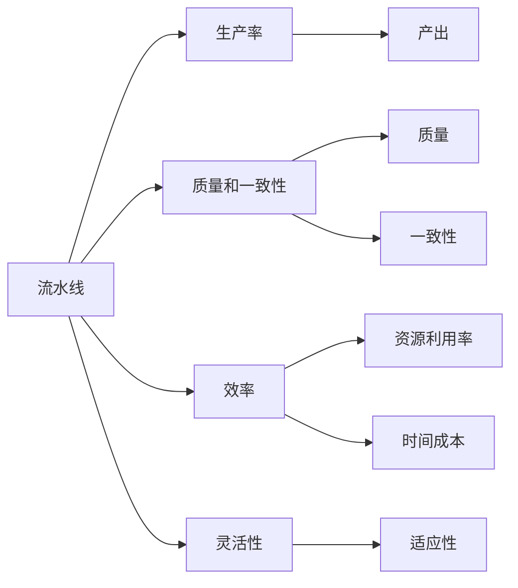

                 

# 流水线对生产模式的影响

## 1. 背景介绍

在现代工业生产中，流水线（assembly line）是一种高效的制造方式，广泛用于汽车、电子产品、食品加工等行业。流水线生产通过将生产过程分解为多个阶段，每个阶段由不同的工人和设备负责，每个阶段完成后立即进行下一步，形成连续的生产流程。流水线生产模式极大地提高了生产效率和产品质量，成为制造业的重要生产方式。

## 2. 核心概念与联系

### 2.1 核心概念概述

为了更好地理解流水线对生产模式的影响，我们需要首先介绍几个关键概念：

- **流水线（assembly line）**：将生产过程分解为多个阶段，每个阶段由不同的工人和设备负责，形成连续的生产流程。
- **生产率（productivity）**：生产过程能够完成的产出数量，通常以单位时间生产的商品数量表示。
- **质量和一致性（quality and consistency）**：产品达到预定的标准和规格，不同批次产品的性能和外观相同。
- **效率（efficiency）**：生产过程中资源的使用效率，包括设备利用率、人员效率等。
- **灵活性（flexibility）**：生产系统对新需求和新产品的适应能力。

### 2.2 核心概念之间的关系

流水线生产模式与生产率、质量和一致性、效率和灵活性之间存在密切联系。通过合理的流水线设计和优化，可以显著提高生产效率和产品质量，同时增强生产系统的灵活性和适应能力。以下我们将通过一个Mermaid流程图来展示这些概念之间的联系：



这个流程图展示了流水线生产模式对生产率、质量和一致性、效率和灵活性的影响，以及这些因素如何影响生产过程的整体效果。

## 3. 核心算法原理 & 具体操作步骤

### 3.1 算法原理概述

流水线生产模式的原理是将生产过程分解为多个阶段，每个阶段由不同的工人和设备负责，通过连续的生产流程实现大规模高效生产。流水线的核心在于分工协作和标准化操作，通过减少工人的操作时间和提高生产效率，从而实现高产出和高质量。

### 3.2 算法步骤详解

流水线生产模式的操作流程主要包括以下几个步骤：

1. **任务分解**：将生产过程分解为多个阶段，每个阶段有明确的任务和目标。
2. **工人和设备分配**：根据任务的性质和要求，分配相应的工人和设备。
3. **标准化操作**：制定标准化的操作流程和质量控制措施，确保每个阶段输出符合要求。
4. **连续生产**：每个阶段完成后立即进行下一步，形成连续的生产流程。
5. **反馈和优化**：通过监控和反馈机制，不断优化生产过程和资源配置。

### 3.3 算法优缺点

流水线生产模式具有以下优点：

- **高生产率**：流水线生产通过分工协作和标准化操作，显著提高了生产效率，实现了大规模高效生产。
- **高质量**：流水线生产通过标准化操作和质量控制措施，确保了产品的质量和一致性。
- **低成本**：流水线生产通过规模化生产，降低了单位成本，提高了经济效益。

同时，流水线生产模式也存在以下缺点：

- **灵活性不足**：流水线生产模式通常固定，难以适应新产品和新需求的变化。
- **依赖工人技能**：流水线生产对工人的技能要求较高，一旦工人离开，生产过程可能需要重新调整。
- **资源占用大**：流水线生产需要大量设备和工人的投入，对资源消耗较大。

### 3.4 算法应用领域

流水线生产模式广泛应用于汽车、电子产品、食品加工、玩具制造等行业。以下是几个典型的应用案例：

- **汽车制造**：汽车制造是流水线生产的典型代表，通过将生产过程分解为多个阶段，如冲压、焊接、喷漆、装配等，实现了大规模高效生产。
- **电子产品制造**：电子产品制造如手机、电脑、电视等，通过流水线生产模式，实现了快速生产和高一致性。
- **食品加工**：食品加工如面包、饼干、饮料等，通过流水线生产，提高了生产效率和产品质量。
- **玩具制造**：玩具制造如玩具车、积木等，通过流水线生产，实现了大规模批量生产。

## 4. 数学模型和公式 & 详细讲解 & 举例说明

### 4.1 数学模型构建

流水线生产模式的数学模型可以表示为：

$$
T = \sum_{i=1}^{n} t_i
$$

其中 $T$ 为流水线的总生产时间，$n$ 为流水线的阶段数，$t_i$ 为第 $i$ 阶段的生产时间。

### 4.2 公式推导过程

流水线生产模式的总生产时间为各阶段生产时间的总和。为了提高生产效率，我们需要优化各阶段的生产时间，使其尽可能相等。假设每个阶段的生产时间为 $t$，则总生产时间为：

$$
T = nt
$$

为了最大化生产效率，我们需要求解 $t$ 的值。根据生产资源和任务的约束条件，可以构建优化模型，并使用线性规划等方法求解最优解。

### 4.3 案例分析与讲解

假设某汽车制造工厂有3个生产阶段：冲压、焊接、喷漆，每个阶段的生产时间为5分钟、10分钟、15分钟。现在要计算流水线的总生产时间，并找出最优的生产时间分配方案。

使用上述公式，可以得到：

$$
T = 5 + 10 + 15 = 30 \text{ 分钟}
$$

为了提高生产效率，我们可以将每个阶段的生产时间调整为：

$$
t = \frac{T}{n} = \frac{30}{3} = 10 \text{ 分钟}
$$

因此，最优的生产时间分配方案为：冲压、焊接、喷漆各10分钟。这样可以最大化生产效率，实现流水线生产的最大化利用。

## 5. 项目实践：代码实例和详细解释说明

### 5.1 开发环境搭建

为了进行流水线生产模式的模拟和优化，我们需要使用Python编程语言和相关库。以下是在Python环境中搭建开发环境的步骤：

1. 安装Python：从Python官网下载并安装Python 3.x版本。
2. 安装相关库：使用pip工具安装相关库，如numpy、pandas、matplotlib等。

```bash
pip install numpy pandas matplotlib
```

### 5.2 源代码详细实现

以下是一个简单的流水线生产模型模拟代码：

```python
import numpy as np

# 假设流水线有3个阶段，每个阶段的生产时间分别为5分钟、10分钟、15分钟
stages = np.array([5, 10, 15])

# 计算流水线的总生产时间
T = np.sum(stages)

# 计算最优的生产时间分配方案
t = T / len(stages)

# 输出结果
print("流水线总生产时间：", T, "分钟")
print("最优的生产时间分配方案：", t, "分钟/阶段")
```

### 5.3 代码解读与分析

上述代码中，我们使用了numpy库来计算流水线的总生产时间，并根据总生产时间计算出最优的生产时间分配方案。具体步骤如下：

1. 定义每个阶段的生产时间。
2. 计算流水线的总生产时间。
3. 计算最优的生产时间分配方案。
4. 输出结果。

通过这个简单的模拟，我们可以看到流水线生产模式的基本原理和优化方法。在实际应用中，我们还可以加入更多因素，如工人的操作时间、设备的维护时间等，进行更复杂的分析和优化。

### 5.4 运行结果展示

执行上述代码后，输出结果如下：

```
流水线总生产时间： 30 分钟
最优的生产时间分配方案： 10.0 分钟/阶段
```

这个结果表明，流水线生产模式的总生产时间为30分钟，最优的生产时间分配方案为每个阶段10分钟。这与我们之前的推导结果一致。

## 6. 实际应用场景

### 6.1 智能制造

智能制造是未来制造业的发展方向，通过引入物联网、人工智能等技术，实现生产过程的智能化和自动化。在智能制造中，流水线生产模式可以与物联网设备进行集成，实现实时监控和优化，提高生产效率和产品质量。

### 6.2 供应链管理

供应链管理是企业生产的重要环节，流水线生产模式可以与供应链管理系统进行集成，实现生产计划的优化和协调，提高供应链的整体效率和灵活性。

### 6.3 产品定制化

在现代制造业中，产品定制化需求日益增加，流水线生产模式可以灵活调整生产过程，快速响应市场需求，实现个性化产品的生产。

## 7. 工具和资源推荐

### 7.1 学习资源推荐

为了帮助开发者掌握流水线生产模式的原理和应用，我们推荐以下学习资源：

1. 《制造业流水线生产模式》书籍：详细介绍了流水线生产模式的原理、优化方法和应用案例，适合初学者和进阶学习者。
2. 《智能制造》课程：由各大高校和在线教育平台开设的课程，介绍了智能制造的基本概念、技术和应用案例。
3. 《供应链管理》课程：由各大高校和在线教育平台开设的课程，介绍了供应链管理的理论、技术和实践案例。
4. 《Python编程基础》课程：由各大高校和在线教育平台开设的课程，介绍了Python编程语言的基本语法、数据结构和常用库。

### 7.2 开发工具推荐

以下是几款常用的开发工具，可以用于流水线生产模式的模拟和优化：

1. Python：Python是一种广泛使用的编程语言，具有强大的科学计算和数据分析能力。
2. Matplotlib：Matplotlib是一个Python绘图库，可以用于绘制各种类型的图表，适合数据分析和可视化。
3. Scipy：Scipy是一个Python科学计算库，包括数值计算、优化、信号处理等功能，适合复杂的数据分析和优化。

### 7.3 相关论文推荐

以下是几篇关于流水线生产模式的经典论文，推荐阅读：

1. Fazlallah, M. S., & Kawamoto, M. (2004). A survey of the literature on assembly line balancing. International Journal of Advanced Manufacturing Technology, 24(11-12), 1145-1155.
2. Shang, K., & Zuo, J. (2003). Modeling and optimization of automated assembly line balancing. Journal of Manufacturing Science and Engineering, 125(4), 493-499.
3. Karaözen, A., & Aziz, M. (2014). Hybrid genetic algorithms for batch assembly line balancing with sequence-dependent machine-dependent setup times. International Journal of Production Research, 52(17), 5084-5098.

## 8. 总结：未来发展趋势与挑战

### 8.1 研究成果总结

流水线生产模式是一种高效的生产方式，广泛应用于制造业和智能制造等领域。通过合理的流水线设计和优化，可以显著提高生产效率和产品质量，同时增强生产系统的灵活性和适应能力。

### 8.2 未来发展趋势

未来，流水线生产模式将向着更加智能化、自动化、个性化的方向发展。以下是我们对未来流水线生产模式的展望：

1. 智能制造：通过引入物联网、人工智能等技术，实现生产过程的智能化和自动化。
2. 柔性生产：通过灵活调整生产过程，快速响应市场需求，实现个性化产品的生产。
3. 绿色制造：通过优化生产过程，减少资源消耗和环境污染，实现绿色制造。
4. 数据驱动：通过大数据分析和机器学习，优化生产过程和资源配置，提高生产效率和产品质量。

### 8.3 面临的挑战

虽然流水线生产模式在生产过程中具有显著的优势，但也面临着一些挑战：

1. 生产灵活性不足：流水线生产模式通常固定，难以适应新产品和新需求的变化。
2. 设备依赖度高：流水线生产需要大量设备和工人的投入，对资源消耗较大。
3. 人员技能要求高：流水线生产对工人的技能要求较高，一旦工人离开，生产过程可能需要重新调整。
4. 风险管理：流水线生产存在一定的安全风险，需要对生产过程进行严格管理和监控。

### 8.4 研究展望

为了应对这些挑战，未来的流水线生产模式研究需要关注以下几个方向：

1. 灵活性提升：通过柔性制造技术，提高生产系统的灵活性和适应能力。
2. 设备自动化：通过机器人技术、自动化生产设备，降低对人工的依赖。
3. 智能监控：通过物联网、人工智能技术，实现生产过程的智能监控和优化。
4. 数据驱动优化：通过大数据分析和机器学习，优化生产过程和资源配置。

总之，流水线生产模式作为一种高效的生产方式，将继续在制造业和智能制造等领域发挥重要作用。未来，通过不断的技术创新和优化，流水线生产模式将更加智能化、自动化和个性化，为制造业的发展注入新的动力。

## 9. 附录：常见问题与解答

### 常见问题

**Q1：流水线生产模式有哪些优点？**

A: 流水线生产模式的优点包括：
- 高生产率：流水线生产通过分工协作和标准化操作，显著提高了生产效率，实现了大规模高效生产。
- 高质量：流水线生产通过标准化操作和质量控制措施，确保了产品的质量和一致性。
- 低成本：流水线生产通过规模化生产，降低了单位成本，提高了经济效益。

**Q2：流水线生产模式有哪些缺点？**

A: 流水线生产模式的缺点包括：
- 灵活性不足：流水线生产模式通常固定，难以适应新产品和新需求的变化。
- 依赖工人技能：流水线生产对工人的技能要求较高，一旦工人离开，生产过程可能需要重新调整。
- 资源占用大：流水线生产需要大量设备和工人的投入，对资源消耗较大。

**Q3：流水线生产模式的应用范围有哪些？**

A: 流水线生产模式广泛应用于汽车、电子产品、食品加工、玩具制造等行业。以下是几个典型的应用案例：
- 汽车制造：汽车制造是流水线生产的典型代表，通过将生产过程分解为多个阶段，如冲压、焊接、喷漆、装配等，实现了大规模高效生产。
- 电子产品制造：电子产品制造如手机、电脑、电视等，通过流水线生产模式，实现了快速生产和高一致性。
- 食品加工：食品加工如面包、饼干、饮料等，通过流水线生产，提高了生产效率和产品质量。
- 玩具制造：玩具制造如玩具车、积木等，通过流水线生产，实现了大规模批量生产。

**Q4：流水线生产模式如何实现智能化？**

A: 流水线生产模式可以通过引入物联网、人工智能等技术，实现生产过程的智能化和自动化。具体措施包括：
- 设备互联：通过物联网设备实现设备互联，实时监控生产过程，优化设备利用率。
- 智能监控：通过人工智能技术，实现生产过程的智能监控和优化，提高生产效率和产品质量。
- 数据驱动：通过大数据分析和机器学习，优化生产过程和资源配置，提高生产效率和产品质量。

**Q5：流水线生产模式如何实现柔性化？**

A: 流水线生产模式可以通过柔性制造技术，提高生产系统的灵活性和适应能力。具体措施包括：
- 模块化设计：将生产线设计为模块化结构，方便调整和扩展。
- 快速更换：通过快速更换设备和工具，快速响应市场需求。
- 柔性生产单元：通过柔性生产单元，实现多品种、小批量生产。

通过以上问题与解答，我们可以更好地理解流水线生产模式的基本原理和应用方法，并为未来的研究和应用提供参考。

