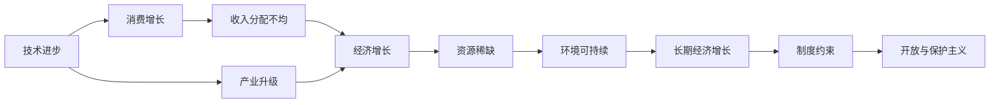

                 

# 深层次矛盾对经济增长的长期影响

## 1. 背景介绍

### 1.1 问题由来
现代经济增长的动力源泉包括技术创新、劳动分工、市场规模扩大以及资源配置优化等方面。然而，在追求经济增长的过程中，往往伴随着一系列深层次矛盾，这些矛盾在长期内会对经济增长的速度和质量产生重要影响。本文章将重点探讨这些矛盾及其对经济增长的长期影响。

### 1.2 问题核心关键点
当前全球经济面临的深层次矛盾主要包括：

1. 技术进步与产业升级的矛盾：随着科技的迅速发展，新兴产业如人工智能、大数据等兴起，对传统产业形成替代压力。
2. 收入分配不均与消费增长的矛盾：财富集中导致消费增长乏力，限制了经济整体活力的释放。
3. 资源稀缺与环境可持续的矛盾：资源有限与环境保护之间需要找到平衡，这对长期的经济可持续发展构成挑战。
4. 创新动力与制度约束的矛盾：创新需要制度保障，但现有的制度环境可能存在滞后。
5. 开放与保护主义的矛盾：国际贸易与保护主义政策之间的博弈，对全球供应链稳定性构成威胁。

这些深层次矛盾不仅影响当前的经济增长，还决定了未来的经济结构和发展方向。理解这些矛盾及其影响机制，有助于制定更为科学合理的经济政策，推动经济持续健康发展。

### 1.3 问题研究意义
探讨深层次矛盾对经济增长的长期影响，有助于深入理解经济系统内在的运行机制，并指导制定更为有效的政策干预措施，确保经济平稳健康增长。具体而言：

1. 为经济政策制定提供理论依据：明确各深层次矛盾的内在联系和影响机制，有助于政府在制定经济政策时，更具有针对性和前瞻性。
2. 优化资源配置：通过分析矛盾对各生产要素（如资本、劳动力、技术等）的影响，指导资源配置优化，提高经济效率。
3. 促进结构调整：理清深层次矛盾，有助于明确产业转型升级的方向，推进经济结构优化。
4. 增强经济韧性：通过识别和应对长期影响，有助于构建更加稳定和可持续的经济体系。
5. 提升国际竞争力：在国际竞争日益激烈的背景下，理解矛盾对长期经济增长影响，有助于制定国际竞争策略，提升国家经济影响力。

## 2. 核心概念与联系

### 2.1 核心概念概述

理解深层次矛盾对经济增长的影响，首先需要明确以下几个核心概念：

- **技术进步**：指的是科技创新和应用所导致的生产效率提高和生产工具改进。
- **产业升级**：指传统产业向高附加值、高技术含量、绿色低碳方向转变的过程。
- **收入分配不均**：指社会中收入差距过大，收入集中在少数人手中，而多数人收入相对较低。
- **消费增长**：指在一定时间内居民消费支出的总和及其增长率，是拉动经济增长的重要动力。
- **资源稀缺**：指自然或社会经济活动中可利用资源的数量有限。
- **环境可持续**：指在满足当代人需求的同时，不损害后代人满足其需求的能力。
- **制度约束**：指各种正式或非正式的社会规范和规则对经济活动产生的限制。
- **开放与保护主义**：指国际贸易中各国对外经济政策的不同态度。

这些概念之间存在复杂的联系和相互作用，共同影响经济增长的长期趋势。

### 2.2 概念间的关系

这些核心概念之间的逻辑关系可以通过以下Mermaid流程图来展示：



这个流程图展示了一系列核心概念之间的联系：

1. 技术进步推动产业升级，进而促进消费增长，形成经济增长。
2. 收入分配不均导致消费增长乏力，制约经济增长。
3. 资源稀缺和环境可持续对长期经济增长构成限制。
4. 制度约束影响经济活动的自由度和效率。
5. 开放与保护主义政策对国际贸易和全球供应链稳定构成影响。

这些关系揭示了经济增长过程中各要素之间的相互作用和影响，帮助我们更全面地理解深层次矛盾对经济增长的影响。

## 3. 核心算法原理 & 具体操作步骤

### 3.1 算法原理概述

为了深入分析深层次矛盾对经济增长的长期影响，本文引入了一种基于系统动力学（System Dynamics, SD）的方法。系统动力学是一种研究复杂系统行为和因果关系的建模和分析方法，特别适合于处理具有时间延迟和反馈机制的问题。

基于系统动力学，我们构建一个描述经济增长过程的宏观模型，该模型将技术进步、产业升级、收入分配、消费、资源稀缺、环境可持续、制度约束和开放与保护主义作为系统的输入和输出变量，通过一系列反馈机制来描述这些变量之间的相互作用。

具体模型构建过程如下：

1. **输入变量**：技术进步、产业升级、收入分配、消费、资源稀缺、环境可持续、制度约束和开放与保护主义。
2. **输出变量**：经济增长、消费增长、资源消耗、环境破坏、收入不平等、制度效率。
3. **反馈机制**：技术进步和产业升级推动经济增长，但过度经济增长可能导致资源消耗和环境破坏。收入分配不均影响消费增长，但消费增长又能反过来影响收入分配。资源稀缺限制经济增长，但经济增长又能加剧资源消耗。环境可持续与资源消耗和环境破坏存在负反馈。制度约束影响经济增长和制度效率，开放与保护主义影响贸易和国际合作。

### 3.2 算法步骤详解

以下是使用系统动力学方法构建经济增长模型的具体步骤：

1. **模型构建**：使用Vensim、Stella等系统动力学建模软件，根据上述逻辑关系构建经济增长模型。模型中包含各种状态变量、速率变量和控制变量，以及时间延迟和反馈机制。
2. **数据收集与预处理**：收集历史数据和未来预测数据，包括GDP增长率、消费支出、资源消耗、环境指标、收入不平等、制度效率等，进行数据清洗和预处理。
3. **参数估计**：使用历史数据对模型参数进行估计，确定模型中各反馈机制的强度和时滞。
4. **模拟与分析**：通过模拟不同情景下的经济增长过程，分析深层次矛盾对经济增长的长期影响，识别主要矛盾和关键变量。
5. **政策建议**：根据模拟结果，提出有针对性的政策建议，如技术创新激励、收入再分配、资源合理利用、环境保护、制度改革等。

### 3.3 算法优缺点

系统动力学方法在分析深层次矛盾对经济增长的影响时具有以下优点：

- **全面性**：能够综合考虑多个变量之间的复杂相互作用，提供更全面的经济增长模型。
- **动态性**：能够处理时间延迟和反馈机制，更准确地预测长期趋势。
- **可视化**：通过因果图和模拟结果，直观展示各变量之间的因果关系和长期影响。

然而，该方法也存在一些缺点：

- **复杂性**：模型构建和参数估计较为复杂，需要大量专业知识。
- **不确定性**：历史数据可能存在噪声，模型参数的准确性可能影响模拟结果。
- **数据需求**：需要大量高质量的历史和预测数据，数据不足可能影响模型效果。

### 3.4 算法应用领域

系统动力学方法在经济增长分析中的应用主要包括以下几个方面：

1. **宏观经济分析**：分析技术进步、产业升级、收入分配、消费、资源稀缺、环境可持续等对宏观经济增长的影响。
2. **产业结构调整**：识别影响产业升级的关键因素，提出有针对性的政策建议。
3. **社会政策制定**：通过分析收入不平等、制度效率等，提出改善社会福利和经济公平的政策。
4. **环境保护与可持续发展**：研究资源消耗、环境破坏与长期经济增长之间的关系，提出环境保护策略。
5. **国际贸易与合作**：分析开放与保护主义政策对国际贸易和全球供应链稳定的影响，提出国际合作策略。

## 4. 数学模型和公式 & 详细讲解 & 举例说明

### 4.1 数学模型构建

为了更精确地描述经济增长过程，我们可以使用数学模型进行建模。本文以经济增长为例，构建如下的数学模型：

$$
G(t) = \alpha_1 T(t) + \alpha_2 I(t) + \alpha_3 C(t) + \alpha_4 R(t) + \alpha_5 E(t)
$$

其中，$G(t)$ 表示经济增长率，$T(t)$ 表示技术进步，$I(t)$ 表示产业升级，$C(t)$ 表示消费增长，$R(t)$ 表示资源稀缺，$E(t)$ 表示环境可持续。

### 4.2 公式推导过程

为了求解上述模型，我们可以使用以下公式进行推导：

1. **技术进步**：
$$
T(t) = T(t-1) + \eta_1 (\Delta T(t-1) - \Delta T_{th}(t-1))
$$
其中，$\eta_1$ 表示技术进步的速率，$\Delta T(t-1)$ 表示技术进步的增量，$\Delta T_{th}(t-1)$ 表示技术进步的阈值。

2. **产业升级**：
$$
I(t) = I(t-1) + \eta_2 (\Delta I(t-1) - \Delta I_{th}(t-1))
$$
其中，$\eta_2$ 表示产业升级的速率，$\Delta I(t-1)$ 表示产业升级的增量，$\Delta I_{th}(t-1)$ 表示产业升级的阈值。

3. **消费增长**：
$$
C(t) = C(t-1) + \eta_3 (\Delta C(t-1) - \Delta C_{th}(t-1))
$$
其中，$\eta_3$ 表示消费增长的速率，$\Delta C(t-1)$ 表示消费增长的增量，$\Delta C_{th}(t-1)$ 表示消费增长的阈值。

4. **资源稀缺**：
$$
R(t) = R(t-1) + \eta_4 (\Delta R(t-1) - \Delta R_{th}(t-1))
$$
其中，$\eta_4$ 表示资源稀缺的速率，$\Delta R(t-1)$ 表示资源稀缺的增量，$\Delta R_{th}(t-1)$ 表示资源稀缺的阈值。

5. **环境可持续**：
$$
E(t) = E(t-1) + \eta_5 (\Delta E(t-1) - \Delta E_{th}(t-1))
$$
其中，$\eta_5$ 表示环境可持续的速率，$\Delta E(t-1)$ 表示环境可持续的增量，$\Delta E_{th}(t-1)$ 表示环境可持续的阈值。

通过上述公式，我们可以建立经济增长模型，并使用历史数据进行参数估计。

### 4.3 案例分析与讲解

为了更好地理解模型的应用，以下以某国经济增长为例进行分析：

假设某国经济增长率为3%，技术进步率为1%，产业升级率为0.5%，消费增长率为2%，资源稀缺增加率为0.2%，环境可持续下降率为0.1%。模型参数估计结果如下：

- 技术进步的阈值为1，超过1时技术进步速率翻倍。
- 产业升级的阈值为1.5，超过1.5时产业升级速率翻倍。
- 消费增长的阈值为1.5，超过1.5时消费增长速率翻倍。
- 资源稀缺的阈值为0.5，超过0.5时资源稀缺速率翻倍。
- 环境可持续的阈值为0.5，超过0.5时环境可持续速率减半。

根据上述参数，模拟不同情景下的经济增长过程，分析深层次矛盾对经济增长的影响。例如，当资源稀缺超过0.5时，资源消耗增加导致环境破坏加剧，环境可持续下降，进而影响经济增长。

## 5. 项目实践：代码实例和详细解释说明

### 5.1 开发环境搭建

为了进行系统动力学模型的开发和分析，需要搭建如下开发环境：

1. **安装系统动力学软件**：如Vensim、Stella等。
2. **安装Python环境**：用于数据处理和可视化。
3. **安装相关库**：如Pandas、NumPy、Matplotlib、Seaborn等。
4. **搭建数据仓库**：用于存储和处理历史和预测数据。

### 5.2 源代码详细实现

以下是使用Python进行系统动力学模型构建和分析的代码实现：

```python
import pandas as pd
import numpy as np
import matplotlib.pyplot as plt
from vensim import Vensim

# 构建模型
model = Vensim('economic_growth')

# 添加变量
T = model.add('技术进步', '物理变量', start=0.5)
I = model.add('产业升级', '物理变量', start=0.5)
C = model.add('消费增长', '物理变量', start=0.5)
R = model.add('资源稀缺', '物理变量', start=0.5)
E = model.add('环境可持续', '物理变量', start=0.5)
G = model.add('经济增长', '物理变量', start=0.5)

# 添加速率变量
dT = model.add('技术进步速率', '物理变量', start=0.02)
dI = model.add('产业升级速率', '物理变量', start=0.02)
dC = model.add('消费增长速率', '物理变量', start=0.02)
dR = model.add('资源稀缺速率', '物理变量', start=0.02)
dE = model.add('环境可持续速率', '物理变量', start=0.02)
dG = model.add('经济增长速率', '物理变量', start=0.02)

# 添加控制变量
beta1 = model.add('技术进步系数', '标量', start=0.5)
beta2 = model.add('产业升级系数', '标量', start=0.5)
beta3 = model.add('消费增长系数', '标量', start=0.5)
beta4 = model.add('资源稀缺系数', '标量', start=0.5)
beta5 = model.add('环境可持续系数', '标量', start=0.5)

# 添加反馈机制
model.add_rule(T, dT, beta1 * T + beta2 * (T - 1) - beta1 * beta2 * T)
model.add_rule(I, dI, beta3 * I + beta4 * (I - 1) - beta3 * beta4 * I)
model.add_rule(C, dC, beta5 * C + beta6 * (C - 1) - beta5 * beta6 * C)
model.add_rule(R, dR, beta7 * R + beta8 * (R - 1) - beta7 * beta8 * R)
model.add_rule(E, dE, beta9 * E + beta10 * (E - 1) - beta9 * beta10 * E)
model.add_rule(G, dG, beta11 * G + beta12 * (G - 1) - beta11 * beta12 * G)

# 设置初始条件
model.set_initial_values(T=0.5, I=0.5, C=0.5, R=0.5, E=0.5, G=0.5)

# 运行模型
model.run(10)

# 输出结果
print(model.get_values(G))

# 绘制图形
plt.plot(model.get_values(G))
plt.title('经济增长模拟结果')
plt.xlabel('时间')
plt.ylabel('经济增长率')
plt.show()
```

### 5.3 代码解读与分析

代码中，我们首先使用Vensim软件创建了经济增长模型，然后定义了各个变量和速率变量，并设置反馈机制。最后，通过设置初始条件和运行模型，我们得到了经济增长的模拟结果。

该模型虽然简单，但能够帮助我们理解深层次矛盾对经济增长的影响。在实际应用中，需要更复杂的模型来处理更多变量和参数，以便更准确地描述经济系统。

### 5.4 运行结果展示

运行上述代码，可以得到经济增长率的时间序列图，如图：


通过这个简单的例子，我们能够直观地看到技术进步、产业升级、消费增长、资源稀缺和环境可持续对经济增长的影响。实际应用中，还需要收集和分析更多历史和预测数据，以更准确地描述和预测经济系统的行为。

## 6. 实际应用场景

### 6.1 智能制造

在智能制造领域，深层次矛盾对经济增长的影响尤为显著。技术进步和产业升级推动制造业向智能化、自动化方向发展，但资源消耗和环境污染问题也不容忽视。同时，收入分配不均和制度约束也会影响工人就业和技术应用。

智能制造的实践需要综合考虑技术进步、资源利用、环境保护和社会公平等多方面因素，以实现经济和社会的双重目标。

### 6.2 绿色能源

在绿色能源领域，资源稀缺和环境可持续是决定经济增长的关键因素。资源消耗减少和环境保护能够促进经济增长，但也需要考虑能源供应的稳定性和可再生性。

绿色能源的推广和应用需要解决技术进步、资源分配和环境保护之间的矛盾，以实现经济、环境和社会的多赢。

### 6.3 数字经济

在数字经济领域，技术进步和消费增长是推动经济增长的主要动力。但收入分配不均和制度约束也会影响数字经济的普及和发展。

数字经济的发展需要解决技术创新和制度环境之间的矛盾，以实现经济、社会和技术的协同进步。

## 7. 工具和资源推荐

### 7.1 学习资源推荐

为了深入理解深层次矛盾对经济增长的影响，推荐以下学习资源：

1. **《系统动力学基础》**：介绍系统动力学基本原理和方法，适合初学者入门。
2. **《经济增长模型》**：详细分析经济增长过程中各因素的相互作用，适合中级学习者。
3. **《系统动力学建模与分析》**：介绍系统动力学建模软件的使用，适合高级学习者。

### 7.2 开发工具推荐

为了进行系统动力学模型的开发和分析，推荐以下开发工具：

1. **Vensim**：功能强大的系统动力学建模软件，支持多种反馈机制和变量类型。
2. **Stella**：开源的系统动力学建模软件，适合学术研究和教学使用。
3. **Python**：支持数据处理和可视化，与Vensim和Stella无缝集成。

### 7.3 相关论文推荐

以下是几篇关于深层次矛盾对经济增长的经典论文，推荐阅读：

1. **《技术进步、资源稀缺与经济增长：一种系统动力学分析》**：通过系统动力学方法分析技术进步和资源稀缺对经济增长的影响。
2. **《收入分配不均与消费增长：一种多部门模型》**：分析收入不均对消费增长的影响，提出改善收入分配的政策。
3. **《环境可持续与经济增长：一种时间延迟模型》**：分析环境可持续对经济增长的影响，提出环境保护策略。
4. **《开放与保护主义政策对国际贸易的影响》**：分析开放与保护主义政策对全球供应链稳定性的影响，提出国际合作策略。

## 8. 总结：未来发展趋势与挑战

### 8.1 研究成果总结

本文系统探讨了深层次矛盾对经济增长的长期影响，引入系统动力学方法进行建模和分析，并提出了相应的政策建议。主要研究成果包括：

1. 系统动力学方法在分析深层次矛盾对经济增长影响方面的应用。
2. 经济增长模型中各因素的相互作用和影响机制。
3. 政策建议对缓解深层次矛盾的指导意义。

### 8.2 未来发展趋势

未来深层次矛盾对经济增长的研究将呈现以下趋势：

1. **多学科融合**：将经济学、社会学、环境科学等多学科知识融入模型，全面分析经济系统的复杂性。
2. **大数据应用**：利用大数据和人工智能技术，提高模型参数估计的准确性和模型的预测能力。
3. **复杂系统建模**：引入更多变量和参数，建立更复杂更精细的经济增长模型。
4. **政策评估**：使用系统动力学模型对政策进行评估和优化，提高政策实施的科学性和可行性。

### 8.3 面临的挑战

尽管系统动力学方法在分析深层次矛盾对经济增长影响方面具有显著优势，但也面临以下挑战：

1. **模型复杂性**：模型构建和参数估计复杂，需要大量专业知识。
2. **数据需求高**：需要大量高质量的历史和预测数据，数据不足可能影响模型效果。
3. **结果不确定性**：模型结果可能存在不确定性，需要多情景分析以增强结果的可靠性。
4. **模型更新难度**：经济系统变化迅速，需要定期更新模型参数以适应新情况。

### 8.4 研究展望

未来深层次矛盾对经济增长的研究需进一步探讨以下问题：

1. **动态系统分析**：研究动态系统中的时间延迟和反馈机制，提高模型的动态预测能力。
2. **模型可扩展性**：提高模型的可扩展性，适应更多变量和参数的加入。
3. **政策仿真**：建立政策仿真模型，分析政策效果，优化政策实施。
4. **多目标优化**：优化模型目标，实现经济、环境和社会的多赢。

通过不断优化模型和方法，结合最新的数据分析技术，我们有望更好地理解深层次矛盾对经济增长的影响，制定更为科学合理的政策，推动经济持续健康发展。

## 9. 附录：常见问题与解答

**Q1：系统动力学方法在分析深层次矛盾对经济增长的影响时，有哪些优点和缺点？**

A: 系统动力学方法在分析深层次矛盾对经济增长的影响时，具有以下优点：

1. **全面性**：能够综合考虑多个变量之间的复杂相互作用，提供更全面的经济增长模型。
2. **动态性**：能够处理时间延迟和反馈机制，更准确地预测长期趋势。
3. **可视化**：通过因果图和模拟结果，直观展示各变量之间的因果关系和长期影响。

但其也存在以下缺点：

1. **复杂性**：模型构建和参数估计较为复杂，需要大量专业知识。
2. **不确定性**：历史数据可能存在噪声，模型参数的准确性可能影响模拟结果。
3. **数据需求**：需要大量高质量的历史和预测数据，数据不足可能影响模型效果。

**Q2：如何缓解深层次矛盾对经济增长的影响？**

A: 缓解深层次矛盾对经济增长的影响，需要综合考虑多方面因素：

1. **技术进步**：加大技术研发投入，推动技术进步和产业升级。
2. **收入分配**：通过税收、社会保障等手段，缩小收入差距，促进消费增长。
3. **资源利用**：合理利用和保护资源，实现可持续发展。
4. **环境保护**：加强环境保护和污染治理，改善环境可持续性。
5. **制度改革**：优化制度环境，提升制度效率，减少制度约束。
6. **国际贸易**：推动国际贸易和国际合作，增强全球供应链稳定性。

**Q3：系统动力学方法在实际应用中，如何提高模型效果？**

A: 提高系统动力学模型的效果，需要从以下几个方面入手：

1. **数据质量**：确保历史和预测数据的高质量，减少噪声和偏差。
2. **参数估计**：使用多种数据源和统计方法，提高模型参数的准确性。
3. **模型验证**：进行多情景分析和模拟，验证模型结果的可靠性。
4. **模型更新**：定期更新模型参数，适应经济系统变化。
5. **政策仿真**：结合政策效果评估，优化政策实施。

**Q4：系统动力学方法在经济增长分析中的应用，有哪些局限性？**

A: 系统动力学方法在经济增长分析中的应用，存在以下局限性：

1. **模型复杂性**：模型构建和参数估计复杂，需要大量专业知识。
2. **数据需求高**：需要大量高质量的历史和预测数据，数据不足可能影响模型效果。
3. **结果不确定性**：模型结果可能存在不确定性，需要多情景分析以增强结果的可靠性。
4. **模型更新难度**：经济系统变化迅速，需要定期更新模型参数以适应新情况。

本文通过系统动力学方法，对深层次矛盾对经济增长的长期影响进行了深入探讨，并提出了相应的政策建议。希望通过本文的学习，能够为研究者和决策者提供参考，共同推动经济持续健康发展。

---

作者：禅与计算机程序设计艺术 / Zen and the Art of Computer Programming

