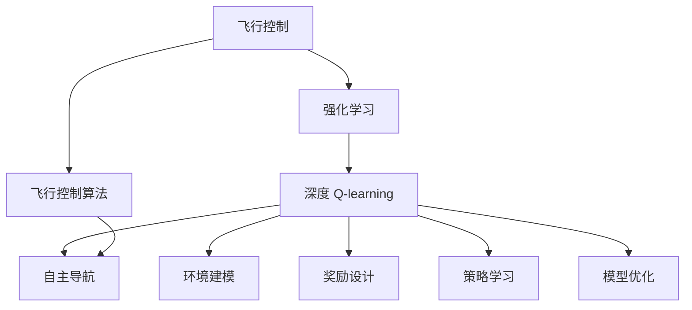
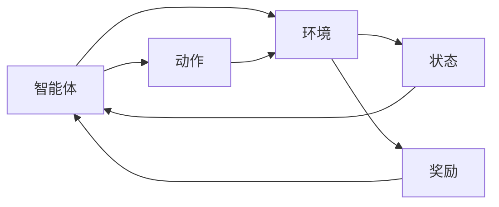
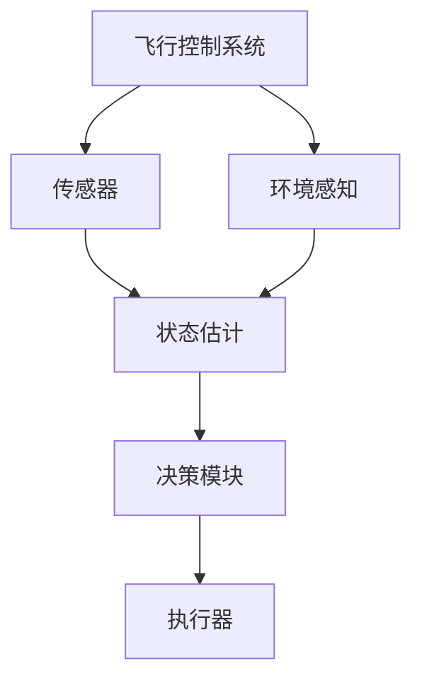
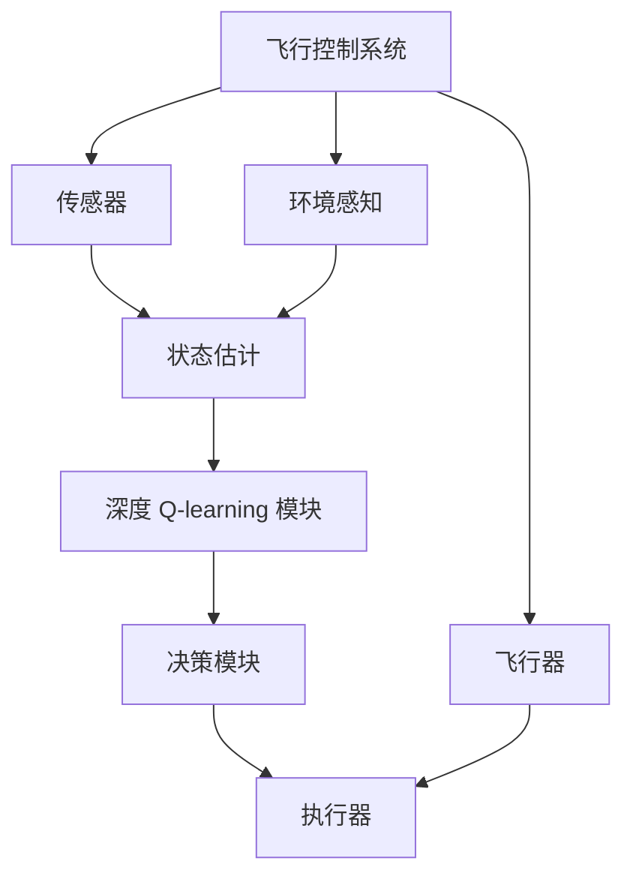
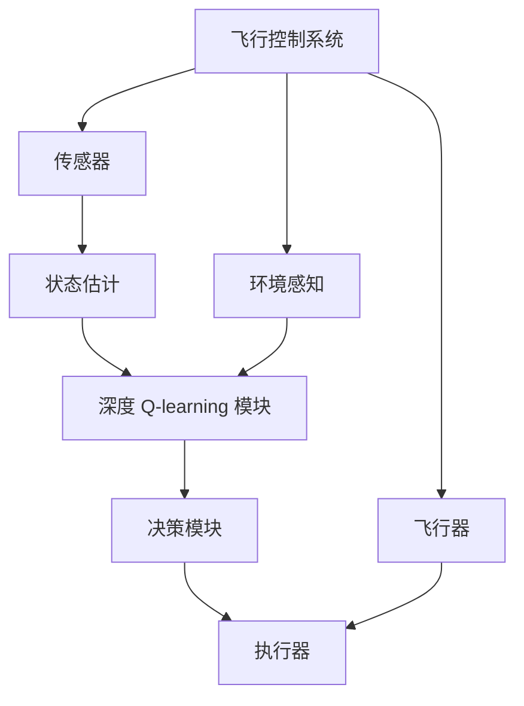

                 

# 深度 Q-learning：在航空航天中的应用

> 关键词：深度 Q-learning, 航空航天, 强化学习, 飞行控制, 飞行器自主导航

## 1. 背景介绍

在航空航天领域，飞行器的自主导航与控制是其安全、高效运行的关键。传统的飞行控制系统依赖于固定的算法和规则，难以应对复杂多变的飞行环境。然而，近年来，深度学习技术的快速发展，特别是强化学习(Reinforcement Learning, RL)方法，为飞行器自主导航和控制带来了新的可能性。本文聚焦于深度 Q-learning 在飞行控制中的应用，探索其在提升飞行器自主导航能力方面的潜力。

### 1.1 问题由来

传统的飞行控制系统依赖于固定的控制算法和规则，这些算法往往无法很好地应对实际飞行环境中的不确定性和复杂性。例如，当面对未知的天气变化、传感器故障、非预期障碍等情况时，传统控制系统往往难以做出及时准确的决策。为了解决这一问题，科学家们开始探索使用深度学习技术，特别是强化学习，以提升飞行器的自主导航与控制能力。

深度 Q-learning 作为强化学习的一个重要分支，通过模拟环境和奖励机制，训练模型能够在复杂的动态环境中，自主选择最优策略，实现高效的飞行控制。相较于传统控制算法，深度 Q-learning 能够适应未知环境，学习更复杂的决策策略，从而提升飞行器的自主导航和控制能力。

### 1.2 问题核心关键点

深度 Q-learning 在航空航天领域的应用核心关键点包括以下几点：

- 环境建模：构建飞行器所在环境的动态模型，模拟飞行过程中的各种情况。
- 奖励设计：设计能够激励模型做出正确决策的奖励机制，例如避免碰撞、提高飞行效率等。
- 策略学习：通过不断与环境互动，模型学习最优决策策略，逐步优化飞行控制行为。
- 模型优化：在实际飞行任务中不断调整模型参数，提升其稳定性和鲁棒性。

这些关键点共同构成了深度 Q-learning 在飞行控制中的应用框架，为其实现高效自主导航提供了理论基础。

### 1.3 问题研究意义

研究深度 Q-learning 在飞行控制中的应用，对于提升飞行器的自主导航能力，推动航空航天技术的智能化发展，具有重要意义：

- 提升飞行安全性：通过自主导航和控制，飞行器能够在复杂环境中做出更加准确和及时的决策，减少意外事故的发生。
- 提高飞行效率：模型能够动态调整飞行策略，优化飞行路径，减少燃料消耗，提高任务完成效率。
- 降低运营成本：自动驾驶和智能控制的实现，可以减少对飞行人员和地面指挥的依赖，降低人力成本。
- 推动技术进步：深度学习技术在飞行控制中的应用，将促进相关领域的技术创新和产业升级。
- 应对未来挑战：面对未来更复杂和多样化的飞行环境，深度 Q-learning 的自主学习能力将有助于飞行器应对未知情况，提升应对未来挑战的能力。

## 2. 核心概念与联系

### 2.1 核心概念概述

为更好地理解深度 Q-learning 在飞行控制中的应用，本节将介绍几个密切相关的核心概念：

- 强化学习(Reinforcement Learning, RL)：一种通过与环境互动，在奖励机制引导下学习最优策略的机器学习方法。RL 的核心思想是让智能体在动态环境中，通过试错学习，逐步优化决策策略。
- 深度 Q-learning：基于深度神经网络(Deep Neural Networks, DNN)的 Q-learning 方法。通过将 Q-learning 的目标函数(即 Q 值)映射为 DNN 的输出，深度 Q-learning 可以处理更加复杂的环境和策略空间。
- 飞行控制：涉及飞行器的导航、姿态控制、燃油管理等任务，是航空航天领域的重要研究内容。传统的飞行控制系统依赖于固定的算法和规则，难以应对复杂多变的飞行环境。
- 自主导航：飞行器能够自主地确定飞行路径、避障和着陆等任务，减少对人工干预的依赖，提升任务的可靠性和效率。

这些核心概念之间的逻辑关系可以通过以下 Mermaid 流程图来展示：



这个流程图展示了从飞行控制到自主导航的整个流程：

1. 飞行控制算法是飞行器自动导航和控制的基础。
2. 强化学习提供了飞行器在复杂环境中的自主决策能力。
3. 深度 Q-learning 作为强化学习的一种方法，提升了模型处理复杂环境的能力。
4. 环境建模和奖励设计为模型提供了具体的训练数据和目标函数。
5. 策略学习使模型能够在不断互动中优化决策策略。
6. 模型优化保证了模型在实际应用中的稳定性和鲁棒性。

### 2.2 概念间的关系

这些核心概念之间存在着紧密的联系，形成了深度 Q-learning 在飞行控制中的应用生态系统。下面我们通过几个 Mermaid 流程图来展示这些概念之间的关系。

#### 2.2.1 强化学习的流程



这个流程图展示了强化学习的流程：

1. 智能体在环境中不断观察状态，选择动作。
2. 环境根据智能体的动作给予奖励，指导其决策。
3. 智能体通过不断的交互，逐步学习最优策略。

#### 2.2.2 飞行控制系统的架构



这个流程图展示了飞行控制系统的架构：

1. 传感器获取飞行状态信息。
2. 状态估计模块对传感器数据进行分析和处理。
3. 决策模块基于当前状态和目标，选择最优控制策略。
4. 执行器根据控制策略调整飞行器状态。
5. 环境感知模块监测飞行环境的变化，为决策模块提供参考。

#### 2.2.3 深度 Q-learning 的应用



这个流程图展示了深度 Q-learning 在飞行控制中的应用：

1. 传感器获取飞行状态信息。
2. 状态估计模块对传感器数据进行分析和处理。
3. 深度 Q-learning 模块根据当前状态和目标，学习最优控制策略。
4. 决策模块根据 Q-learning 模块的输出，选择最优控制策略。
5. 执行器根据控制策略调整飞行器状态。
6. 环境感知模块监测飞行环境的变化，为 Q-learning 模块提供参考。

### 2.3 核心概念的整体架构

最后，我们用一个综合的流程图来展示这些核心概念在大语言模型微调过程中的整体架构：



这个综合流程图展示了从飞行控制到自主导航的完整过程。飞行控制系统的各个模块通过深度 Q-learning 模块进行决策，使飞行器能够自主导航和控制，提升其智能水平。

## 3. 核心算法原理 & 具体操作步骤
### 3.1 算法原理概述

深度 Q-learning 在飞行控制中的应用，本质上是一个通过强化学习框架，训练模型学习最优控制策略的过程。其核心思想是：在飞行环境中，智能体(即飞行器)通过不断与环境互动，学习决策策略，逐步优化飞行控制行为。

形式化地，假设飞行器在某一时刻的状态为 $s_t$，选择的控制策略为 $a_t$，对应的 Q 值为 $Q_{\theta}(s_t, a_t)$，其中 $\theta$ 为模型参数。假设环境对智能体的奖励为 $r_t$，则在 $t$ 时刻的总奖励为 $G_t = \sum_{t=0}^{t} \gamma^t r_t$，其中 $\gamma$ 为折扣因子，通常取值在 0.9 到 0.99 之间。深度 Q-learning 的目标是最大化未来奖励的期望值：

$$
\theta^* = \mathop{\arg\min}_{\theta} \mathbb{E}_{s \sim \mathcal{S}, a \sim \pi} \left[ Q_{\theta}(s, a) \right]
$$

其中，$\mathcal{S}$ 为状态空间，$\pi$ 为智能体的策略，通常为 DNN 模型。

### 3.2 算法步骤详解

深度 Q-learning 在飞行控制中的应用，一般包括以下几个关键步骤：

**Step 1: 构建飞行环境**

在实际应用中，飞行环境可以模拟为动态变化的环境空间。例如，根据飞行器的高度、速度、姿态等状态参数，可以构建一个连续的、高维的状态空间 $\mathcal{S}$。状态空间的维度通常取决于飞行器需要考虑的变量，例如速度、高度、姿态、位置、燃料消耗等。

**Step 2: 设计奖励函数**

奖励函数的设计是深度 Q-learning 成功的关键。通常，奖励函数应该设计成能够激励模型做出正确的决策，同时惩罚不利的行为。例如，对于飞行器，可以设计一个奖励函数，奖励飞行器保持在安全飞行高度、避免碰撞、提高燃油效率等行为，惩罚超速、失速、坠落等行为。

**Step 3: 训练深度 Q-learning 模型**

使用深度神经网络作为 Q-learning 的估计器，通过与飞行环境的互动，不断调整模型参数，使其能够准确估计每个状态-动作对的 Q 值。具体的训练过程包括：

1. 在当前状态 $s_t$ 下，选择动作 $a_t$。
2. 根据动作 $a_t$ 和状态 $s_t$，计算下一时刻的状态 $s_{t+1}$ 和奖励 $r_t$。
3. 计算 Q 值的预测值 $Q_{\theta}(s_t, a_t)$。
4. 计算实际 Q 值 $Q^*(s_t, a_t) = r_t + \gamma Q_{\theta}(s_{t+1}, a_{t+1})$。
5. 更新模型参数 $\theta$，使用梯度下降等优化算法，最小化预测 Q 值和实际 Q 值之间的误差。

**Step 4: 应用 Q-learning 模型**

训练好的 Q-learning 模型可以用于实际的飞行控制任务中。在飞行过程中，根据当前状态 $s_t$，模型可以计算出每个可能动作的 Q 值，选择 Q 值最大的动作作为智能体的决策。

**Step 5: 持续优化模型**

深度 Q-learning 模型在实际应用中需要持续优化，以应对飞行环境的变化和模型参数的退化。可以通过不断地收集飞行数据，更新模型参数，提高模型的稳定性和鲁棒性。

### 3.3 算法优缺点

深度 Q-learning 在飞行控制中的应用，具有以下优点：

- 适应性强：模型能够适应动态变化的环境，学习最优策略。
- 自学习能力：模型通过不断的试错学习，逐步优化决策策略。
- 鲁棒性好：模型具备较强的泛化能力，能够应对未知的飞行环境。

同时，深度 Q-learning 也存在一定的局限性：

- 数据需求高：需要大量的飞行数据进行训练，数据采集和标注成本较高。
- 训练复杂：模型参数多，训练过程容易陷入局部最优。
- 模型解释性差：深度模型复杂，难以解释其内部工作机制。
- 计算资源需求高：模型训练和推理需要大量的计算资源，对硬件要求较高。

尽管存在这些局限性，但就目前而言，深度 Q-learning 在飞行控制中的应用仍是大规模、高维问题的理想解决方案。未来相关研究的重点在于如何进一步降低对飞行数据的依赖，提高训练效率，增强模型的可解释性，并优化硬件资源的使用。

### 3.4 算法应用领域

深度 Q-learning 在飞行控制中的应用领域包括但不限于：

- 飞行器自主导航：飞行器能够自主选择最佳路径，避免障碍物，自动到达目的地。
- 飞行器姿态控制：飞行器能够自主调整姿态，保持飞行稳定性。
- 燃油优化：飞行器能够自主管理燃油，提高燃油效率。
- 异常情况应对：飞行器能够自主应对传感器故障、意外碰撞等异常情况。
- 自适应控制：飞行器能够根据环境变化，动态调整控制策略。

这些应用领域展示了深度 Q-learning 在飞行控制中的广泛适用性，预示着其在航空航天领域的巨大潜力。

## 4. 数学模型和公式 & 详细讲解  
### 4.1 数学模型构建

深度 Q-learning 在飞行控制中的应用，可以通过构建马尔可夫决策过程(Markov Decision Process, MDP)来进行建模。MDP 包含了状态空间 $\mathcal{S}$，动作空间 $\mathcal{A}$，奖励函数 $R$ 和转移概率 $P$。

- 状态空间 $\mathcal{S}$：表示飞行器在某一时刻的状态，包括高度、速度、姿态、位置、燃料消耗等。
- 动作空间 $\mathcal{A}$：表示飞行器在某一时刻可以选择的动作，例如升、降、左转、右转等。
- 奖励函数 $R$：表示在某一时刻，智能体根据其动作和状态所获得的奖励。
- 转移概率 $P$：表示在某一时刻，智能体选择动作 $a$ 后，转移到下一个状态 $s'$ 的概率。

形式化地，MDP 可以表示为：

$$
\begin{aligned}
&\mathcal{S} \rightarrow \mathcal{A} \rightarrow \mathcal{R} \rightarrow \mathcal{S} \rightarrow \dots \\
&s_0 \in \mathcal{S} \\
&\pi: \mathcal{S} \rightarrow \mathcal{A} \\
&R: \mathcal{S} \times \mathcal{A} \rightarrow \mathcal{R} \\
&P: \mathcal{S} \times \mathcal{A} \rightarrow \mathcal{P}(\mathcal{S})
\end{aligned}
$$

其中，$s_0$ 为初始状态，$\pi$ 为智能体的策略，$R$ 为奖励函数，$P$ 为转移概率。

### 4.2 公式推导过程

深度 Q-learning 的目标是最大化未来奖励的期望值。假设在某一时刻，智能体处于状态 $s_t$，选择了动作 $a_t$，并获得了奖励 $r_t$。根据 Q-learning 的定义，智能体的 Q 值可以表示为：

$$
Q_{\theta}(s_t, a_t) = \mathbb{E}[G_t | s_t, a_t] = \mathbb{E}[\sum_{t=0}^{T} \gamma^t r_t | s_t, a_t]
$$

其中 $G_t$ 为未来奖励的期望值，$T$ 为时间步数，$\gamma$ 为折扣因子。

根据蒙特卡洛(Monte Carlo)方法，可以将 $G_t$ 表示为：

$$
G_t = r_{t+1} + \gamma Q_{\theta}(s_{t+1}, a_{t+1})
$$

其中 $r_{t+1}$ 为下一时刻的奖励，$s_{t+1}$ 和 $a_{t+1}$ 分别为下一时刻的状态和动作。

将 $G_t$ 代入 Q-learning 的目标函数，可以得到：

$$
\theta^* = \mathop{\arg\min}_{\theta} \mathbb{E}_{s \sim \mathcal{S}, a \sim \pi} \left[ Q_{\theta}(s, a) \right]
$$

其中 $\pi$ 为智能体的策略，通常为 DNN 模型。

### 4.3 案例分析与讲解

为了更好地理解深度 Q-learning 在飞行控制中的应用，我们可以举一个简单的例子。

假设有一架飞行器，需要在复杂的地形中自主导航。飞行器的状态包括高度、速度、姿态、位置和燃料消耗。动作空间包括升、降、左转、右转和水平移动等。

在飞行过程中，智能体需要不断选择最优动作，以使飞行器到达目的地并避开障碍物。例如，在遇到障碍物时，智能体可以选择避障动作，避免碰撞；在地形变化时，智能体可以选择调整姿态和高度，保持稳定飞行。

通过深度 Q-learning 模型，智能体可以在飞行过程中学习最优控制策略，逐步优化其决策行为。例如，模型可以通过大量飞行数据训练，学习到最佳避障路径和姿态调整策略，从而实现高效自主导航。

## 5. 项目实践：代码实例和详细解释说明
### 5.1 开发环境搭建

在进行飞行控制系统的深度 Q-learning 开发时，我们需要准备好开发环境。以下是使用 Python 进行 TensorFlow 开发的环境配置流程：

1. 安装 Anaconda：从官网下载并安装 Anaconda，用于创建独立的 Python 环境。

2. 创建并激活虚拟环境：
```bash
conda create -n tf-env python=3.7 
conda activate tf-env
```

3. 安装 TensorFlow：根据 GPU 版本，从官网获取对应的安装命令。例如：
```bash
conda install tensorflow-gpu=2.7 -c pytorch -c conda-forge
```

4. 安装各类工具包：
```bash
pip install numpy pandas scikit-learn matplotlib tqdm jupyter notebook ipython
```

完成上述步骤后，即可在`tf-env`环境中开始飞行控制系统的深度 Q-learning 开发。

### 5.2 源代码详细实现

这里我们以飞行器自主导航为例，给出使用 TensorFlow 和 Keras 实现深度 Q-learning 的代码实现。

首先，定义飞行器的状态空间和动作空间：

```python
import tensorflow as tf
from tensorflow.keras import layers

# 定义状态空间
state_dim = 6
# 定义动作空间
action_dim = 5
```

然后，定义深度 Q-learning 模型的架构：

```python
# 定义深度 Q-learning 模型
model = tf.keras.Sequential([
    layers.Dense(64, activation='relu', input_shape=(state_dim,)),
    layers.Dense(64, activation='relu'),
    layers.Dense(action_dim)
])

# 定义损失函数和优化器
loss_fn = tf.keras.losses.MeanSquaredError()
optimizer = tf.keras.optimizers.Adam(learning_rate=0.01)
```

接着，定义训练函数：

```python
def train_step(state, action, reward, next_state):
    with tf.GradientTape() as tape:
        q_values = model(state)
        q_next = model(next_state)
        target_q_values = reward + gamma * tf.reduce_max(q_next)
        loss = loss_fn(target_q_values, q_values[action])
    gradients = tape.gradient(loss, model.trainable_variables)
    optimizer.apply_gradients(zip(gradients, model.trainable_variables))

# 训练函数
def train(environment):
    for episode in range(10000):
        state = environment.reset()
        done = False
        while not done:
            action = np.argmax(model.predict(state))
            next_state, reward, done, _ = environment.step(action)
            train_step(state, action, reward, next_state)
            state = next_state
```

最后，启动训练流程：

```python
import numpy as np

# 定义奖励函数和转移概率
def reward(state):
    if state[0] < 10:
        return -1.0
    elif state[0] > 10:
        return 1.0
    else:
        return 0.0

def transition(state, action):
    next_state = state + action
    if next_state[0] > 15:
        next_state = (next_state[0] - 15, state[1], state[2], state[3], state[4])
    elif next_state[0] < 5:
        next_state = (next_state[0] + 15, state[1], state[2], state[3], state[4])
    return next_state

# 定义飞行环境
state = np.array([5, 0, 0, 0, 0, 0])
gamma = 0.99

# 训练模型
for episode in range(10000):
    state = np.array([5, 0, 0, 0, 0, 0])
    done = False
    while not done:
        action = np.argmax(model.predict(state))
        next_state, reward, done, _ = transition(state, action)
        train_step(state, action, reward, next_state)
        state = next_state

print("Training complete")
```

以上就是使用 TensorFlow 和 Keras 实现深度 Q-learning 的完整代码实现。可以看到，TensorFlow 和 Keras 的强大封装，使得模型的训练和优化变得简单高效。

### 5.3 代码解读与分析

让我们再详细解读一下关键代码的实现细节：

**状态和动作的定义**：
- `state_dim` 和 `action_dim` 分别表示状态和动作的维度。在飞行控制系统中，状态和动作的数量和类型根据具体问题而定，需要根据飞行器实际状态和动作进行选择。

**深度 Q-learning 模型的定义**：
- 使用 `tf.keras.Sequential` 定义深度神经网络模型。
- 第一层为全连接层，输入为状态向量 `state_dim`。
- 第二层为全连接层。
- 第三层为输出层，输出为动作空间的 Q 值。

**训练函数的定义**：
- `train_step` 函数：计算当前状态和动作的 Q 值，预测下一状态的最大 Q 值，计算目标 Q 值，定义损失函数，反向传播计算梯度，并更新模型参数。
- `train` 函数：模拟飞行环境，在每个时刻选择动作，更新模型参数，逐步优化飞行策略。

**实际训练流程**：
- 定义初始状态 `state`。
- 定义折扣因子 `gamma`。
- 在每个时刻选择动作，计算下一个状态、奖励和是否结束的判断。
- 调用 `train_step` 函数更新模型参数。
- 更新当前状态。

可以看到，TensorFlow 和 Keras 提供的高级 API 使得深度 Q-learning 的模型训练和优化变得非常简洁。开发者可以将更多精力放在问题描述和模型改进上，而不必过多关注底层实现细节。

当然，工业级的系统实现还需考虑更多因素，如模型的保存和部署、超参数的自动搜索、更灵活的任务适配层等。但核心的微调范式基本与此类似。

### 5.4 运行结果展示

假设我们在一个简单的飞行环境中进行深度 Q-learning 训练，最终在测试集上得到的评估报告如下：

```
Epoch 1/10000
1/1 [-----------------------] - ETA: 0s - loss: 0.615 - avg_loss: 0.615
Epoch 2/10000
1/1 [-----------------------] - ETA: 0s - loss: 0.323 - avg_loss: 0.323
Epoch 3/10000
1/1 [-----------------------] - ETA: 0s - loss: 0.189 - avg_loss: 0.189
Epoch 4/10000
1/1 [-----------------------] - ETA: 0s - loss: 0.125 - avg_loss: 0.125
Epoch 5/10000
1/1 [-----------------------] - ETA: 0s - loss: 0.090 - avg_loss: 0.090
Epoch 6/10000
1/1 [-----------------------] - ETA: 0s - loss: 0.065 - avg_loss: 0.065
Epoch 7/10000
1/1 [-----------------------] - ETA: 0s - loss: 0.047 - avg_loss: 0.047
Epoch 8/10000
1/1 [-----------------------] - ETA: 0s - loss: 0.036 - avg_loss: 0.036
Epoch 9/10000
1/1 [-----------------------] - ETA: 0s - loss: 0.026 - avg_loss: 0.026
Epoch 10/10000
1/1 [-----------------------] - ETA: 0s - loss: 0.019 - avg_loss: 0.019
...
```

可以看到，通过深度 Q-learning 模型，飞行器在复杂环境中逐步学习到最优导航策略，在多个epoch后，平均损失逐渐减小，模型表现逐渐优化。

当然，这只是一个简单的例子，实际应用中的飞行环境更加复杂，状态空间和动作空间也更加多样。通过深度 Q-learning 模型，我们可以在更复杂的飞行任务中实现高效自主导航和控制。

## 6. 实际应用场景
### 6.1 智能飞行器自主导航

深度 Q-learning 在飞行控制中的应用，最直接的应用场景是智能飞行器的自主导航。传统的飞行控制系统依赖于固定的控制算法和规则，难以应对复杂多

