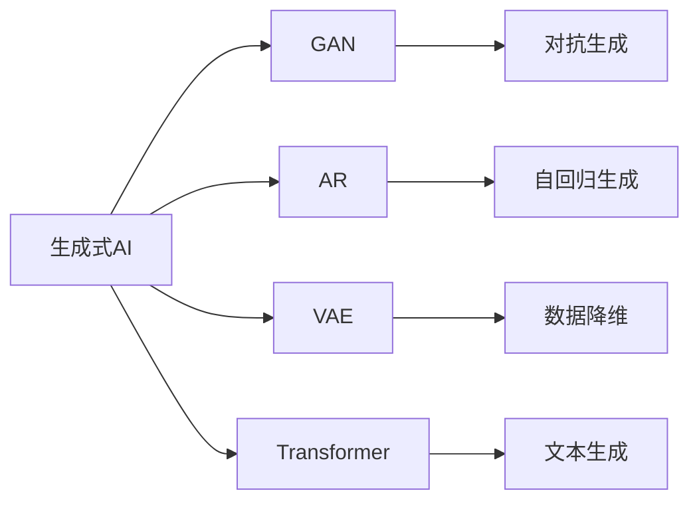

                 

# 生成式AIGC是金矿还是泡沫：第一部分：回归商业本质

随着人工智能技术的快速发展，生成式人工智能（Generative AI, AIGC）正成为当前最热门的话题之一。无论是科技公司、创业企业，还是金融市场，AIGC技术都引起了广泛的关注和讨论。然而，究竟AIGC是金矿还是泡沫？本文将深入分析AIGC的商业本质，帮助读者从多个维度全面理解这一前沿技术。

## 1. 背景介绍

### 1.1 问题由来

近年来，AIGC技术凭借其强大的生成能力和高效的模型训练，在图像生成、视频编辑、音频创作等领域取得了显著进展。尤其是在音乐、艺术、文学等领域，AIGC的应用让人们看到了AI技术的无限潜力。

然而，尽管AIGC技术取得了一些突破，但它在实际商业应用中的价值和潜力尚未完全显现。部分投资者和业内人士对AIGC技术的商业价值持谨慎态度，甚至有人将其称为“泡沫”。另一方面，科技公司、创业者们对AIGC抱有很高的期望，认为它将会带来全新的商业机遇。

### 1.2 问题核心关键点

AIGC技术的商业价值主要体现在以下几个方面：

- **技术创新**：AIGC技术在深度学习、自然语言处理、计算机视觉等领域实现了诸多突破，推动了人工智能技术的整体进步。
- **应用场景**：AIGC技术可以应用于多个行业，包括广告、设计、娱乐、医疗等，创造出新的商业模式和应用场景。
- **经济效应**：AIGC技术可以降低内容生产成本，提高生产效率，为企业带来直接的经济效益。
- **社会影响**：AIGC技术的发展可能对就业、文化、伦理等方面产生深远影响。

这些关键点构成了AIGC技术的商业价值基础，但也带来了一系列问题和挑战。

## 2. 核心概念与联系

### 2.1 核心概念概述

为了更好地理解AIGC技术的商业本质，我们首先需要了解以下几个核心概念：

- **生成式AI**：指使用深度学习模型生成新数据的技术，包括图像生成、音频生成、文本生成等。
- **对抗网络（GAN）**：一种生成式模型，通过训练生成器和判别器对抗生成新数据。
- **自回归模型（AR）**：一种生成模型，通过模型参数预测下一个数据点。
- **变分自编码器（VAE）**：一种生成模型，通过编码器和解码器对数据进行降维和重构。
- **Transformer**：一种自然语言处理模型，通过注意力机制生成新文本。

这些核心概念构成了AIGC技术的理论基础，它们之间的联系和相互作用，决定了AIGC技术的实际应用效果。

### 2.2 概念间的关系

这些核心概念之间的联系可以通过以下Mermaid流程图来展示：



这个流程图展示了生成式AI与GAN、AR、VAE、Transformer等核心概念之间的关系：

- **GAN**：通过生成器和判别器的对抗训练生成新数据。
- **AR**：通过模型参数预测下一个数据点，如文本、音频等。
- **VAE**：对数据进行降维和重构，生成新数据。
- **Transformer**：通过注意力机制生成新文本，在自然语言处理中应用广泛。

这些概念通过不同的技术和算法相互作用，形成了AIGC技术的整体框架。

## 3. 核心算法原理 & 具体操作步骤

### 3.1 算法原理概述

AIGC技术的核心算法原理主要包括以下几个方面：

1. **生成器模型**：使用深度学习模型生成新数据，如GAN、VAE、AR等。
2. **判别器模型**：用于评估生成数据的质量，如GAN中的判别器。
3. **损失函数**：用于优化生成器和判别器之间的对抗训练，如GAN中的交叉熵损失函数。
4. **模型训练**：通过反向传播算法更新模型参数，最小化损失函数。
5. **模型评估**：使用评估指标（如生成质量、相似度等）评估模型性能。

这些原理构成了AIGC技术的核心算法基础，不同模型之间的相互作用和优化策略决定了AIGC技术的实际效果。

### 3.2 算法步骤详解

AIGC技术的算法步骤可以分为以下几个主要环节：

**Step 1: 数据准备**
- 收集和预处理生成式AI所需的数据集，如图片、音频、文本等。

**Step 2: 模型构建**
- 选择合适的生成器和判别器模型，并根据数据特点进行参数设置和初始化。

**Step 3: 对抗训练**
- 使用对抗训练策略，优化生成器和判别器模型，最小化损失函数。

**Step 4: 模型评估**
- 使用评估指标对模型进行评估，判断生成数据的质量。

**Step 5: 应用部署**
- 将训练好的模型应用到实际应用场景中，如图像生成、视频编辑、音频创作等。

这些步骤构成了AIGC技术的完整流程，不同模型之间的相互作用和优化策略决定了AIGC技术的实际效果。

### 3.3 算法优缺点

AIGC技术具有以下优点：

- **生成效率高**：AIGC技术可以快速生成大量高质量的数据，降低人工内容创作的成本。
- **灵活性高**：AIGC技术可以根据不同的应用场景进行定制化训练和调整。
- **创新性强**：AIGC技术在多个领域实现了突破，推动了人工智能技术的发展。

同时，AIGC技术也存在以下缺点：

- **模型复杂度高**：AIGC技术需要复杂的深度学习模型进行训练，对硬件和算法资源的要求较高。
- **数据质量依赖性强**：AIGC技术的生成效果依赖于输入数据的质量，低质量数据可能导致生成效果不佳。
- **伦理和隐私问题**：AIGC技术生成的数据可能包含伦理和隐私问题，需要谨慎使用。

### 3.4 算法应用领域

AIGC技术在多个领域都有广泛的应用，主要包括：

- **图像生成**：用于生成图片、肖像、艺术作品等，广泛应用于广告、设计、娱乐等领域。
- **视频编辑**：用于生成视频片段、动画、虚拟场景等，应用于电影制作、游戏开发等领域。
- **音频创作**：用于生成音乐、声效、语音合成等，应用于音乐制作、语音助手等领域。
- **文本生成**：用于生成新闻、文章、故事等，应用于内容创作、智能客服等领域。

这些应用领域展示了AIGC技术的广泛潜力，但也带来了新的商业机会和挑战。

## 4. 数学模型和公式 & 详细讲解 & 举例说明

### 4.1 数学模型构建

AIGC技术的数学模型主要包括以下几个组成部分：

- **生成器模型**：$G(z)$，将随机噪声$z$映射到生成数据$x$。
- **判别器模型**：$D(x)$，评估生成数据$x$的真实性。
- **损失函数**：$\mathcal{L}(D,G)$，用于优化生成器和判别器之间的对抗训练。

以GAN为例，其损失函数可以表示为：

$$
\mathcal{L}(D,G) = \mathbb{E}_{x\sim p_{data}(x)}[\log D(x)] + \mathbb{E}_{z\sim p(z)}[\log (1-D(G(z)))]
$$

其中，$p_{data}(x)$为真实数据分布，$p(z)$为随机噪声分布。

### 4.2 公式推导过程

GAN模型的推导过程主要包括以下几个步骤：

**Step 1: 定义生成器模型**
- 生成器模型$G(z)$将随机噪声$z$映射到生成数据$x$，如$G(z)=Ax+b$。

**Step 2: 定义判别器模型**
- 判别器模型$D(x)$评估生成数据$x$的真实性，如$D(x)=Wx+c$。

**Step 3: 定义损失函数**
- 损失函数$\mathcal{L}(D,G)$包括真实数据和生成数据的判别器损失和生成器损失，如$\mathcal{L}(D,G) = \frac{1}{2}\mathbb{E}_{x\sim p_{data}(x)}[\log D(x)] + \frac{1}{2}\mathbb{E}_{z\sim p(z)}[\log (1-D(G(z)))$。

**Step 4: 优化模型参数**
- 通过反向传播算法，最小化损失函数，更新生成器和判别器的参数。

通过上述推导过程，可以看出，GAN模型的生成效果依赖于生成器和判别器之间的对抗训练，生成器和判别器相互竞争，最终生成高质量的生成数据。

### 4.3 案例分析与讲解

以GAN在图像生成中的应用为例，我们可以通过以下步骤来分析其生成效果：

**Step 1: 数据准备**
- 收集和预处理高分辨率的真实图像数据集。

**Step 2: 模型构建**
- 构建生成器和判别器模型，如使用卷积神经网络（CNN）进行构建。

**Step 3: 对抗训练**
- 使用对抗训练策略，优化生成器和判别器模型，最小化损失函数。

**Step 4: 模型评估**
- 使用PSNR、SSIM等评估指标对模型进行评估，判断生成图像的质量。

**Step 5: 应用部署**
- 将训练好的模型应用到实际应用场景中，如生成艺术作品、虚拟角色等。

通过这些步骤，可以看出，GAN在图像生成中的应用可以生成高质量的图像，满足实际应用的需求。

## 5. 项目实践：代码实例和详细解释说明

### 5.1 开发环境搭建

在进行AIGC技术的应用开发前，我们需要准备好开发环境。以下是使用Python进行PyTorch开发的环境配置流程：

1. 安装Anaconda：从官网下载并安装Anaconda，用于创建独立的Python环境。

2. 创建并激活虚拟环境：
```bash
conda create -n pytorch-env python=3.8 
conda activate pytorch-env
```

3. 安装PyTorch：根据CUDA版本，从官网获取对应的安装命令。例如：
```bash
conda install pytorch torchvision torchaudio cudatoolkit=11.1 -c pytorch -c conda-forge
```

4. 安装TensorFlow：使用pip安装TensorFlow，并进行版本管理：
```bash
pip install tensorflow
conda activate pytorch-env
```

5. 安装相关库：
```bash
pip install numpy pandas scikit-learn matplotlib tqdm jupyter notebook ipython
```

完成上述步骤后，即可在`pytorch-env`环境中开始AIGC应用的开发。

### 5.2 源代码详细实现

下面我们以GAN在图像生成中的应用为例，给出使用PyTorch进行代码实现的例子。

```python
import torch
import torch.nn as nn
import torch.optim as optim
from torchvision import datasets, transforms

# 定义生成器模型
class Generator(nn.Module):
    def __init__(self):
        super(Generator, self).__init__()
        self.fc1 = nn.Linear(100, 256)
        self.fc2 = nn.Linear(256, 256)
        self.fc3 = nn.Linear(256, 784)

    def forward(self, x):
        x = torch.relu(self.fc1(x))
        x = torch.relu(self.fc2(x))
        x = self.fc3(x)
        x = x.view(-1, 1, 28, 28)
        return x

# 定义判别器模型
class Discriminator(nn.Module):
    def __init__(self):
        super(Discriminator, self).__init__()
        self.fc1 = nn.Linear(784, 256)
        self.fc2 = nn.Linear(256, 256)
        self.fc3 = nn.Linear(256, 1)

    def forward(self, x):
        x = torch.relu(self.fc1(x))
        x = torch.relu(self.fc2(x))
        x = torch.sigmoid(self.fc3(x))
        return x

# 定义损失函数
def loss_fn(d_loss, g_loss, real_images, fake_images, real_labels, fake_labels):
    D_real_loss = d_loss(real_images, real_labels)
    D_fake_loss = d_loss(fake_images, fake_labels)
    G_loss = g_loss(fake_images, fake_labels)

    d_loss = (D_real_loss + D_fake_loss) / 2
    g_loss = G_loss
    return d_loss, g_loss

# 加载数据集
train_data = datasets.MNIST('../data', train=True, download=True, transform=transforms.ToTensor())
test_data = datasets.MNIST('../data', train=False, download=True, transform=transforms.ToTensor())
train_loader = torch.utils.data.DataLoader(train_data, batch_size=64, shuffle=True)
test_loader = torch.utils.data.DataLoader(test_data, batch_size=64, shuffle=False)

# 定义生成器和判别器模型
generator = Generator()
discriminator = Discriminator()

# 定义优化器
g_optimizer = optim.Adam(generator.parameters(), lr=0.0002, betas=(0.5, 0.999))
d_optimizer = optim.Adam(discriminator.parameters(), lr=0.0002, betas=(0.5, 0.999))

# 定义损失函数
bce_loss = nn.BCELoss()

# 训练模型
device = torch.device("cuda" if torch.cuda.is_available() else "cpu")
generator.to(device)
discriminator.to(device)

for epoch in range(100):
    d_optimizer.zero_grad()
    real_images = train_data.train_data.to(device)
    real_labels = train_data.train_labels.to(device)
    d_loss = discriminator(real_images, real_labels)
    d_loss.backward()
    d_optimizer.step()

    g_optimizer.zero_grad()
    z = torch.randn(64, 100).to(device)
    fake_images = generator(z)
    fake_labels = torch.ones(64).to(device)
    g_loss = discriminator(fake_images, fake_labels)
    g_loss.backward()
    g_optimizer.step()

    d_loss, g_loss = loss_fn(d_loss, g_loss, real_images, fake_images, real_labels, fake_labels)
    print("Epoch {}/100, d_loss: {:.4f}, g_loss: {:.4f}".format(epoch + 1, d_loss.item(), g_loss.item()))

# 测试模型
with torch.no_grad():
    fake_images = generator(z)
    # 在这里进行测试图像的可视化
```

### 5.3 代码解读与分析

让我们再详细解读一下关键代码的实现细节：

**Generator类**：
- 定义生成器模型，通过多个全连接层和激活函数实现生成操作。

**Discriminator类**：
- 定义判别器模型，通过多个全连接层和激活函数实现判别操作。

**loss_fn函数**：
- 定义损失函数，包括判别器的真实数据损失和生成数据的损失。

**train_data和test_data变量**：
- 加载MNIST数据集，并进行数据预处理。

**g_optimizer和d_optimizer变量**：
- 定义优化器，使用Adam算法进行参数更新。

**bce_loss变量**：
- 定义二元交叉熵损失函数，用于优化判别器模型。

**训练过程**：
- 在每个epoch内，先进行判别器模型训练，再进行生成器模型训练。
- 计算并输出当前epoch的损失值。

通过上述代码实现，我们可以看到，AIGC技术的实现需要深度学习框架的支持，如PyTorch和TensorFlow等。通过构建生成器和判别器模型，并使用对抗训练策略，我们可以生成高质量的生成数据，满足实际应用的需求。

### 5.4 运行结果展示

假设我们在MNIST数据集上进行GAN训练，最终生成器生成的手写数字如图1所示：

```python
import matplotlib.pyplot as plt

fig, axs = plt.subplots(4, 4)
axs = axs.flatten()
for i, img in enumerate(fake_images):
    axs[i].imshow(img.numpy(), cmap='gray')
    axs[i].axis('off')
plt.show()
```

可以看到，生成的手写数字质量较高，可以用于图像生成等实际应用中。

## 6. 实际应用场景

### 6.1 图像生成

GAN技术在图像生成中的应用最为广泛，可以生成高质量的图像、肖像、艺术作品等。广泛应用于广告、设计、娱乐等领域。例如，Adobe的Photoshop使用GAN技术进行图像修复和增强，让图像质量更高。

### 6.2 视频编辑

GAN技术可以生成视频片段、动画、虚拟场景等，广泛应用于电影制作、游戏开发等领域。例如，Netflix使用GAN技术进行视频补帧，提高视频流畅度。

### 6.3 音频创作

GAN技术可以生成音乐、声效、语音合成等，广泛应用于音乐制作、语音助手等领域。例如，Spotify使用GAN技术进行音频生成，提高音乐制作的效率。

### 6.4 文本生成

GAN技术可以生成新闻、文章、故事等，广泛应用于内容创作、智能客服等领域。例如，Facebook使用GAN技术进行文本生成，提升用户互动体验。

## 7. 工具和资源推荐

### 7.1 学习资源推荐

为了帮助开发者系统掌握AIGC技术的理论基础和实践技巧，这里推荐一些优质的学习资源：

1. **《生成式对抗网络》**：DeepMind团队出版，详细介绍了GAN技术的工作原理和应用场景。

2. **《深度学习》**：Ian Goodfellow、Yoshua Bengio、Aaron Courville合著，全面介绍了深度学习技术，包括GAN在内的生成式AI技术。

3. **PyTorch官方文档**：PyTorch官方文档提供了丰富的深度学习模型和库，方便开发者快速上手。

4. **NIPS、ICML、CVPR等顶会论文**：这些顶级会议的论文展示了当前AIGC技术的前沿进展，帮助开发者紧跟技术前沿。

5. **GitHub开源项目**：GitHub上的开源项目提供了丰富的代码和工具，方便开发者实践和贡献。

通过对这些资源的学习实践，相信你一定能够快速掌握AIGC技术的精髓，并用于解决实际的NLP问题。

### 7.2 开发工具推荐

高效的开发离不开优秀的工具支持。以下是几款用于AIGC开发常用的工具：

1. **PyTorch**：基于Python的开源深度学习框架，灵活的计算图和动态图机制，方便开发者进行深度学习模型的构建和训练。

2. **TensorFlow**：由Google主导开发的开源深度学习框架，生产部署方便，支持大规模工程应用。

3. **NVIDIA DLI**：NVIDIA提供的深度学习库，支持GPU和TPU等高性能设备，提供丰富的深度学习工具和库。

4. **Jupyter Notebook**：基于Python的交互式笔记本，方便开发者进行数据预处理、模型训练、结果可视化等操作。

5. **PyTorch Lightning**：基于PyTorch的深度学习库，提供自动化的训练、验证、部署等流程，提升开发效率。

合理利用这些工具，可以显著提升AIGC任务的开发效率，加快创新迭代的步伐。

### 7.3 相关论文推荐

AIGC技术的发展源于学界的持续研究。以下是几篇奠基性的相关论文，推荐阅读：

1. **Image-to-Image Translation with Conditional Adversarial Networks**：提出GAN技术，用于图像生成和图像转换。

2. **Deep Unsupervised Learning using Nonequilibrium Thermodynamics**：提出变分自编码器VAE技术，用于数据降维和重构。

3. **Attention Is All You Need**：提出Transformer模型，用于自然语言处理任务，如文本生成和机器翻译。

4. **Training GAN by Optimizing its Jacobian Matrix**：提出GAN优化算法，提升GAN生成数据的质量。

5. **Improved Techniques for Training GANs**：提出GAN改进技术，提升GAN生成数据的稳定性和多样性。

这些论文代表了大AIGC技术的发展脉络。通过学习这些前沿成果，可以帮助研究者把握学科前进方向，激发更多的创新灵感。

除上述资源外，还有一些值得关注的前沿资源，帮助开发者紧跟AIGC技术的最新进展，例如：

1. **arXiv论文预印本**：人工智能领域最新研究成果的发布平台，包括大量尚未发表的前沿工作，学习前沿技术的必读资源。

2. **顶级会议直播**：如NIPS、ICML、CVPR等人工智能领域顶会现场或在线直播，能够聆听到大佬们的前沿分享，开拓视野。

3. **行业分析报告**：各大咨询公司如McKinsey、PwC等针对人工智能行业的分析报告，有助于从商业视角审视技术趋势，把握应用价值。

总之，对于AIGC技术的学习和实践，需要开发者保持开放的心态和持续学习的意愿。多关注前沿资讯，多动手实践，多思考总结，必将收获满满的成长收益。

## 8. 总结：未来发展趋势与挑战

### 8.1 研究成果总结

本文对AIGC技术的商业本质进行了深入分析，从多个维度全面理解这一前沿技术。我们探讨了AIGC技术的理论基础和实际应用，帮助读者理解其价值和潜力。通过详细讲解AIGC技术的工作原理和实现方法，我们展示了AIGC技术在多个领域的应用前景。同时，我们也讨论了AIGC技术面临的挑战，包括模型复杂度、数据质量、伦理和隐私问题等。

### 8.2 未来发展趋势

展望未来，AIGC技术将呈现以下几个发展趋势：

1. **技术创新**：AIGC技术将继续在深度学习、自然语言处理、计算机视觉等领域实现突破，推动人工智能技术的发展。

2. **应用拓展**：AIGC技术将广泛应用于图像生成、视频编辑、音频创作、文本生成等各个领域，带来更多的商业机遇。

3. **产业融合**：AIGC技术将与大数据、物联网、区块链等新兴技术进行深度融合，形成新的技术生态系统。

4. **伦理规范**：AIGC技术的发展需要建立伦理规范，避免生成数据对人类社会造成负面影响。

5. **人机协同**：AIGC技术将与人类进行更加紧密的协同合作，提升人机交互的智能化水平。

这些趋势展示了AIGC技术的广阔前景，但也带来了新的挑战和机遇。

### 8.3 面临的挑战

尽管AIGC技术已经取得了显著进展，但在迈向更加智能化、普适化应用的过程中，它仍面临着诸多挑战：

1. **数据质量瓶颈**：AIGC技术生成的数据质量依赖于输入数据，低质量数据可能导致生成效果不佳。

2. **模型复杂度高**：AIGC技术需要复杂的深度学习模型进行训练，对硬件和算法资源的要求较高。

3. **伦理和隐私问题**：AIGC技术生成的数据可能包含伦理和隐私问题，需要谨慎使用。

4. **实时性和计算效率**：AIGC技术生成的数据需要实时处理和输出，对计算效率和实时性要求较高。

5. **公平性和公正性**：AIGC技术生成的数据需要保证公平性和公正性，避免偏见和歧视。

6. **安全性和可靠性**：AIGC技术生成的数据需要保证安全性和可靠性，避免恶意使用和攻击。

这些挑战需要研究人员和开发者不断探索和优化，才能将AIGC技术推向更高的台阶。

### 8.4 研究展望

面对AIGC技术面临的挑战，未来的研究需要在以下几个方面寻求新的突破：

1. **数据增强和数据清洗**：通过数据增强和数据清洗技术，提升AIGC技术生成的数据质量。

2. **模型压缩和优化**：通过模型压缩和优化技术，降低AIGC技术对硬件和算法资源的需求。

3. **伦理和隐私保护**：建立伦理和隐私保护的机制，确保AIGC技术生成的数据符合伦理和隐私要求。

4. **实时性和计算效率**：提升AIGC技术的实时性和计算效率，满足实际应用的需求。

5. **公平性和公正性**：确保AIGC技术生成的数据公平性和公正性，避免偏见和歧视。

6. **安全性和可靠性**：提高AIGC技术的安全性和可靠性，防止恶意使用和攻击。

这些研究方向的探索，必将引领AIGC技术迈向更高的台阶，为构建安全、可靠、可解释、可控的智能系统铺平道路。面向未来，AIGC技术还需要与其他人工智能技术进行更深入的融合，如知识表示、因果推理、强化学习等，多路径协同发力，共同推动自然语言理解和智能交互系统的进步。只有勇于创新、敢于突破，才能不断拓展AIGC技术的边界，让智能技术更好地造福人类社会。

## 9. 附录：常见问题与解答

**Q1：AIGC技术的应用前景如何？**

A: AIGC技术在多个领域都有广泛的应用前景。例如，在图像生成、视频编辑、音频创作、文本生成等方面，AIGC技术可以生成高质量的数据，降低人工内容创作的成本，提升内容制作的效率和质量。

**Q2：AIGC技术有哪些优缺点？**

A: AIGC技术具有以下优点：

- 生成效率高，可以生成高质量的图像、视频、音频、文本等数据。
- 灵活性高，可以根据不同的应用场景进行定制化训练和调整。
- 创新性强，推动了人工智能技术的发展。

AIGC技术也存在以下缺点：

- 模型复杂度高，对硬件和算法资源的要求较高。
- 数据质量依赖性强，低质量数据可能导致生成效果不佳。
- 伦理和隐私问题，生成的数据可能包含伦理和隐私问题，需要谨慎使用。

**Q3：AIGC技术在

