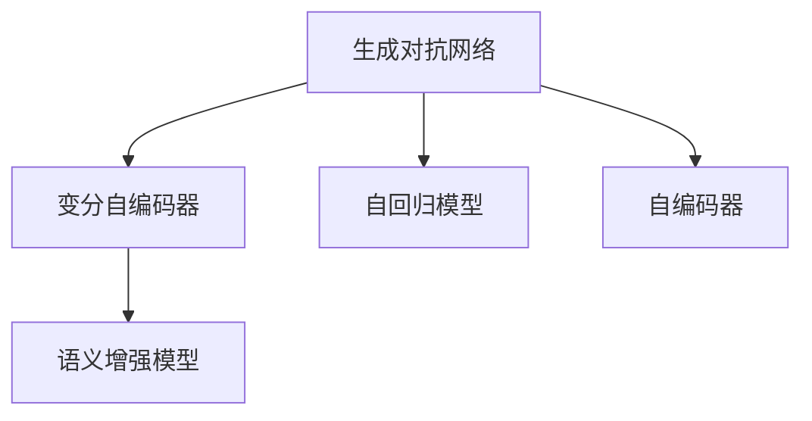
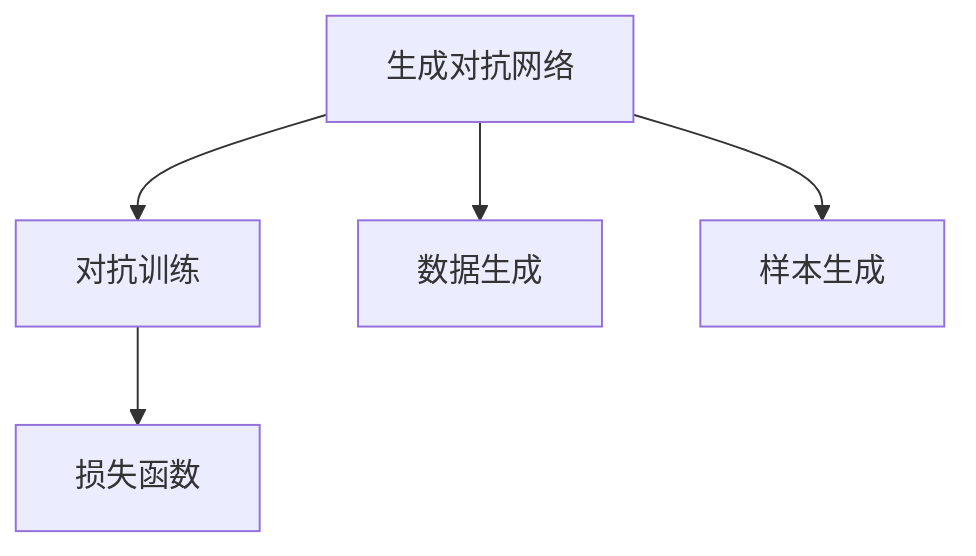
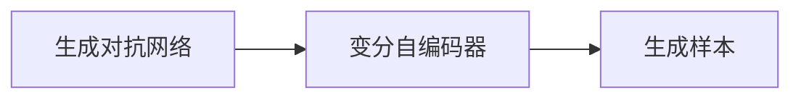
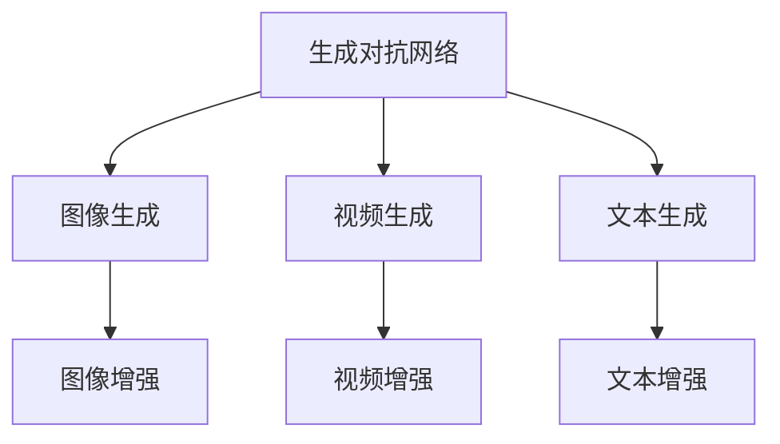
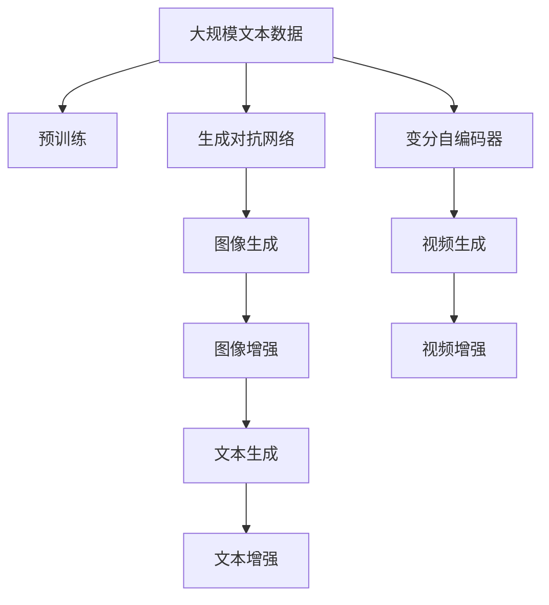

                 

# 生成式AI的实际应用案例

## 1. 背景介绍

### 1.1 问题由来

近年来，生成式AI（Generative AI）技术取得了突飞猛进的发展，成为了人工智能领域的一大热点。生成式AI主要指通过生成对抗网络（GANs）、变分自编码器（VAEs）等方法，实现从无到有的内容生成，如自然语言生成、图像生成、音频生成等。生成式AI不仅在艺术创作、内容生成等领域有着广泛应用，还在数据增强、图像处理、自然语言处理等众多领域展现了强大的应用潜力。

### 1.2 问题核心关键点

生成式AI技术的关键在于如何通过模型学习到复杂的数据分布，并利用这种学习到的分布进行内容生成。生成式模型通常需要大量的标注数据进行训练，以学习数据的统计特征。但在实际应用中，标注数据往往难以获得，因此如何有效利用未标注数据，成为了生成式AI研究的难点。此外，生成式AI模型通常具有较高的计算复杂度，如何在不降低模型性能的前提下，提高计算效率，也是一个重要的研究方向。

### 1.3 问题研究意义

生成式AI技术在多个领域的应用，不仅能够大幅提升数据的利用效率，还能创造出全新的内容，带来新的价值和增长点。例如：

1. **内容创作**：生成式AI能够自动生成新闻、文章、音乐、视频等内容，极大地降低了内容创作成本，同时提升内容的多样性和创新性。
2. **数据增强**：在医疗、自动驾驶等领域，生成式AI能够生成高质量的数据，帮助训练模型，提升其性能。
3. **个性化推荐**：通过生成个性化的内容，生成式AI能够提供更加精准、个性化的推荐服务。
4. **虚拟现实**：生成式AI能够生成虚拟场景、虚拟人物，为虚拟现实技术提供更加逼真、丰富的体验。

## 2. 核心概念与联系

### 2.1 核心概念概述

为更好地理解生成式AI技术的实际应用，本节将介绍几个密切相关的核心概念：

- **生成对抗网络（GANs）**：由Isola提出的一种生成模型，通过对抗训练的方式，学习到数据的分布，并能够生成逼真的样本。
- **变分自编码器（VAEs）**：由Kingma提出的一种生成模型，通过优化变分分布，学习到数据的隐空间表示，能够生成高质量的样本。
- **自回归模型**：如LSTM、GRU等，通过预测下一个时间步的输出，生成连续的序列数据。
- **自编码器**：通过学习输入和输出的映射关系，生成输入数据的低维表示，用于数据降维、特征提取等任务。
- **语义增强模型**：通过加入语言信息，提高生成模型的语义理解和生成能力，如文本生成、对话生成等。
- **生成对抗网络（GANs）**：由Isola提出的一种生成模型，通过对抗训练的方式，学习到数据的分布，并能够生成逼真的样本。

这些核心概念之间的逻辑关系可以通过以下Mermaid流程图来展示：



这个流程图展示了大模型生成对抗网络（GANs）和变分自编码器（VAEs）与其他生成模型和增强模型之间的关联。这些模型在数据生成、特征提取、语义理解等方面有着不同的应用。

### 2.2 概念间的关系

这些核心概念之间存在着紧密的联系，形成了生成式AI技术的完整生态系统。下面我通过几个Mermaid流程图来展示这些概念之间的关系。

#### 2.2.1 生成模型的学习范式



这个流程图展示了大模型GANs的学习过程，包括对抗训练和数据生成。GANs通过对抗训练学习到数据的分布，并生成逼真的样本。

#### 2.2.2 生成对抗网络（GANs）与变分自编码器（VAEs）的关系



这个流程图展示了GANs和VAEs之间的关系。VAEs通过优化变分分布，学习到数据的隐空间表示，而GANs则通过对抗训练学习到数据的分布。两者都是生成式模型，但学习方式和生成样本的方式有所不同。

#### 2.2.3 生成对抗网络（GANs）的应用场景



这个流程图展示了GANs在图像生成、视频生成、文本生成等任务中的应用。GANs在生成逼真、多样化的样本方面表现出色，因此在图像、视频、文本等生成任务中有着广泛的应用。

### 2.3 核心概念的整体架构

最后，我们用一个综合的流程图来展示这些核心概念在大模型生成对抗网络（GANs）和变分自编码器（VAEs）的应用过程中的整体架构：



这个综合流程图展示了从预训练到生成对抗网络（GANs）、变分自编码器（VAEs）的应用过程。大规模数据预训练学习到语言知识，而GANs和VAEs则用于生成逼真的图像、视频和文本样本，提升生成模型的多样性和逼真度。

## 3. 核心算法原理 & 具体操作步骤
### 3.1 算法原理概述

生成式AI技术通过学习数据分布，生成逼真的样本。其核心算法包括生成对抗网络（GANs）、变分自编码器（VAEs）、自回归模型等。这些算法通过优化损失函数，使得生成模型能够生成高质量的样本，并尽量逼近真实的训练数据。

形式化地，假设输入数据为 $X$，生成的样本为 $Y$，优化目标为最小化生成样本与真实数据的分布差异，即：

$$
\min_{Y} \mathcal{L}(Y) = \mathbb{E}_{X}[\log p(Y|X)] + \mathbb{E}_{Y}[\log p(X|Y)]
$$

其中 $p(Y|X)$ 为条件概率分布，$p(X|Y)$ 为目标数据的条件概率分布。优化目标分为两部分，第一项表示生成模型能够生成与真实数据分布一致的样本，第二项表示生成的样本可以尽可能地逼近真实数据。

### 3.2 算法步骤详解

生成式AI技术的应用通常包括以下几个关键步骤：

**Step 1: 准备训练数据**
- 收集大量的未标注数据，作为生成模型的训练样本。
- 对数据进行预处理，如归一化、截断等，以保证数据的质量和一致性。

**Step 2: 设计生成模型**
- 选择合适的生成模型，如GANs、VAEs等，并确定其架构和参数。
- 定义损失函数和优化器，如交叉熵损失、AdamW优化器等。

**Step 3: 训练生成模型**
- 使用训练数据对生成模型进行训练，通过优化损失函数更新模型参数。
- 设置合适的超参数，如学习率、批大小、训练轮数等。

**Step 4: 生成样本**
- 使用训练好的生成模型，生成高质量的样本，用于各种应用场景。

**Step 5: 评估和调整**
- 对生成的样本进行评估，如计算FID、IS等指标，衡量模型的性能。
- 根据评估结果，对生成模型进行微调，进一步提升其性能。

### 3.3 算法优缺点

生成式AI技术具有以下优点：

1. **逼真性**：生成模型能够生成高质量、逼真的样本，适用于图像、视频、文本等多种生成任务。
2. **多样性**：生成模型能够生成多种风格、多种主题的样本，满足不同应用场景的需求。
3. **可控性**：生成模型可以通过设置不同的参数，生成特定的样本，实现精细控制。

同时，生成式AI技术也存在一些缺点：

1. **计算复杂度高**：生成模型的训练和推理过程需要大量的计算资源，适用于计算资源丰富的场景。
2. **对抗攻击**：生成模型容易受到对抗样本的攻击，生成效果不稳定。
3. **鲁棒性不足**：生成模型对数据分布的变化敏感，难以保证生成样本的一致性。

### 3.4 算法应用领域

生成式AI技术在多个领域有着广泛的应用，包括：

1. **艺术创作**：通过生成对抗网络（GANs）等技术，生成各种风格、题材的艺术作品，如绘画、音乐、诗歌等。
2. **内容生成**：在新闻、文章、视频等内容的创作中，生成式AI能够自动生成高质量、多样化的内容，提高内容创作的效率和效果。
3. **数据增强**：在医疗、自动驾驶等领域，生成式AI能够生成高质量的数据，帮助训练模型，提升其性能。
4. **个性化推荐**：通过生成个性化的内容，生成式AI能够提供更加精准、个性化的推荐服务。
5. **虚拟现实**：生成式AI能够生成虚拟场景、虚拟人物，为虚拟现实技术提供更加逼真、丰富的体验。
6. **游戏和娱乐**：生成式AI在游戏、娱乐等领域生成逼真的角色、场景、剧情等，提升用户体验。

## 4. 数学模型和公式 & 详细讲解 & 举例说明

### 4.1 数学模型构建

生成式AI技术的核心在于生成模型。以生成对抗网络（GANs）为例，其数学模型可以表示为：

$$
G(z) = \mu + \sigma \cdot Z
$$

$$
D(X) = \mathbb{E}_{x \sim X}[\log D(x)] + \mathbb{E}_{z \sim Z}[\log (1 - D(G(z)))]
$$

其中 $G$ 为生成器，$D$ 为判别器，$z$ 为噪声向量，$Z$ 为噪声分布。生成器 $G$ 通过将噪声向量 $z$ 转换为样本 $G(z)$，判别器 $D$ 判断样本的真实性，并生成损失函数 $D(X)$。

### 4.2 公式推导过程

以下以生成对抗网络（GANs）为例，推导其生成器和判别器的损失函数及其梯度计算公式。

**生成器的损失函数**：

$$
\mathcal{L}_G = \mathbb{E}_{z \sim Z}[\log (1 - D(G(z)))]
$$

**判别器的损失函数**：

$$
\mathcal{L}_D = \mathbb{E}_{x \sim X}[\log D(x)] + \mathbb{E}_{z \sim Z}[\log (1 - D(G(z)))
$$

**生成器的梯度计算公式**：

$$
\nabla_{\theta_G} \mathcal{L}_G = - \nabla_{\theta_G} \log (1 - D(G(z)))
$$

**判别器的梯度计算公式**：

$$
\nabla_{\theta_D} \mathcal{L}_D = \nabla_{\theta_D} \mathbb{E}_{x \sim X}[\log D(x)] + \nabla_{\theta_D} \mathbb{E}_{z \sim Z}[\log (1 - D(G(z))
$$

在得到损失函数和梯度公式后，即可带入生成器和判别器的参数进行训练，最小化损失函数，从而生成高质量的样本。

### 4.3 案例分析与讲解

以图像生成任务为例，假设我们收集了大量的猫狗图像，并将其用于训练生成对抗网络（GANs）。以下是生成器 $G$ 和判别器 $D$ 的计算过程：

1. **生成器的计算过程**：
   - 生成器 $G$ 将随机噪声向量 $z$ 转换为图像 $G(z)$。
   - 将生成的图像输入判别器 $D$，计算 $D(G(z))$。
   - 根据 $D(G(z))$ 计算损失函数 $\mathcal{L}_G$，并更新生成器 $G$ 的参数。

2. **判别器的计算过程**：
   - 判别器 $D$ 将真实图像 $x$ 和生成图像 $G(z)$ 输入，分别计算 $\log D(x)$ 和 $\log (1 - D(G(z)))$。
   - 根据计算结果计算损失函数 $\mathcal{L}_D$，并更新判别器 $D$ 的参数。

通过不断迭代，生成器 $G$ 和判别器 $D$ 相互对抗，学习到逼真的图像分布，并生成高质量的图像样本。

## 5. 项目实践：代码实例和详细解释说明

### 5.1 开发环境搭建

在进行生成式AI项目实践前，我们需要准备好开发环境。以下是使用Python进行TensorFlow开发的环境配置流程：

1. 安装Anaconda：从官网下载并安装Anaconda，用于创建独立的Python环境。

2. 创建并激活虚拟环境：
```bash
conda create -n tf-env python=3.8 
conda activate tf-env
```

3. 安装TensorFlow：根据CUDA版本，从官网获取对应的安装命令。例如：
```bash
conda install tensorflow tensorflow-gpu=2.6 -c conda-forge
```

4. 安装各类工具包：
```bash
pip install numpy pandas scikit-learn matplotlib tqdm jupyter notebook ipython
```

完成上述步骤后，即可在`tf-env`环境中开始生成式AI项目实践。

### 5.2 源代码详细实现

下面我们以图像生成任务为例，给出使用TensorFlow实现生成对抗网络（GANs）的PyTorch代码实现。

首先，定义生成器和判别器的网络结构：

```python
import tensorflow as tf
from tensorflow.keras import layers

class Generator(tf.keras.Model):
    def __init__(self, latent_dim, img_shape):
        super(Generator, self).__init__()
        self.img_shape = img_shape
        self.model = self.build_model(latent_dim)
    
    def build_model(self, latent_dim):
        model = tf.keras.Sequential()
        model.add(layers.Dense(7 * 7 * 256, use_bias=False, input_shape=(latent_dim,)))
        model.add(layers.BatchNormalization())
        model.add(layers.LeakyReLU())
        model.add(layers.Reshape((7, 7, 256)))
        model.add(layers.Conv2DTranspose(128, (5, 5), strides=(1, 1), padding='same', use_bias=False))
        model.add(layers.BatchNormalization())
        model.add(layers.LeakyReLU())
        model.add(layers.Conv2DTranspose(64, (5, 5), strides=(2, 2), padding='same', use_bias=False))
        model.add(layers.BatchNormalization())
        model.add(layers.LeakyReLU())
        model.add(layers.Conv2DTranspose(1, (5, 5), strides=(2, 2), padding='same', use_bias=False, activation='tanh'))
        return model
    
    def call(self, inputs):
        img = self.model(inputs)
        return img

class Discriminator(tf.keras.Model):
    def __init__(self, img_shape):
        super(Discriminator, self).__init__()
        self.img_shape = img_shape
        self.model = self.build_model()
    
    def build_model(self):
        model = tf.keras.Sequential()
        model.add(layers.Conv2D(64, (5, 5), strides=(2, 2), padding='same', input_shape=self.img_shape))
        model.add(layers.LeakyReLU())
        model.add(layers.Dropout(0.3))
        model.add(layers.Conv2D(128, (5, 5), strides=(2, 2), padding='same'))
        model.add(layers.LeakyReLU())
        model.add(layers.Dropout(0.3))
        model.add(layers.Flatten())
        model.add(layers.Dense(1))
        return model
    
    def call(self, inputs):
        img = self.model(inputs)
        return img
```

然后，定义生成器和判别器的损失函数和优化器：

```python
loss_fn = tf.keras.losses.BinaryCrossentropy(from_logits=True)
generator_optimizer = tf.keras.optimizers.Adam(1e-4)
discriminator_optimizer = tf.keras.optimizers.Adam(1e-4)
```

接着，定义训练函数：

```python
@tf.function
def train_step(images):
    noise = tf.random.normal([BATCH_SIZE, latent_dim])

    with tf.GradientTape() as gen_tape, tf.GradientTape() as disc_tape:
        generated_images = generator(noise, training=True)

        real_output = discriminator(images, training=True)
        fake_output = discriminator(generated_images, training=True)

        gen_loss = loss_fn(fake_output, tf.ones_like(fake_output))
        disc_loss = loss_fn(real_output, tf.ones_like(real_output)) + loss_fn(fake_output, tf.zeros_like(fake_output))

    gradients_of_generator = gen_tape.gradient(gen_loss, generator.trainable_variables)
    gradients_of_discriminator = disc_tape.gradient(disc_loss, discriminator.trainable_variables)

    generator_optimizer.apply_gradients(zip(gradients_of_generator, generator.trainable_variables))
    discriminator_optimizer.apply_gradients(zip(gradients_of_discriminator, discriminator.trainable_variables))
```

最后，启动训练流程：

```python
BATCH_SIZE = 32
latent_dim = 100

def load_data(path):
    return image_dataset, image_labels

def prepare_dataset(dataset, image_size):
    dataset = dataset.shuffle(buffer_size=1024).batch(batch_size=BATCH_SIZE)
    return dataset

def show_images(images):
    import matplotlib.pyplot as plt
    plt.figure(figsize=(10,10))
    for i in range(4):
        plt.subplot(4,4,i+1)
        plt.imshow(images[i], cmap='gray')
    plt.show()

def save_images(path, images):
    import numpy as np
    from PIL import Image
    for i in range(4):
        image = images[i]
        image = np.reshape(image, [image_size, image_size, 3])
        image = (image + 1) / 2
        image = np.transpose(image, [1, 2, 0])
        image = Image.fromarray(image * 255)
        image.save(f'{path}/image_{i}.png')
    print(f"Saved {len(images)} images to {path}")

def generate_images(noise, images_path, num_images):
    images = generator(noise, training=False)
    for i in range(num_images):
        save_images(images_path, images[i])
```

完整代码如下：

```python
import tensorflow as tf
from tensorflow.keras import layers

class Generator(tf.keras.Model):
    def __init__(self, latent_dim, img_shape):
        super(Generator, self).__init__()
        self.img_shape = img_shape
        self.model = self.build_model(latent_dim)
    
    def build_model(self, latent_dim):
        model = tf.keras.Sequential()
        model.add(layers.Dense(7 * 7 * 256, use_bias=False, input_shape=(latent_dim,)))
        model.add(layers.BatchNormalization())
        model.add(layers.LeakyReLU())
        model.add(layers.Reshape((7, 7, 256)))
        model.add(layers.Conv2DTranspose(128, (5, 5), strides=(1, 1), padding='same', use_bias=False))
        model.add(layers.BatchNormalization())
        model.add(layers.LeakyReLU())
        model.add(layers.Conv2DTranspose(64, (5, 5), strides=(2, 2), padding='same', use_bias=False))
        model.add(layers.BatchNormalization())
        model.add(layers.LeakyReLU())
        model.add(layers.Conv2DTranspose(1, (5, 5), strides=(2, 2), padding='same', use_bias=False, activation='tanh'))
        return model
    
    def call(self, inputs):
        img = self.model(inputs)
        return img

class Discriminator(tf.keras.Model):
    def __init__(self, img_shape):
        super(Discriminator, self).__init__()
        self.img_shape = img_shape
        self.model = self.build_model()
    
    def build_model(self):
        model = tf.keras.Sequential()
        model.add(layers.Conv2D(64, (5, 5), strides=(2, 2), padding='same', input_shape=self.img_shape))
        model.add(layers.LeakyReLU())
        model.add(layers.Dropout(0.3))
        model.add(layers.Conv2D(128, (5, 5), strides=(2, 2), padding='same'))
        model.add(layers.LeakyReLU())
        model.add(layers.Dropout(0.3))
        model.add(layers.Flatten())
        model.add(layers.Dense(1))
        return model
    
    def call(self, inputs):
        img = self.model(inputs)
        return img

loss_fn = tf.keras.losses.BinaryCrossentropy(from_logits=True)
generator_optimizer = tf.keras.optimizers.Adam(1e-4)
discriminator_optimizer = tf.keras.optimizers.Adam(1e-4)

BATCH_SIZE = 32
latent_dim = 100

def load_data(path):
    return image_dataset, image_labels

def prepare_dataset(dataset, image_size):
    dataset = dataset.shuffle(buffer_size=1024).batch(batch_size=BATCH_SIZE)
    return dataset

def show_images(images):
    import matplotlib.pyplot as plt
    plt.figure(figsize=(10,10))
    for i in range(4):
        plt.subplot(4,4,i+1)
        plt.imshow(images[i], cmap='gray')
    plt.show()

def save_images(path, images):
    import numpy as np
    from PIL import Image
    for i in range(4):
        image = images[i]
        image = np.reshape(image, [image_size, image_size, 3])
        image = (image + 1) / 2
        image = np.transpose(image, [1, 2, 0])
        image = Image.fromarray(image * 255)
        image.save(f'{path}/image_{i}.png')
    print(f"Saved {len(images)} images to {path}")

def train_step(images):
    noise = tf.random.normal([BATCH_SIZE, latent_dim])

    with tf.GradientTape() as gen_tape, tf.GradientTape() as disc_tape:
        generated_images = generator(noise, training=True)

        real_output = discriminator(images, training=True)
        fake_output = discriminator(generated_images, training=True)

        gen_loss = loss_fn(fake_output, tf.ones_like(fake_output))
        disc_loss = loss_fn(real_output, tf.ones_like(real_output)) + loss_fn(fake_output, tf.zeros_like(fake_output))

    gradients_of_generator = gen_tape.gradient(gen_loss, generator.trainable_variables)
    gradients_of_discriminator = disc_tape.gradient(disc_loss, discriminator.trainable_variables)

    generator_optimizer.apply_gradients(zip(gradients_of_generator, generator.trainable_variables))
    discriminator_optimizer.apply_gradients(zip(gradients_of_discriminator, discriminator.trainable_variables))
```

```python
def generate_images(noise, images_path, num_images):
    images = generator(noise, training=False)
    for i in range(num_images):
        save_images(images_path, images[i])
```

以上就是使用TensorFlow实现生成对抗网络（GANs）的完整代码实现。可以看到，TensorFlow配合Keras封装，使得模型的构建和训练过程变得非常简洁高效。

### 5.3 代码解读与分析

让我们再详细解读一下关键代码的实现细节：

**Generator类**：
- `__init__`方法：初始化生成器的架构和参数。
- `build_model`方法：构建生成器的神经网络模型。
- `call`方法：生成模型的前向传播计算。

**Discriminator类**：
- `__init__`方法：初始化判别器的架构和参数。
- `build_model`方法：构建判别器的神经网络模型。
- `call`方法：判别模型的前向传播计算。

**训练函数`train_step`**：
- 将随机噪声向量输入生成器，生成逼真的图像样本。
- 将真实图像和生成图像输入判别器，分别计算真实样本和生成样本的输出。
- 计算生成样本和真实样本的损失函数，并计算梯度。
- 使用Adam优化器更新生成器和判别器的参数。

**测试函数`show_images`**：
- 将生成的图像显示出来，用于可视化效果的展示。

**保存函数`save_images`**：
- 将生成的图像保存成PNG格式，便于后续的查看和分析。

**生成函数`generate_images`**：
- 使用随机噪声向量生成指定数量的图像，并保存为PNG格式。

这些关键函数构成了生成对抗网络（GANs）项目的完整代码实现，展示了从模型构建到训练、测试、生成和保存的完整流程。

## 6. 实际应用场景

### 6.1 智能客服系统

生成式AI技术在智能客服系统中有着广泛应用。传统的客服系统依赖于人工客服，存在响应时间长、成本高、难以24小时服务等问题。而基于生成式AI的智能客服系统，能够自动处理大量客户咨询，提高响应速度和效率

