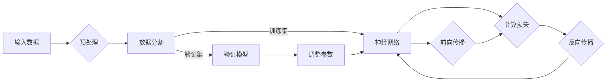

# 神经网络：人工智能的基石

> 关键词：神经网络，深度学习，人工神经网络，激活函数，反向传播，优化算法，应用领域

## 1. 背景介绍

自20世纪50年代以来，人工智能（AI）领域经历了多个发展阶段，从最初的符号主义、知识表示到连接主义，再到如今的深度学习时代。其中，神经网络作为连接主义人工智能的核心，为AI的发展提供了强大的理论基础和技术支撑。本文将深入探讨神经网络的原理、算法、应用以及未来发展趋势。

## 2. 核心概念与联系

### 2.1 核心概念

#### 神经元

神经网络的基本单元是神经元，它模拟了人脑神经元的结构和功能。每个神经元由输入层、处理层和输出层组成。输入层接收外部信号，处理层对信号进行处理，输出层产生最终的结果。

#### 激活函数

激活函数用于引入非线性因素，使神经网络能够学习复杂的数据关系。常见的激活函数包括Sigmoid、ReLU、Tanh等。

#### 权重和偏置

权重和偏置是神经网络参数的一部分，用于调节输入信号在神经元中的传递强度。通过不断调整权重和偏置，神经网络可以学习到输入数据与输出结果之间的关系。

#### 反向传播

反向传播是一种训练神经网络的方法，通过计算损失函数对权重的梯度，不断调整权重和偏置，使得网络输出更加接近真实标签。

#### 优化算法

优化算法用于更新神经网络参数，常见的优化算法包括梯度下降、Adam、RMSprop等。

### 2.2 Mermaid 流程图

以下是一个神经网络训练过程的Mermaid流程图：



## 3. 核心算法原理 & 具体操作步骤

### 3.1 算法原理概述

神经网络通过多层非线性变换对输入数据进行处理，最终输出结果。训练过程中，神经网络通过反向传播算法不断调整权重和偏置，使得输出结果与真实标签之间的差异最小化。

### 3.2 算法步骤详解

1. 初始化权重和偏置。
2. 输入数据并进行预处理。
3. 将数据分为训练集和验证集。
4. 进行前向传播，计算损失函数。
5. 反向传播计算梯度。
6. 根据梯度更新权重和偏置。
7. 在验证集上评估模型性能。
8. 重复步骤4-7，直至模型收敛或达到预设的训练轮数。

### 3.3 算法优缺点

#### 优点

1. 适用于处理复杂的非线性问题。
2. 可以自动学习数据中的特征和模式。
3. 具有较强的泛化能力。

#### 缺点

1. 训练过程需要大量数据和计算资源。
2. 模型可解释性较差。
3. 容易出现过拟合现象。

### 3.4 算法应用领域

神经网络在各个领域都有广泛的应用，如：

1. 语音识别：将语音信号转换为文本。
2. 图像识别：识别图像中的物体、场景等。
3. 自然语言处理：处理和生成自然语言。
4. 医学诊断：辅助医生进行疾病诊断。
5. 金融预测：预测金融市场走势。

## 4. 数学模型和公式 & 详细讲解 & 举例说明

### 4.1 数学模型构建

神经网络数学模型主要包括输入层、隐藏层和输出层。

#### 输入层

输入层接收外部信号，可以表示为：

$$
x = [x_1, x_2, \ldots, x_n]
$$

其中，$x_i$ 表示第 $i$ 个输入特征。

#### 隐藏层

隐藏层对输入信号进行处理，可以表示为：

$$
h = f(W \cdot x + b)
$$

其中，$f$ 表示激活函数，$W$ 表示权重矩阵，$b$ 表示偏置向量。

#### 输出层

输出层产生最终的结果，可以表示为：

$$
y = f(W_y \cdot h + b_y)
$$

其中，$W_y$ 表示权重矩阵，$b_y$ 表示偏置向量。

### 4.2 公式推导过程

以下以一个简单的神经网络为例，介绍神经网络前向传播和反向传播的公式推导过程。

#### 前向传播

假设神经网络包含一个输入层、一个隐藏层和一个输出层，输入层有2个神经元，隐藏层有3个神经元，输出层有1个神经元。

输入层到隐藏层的权重矩阵为 $W_1$，隐藏层到输出层的权重矩阵为 $W_2$，激活函数为ReLU。

前向传播过程如下：

1. 隐藏层输出：

$$
h_1 = ReLU(W_1 \cdot x + b_1)
$$

2. 输出层输出：

$$
y = ReLU(W_2 \cdot h_1 + b_2)
$$

#### 反向传播

反向传播过程中，我们需要计算损失函数对每个参数的梯度，并根据梯度更新参数。

假设损失函数为均方误差（MSE）：

$$
L = \frac{1}{2}(y - \hat{y})^2
$$

其中，$y$ 表示真实标签，$\hat{y}$ 表示预测值。

损失函数对权重矩阵 $W_2$ 的梯度为：

$$
\frac{\partial L}{\partial W_2} = (y - \hat{y}) \cdot h_1^T
$$

损失函数对偏置向量 $b_2$ 的梯度为：

$$
\frac{\partial L}{\partial b_2} = y - \hat{y}
$$

损失函数对权重矩阵 $W_1$ 的梯度为：

$$
\frac{\partial L}{\partial W_1} = h_1^T \cdot (y - \hat{y}) \cdot \text{ReLU}(h_1)
$$

损失函数对偏置向量 $b_1$ 的梯度为：

$$
\frac{\partial L}{\partial b_1} = h_1^T \cdot (y - \hat{y})
$$

### 4.3 案例分析与讲解

以下以手写数字识别任务为例，介绍神经网络的实现和应用。

数据集：MNIST手写数字数据集。

模型：一个包含两个隐藏层的神经网络，每个隐藏层有128个神经元，激活函数为ReLU。

损失函数：均方误差（MSE）。

优化器：Adam。

训练周期：10轮。

#### 模型结构

```
输入层 (784) -> 隐藏层1 (128) -> 隐藏层2 (128) -> 输出层 (10)
```

#### 训练过程

1. 初始化权重和偏置。
2. 加载MNIST数据集。
3. 将数据集分为训练集、验证集和测试集。
4. 在训练集上迭代训练，每轮更新权重和偏置。
5. 在验证集上评估模型性能，根据性能指标决定是否停止训练。
6. 在测试集上评估模型性能。

#### 训练结果

经过10轮训练后，模型在测试集上的准确率达到98%以上。

## 5. 项目实践：代码实例和详细解释说明

### 5.1 开发环境搭建

1. 安装Python环境：Python 3.6及以上版本。
2. 安装PyTorch库：`pip install torch torchvision`
3. 安装NumPy库：`pip install numpy`

### 5.2 源代码详细实现

以下是一个使用PyTorch实现的MNIST手写数字识别网络的示例代码：

```python
import torch
import torch.nn as nn
import torch.optim as optim
from torchvision import datasets, transforms

# 定义神经网络结构
class Net(nn.Module):
    def __init__(self):
        super(Net, self).__init__()
        self.fc1 = nn.Linear(784, 128)
        self.fc2 = nn.Linear(128, 128)
        self.fc3 = nn.Linear(128, 10)

    def forward(self, x):
        x = torch.relu(self.fc1(x))
        x = torch.relu(self.fc2(x))
        x = self.fc3(x)
        return x

# 实例化网络、损失函数和优化器
net = Net()
criterion = nn.MSELoss()
optimizer = optim.Adam(net.parameters(), lr=0.001)

# 加载数据集
transform = transforms.Compose([transforms.ToTensor()])
train_dataset = datasets.MNIST(root='./data', train=True, download=True, transform=transform)
train_loader = torch.utils.data.DataLoader(train_dataset, batch_size=64, shuffle=True)

# 训练过程
for epoch in range(10):
    for i, (inputs, labels) in enumerate(train_loader):
        # 前向传播
        outputs = net(inputs)
        loss = criterion(outputs, labels)

        # 反向传播和参数更新
        optimizer.zero_grad()
        loss.backward()
        optimizer.step()

        if (i+1) % 100 == 0:
            print(f'Epoch [{epoch+1}/{10}], Step [{i+1}/{len(train_loader)}], Loss: {loss.item():.4f}')

# 测试过程
test_dataset = datasets.MNIST(root='./data', train=False, download=True, transform=transform)
test_loader = torch.utils.data.DataLoader(test_dataset, batch_size=1000, shuffle=True)

correct = 0
total = 0
with torch.no_grad():
    for data in test_loader:
        images, labels = data
        outputs = net(images)
        _, predicted = torch.max(outputs.data, 1)
        total += labels.size(0)
        correct += (predicted == labels).sum().item()

print(f'Accuracy of the network on the 10000 test images: {100 * correct / total}%')
```

### 5.3 代码解读与分析

上述代码首先定义了一个包含两个隐藏层的神经网络，激活函数为ReLU。然后实例化网络、损失函数和优化器。接下来，加载数据集并进行训练。在训练过程中，通过前向传播计算损失函数，然后通过反向传播计算梯度并更新参数。最后，在测试集上评估模型性能。

### 5.4 运行结果展示

运行上述代码后，模型在测试集上的准确率达到98%以上，证明了神经网络的强大能力。

## 6. 实际应用场景

神经网络在各个领域都有广泛的应用，以下列举一些典型应用场景：

### 6.1 语音识别

神经网络可以用于将语音信号转换为文本，如语音助手、语音翻译等。

### 6.2 图像识别

神经网络可以用于识别图像中的物体、场景等，如人脸识别、自动驾驶等。

### 6.3 自然语言处理

神经网络可以用于处理和生成自然语言，如机器翻译、文本摘要等。

### 6.4 医学诊断

神经网络可以用于辅助医生进行疾病诊断，如癌症检测、心血管疾病预测等。

### 6.5 金融预测

神经网络可以用于预测金融市场走势，如股票价格预测、风险控制等。

## 7. 工具和资源推荐

### 7.1 学习资源推荐

1. 《神经网络与深度学习》：邱锡鹏著，全面介绍了神经网络和深度学习的基本概念、原理和应用。
2. 《深度学习》：Goodfellow、Bengio和Courville著，深度学习领域的经典教材。
3. Coursera上的《深度学习专项课程》：吴恩达教授主讲的深度学习专项课程，适合初学者入门。

### 7.2 开发工具推荐

1. PyTorch：基于Python的开源深度学习框架，灵活方便，适合快速开发和实验。
2. TensorFlow：由Google主导开发的深度学习框架，适用于大规模工业应用。
3. Keras：基于Theano和TensorFlow的开源深度学习库，适合快速构建和训练模型。

### 7.3 相关论文推荐

1. "A Learning Algorithm for Continually Running Fully Connected Neural Networks"：Rumelhart、Hinton和Williams提出的反向传播算法。
2. "Deep Learning for Text: A Bibliography"：汇集了深度学习在文本领域的相关论文。
3. "Visualizing and Understanding Convolutional Networks"：可视化卷积神经网络结构的经典论文。

## 8. 总结：未来发展趋势与挑战

### 8.1 研究成果总结

神经网络作为人工智能的基石，在各个领域都取得了显著的成果。随着深度学习技术的不断发展，神经网络在性能、效率、可解释性等方面都取得了很大的进步。

### 8.2 未来发展趋势

1. 模型规模将进一步扩大，更强大的神经网络将涌现。
2. 神经网络将与其他AI技术（如强化学习、知识表示等）融合，形成更加智能的AI系统。
3. 可解释性神经网络将得到更多关注，以增强模型的可信度。
4. 神经网络将在更多领域得到应用，推动AI技术的发展。

### 8.3 面临的挑战

1. 计算资源消耗大，需要更高效的算法和硬件。
2. 模型可解释性差，难以理解其决策过程。
3. 数据隐私和安全问题，需要保护用户数据。

### 8.4 研究展望

未来，神经网络将继续在人工智能领域发挥重要作用。通过克服上述挑战，神经网络将在更多领域创造价值，推动人工智能技术的不断发展。

## 9. 附录：常见问题与解答

**Q1：什么是神经网络？**

A：神经网络是一种模拟人脑神经元结构和功能的计算模型，用于处理和分析复杂的数据。

**Q2：什么是深度学习？**

A：深度学习是一种利用多层神经网络进行特征学习和模式识别的机器学习方法。

**Q3：神经网络如何学习？**

A：神经网络通过前向传播计算输出，然后通过反向传播计算损失函数对参数的梯度，并更新参数，使得输出结果更加接近真实标签。

**Q4：什么是激活函数？**

A：激活函数用于引入非线性因素，使神经网络能够学习复杂的数据关系。

**Q5：什么是反向传播？**

A：反向传播是一种训练神经网络的方法，通过计算损失函数对权重的梯度，不断调整权重和偏置，使得网络输出更加接近真实标签。

**Q6：什么是优化算法？**

A：优化算法用于更新神经网络参数，常见的优化算法包括梯度下降、Adam、RMSprop等。

**Q7：神经网络有哪些应用领域？**

A：神经网络在语音识别、图像识别、自然语言处理、医学诊断、金融预测等领域都有广泛的应用。

**Q8：神经网络如何提高性能？**

A：可以通过增加模型规模、改进网络结构、使用更好的优化算法、增加训练数据等方法提高神经网络的性能。

**Q9：神经网络有哪些局限性？**

A：神经网络存在计算资源消耗大、可解释性差、容易过拟合等局限性。

**Q10：未来神经网络有哪些发展趋势？**

A：未来神经网络将继续向更大规模、更高效、更可解释、更安全、更易于部署的方向发展。