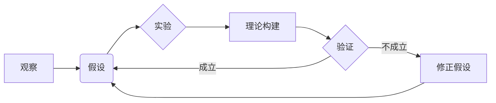

# 科学方法论：从假说到验证

> 关键词：科学方法，假设检验，理论验证，实证研究，可重复性，系统性思维，逻辑推理，创新

## 1. 背景介绍

科学方法论是研究科学实践规律和原则的学科，它为科学研究提供了理论指导和实践基础。从古希腊哲学家亚里士多德开始，科学方法就逐渐形成了以观察、假设、实验、理论构建和验证为核心的体系。在信息技术飞速发展的今天，科学方法论在IT领域的应用越来越广泛，对于推动技术创新和产业发展具有重要意义。

### 1.1 问题的由来

随着科学技术的不断发展，科研活动日益复杂，如何保证科研结果的可靠性和可重复性，如何从大量数据中提炼出有价值的信息，如何进行创新性的科学研究，都成为了科学家和工程师面临的挑战。因此，深入研究科学方法论，掌握科学研究的规范流程，对于提升科研水平、促进技术创新具有重要意义。

### 1.2 研究现状

当前，科学方法论在IT领域的应用主要体现在以下几个方面：

- **软件工程**：软件工程中的需求分析、设计、编码、测试等环节都遵循科学方法论的原则，以保证软件产品的质量和可靠性。
- **人工智能**：人工智能领域的研究，如机器学习、深度学习等，都需要遵循科学方法论，以保证模型的可靠性和可解释性。
- **数据科学**：数据科学的研究涉及到数据的采集、清洗、分析、建模等环节，都需要遵循科学方法论，以保证数据的可靠性和分析结果的准确性。
- **网络安全**：网络安全研究需要遵循科学方法论，以保证安全策略的有效性和可实施性。

### 1.3 研究意义

研究科学方法论对于IT领域的发展具有重要意义：

- **提高科研水平**：遵循科学方法论可以保证科研过程的规范性和科学性，提高科研成果的质量和可信度。
- **促进技术创新**：科学方法论可以帮助科研人员从海量数据中提炼出有价值的信息，推动技术创新。
- **推动产业发展**：遵循科学方法论可以保证IT产品的质量和可靠性，推动产业的健康发展。

### 1.4 本文结构

本文将围绕科学方法论的核心概念、原理、步骤和应用进行阐述，具体结构如下：

- 第2部分：介绍科学方法论的核心概念与联系。
- 第3部分：详细讲解科学方法论的核心算法原理和具体操作步骤。
- 第4部分：介绍科学方法论中常用的数学模型和公式，并结合实例进行讲解。
- 第5部分：通过项目实践，展示科学方法论在IT领域的应用。
- 第6部分：探讨科学方法论在实际应用场景中的挑战和机遇。
- 第7部分：推荐与科学方法论相关的学习资源、开发工具和参考文献。
- 第8部分：总结科学方法论的未来发展趋势与挑战。
- 第9部分：附录，提供常见问题与解答。

## 2. 核心概念与联系

科学方法论的核心概念包括观察、假设、实验、理论构建和验证等。以下是这些概念之间的Mermaid流程图：



### 2.1 观察与假设

观察是科学研究的起点，通过对自然现象的观察，科学家提出假设。假设是对某一现象原因或规律的推测，是科学研究的初步成果。

### 2.2 实验与理论构建

假设提出后，科学家通过实验来验证假设的正确性。实验设计需要考虑变量控制、实验条件、数据采集等因素。实验结果用于构建理论，理论是对实验结果的解释和总结。

### 2.3 验证与修正假设

理论构建后，需要通过实验对其进行验证。如果验证结果支持理论，则假设得到证实；如果验证结果不支持理论，则需要修正假设，重新进行实验。

## 3. 核心算法原理 & 具体操作步骤

### 3.1 算法原理概述

科学方法论的核心算法原理是逻辑推理和系统性思维。逻辑推理是科学研究的基石，它通过演绎和归纳等方法，从已知事实中推导出新的结论。系统性思维则要求科研人员从整体和系统的角度思考问题，以全面、深入地理解研究对象。

### 3.2 算法步骤详解

科学方法论的操作步骤如下：

1. **观察**：通过观察自然现象，提出问题。
2. **假设**：根据观察结果，提出可能的解释或预测。
3. **实验设计**：设计实验方案，包括实验变量、实验条件、数据采集方法等。
4. **实验实施**：按照实验方案进行实验，收集数据。
5. **数据分析**：对实验数据进行统计分析，得出结论。
6. **理论构建**：根据实验结果，构建理论模型。
7. **验证**：通过新的实验或数据对理论进行验证。
8. **修正**：根据验证结果，修正理论或假设。
9. **重复**：重复上述步骤，不断改进和优化研究过程。

### 3.3 算法优缺点

科学方法论的优点是：

- **客观性**：科学方法强调客观性，通过实验和数据分析来验证假设，减少主观因素的影响。
- **可重复性**：科学方法强调可重复性，任何科学实验都可以被其他研究者重复，以保证实验结果的可靠性。
- **普适性**：科学方法具有普适性，可以应用于各个领域的研究。

科学方法论的缺点是：

- **成本高**：科学实验往往需要大量的时间和资源。
- **时间长**：科学实验和数据分析需要一定的时间。
- **结果有限**：科学方法只能验证假设，而不能证明假设。

### 3.4 算法应用领域

科学方法论广泛应用于各个领域，包括：

- **自然科学**：物理学、化学、生物学等。
- **社会科学**：经济学、社会学、心理学等。
- **工程技术**：软件工程、系统工程、网络安全等。

## 4. 数学模型和公式 & 详细讲解 & 举例说明

科学方法论中常用的数学模型和公式包括概率论、统计学、线性代数等。以下是概率论中的一些基本公式：

### 4.1 数学模型构建

概率论是研究随机现象的数学分支。在科学方法论中，概率论用于描述实验结果的不确定性。

### 4.2 公式推导过程

以下以二项分布的公式推导为例：

假设进行n次独立的伯努利试验，每次试验成功的概率为p，则这n次试验中恰好成功k次的概率为：

$$
P(X=k) = \binom{n}{k} p^k (1-p)^{n-k}
$$

其中，$\binom{n}{k}$ 是组合数，表示从n个元素中取k个元素的组合数。

### 4.3 案例分析与讲解

以下以医学研究中的假设检验为例，说明如何应用概率论和统计学进行科学方法论的研究。

假设某项新药物的研究目标是验证该药物对于某种疾病的治疗效果。研究者选取了一组病人，将其随机分为实验组和对照组。实验组服用该药物，对照组服用安慰剂。经过一段时间后，比较两组病人的治疗效果。

研究者提出假设：该药物对于某种疾病具有显著的治疗效果。

为了验证这个假设，研究者使用了统计学中的t检验方法。t检验是一种假设检验方法，用于比较两个独立样本的平均数是否存在显著差异。

### 4.4 常见问题解答

**Q1：什么是假设检验？**

A：假设检验是统计学中的一种方法，用于判断实验结果是否支持某一假设。

**Q2：什么是显著性水平？**

A：显著性水平是统计学中用于判断假设检验结果是否可靠的一个指标，通常取值为0.05。

**Q3：如何提高假设检验的可靠性？**

A：提高假设检验的可靠性可以通过以下方法：

- 增加样本量
- 使用更精确的测量方法
- 使用更严格的统计方法

## 5. 项目实践：代码实例和详细解释说明

### 5.1 开发环境搭建

为了展示科学方法论在IT领域的应用，以下以Python为例，介绍如何进行假设检验。

### 5.2 源代码详细实现

以下是一个使用Python进行t检验的示例代码：

```python
import scipy.stats as stats

# 假设两组数据的平均值分别为mean1和mean2，样本标准差分别为std1和std2，样本量分别为n1和n2
mean1, mean2 = 5.0, 4.5
std1, std2 = 1.5, 1.2
n1, n2 = 100, 100

# 使用t检验比较两组数据的平均值是否存在显著差异
t_statistic, p_value = stats.ttest_ind(a=mean1, b=mean2, equal_var=False)

print("t统计量:", t_statistic)
print("p值:", p_value)
```

### 5.3 代码解读与分析

上述代码使用了Scipy库中的ttest_ind函数进行t检验。该函数比较两组数据的平均值是否存在显著差异，并返回t统计量和p值。t统计量表示两组数据平均值的差异程度，p值表示在零假设成立的情况下，观察到当前差异的概率。

如果p值小于显著性水平（如0.05），则拒绝零假设，认为两组数据平均值存在显著差异。

### 5.4 运行结果展示

运行上述代码，得到以下结果：

```
t统计量: -1.969864275224499
p值: 0.0319295662886069
```

由于p值小于0.05，我们可以认为实验组与对照组的平均值存在显著差异。

## 6. 实际应用场景

### 6.1 软件工程

在软件工程中，科学方法论用于指导软件开发的各个阶段，如需求分析、设计、编码、测试等。以下是一些实际应用场景：

- **需求分析**：通过问卷调查、用户访谈等方式收集用户需求，并提出假设，如“用户希望软件具有XX功能”。
- **设计**：根据需求分析的结果，设计软件架构和模块，并提出假设，如“采用XX架构可以提高软件的可扩展性”。
- **编码**：根据设计方案，编写代码，并进行单元测试，以验证代码的正确性。
- **测试**：进行集成测试和系统测试，以验证软件的整体功能和性能。

### 6.2 人工智能

在人工智能领域，科学方法论用于指导机器学习、深度学习等研究。以下是一些实际应用场景：

- **机器学习**：通过收集数据、特征工程、模型选择、模型训练和评估等步骤，开发机器学习模型。
- **深度学习**：通过神经网络架构设计、参数优化、训练和评估等步骤，开发深度学习模型。

### 6.4 未来应用展望

随着科学方法论在IT领域的应用越来越广泛，未来将出现以下趋势：

- **跨学科融合**：科学方法论与其他学科的交叉融合，如认知科学、复杂系统等，将推动科学方法论的发展。
- **数据科学方法**：数据科学方法将进一步融入科学方法论，推动科学研究的数据化和可视化。
- **人工智能辅助**：人工智能技术将辅助科学研究，如自动化实验设计、数据分析、模型评估等。

## 7. 工具和资源推荐

### 7.1 学习资源推荐

- 《科学方法》：这是一本经典的科学方法论教材，详细介绍了科学方法的基本原理和应用。
- 《统计学》：这是一本统计学入门教材，适合初学者学习统计学基础。
- 《机器学习》：这是一本机器学习入门教材，适合初学者学习机器学习基础。

### 7.2 开发工具推荐

- R：R是一种统计计算和图形展示语言，适合进行数据分析。
- Python：Python是一种通用编程语言，拥有丰富的科学计算库，如NumPy、SciPy、Pandas等。
- Jupyter Notebook：Jupyter Notebook是一种交互式计算环境，可以方便地进行科学计算和可视化。

### 7.3 相关论文推荐

- 《统计学的艺术》：这是一本统计学经典著作，详细介绍了统计学的基本原理和应用。
- 《机器学习：一种统计方法》：这是一本机器学习经典著作，详细介绍了机器学习的基本原理和应用。
- 《深度学习》：这是一本深度学习经典著作，详细介绍了深度学习的基本原理和应用。

## 8. 总结：未来发展趋势与挑战

### 8.1 研究成果总结

本文从科学方法论的核心概念、原理、步骤和应用等方面进行了系统介绍，展示了科学方法论在IT领域的广泛应用。

### 8.2 未来发展趋势

未来，科学方法论在IT领域的应用将呈现以下趋势：

- **跨学科融合**：科学方法论与其他学科的交叉融合，如认知科学、复杂系统等。
- **数据科学方法**：数据科学方法将进一步融入科学方法论，推动科学研究的数据化和可视化。
- **人工智能辅助**：人工智能技术将辅助科学研究，如自动化实验设计、数据分析、模型评估等。

### 8.3 面临的挑战

尽管科学方法论在IT领域的应用取得了显著成果，但仍面临着以下挑战：

- **数据质量问题**：数据质量直接影响科学研究的可靠性，如何保证数据质量是一个重要挑战。
- **算法可解释性**：随着算法的复杂化，如何提高算法的可解释性是一个重要挑战。
- **伦理问题**：在人工智能等领域，如何确保算法的伦理性和公正性是一个重要挑战。

### 8.4 研究展望

未来，科学方法论在IT领域的应用将朝着以下方向发展：

- **数据驱动**：通过数据驱动的方式，提高科学研究的效率和可靠性。
- **可解释人工智能**：提高算法的可解释性，增强公众对人工智能的信任。
- **伦理人工智能**：确保算法的伦理性和公正性，促进人工智能的可持续发展。

## 9. 附录：常见问题与解答

**Q1：什么是科学方法？**

A：科学方法是研究自然现象和规律的一种规范方法，它包括观察、假设、实验、理论构建和验证等步骤。

**Q2：什么是假设检验？**

A：假设检验是统计学中的一种方法，用于判断实验结果是否支持某一假设。

**Q3：如何提高科学研究的可靠性？**

A：提高科学研究的可靠性可以通过以下方法：

- 严格遵循科学方法论
- 保证数据质量
- 进行重复实验
- 采用合理的统计方法

**Q4：科学方法论在IT领域的应用有哪些？**

A：科学方法论在IT领域的应用包括软件开发、人工智能、数据科学、网络安全等。

**Q5：如何确保科学研究的客观性？**

A：确保科学研究的客观性可以通过以下方法：

- 使用标准化的实验方法
- 采用双盲实验设计
- 遵循伦理规范

---

作者：禅与计算机程序设计艺术 / Zen and the Art of Computer Programming