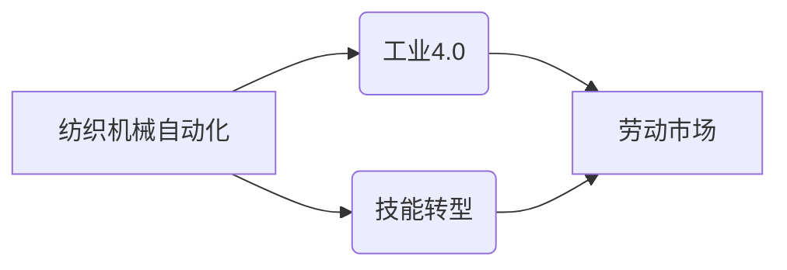

# 纺织机械自动化的就业效应

> 关键词：纺织机械自动化，就业影响，工业4.0，智能化，技能转型，劳动市场

## 1. 背景介绍

随着全球制造业的转型升级，纺织机械自动化已成为推动行业发展的关键驱动力。通过引入自动化设备和技术，纺织企业能够提高生产效率、降低成本、提升产品质量，并在激烈的市场竞争中保持优势。然而，自动化带来的技术变革同时也引发了关于就业影响的广泛讨论。本文将深入探讨纺织机械自动化对就业市场的效应，分析其带来的机遇与挑战。

### 1.1 问题的由来

在传统纺织制造业中，大量劳动力从事着重复性、体力劳动，工作环境艰苦，劳动强度大。随着自动化技术的发展，新型纺织机械能够替代部分人力完成生产任务，这引发了人们对就业岗位减少的担忧。同时，自动化也带来了新的技术岗位，对劳动力的技能要求发生了变化，促使从业者进行技能转型。

### 1.2 研究现状

关于纺织机械自动化对就业的影响，学术界和产业界已有诸多研究。一些研究表明，自动化确实会导致传统工作岗位的减少，但同时也创造了许多新的就业机会。以下是一些主要的研究发现：

- **岗位替代**：自动化设备能够替代部分简单重复的工作，如裁剪、缝纫等，从而减少了对体力劳动者的需求。
- **技能升级**：自动化技术对操作者的技能要求提高，需要具备更高的技术水平和创新能力。
- **岗位创造**：自动化设备的管理、维护、编程等方面需要更多的技术人才，从而创造了新的就业岗位。

### 1.3 研究意义

研究纺织机械自动化对就业的影响，对于制定相关政策、促进产业升级、保障劳动者权益具有重要意义。通过深入分析自动化对就业市场的效应，可以更好地应对技术变革带来的挑战，实现经济社会的可持续发展。

## 2. 核心概念与联系

### 2.1 核心概念

**纺织机械自动化**：指利用现代自动化技术，实现纺织生产过程中的机械化、自动化和智能化。

**工业4.0**：德国提出的工业革命4.0概念，旨在通过智能化和自动化技术，实现制造业的转型升级。

**技能转型**：指劳动者为了适应新的技术环境和工作需求，进行的职业技能和知识的更新。

**劳动市场**：指劳动力供给与需求相互作用的场所，包括就业岗位、求职者、工资水平等因素。

### 2.2 联系与影响

纺织机械自动化与工业4.0、技能转型和劳动市场之间存在密切的联系。自动化技术的发展推动了工业4.0的进程，而技能转型则是劳动者适应自动化带来的变化，劳动市场则反映了自动化对就业岗位和劳动力需求的影响。

以下是一个Mermaid流程图，展示了这些概念之间的关系：



## 3. 核心算法原理 & 具体操作步骤

### 3.1 算法原理概述

纺织机械自动化的核心原理是通过计算机控制系统，实现对纺织设备的精确控制。以下是一些关键算法：

- **PLC编程**：可编程逻辑控制器(PLC)编程，实现对机械动作的精确控制。
- **视觉识别**：利用计算机视觉技术，实现自动检测和定位。
- **机器人技术**：运用机器人进行复杂操作，提高生产效率和精度。

### 3.2 算法步骤详解

1. **需求分析**：确定自动化项目目标，分析生产流程和需求。
2. **设备选型**：根据需求选择合适的自动化设备和控制系统。
3. **系统设计**：设计自动化系统的硬件和软件架构。
4. **编程与调试**：编写PLC程序，进行设备调试和测试。
5. **集成与测试**：将自动化系统与现有生产流程集成，进行系统测试。
6. **验收与维护**：完成系统验收，进行日常维护和升级。

### 3.3 算法优缺点

**优点**：

- 提高生产效率，降低生产成本。
- 提高产品质量和稳定性。
- 改善工作环境，减少人力劳动强度。

**缺点**：

- 初始投资成本高。
- 对操作人员的技能要求提高。
- 可能导致部分工作岗位的减少。

### 3.4 算法应用领域

纺织机械自动化广泛应用于以下几个方面：

- 织造：自动织机、自动络筒机等。
- 织造：自动裁剪机、自动缝纫机等。
- 后整理：自动熨烫机、自动包装机等。
- 辅助设备：自动检测设备、自动物流系统等。

## 4. 数学模型和公式 & 详细讲解 & 举例说明

### 4.1 数学模型构建

纺织机械自动化的数学模型主要包括以下方面：

- **生产效率模型**：通过计算单位时间内完成的产品数量，评估生产效率。
- **成本模型**：计算生产成本，包括设备投资、运营成本、人力成本等。
- **质量模型**：评估产品质量，包括尺寸精度、外观质量等。

### 4.2 公式推导过程

以下以生产效率模型为例，进行公式推导：

设生产效率为 $E$，单位时间内完成的产品数量为 $N$，生产时间为 $T$，则：

$$
E = \frac{N}{T}
$$

其中 $N$ 可以通过设备产量和停机时间计算得到：

$$
N = Q \times (1 - \frac{D}{100})
$$

其中 $Q$ 为设备设计产量，$D$ 为停机时间百分比。

### 4.3 案例分析与讲解

以某纺织企业自动化改造为例，分析自动化对就业的影响。

该企业原有员工100人，主要从事织造、缝纫等劳动密集型工作。通过引入自动化设备，生产效率提升了30%，同时降低了5%的运营成本。

**分析**：

- **岗位减少**：由于生产效率提升，企业可能减少5%的员工，即减少5人。
- **技能转型**：剩余的员工需要具备更高的技术水平和创新能力，以操作和维护自动化设备。
- **岗位创造**：自动化设备的管理、维护、编程等方面需要增加新的技术人才，可能增加3-5人。

## 5. 项目实践：代码实例和详细解释说明

### 5.1 开发环境搭建

由于纺织机械自动化涉及硬件和软件，本文将重点介绍软件部分的开发环境搭建。

- 操作系统：Windows或Linux
- 编程语言：Python、C++等
- 开发工具：Visual Studio、Eclipse等
- 控制系统：PLC编程软件、HMI软件等

### 5.2 源代码详细实现

以下是一个简单的PLC编程示例，用于控制织机自动启停：

```python
# PLC编程示例

def start_machinery():
    # 启动织机
    print("Starting machinery...")
    # ...（此处添加启动织机的代码）
    print("Machinery started.")

def stop_machinery():
    # 停止织机
    print("Stopping machinery...")
    # ...（此处添加停止织机的代码）
    print("Machinery stopped.")

# 主程序
if __name__ == "__main__":
    start_machinery()
    # ...（此处添加织机运行逻辑）
    stop_machinery()
```

### 5.3 代码解读与分析

该示例展示了如何使用Python编写简单的PLC程序，控制织机的启停。在实际应用中，需要根据具体的PLC型号和编程语言进行相应的调整。

### 5.4 运行结果展示

在PLC编程软件中运行上述代码，可以实现织机的自动启停。

## 6. 实际应用场景

### 6.1 纺织机械自动化在织造领域的应用

在织造领域，自动化技术主要应用于以下环节：

- **织造工艺**：自动控制织机的速度、张力、经纬线密度等参数，提高产品质量和稳定性。
- **自动换经**：自动更换经线，提高生产效率。
- **自动检测**：利用视觉识别技术，检测织物缺陷，自动停机。

### 6.2 纺织机械自动化在缝纫领域的应用

在缝纫领域，自动化技术主要应用于以下环节：

- **自动缝合**：自动控制缝纫机的速度、压力等参数，提高缝合质量。
- **自动剪线**：自动剪断多余的线头，提高生产效率。
- **自动换针**：自动更换缝针，减少停机时间。

### 6.3 纺织机械自动化在织造后整理领域的应用

在织造后整理领域，自动化技术主要应用于以下环节：

- **自动熨烫**：自动控制熨烫机的温度、湿度等参数，提高熨烫质量。
- **自动包装**：自动包装成箱，提高包装效率。

## 7. 工具和资源推荐

### 7.1 学习资源推荐

- 《PLC编程基础》
- 《工业机器人编程与控制》
- 《计算机视觉基础》
- 《智能制造技术》

### 7.2 开发工具推荐

- PLC编程软件：Siemens Step 7、Rockwell Automation Studio 5000等
- HMI软件：Siemens WinCC、Rockwell Automation FactoryTalk View等
- 机器人编程软件：ABB Robot Studio、KUKA.KRC4等

### 7.3 相关论文推荐

- 自动化技术在纺织工业中的应用与发展
- 纺织机械自动化对就业市场的影响
- 智能制造技术对劳动力市场的影响

## 8. 总结：未来发展趋势与挑战

### 8.1 研究成果总结

本文对纺织机械自动化对就业市场的效应进行了深入探讨，分析了自动化技术带来的机遇与挑战。研究结果表明，自动化技术能够提高生产效率、降低成本、提升产品质量，但同时也可能导致部分工作岗位的减少，促使劳动者进行技能转型。

### 8.2 未来发展趋势

未来，纺织机械自动化将呈现以下发展趋势：

- 更高的智能化水平：通过引入人工智能、大数据等技术，实现更加智能化的生产管理。
- 更广的应用范围：自动化技术将在更多环节得到应用，如原材料采购、物流配送等。
- 更好的用户体验：通过人机交互技术，提高操作者的工作效率和舒适度。

### 8.3 面临的挑战

纺织机械自动化在发展过程中也面临着以下挑战：

- 技术创新：需要持续进行技术创新，提高自动化设备的性能和可靠性。
- 人才培养：需要培养更多具备自动化技术知识和技能的人才。
- 政策支持：需要政府出台相关政策，支持纺织机械自动化的发展。

### 8.4 研究展望

未来，对纺织机械自动化就业效应的研究需要关注以下方向：

- 自动化对劳动力市场的影响机制
- 自动化对劳动者技能要求的变化
- 自动化与人力资源管理的融合
- 自动化对产业升级的影响

通过深入研究这些方向，可以为纺织机械自动化的发展提供理论支持和政策建议，实现技术进步与就业保障的良性互动。

## 9. 附录：常见问题与解答

**Q1：纺织机械自动化是否会完全替代人力？**

A：纺织机械自动化不会完全替代人力，而是会与人力协同工作。自动化技术主要用于替代重复性、危险或高强度的劳动，而人力则负责复杂决策、创新设计等工作。

**Q2：自动化对劳动者的技能要求有哪些变化？**

A：自动化技术对劳动者的技能要求从体力劳动为主转向技能劳动为主。劳动者需要具备以下技能：

- 技术操作：熟练掌握自动化设备的使用和维护。
- 问题解决：能够分析和解决生产过程中出现的问题。
- 创新思维：能够提出改进生产流程的建议。

**Q3：如何应对自动化带来的就业挑战？**

A：应对自动化带来的就业挑战，需要从以下几个方面入手：

- 加强职业培训：提升劳动者的技能水平和创新能力。
- 推动产业升级：发展新兴产业，创造新的就业岗位。
- 实施再就业援助：为失业者提供再就业服务和支持。

**Q4：纺织机械自动化对环境有什么影响？**

A：纺织机械自动化可以提高能源利用效率，减少废弃物排放，对环境产生积极影响。但同时也需要注意以下几点：

- 设备制造过程中产生的废弃物处理。
- 设备运行过程中产生的噪音和污染。
- 废旧设备的回收和再利用。

作者：禅与计算机程序设计艺术 / Zen and the Art of Computer Programming