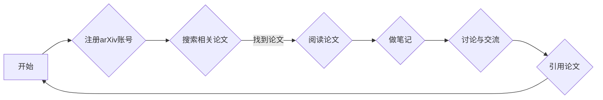

> 自动驾驶, arXiv, 学术资源, 研究技巧, 机器学习, 深度学习, 人工智能, 论文检索, 文献管理, 学术社区

# 自动驾驶研究者必读的arXiv使用攻略与技巧

自动驾驶作为人工智能领域的前沿研究方向，其发展离不开最新的研究成果。arXiv作为一个全球领先的开放获取论文预印本平台，汇集了众多自动驾驶领域的顶级研究论文。对于自动驾驶研究者来说，如何高效利用arXiv这一学术资源，掌握其中的研究技巧，对于提升研究效率和质量具有重要意义。

## 1. 背景介绍

### 1.1 自动驾驶研究的重要性

自动驾驶技术是未来交通出行的重要方向，它涉及机器学习、计算机视觉、控制理论等多个学科。随着技术的不断进步，自动驾驶汽车在安全性、舒适性、效率等方面展现出巨大的潜力。然而，自动驾驶技术的研究依然面临诸多挑战，如环境感知、决策规划、控制算法等。

### 1.2 arXiv平台的优势

arXiv是一个由康奈尔大学运营的开放获取论文预印本平台，它允许研究者免费发布和获取学术论文。arXiv在物理学、数学、计算机科学等领域有着广泛的应用，对于自动驾驶研究者来说，以下是arXiv的一些显著优势：

- **及时性**：arXiv允许研究者第一时间获取最新的研究成果，这对于自动驾驶这样快速发展的领域尤为重要。
- **多样性**：arXiv汇集了来自世界各地的学者研究成果，提供了多元化的视角和思路。
- **免费开放**：研究者无需支付任何费用即可获取论文全文，降低了研究成本。
- **跨学科交叉**：arXiv上的论文覆盖了多个学科，有助于研究者跨学科学习。

## 2. 核心概念与联系

### 2.1 arXiv的核心概念

arXiv的核心概念是“预印本”（preprint），它是指尚未经过同行评审的学术论文。预印本在正式发表前，允许作者进行广泛的同行交流和反馈，从而提高论文的质量。

### 2.2 Mermaid流程图

以下是一个Mermaid流程图，展示了自动驾驶研究者使用arXiv的典型流程：



## 3. 核心算法原理 & 具体操作步骤

### 3.1 算法原理概述

自动驾驶研究涉及多个核心算法，以下是一些关键的算法原理：

- **感知算法**：利用雷达、摄像头等传感器获取环境信息，如障碍物检测、车道线检测等。
- **决策规划算法**：根据感知信息，规划车辆的行驶轨迹和策略。
- **控制算法**：根据决策规划结果，控制车辆的实际行驶。

### 3.2 算法步骤详解

**3.2.1 感知算法**

1. **数据采集**：使用传感器收集环境数据。
2. **特征提取**：从原始数据中提取关键特征。
3. **目标检测**：识别并定位环境中的目标物体。
4. **语义分割**：对图像进行语义分割，识别不同类型的目标。

**3.2.2 决策规划算法**

1. **状态空间定义**：定义车辆和环境的状态空间。
2. **规划算法**：选择合适的规划算法，如基于模型的方法或基于搜索的方法。
3. **路径规划**：根据状态空间，规划车辆的行驶路径。

**3.2.3 控制算法**

1. **控制目标定义**：定义控制目标，如跟踪路径、保持车道等。
2. **控制策略设计**：设计控制策略，如PID控制、自适应控制等。
3. **控制实现**：实现控制算法，控制车辆的实际行驶。

### 3.3 算法优缺点

**感知算法**：

- 优点：能够获取丰富的环境信息，提高自动驾驶系统的鲁棒性。
- 缺点：计算量大，对传感器性能要求高。

**决策规划算法**：

- 优点：能够制定合理的行驶策略，提高行驶的安全性。
- 缺点：规划算法复杂，难以处理复杂场景。

**控制算法**：

- 优点：能够将决策规划结果转化为实际的控制信号。
- 缺点：控制策略设计难度高，难以保证稳定性。

### 3.4 算法应用领域

感知算法、决策规划算法和控制算法广泛应用于自动驾驶系统中，如无人驾驶汽车、无人配送车、无人环卫车等。

## 4. 数学模型和公式 & 详细讲解 & 举例说明

### 4.1 数学模型构建

自动驾驶中的数学模型主要包括：

- **概率模型**：用于描述环境中的不确定性，如高斯分布、贝叶斯网络等。
- **优化模型**：用于规划车辆行驶路径，如线性规划、非线性规划等。
- **控制模型**：用于设计控制策略，如PID控制、自适应控制等。

### 4.2 公式推导过程

以下是一个简单的线性回归公式推导过程：

假设我们有m个样本$(x_1, y_1), (x_2, y_2), ..., (x_m, y_m)$，我们的目标是找到一个线性模型$y = \beta_0 + \beta_1x$，使得预测值与真实值之间的误差最小。

定义误差函数为：

$$
E(\beta_0, \beta_1) = \frac{1}{2}\sum_{i=1}^{m} (y_i - (\beta_0 + \beta_1x_i))^2
$$

为了最小化误差函数，我们对$\beta_0$和$\beta_1$分别求偏导，并令偏导等于0，得到以下方程组：

$$
\frac{\partial E}{\partial \beta_0} = \sum_{i=1}^{m} (y_i - (\beta_0 + \beta_1x_i)) = 0
$$

$$
\frac{\partial E}{\partial \beta_1} = \sum_{i=1}^{m} x_i(y_i - (\beta_0 + \beta_1x_i)) = 0
$$

解方程组得到线性模型的参数$\beta_0$和$\beta_1$。

### 4.3 案例分析与讲解

以下是一个自动驾驶中的目标检测案例：

假设我们有一个包含N个像素的图像，每个像素的灰度值为$g_i$，我们的目标是检测图像中的物体。

定义一个二分类问题，将每个像素归为“背景”或“目标”两类。我们可以使用卷积神经网络(CNN)来实现目标检测。

### 5. 项目实践：代码实例和详细解释说明

### 5.1 开发环境搭建

以下是使用Python和TensorFlow搭建自动驾驶研究开发环境的步骤：

1. 安装Anaconda。
2. 创建Python环境并安装TensorFlow等依赖库。

### 5.2 源代码详细实现

以下是一个简单的目标检测代码示例：

```python
import tensorflow as tf

# 加载预训练模型
model = tf.keras.applications.YOLOv5()

# 加载图像
image = tf.keras.preprocessing.image.load_img('test.jpg')

# 检测目标
predictions = model.predict(image)

# 解析预测结果
# ...
```

### 5.3 代码解读与分析

以上代码展示了如何使用TensorFlow和YOLOv5模型进行目标检测。首先，我们加载了YOLOv5预训练模型，然后加载了一幅测试图像，接着使用模型进行预测，最后解析预测结果。

### 5.4 运行结果展示

运行上述代码后，我们可以在控制台看到模型的预测结果，包括检测到的物体类别和位置。

## 6. 实际应用场景

### 6.1 自动驾驶汽车

自动驾驶汽车是自动驾驶技术的典型应用场景。通过感知算法、决策规划算法和控制算法，自动驾驶汽车能够安全、高效地行驶在道路上。

### 6.2 无人配送车

无人配送车是自动驾驶技术的另一个重要应用场景。它能够在城市中自动行驶，将货物送到指定地点。

### 6.3 无人环卫车

无人环卫车能够自动清扫道路，提高环卫作业的效率和质量。

## 7. 工具和资源推荐

### 7.1 学习资源推荐

- 《深度学习》
- 《计算机视觉：算法与应用》
- 《机器人学导论》

### 7.2 开发工具推荐

- TensorFlow
- PyTorch
- OpenCV

### 7.3 相关论文推荐

- "End-to-End Learning for Self-Driving Cars"
- "Detecting and Tracking Vehicles with Deep Learning"
- "Deep Reinforcement Learning for Autonomous Navigation"

## 8. 总结：未来发展趋势与挑战

### 8.1 研究成果总结

自动驾驶技术的研究成果主要体现在感知、决策规划、控制等方面。随着技术的不断进步，自动驾驶系统将更加安全、可靠和高效。

### 8.2 未来发展趋势

- 深度学习在自动驾驶领域的应用将更加广泛。
- 多传感器融合技术将进一步提高自动驾驶系统的鲁棒性。
- 自适应和强化学习等算法将在自动驾驶领域发挥重要作用。

### 8.3 面临的挑战

- 自动驾驶系统的安全性仍然是一个挑战。
- 自动驾驶法律法规的制定需要进一步完善。
- 自动驾驶技术的普及需要时间和市场的验证。

### 8.4 研究展望

自动驾驶技术的研究将不断深入，未来有望实现真正意义上的无人驾驶。

## 9. 附录：常见问题与解答

### 9.1 常见问题

1. 自动驾驶技术的研究方向有哪些？
2. 如何选择合适的开发工具？
3. 如何获取自动驾驶领域的最新研究成果？

### 9.2 解答

1. 自动驾驶技术的研究方向包括感知、决策规划、控制、数据、安全等。
2. 选择合适的开发工具需要根据具体需求进行评估，常见的开发工具有TensorFlow、PyTorch、OpenCV等。
3. 可以通过arXiv、Google Scholar等平台获取自动驾驶领域的最新研究成果。

作者：禅与计算机程序设计艺术 / Zen and the Art of Computer Programming