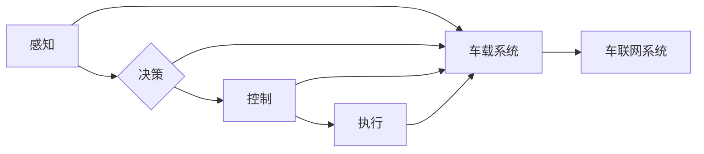
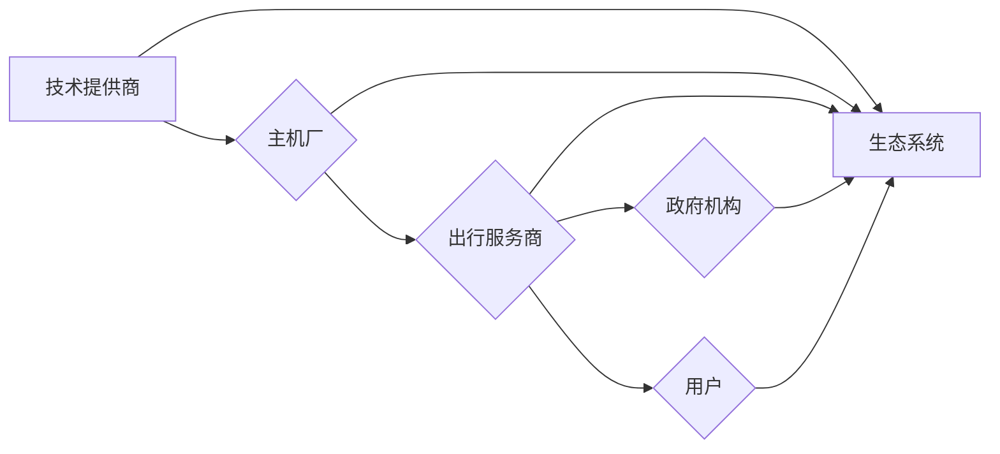

> 自动驾驶，商业模式，创新，数据驱动，生态系统，技术演进，盈利模式

# 自动驾驶行业的商业模式创新

自动驾驶技术作为21世纪最具颠覆性的技术之一，正在深刻地改变着交通、物流、城市规划和运输行业。然而，自动驾驶技术的发展和应用不仅需要强大的技术支撑，更需要创新的商业模式来推动其商业化进程。本文将深入探讨自动驾驶行业的商业模式创新，分析其核心概念、算法原理、应用场景，并展望未来发展趋势与挑战。

## 1. 背景介绍

### 1.1 自动驾驶技术发展历程

自动驾驶技术经历了从辅助驾驶到半自动驾驶，再到完全自动驾驶的三个阶段。早期的研究主要集中在感知、决策和控制等基础技术上。随着深度学习、传感器融合、高精度地图等技术的发展，自动驾驶技术逐渐从理论走向实践，商业化应用逐渐成为可能。

### 1.2 自动驾驶行业现状

目前，全球自动驾驶行业呈现出以下特点：

- **技术竞争激烈**：谷歌、百度、Uber等科技巨头，以及传统汽车制造商如奔驰、宝马等，都在积极布局自动驾驶领域。
- **投资规模庞大**：自动驾驶行业吸引了众多风险投资和政府资金，投资规模逐年增长。
- **应用场景丰富**：自动驾驶技术已应用于乘用车、商用车、物流、环卫、巡检等多个领域。

### 1.3 自动驾驶行业面临的挑战

自动驾驶技术商业化面临着诸多挑战，如：

- **技术瓶颈**：感知、决策、控制等核心技术仍需进一步突破。
- **法律法规**：自动驾驶法律法规尚不完善，存在一定的法律风险。
- **数据安全**：自动驾驶车辆收集的大量数据，涉及个人隐私和商业机密。
- **商业模式**：如何构建可持续的商业模式，是自动驾驶技术商业化的关键。

## 2. 核心概念与联系

### 2.1 自动驾驶技术架构

自动驾驶技术架构主要包括感知、决策、控制和执行四个层次。以下是Mermaid流程图展示的自动驾驶技术架构：



### 2.2 自动驾驶商业模式概念

自动驾驶商业模式涉及多个参与者和利益相关方，主要包括：

- **技术提供商**：提供自动驾驶软件、硬件、解决方案等。
- **主机厂**：负责生产自动驾驶汽车。
- **出行服务商**：提供自动驾驶出行服务。
- **政府机构**：负责制定自动驾驶相关法律法规。
- **用户**：自动驾驶汽车的使用者。

以下是Mermaid流程图展示的自动驾驶商业模式概念：



## 3. 核心算法原理 & 具体操作步骤

### 3.1 算法原理概述

自动驾驶的核心算法主要包括感知、决策和控制三个方面：

- **感知**：通过雷达、摄像头、激光雷达等传感器获取周围环境信息，并进行特征提取和目标识别。
- **决策**：根据感知信息，结合路径规划、态势估计等算法，生成合适的控制指令。
- **控制**：将决策指令转化为车辆控制信号，控制车辆行驶。

### 3.2 算法步骤详解

以下是自动驾驶算法的基本步骤：

1. **感知**：传感器数据采集、预处理、特征提取、目标识别。
2. **定位**：基于传感器数据和高精度地图，进行车辆定位和地图匹配。
3. **路径规划**：根据车辆位置和周围环境，生成车辆行驶路径。
4. **决策**：根据路径规划结果，结合态势估计，生成控制指令。
5. **控制**：将控制指令转化为车辆控制信号，控制车辆行驶。

### 3.3 算法优缺点

自动驾驶算法的优点在于：

- **安全性**：通过计算机辅助驾驶，降低交通事故发生的概率。
- **效率**：提高道路通行效率，减少拥堵。
- **便利性**：为用户提供更加便捷的出行体验。

自动驾驶算法的缺点包括：

- **技术难度高**：算法复杂，开发周期长。
- **成本高**：传感器、软件、硬件等成本高昂。
- **依赖环境**：在不同环境和天气条件下，算法性能可能受到影响。

### 3.4 算法应用领域

自动驾驶算法已应用于以下领域：

- **乘用车**：提供自动驾驶辅助功能，如自动泊车、车道保持等。
- **商用车**：提供自动驾驶物流、环卫等解决方案。
- **共享出行**：提供自动驾驶出租车、网约车等服务。
- **公共交通**：提供自动驾驶公交、轨道交通等解决方案。

## 4. 数学模型和公式 & 详细讲解 & 举例说明

### 4.1 数学模型构建

自动驾驶中的关键数学模型包括：

- **感知模型**：如卷积神经网络(CNN)、循环神经网络(RNN)等。
- **决策模型**：如深度强化学习(DRL)等。
- **控制模型**：如PID控制器、模型预测控制(MPC)等。

### 4.2 公式推导过程

以下以卷积神经网络(CNN)为例，介绍其公式推导过程：

假设输入数据为 $X \in \mathbb{R}^{m \times n}$，其中 $m$ 为特征数量，$n$ 为样本数量。卷积神经网络的基本公式如下：

$$
Y = f(WX + b)
$$

其中 $W$ 为卷积核权重，$b$ 为偏置项，$f$ 为激活函数。

### 4.3 案例分析与讲解

以下以自动驾驶中的目标检测为例，介绍CNN模型的应用：

1. **数据预处理**：将图像数据转换为CNN模型所需的格式。
2. **模型构建**：使用CNN模型对图像进行特征提取和目标检测。
3. **训练与评估**：使用标注数据对CNN模型进行训练和评估。
4. **模型部署**：将训练好的CNN模型部署到自动驾驶系统中。

## 5. 项目实践：代码实例和详细解释说明

### 5.1 开发环境搭建

以下是使用Python进行自动驾驶项目开发的开发环境搭建步骤：

1. 安装Anaconda：从官网下载并安装Anaconda，用于创建独立的Python环境。
2. 创建并激活虚拟环境：
```bash
conda create -n auto-drive python=3.8
conda activate auto-drive
```
3. 安装必要的Python库：
```bash
pip install numpy pandas matplotlib scikit-learn
```
4. 安装深度学习框架：
```bash
pip install torch torchvision torchaudio
```

### 5.2 源代码详细实现

以下是一个简单的自动驾驶项目示例代码：

```python
import torch
import torchvision.transforms as transforms
import torch.nn as nn
import torch.optim as optim

# 加载图像数据
transform = transforms.Compose([
    transforms.ToTensor(),
    transforms.Normalize(mean=[0.485, 0.456, 0.406], std=[0.229, 0.224, 0.225]),
])

# 加载预训练的ResNet模型
model = torchvision.models.resnet18(pretrained=True)

# 移除ResNet模型的顶层
num_ftrs = model.fc.in_features
model.fc = nn.Linear(num_ftrs, 2)  # 2表示两个类别：车和非车

# 损失函数和优化器
criterion = nn.CrossEntropyLoss()
optimizer = optim.SGD(model.parameters(), lr=0.001, momentum=0.9)

# 训练模型
for epoch in range(2):  # 进行2个epoch的训练
    for data in dataloader:
        images, labels = data
        images = transform(images)
        optimizer.zero_grad()
        outputs = model(images)
        loss = criterion(outputs, labels)
        loss.backward()
        optimizer.step()
```

### 5.3 代码解读与分析

以上代码展示了使用PyTorch框架进行自动驾驶项目开发的基本流程：

1. **数据预处理**：将图像数据转换为模型所需的格式，并进行归一化处理。
2. **加载预训练模型**：使用预训练的ResNet模型作为基础网络。
3. **修改模型结构**：移除ResNet模型的顶层，添加一个线性层以适应新的分类任务。
4. **定义损失函数和优化器**：使用交叉熵损失函数和SGD优化器进行模型训练。
5. **模型训练**：使用训练数据进行模型训练，并更新模型参数。

### 5.4 运行结果展示

在实际应用中，需要使用标注数据进行模型训练和评估。以下是使用训练集和测试集进行模型评估的示例代码：

```python
# 加载测试集
test_loader = DataLoader(test_dataset, batch_size=10, shuffle=False)

# 评估模型
model.eval()
correct = 0
total = 0
with torch.no_grad():
    for images, labels in test_loader:
        images = transform(images)
        outputs = model(images)
        _, predicted = torch.max(outputs.data, 1)
        total += labels.size(0)
        correct += (predicted == labels).sum().item()

print(f'Accuracy of the network on the test images: {100 * correct / total}%')
```

通过以上代码，可以计算模型在测试集上的准确率，从而评估模型性能。

## 6. 实际应用场景

### 6.1 乘用车领域

在乘用车领域，自动驾驶技术主要应用于以下场景：

- **自动泊车**：通过摄像头和超声波传感器，实现车辆自动泊车功能。
- **车道保持**：通过摄像头和雷达，实现车辆在行驶过程中自动保持车道。
- **自适应巡航控制**：通过雷达和摄像头，实现车辆在行驶过程中自动控制速度和距离。

### 6.2 商用车领域

在商用车领域，自动驾驶技术主要应用于以下场景：

- **自动驾驶卡车**：通过自动驾驶技术，实现卡车在高速公路上的自动驾驶。
- **自动驾驶物流车**：通过自动驾驶技术，实现物流车辆在配送过程中的自动驾驶。
- **自动驾驶环卫车**：通过自动驾驶技术，实现环卫车辆在清洁过程中的自动驾驶。

### 6.3 共享出行领域

在共享出行领域，自动驾驶技术主要应用于以下场景：

- **自动驾驶出租车**：通过自动驾驶技术，提供出租车出行服务。
- **自动驾驶网约车**：通过自动驾驶技术，提供网约车出行服务。
- **自动驾驶共享单车**：通过自动驾驶技术，提供共享单车出行服务。

### 6.4 公共交通领域

在公共交通领域，自动驾驶技术主要应用于以下场景：

- **自动驾驶公交车**：通过自动驾驶技术，提供公交车出行服务。
- **自动驾驶轨道交通**：通过自动驾驶技术，提供轨道交通出行服务。

## 7. 工具和资源推荐

### 7.1 学习资源推荐

为了帮助开发者系统掌握自动驾驶技术，以下推荐一些优质的学习资源：

1. 《深度学习》系列书籍：介绍深度学习的基本概念、原理和应用，适合自动驾驶技术入门。
2. 《自动驾驶》系列书籍：介绍自动驾驶技术的基本原理、架构和应用，适合深入理解自动驾驶技术。
3. 《Python深度学习》系列书籍：介绍使用Python进行深度学习的相关技术，适合自动驾驶技术实践。
4. MIT 6.S191：麻省理工学院的自动驾驶课程，提供丰富的教学资源和实践项目。
5. Uestc-Urban：四川大学智能交通实验室，提供自动驾驶相关的教学资源和研究项目。

### 7.2 开发工具推荐

以下是自动驾驶技术开发的常用工具：

1. PyTorch：开源的深度学习框架，适合自动驾驶技术研究和开发。
2. TensorFlow：开源的深度学习框架，适合自动驾驶技术研究和开发。
3. OpenCV：开源的计算机视觉库，适合自动驾驶技术中的图像处理和目标检测。
4. OpenSLAM：开源的SLAM库，适合自动驾驶技术中的定位和地图构建。
5. ROS（Robot Operating System）：开源的机器人操作系统，适合自动驾驶技术中的系统集成和测试。

### 7.3 相关论文推荐

以下是自动驾驶技术领域的相关论文推荐：

1. “A Survey of Autonomous Vehicle Perception Systems” by Carapella et al. (2017)
2. “Deep Learning for Self-Driving Cars” by LeCun, Bengio, and Hinton (2015)
3. “End-to-End Deep Learning for Self-Driving Cars” by Kurt Keutzer et al. (2017)
4. “Deep Reinforcement Learning for Autonomous Navigation” by Silver, Fortress, and Denil (2016)
5. “Multi-Agent Reinforcement Learning in Autonomous Driving” by Schulz et al. (2017)

## 8. 总结：未来发展趋势与挑战

### 8.1 研究成果总结

自动驾驶技术作为21世纪最具颠覆性的技术之一，正逐渐从理论走向实践。通过深入研究和不断创新，自动驾驶技术取得了显著的成果，为交通、物流、城市规划和运输行业带来了巨大的变革潜力。

### 8.2 未来发展趋势

未来，自动驾驶技术将呈现以下发展趋势：

1. **技术融合**：自动驾驶技术将与人工智能、大数据、物联网等技术深度融合，形成更加智能化的交通生态系统。
2. **商业化加速**：随着技术的成熟和成本的降低，自动驾驶技术将加速商业化进程，逐渐应用于更多领域。
3. **法规完善**：随着自动驾驶技术的普及，相关法律法规将逐步完善，为自动驾驶技术的应用提供保障。

### 8.3 面临的挑战

自动驾驶技术商业化面临着以下挑战：

1. **技术挑战**：感知、决策、控制等核心技术仍需进一步突破。
2. **法律法规**：自动驾驶法律法规尚不完善，存在一定的法律风险。
3. **数据安全**：自动驾驶车辆收集的大量数据，涉及个人隐私和商业机密。
4. **商业模式**：如何构建可持续的商业模式，是自动驾驶技术商业化的关键。

### 8.4 研究展望

为了应对自动驾驶技术面临的挑战，未来研究需要从以下几个方面展开：

1. **技术创新**：持续突破感知、决策、控制等核心技术，提高自动驾驶系统的稳定性和安全性。
2. **法规制定**：制定完善的自动驾驶法律法规，保障自动驾驶技术的健康发展。
3. **数据安全**：建立数据安全管理体系，保护个人隐私和商业机密。
4. **商业模式**：探索可持续的商业模式，推动自动驾驶技术的商业化进程。

总之，自动驾驶技术作为一项具有广泛应用前景的技术，将在未来交通、物流、城市规划和运输行业中发挥重要作用。通过不断的技术创新、法规完善和商业模式创新，自动驾驶技术必将在人类社会中发挥越来越重要的作用。

## 9. 附录：常见问题与解答

**Q1：自动驾驶技术商业化面临哪些挑战？**

A：自动驾驶技术商业化面临以下挑战：

- 技术挑战：感知、决策、控制等核心技术仍需进一步突破。
- 法规挑战：自动驾驶法律法规尚不完善，存在一定的法律风险。
- 数据挑战：自动驾驶车辆收集的大量数据，涉及个人隐私和商业机密。
- 商业模式挑战：如何构建可持续的商业模式，是自动驾驶技术商业化的关键。

**Q2：自动驾驶技术如何解决感知、决策、控制等技术挑战？**

A：自动驾驶技术解决感知、决策、控制等技术挑战的方法包括：

- 感知：采用多种传感器融合技术，提高感知系统的鲁棒性和可靠性。
- 决策：采用深度强化学习、多智能体系统等技术，提高决策系统的智能性和适应性。
- 控制：采用模型预测控制、自适应控制等技术，提高控制系统的稳定性和安全性。

**Q3：自动驾驶技术的法律法规如何完善？**

A：自动驾驶技术的法律法规完善可以从以下几个方面入手：

- 制定自动驾驶车辆的安全标准，确保自动驾驶车辆的安全性。
- 明确自动驾驶车辆的责任主体，明确事故责任归属。
- 建立自动驾驶数据共享机制，保障数据安全和隐私。

**Q4：如何构建可持续的自动驾驶商业模式？**

A：构建可持续的自动驾驶商业模式可以从以下几个方面入手：

- 探索多种商业模式，如产品销售、服务订阅、广告等。
- 降低自动驾驶技术的成本，提高市场竞争力。
- 加强与政府、企业、用户等各方的合作，共同推动自动驾驶技术的发展和应用。

**Q5：自动驾驶技术的未来发展前景如何？**

A：自动驾驶技术的未来发展前景十分广阔。随着技术的不断发展和成本的降低，自动驾驶技术将在交通、物流、城市规划和运输行业中发挥越来越重要的作用，为人类带来更加便捷、高效、安全的出行体验。

---

作者：禅与计算机程序设计艺术 / Zen and the Art of Computer Programming