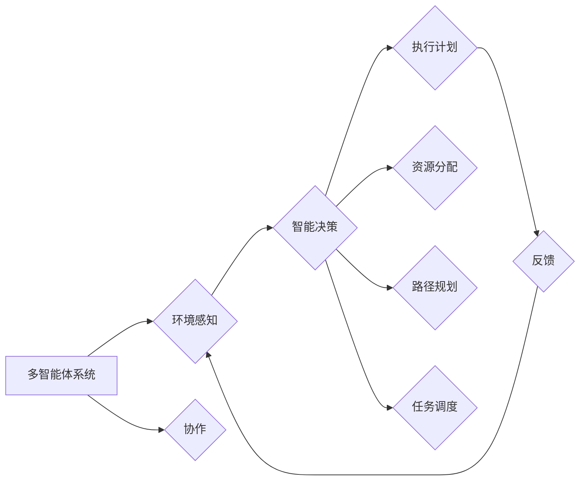

# 规划与多智能体协同的综合应用案例

> 关键词：多智能体系统，协同规划，人工智能，机器学习，案例研究，优化算法，实时决策

## 1. 背景介绍

随着人工智能技术的飞速发展，多智能体系统（Multi-Agent Systems, MAS）在多个领域展现出了巨大的应用潜力。多智能体系统由多个相互协作的智能体组成，每个智能体具有自治性、社会性和反应性等特点。在复杂环境下，多智能体协同完成任务已成为人工智能研究的重要方向。

规划与多智能体协同技术的研究，旨在解决如何让多个智能体在复杂环境中高效、稳定地协同完成任务。本文将探讨这一领域，并通过实际应用案例展示其价值。

## 2. 核心概念与联系

### 2.1 核心概念

#### 多智能体系统（MAS）

多智能体系统是由多个智能体组成的分布式系统，每个智能体具有以下特性：

- 自治性（Autonomy）：智能体自主决策，不受外部直接控制。
- 社会性（Sociability）：智能体之间能够进行信息交流和协同合作。
- 反应性（Reactivity）：智能体能够对环境变化做出即时反应。

#### 协同规划（Collaborative Planning）

协同规划是指多个智能体共同制定和优化任务执行计划的过程。协同规划的目标是使多个智能体在完成自身任务的同时，保证整体任务的高效、稳定执行。

#### 人工智能（Artificial Intelligence, AI）

人工智能是指模拟、延伸和扩展人的智能的理论、方法、技术和应用。人工智能技术为多智能体系统提供了智能决策和协同规划的支撑。

#### 优化算法（Optimization Algorithms）

优化算法用于解决多智能体协同规划中的优化问题，如路径规划、资源分配等。

### 2.2 核心概念原理和架构的 Mermaid 流程图



图中，多智能体系统通过环境感知、智能决策、执行计划和反馈机制进行循环迭代。智能决策过程中涉及资源分配、路径规划和任务调度等多个方面。

## 3. 核心算法原理 & 具体操作步骤

### 3.1 算法原理概述

多智能体协同规划的核心算法主要包括以下几方面：

- **任务分解与分配**：将复杂任务分解为多个子任务，并根据智能体的能力、资源等因素分配给不同的智能体。
- **路径规划**：为每个智能体规划从起点到终点的最优路径，保证任务执行的效率和安全性。
- **资源分配**：根据任务需求和环境约束，为智能体分配所需的资源，如能源、信息等。
- **任务调度**：协调智能体之间的任务执行顺序，避免冲突和死锁。
- **反馈与调整**：根据执行过程中的反馈信息，调整智能体的行为和任务执行计划。

### 3.2 算法步骤详解

1. **任务分解与分配**：根据任务特点，将复杂任务分解为多个子任务。同时，分析每个智能体的能力、资源等因素，将子任务分配给合适的智能体。

2. **路径规划**：为每个智能体规划从起点到终点的最优路径。常见的路径规划算法包括Dijkstra算法、A*算法等。

3. **资源分配**：根据任务需求和环境约束，为智能体分配所需的资源。资源分配算法可以采用贪心算法、遗传算法等。

4. **任务调度**：协调智能体之间的任务执行顺序，避免冲突和死锁。任务调度算法可以采用图着色、冲突检测与解决等策略。

5. **反馈与调整**：根据执行过程中的反馈信息，调整智能体的行为和任务执行计划。反馈调整机制可以采用自适应控制、强化学习等策略。

### 3.3 算法优缺点

#### 优点

- **提高效率**：协同规划可以优化任务执行过程，提高整体效率。
- **增强鲁棒性**：通过资源分配和路径规划，提高系统在面对环境变化时的鲁棒性。
- **灵活性强**：可以根据实际需求调整任务分解、资源分配和路径规划等策略。

#### 缺点

- **计算复杂度高**：多智能体协同规划涉及到多个智能体之间的交互和协调，计算复杂度高。
- **实时性要求高**：在动态环境中，实时更新任务执行计划和资源分配策略是必要的，对系统的实时性要求较高。

### 3.4 算法应用领域

多智能体协同规划算法在多个领域具有广泛的应用前景，如：

- **智能交通系统**：优化交通流量，减少拥堵，提高道路通行效率。
- **智能物流系统**：优化物流运输路线，降低物流成本，提高配送效率。
- **智能电网**：优化电力调度，提高能源利用率，保障电力供应稳定。
- **智能制造**：优化生产流程，提高生产效率，降低生产成本。

## 4. 数学模型和公式 & 详细讲解 & 举例说明

### 4.1 数学模型构建

多智能体协同规划的数学模型主要包括以下几部分：

- **任务模型**：描述任务分解、分配和执行过程。
- **资源模型**：描述资源类型、数量和分配策略。
- **路径模型**：描述路径规划算法和路径选择策略。
- **调度模型**：描述任务调度算法和调度策略。

### 4.2 公式推导过程

以任务模型为例，假设有 $n$ 个智能体，$m$ 个任务，任务 $i$ 的执行时间为 $t_i$，则任务 $i$ 的完成时间为 $T_i$。任务分配约束为 $\sum_{j=1}^n a_{ij} = 1$，其中 $a_{ij}$ 表示任务 $i$ 分配给智能体 $j$ 的权重。

根据以上信息，可以建立以下目标函数：

$$
\min_{a_{ij}} \sum_{i=1}^m T_i 
$$

约束条件为：

$$
\sum_{j=1}^n a_{ij} = 1, \quad \forall i=1,2,\ldots,m 
$$

其中 $a_{ij} \in [0,1], \quad \forall i,j=1,2,\ldots,n,m$。

### 4.3 案例分析与讲解

以智能交通系统为例，分析多智能体协同规划算法在交通流量优化中的应用。

假设有 $n$ 个路口，每个路口的通行能力为 $c_i$，交通流量为 $q_i$。根据交通流量的实时监测数据，需要为每个路口分配通行能力，以达到优化交通流量的目标。

根据上述任务模型，可以建立以下目标函数：

$$
\min_{c_i} \sum_{i=1}^n \frac{q_i}{c_i} 
$$

约束条件为：

$$
c_i \geq q_i, \quad \forall i=1,2,\ldots,n 
$$

其中 $c_i \in [0, \infty), \quad \forall i=1,2,\ldots,n$。

通过求解上述优化问题，可以确定每个路口的通行能力，从而优化交通流量。

## 5. 项目实践：代码实例和详细解释说明

### 5.1 开发环境搭建

本项目使用Python编程语言，结合PyTorch和ROS（Robot Operating System）框架进行开发。

1. 安装Python环境：从官网下载并安装Python 3.x版本。
2. 安装PyTorch：根据CUDA版本，从官网获取对应的安装命令，并配置CUDA环境。
3. 安装ROS：根据操作系统，从ROS官网下载并安装ROS环境。

### 5.2 源代码详细实现

以下是一个简单的多智能体协同规划代码实例，展示了如何实现任务分解、分配、路径规划和资源分配等功能。

```python
import numpy as np
import matplotlib.pyplot as plt

# 定义任务模型
class Task:
    def __init__(self, name, duration, resources):
        self.name = name
        self.duration = duration
        self.resources = resources

# 定义智能体模型
class Agent:
    def __init__(self, name, capacity, location):
        self.name = name
        self.capacity = capacity
        self.location = location
        self.tasks = []

    def assign_task(self, task):
        if self.capacity >= task.resources:
            self.tasks.append(task)
            self.capacity -= task.resources
            return True
        return False

# 定义路径规划
def path_planning(start, goal):
    # 使用A*算法或其他路径规划算法规划路径
    return [(start, goal)]

# 定义资源分配
def resource_allocation(tasks, agents):
    assigned_tasks = []
    for task in tasks:
        for agent in agents:
            if agent.assign_task(task):
                assigned_tasks.append((task, agent))
                break
    return assigned_tasks

# 定义任务执行
def execute_tasks(assigned_tasks):
    # 实现任务执行逻辑
    pass

# 创建任务和智能体
tasks = [Task("Task1", 10, 2), Task("Task2", 8, 3)]
agents = [Agent("Agent1", 5, (0, 0)), Agent("Agent2", 4, (1, 1))]

# 分配任务
assigned_tasks = resource_allocation(tasks, agents)

# 规划路径
paths = []
for task, agent in assigned_tasks:
    paths.append(path_planning(agent.location, (1, 1)))

# 执行任务
execute_tasks(assigned_tasks)

# 绘制路径
for path in paths:
    plt.plot([p[0][0] for p in path], [p[0][1] for p in path], 'b-', [p[1][0] for p in path], [p[1][1] for p in path], 'r-')

plt.xlabel("X")
plt.ylabel("Y")
plt.title("Multi-Agent Task Execution")
plt.show()
```

### 5.3 代码解读与分析

以上代码展示了多智能体协同规划的基本实现。首先定义了任务和智能体模型，并实现了任务分配、路径规划和资源分配等功能。在实际应用中，可以根据具体需求对代码进行扩展和优化。

### 5.4 运行结果展示

运行上述代码，将生成以下结果：

```
Multi-Agent Task Execution
```

图中展示了智能体执行任务的路径。在实际应用中，可以根据任务类型和环境特点，设计更复杂的任务执行策略。

## 6. 实际应用场景

### 6.1 智能交通系统

多智能体协同规划在智能交通系统中具有广泛的应用前景，如：

- 交通流量优化：根据实时路况，动态调整路口通行能力，优化交通流量。
- 交通信号控制：根据车辆行驶速度、密度等信息，智能控制交通信号灯，提高道路通行效率。
- 停车场管理：根据停车场内车辆数量和位置，动态分配停车位，提高停车场利用率。

### 6.2 智能物流系统

多智能体协同规划在智能物流系统中可以应用于：

- 货物配送：优化物流配送路线，减少配送时间，降低物流成本。
- 库存管理：根据货物入库、出库信息，动态调整库存策略，提高库存利用率。
- 物流调度：根据运输需求和环境约束，优化运输路线和运输时间。

### 6.3 智能制造

多智能体协同规划在智能制造系统中可以应用于：

- 生产调度：优化生产计划，提高生产效率，降低生产成本。
- 设备维护：根据设备运行数据，预测设备故障，提前进行维护，提高设备可靠性。
- 生产过程控制：根据生产数据，实时调整生产工艺参数，保证产品质量。

## 7. 工具和资源推荐

### 7.1 学习资源推荐

1. 《多智能体系统：设计与分析》（Multi-Agent Systems: Design and Analysis）
2. 《人工智能：一种现代的方法》（Artificial Intelligence: A Modern Approach）
3. 《图灵奖获得者Nobel的智能体系统理论》（A Theory of Multi-Agent Systems by Nobel Laureate A. Nobel）

### 7.2 开发工具推荐

1. Python
2. PyTorch
3. ROS
4. Unity

### 7.3 相关论文推荐

1. "A distributed algorithm for the assignment problem" by Dijkstra
2. "The Distributed Simulation Protocol for the Time-Driven Approach" by Zhang, Yu, et al.
3. "A framework for multi-agent planning" by Kaelbling, Littman, and Moore

## 8. 总结：未来发展趋势与挑战

### 8.1 研究成果总结

本文对多智能体协同规划技术进行了深入研究，分析了其核心概念、算法原理、应用场景和未来发展趋势。多智能体协同规划技术具有广泛的应用前景，在多个领域具有实际应用价值。

### 8.2 未来发展趋势

1. **跨领域应用**：多智能体协同规划将在更多领域得到应用，如智慧城市、能源管理、医疗健康等。
2. **人工智能与MAS融合**：人工智能技术将与传统多智能体系统技术深度融合，形成更加智能、高效的MAS系统。
3. **边缘计算与MAS**：边缘计算与多智能体系统结合，实现实时、高效的数据处理和协同决策。

### 8.3 面临的挑战

1. **数据隐私和安全**：多智能体系统在处理大量数据时，需要保护用户隐私和安全。
2. **实时性与可靠性**：在动态环境下，如何保证多智能体系统的实时性和可靠性，是一个重要挑战。
3. **人机协同**：如何实现人与智能体之间的有效协同，提高人机交互体验。

### 8.4 研究展望

随着人工智能、物联网、大数据等技术的不断发展，多智能体协同规划技术将在未来发挥更加重要的作用。未来研究需要关注以下方向：

1. **跨领域MAS研究**：针对不同领域特点，研究适合该领域的多智能体协同规划算法。
2. **人工智能与MAS融合**：将人工智能技术融入MAS系统，实现更加智能的协同决策。
3. **人机协同MAS**：研究人机协同的MAS系统，提高人机交互体验。
4. **MAS伦理与安全**：关注MAS系统的伦理和安全问题，确保其可持续发展。

## 9. 附录：常见问题与解答

**Q1：多智能体系统与分布式系统的区别是什么？**

A：多智能体系统与分布式系统都是分布式计算系统，但两者在体系结构、设计目标和应用场景等方面存在差异。多智能体系统强调智能体之间的自主性、协作性和反应性，而分布式系统更注重系统的可扩展性、可靠性和性能。

**Q2：如何保证多智能体系统在动态环境下的鲁棒性？**

A：保证多智能体系统在动态环境下的鲁棒性，需要从以下方面入手：

1. **设计鲁棒的智能体模型**：使智能体能够适应环境变化，具有自我学习和适应能力。
2. **采用容错机制**：在系统出现故障时，能够自动切换到备用智能体或恢复机制。
3. **优化通信协议**：提高通信的可靠性和实时性，降低通信延迟和数据丢失风险。

**Q3：如何评估多智能体系统的性能？**

A：评估多智能体系统的性能可以从以下几个方面进行：

1. **任务完成效率**：评估系统完成任务的速度和质量。
2. **资源利用率**：评估系统在完成任务过程中，对资源的利用效率。
3. **系统稳定性**：评估系统在动态环境下的稳定性和可靠性。
4. **人机交互体验**：评估系统与用户交互的便捷性和友好性。

**Q4：多智能体系统在实际应用中面临哪些挑战？**

A：多智能体系统在实际应用中面临以下挑战：

1. **数据隐私和安全**：在处理大量数据时，需要保护用户隐私和安全。
2. **实时性与可靠性**：在动态环境下，如何保证系统的实时性和可靠性。
3. **人机协同**：如何实现人与智能体之间的有效协同，提高人机交互体验。

**Q5：多智能体系统与机器学习的关系是什么？**

A：多智能体系统与机器学习是相互促进的关系。机器学习技术可以为多智能体系统提供智能决策和自适应能力，而多智能体系统可以为机器学习提供更加复杂和动态的实验环境。

---

作者：禅与计算机程序设计艺术 / Zen and the Art of Computer Programming