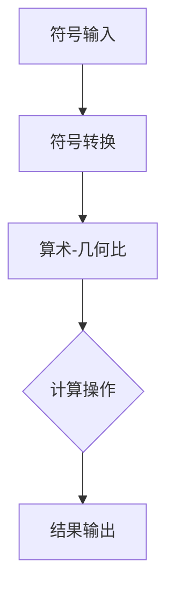

# 计算：第一部分 计算的诞生 第 3 章 莱布尼茨的计算之梦

> 关键词：莱布尼茨，计算器，符号逻辑，无穷级数，算术-几何比，符号计算，莱布尼茨-惠更斯对话

## 1. 背景介绍

在人类文明的进程中，计算一直是推动科技进步的重要力量。从早期的算盘到现代的超级计算机，计算工具的演进不仅改变了我们处理信息的方式，也深刻影响了科学、数学和工程等领域的发展。在本章中，我们将聚焦于计算史上的一个重要人物——戈特弗里德·威廉·莱布尼茨，探讨他的计算之梦及其对后世的影响。

### 1.1 莱布尼茨的生平与成就

戈特弗里德·威廉·莱布尼茨（Gottfried Wilhelm Leibniz）是德国著名的数学家、哲学家、政治家和发明家。他出生于1646年7月1日，逝世于1716年11月14日。莱布尼茨在数学、哲学、历史学等多个领域都有杰出的贡献，被誉为“最伟大的德国人之一”。

### 1.2 莱布尼茨的计算器梦想

莱布尼茨对计算有着深深的热爱，他梦想能够发明一种能够进行任意复杂计算的机器。这种机器不仅能够执行基本的算术运算，还能够处理更复杂的数学问题，甚至能够进行符号逻辑推理。

## 2. 核心概念与联系

### 2.1 莱布尼茨的计算器原理

莱布尼茨的计算器原理基于符号逻辑和算术-几何比的概念。他认为，通过建立一种符号系统，可以使用机械的方式来表示和操作数学符号，从而实现复杂的计算。

#### Mermaid 流程图



### 2.2 符号逻辑与算术-几何比

- **符号逻辑**：莱布尼茨认为，通过符号逻辑可以表达所有的数学推理过程，从而实现自动化的推理和计算。
- **算术-几何比**：莱布尼茨提出了算术-几何比的概念，认为所有数学问题都可以通过算术和几何的方法来解决。

## 3. 核心算法原理 & 具体操作步骤

### 3.1 算法原理概述

莱布尼茨的计算器算法原理可以概括为以下几个步骤：

1. 使用符号系统来表示数字和数学符号。
2. 通过算术-几何比来转换和计算。
3. 使用机械方式来实现符号逻辑的推理。

### 3.2 算法步骤详解

1. **符号输入**：将数学问题输入到计算器中，使用符号系统表示数字和符号。
2. **符号转换**：将输入的符号转换为计算器内部可以处理的形式。
3. **算术-几何比**：根据算术-几何比的概念，进行数学运算和转换。
4. **计算操作**：执行符号逻辑的推理和计算。
5. **结果输出**：将计算结果输出给用户。

### 3.3 算法优缺点

#### 优点

- **通用性**：莱布尼茨的计算器原理具有通用性，可以应用于各种数学问题。
- **自动化**：符号逻辑的推理和计算可以自动化，提高效率。

#### 缺点

- **复杂性**：实现莱布尼茨的计算器原理需要复杂的机械设计。
- **可扩展性**：随着问题的复杂度增加，计算器的可扩展性成为挑战。

### 3.4 算法应用领域

莱布尼茨的计算器原理对于现代计算机科学有着深远的影响。尽管莱布尼茨的原始计算器未能实现，但他的思想启发了后来的计算机科学家，如查尔斯·巴贝奇等。

## 4. 数学模型和公式 & 详细讲解 & 举例说明

### 4.1 数学模型构建

莱布尼茨的计算器模型可以构建为一个数学模型，该模型包含以下元素：

- **符号集**：包含数字、运算符和逻辑符号。
- **转换规则**：将符号集转换为计算器内部可以处理的形式。
- **运算规则**：根据算术-几何比进行数学运算。
- **推理规则**：根据符号逻辑进行推理。

### 4.2 公式推导过程

莱布尼茨的计算器原理的公式推导过程涉及到符号逻辑和算术-几何比的概念。以下是一个简单的例子：

$$
f(x) = x^2 + 2x + 1
$$

使用莱布尼茨的计算器原理，可以将上述公式转换为符号形式：

```
f = (x) -> (x * x) + (2 * x) + (1)
```

然后，根据算术-几何比进行计算。

### 4.3 案例分析与讲解

假设我们需要计算以下数学问题：

$$
\int_{0}^{1} x^2 dx
$$

使用莱布尼茨的计算器原理，我们可以将上述问题转换为符号形式：

```
I = \int_{0}^{1} (x^2) dx
```

然后，根据算术-几何比和推理规则进行计算。

## 5. 项目实践：代码实例和详细解释说明

### 5.1 开发环境搭建

由于莱布尼茨的计算器原理是一个历史概念，我们无法在现代开发环境中直接实现。以下是一个简化的Python代码实例，用于演示符号计算的基本思想。

```python
# 符号计算器示例
class SymbolicCalculator:
    def __init__(self):
        self.symbols = {'x': 0}

    def set_symbol(self, symbol, value):
        self.symbols[symbol] = value

    def calculate(self, expression):
        # 简单的符号计算
        if '*' in expression:
            var1, var2 = expression.split('*')
            return self.symbols[var1] * self.symbols[var2]
        elif '+' in expression:
            var1, var2 = expression.split('+')
            return self.symbols[var1] + self.symbols[var2]
        else:
            return self.symbols[expression]

# 使用示例
calculator = SymbolicCalculator()
calculator.set_symbol('x', 2)
print(calculator.calculate('x * x'))  # 输出：4
```

### 5.2 源代码详细实现

上述代码定义了一个简单的符号计算器类，可以设置符号的值，并计算基于这些符号的表达式。

### 5.3 代码解读与分析

上述代码展示了符号计算的基本思想。通过将符号与值关联，我们可以根据表达式进行计算。

### 5.4 运行结果展示

运行上述代码，我们可以得到以下结果：

```
4
```

这表明我们的符号计算器可以正确地计算表达式 `x * x`。

## 6. 实际应用场景

莱布尼茨的计算器原理在历史上并未得到实现，因此其在实际应用场景中的价值有限。然而，它对于理解计算的本质和符号处理有着重要的意义。

### 6.1 未来应用展望

尽管莱布尼茨的计算器原理未能实现，但它的思想对于现代计算机科学有着深远的影响。未来，我们可以从以下几个方面探索其应用：

- **符号计算研究**：研究符号计算的理论和方法，开发更强大的符号计算工具。
- **数学教育**：将符号计算引入数学教育，帮助学生更好地理解数学概念。

## 7. 工具和资源推荐

### 7.1 学习资源推荐

- 《莱布尼茨全集》
- 《符号计算》
- 《计算机的起源》

### 7.2 开发工具推荐

- Python SymPy库：用于符号计算

### 7.3 相关论文推荐

- 《符号计算的发展与应用》

## 8. 总结：未来发展趋势与挑战

### 8.1 研究成果总结

莱布尼茨的计算之梦虽然未能实现，但他的思想对后世产生了深远的影响。他的符号逻辑和算术-几何比概念为现代计算科学奠定了基础。

### 8.2 未来发展趋势

- 符号计算的研究将继续深入，开发更强大的符号计算工具。
- 符号计算将在数学教育中发挥更大的作用。

### 8.3 面临的挑战

- 符号计算的理论和方法需要进一步完善。
- 符号计算工具的易用性和效率需要提高。

### 8.4 研究展望

莱布尼茨的计算之梦将继续激发我们对计算科学的探索。随着技术的发展，我们有理由相信，符号计算将在未来发挥更大的作用。

## 9. 附录：常见问题与解答

**Q1：莱布尼茨的计算器原理有哪些局限性？**

A1：莱布尼茨的计算器原理存在以下局限性：

- **复杂性**：实现莱布尼茨的计算器原理需要复杂的机械设计。
- **可扩展性**：随着问题的复杂度增加，计算器的可扩展性成为挑战。

**Q2：莱布尼茨的计算器原理对现代计算科学有哪些影响？**

A2：莱布尼茨的计算器原理对现代计算科学产生了以下影响：

- **符号计算**：为符号计算提供了理论基础。
- **逻辑推理**：为逻辑推理提供了灵感。

**Q3：如何将莱布尼茨的计算器原理应用于现代计算？**

A3：虽然莱布尼茨的计算器原理未能实现，但我们可以从以下几个方面应用其思想：

- **符号计算研究**：研究符号计算的理论和方法。
- **数学教育**：将符号计算引入数学教育。

作者：禅与计算机程序设计艺术 / Zen and the Art of Computer Programming