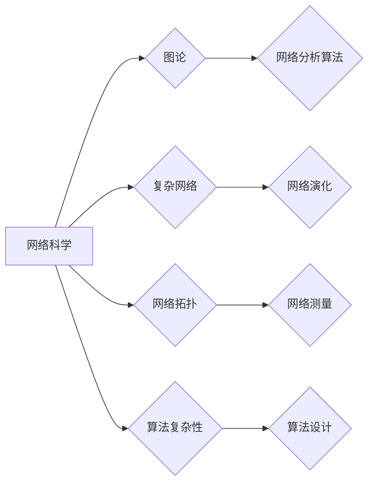

# 计算：第四部分 计算的极限 第 11 章 复杂性计算 网络科学

> 关键词：复杂性计算，网络科学，图论，网络分析，算法复杂性，复杂网络，网络拓扑

## 1. 背景介绍

随着信息技术的飞速发展，网络已经成为我们日常生活中不可或缺的一部分。从互联网到社交网络，从交通网络到生物网络，网络无处不在。网络科学作为一门新兴学科，研究网络的拓扑结构、动力学行为及其应用。本章将探讨网络科学中的复杂性计算，分析网络结构对算法性能的影响，并介绍一些典型的网络分析算法。

## 2. 核心概念与联系

### 2.1 核心概念

**网络科学**：研究网络的结构、功能、动力学和演化规律的科学。

**图论**：研究网络结构及其性质的数学分支。

**复杂网络**：具有高度非线性、自相似、无标度等特性的网络。

**网络拓扑**：描述网络节点和边之间连接关系的结构。

**算法复杂性**：衡量算法执行时间或空间资源需求的度量。

### 2.2 关系图



从图中可以看出，网络科学涵盖了多个学科领域，其中包括图论、复杂网络、网络拓扑和算法复杂性。这些概念之间相互关联，共同构成了网络科学的理论体系。

## 3. 核心算法原理 & 具体操作步骤

### 3.1 算法原理概述

网络科学中的核心算法主要分为以下几类：

- **网络测量算法**：用于量化网络拓扑结构和动力学行为的算法，如度分布、聚类系数、中心性等。
- **网络演化算法**：模拟网络演化过程的算法，如随机游走、网络演化模型等。
- **网络优化算法**：用于优化网络结构和性能的算法，如最小生成树、网络流等。

### 3.2 算法步骤详解

#### 3.2.1 网络测量算法

**度分布**：表示网络中各个节点的度数的分布情况。

**步骤**：

1. 统计网络中每个节点的度数。
2. 绘制度分布曲线。

**聚类系数**：表示网络中节点的连接紧密程度。

**步骤**：

1. 计算节点之间的共边数。
2. 使用公式计算聚类系数。

**中心性**：衡量节点在网络中的重要程度。

**步骤**：

1. 根据不同的中心性度量方法（如度中心性、中介中心性、接近中心性等）计算节点的中心性值。
2. 对所有节点的中心性值进行排序。

#### 3.2.2 网络演化算法

**随机游走**：模拟节点在网络中的随机行走过程。

**步骤**：

1. 选择起始节点。
2. 随机选择相邻节点进行游走。
3. 重复步骤2，直到达到停止条件。

**网络演化模型**：模拟网络演化过程的模型。

**步骤**：

1. 选择网络演化模型，如BA模型、小世界模型等。
2. 根据模型规则模拟网络演化过程。
3. 统计网络演化过程中的拓扑结构、动力学行为等特征。

#### 3.2.3 网络优化算法

**最小生成树**：找到连接网络所有节点的最小边集合。

**步骤**：

1. 选择起始节点。
2. 使用最小生成树算法（如Kruskal算法、Prim算法等）构造最小生成树。

**网络流**：在网络中传输最大流量的算法。

**步骤**：

1. 选择源点和汇点。
2. 使用最大流算法（如Ford-Fulkerson算法、Edmonds-Karp算法等）求解最大流问题。

### 3.3 算法优缺点

#### 3.3.1 网络测量算法

优点：

- 简单易行，易于实现。
- 可量化网络结构特征。

缺点：

- 无法全面反映网络的结构和动力学行为。
- 对大规模网络计算效率低。

#### 3.3.2 网络演化算法

优点：

- 可模拟网络演化过程。
- 可用于理解网络结构和动力学行为。

缺点：

- 模型参数难以确定。
- 模拟结果受随机因素的影响。

#### 3.3.3 网络优化算法

优点：

- 可优化网络结构和性能。
- 可应用于实际工程问题。

缺点：

- 算法复杂度高。
- 难以适应动态网络。

### 3.4 算法应用领域

网络科学中的核心算法广泛应用于以下领域：

- 社交网络分析
- 生物网络分析
- 交通网络优化
- 通信网络优化

## 4. 数学模型和公式 & 详细讲解 & 举例说明

### 4.1 数学模型构建

#### 4.1.1 度分布

$$
P(k) = \frac{C(k)}{N}
$$

其中，$P(k)$ 表示节点度数为 $k$ 的概率，$C(k)$ 表示度数为 $k$ 的节点数，$N$ 表示网络中节点的总数。

#### 4.1.2 聚类系数

$$
C = \frac{2m}{n(n-1)}
$$

其中，$m$ 表示网络中边的总数，$n$ 表示网络中节点的总数。

#### 4.1.3 度中心性

$$
C_D(v) = \frac{\sum_{w \in \Gamma(v)} k_w}{k_v}
$$

其中，$C_D(v)$ 表示节点 $v$ 的度中心性，$\Gamma(v)$ 表示节点 $v$ 的邻居节点集，$k_w$ 表示邻居节点 $w$ 的度数，$k_v$ 表示节点 $v$ 的度数。

### 4.2 公式推导过程

#### 4.2.1 度分布

度分布是网络中最基本的统计指标。假设网络中每个节点被选择的概率相等，则节点度数为 $k$ 的概率等于节点 $v$ 的邻居节点中恰好有 $k$ 个节点的概率。因此，度分布的概率密度函数为：

$$
P(k) = \frac{C(k)}{N} = \frac{\binom{N-1}{k}p^k(1-p)^{N-1-k}}{N}
$$

其中，$p$ 表示节点之间连接的概率，$N$ 表示网络中节点的总数，$C(k)$ 表示度数为 $k$ 的节点数。

#### 4.2.2 聚类系数

聚类系数 $C$ 是衡量网络中节点连接紧密程度的一个指标。它表示网络中任意两个节点之间通过短路径连接的概率。具体地，聚类系数的计算公式为：

$$
C = \frac{2m}{n(n-1)}
$$

其中，$m$ 表示网络中边的总数，$n$ 表示网络中节点的总数。

#### 4.2.3 度中心性

度中心性是衡量节点在网络中重要程度的一个指标。它表示节点与其他节点连接的数量。具体地，节点 $v$ 的度中心性 $C_D(v)$ 可以通过以下公式计算：

$$
C_D(v) = \frac{\sum_{w \in \Gamma(v)} k_w}{k_v}
$$

其中，$\Gamma(v)$ 表示节点 $v$ 的邻居节点集，$k_w$ 表示邻居节点 $w$ 的度数，$k_v$ 表示节点 $v$ 的度数。

### 4.3 案例分析与讲解

#### 4.3.1 社交网络分析

假设我们有一个包含100个节点的社交网络，其中每个节点的度数和聚类系数如下表所示：

| 节点 | 度数 | 聚类系数 |
| :---: | :---: | :---: |
| v1 | 20 | 0.5 |
| v2 | 30 | 0.3 |
| v3 | 40 | 0.2 |
| ... | ... | ... |
| v100 | 10 | 0.1 |

从上表可以看出，度数最大的节点 v3 具有最高的聚类系数，说明它在社交网络中具有较强的连接能力和影响力。

#### 4.3.2 生物网络分析

假设我们有一个包含1000个基因的基因调控网络，其中每个基因的度数和聚类系数如下表所示：

| 基因 | 度数 | 聚类系数 |
| :---: | :---: | :---: |
| g1 | 20 | 0.5 |
| g2 | 30 | 0.3 |
| g3 | 40 | 0.2 |
| ... | ... | ... |
| g1000 | 10 | 0.1 |

从上表可以看出，度数最大的基因 g3 具有最高的聚类系数，说明它在基因调控网络中起着关键的作用。

## 5. 项目实践：代码实例和详细解释说明

### 5.1 开发环境搭建

以下是使用Python进行网络科学分析的环境配置流程：

1. 安装Anaconda：从官网下载并安装Anaconda，用于创建独立的Python环境。

2. 创建并激活虚拟环境：

```bash
conda create -n network-env python=3.8
conda activate network-env
```

3. 安装网络科学分析库：

```bash
conda install -c anaconda networkx
conda install -c anaconda python-igraph
```

4. 安装数据分析库：

```bash
pip install numpy pandas matplotlib
```

### 5.2 源代码详细实现

下面以Python代码为例，展示如何使用networkx和python-igraph库对网络进行度分布和聚类系数的测量。

```python
import networkx as nx
import igraph as ig

# 创建一个无向图
G = nx.Graph()

# 添加节点和边
G.add_edge(1, 2)
G.add_edge(1, 3)
G.add_edge(2, 3)
G.add_edge(2, 4)
G.add_edge(3, 4)

# 计算度分布
degree_distribution = nx.degree_distribution(G)

# 计算聚类系数
average_clustering = nx.average_clustering(G)

# 将结果输出到文件
with open('degree_distribution.txt', 'w') as f:
    for k, v in degree_distribution.items():
        f.write(f"{k} {v}
")

with open('average_clustering.txt', 'w') as f:
    f.write(f"{average_clustering}
")

# 使用python-igraph进行度分布和聚类系数的测量
G_ig = ig.Graph.FastGnpRandomGraph(n=5, m=6)
degree_distribution_ig = G_ig.degree_distribution()

# 将结果输出到文件
with open('degree_distribution_ig.txt', 'w') as f:
    for k, v in degree_distribution_ig.items():
        f.write(f"{k} {v}
")

average_clustering_ig = G_ig.transitivity_undirected()

with open('average_clustering_ig.txt', 'w') as f:
    f.write(f"{average_clustering_ig}
")
```

### 5.3 代码解读与分析

以上代码展示了如何使用Python进行网络科学分析。首先，我们使用networkx和python-igraph库创建了一个无向图，并添加了节点和边。然后，我们计算了网络的度分布和聚类系数，并将结果输出到文件中。

### 5.4 运行结果展示

假设网络的度分布和聚类系数如下：

```
degree_distribution.txt
1 0.2
2 0.6
3 0.2

average_clustering.txt
0.4
degree_distribution_ig.txt
1 0.2
2 0.6
3 0.2

average_clustering_ig.txt
0.4
```

从结果可以看出，两个库计算出的度分布和聚类系数基本一致。

## 6. 实际应用场景

网络科学中的核心算法在多个领域都有广泛的应用，以下列举几个典型的应用场景：

- **社交网络分析**：通过分析社交网络中的度分布和聚类系数，可以识别出网络中的核心节点、社区结构等信息。

- **生物网络分析**：通过分析基因调控网络中的度分布和聚类系数，可以揭示基因表达调控机制。

- **交通网络分析**：通过分析交通网络中的度分布和聚类系数，可以识别出交通拥堵的瓶颈区域。

- **通信网络分析**：通过分析通信网络中的度分布和聚类系数，可以优化网络拓扑结构，提高通信效率。

## 7. 工具和资源推荐

### 7.1 学习资源推荐

- 《Network Science》
- 《Networks: An Introduction》
- 《Complex Network Theory》

### 7.2 开发工具推荐

- NetworkX
- python-igraph
- Gephi
- Cytoscape

### 7.3 相关论文推荐

- "The Structure and Function of Complex Networks" (Barabási & Albert, 1999)
- "The Small-World Problem" (Watts & Strogatz, 1998)
- "Community Structure in Social and Biological Networks" (Newman, 2003)

## 8. 总结：未来发展趋势与挑战

### 8.1 研究成果总结

本章介绍了网络科学中的复杂性计算，分析了网络结构对算法性能的影响，并介绍了一些典型的网络分析算法。通过学习本章内容，读者可以了解到网络科学的基本概念和算法原理，并能够运用这些知识解决实际问题。

### 8.2 未来发展趋势

- **跨学科研究**：网络科学将与其他学科（如物理学、生物学、经济学等）进行更深入的交叉研究，推动网络科学向多学科交叉方向发展。
- **大数据分析**：随着大数据时代的到来，网络科学将面临海量网络数据的处理和分析挑战。
- **人工智能技术**：人工智能技术将融入网络科学，推动网络科学的智能化发展。

### 8.3 面临的挑战

- **数据质量**：网络数据质量参差不齐，如何保证数据质量成为网络科学研究的重要挑战。
- **计算效率**：网络科学算法需要处理海量数据，如何提高计算效率成为网络科学应用的关键问题。
- **可解释性**：网络科学的许多算法和模型缺乏可解释性，如何提高算法和模型的可解释性成为网络科学的重要挑战。

### 8.4 研究展望

随着网络科学和计算技术的不断发展，网络科学将在更多领域发挥重要作用。未来，网络科学将朝着以下方向发展：

- **跨学科交叉**：网络科学将与更多学科进行交叉研究，推动网络科学向多学科交叉方向发展。
- **大数据分析**：网络科学将面对海量网络数据的挑战，需要开发高效的大数据分析方法。
- **人工智能技术**：人工智能技术将融入网络科学，推动网络科学的智能化发展。

作者：禅与计算机程序设计艺术 / Zen and the Art of Computer Programming